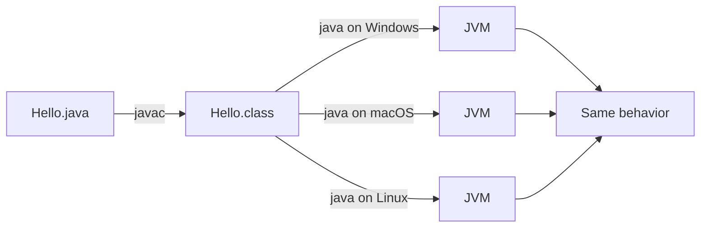

# Exercise 2 — Platform Independence (WORA)

**Module 1** · Pre-lab practice · Checkpoint A (with Exercise 1)  
**Folder:** `examples/module-01-exercises/` ([setup](EXERCISES-INDEX.md))


## Activity card

| | |
| --- | --- |
| **Objective** | Prove the JVM runs **bytecode**, not source — and fix a broken launch path |
| **Skills practiced** | Re-running `.class`, diagnosing wrong `java` usage, short WORA notes |
| **Expected outcome** | Program runs without recompile; debug challenge fixed; `notes/wora-notes.md` written |
| **Estimated time** | 10–12 minutes |
| **Files** | Reuse `Hello.class`; create `notes/wora-notes.md`; debug `WoraProbe.java` |

## What you will learn

- Difference between `.java` (source), `.class` (bytecode), and JVM (`java`)
- Why the same `.class` can run on Windows/macOS/Linux without recompile
- How to spot the common mistake `java Hello.java`

**Enterprise context:** CI builds a JAR once; OpenShift/Kubernetes pods pull the same image across nodes. WORA is why “it compiled on my laptop” still fails only when the **runtime** (JDK version / flags) differs — not because the OS needs a new compile of your source.

## Easy idea (WORA)

| Piece | What it is | Portable? |
| ----- | ---------- | --------- |
| `.java` source | What you type | Text is portable; OS does not execute it |
| `.class` bytecode | Output of `javac` | Yes — same bytes on Windows/macOS/Linux |
| JVM (`java`) | Runtime that understands bytecode | Installed per OS |



## Predict the Output

You already have `Hello.class` from Exercise 1. **Without** running `javac` again:

1. Predict: does `java Hello` still print `Hello, JVM!`?
2. Predict: if you **delete** `Hello.java` but keep `Hello.class`, does `java Hello` still work?

Then verify both predictions (restore `Hello.java` afterward if you deleted it).

## Part A — Re-run bytecode (hands-on)

**Windows:**

```powershell
cd $env:USERPROFILE\java-bootcamp\examples\module-01-exercises
java Hello
```

**macOS:**

```bash
cd ~/java-bootcamp/examples/module-01-exercises
java Hello
```

**Expected:**

```text
Hello, JVM!
```

## Part B — Debug challenge (not copy-only)

Create `WoraProbe.java` from [`starter/WoraProbe.java`](starter/WoraProbe.java) **or** paste:

```java
public class WoraProbe {
    public static void main(String[] args) {
        // TODO: print the OS name (hint: System.getProperty("os.name"))
        _____
        // TODO: print "Bytecode runs on: " + that OS name
        _____
    }
}
```

**Do this:**

1. Fill TODOs so the program prints two lines (OS name, then a labeled line).
2. Compile: `javac WoraProbe.java`
3. **Broken command (intentional):** run `java WoraProbe.java`  
   - **JDK 8–10 expected failure:** launcher error / wrong usage — note the message.
   - **JDK 11+ (verified Temurin 21.0.11 on Windows):** this does **not** fail. Source-file mode compiles and runs the `.java` in one step and prints the same two lines. Still record what you saw.
4. **Intended habit:** run `javac WoraProbe.java` then `java WoraProbe` (no `.java`).
5. Save notes under `java-bootcamp/notes/wora-notes.md`:

```text
javac turned Hello.java into Hello.class (bytecode).
The java command starts a JVM that runs that bytecode — I did not need to recompile to run Hello again.
Any OS with a compatible JVM can run the same .class without changing the source — Write Once, Run Anywhere.
Mistake I hit: java ClassName.java is wrong; use java ClassName after javac.
```

**Sample success output (OS name varies):**

```text
Windows 11
Bytecode runs on: Windows 11
```

## Troubleshooting

| Problem | Fix |
| ------- | --- |
| `Could not find or load main class Hello` | Confirm `Hello.class` exists; `cd` to exercises folder |
| `java WoraProbe.java` fails | Correct — use `java WoraProbe` after `javac` |
| Property prints `null` | Use `"os.name"` exactly |

## Pass criteria

_Check **Pass** or **Fail** yourself. Do not write these marks anywhere — nothing is submitted or graded. Commit your work to your GitHub repo._

| # | Confirm | Self-check |
| - | ------- | ---------- |
| 1 | Re-ran `Hello` without recompiling | Pass / Fail |
| 2 | `WoraProbe` runs with `java WoraProbe`; wrong `.java` launch documented | Pass / Fail |
| 3 | `notes/wora-notes.md` explains source vs bytecode vs JVM | Pass / Fail |
