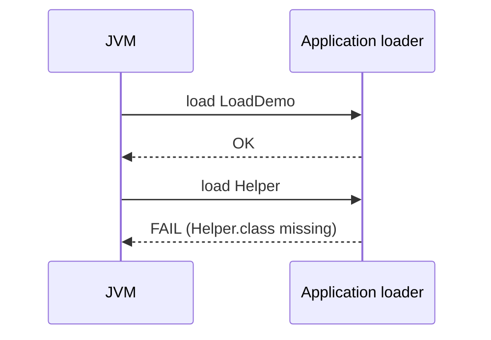

# Exercise 4 — Watch Class Loading

**Module 1** · Pre-lab practice · Checkpoint C  
**Folder:** `examples/module-01-exercises/` (see [EXERCISES-INDEX.md](EXERCISES-INDEX.md) setup)


## Activity card

| | |
| --- | --- |
| **Objective** | Identify which loader loads your class vs `String`, then fix a missing-class failure |
| **Skills practiced** | `java -verbose:class`, reading load lines, diagnosing `NoClassDefFoundError` / missing `.class` |
| **Expected outcome** | Loader notes written; `LoadDemo` runs after fix |
| **Estimated time** | 12–15 minutes |
| **Files** | Reuse `Hello`; create `LoadDemo.java` (+ temporary missing class) |

## What you will learn

- Bootstrap loader owns core JDK types (`java.lang.String`)
- Application loader owns your project `.class` files
- What happens when a referenced class file is missing

**Enterprise context:** Healthcare / claims services often fail at startup with class-path errors. Reading `-verbose:class` (or modern `-Xlog:class+load`) is how ops proves “was this class ever loaded?”

## Part A — Observe loaders (reuse Hello)

From the exercises folder (after `javac Hello.java`):

**Windows:**

```powershell
cd $env:USERPROFILE\java-bootcamp\examples\module-01-exercises
java -verbose:class Hello 2>&1 | Select-String "Hello|String"
```

**macOS:**

```bash
cd ~/java-bootcamp/examples/module-01-exercises
java -verbose:class Hello 2>&1 | grep -E "Hello|String"
```

| Line contains | Loaded by | Why |
| -------------- | --------- | --- |
| `java.lang.String` | Bootstrap (`jrt:/java.base` / shared objects) | Core JDK |
| `Hello` | Application (your folder path) | Your code |

**Write in notes (2 lines):** Which loader loaded `Hello`? Which loaded `String`?

## Part B — Debug challenge (hands-on)

1. Create `Helper.java`:

```java
public class Helper {
    public static String tag() {
        return "helper-ok";
    }
}
```

2. Create `LoadDemo.java` from [`starter/LoadDemo.java`](starter/LoadDemo.java) or:

```java
public class LoadDemo {
    public static void main(String[] args) {
        // TODO: print Helper.tag()
        _____
    }
}
```

3. Compile **both**: `javac Helper.java LoadDemo.java`
4. Run: `java LoadDemo` → expect `helper-ok`
5. **Break it:** delete `Helper.class` only (keep `Helper.java` and `LoadDemo.class`).
6. Run `java LoadDemo` again — **predict** the error, then confirm.
7. **Fix:** recompile `javac Helper.java` (or both) and re-run.

**Expected when broken:** error mentioning `Helper` / `NoClassDefFoundError` or `ClassNotFoundException` (wording varies by JDK).  
**Expected when fixed:**

```text
helper-ok
```

**Sequence diagram (what failed):**



## Troubleshooting

| Problem | Fix |
| ------- | --- |
| No `Hello` lines in verbose output | Filter wrong; try without filter once |
| `LoadDemo` fails after delete | Expected — restore with `javac Helper.java` |
| Compiled only `LoadDemo` | Always compile dependencies together |

## Pass criteria

_Check **Pass** or **Fail** yourself. Do not write these marks anywhere — nothing is submitted or graded. Commit your work to your GitHub repo._

| # | Confirm | Self-check |
| - | ------- | ---------- |
| 1 | Identified loaders for `Hello` vs `String` | Pass / Fail |
| 2 | Reproduced missing-`Helper.class` failure and fixed it | Pass / Fail |
