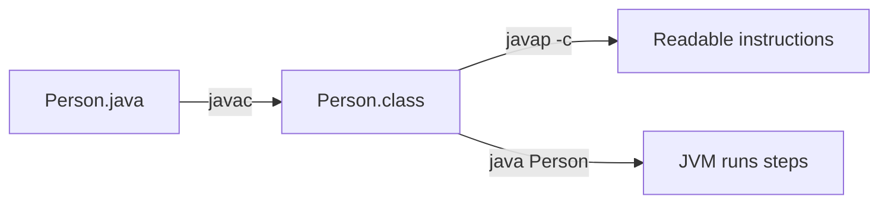

# Exercise 8 — Inspect Bytecode

**Module 1** · Pre-lab practice · Checkpoint G (after demos / before Lab 1)  
**Folder:** `examples/module-01-exercises/` ([setup](EXERCISES-INDEX.md))


## Activity card

| | |
| --- | --- |
| **Objective** | Disassemble `Person` with `javap -c` and explain three opcodes |
| **Skills practiced** | `javap`, reading bytecode, linking opcodes to Java source |
| **Expected outcome** | Notes name three of: `new`, `ldc`, `invokevirtual`, `aload`, `return` |
| **Estimated time** | 10–12 minutes |
| **File** | Reuse compiled `Person.class` from Exercise 7 |

## What you will learn

- `javac` produces instructions the JVM runs; `javap` only *shows* them
- How `new Person(...)` and `display()` look as bytecode chapters
- That you do **not** need to memorize every opcode — pattern recognition matters

**Enterprise context:** When a production jar “behaves oddly,” engineers sometimes `javap` a class to confirm what was actually shipped (wrong overload, missing method) without guessing from source alone.

## Big picture



## Do this

```powershell
cd $env:USERPROFILE\java-bootcamp\examples\module-01-exercises
javap -c Person
```

```bash
cd ~/java-bootcamp/examples/module-01-exercises
javap -c Person
```

### Three opcodes to remember

| Opcode | Everyday meaning |
| ------ | ---------------- |
| `new` | Create a new object |
| `ldc` | Load a constant (e.g. `"Aman"`) |
| `invokevirtual` | Call an instance method (`display`, `println`) |
| `aload` / `aload_0` | Load an object reference (`this` / local) |
| `return` | Done |

**Before vs After (mental model):**

| Before | After |
| ------ | ----- |
| “The JVM runs my `.java` file” | “The JVM runs bytecode steps produced by `javac`” |

### Hands-on completion (not passive reading)

In `notes/javap-person.md` (under `java-bootcamp/notes/`), write:

1. One sentence for what the constructor bytecode does
2. One sentence for what `display` bytecode does
3. Three opcodes you saw and what each means

Optional: look at the output yourself. Do not take a screenshot.

## Predict the Output

If you change `"Aman"` to `"Riya"` in source but **forget** `javac` before `java Person`, what still prints? Why?  
Then recompile and confirm.

## Troubleshooting

| Problem | Fix |
| ------- | --- |
| `Error: class not found: Person` | Compile first; `cd` to exercises folder |
| Overwhelmed by `-v` output | Use `javap -c` only (skip `-v` for now) |
| Cannot find three opcodes | Look in `main` for `new`, `ldc`, `invokevirtual` |

## Pass criteria

_Check **Pass** or **Fail** yourself. Do not write these marks anywhere — nothing is submitted or graded. Commit your work to your GitHub repo._

| # | Confirm | Self-check |
| - | ------- | ---------- |
| 1 | `javap -c Person` ran successfully | Pass / Fail |
| 2 | Three opcodes explained in notes | Pass / Fail |

---

## Next

Exercises 1–8 complete → OS how-to → [`../lab1/LAB-1-WINDOWS.md`](../lab1/LAB-1-WINDOWS.md) or [`../lab1/LAB-1-MACOS.md`](../lab1/LAB-1-MACOS.md) → [`../lab1/LAB-1-GUIDE.md`](../lab1/LAB-1-GUIDE.md) (`examples/jvm-compilation-lab/`).
