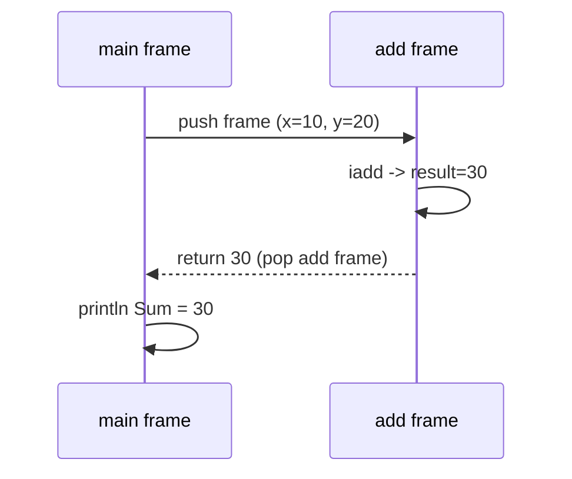
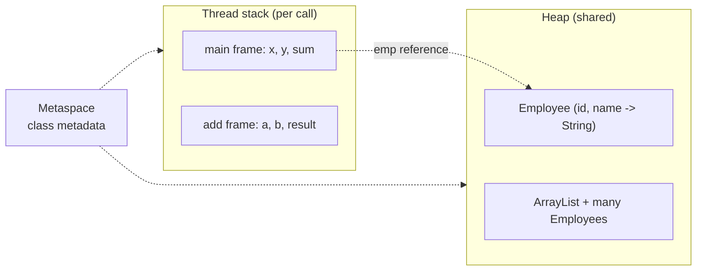

# Lab 1: JVM and Compilation

> **Participants:** Module sequence is in [`../README.md`](../README.md). **Do not start this guide until** you have finished Module 1 [pre-lab exercises 1–8](../exercises/EXERCISES-INDEX.md). Then open **one** OS how-to ([Windows](LAB-1-WINDOWS.md) · [macOS](LAB-1-MACOS.md)). In class, prefer the **45-minute timed path** with [`starter/`](starter/README.md); the **full path** is every Step below (homework / extended). Complete the starter TODOs yourself. See [Which file do I open?](../../../_PARTICIPANT-FILE-GUIDE.md).

## Activity card

| | |
| --- | --- |
| **Objective** | Consolidate Exercises 1–8 into practice work: compile/run four classes, inspect bytecode, observe class loading and memory stress |
| **Skills practiced** | `javac` / `java` / `javap`, stack vs heap narrative, `-verbose:class`, basic heap flags, GitHub push of lab sources |
| **Expected outcome** | Smoke-test output (`Hello, JVM!` · `Sum = 30` · `101 - Aman` · `Created 100000 employees`) + short answers in the repo |
| **Estimated time** | Timed path ~45 min · Full path 65–120 min |
| **Prerequisites** | Lab 0 Pass · Exercises 1–8 Pass · JDK 21 |
| **Expected files** | `examples/jvm-compilation-lab/{HelloWorld,Calculator,Employee,MemoryDemo}.java` (+ `.class` after compile) |
| **Validation checkpoints** | Starter smoke test · Checkpoints A–C in this GUIDE · Pass criteria tables |

**Module:** 1 — JVM Architecture and Runtime Model  
**Duration:** ~45 minutes (timed path with starter) · Full path: 65–120 minutes (Day 1 core checkpoint ~65 min; finish remaining steps as extended work)

**Primary IDE:** IntelliJ IDEA Community Edition · **Optional IDE:** VS Code

| OS | How-to for this lab |
| -- | ------------------- |
| Windows | [LAB-1-WINDOWS.md](LAB-1-WINDOWS.md) |
| macOS | [LAB-1-MACOS.md](LAB-1-MACOS.md) |

> **Incremental build:** This lab **extends** Lab 0’s `java-bootcamp` workspace and Module 1 exercise skills. You do **not** create a new CRM project — same laptop workspace, new folder `examples/jvm-compilation-lab/`.

## 45-minute timed path (use starter)

In class, use the starter templates so the **core** objectives fit **~45 minutes**. The full Steps below remain for homework / extended depth.

1. Open [`starter/README.md`](starter/README.md).
2. Copy `starter/` into your `java-bootcamp/examples/jvm-compilation-lab/` target folder (commands in the starter README).
3. Fill every `// TODO` / `_____` — complete every TODO yourself.
4. Run the starter smoke test; commit your work to your GitHub repo (no screenshots).
5. Check the **timed-path Pass criteria** in the starter README yourself (do not write the marks down). Continue remaining GUIDE steps only if time allows (or as homework).

| Path | Time | Scope |
| ---- | ---- | ----- |
| **Timed (default)** | ~45 min | Starter TODOs + smoke test |
| **Full (extended)** | see Duration | Every Step in this GUIDE |

> **Timed path (starter):** If you copied `starter/` into `jvm-compilation-lab/`, **skip the recreate Steps** that create `HelloWorld`, `Calculator`, `Employee`, and `MemoryDemo` from scratch. Those files already exist — **`HelloWorld` is already complete**. Only fill remaining `// TODO` stubs (Calculator / Employee / MemoryDemo), then run the smoke test (`javap`, class-loading) and commit to GitHub. Use the full GUIDE create Steps only if you are on the full path without starter.

---

## What you'll complete (practice only)

Labs and exercises are **practice only**. Nothing is submitted or graded. Do not take screenshots. Check Pass/Fail yourself — do not write those marks anywhere. Commit your work to your private `java-bootcamp` GitHub repo.

Keep this checklist visible while you work.

| # | Deliverable | Where / what |
| - | ----------- | ------------ |
| 1 | Four source files | `examples/jvm-compilation-lab/` → `HelloWorld.java`, `Calculator.java`, `Employee.java`, `MemoryDemo.java` |
| 2 | GitHub commit | Sources in your private `java-bootcamp` repo — no screenshots, nothing to submit |
| 3 | Short answers (7) | `javac` / bytecode / WORA / JVM role / heap vs stack / class loading — see deliverables list |
| 4 | Personal GitHub | Private repo `java-bootcamp` (Step 0) with Lab 1 sources pushed (Step 12); `.gitignore` excludes `*.class`, secrets |

Optional (for your own practice): failure-experiment log, Security and Production Review notes, Checkpoint A–C notes.

### Smooth path — how Lab 1 is performed in class

**Verified participant layout (Windows IntelliJ + PowerShell; Temurin JDK 21):**

| Window / folder | Role |
| --------------- | ---- |
| IntelliJ → `%USERPROFILE%\java-bootcamp` | Your code: `examples\module-01-exercises\` then `examples\jvm-compilation-lab\` |
| Browser or second folder → this participant repo | Read [`../README.md`](../README.md) → exercises → OS how-to → this GUIDE |

**Do not** create lab sources under the course clone’s `labs/` tree. Guides are read-only; code is always under `java-bootcamp/examples/`.

**Before Step 0 — exercise smoke check** (IntelliJ Terminal, from the exercises folder):

```powershell
cd $env:USERPROFILE\java-bootcamp\examples\module-01-exercises
java Hello          # Hello, JVM!
java Variables      # numbers / String output
java Methods        # 30 then Hello, Aman!
java Person         # Aman is … years old
java ControlFlow    # even / loops / switch theme
java -verbose:class Hello 2>&1 | Select-String Hello
javap -c Person | Select-Object -First 12
```

If any of those fail, finish that exercise first — do not start Lab Steps 2+.

**During the lab — one Terminal habit:**

```powershell
cd $env:USERPROFILE\java-bootcamp\examples\jvm-compilation-lab
# then javac / java / javap for HelloWorld, Calculator, Employee, MemoryDemo
```

**IntelliJ file creation (flat lab folder):** right-click `jvm-compilation-lab` → **New → File** → type `HelloWorld.java` (include `.java`). Ignore the yellow *outside of the module source root* banner. Do **not** mark `jvm-compilation-lab` as Sources Root.

**Commit to your GitHub repo:** the items in the table above (sources + evidence + short notes).

**Do not commit:** `target/`, `node_modules/`, secrets, heap dumps, or a copied answer keys.

## Lab 0 baseline you must already have

Before any Lab 1 step, confirm this (from [Lab 0](../../module-00/lab0/LAB-0-GUIDE.md)):

```powershell
java -version          # 21.x
javac -version         # 21.x
javap -version         # 21.x
# PowerShell: echo $env:JAVA_HOME
# macOS/Linux: echo $JAVA_HOME
```

| From Lab 0 | Used in Lab 1 |
| ---------- | ------------- |
| VS Code and/or IntelliJ on **laptop** | Edit `.java` files |
| JDK 21 (`javac` / `java` / `javap`) | Compile, run, inspect bytecode |
| `java-bootcamp` workspace | `examples/jvm-compilation-lab/` |

Maven is **not** required for Lab 1 (plain `javac` / `java`). If any check fails, **stop and re-do Lab 0**.

## Module 1 exercises you must already have completed

Lab 1 assumes you already practiced these skills in `examples/module-01-exercises/`. Do **not** treat Steps 2–8 as your first time seeing `javac` / `java` / `javap`.

| Exercise | You already did | Lab 1 builds on it |
| -------- | --------------- | ------------------ |
| 1 — Hello World | `Hello.java` → `Hello, JVM!` | Graded `HelloWorld.java` + file inspection |
| 2 — WORA | Re-run `.class`; short independence note | Same mental model in Concepts / written answers |
| 3 — Control Flow | `if` / loops / `switch` warm-up | Syntax comfort only (not a Lab 1 deliverable) |
| 4 — Class loading | `java -verbose:class Hello` | Same flags on graded `Employee` + screenshot evidence |
| 5 — Variables | Locals / `String` | Prep for stack vs heap narratives |
| 6 — Methods | `add(10, 20)` → `30` | Graded `Calculator` + stack-frame table + `iadd` / `invokestatic` |
| 7 — Objects | `Person` + stack ref vs heap | Graded `Employee(101, "Aman")` + heap sketch |
| 8 — `javap` | `javap -c Person`; name three opcodes | `javap -c` on `HelloWorld` and `Calculator` for deliverables |

**Lab-only additions (not in the eight exercises):** personal GitHub repo (Steps 0 / 12), `MemoryDemo` allocation stress, `PrintFlagsFinal` / `-Xmx` practice, clean/rebuild of all four classes, failure experiments, and GitHub commit of your sources.

If any exercise Pass row is still **Fail**, finish that exercise first — then return here.

---

## Lab Overview

This Module 1 lab is the consolidation after Module 1 slides and [Exercises 1–8](../exercises/EXERCISES-INDEX.md). You already practiced compile/run, WORA, class loading, methods, objects, and `javap` in `module-01-exercises/`. Here you repeat the JVM story with **new graded class names**, deeper evidence, heap stress (`MemoryDemo`), JVM flags, and your personal GitHub workspace.

## Learning Objectives

After completing this lab, you will be able to:

* Work confidently in the standard bootcamp workspace (IntelliJ primary / VS Code optional) with a **separate** lab folder
* Produce graded compile/run evidence for four entry-point classes (`HelloWorld`, `Calculator`, `Employee`, `MemoryDemo`)
* Apply exercise `javap` skills to Calculator opcodes such as `iadd` / `invokestatic` / `iload` / `istore` and keep a copy in your GitHub repo
* Trace method-call flow (`main` → `add` → return) and complete a stack-frame table suitable for a progress check
* Explain object creation (`new Employee(...)`) with a stack-reference vs heap-object sketch (same story as Exercise 7 `Person`, lab names)

## Business Scenario

Northstar Financial Services is onboarding you onto a greenfield **Customer Management Platform**. Before you open tickets for customer `CUS-1001` (Amina Khan) or write Spring controllers, the platform lead requires every engineer to demonstrate JVM fundamentals on **their laptop**.

You already practiced the basics in Module 1 Exercises 1–8. Today’s practice onboarding list consolidates that work:

* Prove you can compile and run a tiny `HelloWorld` that prints `Hello, JVM!`
* Prove you can read bytecode for a `Calculator` (stack-friendly primitives)
* Prove you understand heap allocation using an `Employee` object (`id=101`, `name="Aman"`)
* Prove you can stress allocation with `MemoryDemo` and talk about `-Xmx` without fear
* Commit your sources and short answers to your GitHub repo (no screenshots)

**Why Aman / Employee instead of CUS-1001 here?** Keep mental bandwidth on memory and bytecode. Customer IDs and REST APIs appear when the architecture becomes a multi-tier CRM.

**Security habit:** Never commit secrets, tokens, or heap dumps — even tiny training programs must stay free of passwords and PII in source and screenshots.

## Architecture Context
### Compile → load → execute


### Stack versus heap (beginner picture)

| Area | Holds | Lab example |
| ---- | ----- | ----------- |
| **Stack** | Method frames, locals, return addresses | `Calculator.add` locals `a` / `b`; `main`’s reference variable |
| **Heap** | Objects created with `new` | `new Employee(101, "Aman")` — the object lives on the heap; the variable holds a reference |

Primitives and references in a method live in that method’s stack frame. Objects (and arrays) live on the heap until they become unreachable and the GC reclaims them. `MemoryDemo` stresses the heap by allocating many `Employee` objects in a loop.

### Tools in this lab

| Tool | Role |
| ---- | ---- |
| `javac` | Compiles `.java` → `.class` |
| `java` | Starts a JVM and runs a class’s `main` |
| `javap` | Disassembles / inspects `.class` |
| VS Code or IntelliJ | Edit sources; run the same terminal commands; IntelliJ also supports green-arrow Run |
| Optional VisualVM / `jconsole` | Attach to a live JVM (bonus only) |

**Architecture NOW:** local JDK on your laptop. **Architecture LATER:** same JVM bytecode model inside Spring Boot JARs and (in later weeks) containers.

---

## Prerequisites

Complete **both** of the following before Step 0:

1. [Lab 0](../../module-00/lab0/LAB-0-GUIDE.md) (skim [SETUP-INSTRUCTIONS](../../../SETUP-INSTRUCTIONS.md) if anything fails)
2. Module 1 [Exercises 1–8](../exercises/EXERCISES-INDEX.md) — all Pass rows marked **Pass** in your notes

Confirm environment:

* **JDK 21** with `javac`, `java`, and `javap` on `PATH`
* **VS Code** and/or **IntelliJ IDEA Community** with `java-bootcamp` open
* No secrets (keys, tokens, passwords) committed to Git
* **Git identity** from Lab 0 Step 10 (`user.name` / noreply `user.email`) — you create the personal `java-bootcamp` GitHub repo in **Step 0** below

Confirm exercise readiness (from your notes / `examples/module-01-exercises/`):

| # | Exercise skill | Ready? |
| - | -------------- | ------ |
| 1 | `Hello.java` compiles and prints `Hello, JVM!` | Pass / Fail |
| 4 | You can run `-verbose:class` (or `-Xlog:class+load`) and spot bootstrap vs application classes | Pass / Fail |
| 6 | You can explain `add(10, 20)` → `30` and that method locals live in stack frames | Pass / Fail |
| 7 | You can sketch stack reference vs heap object for a simple `new` type | Pass / Fail |
| 8 | `javap -c` shows opcodes you can name (at least three) | Pass / Fail |

If any row is **Fail**, finish that exercise before continuing. Exercises 2, 3, and 5 still belong in the full eight-exercise Pass set even though they are not re-listed above.

### Pre-flight

Run these in your IDE’s integrated terminal on the **laptop**:

**Windows PowerShell:**

```powershell
java -version
javac -version
javap -version
git --version
Get-Location
Get-ChildItem $env:USERPROFILE\java-bootcamp
Get-ChildItem $env:USERPROFILE\java-bootcamp\examples\module-01-exercises
```

**macOS / Linux:**

```bash
java -version
javac -version
javap -version
git --version
pwd
ls ~/java-bootcamp
ls ~/java-bootcamp/examples/module-01-exercises
```

**Expected result (versions may vary slightly):**

```text
openjdk version "21...."
javac 21....
javap 21....
git version 2....
... examples  notes
... Hello.java  (and other exercise sources from 1–8)
```

**Verified Windows reference (participant laptop):** Temurin OpenJDK **21.0.11**, `javac` / `javap` **21.0.11**, Git **2.50.x**, workspace `C:\Users\<you>\java-bootcamp`.

Fix environment failures before writing Lab 1 application code. If `module-01-exercises` is missing or empty, return to [`../exercises/EXERCISES-INDEX.md`](../exercises/EXERCISES-INDEX.md).

**Quick exercise inventory (PowerShell):**

```powershell
Get-ChildItem $env:USERPROFILE\java-bootcamp\examples\module-01-exercises\*.java
# Expect at least: Hello.java, Variables.java, Methods.java, Person.java, ControlFlow.java
# (plus any files Exercises 2 / 4 / 8 asked you to keep — notes may live under notes\)
```

---

## Worked example (read before you code)

Study this pattern once before Step 1. Your job is to apply the same idea in the Steps — do not skip ahead to a full solution.

```java
public class Employee {
    private int id;
    private String name;

    public Employee(int id, String name) {
        this.id = id;
        this.name = name;
    }

    public void display() {
        System.out.println(id + " - " + name);
    }

    public static void main(String[] args) {
        Employee emp = new Employee(101, "Aman");
        emp.display();
    }
}
```

**What to notice:** Match names, IDs, and failure behavior from the scenario — instructors check these.

---

## Implementation Steps

Complete each step in order. Prefer the **IDE integrated terminal**. Opening the folder differs slightly by IDE; compile/run commands are the same.

### Step 0 — Create your personal `java-bootcamp` GitHub repo (first time)

**Why:** Course handouts live in the instructor/participant clone. **Your** code under `java-bootcamp` (including the Module 1 exercises you already finished) needs its **own** private GitHub repo. Lab 0 only set Git identity; this is the first create + first commit for *your* workspace.

**Clear participant walkthrough (clone handouts + own repo):** **[CLONE-AND-OWN-REPO-GUIDE.md](../../../CLONE-AND-OWN-REPO-GUIDE.md)**

You keep **two** Git things separate:

| Repo | What it is |
| ---- | ---------- |
| Course handouts (clone) | Instructor-shared labs/guides — read / follow |
| **Your** `java-bootcamp` workspace | **Your** code — you init, commit, and push for the whole bootcamp |

**Do this:**

1. Confirm Lab 0 Step 10 identity is set (`git config --global --list` shows `user.name` / `user.email`).
2. On GitHub: **New repository** → name `java-bootcamp` → **Private** → **do not** add README / `.gitignore` / license (empty repo).
3. In the IDE terminal, from the **workspace root** (not only the lab subfolder):

**Windows PowerShell:**

```powershell
cd $env:USERPROFILE\java-bootcamp
@"
# Build / IDE
**/out/
**/*.class
.idea/
*.iml
.vscode/

# Local evidence — keep on laptop only
notes/

# Secrets — never commit
.env
**/kubeconfig*
**/*secret*
"@ | Set-Content -Encoding utf8 .gitignore

git init
git add .
git status
git commit -m "Initial java-bootcamp workspace (Lab 1 Step 0)"
git branch -M main
git remote add origin https://github.com/<your-github-username>/java-bootcamp.git
git push -u origin main
```

**macOS / Linux:**

```bash
cd ~/java-bootcamp
cat > .gitignore << 'EOF'
# Build / IDE
**/out/
**/*.class
.idea/
*.iml
.vscode/

# Local evidence — keep on laptop only
notes/

# Secrets — never commit
.env
**/kubeconfig*
**/*secret*
EOF

git init
git add .
git status
git commit -m "Initial java-bootcamp workspace (Lab 1 Step 0)"
git branch -M main
git remote add origin https://github.com/<your-github-username>/java-bootcamp.git
git push -u origin main
```

Replace `<your-github-username>` with your GitHub username. Sign in with a **Personal Access Token** or `gh auth login` if prompted (not your account password).

**Optional (GitHub CLI)** — after `git commit`, instead of manual remote/push:

```text
gh repo create java-bootcamp --private --source=. --remote=origin --push
```

**Expected result:**

* `git status` is clean
* GitHub shows your private `java-bootcamp` repo with `examples/` (and `.gitignore`)
* Do not take or commit screenshots

**If it fails:**

* `remote origin already exists` → you already ran this; skip to `git remote -v` and continue the lab
* GH007 private email → fix noreply email (Lab 0 Step 10) and amend or make a new commit
* Auth failed → use PAT or `gh auth login`

**Habit after this step:** when a lab or exercise finishes, from the workspace root: `git add` → `git commit` → `git push`. Do **not** commit screenshots or secrets. If you already finished Exercises 1–8 before Step 0, your first commit may already include `examples/module-01-exercises/` — that is expected and desirable.

---

### Step 1 — Create the lab directory and open it

**Why:** A known path under `java-bootcamp/examples/` matches Lab 0 conventions and keeps lab work separate from `examples/module-01-exercises/`.

**Builds on:** You already created and used `module-01-exercises/` during the pre-lab exercises. This folder is the lab twin — do not overwrite exercise sources.

**Do this:**

**Windows PowerShell:**

```powershell
$lab = Join-Path $env:USERPROFILE 'java-bootcamp\examples\jvm-compilation-lab'
New-Item -ItemType Directory -Force -Path $lab | Out-Null
Set-Location $lab
Get-Location
Get-ChildItem
```

**macOS / Linux:**

```bash
mkdir -p ~/java-bootcamp/examples/jvm-compilation-lab
cd ~/java-bootcamp/examples/jvm-compilation-lab
pwd
ls
```

**Open the folder in your IDE:**

| IDE | How |
| --- | --- |
| **IntelliJ (primary)** | Keep **`java-bootcamp`** open as the project root (Lab 0). Do **not** re-open only `jvm-compilation-lab` as a separate project — navigate to `examples\jvm-compilation-lab` in the Project pane. Set **Project SDK = 21**. Open **View → Tool Windows → Terminal** and `cd` into the lab folder. |
| **VS Code (optional)** | **File → Open Folder…** → select `java-bootcamp` (or `jvm-compilation-lab`). Open **Terminal → New Terminal** and `cd` into the lab folder. |

**Expected result:**

```text
.../java-bootcamp/examples/jvm-compilation-lab
```

(Empty listing is fine before sources exist.)

**If it fails:**

* `No such file or directory` / path not found for `java-bootcamp` → finish [Lab 0](../../module-00/lab0/LAB-0-GUIDE.md) workspace creation.
* IntelliJ has no SDK → add Temurin 21 under **Project Structure → Project**.
* Terminal shows a path other than `jvm-compilation-lab` → `cd` again before `javac` (wrong cwd is the most common Lab 1 failure).
* Yellow *outside of the module source root* on new files → **expected** for flat folders; ignore; do not mark Sources Root.

---

### Step 2 — Create and run HelloWorld

**Why:** Establishes graded write → compile → run evidence with a single predictable string.

**Builds on Exercise 1:** You already compiled and ran `Hello.java` printing `Hello, JVM!`. Here the graded class name is `HelloWorld` in `jvm-compilation-lab/` — same output string, submit-ready path and naming.

**Do this:**

Create `HelloWorld.java` in the lab folder with IntelliJ **New → File** → `HelloWorld.java` (include the `.java` extension). Do **not** require **New → Java Class** or marking the lab folder as Sources Root for flat `.java` files in this lab.

```java
// Class name must match file name HelloWorld.java
public class HelloWorld {
    // JVM entry point when you run: java HelloWorld
    public static void main(String[] args) {
        // Print one line to the terminal
        System.out.println("Hello, JVM!");
    }
}
```

| Command | Easy meaning |
| ------- | ------------ |
| `javac HelloWorld.java` | Compile source → `HelloWorld.class` (bytecode) |
| `java HelloWorld` | Start JVM and run `main` (use class name, not `.java` / `.class`) |

**Compile and run (terminal — both IDEs):**

```powershell
# Ensure you are in jvm-compilation-lab
javac HelloWorld.java
java HelloWorld
```

**IntelliJ green arrow (optional after `javac`, or instead for run-only if the IDE compiles for you):** click the green ▶ next to `main` → **Run ‘HelloWorld.main()’**. Still practice terminal `javac` / `java` for this lab’s progress-check evidence.

**Expected result:**

```text
Hello, JVM!
```

After compile, the folder should show both source and bytecode:

```text
HelloWorld.java
HelloWorld.class
```

**If it fails:**

* `javac: command not found` → JDK not on PATH; revisit Lab 0 Java install / `JAVA_HOME`.
* `error: class HelloWorld is public, should be declared in a file named...` → filename/casing mismatch (`HelloWorld.java` exact).
* `Error: Could not find or load main class HelloWorld` → wrong directory, or you never ran `javac`, or you typed `java HelloWorld.class`.

**What you should learn**

* Confirm again: `.java` = source; `.class` = bytecode (you already saw this in Exercises 1–2)
* `javac` compiles; `java` starts the JVM and executes bytecode
* The JVM does **not** read your `.java` file at runtime (unless you use tools that compile on the fly—out of scope here)
* Lab files use **`HelloWorld`**, not the exercise file `Hello`

---

### Step 3 — Inspect generated files

**Why:** Makes the compiler’s output tangible so “bytecode file” is not abstract.

**Do this:**

**Windows PowerShell:**

```powershell
Get-ChildItem HelloWorld.*
```

**macOS / Linux:**

```bash
ls -l HelloWorld.*
file HelloWorld.class   # optional if `file` is installed
```

**Expected result:**

```text
HelloWorld.java
HelloWorld.class
```

**Question (write in notes):** What is the difference between `HelloWorld.java` and `HelloWorld.class`?

**Model answer sketch:** `.java` is human-authored source; `.class` is binary bytecode (plus metadata) for the JVM. You edit `.java`; the JVM executes `.class`.

**If it fails:**

* Only `.java` appears → `javac` did not succeed; scroll for compiler errors.
* Only `.class` appears → you may have deleted source; restore from Step 2 before continuing.

---

### Step 4 — Inspect bytecode using javap

**Why:** Shows that “compiled Java” is a sequence of JVM instructions, not machine code for one CPU — and confirms the class compiled.

**Builds on Exercise 8:** You already ran `javap -c Person` and named opcodes. Repeat the skill on `HelloWorld` (and later `Calculator`) for graded screenshots.

**Do this:**

```powershell
javap HelloWorld
javap -c HelloWorld
```

**Expected result (signatures — `javap` without `-c`):**

```text
Compiled from "HelloWorld.java"
public class HelloWorld {
  public HelloWorld();
  public static void main(java.lang.String[]);
}
```

**Expected bytecode theme (`javap -c`) — instruction names and order matter; exact offsets may vary slightly by JDK:**

```text
public static void main(java.lang.String[]);
  Code:
     0: getstatic     #2  // Field java/lang/System.out:Ljava/io/PrintStream;
     3: ldc           #3  // String Hello, JVM!
     5: invokevirtual #4  // Method java/io/PrintStream.println:(Ljava/lang/String;)V
     8: return
```

Capture a screenshot of `javap -c HelloWorld` for deliverables.

**If it fails:**

* `Could not find HelloWorld` → run from the directory that contains `HelloWorld.class`.
* `javap: command not found` → full JDK required (JRE-only installs lack `javap`); fix Lab 0 JDK package.

**What you should learn**

* Bytecode is the JVM instruction format (`getstatic`, `ldc`, `invokevirtual`, `return`, …)
* The JVM executes bytecode, not Java source text
* `javap -c` is your first “X-ray” into what `javac` emitted

---

### Step 5 — Create a Calculator program

**Why:** Integer locals and `invokestatic` make stack behavior easier to see than UI apps — and give instructors a richer bytecode sample than HelloWorld alone.

**Builds on Exercise 6:** You already wrote a methods demo with `add(10, 20)` → `30`. Here the graded class is `Calculator` with the same arithmetic story, plus required `javap -c` evidence (`iadd`, `invokestatic`, …).

**Do this:**

Create `Calculator.java`:

```java
public class Calculator {
    public static int add(int a, int b) {
        int result = a + b;
        return result;
    }

    public static void main(String[] args) {
        int x = 10;
        int y = 20;
        int sum = add(x, y);

        System.out.println("Sum = " + sum);
    }
}
```

Compile, run, and disassemble (terminal):

```powershell
javac Calculator.java
java Calculator
javap -c Calculator
```

**IntelliJ:** you may also click the green ▶ on `Calculator.main`; still capture terminal `javap` output.

**Expected result:**

```text
Sum = 30
```

In `javap -c Calculator`, look for instructions such as:

```text
iload
istore
iadd
invokestatic
invokevirtual
return
```

Example theme inside `add` (exact constant-pool indexes vary):

```text
public static int add(int, int);
  Code:
     0: iload_0
     1: iload_1
     2: iadd
     3: istore_2
     4: iload_2
     5: ireturn
```

**If it fails:**

* `Sum = 1020` or similar string concatenation bug → you printed `"" + x + y` instead of calling `add`; re-check source.
* Compiler error on missing braces → fix syntax; `javac` messages include file:line.

---

### Step 6 — Understand stack and method calls

**Why:** Connects Calculator code to the runtime memory model you will reuse for every Spring request thread later.

**Builds on Exercises 5–6:** Locals, parameters, and the `add` call pattern are familiar; this step forces a **written table** and call-flow narrative for the progress check.

**Do this:**

Using `Calculator.java`, fill this table in your notes (from reading the code + bytecode, not guessing):

| Code element | Memory area |
| ------------ | ----------- |
| Locals `x`, `y`, `sum` in `main` | Stack (locals in `main` frame) |
| Parameters `a`, `b` and local `result` in `add` | Stack (`add` frame) |
| Method call `add(x, y)` | New stack frame pushed, then popped on return |
| Class metadata for `Calculator` | Metaspace (simplified course term) |
| Temporary `String` for `"Sum = " + sum` | Heap (String / builder intermediates) |

Study the call flow:



Optional deeper look:

```powershell
javap -c -p Calculator
```

**Expected result:** You can narrate, without notes, that each call pushes a frame and `return` pops it; primitives in this demo stay in frames unless boxed/stored in objects.

**If it fails (conceptual):**

* “Everything is on the heap” → revisit: method locals of `int` are stack/frame storage; objects from `new` are heap.
* Confusing Metaspace with heap → class *metadata* vs object *instances*.

---

### Step 7 — Object creation and heap memory

**Why:** Shows references on the stack pointing at objects on the heap—the pattern behind every CRM entity later.

**Builds on Exercise 7:** You already built `Person` with `new`, fields, and a display method. Here the graded type is `Employee` (`id=101`, `name="Aman"`) with the same stack-ref vs heap-object story and optional `javap` for `new` / `invokespecial` / `invokevirtual`.

**Do this:**

Create `Employee.java`:

```java
public class Employee {
    private int id;
    private String name;

    public Employee(int id, String name) {
        this.id = id;
        this.name = name;
    }

    public void display() {
        System.out.println(id + " - " + name);
    }

    public static void main(String[] args) {
        Employee emp = new Employee(101, "Aman");
        emp.display();
    }
}
```

Compile and run:

```powershell
javac Employee.java
java Employee
```

**Expected result:**

```text
101 - Aman
```

**Memory explanation (draw this in notes):**



Optional:

```powershell
javap -c Employee
```

Look for `new`, `dup`, `invokespecial` (constructor), and `invokevirtual` (`display`).

**If it fails:**

* Output missing hyphen or name → typo in `display` or constructor args.
* `illegal start of expression` → missing braces in the class body.

**Pedagogy reminder:** `Aman` is a lab alias for teaching allocation. Future CRM labs use `CUS-1001` / Amina Khan on service APIs—not in this folder’s required types.

---

### Step 8 — Observe class loading

**Why:** Demystifies “slow first request” and shows the JVM loads far more than your one class — on `Employee`.

**Builds on Exercise 4:** You already ran `-verbose:class` (or `-Xlog:class+load`) on `Hello`. Repeat on `Employee`, capture bootstrap + application lines, and look at the output yourself (no screenshot).

**Do this:**

```powershell
java -verbose:class Employee
```

On newer JDK logging style (also valid on JDK 21):

```powershell
java -Xlog:class+load Employee
```

Scroll for lines that mention:

```text
java.lang.Object
java.lang.String
java.lang.System
Employee
```

Redirect to a file if the terminal floods:

**Windows PowerShell:**

```powershell
java -verbose:class Employee > classload-employee.txt 2>&1
Select-String -Path classload-employee.txt -Pattern 'Employee' | Select-Object -First 5
```

**macOS / Linux:**

```bash
java -verbose:class Employee > classload-employee.txt 2>&1
wc -l classload-employee.txt
grep -n "Employee" classload-employee.txt | head
```

**Expected result:**

* Program still prints `101 - Aman`
* Log shows many JDK classes loaded **before** or around your application class
* Your `Employee` class appears in the load list

Screenshot a portion showing both bootstrap classes and `Employee`.

**If it fails:**

* Flag rejected → confirm `java -version` is 21; try the alternate flag form above.
* No `Employee` line → wrong working directory / class not found; fix run first without verbose flags.

**What you should learn**

The JVM loads (and links) a web of classes to start even a tiny main. Frameworks (Spring) add more—same mechanism, larger graph.

---

### Step 9 — Trigger more object allocation (MemoryDemo)

**Why:** Makes heap pressure visible; connects to `-Xmx` and later production memory settings.

**Lab-only depth:** Exercises did not require a 100_000-object allocation loop. This step is new consolidation after you already understand `Employee` / heap from Exercise 7 and Step 7.

**Do this:**

Create `MemoryDemo.java` in the same folder (it depends on `Employee`):

```java
import java.util.ArrayList;
import java.util.List;

public class MemoryDemo {
    public static void main(String[] args) {
        List<Employee> employees = new ArrayList<>();

        for (int i = 1; i <= 100000; i++) {
            employees.add(new Employee(i, "Employee-" + i));
        }

        System.out.println("Created " + employees.size() + " employees");
    }
}
```

Compile **both** classes and run:

```powershell
javac Employee.java MemoryDemo.java
java MemoryDemo
```

**Expected result:**

```text
Created 100000 employees
```

**Optional run with constrained heap:**

```powershell
java -Xms64m -Xmx64m MemoryDemo
```

Often this still succeeds at 100_000 modest objects; the point is to *practice* setting heap bounds. For a deliberate OOM exercise, see Failure Experiments.

**If it fails:**

* `cannot find symbol: class Employee` → compile `Employee.java` in the same directory first (or together as above).
* `OutOfMemoryError` on tiny `-Xmx` → raise `-Xmx` or reduce loop count for evidence; explain what failed.

---

### Step 10 — View JVM memory options

**Why:** Production tickets often cite `MaxHeapSize` / GC choice; you should know how to print flags safely.

**Do this:**

**Windows PowerShell:**

```powershell
java -XX:+PrintFlagsFinal -version 2>&1 |
  Select-String -Pattern 'InitialHeapSize|MaxHeapSize|UseG1GC'
```

**macOS / Linux:**

```bash
java -XX:+PrintFlagsFinal -version 2>&1 | grep -E "InitialHeapSize|MaxHeapSize|UseG1GC"
```

**Expected result (values vary by machine RAM and ergonomics):**

```text
... InitialHeapSize ...
... MaxHeapSize ...
... UseG1GC ...
```

Example shape (numbers **will** differ on your laptop):

```text
uintx InitialHeapSize                          := 268435456
uintx MaxHeapSize                              := 4294967296
bool UseG1GC                                   := true
```

Record the three names and your observed values in notes (not memorize for all machines).

**If it fails:**

* Huge output overwhelms the IDE terminal → filter as above or redirect to `flags.txt`.
* Flag unknown on a non-HotSpot build → stay on Lab 0 Temurin OpenJDK 21.

---

### Step 11 — Clean compiled files and recompile

**Why:** Reinforces that `.class` is rebuildable output; sources are the assets you protect.

**Do this:**

**Windows PowerShell:**

```powershell
Set-Location (Join-Path $env:USERPROFILE 'java-bootcamp\examples\jvm-compilation-lab')
Get-ChildItem *.class
Remove-Item -Force *.class
Get-ChildItem
javac HelloWorld.java Calculator.java Employee.java MemoryDemo.java
Get-ChildItem *.class
java HelloWorld
java Calculator
java Employee
java MemoryDemo
```

> **PowerShell tip:** Prefer naming the four `.java` files explicitly. `javac *.java` can behave differently than in bash.

**macOS / Linux:**

```bash
cd ~/java-bootcamp/examples/jvm-compilation-lab
ls *.class
rm -f *.class
ls
javac *.java
ls *.class
java HelloWorld
java Calculator
java Employee
java MemoryDemo
```

**Expected result:**

After delete, only `.java` (and notes) remain. After `javac`, four `.class` files return. Outputs:

```text
Hello, JVM!
Sum = 30
101 - Aman
Created 100000 employees
```

**If it fails:**

* No `.class` files to delete → already clean; proceed to `javac`.
* Accidental delete of `.java` → restore from editor local history / re-type from this guide. Prefer deleting `*.class` only; never delete the whole folder blindly.
* `javac *.java` expands oddly in PowerShell → compile files by name as shown above.

---

### Step 12 — Commit and push Lab 1 to your personal repo

**Why:** Step 0 created the repo; this records Lab 1 sources (and any Module 01 pre-lab exercise files) on GitHub.

**Do this** from the **workspace root**:

**Windows PowerShell:**

```powershell
cd $env:USERPROFILE\java-bootcamp
git add examples/jvm-compilation-lab examples/module-01-exercises .gitignore
git status
git commit -m "Lab 1: JVM compilation lab (+ Module 01 exercises if present)"
git push
```

**macOS / Linux:**

```bash
cd ~/java-bootcamp
git add examples/jvm-compilation-lab examples/module-01-exercises .gitignore
git status
git commit -m "Lab 1: JVM compilation lab (+ Module 01 exercises if present)"
git push
```

**Expected result:** Push succeeds; GitHub shows `examples/jvm-compilation-lab/*.java` (`.class` files stay ignored). Do not create a screenshots folder.

**If it fails:** complete Step 0 first (`git remote -v` must show `origin`). Fix noreply email (Lab 0 Step 10) on GH007.

---

## Implementation Checkpoints

Each answer must cite a command, screenshot, or file from **this** lab.

### Checkpoint A — After HelloWorld + javap

* Show `Hello, JVM!` from `java HelloWorld`.
* Show a directory listing with `HelloWorld.java` **and** `HelloWorld.class`.
* Show `javap -c HelloWorld` including `getstatic` / `ldc` / `invokevirtual` / `return`.
* Force one failure: rename class in source without renaming file (or vice versa) → read `javac` error → restore.
* Explain in one sentence why `java` did not need the `.java` file after a successful compile.

### Checkpoint B — After Calculator + stack discussion

* Show `Sum = 30` and a `javap -c Calculator` snippet with `iadd` / `invokestatic`.
* Complete the stack/heap table from Step 6 in your notes.
* Narrate the `main` → `add` → return frame flow without reading the guide.
* Force one failure: change `add` to return `a - b` without recompiling, run old `.class`, observe stale `30`, then recompile and see the new result—explain source-of-truth.

### Checkpoint C — After MemoryDemo + flags

* Show `101 - Aman` and `Created 100000 employees`.
* Show a snippet of `-verbose:class` or `-Xlog:class+load` including `Employee`.
* Show filtered `PrintFlagsFinal` lines for `InitialHeapSize`, `MaxHeapSize`, `UseG1GC`.
* Optional: run once with `-Xms64m -Xmx64m` and note whether it succeeded.
* State one forward-looking sentence: how CRM services on the same JDK would still be “bytecode + heap + threads.”

### Cross-cutting

* Confirm work lives under `java-bootcamp/examples/jvm-compilation-lab/` on your laptop.
* Confirm no secrets in the repo.
* Sketch stack vs heap for `Employee emp = new Employee(101, "Aman")` from memory.

---

## Reference Commands, Configuration, and Code

### Quick classpath reminder

```powershell
# Same directory (this lab):
javac Employee.java MemoryDemo.java
java MemoryDemo

# Explicit classpath (preview of later labs):
java -cp . MemoryDemo
```

### Sample `javap -c` themes to recognize

```text
# println path
getstatic / ldc / invokevirtual / return

# int add
iload / iadd / istore / ireturn

# object construction
new / dup / invokespecial / astore
```

---

## Failure Experiments

Perform at least **three** controlled experiments on your laptop. Record symptom → root cause → fix. Restore a working PATH and working sources when finished.

### Experiment 1 — Compile without `javac` on PATH

**Windows PowerShell (temporary):**

```powershell
$old = $env:Path
$env:Path = 'C:\Windows\System32'
javac HelloWorld.java
# restore:
$env:Path = $old
```

**macOS / Linux:**

```bash
bash
export PATH="/usr/bin:/bin"
hash -r
command -v javac || echo "javac not on PATH"
javac HelloWorld.java
exit
```

**Learning point:** “command not found” is an environment problem, not a Java syntax problem.

### Experiment 2 — Run the wrong class name

```powershell
javac HelloWorld.java
java helloworld          # wrong casing (fails on case-sensitive OS; may fail on Windows too)
java HelloWorld.class    # wrong argument shape
java HelloWorld          # correct
```

**Expected symptoms:** `Error: Could not find or load main class ...`  
**Learning point:** The argument is a binary class name matching the file `HelloWorld.class`.

### Experiment 3 — Stale bytecode (edit without recompile)

1. Run `java Calculator` → `Sum = 30`.
2. Change `add` to return `a * b` in source only; save.
3. Run `java Calculator` **without** `javac` → still `Sum = 30`.
4. Run `javac Calculator.java` then `java Calculator` → `Sum = 200`.

**Learning point:** `java` executes `.class`. Always recompile after source edits (Maven will do this for you later).

### Experiment 4 — (Optional) `-Xmx` too small / OOM

Only if the instructor allows a short stress test:

```powershell
java -Xmx8m MemoryDemo
```

You may see `java.lang.OutOfMemoryError: Java heap space`. Restore normal `MemoryDemo` (100_000) afterward.

**Learning point:** `-Xmx` caps heap; allocation beyond the cap fails fast.

---

## Troubleshooting

### Common errors and fixes

| Symptom | Likely cause | Typical message | Fix |
| ------- | ------------ | --------------- | --- |
| Tools missing | JDK missing / JRE-only / PATH | `javac: command not found` | Revisit Lab 0; full JDK 21; new IDE terminal |
| Name mismatch | Public class ≠ file name | `class X should be declared in a file named X.java` | Rename file or class to match |
| Wrong launch | Used `.java` suffix or wrong dir | `Could not find or load main class …` | `cd` to lab folder; `javac`; `java ClassName` |
| Wrong cwd | At `java-bootcamp` root | `error: file not found: HelloWorld.java` | `cd examples\jvm-compilation-lab` |
| Stale class | Forgot recompile | Old output after edit | `javac` again (see Failure Experiment 3) |
| Missing dependency | Compiled `MemoryDemo` alone | `cannot find symbol: class Employee` | `javac Employee.java MemoryDemo.java` |
| Heap pressure | Loop too big / `-Xmx` tiny | `java.lang.OutOfMemoryError: Java heap space` | Raise `-Xmx` or reduce loop |
| Flag flood | Normal for `PrintFlagsFinal` | Thousands of lines | `Select-String` / `grep` / redirect to file |

## Security and Production Review

Optional — jot brief notes in your README if useful for your progress check (not a separate essay):

1. **Bytecode as artifact:** Why might an enterprise forbid copying raw `.class` files between machines without a reproducible build (Maven/CI)?
2. **Heap dumps:** If a future CRM JVM writes a heap dump on OOM, what privacy risk appears if customer PII sits in memory? Who should access dumps?
3. **Logging secrets:** Why must you never print passwords or cloud access keys—even in a tiny training `main`?

---


## Cleanup

Capture progress-check evidence **before** aggressive cleanup.

**Keep:**

* All four `.java` sources under `java-bootcamp/examples/jvm-compilation-lab/`
* Your notes / answer file
* Sources committed to your GitHub repo (no screenshots)

**Safe cleanup of rebuildable outputs:**

**Windows PowerShell:**

```powershell
Set-Location (Join-Path $env:USERPROFILE 'java-bootcamp\examples\jvm-compilation-lab')
Remove-Item -Force *.class, classload-employee.txt, flags.txt -ErrorAction SilentlyContinue
Get-ChildItem
```

**macOS / Linux:**

```bash
cd ~/java-bootcamp/examples/jvm-compilation-lab
rm -f *.class classload-employee.txt flags.txt
ls
```

**Do not:**

* Delete the entire `java-bootcamp` tree
* Uninstall Lab 0 tooling (JDK, Maven)
* Commit heap dumps, `hs_err_pid*`, or credential files

After the progress check, you may keep `.class` files locally; they are not sacred—sources are.


## Reflection Questions

Write **1–3 sentence** answers (not essays):

1. What evidence would convince a instructor the bytecode screenshot is from **your** `HelloWorld`?
2. Looking forward: which Lab 1 idea will matter first when the CRM runs under Docker—heap limits, class loading, or bytecode inspection?
3. Which mental model changed most: “Java runs my `.java` file” versus “JVM runs bytecode”?

---


