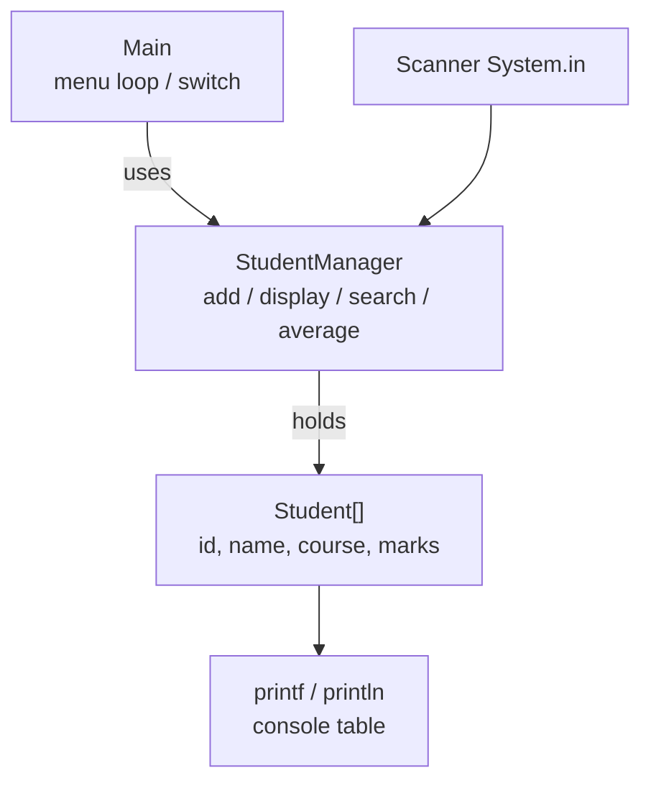

# Lab 2: Java Syntax and Input/Output

> **Participants:** Module sequence is in [`../README.md`](../README.md). **Do not start this guide until** you have finished Module 2 [core pre-lab exercises 1–7](../exercises/EXERCISES-INDEX.md) (Pass — check yourself, do not write it down). Exercises 8–9 are challenge/bonus — strongly recommended before the display/`printf` steps. Then open **one** OS how-to ([Windows](LAB-2-WINDOWS.md) · [macOS](LAB-2-MACOS.md)). In class, prefer the **45-minute timed path** with [`starter/`](starter/README.md); the **full path** is every Step below (homework / extended). This repo has no answer keys — complete the TODOs yourself. See [Which file do I open?](../../../_PARTICIPANT-FILE-GUIDE.md).

## Activity card

| | |
| --- | --- |
| **Objective** | Build a menu-driven Student Management console using packages, Scanner, and printf |
| **Skills practiced** | `com.academy.student` packages, model/manager/`Main` split, menu `switch`, array storage, `%.2f` |
| **Expected outcome** | Add / display / search / average / exit work; smoke-test evidence saved |
| **Estimated time** | Timed path ~45 min · Full path 90–180 min |
| **Prerequisites** | Lab 0 · Module 1 · Exercises 1–7 Pass · JDK 21 |
| **Expected files** | `examples/Lab2-JavaSyntax/src/com/academy/student/{Student,StudentManager,Main}.java` |
| **Validation checkpoints** | Starter smoke test · GUIDE Implementation Checkpoints · Pass criteria |

**Module:** 2 — Java Syntax and Core Constructs  
**Duration:** ~45 minutes (timed path with starter) · Full path: 90–180 minutes (Day 2 core checkpoint ~90 min; finish remaining menu paths as extended work)  
**IDE conventions:** See [`../_IDE-CONVENTIONS.md`](../../_IDE-CONVENTIONS.md)

**Primary IDE:** IntelliJ IDEA Community Edition · **Optional IDE:** VS Code

| OS | How-to for this lab |
| -- | ------------------- |
| Windows | [LAB-2-WINDOWS.md](LAB-2-WINDOWS.md) |
| macOS | [LAB-2-MACOS.md](LAB-2-MACOS.md) |

> **Incremental build:** Extends Module 1 workspace + Module 2 exercise skills into a **packaged** menu app. You do **not** start a new CRM — same `java-bootcamp`, new folder `examples/Lab2-JavaSyntax/`.

## 45-minute timed path (use starter)

In class, use the starter templates so the **core** objectives fit **~45 minutes**. The full Steps below remain for homework / extended depth.

1. Open [`starter/README.md`](starter/README.md).
2. Copy `starter/Lab2-JavaSyntax/` into your `java-bootcamp/examples/Lab2-JavaSyntax/` target folder (commands in the starter README).
3. Fill every `// TODO` / `_____` — complete every TODO yourself.
4. Run the starter smoke test; commit your work to your GitHub repo (no screenshots).
5. Check the **timed-path Pass criteria** in the starter README yourself (do not write the marks down). Continue remaining GUIDE steps only if time allows (or as homework).

| Path | Time | Scope |
| ---- | ---- | ----- |
| **Timed (default)** | ~45 min | Starter TODOs + smoke test |
| **Full (extended)** | see Duration | Every Step in this GUIDE |

> **Timed path (starter):** If you copied `starter/Lab2-JavaSyntax/`, **skip create Steps 1–5** (folders, `Student`, `StudentManager` skeleton, `Main` menu). Those files already exist. Fill TODOs only in `StudentManager` (`addStudent` / `displayStudents` / `searchStudent` / `calculateAverage`). Prefer the existing `printStudentTable` / `findStudentIndex` helpers — do not rewrite table formatting from scratch. The starter menu shows options **1–10** (core 1–5 plus bonus 6–10); timed path only needs core **1–5**.

**Verified participant layout (Windows IntelliJ + PowerShell; Temurin JDK 21.0.11):**

| Role | Path |
| ---- | ---- |
| IntelliJ opens | `%USERPROFILE%\java-bootcamp` (SDK / language level **21**) |
| Pre-lab exercises | `examples\module-02-exercises\` (flat `.java` files) |
| This lab project | `examples\Lab2-JavaSyntax\` with `src\com\academy\student\` |
| Compile / run (from `Lab2-JavaSyntax`) | `javac -d out` on the three sources → `java -cp out com.academy.student.Main` |
| Smoke-test output | Menu → add John → table row `91.00` → search ID `101` → `Average Marks : 91.00` → `Thank You` |

**If it fails (Windows PowerShell):** Prefer naming each `.java` file in the `javac` line (as in [LAB-2-WINDOWS.md](LAB-2-WINDOWS.md)); do not rely on `*.java` globs. Mark `examples\Lab2-JavaSyntax\src` as Sources Root — not `module-02-exercises`.

---

## Module 2 exercises you must already have completed

Lab 2 assumes you already practiced these skills in `examples/module-02-exercises/`. Do **not** treat Steps 5–7 as your first time seeing `Scanner`, `switch`, loops, or `printf`.

| Exercise | You already did | Lab 2 builds on it |
| -------- | --------------- | ------------------ |
| 1 — Calculations | Two numbers, arithmetic, labeled output | Average marks math (Step 9) |
| 2 — Decision Making | `if` / `else if` / `switch` | Menu `switch` + validation branches |
| 3 — Loops | `for` / `while` / `do-while` | Occupied-slot loops; menu uses `while (true)` (same “repeat until exit” idea as your `do-while` menu toy) |
| 4 — Methods | Params, return, overload | Named methods on `StudentManager` |
| 5 — Personal Details | `Scanner` + leftover-newline pitfall | One shared `Scanner`; prefer all-`nextLine`+parse |
| 6 — Product Information | `nextLine` + parse int/double | Add-student ID / marks parsing |
| 7 — Area of Circle | `Math.PI` + `printf` decimals | `%.2f` on marks / average |
| 8 — Bill Summary *(challenge)* | Multi-step calc + `%.2f` | Stronger formatting habits for averages/tables |
| 9 — Personal Profile *(bonus)* | Aligned `printf` columns | Student display table widths (Step 7) |

**Lab-only additions (not in the nine exercises):** `package com.academy.student` + `src/`/`out/` layout, three-class design (`Student` / `StudentManager` / thin `Main`), fixed array + `studentCount`, injected shared `Scanner`, full menu CRUD (add / display / search / average), validation harden, and GitHub commit of your sources.

If any of Exercises 1–7 is still **Fail**, finish that exercise first — then return here.

---

## Lab Overview

This Module 2 lab is the consolidation after Module 2 slides and [Exercises 1–7](../exercises/EXERCISES-INDEX.md) (plus 8–9 when done). You already practiced arithmetic, decisions, loops, methods, `Scanner`, parsing, and `printf` in `module-02-exercises/`. Here you assemble those skills into a **menu-driven Student Management console** with packages and a clear model/manager/`Main` split.

## Learning Objectives

After completing this lab, you will be able to:

* Organize a packaged project (`src` / `out`) that matches `package com.academy.student`
* Apply exercise `Scanner` / parse habits with **one shared** `Scanner` injected into `StudentManager`
* Store students in a fixed-size array with a `studentCount` (new lab structure)
* Implement a `while (true)` menu loop with `switch` (builds on Exercises 2–3)
* Format a student table with `printf` (builds on Exercises 7–9)

## Business Scenario

A training institute needs a console app for registration week: add students, list them, search by ID, compute average marks, and exit. Mentors want plain JDK—no database, no GUI.

You already practiced the syntax building blocks in Module 2 Exercises 1–7. Today’s practice pass consolidates those skills into one Student Management menu (pedagogical student records — not the future CRM).

Demo data you should use later (matches the reference sample):

* Student ID `101`, Name `John`, Course `Java`, Marks `91`

---

## Architecture Context
### Layered console design



### Lab flow

1. Create / copy packaged sources under `examples/Lab2-JavaSyntax/src/com/academy/student/`.
2. Implement array storage + core menu methods on `StudentManager`.
3. Compile to `out/`, run `com.academy.student.Main`, walk the sample session.
4. Commit your sources to GitHub. Do not take screenshots.

### Menu flow

`Main` loops: print menu → read choice → `switch` → call `StudentManager` → repeat until Exit (`5`). Starter also lists bonus options **6–10**; ignore them on the timed path unless you finish early.

### Compile → run

From `Lab2-JavaSyntax/`: `javac -d out` on the three sources → `java -cp out com.academy.student.Main`. Class files land under `out/com/academy/student/`.

---

## Prerequisites

Complete **both** of the following before Step 1:

1. [Lab 0](../../module-00/lab0/LAB-0-GUIDE.md) and [`../_IDE-CONVENTIONS.md`](../../_IDE-CONVENTIONS.md)
2. Module 2 [Exercises 1–7](../exercises/EXERCISES-INDEX.md) — all Pass rows marked **Pass** (Exercises 8–9 strongly recommended)

| Check | Must be true |
| ----- | ------------ |
| JDK | `java -version` and `javac -version` show **21.x** |
| Workspace | `java-bootcamp` exists on your laptop |
| IDE | Desktop **VS Code** and/or **IntelliJ IDEA Community** installed |
| Terminal | Integrated terminal works inside your IDE |
| Exercises | `examples/module-02-exercises/` has your Exercise 1–7 sources |

Confirm exercise readiness (from your notes / `module-02-exercises/`):

| # | Exercise skill | Ready? |
| - | -------------- | ------ |
| 1 | Arithmetic + labeled output | Pass / Fail |
| 2 | `if` / `switch` branching | Pass / Fail |
| 3 | You can explain `for` / `while` / `do-while` | Pass / Fail |
| 4 | Methods with parameters and return values | Pass / Fail |
| 5–6 | `Scanner` + `nextLine` + parse (and leftover-newline awareness) | Pass / Fail |
| 7 | `printf` with decimal places | Pass / Fail |

If any row is **Fail**, finish that exercise before continuing.

### Pre-flight

**Do this:**

**Windows PowerShell**

```powershell
java -version
javac -version
cd $env:USERPROFILE\java-bootcamp
pwd
Get-ChildItem examples\module-02-exercises
```

**macOS / Linux**

```bash
java -version
javac -version
cd ~/java-bootcamp
pwd
ls examples/module-02-exercises
```

**Expected result:** Both tools report 21.x. `pwd` ends under `java-bootcamp`. Exercise sources appear under `module-02-exercises`.

**If it fails:** Re-do Lab 0 for JDK/workspace. If the exercises folder is missing or empty, return to [`../exercises/EXERCISES-INDEX.md`](../exercises/EXERCISES-INDEX.md). Do not invent a second JDK folder “just for this lab.”

---

## Worked example (read before you code)

Study this pattern once before Step 1. Your job is to apply the same idea in the Steps — do not skip ahead to a full solution.

```java
package com.academy.student;

import java.util.Scanner;

public class Main {

    public static void main(String[] args) {
        Scanner scanner = new Scanner(System.in);
        StudentManager studentManager = new StudentManager(scanner);

        while (true) {
            studentManager.displayMenu();

            String choiceInput = scanner.nextLine().trim();
            if (choiceInput.isEmpty()) {
                System.out.println("Invalid Input");
                System.out.println("Please Try Again.");
                continue;
            }

            int choice;
            try {
                choice = Integer.parseInt(choiceInput);
            } catch (NumberFormatException ex) {
                System.out.println("Invalid Input");
                System.out.println("Please Try Again.");
                continue;
            }

            switch (choice) {
                case 1 -> studentManager.addStudent();
                case 2 -> studentManager.displayStudents();
                case 3 -> studentManager.searchStudent();
                case 4 -> studentManager.calculateAverage();
                case 5 -> {
                    System.out.println("Thank You");
                    scanner.close();
                    return;
                }
                default -> {
// ... truncated — see full sample in the Steps
```

**What to notice:** Match names, IDs, and failure behavior from the scenario — instructors check these.

---

## Implementation Steps

Every step uses **Why:** / **Do this:** / **Expected result:** / **If it fails:**  
Prefer writing code yourself. There is no answer-key folder in this repo.

---

### Step 1 — Create the project folders

**Why:** Java packages map to directories. `package com.academy.student` requires folders `com/academy/student` under `src`.

**Builds on:** Exercises used a **flat** `module-02-exercises/` folder. This lab introduces the packaged `src/` / `out/` layout you will reuse in later Week 1 labs.

**Do this:**

**Windows PowerShell**

```powershell
cd $env:USERPROFILE\java-bootcamp
New-Item -ItemType Directory -Force -Path examples\Lab2-JavaSyntax\src\com\academy\student | Out-Null
cd examples\Lab2-JavaSyntax
Get-ChildItem -Recurse src
```

**macOS / Linux**

```bash
cd ~/java-bootcamp
mkdir -p examples/Lab2-JavaSyntax/src/com/academy/student
cd examples/Lab2-JavaSyntax
find src -type d
```

**Expected result:** You see `src/com/academy/student` (empty of `.java` files for now).

**If it fails:**

* Wrong drive / home folder → confirm `java-bootcamp` exists from Lab 0
* `mkdir` permission error → create folders under your user profile, not a protected path

---

### Step 2 — Open the project in an IDE

**Why:** Editing in an IDE gives syntax highlighting, run configs, and an integrated terminal. Both VS Code and IntelliJ are supported.

#### Option A — VS Code

**Do this:**

1. **File → Open Folder…**
2. Select `java-bootcamp/examples/Lab2-JavaSyntax` (or open `java-bootcamp` and navigate into the project).
3. **Terminal → New Terminal** (or `` Ctrl+` `` / `` Cmd+` ``).
4. Confirm the shell is inside the project (or `cd` into `Lab2-JavaSyntax`).

**Expected result:** Explorer shows `src/com/academy/student`. Terminal prompt is under that project.

**If it fails:** You opened a parent folder without noticing—`cd` into `examples/Lab2-JavaSyntax` before `javac`.

#### Option B — IntelliJ IDEA Community

**Do this:**

1. **File → Open…** → select `Lab2-JavaSyntax` (the folder that will contain `src`).
2. Trust the project if prompted.
3. **File → Project Structure → Project** → **SDK = 21** (Temurin / OpenJDK 21).
4. In Project view, right-click `src` → **Mark Directory as → Sources Root**.
5. Later (after `Main` exists): green gutter arrow next to `main`, or right-click `Main` → **Run ‘Main.main()’**.

**Expected result:** `src` shows as a Sources Root (often blue). Project SDK is 21.

**If it fails:**

* SDK missing → Install JDK 21, then Assign it in Project Structure
* Package looks wrong → Mark `src` (not `src/com`) as Sources Root

---

### Step 3 — Create `Student.java` (model)

**Why:** The model holds data only. Menu logic belongs elsewhere. Encapsulation (private fields + getters/setters) is a Week 1 habit.

**Builds on Exercise 4 / Module 1 objects:** You already wrote methods and simple classes. Here the graded model is `Student` with id, name, course, and marks.

**Do this:** Create `src/com/academy/student/Student.java`:

```java
package com.academy.student;

public class Student {

    private int studentId;
    private String name;
    private String course;
    private double marks;

    public Student(int studentId, String name, String course, double marks) {
        this.studentId = studentId;
        this.name = name;
        this.course = course;
        this.marks = marks;
    }

    public int getStudentId() { return studentId; }
    public void setStudentId(int studentId) { this.studentId = studentId; }

    public String getName() { return name; }
    public void setName(String name) { this.name = name; }

    public String getCourse() { return course; }
    public void setCourse(String course) { this.course = course; }

    public double getMarks() { return marks; }
    public void setMarks(double marks) { this.marks = marks; }

    public void display() {
        System.out.println("ID : " + studentId);
        System.out.println("Name : " + name);
        System.out.println("Course : " + course);
        System.out.println("Marks : " + marks);
    }
}
```

You may keep getters/setters on one line or expand them—style is yours as long as fields stay `private`.

**Expected result:** File saves with no red errors for missing package. Package declaration is the first non-comment line.

**If it fails:**

* `The declared package does not match...` → folder path is not `src/com/academy/student`
* Public class name ≠ file name → rename file to `Student.java`

---

### Step 4 — Create `StudentManager` skeleton (array storage)

**Why:** A fixed-size array + `studentCount` is the beginner storage pattern before collections. The manager owns operations.

**Builds on Exercise 4:** Named methods (not one giant `main`) — now grouped on a manager class with injected `Scanner`.

**Do this:** Create `src/com/academy/student/StudentManager.java` with at least:

```java
package com.academy.student;

import java.util.Scanner;

public class StudentManager {

    private static final int MAX_STUDENTS = 20;

    private final Student[] students = new Student[MAX_STUDENTS];
    private int studentCount = 0;
    private final Scanner scanner;

    public StudentManager(Scanner scanner) {
        this.scanner = scanner;
    }

    public void displayMenu() {
        System.out.println("====================================");
        System.out.println("Student Management System");
        System.out.println("====================================");
        System.out.println("1. Add Student");
        System.out.println("2. Display Students");
        System.out.println("3. Search Student");
        System.out.println("4. Average Marks");
        System.out.println("5. Exit");
        System.out.print("Enter Choice : ");
    }

    // Methods addStudent, displayStudents, searchStudent, calculateAverage
    // will be filled in later steps.
}
```

> **Starter note:** The timed-path starter `displayMenu` also prints bonus options **6–10**. Core graded path is still options **1–5** (Exit = 5). Implement or ignore 6–10 after the core path.

**Expected result:** Class compiles conceptually (empty methods can be stubs that print `"TODO"` for now, or omit until Step 6+).

**If it fails:**

* Forgot `import java.util.Scanner` → IDE underlines `Scanner`
* Reused `System.in` with many scanners → inject **one** `Scanner` from `Main`

---

### Step 5 — Create `Main` with the menu loop

**Why:** Consoles stay alive with `while (true)` until the user chooses Exit. `Main` should only display/choose and delegate.

**Builds on Exercises 2–3:** You already used `switch` and loop forms. Lab menu uses `while (true)` + `switch` (same “repeat until exit” idea as the Exercise 3 `do-while` menu toy). Prefer all-`nextLine`+parse for the choice (Exercise 6 habit).

**Do this:** Create `src/com/academy/student/Main.java`:

```java
package com.academy.student;

import java.util.Scanner;

public class Main {

    public static void main(String[] args) {
        Scanner scanner = new Scanner(System.in);
        StudentManager studentManager = new StudentManager(scanner);

        while (true) {
            studentManager.displayMenu();

            String choiceInput = scanner.nextLine().trim();
            if (choiceInput.isEmpty()) {
                System.out.println("Invalid Input");
                System.out.println("Please Try Again.");
                continue;
            }

            int choice;
            try {
                choice = Integer.parseInt(choiceInput);
            } catch (NumberFormatException ex) {
                System.out.println("Invalid Input");
                System.out.println("Please Try Again.");
                continue;
            }

            switch (choice) {
                case 1 -> studentManager.addStudent();
                case 2 -> studentManager.displayStudents();
                case 3 -> studentManager.searchStudent();
                case 4 -> studentManager.calculateAverage();
                case 5 -> {
                    System.out.println("Thank You");
                    scanner.close();
                    return;
                }
                default -> {
                    System.out.println("Invalid Input");
                    System.out.println("Please Try Again.");
                }
            }

            System.out.println();
        }
    }
}
```

Until manager methods exist, you can temporarily leave empty methods that print a short message—or implement Steps 6–9 first, then compile.

**Expected result:** Menu text matches the sample (title + options 1–5; starter may also show bonus 6–10). Choice `5` prints `Thank You` and exits.

**If it fails:**

* `cannot find symbol: method addStudent` → add stubs first
* Arrow `case 1 ->` errors → ensure you use JDK 21 (not an ancient language level)

---

### Step 6 — Implement Add Student

**Why:** Creation is the first real data path. Validate ID uniqueness, non-empty strings, and marks in range.

**Builds on Exercises 5–6:** Same `Scanner` / `nextLine` + parse pattern as Personal Details and Product Information — now with uniqueness and range checks.

**Do this:** In `StudentManager`, implement roughly:

1. If `studentCount >= MAX_STUDENTS`, print full and return.
2. Prompt `Student ID : ` → parse positive int.
3. If ID already exists, reject.
4. Prompt `Name : ` and `Course : ` → reject empty strings.
5. Prompt `Marks : ` → parse double; require `0`–`100`.
6. `students[studentCount] = new Student(...); studentCount++;`
7. Print `Student Added Successfully.`

Helper ideas (recommended): `readPositiveInt()`, `readNonEmptyLine(prompt)`, `readValidMarks()`, `findStudentIndex(id)`.

**Expected result:** Entering `101` / `John` / `Java` / `91` prints:

```text
Student Added Successfully.
```

**If it fails:**

* Program skips Name after ID → you mixed `nextInt()` with `nextLine()`; switch to **only** `nextLine()` + parse
* Duplicate IDs accepted → `findStudentIndex` not checked before insert

---

### Step 7 — Implement Display Students (`printf` table)

**Why:** Graders and mentors read columns faster than free-form dumps. `printf` widths keep a clean table.

**Builds on Exercises 7–9:** You practiced `%.2f` and aligned columns. Apply that to student rows (Exercise 9 is especially useful if you finished the bonus).

**Do this:** Loop `i` from `0` to `studentCount - 1` (not to `MAX_STUDENTS`). Print:

```text
----------------------------------------------------------
ID      Name                 Course          Marks
----------------------------------------------------------
101     John                 Java            91.00
----------------------------------------------------------
```

Suggested format:

```java
System.out.printf("%-8d %-20s %-15s %-8.2f%n",
        student.getStudentId(),
        student.getName(),
        student.getCourse(),
        student.getMarks());
```

If `studentCount == 0`, print `No students to display.`

**Expected result:** After adding John once, Display shows one row with marks as `91.00`.

**If it fails:**

* NullPointerException → you looped to `students.length` past empty slots
* Columns smash together → adjust `%-8` / `%-20` widths

---

### Step 8 — Implement Search Student

**Why:** Searching by ID proves you can traverse the occupied portion of the array and call `Student.display()`.

**Builds on Exercises 2–3:** Branch when found / not found; loop only over `studentCount` occupied slots.

**Do this:**

1. If no students, print `No students to search.`
2. Prompt for ID.
3. Find index; if missing, print `Student Not Found.`
4. Else call `students[index].display()`.

**Expected result:** Searching `101` after adding John shows:

```text
ID : 101
Name : John
Course : Java
Marks : 91.0
```

(Exact marks formatting may be `91` or `91.0` depending on how you print.)

**If it fails:** Wrong ID still “found” → compare with `getStudentId()` carefully; watch off-by-one on the loop.

---

### Step 9 — Implement Average Marks

**Why:** Aggregates over occupied slots only. Practice `double` totals and `printf`.

**Builds on Exercises 1 and 7–8:** Arithmetic + `%.2f` formatting — now over an array of marks.

**Do this:** Sum `getMarks()` for `0 .. studentCount-1`, divide by `studentCount`, print:

```text
Average Marks : 91.00
```

**Expected result:** One student with 91 → average `91.00`. Two students → arithmetic average of their marks.

**If it fails:**

* Division by zero → guard empty list with `No students available.`
* Wrong average → you divided by `MAX_STUDENTS` or included null slots

---

### Step 10 — Harden validation

**Why:** Real users type letters for numbers and blank names. Re-prompt until valid (or reject clearly).

**Builds on Exercises 2 and 5–6:** Decision branches + safe parse; reject bad input without crashing the menu.

**Do this:** Confirm these behaviors:

| Input | Expected handling |
| ----- | ----------------- |
| Empty menu choice | Invalid Input / Please Try Again |
| `abc` as ID | Invalid / re-prompt |
| Marks `-1` or `101` | Reject |
| Blank name | Reject |
| Duplicate ID | Reject with a clear message |

**Expected result:** Bad input never corrupts the array; count stays correct.

**If it fails:** App crashes with `NumberFormatException` → wrap parse in `try/catch` and re-prompt.

---

### Step 11 — Compile and run from the terminal

**Why:** You must understand package compile/classpath even when the IDE Run button works. Both VS Code and IntelliJ terminals use the same commands.

**Builds on:** Flat `javac ClassName.java` from exercises / Lab 1. Here you use `javac -d out` and `java -cp out` for packages — lab-only depth.

**Do this:** From project root `Lab2-JavaSyntax`:

**Windows PowerShell** (name each source file — do not rely on `*.java` globs):

```powershell
Remove-Item -Recurse -Force out -ErrorAction SilentlyContinue
javac -d out `
  src\com\academy\student\Student.java `
  src\com\academy\student\StudentManager.java `
  src\com\academy\student\Main.java
java -cp out com.academy.student.Main
```

**macOS / Linux:**

```bash
rm -rf out
javac -d out src/com/academy/student/*.java
java -cp out com.academy.student.Main
```

**IntelliJ alternative:** After Sources Root + SDK 21, open `Main.java` → Run gutter on `main`. Then still practice the terminal once.

**Expected result:** Menu appears (core options 1–5; starter may also list bonus 6–10):

```text
====================================
Student Management System
====================================
1. Add Student
2. Display Students
3. Search Student
4. Average Marks
5. Exit
Enter Choice :
```

**If it fails:**

| Symptom | Fix |
| ------- | --- |
| `javac: file not found` / empty glob | On Windows PowerShell, name each `.java` file (see [LAB-2-WINDOWS.md](LAB-2-WINDOWS.md)); `cd` into `Lab2-JavaSyntax` first |
| `package ... does not match` | Check `src/com/academy/student` layout |
| `Error: Could not find or load main class` | Use `-cp out` and fully qualified `com.academy.student.Main` |
| Wrong Java version | `javac -version` must be 21 |

---

### Step 12 — Walk the sample session (manual verification)

**Why:** Matching the reference session proves your prompts and formatting align with course expectations.

**Do this:** Run the app and enter this sequence (values matter for screenshots):

1. Choice `1` → ID `101`, Name `John`, Course `Java`, Marks `91`
2. Choice `2` → view table
3. Choice `4` → average
4. Choice `5` → exit

**Expected result:** Core behavior matches the sample below. **Starter note:** the starter menu prints options **1–10** (bonus 6–10). That is expected — use only core choices **1–5** for the timed-path transcript; ignore bonus lines in screenshots or leave them unused.

```text
====================================
Student Management System
====================================
1. Add Student
2. Display Students
3. Search Student
4. Average Marks
5. Exit
6. Top Student (Bonus)
7. Lowest Marks (Bonus)
8. Pass / Fail Report (Bonus)
9. Sort by Marks (Bonus)
10. Class Statistics (Bonus)
Enter Choice : 1
Student ID : 101
Name : John
Course : Java
Marks : 91
Student Added Successfully.

Enter Choice : 2
----------------------------------------------------------
ID      Name                 Course          Marks
----------------------------------------------------------
101     John                 Java            91.00
----------------------------------------------------------

Enter Choice : 4
Average Marks : 91.00

Enter Choice : 5
Thank You
```

Also try Search (`3`) with `101` and a bad ID before exiting.

**If it fails:** Diff your prompt strings against this sample (spacing / wording). Mentors often grade against this transcript.

---

### Step 13 — Coding standards self-check

**Why:** Readable code is part of the grade, not an afterthought.

**Do this:** Verify:

* One public class per `.java` file; file name matches class
* `package com.academy.student;` on every file
* Fields private; methods camelCase; `MAX_STUDENTS` UPPER_SNAKE
* `Main` stays thin; business logic in `StudentManager`
* No secrets in screenshots

**Expected result:** You can explain each class’s job in one sentence.

**If it fails:** Large `Main` with all logic → move methods into `StudentManager`.

---

## Implementation Checkpoints

| Checkpoint | You have… |
| ---------- | --------- |
| A — Project | `examples/Lab2-JavaSyntax/src/com/academy/student/*.java` |
| B — Compile | `javac -d out` succeeds; menu opens |
| C — Core ops | Add, Display table, Search, Average work |
| D — Quality | Validation + naming conventions checked |

---

## Reference Commands

**Windows PowerShell** (from `Lab2-JavaSyntax/`):

```powershell
javac -d out `
  src\com\academy\student\Student.java `
  src\com\academy\student\StudentManager.java `
  src\com\academy\student\Main.java
java -cp out com.academy.student.Main
```

**macOS / Linux:**

```bash
javac -d out src/com/academy/student/*.java
java -cp out com.academy.student.Main
```

| Goal | Command theme |
| ---- | ------------- |
| Compile to `out/` (Windows) | Named `javac -d out` lines for the three sources |
| Compile to `out/` (macOS/Linux) | `javac -d out src/com/academy/student/*.java` |
| Run main | `java -cp out com.academy.student.Main` |
| List sources (Windows) | `Get-ChildItem -Recurse src\*.java` |
| List sources (macOS/Linux) | `find src -name '*.java'` |

### Method map (suggested)

| Class | Methods / role |
| ----- | -------------- |
| `Student` | Fields + getters/setters; `display()`; pass/fail helper |
| `StudentManager` | `displayMenu`; `addStudent`; `displayStudents`; `searchStudent`; `calculateAverage`; helpers `printStudentTable`, `findStudentIndex` (+ bonus 6–10 optional) |
| `Main` | Create shared `Scanner` + `StudentManager`; `while (true)` menu `switch`; exit on `5` |

## Failure Experiments (optional learning)

1. **Mix `nextInt` + `nextLine`** — watch a prompt get skipped; then fix with all-`nextLine`.
2. **Loop to `students.length`** — hit NullPointerException; fix loop bound to `studentCount`.
3. **Compile without `-d out`** — class files land in wrong place; restore `-d out` / `-cp out`.
4. **Marks `150`** — confirm validation rejects.

---

## Troubleshooting

### Common errors and fixes

| Problem | Likely cause | Typical message | Fix |
| ------- | ------------ | --------------- | --- |
| Package mismatch | Folders ≠ `package` line | `package … does not match` / class not found | Recreate `src/com/academy/student` |
| Main class not found | Bad classpath / wrong name | `Could not find or load main class` | `java -cp out com.academy.student.Main` |
| Skipped input / empty name | Mixed `nextInt` + `nextLine` | Prompts appear to “skip” | Prefer all-`nextLine` + parse (Exercises 5–6) |
| NPE / blank rows on display | Loop uses full array length | NPE or empty slots printed | Loop `i < studentCount` |
| IntelliJ cannot run | `src` not Sources Root / SDK ≠ 21 | Run config fails | Project Structure → SDK 21; mark `src` as Sources Root |
| VS Code / Terminal missing tools | PATH from Lab 0 | `javac: command not found` | New terminal; re-check Lab 0 |
| `*.java` glob fails (PowerShell) | Globbing quirks | Unexpected file list | Name each `.java` explicitly |
| Wrong project folder | Coding under exercises tree | Can't find packages | Use `examples/Lab2-JavaSyntax/`, not `module-02-exercises` |

## Cleanup

You may delete `out/` anytime; sources stay. Keep `examples/Lab2-JavaSyntax/` for portfolio evidence.

**Windows:** `Remove-Item -Recurse -Force out`  
**macOS / Linux:** `rm -rf out`


## Reflection Questions

Write **1–3 sentence** answers (not essays):

1. Why must the package folder tree match `package com.academy.student`?
2. Why prefer `nextLine()` + parse over `nextInt()` in a menu app?
3. Why keep a `studentCount` instead of relying on `students.length` alone?

---


