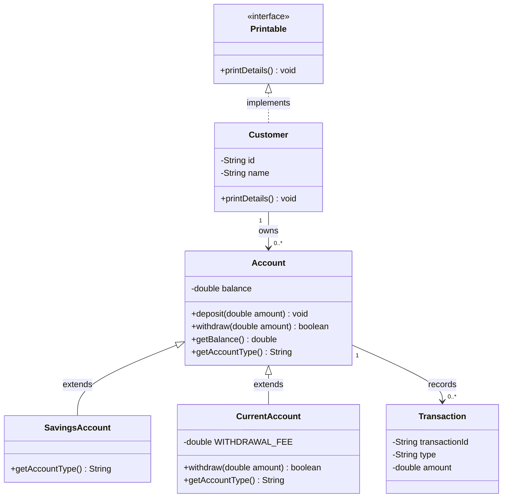

# Exercise 8 — Mini UML Class Diagram

**Module 3** · Pre-lab practice · Checkpoint F · all 8 then lab
**Folder:** `examples/module-03-exercises/` ([setup](EXERCISES-INDEX.md))


> **No new Java code:** Convert the design from Exercises 1–5 into a visual model before Lab 3 grows to eight types.

## Activity card

| | |
| --- | --- |
| **Objective** | Sketch a mini class diagram for the banking model |
| **Skills practiced** | UML inheritance, association, multiplicity |
| **Expected outcome** | UML note showing Customer–Account–Transaction relationships |
| **Estimated time** | 10–12 minutes |
| **File to create** | `examples/module-03-exercises/uml-notes.md` |
| **Checkpoint** | F (after slides 108–109) |

## What you will learn

- Inheritance vs association
- Multiplicity 1..* for customer accounts
- Diagrams communicate design before Lab 3

**Enterprise context:** Architects align on UML before coding shared banking services.

## UML notation used here

| Notation | Meaning | Example |
| -------- | ------- | ------- |
| `+` | Public member | `+deposit(amount)` |
| `-` | Private member | `-balance` |
| `<|--` | Inheritance | Account is parent of SavingsAccount |
| `<|..` | Interface implementation | Customer implements Printable |
| `"1" --> "0..*"` | One-to-many association | Customer owns many accounts |

## Worked example (read first)

Here is the shape of a complete answer for this exercise. Adapt the content — do not leave blanks.

```markdown
# Banking mini UML
```

Then follow **Steps** to create your own file.

## Steps

### Step 1 — Create `banking-uml.md`

**Why:** Markdown keeps the diagram beside your design notes and renders on GitHub/Cursor.

Add:

````markdown
# Banking mini UML


````

### Step 2 — Compare diagram to code

**Why:** UML is useful only when it tells the truth about the model.

Check:

1. `balance` is private (`-`).
2. Public operations use `+`.
3. Both account subclasses point toward `Account`.
4. `Customer` realizes `Printable` with the dotted relationship.
5. Multiplicities agree with Exercise 1.

### Step 3 — Explain the relationships

Below the diagram, write one sentence for each:

```markdown
- Inheritance: SavingsAccount and CurrentAccount are specialized Accounts.
- Interface realization: Customer promises Printable behavior.
- Association: One Customer may own many Accounts.
- Association: One Account may record many Transactions.
```

## Expected result

The rendered diagram matches your code and clearly distinguishes inheritance, interface realization, and associations.

## Troubleshooting

### If it fails

| Problem | Fix |
| ------- | --- |
| Mermaid renders as plain text | Use a fenced block beginning with ` ```mermaid ` |
| Arrow points the wrong way | Parent/interface is on the `<|` side |
| Missing cardinality | Add quoted values such as `"1"` and `"0..*"` |
| Diagram disagrees with code | Update the diagram or justify the code change |

## Pass criteria

_Check **Pass** or **Fail** yourself. Do not write these marks anywhere — nothing is submitted or graded. Commit your work to your GitHub repo._

Self-check before marking Pass:

- [ ] Diagram includes all six types
- [ ] Inheritance and interface arrows are correct
- [ ] Customer–Account and Account–Transaction multiplicities appear
- [ ] You can explain the three relationship types

## Next

Exercises 1–8 complete → open **one** OS how-to → [`../lab3/LAB-3-WINDOWS.md`](../lab3/LAB-3-WINDOWS.md) or [`../lab3/LAB-3-MACOS.md`](../lab3/LAB-3-MACOS.md) → then graded [`../lab3/LAB-3-GUIDE.md`](../lab3/LAB-3-GUIDE.md) (builds on these eight; separate folder `examples/Lab3-BankingSystem/`).
