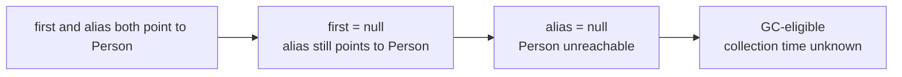

# Exercise 2 — Object Lifecycle and Reachability

**Module 4** · Pre-lab practice · Checkpoint A · all 7 then lab
**Folder:** `examples/module-04-exercises/` ([setup](EXERCISES-INDEX.md))


## Activity card

| | |
| --- | --- |
| **Objective** | Follow aliases until an object becomes GC-eligible |
| **Skills practiced** | reachability, aliases, nulling references |
| **Expected outcome** | Lifecycle notes show when the object becomes unreachable |
| **Estimated time** | 12–15 minutes |
| **File to create** | `examples/module-04-exercises/ObjectLifecycleDemo.java` |
| **Checkpoint** | A |

## What you will learn

- GC cares about reachability, not scope alone
- Aliases keep objects alive
- Nulling the last root enables collection

**Enterprise context:** Caches and session maps keep objects reachable long after a request ends.

## Worked example (read first)

Here is the shape of a complete answer for this exercise. Adapt the content — do not leave blanks.

```text
Same object: true
Still reachable through alias: Aman
No strong references remain; object is GC-eligible.
GC requested, not guaranteed.
```

Then follow **Steps** to create your own file.


## Starter (fill in the TODOs)

Optional: copy from [`starter/`](starter/README.md). Or paste:


Paste this skeleton, then replace each `// TODO` with working code. Do **not** leave TODOs in your finished file.

```java
public class ObjectLifecycleDemo {
    static class Person {
        final String name;

        Person(String name) {
            this.name = name;
        }
    }

    public static void main(String[] args) {
        Person first = new Person("Aman"); // create + reference
        // TODO: Person alias = first;  (second reference, same object)

        System.out.println(
                "Same object: " + (first == alias));

        // TODO: first = null;  (object remains reachable through alias)
        System.out.println(
                "Still reachable through alias: " + alias.name);

        // TODO: alias = null;  (no strong references remain)
        System.out.println(
                "No strong references remain; object is GC-eligible.");

        // TODO: System.gc();  request only; JVM may ignore or delay it
        System.out.println("GC requested, not guaranteed.");
    }
}
```

## Reachability timeline



| State | Reachable? | Why |
| ----- | ---------- | --- |
| After construction | Yes | `first` points to object |
| After `alias = first` | Yes | Two references point to same object |
| After `first = null` | Yes | `alias` still points to object |
| After `alias = null` | No strong path from the demo | Object becomes GC-eligible |

## Steps

### Step 1 — Create `ObjectLifecycleDemo.java`

**Why:** Lab 4 builds on reachability — you must know when an object is collectible vs merely unreferenced from one variable.

1. **New → File** → `ObjectLifecycleDemo.java`.
2. Paste the starter.
3. Fill every `// TODO`. Save.

### Step 2 — Compile and run

**Windows:**

```powershell
cd $env:USERPROFILE\java-bootcamp\examples\module-04-exercises
javac ObjectLifecycleDemo.java
java ObjectLifecycleDemo
```

**macOS:**

```bash
cd ~/java-bootcamp/examples/module-04-exercises
javac ObjectLifecycleDemo.java
java ObjectLifecycleDemo
```

**Verified (Windows):**

```text
Same object: true
Still reachable through alias: Aman
No strong references remain; object is GC-eligible.
GC requested, not guaranteed.
```

### Step 3 — Explain `==`

**Why:** For object references, `==` checks whether both references point to the same object.

`first == alias` is `true`; no second `Person` was created.

### Step 4 — Write the lifecycle note

Add to `notes.md`:

```markdown
An object is not collectible merely because one reference becomes null.
It becomes GC-eligible only when no live strong-reference path can reach it.
Eligibility does not guarantee immediate collection, and System.gc() is only
a request.
```

## Expected result

You can explain the difference between removing one alias, losing all strong references, becoming GC-eligible, and actually being collected.

## Common mistakes

| Incorrect statement | Correct statement |
| ------------------- | ----------------- |
| `first = null` destroys the object | The object remains reachable through `alias` |
| `System.gc()` immediately frees it | Collection timing is controlled by the JVM |
| Two references mean two objects | Both references can point to one object |


## Predict the Output / Behavior

After a = b = null, is the Person eligible for GC?

## Troubleshooting

| Problem | Fix |
| ------- | --- |
| Blank/`_____` left in code | Replace with real Java |
| Wrong folder | `cd` to `module-04-exercises` |
| Empty GC log | Use JDK 21 `-Xlog:gc` before class name |

## Pass criteria

_Check **Pass** or **Fail** yourself. Do not write these marks anywhere — nothing is submitted or graded. Commit your work to your GitHub repo._

| # | Confirm | Self-check |
| - | ------- | ---------- |
| 1 | Output confirms both references initially share one object | Pass / Fail |
| 2 | You identify the exact GC-eligibility point | Pass / Fail |
| 3 | You state that `System.gc()` is not guaranteed | Pass / Fail |
