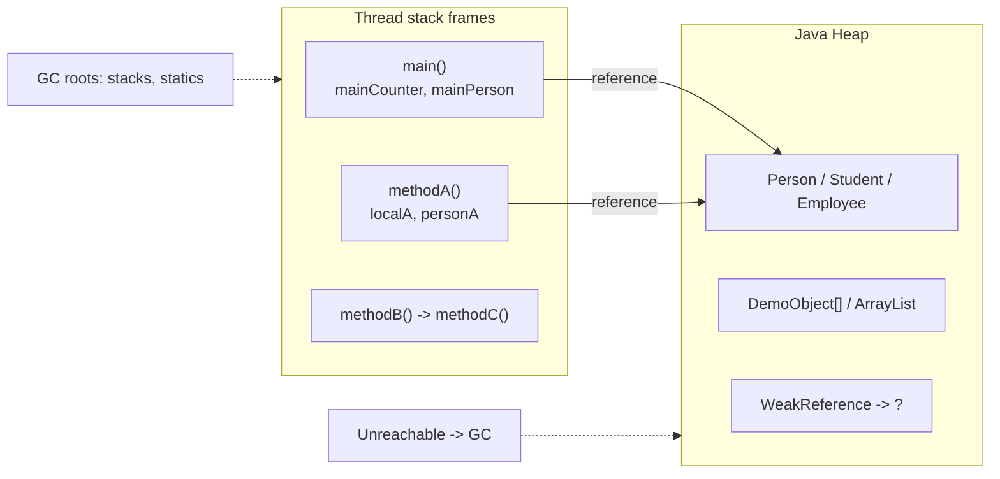

# Lab 4: Memory Management and Garbage Collection

> **Participants:** Module sequence is in [`../README.md`](../README.md). **Do not start this guide until** you have finished Module 4 [pre-lab exercises 1–7](../exercises/EXERCISES-INDEX.md) (Pass — check yourself, do not write it down). Exercises run on Day 3; this lab is Day 4. Day 3 “Lab 4 briefing” is folder/notes prep only — not GUIDE Steps. Then open **one** OS how-to ([Windows](LAB-4-WINDOWS.md) · [macOS](LAB-4-MACOS.md)). In class, prefer the **45-minute timed path** with [`starter/`](starter/README.md); the **full path** is every Step below (homework / extended). This repo has no answer keys — complete the TODOs yourself. See [Which file do I open?](../../../_PARTICIPANT-FILE-GUIDE.md).

## Activity card

| | |
| --- | --- |
| **Objective** | Run a memory demo suite: stack/heap, GC, retention leak/fix, performance comparison |
| **Skills practiced** | Reachability narrative, `-Xlog:gc`, bounded allocation, String/list cost patterns |
| **Expected outcome** | Smoke themes pass; commit to GitHub (no screenshots) |
| **Estimated time** | Timed path ~45 min · Full path 60–240 min |
| **Prerequisites** | Lab 0–3 · Exercises 1–7 Pass · JDK 21 |
| **Expected files** | `examples/Lab4-MemoryManagement/*.java` (flat suite) |
| **Validation checkpoints** | Starter smoke test · GUIDE Implementation Checkpoints |

**Module:** 4 — Memory Management and Performance  
**Duration:** ~45 minutes (timed path with starter) · Full path: 60–240 minutes (Day 4 core checkpoint ~60 min; finish remaining demos/tools as extended work)

**Primary IDE:** IntelliJ IDEA Community Edition · **Optional IDE:** VS Code

| OS | How-to for this lab |
| -- | ------------------- |
| Windows | [LAB-4-WINDOWS.md](LAB-4-WINDOWS.md) |
| macOS | [LAB-4-MACOS.md](LAB-4-MACOS.md) |

> **Incremental build:** Extends Module 1 stack/heap/GC awareness and Module 4 exercise demos into one graded suite — same `java-bootcamp`, new folder `Lab4-MemoryManagement/`.

## 45-minute timed path (use starter)

In class, use the starter templates so the **core** objectives fit **~45 minutes**. The full Steps below remain for homework / extended depth.

> **Timed path:** Skip recreating Steps 1–5 (`Person`, `MemoryMonitor`, stack/heap/lifecycle demos are already in the starter). Fill the measurement / leak / performance `// TODO`s only — complete every TODO yourself.

1. Open [`starter/README.md`](starter/README.md).
2. Copy `starter/Lab4-MemoryManagement/` into your `java-bootcamp/examples/Lab4-MemoryManagement/` target folder (commands in the starter README).
3. Fill GC + `MemoryLeakDemo` leak/fix + `PerformanceTest` TODOs — complete every TODO yourself.
4. Run the starter smoke test (includes `MemoryLeakDemo leak` + `fix`); commit your work to your GitHub repo (no screenshots).
5. Check the **timed-path Pass criteria** in the starter README yourself (do not write the marks down). Complete `WeakReferenceDemo` for **full credit** (homework if class time ends). Continue remaining GUIDE steps only if time allows.

| Path | Time | Scope |
| ---- | ---- | ----- |
| **Timed (default)** | ~45 min | GC + leak/fix + `PerformanceTest` TODOs + smoke |
| **Full credit** | timed + homework | Timed scope **plus** `WeakReferenceDemo` |
| **Full (extended)** | see Duration | Every Step in this GUIDE |

**Verified participant layout (Windows IntelliJ + PowerShell; Temurin JDK 21.0.11):**

| Role | Path |
| ---- | ---- |
| IntelliJ opens | `%USERPROFILE%\java-bootcamp` (SDK / language level **21**) |
| Pre-lab exercises | `examples\module-04-exercises\` (flat files — must exist before lab work) |
| This lab folder | `examples\Lab4-MemoryManagement\` (flat `.java` — **no** Sources Root / packages) |
| Compile | Named `javac` of the nine core demos in that folder |
| Useful VM flags | `-Xms16m -Xmx64m -Xlog:gc` for `GarbageCollectionDemo`; `-Xms128m -Xmx512m` for `PerformanceTest` |
| Smoke-test themes | Nested stack frames; heap identity hashes; GC reclaim after null; G1 log lines; `MemoryLeakDemo leak` rise / `fix` drop; `PerformanceTest` table |
| Full-credit add-on | `WeakReferenceDemo` — strong stays / weak `get()` → `null` (required for full Pass; optional during timed classroom) |

**If it fails (Windows PowerShell):** Name each `.java` file in the `javac` line (see [LAB-4-WINDOWS.md](LAB-4-WINDOWS.md)). Do **not** mark this folder as Sources Root (unlike Labs 2–3). If `OutOfMemoryError` on GC demo, raise `-Xmx` temporarily or close heavy apps.

---

## What you'll complete (practice only)

Labs and exercises are **practice only**. Nothing is submitted or graded. Do not take screenshots. Check Pass/Fail yourself — do not write those marks anywhere. Commit your work to your private `java-bootcamp` GitHub repo.

Keep this checklist visible while you work.

| # | Deliverable | Where / what |
| - | ----------- | ------------ |
| 1 | Core demos (source) | `examples/Lab4-MemoryManagement/` — stack/heap, lifecycle, GC, leak, performance demos |
| 2 | GitHub commit | Sources in your private `java-bootcamp` repo — no screenshots, nothing to submit |
| 3 | Short answers | `notes/lab4-answers.md` (reflection questions) |
| 4 | LMS overview | Tools used + leak cause/fix in your own words |

Do **not** commit heap dumps (`.hprof`), secrets, or a copied answer keys.


## Module 4 exercises you must already have completed

Lab 4 assumes you already practiced these runtime skills in `examples/module-04-exercises/`. Do **not** treat Steps 3–8 as your first time seeing stack/heap, lifecycle, GC logs, or retention.

| Exercise | You already did | Lab 4 builds on it |
| -------- | --------------- | ------------------ |
| 1 — Stack vs Heap | `StackHeapDemo` — locals/refs vs heap | Steps 3–4 (`StackExample`, `HeapExample`) |
| 2 — Object Lifecycle | Aliases → null → eligible | Step 5 (`ObjectLifecycle`) |
| 3 — GC Observe | Bounded allocate + `-Xlog:gc` | Steps 6–7 (`GarbageCollectionDemo` + GC log) |
| 4 — G1 Flag | Re-run with `-XX:+UseG1GC` | Day 4 compare checkpoint; Step 7 often shows G1 implicitly |
| 5 — ZGC Flag | Re-run with `-XX:+UseZGC`; contrast Ex 4 | Day 4 compare (reuse Ex notes; optional lab re-run) |
| 6 — Retention Sketch | Static cache + `clear()` | Step 8 (`MemoryLeakDemo` leak/fix) |
| 7 — String vs StringBuilder | Concat vs builder timing | Lab **bonus** `StringMemoryComparison` |

**Intentional deltas (extend — do not paste exercise code blindly):**

* Exercises are smaller/bounded demos; Lab uses shared `Person` + `MemoryMonitor` and larger batch sizes for clearer reports
* Keep exercise and lab folders separate (both flat, different names)
* Exercise G1/ZGC evidence counts for the Day 4 “compare collectors” checkpoint — bring those notes

**Lab-only additions:** `Person` / `MemoryMonitor`, `WeakReferenceDemo`, `PerformanceTest` + results table, optional `jstat`/`jconsole`/VisualVM, bonus OOM/`ListMemoryComparison`

If any of Exercises 1–7 is still **Fail**, finish that exercise first — then return here.

---

## Lab Overview

This Module 4 lab is the consolidation after Module 4 slides and [Exercises 1–7](../exercises/EXERCISES-INDEX.md). You already practiced stack/heap, lifecycle, GC observation, G1/ZGC flags, retention, and StringBuilder cost in `module-04-exercises/`. Here you assemble those skills into a **shared-monitor demo suite** with leak/fix, weak references, performance table, and optional laptop tools.

## Learning Objectives

After completing this lab, you will be able to:

* Explain **stack** (per-thread frames: primitives + references) versus **heap** (shared objects) with graded demos (builds on Exercise 1)
* Trace nested method calls and sketch which locals live in which frame
* Allocate objects on the heap and use `System.identityHashCode()` as an identity hint
* Narrate the object lifecycle: create → use → share references → drop references → GC-eligible (builds on Exercise 2)
* Allocate large batches, null the root, and observe used memory before/after GC with shared `MemoryMonitor` (builds on Exercise 3)

## Business Scenario

A banking batch job is consuming excessive memory and occasionally crashes with **`OutOfMemoryError: Java heap space`**. Mentors want proof you can investigate—not restart blindly.

You already practiced the runtime building blocks in Module 4 Exercises 1–7. Today’s practice pass consolidates those skills into a shared-monitor demo suite (pedagogical types — not live CRM PII).

You need to determine:

* Where locals and objects live (stack vs heap)
* Why used memory keeps rising while GC appears “busy”
* Whether objects remain **reachable** (so GC cannot reclaim them)
* How weak references differ from strong retention
* How heap ergonomics (`-Xms` / `-Xmx`) and GC logs change what you observe
* Which tools on your **laptop** help when you need a second opinion (`jstat`, optional GUI tools)

**Pedagogical frame.** Demos use `Person`, `Employee`, `Student`, and byte payloads—not live customer PII. The skills transfer when a future CRM cache retains every customer forever.

**Security:** Never commit `.hprof` dumps (PII risk). Keep intentional OOM demos optional, short, and instructor-approved with a tiny `-Xmx`. Prefer fixing retention roots over sprinkling `System.gc()` in production-style code.

## Architecture Context
### Stack vs Heap (mental model)



### Lab flow

1. Shared helpers (`Person`, `MemoryMonitor`) → stack / heap / lifecycle demos  
2. Bounded allocate → null → GC observe (`GarbageCollectionDemo` + `-Xlog:gc`)  
3. Retention contrast: `MemoryLeakDemo leak` vs `fix`  
4. Timed path: `PerformanceTest` table; full credit: `WeakReferenceDemo`  
5. Optional tools / bonus comparisons only after core smoke passes  

### Reachability (why GC did—or did not—free memory)

GC reclaims only **unreachable** objects. A static list, open loan map, or forgotten cache entry keeps strong references alive — so used memory can rise even while GC runs. `leak` mode keeps a long-lived root; `fix` clears it so objects become eligible. Weak references do not prevent collection when only weak paths remain.

## Prerequisites

Complete **both** of the following before Step 1:

1. [Lab 0](../../module-00/lab0/LAB-0-GUIDE.md) / [SETUP-INSTRUCTIONS](../../../SETUP-INSTRUCTIONS.md) and [`_IDE-CONVENTIONS.md`](../../_IDE-CONVENTIONS.md)
2. Module 4 [Exercises 1–7](../exercises/EXERCISES-INDEX.md) — all Pass rows marked **Pass**

Confirm:

* **JDK 21** with `javac` and `java` on `PATH`
* **VS Code** and/or **IntelliJ IDEA** on the laptop
* Workspace root open: `%USERPROFILE%\java-bootcamp` or `$HOME/java-bootcamp`
* Comfort with Lab 1–style `javac` / `java` on flat `.java` files
* `examples/module-04-exercises/` has your Exercise 1–7 work
* No secrets committed to Git

Confirm exercise readiness (from your notes / `module-04-exercises/`):

| # | Exercise skill | Ready? |
| - | -------------- | ------ |
| 1 | Stack locals/refs vs heap objects sketched | Pass / Fail |
| 2 | Lifecycle: aliases → null → GC-eligible explained | Pass / Fail |
| 3 | Bounded GC run with `-Xlog:gc` evidence | Pass / Fail |
| 4–5 | G1 and ZGC flag runs compared at a high level | Pass / Fail |
| 6 | Retention root identified and cleared | Pass / Fail |
| 7 | String vs StringBuilder trend noted | Pass / Fail |

If any row is **Fail**, finish that exercise before continuing.

### Pre-flight

In the IDE terminal (PowerShell, cmd, bash, or zsh):

```bash
java -version
javac -version
```

**Windows PowerShell also:**

```powershell
Get-ChildItem $env:USERPROFILE\java-bootcamp\examples\module-04-exercises
```

**macOS / Linux also:**

```bash
ls ~/java-bootcamp/examples/module-04-exercises
```

**Expected theme:** OpenJDK / Temurin **21.x**; exercise sources present.

**If it fails:** Revisit Lab 0 (`JAVA_HOME`, new terminal after PATH changes). If exercises are missing, return to [`../exercises/EXERCISES-INDEX.md`](../exercises/EXERCISES-INDEX.md).

---

## Worked example (read before you code)

Study this pattern once before Step 1. Your job is to apply the same idea in the Steps — do not skip ahead to a full solution.

```
===== Garbage Collection Demonstration =====
===== JVM Memory Report: Before Allocation =====
...
Creating Objects...
Objects Created : 100000
===== JVM Memory Report: After Allocation =====
...
Removing strong references...
Triggering Garbage Collection...
Garbage Collection Completed
===== JVM Memory Report: After GC =====
Execution Time : ... ms
Tip: Run with GC logging using:
java -Xlog:gc GarbageCollectionDemo
```

**What to notice:** Match names, IDs, and failure behavior from the scenario — instructors check these.

---

## Steps from the training slides

> Paths below use `$HOME/java-bootcamp` (works in PowerShell as `$HOME`, bash/zsh as `$HOME`, or expand to `%USERPROFILE%\java-bootcamp` on classic Windows cmd). Flat demos live in **one folder**—no `src/` package tree.

### Step 1 — Create the Lab 4 workspace

**Why:** A known path under `examples/` matches Lab 0 conventions and keeps progress-check evidence easy to find.

**Builds on:** Exercises used `module-04-exercises/`. This graded folder is separate — do not overwrite exercise sources.

**Do this:**

**VS Code:** **File → Open Folder…** → open `java-bootcamp` (or open the new lab folder after you create it). Use the integrated terminal.

**IntelliJ:** **File → Open…** → select the project folder once `.java` files exist (or open the parent and navigate). Set **Project SDK = 21**.

```bash
mkdir -p "$HOME/java-bootcamp/examples/Lab4-MemoryManagement"
cd "$HOME/java-bootcamp/examples/Lab4-MemoryManagement"
```

Windows cmd equivalent:

```text
mkdir %USERPROFILE%\java-bootcamp\examples\Lab4-MemoryManagement
mkdir %USERPROFILE%\java-bootcamp\notes\lab-4
cd /d %USERPROFILE%\java-bootcamp\examples\Lab4-MemoryManagement
```

**Expected result:** Current directory is `.../examples/Lab4-MemoryManagement` (empty at first).

**If it fails:** Wrong home → print `$HOME` / `%USERPROFILE%` and recreate under that path. Confusing editor windows → open the folder again per [`_IDE-CONVENTIONS.md`](../../_IDE-CONVENTIONS.md).

---

### Step 2 — Create `Person.java` and `MemoryMonitor.java`

**Why:** Shared model + memory reporting keep every later demo readable and consistent.

**Lab-only foundation:** Exercises used one-off demos; Lab shares `Person` + `MemoryMonitor` across programs.

**Do this:** Create both files in the Lab4 folder (default package — **no** `package` line).

`Person.java` should hold `name` / `age`, a constructor, getters, and a clear `toString()`.

`MemoryMonitor.java` should offer:

* `printMemoryReport(String label)` using `Runtime.getRuntime()` for total / free / used / max (print MB)
* `triggerGarbageCollection()` calling `System.gc()` (hint only) with a short pause
* Helpers for used bytes / MB conversion

**Expected result:** Files open in the IDE; class names match file names.

**If it fails:** `public class` name ≠ file name → rename. Accidentally adding `package com...` → remove it for this flat lab.

---

### Step 3 — `StackExample` — nested frames

**Why:** Stack frames store primitives and **references**; seeing `main → A → B → C` makes “locals die when methods return” concrete.

**Builds on Exercise 1:** Same stack-vs-heap story — graded nested-frame walkthrough.

**Do this:** Create `StackExample.java` that:

1. Declares locals in `main` (int, String, `Person`)
2. Calls `methodA` → `methodB` → `methodC`
3. Prints frame details (primitive value, reference → object text, `identityHashCode`)

Compile and run:

```bash
cd "$HOME/java-bootcamp/examples/Lab4-MemoryManagement"
javac Person.java MemoryMonitor.java StackExample.java
java StackExample
```

**IntelliJ alternate:** Right-click `StackExample` → **Run ‘StackExample.main()’** after SDK 21 is set.

**Expected result (themes):**

```text
===== Stack Memory Demonstration =====
Call chain: main() -> methodA() -> methodB() -> methodC()

main() frame
  Primitive on stack : mainCounter = 1
  ...
methodA() frame
...
methodC() frame
...
Back in main() - methodC() frame has been removed from the stack.
```

**If it fails:** `cannot find symbol: Person` → compile `Person.java` in the same folder first (`javac *.java` is simplest).

---

### Step 4 — `HeapExample` — objects live on the heap

**Why:** Multiple object types with printed identity hashes prove references (stack) ≠ objects (heap).

**Builds on Exercise 1:** Same heap identity idea — graded multi-object demo with `identityHashCode`.

**Do this:** Create `HeapExample.java` that:

1. Prints a memory report **before** allocation
2. Creates several small objects (`Student`, `Employee`, `Customer`, `Book` as nested/static classes is fine)
3. Prints each reference name, `toString()`, and `identityHashCode`
4. Prints a memory report **after** allocation

```bash
javac *.java
java HeapExample
```

**Expected result (themes):**

```text
===== Heap Memory Demonstration =====
===== JVM Memory Report: Before Allocation =====
Total Memory : ... MB
...
Objects created on the heap:
Reference (stack) : student
Object (heap)     : Student{name='John'}
Identity hash     : <number>
...
===== JVM Memory Report: After Allocation =====
Observation:
- References (...) live on the stack
- Actual objects live on the heap
```

Exact MB numbers vary by JDK and OS—that is normal.

**If it fails:** Only `Before` report prints → check that object creation and `printObjectInfo` are not inside a branch you never enter.

---

### Step 5 — `ObjectLifecycle` — create → use → null → eligible

**Why:** GC eligibility is about **reachability**, not “old objects.”

**Builds on Exercise 2:** Same create → alias → null → eligible narrative with Lab’s `Person` / monitor.

**Do this:** Create `ObjectLifecycle.java` that walks five narrative steps:

1. Create a `Person`
2. Use getters
3. Alias with a second reference (same identity hash)
4. Set both references to `null`
5. Call `MemoryMonitor.triggerGarbageCollection()` and print before/after reports

```bash
java ObjectLifecycle
```

**Expected result (themes):**

```text
===== Object Lifecycle Demonstration =====
Step 1: Create object
Created -> ...
Step 3: Hold reference
secondReference points to same object : true
Step 4: Remove references
... object is now unreachable
Step 5: Eligible for Garbage Collection
===== JVM Memory Report: Before GC =====
...
An object becomes eligible for GC when no live thread can reach it.
```

**If it fails:** Used memory “does not drop” for one tiny object → expected; the point is the reachability story, not a dramatic MB cliff.

---

### Step 6 — `GarbageCollectionDemo` — allocate, null, observe

**Why:** A large batch makes Before / After Allocation / After GC reports easier to read than one object.

**Builds on Exercise 3:** Same bounded allocate → null → observe pattern; Lab batch may be larger for clearer reports — stay within guide counts.

**Do this:** Create `GarbageCollectionDemo.java` that:

1. Allocates an array of ~**100,000** demo objects (each may hold a small `byte[]` payload)
2. Prints object count + memory report after allocation
3. Sets the array reference to `null`
4. Triggers GC and prints an After GC report + elapsed ms tip for logging

```bash
java GarbageCollectionDemo
```

**Expected result (themes):**

```text
===== Garbage Collection Demonstration =====
===== JVM Memory Report: Before Allocation =====
...
Creating Objects...
Objects Created : 100000
===== JVM Memory Report: After Allocation =====
...
Removing strong references...
Triggering Garbage Collection...
Garbage Collection Completed
===== JVM Memory Report: After GC =====
Execution Time : ... ms
Tip: Run with GC logging using:
java -Xlog:gc GarbageCollectionDemo
```

**If it fails:** `OutOfMemoryError` during allocation → close other heavy apps; retry with a larger heap temporarily:  
`java -Xmx512m GarbageCollectionDemo`.

---

### Step 7 — GC logging (`-Xlog:gc`)

**Why:** Application prints show *your* labels; GC logs show what the **collector** did.

**Builds on Exercises 3–5:** Reuse `-Xlog:gc` habit; bring Exercise 4–5 G1/ZGC notes for the Day 4 collector compare.

**Do this:**

```bash
java -Xlog:gc GarbageCollectionDemo
```

**Windows PowerShell tip (verified clearer GC lines with a small heap):**

```powershell
java -Xms16m -Xmx64m -Xlog:gc GarbageCollectionDemo
```

Save a short snippet into `../../notes/lab4-gc-snippet.txt` (from project; or `~/java-bootcamp/notes/lab4-gc-snippet.txt`) (a few lines are enough).

**Expected result (pattern themes — exact text varies by JDK):**

```text
[0.xxxs][info][gc] Using G1
...
[0.xxxs][info][gc] GC(0) Pause Young (Normal) ...
...
===== Garbage Collection Demonstration =====
...
```

You should see:

* A collector name line (often G1 on modern JDKs)
* One or more `GC(...)` pause / collection lines interleaved with your demo output
* Your `After GC` memory report still appearing

**If it fails:** `-Xlog:gc` unknown → confirm `java -version` is **21**, not a very old JDK 8 that uses `-XX:+PrintGC` differently. No GC lines at all → allocation may be too small for visible pauses; keep the 100k demo.

---

### Step 8 — `MemoryLeakDemo` — `leak` vs `fix`

**Why:** The classic “bug” is **reachable** retention (static/list holder), not a broken GC.

**Builds on Exercise 6:** Same retention-root idea — graded `leak` / `fix` modes with clear evidence.

**Do this:** Create `MemoryLeakDemo.java` with two modes:

* `leak` — keep adding many `Employee`-like objects into a **static** / long-lived list; print memory every 100k adds; never clear
* `fix` — allocate into a **local** list, `clear()`, null the reference, trigger GC, show used memory drop theme

```bash
java MemoryLeakDemo leak
# stop with Ctrl+C after a few progress lines if it runs long

java MemoryLeakDemo fix
```

**Expected result — leak (themes):**

```text
===== Memory Leak Demonstration =====
Adding employees to a static list that is never cleared...
Added 100000 employees
===== JVM Memory Report: After 100000 Objects =====
...
Observation:
- Memory keeps increasing because objects remain reachable
- GC cannot collect objects that are still referenced
```

**Expected result — fix (themes):**

```text
===== Memory Leak Fix Demonstration =====
...
Clearing list to remove strong references...
Triggering Garbage Collection...
===== JVM Memory Report: After GC =====
Observation:
- Clearing the list removes references ...
- Used memory drops after GC
```

**If it fails:** Machine thrashing on leak mode → stop early; you only need **evidence of rising used memory**, not a full million objects. Forgetting CLI arg → expect a `Usage:` message for `leak` / `fix`.

---

### Step 9 — `WeakReferenceDemo`

**Why:** Caches and listeners often should not pin objects forever; weak refs teach that pattern.

**Lab-only depth:** Not covered as a Module 4 exercise — new consolidation after retention (Exercise 6 / Step 8).

**Do this:** Create `WeakReferenceDemo.java` that:

1. Keeps a strong `Person`, calls GC, shows the object still prints
2. Wraps another `Person` in `WeakReference`, nulls the strong local, triggers GC, prints `weakReference.get()` (often `null`)

```bash
java WeakReferenceDemo
```

**Expected result (themes):**

```text
===== Weak Reference Demonstration =====
--- Strong Reference ---
Before GC : ...
After GC  : ...
Object remains because a strong reference still exists.

--- Weak Reference ---
Before removing strong reference : ...
Strong reference removed.
After GC via WeakReference.get() : null   # or still present if GC did not run yet
Observation:
- WeakReference allows GC to collect the object when only weak refs remain
```

**If it fails:** Weak target still non-null after GC → `System.gc()` is a **hint**; re-run or accept “may be collected” wording in notes. Still correct conceptually if you null only the strong reference.

---

### Step 10 — `PerformanceTest` + results table

**Why:** Timing + memory deltas train evidence habits before APM tools appear.

**Lab-only depth:** Builds measurement habits; Exercise 7 StringBuilder timing is related practice for the optional string bonus.

**Do this:** Create `PerformanceTest.java` that allocates for counts such as `{10, 100, 1000, 100000, 1000000}`, prints a table of Objects / Used Memory / Execution Time, and includes a few extra micro-measurements (loop, large array, ~10 MB `byte[]`).

```bash
java -Xms128m -Xmx512m PerformanceTest
```

Copy results into `../../notes/lab4-answers.md` (from project; or `~/java-bootcamp/notes/lab4-answers.md`):

| Objects | Used Memory (approx) | Execution Time |
| ------- | -------------------- | -------------- |
| 10 | | |
| 100 | | |
| 1,000 | | |
| 100,000 | | |
| 1,000,000 | | |

**Expected result (themes):**

```text
===== Performance Measurement =====
Objects      Used Memory    Execution Time
--------------------------------------------------
10           ... MB         ... ms
100          ...
...
Additional measurements:
Loop execution (10M iterations) : ... ms | sum = ...
int[1,000,000] allocation       : ... ms
===== JVM Memory Report: Before Large byte[] =====
...
```

Numbers differ by machine—record **your** run.

**If it fails:** OOM at 1,000,000 → raise `-Xmx` modestly or skip the largest row and note it. Never leave an unbounded allocator running overnight.

---

### Step 11 — Optional laptop tools (`jstat`, `jconsole`, VisualVM)

**Why:** The `Runtime` API is enough for progress checks; CLI/GUI tools deepen intuition on **your** OS desktop.

**Do this (pick what you have time for):**

1. **`jstat` (CLI)** — in one terminal start a longish demo; in another:

```bash
jps
# note the PID of your demo
jstat -gc <PID> 1000 5
```

2. **`jconsole` (optional GUI)** — run `jconsole`, attach to a running demo, glance at Memory / Memory Pool charts.

3. **VisualVM (optional)** — if installed, attach and watch heap over time while `GarbageCollectionDemo` or `leak` mode runs briefly.

**Heap dump (optional, careful):**

```bash
# Prefer OS temp — do NOT commit .hprof files
# Windows PowerShell example:
jmap -dump:live,format=b,file="$env:TEMP/lab4-heap.hprof" <PID>

# macOS / Linux example:
jmap -dump:live,format=b,file=/tmp/lab4-heap.hprof <PID>
```

Delete dumps after a quick look. Never commit dumps to GitHub.

**Expected result:** Either tool charts / counters move while allocations run, **or** you document “skipped optional GUI; GC logs + Runtime reports used instead.”

**If it fails:** `jps` empty → run the Java demo first. Firewall / permission pop-ups on Windows → allow for local attach only. No VisualVM → skip; not required for core marks.

---

### Step 12 — Reflect and self-check

**Why:** Graders score explanations (reachability, leak cause) as much as runnable demos.

**Do this:** In `../../notes/lab4-answers.md` (from project; or `~/java-bootcamp/notes/lab4-answers.md`), answer the [Reflection Questions](#reflection-questions) briefly and attach:

* Screenshot(s) of memory reports
* Short GC log snippet
* Completed performance table
* One paragraph: how `leak` differs from `fix`

**Expected result:** Notes a instructor can re-run and understand without opening a dump file.

**If it fails:** Missing evidence → re-run Steps 6–10 and capture terminal output only.

---

## Implementation Checkpoints

### Checkpoint A — Workspace + shared types

_Check **Pass** or **Fail** yourself. Do not write these marks anywhere — nothing is submitted or graded. Commit your work to your GitHub repo._

| # | Confirm | Self-check |
| - | ------- | ---------- |
| 1 | Folder `$HOME/java-bootcamp/examples/Lab4-MemoryManagement` exists | Pass / Fail |
| 2 | `Person.java` and `MemoryMonitor.java` present (default package) | Pass / Fail |
| 3 | Edited with VS Code and/or IntelliJ per [`_IDE-CONVENTIONS.md`](../../_IDE-CONVENTIONS.md) | Pass / Fail |

### Checkpoint B — Stack / heap / lifecycle

_Check **Pass** or **Fail** yourself. Do not write these marks anywhere — nothing is submitted or graded. Commit your work to your GitHub repo._

| # | Confirm | Self-check |
| - | ------- | ---------- |
| 1 | `StackExample`, `HeapExample`, `ObjectLifecycle` compile and run | Pass / Fail |
| 2 | Output shows nested frames, identity hashes, create/use/null narrative | Pass / Fail |

### Checkpoint C — GC + leak + weak + performance

_Check **Pass** or **Fail** yourself. Do not write these marks anywhere — nothing is submitted or graded. Commit your work to your GitHub repo._

| # | Confirm | Self-check |
| - | ------- | ---------- |
| 1 | `GarbageCollectionDemo` with Before / After / After GC reports | Pass / Fail |
| 2 | `-Xlog:gc` snippet saved | Pass / Fail |
| 3 | `MemoryLeakDemo leak` and `fix` both demonstrated (timed Pass) | Pass / Fail |
| 4 | `PerformanceTest` run; results table filled (timed Pass) | Pass / Fail |
| 5 | `WeakReferenceDemo` run (required for **full** Pass; homework OK if timed class ends) | Pass / Fail |

### Checkpoint D — Evidence hygiene

_Check **Pass** or **Fail** yourself. Do not write these marks anywhere — nothing is submitted or graded. Commit your work to your GitHub repo._

| # | Confirm | Self-check |
| - | ------- | ---------- |
| 1 | No `.hprof` in Git | Pass / Fail |
| 3 | Reflection answers in `../../notes/lab4-answers.md` (from project; or `~/java-bootcamp/notes/lab4-answers.md`) | Pass / Fail |

---

## Reference Commands, Configuration, and Code

### Primary compile / run (from project folder)

```bash
cd "$HOME/java-bootcamp/examples/Lab4-MemoryManagement"
javac *.java

java StackExample
java HeapExample
java ObjectLifecycle
java GarbageCollectionDemo
java -Xlog:gc GarbageCollectionDemo
java MemoryLeakDemo leak
java MemoryLeakDemo fix
java WeakReferenceDemo
java -Xms128m -Xmx512m PerformanceTest
```

## Failure Experiments

1. Null only one alias in `ObjectLifecycle` → object may stay reachable.  
2. Call GC without nulling the 100k array → used memory stays high (reachability beats hints).  
3. Grow forever without tiny `-Xmx` → thrash; use `-Xmx64m` + catch for OOM bonus only.  
4. Create a dump under `%TEMP%` or `/tmp` → delete it; never commit `.hprof`.

---

## Troubleshooting

### Common errors and fixes

| Symptom | Likely cause | Typical message / clue | Fix |
| ------- | ------------ | ---------------------- | --- |
| Tools missing | PATH / JAVA_HOME | `javac: command not found` | Lab 0; new terminal |
| Missing helper class | Partial compile | `cannot find symbol` | Compile all needed `.java` in the lab folder |
| Identity hashes equal | Two refs → one object | Same hash printed twice | Expected for aliases |
| GC log empty | Wrong flag / old JDK | No GC lines | JDK 21 `-Xlog:gc` before class name |
| Leak does not OOM | GC + OS headroom | Heap still grows slowly | Rising used MB is enough evidence |
| Weak ref still non-null | GC did not run | `get()` not null | Re-run; document “hint only” |
| IntelliJ wrong SDK | Project SDK ≠ 21 | Run fails | Project Structure → SDK 21 |
| Wrong cwd | Opened parent only | file not found | `cd` into `Lab4-MemoryManagement` |

## Security and Cleanup

**Security:** Never commit `.hprof` or paste dump contents (PII risk). Keep OOM runs short with tiny `-Xmx`. Prefer fixing retention over sprinkling `System.gc()` in production-style code.

**Cleanup:**

```bash
cd "$HOME/java-bootcamp/examples/Lab4-MemoryManagement"
rm -f *.class *.hprof
rm -f /tmp/lab4-heap.hprof
# PowerShell: Remove-Item *.class, *.hprof -ErrorAction SilentlyContinue
#            Remove-Item "$env:TEMP\lab4-heap.hprof" -ErrorAction SilentlyContinue
```

Keep `.java` sources and notes. Do not commit copied answer keys.

Use **What you'll complete (practice only)** at the top as a self-check list.


## Reflection Questions

Write short answers in `../../notes/lab4-answers.md` (from project; or `~/java-bootcamp/notes/lab4-answers.md`):

Write **1–3 sentence** answers (not essays):

1. Stack vs Heap?
2. Why locals on the Stack?
3. Why objects on the Heap?

---


