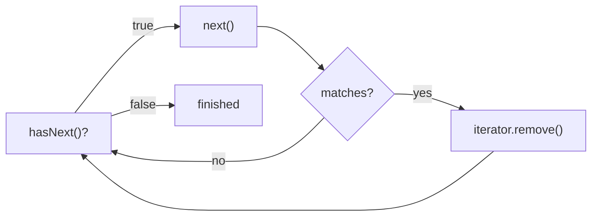

# Exercise 5 — Safe Removal During Iteration

**Module 5** · Pre-lab practice · Checkpoint D · all 7 then lab
**Folder:** `examples/module-05-exercises/` ([setup](EXERCISES-INDEX.md))


## Activity card

| | |
| --- | --- |
| **Objective** | Remove elements safely with Iterator.remove() |
| **Skills practiced** | Iterator, ConcurrentModificationException awareness |
| **Expected outcome** | Safe removal demo; notes why enhanced-for remove fails |
| **Estimated time** | 12–15 minutes |
| **File to create** | `examples/module-05-exercises/IteratorDemo.java` |
| **Checkpoint** | D (after slides 143–145) |

## What you will learn

- Do not remove via for-each
- Iterator.remove is the safe path
- Fail-fast iterators detect structural mods

**Enterprise context:** Batch cleanup of expired holds must not corrupt the catalog mid-iteration.

## Worked example (read first)

Here is the shape of a complete answer for this exercise. Adapt the content — do not leave blanks.

```text
Remaining: [Java 21, Clean Code]
```

Then follow **Steps** to create your own file.


## Starter (fill in the TODOs)

Optional: copy from [`starter/`](starter/README.md). Or paste:


Paste this skeleton, then replace each `_____` and `// TODO` with working code. Do **not** leave TODOs in your finished file.

```java
import java.util.ArrayList;
import java.util.Iterator;
import java.util.List;

public class IteratorDemo {
    public static void main(String[] args) {
        // TODO: wrap List.of(...) in new ArrayList<>(...) so removal is allowed
        List<String> titles = _____;

        // TODO: obtain an Iterator<String> from titles
        Iterator<String> iterator = _____;

        // TODO: loop while iterator.hasNext()
        while (_____) {
            String title = iterator.next();

            if (title.startsWith("Deprecated")) {
                // TODO: remove through the iterator (not titles.remove)
                _____;
            }
        }

        System.out.println("Remaining: " + titles);
    }
}
```

## Iterator protocol



| Method | Rule |
| ------ | ---- |
| `hasNext()` | Check before reading |
| `next()` | Advance and return one item |
| `iterator.remove()` | Remove the item returned by the latest `next()` |
| `titles.remove(...)` inside this loop | Unsafe structural modification |

## Steps

### Step 1 — Create `IteratorDemo.java`

**Why:** Lab 5 removes items during iteration; the iterator protocol prevents concurrent-modification errors.

1. **New → File** → `IteratorDemo.java`.
2. Paste the starter.
3. Fill every `_____` / `// TODO`. Save.

### Step 2 — Compile and run

**Windows:**

```powershell
cd $env:USERPROFILE\java-bootcamp\examples\module-05-exercises
javac IteratorDemo.java
java IteratorDemo
```

**macOS:**

```bash
cd ~/java-bootcamp/examples/module-05-exercises
javac IteratorDemo.java
java IteratorDemo
```

**Verified (Windows):**

```text
Remaining: [Java 21, Clean Code]
```

### Step 3 — Run the failure experiment

Replace:

```java
iterator.remove();
```

with:

```java
titles.remove(title);
```

Run again. A `ConcurrentModificationException` is expected because the list is structurally modified outside the iterator while iteration is active.

Restore `iterator.remove()` before continuing.

### Step 4 — Know the simpler alternative

For this specific condition, Java also supports:

```java
titles.removeIf(
        title -> title.startsWith("Deprecated"));
```

This exercise uses `Iterator` because Lab 5 requires understanding its safe-removal contract.

## Expected result

Both deprecated titles are removed without `ConcurrentModificationException`.


## Debug / design challenge

Reproduce CME then fix with Iterator.

## Predict the Output / Behavior

list.remove inside for-each — what exception?

## Troubleshooting

### If it fails

| Problem | Fix |
| ------- | --- |
| `UnsupportedOperationException` | Wrap `List.of(...)` in `new ArrayList<>(...)` |
| `IllegalStateException` from remove | Call `next()` before each `iterator.remove()` |
| Concurrent modification | Remove through the iterator, not the list |
| `illegal start of expression` near `_____` | Replace every blank with real Java — blanks are not valid code |

## Pass criteria

_Check **Pass** or **Fail** yourself. Do not write these marks anywhere — nothing is submitted or graded. Commit your work to your GitHub repo._

| # | Confirm | Self-check |
| - | ------- | ---------- |
| 1 | Remaining list is `[Java 21, Clean Code]` | Pass / Fail |
| 2 | Failure experiment produces concurrent-modification evidence | Pass / Fail |
| 3 | You can explain the iterator remove protocol | Pass / Fail |
