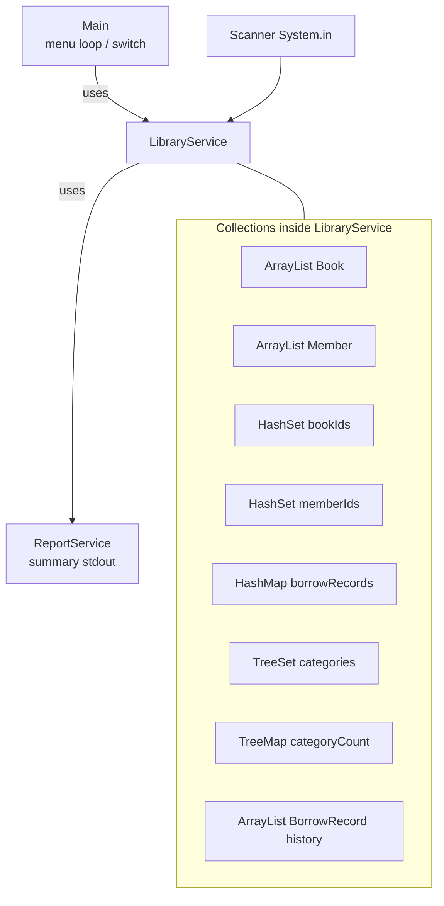

# Lab 5: Java Collections Framework — Library Management System

> **Participants:** Module sequence is in [`../README.md`](../README.md). **Do not start this guide until** you have finished Module 5 [pre-lab exercises 1–7](../exercises/EXERCISES-INDEX.md) (Pass — check yourself, do not write it down). Then open **one** OS how-to ([Windows](LAB-5-WINDOWS.md) · [macOS](LAB-5-MACOS.md)). In class, prefer the **45-minute timed path** with [`starter/`](starter/README.md); the **full path** is every Step below (homework / extended). This repo has no answer keys — complete the TODOs yourself. See [Which file do I open?](../../../_PARTICIPANT-FILE-GUIDE.md).

## Activity card

| | |
| --- | --- |
| **Objective** | Build a library console: List catalog, Set IDs, Map loans, TreeSet/TreeMap reports |
| **Skills practiced** | Collection choice, borrow/return invariants, safe iteration, sorted views |
| **Expected outcome** | Smoke path: add → register → borrow → reports → exit; commit to GitHub (no screenshots) |
| **Estimated time** | Timed path ~45 min · Full path 90–240 min |
| **Prerequisites** | Lab 0–3 habits · Exercises 1–7 Pass · JDK 21 |
| **Expected files** | `examples/Lab5-LibraryManagement/src/com/academy/library/*.java` |
| **Validation checkpoints** | Starter smoke test · GUIDE Implementation Checkpoints |

**Module:** 5 — Java Collections Framework  
**Duration:** ~45 minutes (timed path with starter) · Full path: 90–240 minutes (Day 4 core checkpoint ~90 min; finish remaining menu paths as extended work)

**Primary IDE:** IntelliJ IDEA Community Edition · **Optional IDE:** VS Code

| OS | How-to for this lab |
| -- | ------------------- |
| Windows | [LAB-5-WINDOWS.md](LAB-5-WINDOWS.md) |
| macOS | [LAB-5-MACOS.md](LAB-5-MACOS.md) |

> **Incremental build:** Exercises 1–7 (List/Set/Map/Iterator/choice + warm-up) → Lab 5 packaged `com.academy.library` with domain types and menu. Same `java-bootcamp`, new folder `Lab5-LibraryManagement/`.

> **Classroom pacing:** [`../PACING.md`](../PACING.md) (Checkpoints A–F).

## 45-minute timed path (use starter)

In class, use the starter templates so the **core** objectives fit **~45 minutes**. The full Steps below remain for homework / extended depth.

> **Timed path:** Skip recreating domain classes / add/register helpers (already in the starter). Fill only `LibraryService.borrowBook`, `LibraryService.returnBook`, `ReportService.displaySummaryReport`, and `findMostPopularCategory`. Export (menu 17) and performance comparison (menu 14) are **bonus** — starter stubs print a Bonus message so exploring those menu items does not crash.

1. Open [`starter/README.md`](starter/README.md).
2. Copy `starter/Lab5-LibraryManagement/` into your `java-bootcamp/examples/Lab5-LibraryManagement/` target folder (commands in the starter README).
3. Fill the core TODOs listed above — complete every TODO yourself.
4. Run the starter smoke test; commit your work to your GitHub repo (no screenshots).
5. Check the **timed-path Pass criteria** in the starter README yourself (do not write the marks down). Continue remaining GUIDE steps only if time allows (or as homework).

| Path | Time | Scope |
| ---- | ---- | ----- |
| **Timed (default)** | ~45 min | borrow / return / summary (+ popular category) + smoke |
| **Full (extended)** | see Duration | Every Step in this GUIDE (export, performance, history bonuses) |

**Verified participant layout (Windows IntelliJ + PowerShell; Temurin JDK 21.0.11):**

| Role | Path |
| ---- | ---- |
| IntelliJ opens | `%USERPROFILE%\java-bootcamp` (SDK / language level **21**) |
| Pre-lab exercises | `examples\module-05-exercises\` (flat files — must exist before lab work) |
| This lab project | `examples\Lab5-LibraryManagement\` with `src\com\academy\library\` |
| Compile / run | Named `javac -d out` on the seven sources → `java -cp out com.academy.library.Main` |
| Smoke-test output | Add `101` (incl. **Price `55`**) → register `1` → borrow → reports `Borrowed : 1` / popular `Programming` → `Thank You` |

**If it fails (Windows PowerShell):** Prefer naming each `.java` file in the `javac` line (as in [LAB-5-WINDOWS.md](LAB-5-WINDOWS.md)); do not rely on `*.java` globs. Mark `examples\Lab5-LibraryManagement\src` as Sources Root — not `module-05-exercises`.

---

## What you'll complete (practice only)

Labs and exercises are **practice only**. Nothing is submitted or graded. Do not take screenshots. Check Pass/Fail yourself — do not write those marks anywhere. Commit your work to your private `java-bootcamp` GitHub repo.

Keep this checklist visible while you work.

| # | Deliverable | Where / what |
| - | ----------- | ------------ |
| 1 | Full source | `examples/Lab5-LibraryManagement/src/com/academy/library/` |
| 2 | GitHub commit | Sources in your private `java-bootcamp` repo — no screenshots, nothing to submit |
| 3 | Collection mapping notes | Which field uses List / Set / Map and why |
| 4 | LMS write-up | Compile/run commands (`javac -d out` / `java -cp out com.academy.library.Main`) |

Optional bonuses: history, top borrowed, export, multi-sort. Do not commit a copied answer keys.


## Module 5 exercises you must already have completed

Lab 5 assumes you already practiced these collection skills in `examples/module-05-exercises/`. Do **not** treat Steps 5–11 as your first time choosing List/Set/Map or coordinating borrow state.

| Exercise | You already did | Lab 5 builds on it |
| -------- | --------------- | ------------------ |
| 1 — ArrayList | Ordered CRUD, index, duplicates | Steps 5–7 catalog `ArrayList<Book>` / display |
| 2 — HashSet / TreeSet | Uniqueness + sorted view | Steps 5–6 ID sets; Step 11 `TreeSet` categories |
| 3 — HashMap | put/get/entrySet | Step 9 borrow `HashMap` |
| 4 — TreeMap | Sorted keys, first/last | Step 11 category counts / insights |
| 5 — Safe iteration | `Iterator.remove` | Step 7 four iteration styles |
| 6 — Choose collection | Match requirements to structures | Step 5 field design + reflection |
| 7 — Library warm-up | List + Map checkout invariant | Steps 6 & 9; lab adds domain types, menu, reports |

**Intentional deltas (extend — do not paste exercise code blindly):**

* Exercises were **flat** default-package files; Lab uses `package com.academy.library` + `src` / `out` (Lab 2–3 pattern)
* Exercise 7 used simple strings; Lab uses `Book`, `Member`, `BorrowRecord`, search, sort, `ReportService`
* Exercise 6 was analysis-only (`collection-choices.md`); Lab implements those choices in code

**Lab-only additions:** full menu, search/sort (`Comparable`/`Comparator`), `ReportService`, performance table (Step 15), GitHub commit of your sources.

If any of Exercises 1–7 is still **Fail**, finish that exercise first — then return here.

---

## Lab Overview

This Module 5 lab is the consolidation after Module 5 slides and [Exercises 1–7](../exercises/EXERCISES-INDEX.md). You already practiced List, Set, Map, TreeMap, safe iteration, collection choice, and a library warm-up in `module-05-exercises/`. Here you assemble those skills into a **Library Management System** console with packages, domain types, and a full staff menu.

## Learning Objectives

After completing this lab, you will be able to:

* Apply exercise List/Set/Map skills to a packaged library domain (`ArrayList`, `HashSet`, `HashMap`, `TreeSet`, `TreeMap`)
* Choose an appropriate collection implementation for ordered storage, uniqueness, and key lookups (builds on Exercise 6)
* Store custom objects in collections and print them with clear `toString()` output
* Prevent duplicate book/member IDs with `HashSet` before inserts (builds on Exercise 2)
* Model borrow state with a `HashMap` plus optional `ArrayList<BorrowRecord>` history (builds on Exercises 3 & 7)

## Business Scenario

A **training institute** maintains a small campus library. Staff need a console application (plain JDK—no database, no Spring, no GUI framework) to manage books, members, borrowing, searching, sorting, and reporting.

You already practiced collection building blocks in Module 5 Exercises 1–7. Today’s practice pass consolidates those skills into one Library Management menu (pedagogical institute data — not live CRM PII).

Instead of a database, **all data lives in Java Collections** for the life of the process.

**Optional forward look:** The same “pick List vs Set vs Map for each concept” thinking later helps when CRM platforms hold customer lists, id→entity maps, and unique email sets. You are not building CRM today.

**Security note for evidence.** Do not paste secrets or tokens into screenshots or notes. Demo data (`Java Fundamentals`, member `1`) is fine to keep in your GitHub repo.

---

## Architecture Context
### Which collection for which domain concept



### Beginner decision guide (List / Set / Map)


**Beginner meaning in one sentence each:**

| Type | Think of it as… | Library example |
| ---- | ---------------- | --------------- |
| **List** | Numbered shelf row — order matters; same title can appear twice unless you guard IDs | `ArrayList<Book> books` |
| **Set** | Bag of IDs — each value at most once | `HashSet<String> bookIds` |
| **Map** | Lookup table — give a key, get a value | `HashMap` bookId → memberId |

### Lab flow

## Prerequisites

Complete [Labs Setup Instructions](../../../SETUP-INSTRUCTIONS.md) and [Lab 0](../../module-00/lab0/LAB-0-GUIDE.md). Confirm:

* **JDK 21** with `javac` and `java` on `PATH`
* **VS Code** and/or **IntelliJ IDEA** — see [`_IDE-CONVENTIONS.md`](../../_IDE-CONVENTIONS.md)
* Workspace: `%USERPROFILE%\java-bootcamp` or `$HOME/java-bootcamp`
* **Module 5 Exercises 1–7 Pass** — hard gate before Step 1 (see mapping table above)
* **Lab 2–3 recommended:** packages under `src/com/academy/...`, `Scanner` + `nextLine()`, thin `Main` + service layer
* Maven is optional—plain `javac`/`java` is the primary path

**Exercise workspace (already done):** `examples/module-05-exercises/` (flat files)  
**Lab workspace (this guide):** `examples/Lab5-LibraryManagement/` (`src/com/academy/library/` + `out/`)

### Pre-flight

```bash
java -version
javac -version
```

**Expected theme:** OpenJDK / Temurin **21.x**.

**If it fails:** Revisit Lab 0; open a new IDE terminal after changing `JAVA_HOME`.

---

## Worked example (read before you code)

Study this pattern once before Step 1. Your job is to apply the same idea in the Steps — do not skip ahead to a full solution.

```java
import java.util.ArrayList;
import java.util.HashMap;
import java.util.HashSet;
import java.util.TreeMap;
import java.util.TreeSet;

private final ArrayList<Book> books = new ArrayList<>();
private final ArrayList<Member> members = new ArrayList<>();
private final HashSet<String> bookIds = new HashSet<>();
private final HashSet<String> memberIds = new HashSet<>();
private final HashMap<String, String> borrowRecords = new HashMap<>();
private final TreeSet<String> categories = new TreeSet<>();
private final TreeMap<String, Integer> categoryBookCount = new TreeMap<>();
private final ArrayList<BorrowRecord> borrowHistory = new ArrayList<>();
```

**What to notice:** Match names, IDs, and failure behavior from the scenario — instructors check these.

---

## Steps from the training slides

> Paths use `$HOME/java-bootcamp` (PowerShell/bash/zsh). On classic cmd use `%USERPROFILE%\java-bootcamp\...`.

### Step 1 — Create the Lab 5 project tree

**Why:** Folder path must match `package com.academy.library;` or `javac` / `java` fail confusingly.

**Builds on Lab 2–3:** Same `src/com/academy/...` + `out/` compile pattern as banking and syntax labs — exercises stayed flat; the lab is packaged.

**Do this:**

**VS Code:** **File → Open Folder…** → `Lab5-LibraryManagement` (or parent `java-bootcamp`). Terminal: `` Ctrl+` ``.

**IntelliJ:** **File → Open…** → select `Lab5-LibraryManagement`. **Project Structure → Project → SDK = 21**. Later, run `Main` via the green gutter arrow.

```bash
mkdir -p "$HOME/java-bootcamp/examples/Lab5-LibraryManagement/src/com/academy/library"
cd "$HOME/java-bootcamp/examples/Lab5-LibraryManagement"
```

Windows cmd:

```text
mkdir %USERPROFILE%\java-bootcamp\examples\Lab5-LibraryManagement\src\com\academy\library
mkdir %USERPROFILE%\java-bootcamp\notes\lab-5
cd /d %USERPROFILE%\java-bootcamp\examples\Lab5-LibraryManagement
```

**Expected result:**

```text
Lab5-LibraryManagement/
  src/com/academy/library/   ← empty, ready for .java files
```

**If it fails:** Nested `com/academy` missing → recreate the three folders. IntelliJ marks sources wrong → mark `src` as Sources Root (right-click → Mark Directory as → Sources Root).

---

### Step 2 — Create `Book.java`

**Why:** The catalog is a **List** of books; IDs stay `final` so identity does not mutate after insert into a `Set`/`Map`.

**Do this:** Create `src/com/academy/library/Book.java` with:

* Package `com.academy.library`
* Fields: `final String bookId`, `title`, `author`, `category`, `price`, `boolean available`
* Constructor initializing fields (`available = true`)
* Getters / setters (no setter for `bookId`)
* `implements Comparable<Book>` — compare titles case-insensitive
* `toString()` similar to:  
  `ID: %s | %s | %s | %s | $%.2f | Available|Borrowed`

**Expected result:** File compiles in isolation once you have a `main` later; `compareTo` returns negative/zero/positive for title order.

**If it fails:** Forgot `package` line → add it. Mutable `bookId` → make it `final`.

---

### Step 3 — Create `Member.java`

**Why:** Members are stored in an `ArrayList` like books; uniqueness will be enforced with a `HashSet` of IDs.

**Do this:** Create `Member.java` with `memberId` (prefer `final`), `name`, `email`, `phone`, constructor, getters/setters as needed, and a readable `toString()`.

**Expected result:** Clear one-line display for roster printouts.

**If it fails:** Public class / file name mismatch → rename carefully (case-sensitive on macOS/Linux).

---

### Step 4 — Create `BorrowRecord.java` (history helper)

**Why:** A **Map** answers “who has this book *now*”; a **List** of records answers “what happened over time.”

**Do this:** Create `BorrowRecord.java` holding book ID, member ID, and a borrow date (e.g. `LocalDate`). Include a simple `toString()`.

**Expected result:** Type ready for an `ArrayList<BorrowRecord> borrowHistory` field.

**If it fails:** Skipping this file is OK for a minimal core if you omit history bonuses—but keep it if you plan menu options 15–16.

---

### Step 5 — Start `LibraryService` with the right collections

**Why:** Picking collection types is the heart of Module 5. Wrong type = wrong operations (e.g. using only a List to check duplicates is O(n) and error-prone).

**Builds on Exercises 1–4 & 6:** You already used `ArrayList`, `HashSet`, `HashMap`, `TreeSet`, and `TreeMap` in isolation — here you declare all fields together for one domain service.

**Do this:** Create `LibraryService.java` with a `Scanner` field and:

```java
import java.util.ArrayList;
import java.util.HashMap;
import java.util.HashSet;
import java.util.TreeMap;
import java.util.TreeSet;

private final ArrayList<Book> books = new ArrayList<>();
private final ArrayList<Member> members = new ArrayList<>();
private final HashSet<String> bookIds = new HashSet<>();
private final HashSet<String> memberIds = new HashSet<>();
private final HashMap<String, String> borrowRecords = new HashMap<>();
private final TreeSet<String> categories = new TreeSet<>();
private final TreeMap<String, Integer> categoryBookCount = new TreeMap<>();
private final ArrayList<BorrowRecord> borrowHistory = new ArrayList<>();
```

Constructor: `LibraryService(Scanner scanner)` storing the scanner (and later a `ReportService`).

**Expected result:** Empty collections compile; service is ready for methods.

**If it fails:** Raw types (`ArrayList` without `<Book>`) → add generics. Missing imports for `HashMap` etc. → `import java.util.*;` or specific imports.

---

### Step 6 — Add book and register member

**Why:** Every insert should update **List** (data) + **Set** (ID guard) + category structures.

**Builds on Exercises 1–2:** List insert + Set duplicate guard — same pattern as Exercise 1 CRUD with Exercise 2 `contains` checks, now on `Book` / `Member` types.

**Do this:** Implement `addBook()`:

1. Prompt for Book ID; if `bookIds.contains(id)` print `Book already exists.` and return
2. Prompt title, author, category, price (parse a positive double)
3. Create `Book`, `books.add`, `bookIds.add`, `categories.add`, update `categoryBookCount`
4. Print `Book Added Successfully`

Implement `registerMember()` similarly with `memberIds` / `members` and message `Member Registered Successfully`.

**Expected result:** Duplicate IDs rejected; first insert succeeds.

**If it fails:** Using `==` for String IDs → use `contains` / `equals`. Price parse crash → wrap `Double.parseDouble` and re-prompt.

---

### Step 7 — Display books with four iteration styles

**Why:** Interviewers and instructors look for comfort with classic `for`, enhanced `for`, `Iterator`, and `forEach`.

**Builds on Exercise 5:** Safe iteration practice — here you demonstrate all four styles on the live catalog (not just remove-via-iterator).

**Do this:** Implement `displayBooks()`:

* If empty → `No books available.`
* Otherwise print sections:
  * Traditional indexed `for`
  * Enhanced `for`
  * `Iterator`
  * `books.forEach(...)`

Also implement `displayMembers()` similarly (at least one clear loop style).

**Expected result:** Each book line appears (optionally multiple times across styles—that is intentional for learning).

**If it fails:** Concurrent modification during display → do not add/remove while iterating unless using the iterator’s `remove` carefully (not needed here).

---

### Step 8 — Search books

**Why:** Searching a **List** by field teaches linear scan before databases appear.

**Do this:** Implement `searchBook()` with a submenu, for example:

1. By ID  
2. By title  
3. By author  
4. By category  
5. Partial title (bonus-friendly)

Print matches via `toString()`; if none, print a clear not-found message.

**Expected result:** Exact ID hit prints one book; bad ID prints not found.

**If it fails:** Case sensitivity surprises → use `equalsIgnoreCase` / `toLowerCase` for titles when appropriate.

---

### Step 9 — Borrow and return with `HashMap`

**Why:** A **Map** is the natural “book → current borrower” structure. Availability flags stay in sync with map entries.

**Builds on Exercises 3 & 7:** Exercise 3 `put`/`get`/`entrySet`; Exercise 7 checkout invariant (remove from available list **before** map update, one active loan per member). Lab adds domain validation, `BorrowRecord` history, and menu wiring.

**Do this:**

**`borrowBook()`:**

1. Prompt Book ID and Member ID  
2. Validate book exists, member exists, book not already in `borrowRecords`, book available  
3. `borrowRecords.put(bookId, memberId)`; set `available = false`  
4. Optionally append `BorrowRecord` and bump a borrow-frequency map  
5. Print `Book Borrowed Successfully`

**`returnBook()`:**

1. Prompt Book ID  
2. If not borrowed → error  
3. `borrowRecords.remove(bookId)`; set available true  
4. Print success

Also implement `displayBorrowedBooks()` by iterating `borrowRecords.entrySet()`.

**Expected result:** After borrow, book shows Borrowed; after return, Available again.

**If it fails:** Borrow succeeds twice → check `borrowRecords.containsKey` before put. Returning without remove → Map still blocks next borrow.

---

### Step 10 — Sort with `Comparable` and `Comparator`

**Why:** `Comparable` = natural order on the type; `Comparator` = alternate sort strategies (price, author, …).

**Do this:**

1. Ensure `Book.compareTo` sorts by title  
2. Create `BookComparator.java` implementing `Comparator<Book>` by **price**  
3. Implement `sortBooks()` menu: title (`Collections.sort(books)`), price (`books.sort(new BookComparator())`), and optionally author/category

**Expected result:** After title sort, alphabetically earlier titles appear first; after price sort, cheaper books rise.

**If it fails:** `ClassCastException` → forgot `implements Comparable<Book>`. Wrong import → `java.util.Comparator`.

---

### Step 11 — `ReportService` and category insights

**Why:** Reporting should not clutter `Main`. Sorted category views showcase `TreeSet` / `TreeMap`.

**Builds on Exercises 2 & 4:** `TreeSet` sorted unique categories and `TreeMap` sorted counts — same APIs you practiced in Exercise 4 (`firstKey` / `lastKey` mindset).

**Do this:** Create `ReportService.java` that reads collections from `LibraryService` and prints:

```text
Reports
Books : ...
Borrowed : ...
Available : ...
Members : ...
Most Popular Category : ...
```

Wire `displayReports()` on the service to call the report. Implement `displayCategoryInsights()` to print sorted category names (`TreeSet`) and sorted counts (`TreeMap`).

**Expected result:** After adding one Programming book and borrowing it, popular category is `Programming`, Borrowed `1`, Available `0`.

**If it fails:** Most popular `N/A` with empty map → handle empty with a default string.

---

### Step 12 — Build `Main` menu

**Why:** Thin entry point keeps SRP: `Main` owns the loop; `LibraryService` owns operations.

**Do this:** Create `Main.java`:

```text
=====================================
Library Management System
=====================================
1 Add Book
2 Register Member
3 Display Books
4 Display Members
5 Search Book
6 Borrow Book
7 Return Book
8 Display Borrowed Books
9 Sort Books
10 Reports
11 Exit
12 Display Available Books
13 Category Insights (TreeSet/TreeMap)
14 Performance Comparison (Bonus)
15 Borrow History (Bonus)
16 Top 5 Borrowed Books (Bonus)
17 Export Report (Bonus)
Choice :
```

Use `Scanner.nextLine()`, parse `int`, `switch` to service methods. Choice `11` prints `Thank You` and exits.

**Expected result:** Invalid letters reprint menu safely; `11` exits cleanly.

**If it fails:** Menu “skips” inputs → avoid mixing `nextInt()` with `nextLine()`; parse with `Integer.parseInt` on `nextLine()`.

---

### Step 13 — Compile and run (primary path)

**Why:** `-d out` mirrors real package layout under classpath—same idea as Lab 2–3.

**Do this:** From project root `Lab5-LibraryManagement`:

**Windows PowerShell** (name each source file — do not rely on `*.java` globs):

```powershell
cd $env:USERPROFILE\java-bootcamp\examples\Lab5-LibraryManagement
Remove-Item -Recurse -Force out -ErrorAction SilentlyContinue
javac -d out `
  src\com\academy\library\Book.java `
  src\com\academy\library\BookComparator.java `
  src\com\academy\library\BorrowRecord.java `
  src\com\academy\library\Member.java `
  src\com\academy\library\ReportService.java `
  src\com\academy\library\LibraryService.java `
  src\com\academy\library\Main.java
java -cp out com.academy.library.Main
```

**macOS / Linux:**

```bash
cd "$HOME/java-bootcamp/examples/Lab5-LibraryManagement"
rm -rf out
javac -d out src/com/academy/library/*.java
java -cp out com.academy.library.Main
```

**IntelliJ:** Run `Main` from the gutter, **or** use the same terminal commands above for progress-check fidelity.

**Expected result:** Menu appears; process waits at `Choice :`.

**If it fails:**

* `package does not exist` / empty glob → on Windows PowerShell name each `.java` file (see [LAB-5-WINDOWS.md](LAB-5-WINDOWS.md)); folders under `src/com/academy/library` must exist  
* `Could not find or load main class` → use `-cp out` and fully qualified name  
* Stale code → delete `out` and recompile

---

### Step 14 — Scripted sample session (match solution themes)

**Why:** Graders compare your session output to the known success themes from the reference solution.

**Do this:** Run the app and enter approximately:

| Step | Input theme |
| ---- | ----------- |
| Choice | `1` |
| Book ID | `101` |
| Title | `Java Fundamentals` |
| Author | `James Gosling` |
| Category | `Programming` |
| Price | `55` |
| Choice | `2` |
| Member ID | `1` |
| Name | `John` |
| Email | `john@example.com` |
| Phone | `1234567890` |
| Choice | `6` |
| Book ID | `101` |
| Member ID | `1` |
| Choice | `10` |
| Choice | `11` |

**Expected result (themes — from solution README):**

```text
Choice : 1
Book ID : 101
Title : Java Fundamentals
Author : James Gosling
Category : Programming
Price : 55
Book Added Successfully

Choice : 2
Member ID : 1
Name : John
Email : john@example.com
Phone : 1234567890
Member Registered Successfully

Choice : 6
Book ID : 101
Member ID : 1
Book Borrowed Successfully

Choice : 10
Reports
Books : 1
Borrowed : 1
Available : 0
Members : 1
Most Popular Category : Programming

Choice : 11
Thank You
```

Screenshot this path for evidence.

**If it fails:** Borrow rejected → register member first; ensure book ID matches exactly (`101`). Reports show Available `1` → borrow map not updated / availability flag not flipped.

---

### Step 15 — Performance comparison (bonus-friendly, recommended)

**Why:** Feeling `ArrayList` vs `LinkedList` once beats memorizing Big-O posters.

**Do this:** Implement `runPerformanceComparison()` (menu 14): insert many integers into `ArrayList` and `LinkedList`, time with `System.nanoTime()`, print ms. Record results in `../../notes/lab5-answers.md` (from project; or `~/java-bootcamp/notes/lab5-answers.md`).

**Expected result:** ArrayList often wins for indexed / end-oriented insert patterns you code; LinkedList shows overhead—document **your** numbers.

**If it fails:** Unfair test (different sizes) → use the same `N` for both lists.

---

### Step 16 — Self-review and optional solution peek

**Why:** Progress checks look for collection *choice* + working menu, not clever one-liners.

**Do this:** Checklist:

* Every source file has `package com.academy.library;`
* IDs guarded by `HashSet`
* Borrow state in `HashMap`
* Reports match sample themes
* Naming is clear; `Main` stays thin

**Expected result:** Instructor can skim and map List/Set/Map usage without guessing.

**If it fails:** Logic piled in `Main` → move prompts into `LibraryService`.

---

## Implementation Checkpoints

### Checkpoint A — Packages + models

_Check **Pass** or **Fail** yourself. Do not write these marks anywhere — nothing is submitted or graded. Commit your work to your GitHub repo._

| # | Confirm | Self-check |
| - | ------- | ---------- |
| 1 | `src/com/academy/library/` contains `Book`, `Member`, (`BorrowRecord`), service types, `Main` | Pass / Fail |
| 2 | All files declare `package com.academy.library;` | Pass / Fail |
| 3 | Edited with VS Code and/or IntelliJ per [`_IDE-CONVENTIONS.md`](../../_IDE-CONVENTIONS.md) | Pass / Fail |

### Checkpoint B — Collections wired

_Check **Pass** or **Fail** yourself. Do not write these marks anywhere — nothing is submitted or graded. Commit your work to your GitHub repo._

| # | Confirm | Self-check |
| - | ------- | ---------- |
| 1 | List / Set / Map / TreeSet / TreeMap fields present as designed | Pass / Fail |
| 2 | Duplicate book/member IDs rejected | Pass / Fail |
| 3 | Borrow uses `HashMap`; return clears the entry | Pass / Fail |

### Checkpoint C — Compile / menu / sample session

_Check **Pass** or **Fail** yourself. Do not write these marks anywhere — nothing is submitted or graded. Commit your work to your GitHub repo._

| # | Confirm | Self-check |
| - | ------- | ---------- |
| 1 | `javac -d out src/com/academy/library/*.java` succeeds | Pass / Fail |
| 2 | `java -cp out com.academy.library.Main` shows the menu | Pass / Fail |
| 3 | Sample session produces Add / Register / Borrow / Reports themes | Pass / Fail |
| 4 | Exit prints `Thank You` | Pass / Fail |

### Checkpoint D — Evidence

_Check **Pass** or **Fail** yourself. Do not write these marks anywhere — nothing is submitted or graded. Commit your work to your GitHub repo._

| # | Confirm | Self-check |
| - | ------- | ---------- |
| 2 | Short note explaining why List vs Set vs Map for each field | Pass / Fail |
| 3 | Optional performance table filled | Pass / Fail |

---

## Reference Commands, Configuration, and Code

### Primary compile / run

```bash
cd "$HOME/java-bootcamp/examples/Lab5-LibraryManagement"
javac -d out src/com/academy/library/*.java
java -cp out com.academy.library.Main
```

### Clean rebuild

```bash
cd "$HOME/java-bootcamp/examples/Lab5-LibraryManagement"
rm -rf out
javac -d out src/com/academy/library/*.java
# PowerShell: Remove-Item -Recurse -Force out
```

## Failure Experiments

1. Skip `HashSet` and insert two books with ID `101` → confusing catalog; restore Set guard.  
2. Toggle only `available` without Map → cannot answer “who has it?”; restore `HashMap`.  
3. Compile without `-d out` / wrong `-cp` → cannot load main; use the Step 13 commands.  
4. Mix `nextInt()` + `nextLine()` → skipped prompts; parse all input via `nextLine()`.

---

## Troubleshooting

| Symptom | Likely cause | Fix |
| ------- | ------------ | --- |
| `javac` not found | PATH / JAVA_HOME | Lab 0 |
| Package does not exist | Folder ≠ package | Recreate `src/com/academy/library` |
| Cannot load main class | Wrong `-cp` | `java -cp out com.academy.library.Main` |
| Duplicate still inserted | No Set check | `bookIds.contains` before add |
| Borrow always fails | Member not registered / already borrowed | Follow sample order |
| Reports Available wrong | Map / flag out of sync | Update both on borrow/return |
| IntelliJ cannot run Main | SDK / sources root | SDK 21; mark `src` as Sources |
| VS Code terminal wrong folder | cwd | `cd` to `Lab5-LibraryManagement` |

## Security and Cleanup

**Security:** Training console only—no auth; data is in-memory. Do not paste real PII or secrets into notes or GitHub.

**Cleanup:**

```bash
cd "$HOME/java-bootcamp/examples/Lab5-LibraryManagement"
rm -rf out
rm -f library-report.txt
# PowerShell: Remove-Item -Recurse -Force out -ErrorAction SilentlyContinue
```

Keep sources and evidence. Do not commit copied answer keys.

Use **What you'll complete (practice only)** at the top as a self-check list.


## Reflection Questions

Write short answers in `../../notes/lab5-answers.md` (from project; or `~/java-bootcamp/notes/lab5-answers.md`):

Write **1–3 sentence** answers (not essays):

1. When choose `List` over `Set`?
2. Why `HashSet` before inserting a book ID?
3. Why a `Map` for “currently borrowed” vs only a boolean?

---


