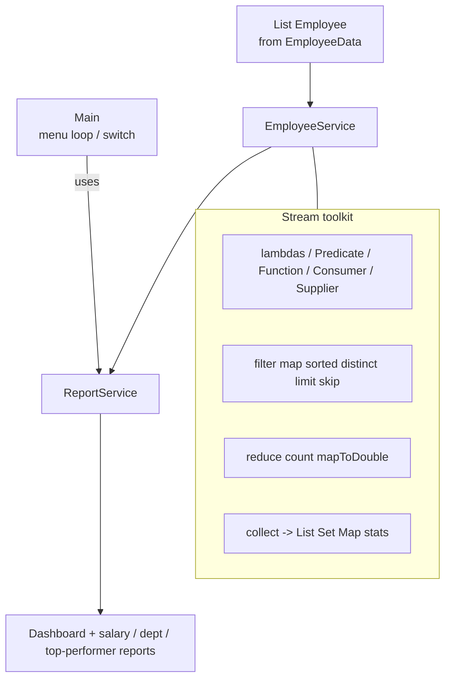

# Lab 6: Streams and Lambda Expressions — Employee Analytics System

> **Participants:** Module sequence is in [`../README.md`](../README.md). **Do not start this guide until** you have finished Module 6 [pre-lab exercises 1–7](../exercises/EXERCISES-INDEX.md) (Pass — check yourself, do not write it down). Exercise 8 (parallel bonus) is recommended but not required for the core gate. Then open **one** OS how-to ([Windows](LAB-6-WINDOWS.md) · [macOS](LAB-6-MACOS.md)). In class, prefer the **45-minute timed path** with [`starter/`](starter/README.md); the **full path** is every Step below (homework / extended). This repo has no answer keys — complete the TODOs yourself. See [Which file do I open?](../../../_PARTICIPANT-FILE-GUIDE.md).

## Activity card

| | |
| --- | --- |
| **Objective** | Build an employee analytics console with stream filter/map/group/reduce dashboards |
| **Skills practiced** | Stream pipelines, Collectors, Optional, service-layer reports |
| **Expected outcome** | Menus 1→8 dashboard (Average Salary **100680**) → 9 exit; commit to GitHub (no screenshots) |
| **Estimated time** | Timed path ~45 min · Full path 90–240 min |
| **Prerequisites** | Lab 0–5 habits · Exercises 1–7 Pass · JDK 21 |
| **Expected files** | `examples/Lab6-EmployeeAnalytics/src/com/academy/analytics/*.java` |
| **Validation checkpoints** | Starter smoke test · GUIDE Implementation Checkpoints |

**Module:** 6 — Streams and Functional Programming  
**Duration:** ~45 minutes (timed path with starter) · Full path: 90–240 minutes (Day 5 core checkpoint ~75 min; finish remaining menu paths as extended work)

**Primary IDE:** IntelliJ IDEA Community Edition · **Optional IDE:** VS Code

| OS | How-to for this lab |
| -- | ------------------- |
| Windows | [LAB-6-WINDOWS.md](LAB-6-WINDOWS.md) |
| macOS | [LAB-6-MACOS.md](LAB-6-MACOS.md) |

> **Incremental build:** Exercises 1–7 (5-employee streams) → Lab 6 packaged `com.academy.analytics` with 25-employee seed, menu, and dashboard. Same `java-bootcamp`, new folder `Lab6-EmployeeAnalytics/`.

> **Classroom pacing:** [`../PACING.md`](../PACING.md) (Checkpoints A–F).

## 45-minute timed path (use starter)

In class, use the starter templates so the **core** objectives fit **~45 minutes**. The full Steps below remain for homework / extended depth.

> **Timed path:** Do **not** “fill every TODO.” Implement only the **CORE methods needed for menus 1–9** (listed in the starter README). Menu items **10–21** are Bonus/Demo stubs that print a message — they must not crash while you explore. Prioritize classroom smoke **1 → 8 → 9** first (list + dashboard Average Salary **100680** + exit); finish CORE menus **2–7** as homework if class time ends.

1. Open [`starter/README.md`](starter/README.md).
2. Copy `starter/Lab6-EmployeeAnalytics/` into your `java-bootcamp/examples/Lab6-EmployeeAnalytics/` target folder (commands in the starter README).
3. Fill CORE method TODOs for menus 1–9 — complete every TODO yourself.
4. Run the starter smoke test (at least menus `1` → `8` → `9`); commit your work to your GitHub repo (no screenshots).
5. Check the **timed-path Pass criteria** in the starter README yourself (do not write the marks down). Complete remaining CORE menus 2–7 and GUIDE steps as homework / extended work.

| Path | Time | Scope |
| ---- | ---- | ----- |
| **Timed (default)** | ~45 min | CORE methods for menus 1–9; classroom prioritizes smoke **1+8+9** |
| **Full (extended)** | see Duration | Every Step + bonus menus 10–21 |

**Verified participant layout (Windows IntelliJ + PowerShell; Temurin JDK 21.0.11):**

| Role | Path |
| ---- | ---- |
| IntelliJ opens | `%USERPROFILE%\java-bootcamp` (SDK / language level **21**) |
| Pre-lab exercises | `examples\module-06-exercises\` (flat files — must exist before lab work) |
| This lab project | `examples\Lab6-EmployeeAnalytics\` with `src\com\academy\analytics\` |
| Compile / run | Named `javac -d out` on the five sources → `java -cp out com.academy.analytics.Main` |
| Smoke-test output | Menu 1 (25 rows) → 8 dashboard Average Salary **100680** → 9 `Thank You` |

**If it fails (Windows PowerShell):** Prefer naming each `.java` file in the `javac` line (as in [LAB-6-WINDOWS.md](LAB-6-WINDOWS.md)); do not rely on `*.java` globs. Mark `examples\Lab6-EmployeeAnalytics\src` as Sources Root — not `module-06-exercises`.

---

## What you'll complete (practice only)

Labs and exercises are **practice only**. Nothing is submitted or graded. Do not take screenshots. Check Pass/Fail yourself — do not write those marks anywhere. Commit your work to your private `java-bootcamp` GitHub repo.

Keep this checklist visible while you work.

| # | Deliverable | Where / what |
| - | ----------- | ------------ |
| 1 | Full source | `examples/…/src/com/academy/analytics/` — `Employee`, `EmployeeData`, `EmployeeService`, `ReportService`, `Main` |
| 2 | GitHub commit | Sources in your private `java-bootcamp` repo — no screenshots, nothing to submit |
| 3 | Stream operations table | Completed table of stream ops you used |
| 4 | LMS / README notes | Overview, streams, functional interfaces, lambdas, compile/run, sample dashboard, learnings |
| 5 | Reflection answers | `notes/lab6-answers.md` |

Optional: labeled bonuses; git repo. Do not commit secrets or a copied answer keys.


## Core path first (menu options 1–9)

**Complete options 1–9 before any bonuses.** That is the CORE path:

| Option | Feature |
| ------ | ------- |
| 1 | Display Employees |
| 2 | Employees By Department |
| 3 | Salary Report |
| 4 | Top Performers |
| 5 | Highest Salary |
| 6 | Department Statistics |
| 7 | Active Employees |
| 8 | **Dashboard** (expected numbers below) |
| 9 | Exit |

Teaching demos and stretch features (menu 10+) come **after** CORE works. Optional stretch work only after CORE pass criteria.

---

## Module 6 exercises you must already have completed

Lab 6 assumes you already practiced stream skills in `examples/module-06-exercises/`. Do **not** treat Steps 5–16 as your first time with lambdas, `filter`, `map`, or `groupingBy`.

| Exercise | You already did | Lab 6 builds on it |
| -------- | --------------- | ------------------ |
| 1 — Lambda / functional interface | Anonymous class → lambda; shared 5-employee dataset | Steps 5–6 lambda + `Predicate`/`Function`/`Consumer`/`Supplier` demos |
| 2 — Filter by salary | `filter` + predicate + `toList` | Steps 8–9 single and chained filters |
| 3 — List all names | `map` + method reference | Step 10 mapping projections |
| 4 — Min / max salary | `Comparator`, `min`/`max`, `Optional` | Steps 11, 16 sort + highest-paid lookup |
| 5 — Map 10% raise | Non-mutating `map` transform | Step 10 salary projections; lab reports use similar transforms |
| 6 — Count by department | `groupingBy` + `counting` | Step 15 collectors / department stats |
| 7 — HR department names | Compose `filter` → `map` → `sorted` → `toList` | Steps 9–11 + ReportService department views |
| 8 — `parallelStream` bonus (recommended) | Correctness-first parallel compare | Lab bonus menu options; do not skip core for parallel |

**Intentional deltas (extend — do not paste exercise code blindly):**

* Exercises used a **5-employee** flat dataset; Lab loads **25** employees via `EmployeeData`
* Exercises were default-package flat files; Lab uses `package com.academy.analytics` + `src` / `out` (Lab 5 pattern)
* Exercise 6–7 were single-pipeline drills; Lab adds full menu, dashboard (option 8), `ReportService`, stream-ops table

**Lab-only additions:** `EmployeeService` + `ReportService`, CORE menu 1–9, dashboard expected numbers, reflection + stream-operations evidence, optional demo menu 10–21.

If any of Exercises 1–7 is still **Fail**, finish that exercise first — then return here.

---

## Lab Overview

This Module 6 lab is the consolidation after Module 6 slides and [Exercises 1–7](../exercises/EXERCISES-INDEX.md) (Exercise 8 parallel bonus recommended). You already practiced lambdas, filter/map/sort, min/max, grouping, and composed pipelines on a small flat dataset. Here you assemble those skills into an **Employee Analytics System** with 25 employees, a service layer, dashboard, and menu.

## Learning Objectives

After completing this lab, you will be able to:

* Write **lambda expressions** that replace anonymous classes for simple behaviors (builds on Exercise 1)
* Use core **functional interfaces**: `Predicate`, `Function`, `Consumer`, `Supplier` (builds on Exercise 1)
* Create streams from `List`, arrays, and `Set`
* Build **stream pipelines** with intermediate and terminal operations
* Filter collections with single and chained `filter()` predicates (builds on Exercises 2 & 7)

## Business Scenario

A **training institute’s corporate partner** maintains an in-memory employee roster for classroom demos. You already practiced stream pipelines on a five-employee flat dataset in Module 6 Exercises 1–7. Today’s practice pass consolidates those skills into a 25-employee analytics console (pedagogical payroll data — not live PII).

You build and run the app on your **laptop** with plain JDK—no database, no Spring, no GUI framework. Instead of nested loops, **all analytics must use the Java Streams API** (and lambdas / method references where appropriate).

**Optional forward look:** The same “filter → map → collect → report” thinking later helps when CRM platforms answer “active customers in region X ordered by lifetime value.” You are not building CRM today; you are learning stream judgment that makes Lab 8+ less painful.

**Security note for evidence.** Do not paste GitHub credentials, AWS secrets, or tokens into notes or GitHub. Demo employee names and salaries are fine to keep in your GitHub repo.

---

## Architecture Context
### Stream pipeline shape (NOW)



### Intermediate vs terminal (ASCII)

```text
  Source          Intermediate (lazy)              Terminal (eager)
  -----------     ---------------------------      ---------------------
  list.stream() → filter → map → sorted → ...  →   forEach / collect /
                                                   count / reduce /
                                                   findFirst / max / …

  Nothing runs until a terminal operation is invoked.
  A stream is typically usable once—rebuild .stream() for each query.
```

## Prerequisites

Complete the [Labs Setup Instructions](../../../SETUP-INSTRUCTIONS.md) and [Lab 0](../../module-00/lab0/LAB-0-GUIDE.md) before this lab. Confirm:

* **JDK 21** with `javac` and `java` on `PATH` (Lab 0)
* **Laptop IDE:** **IntelliJ IDEA Community** (primary) or **VS Code** (optional) — see [`_IDE-CONVENTIONS.md`](../../_IDE-CONVENTIONS.md)
* Workspace open at `~/java-bootcamp` (Windows: `%USERPROFILE%\java-bootcamp`)
* Working integrated terminal in your IDE
* **Module 6 Exercises 1–7 Pass** — hard gate before Step 1 (Exercise 8 parallel bonus recommended)
* **Lab 5 Collections recommended:** `List`, generics, packages under `src/com/academy/...`, menu → service layering
* **Maven is optional**—plain `javac`/`java` is the primary path
* No secrets (keys, tokens, passwords) committed to Git

**Exercise workspace (already done):** `examples/module-06-exercises/` (flat files, 5-employee shared dataset)  
**Lab workspace (this guide):** `examples/Lab6-EmployeeAnalytics/` (`src/com/academy/analytics/` + `out/`)

### Pre-flight

Run in your IDE terminal on the laptop:

```bash
java -version
javac -version
git --version
pwd   # Windows PowerShell: pwd  or  echo $PWD
```

Expected theme (versions may vary):

```text
openjdk version "21....
javac 21....
git version 2....
```

Confirm `java-bootcamp` exists and contains (or will contain) `examples/`. Fix environment failures before writing application code.

---

## Worked example (read before you code)

Study this pattern once before Step 1. Your job is to apply the same idea in the Steps — do not skip ahead to a full solution.

```java
package com.academy.analytics;

import java.util.DoubleSummaryStatistics;
import java.util.List;
import java.util.Map;
import java.util.Optional;
import java.util.stream.Collectors;

public class ReportService {

    private final EmployeeService employeeService;

    public ReportService(EmployeeService employeeService) {
        this.employeeService = employeeService;
    }

    public void displayDashboard() {
        List<Employee> employees = employeeService.getEmployees();
        DoubleSummaryStatistics stats = employees.stream()
                .collect(Collectors.summarizingDouble(Employee::getSalary));

        long departmentCount = employees.stream()
                .map(Employee::getDepartment).distinct().count();
        long activeCount = employees.stream().filter(Employee::isActive).count();
        long inactiveCount = employees.size() - activeCount;

        Optional<Employee> topPerformer = employeeService.findTopPerformer();
        Optional<String> highestPaidDepartment =
                employeeService.findDepartmentWithHighestAverageSalary();
        List<Employee> topSalaries = employeeService.getTopSalaries(5);

        System.out.println("=============================");
        System.out.println("Employee Analytics Dashboard");
        System.out.println("=============================");
        System.out.println("Employees : " + employees.size());
        System.out.printf("Average Salary : %.0f%n", stats.getAverage());
        System.out.printf("Highest Salary : %.0f%n", stats.getMax());
        System.out.printf("Lowest Salary : %.0f%n", stats.getMin());
        System.out.println("Departments : " + departmentCount);

// ... truncated — see full sample in the Steps
```

**What to notice:** Match names, IDs, and failure behavior from the scenario — instructors check these.

---

## Implementation Steps

Complete each step in order. Commands assume `java-bootcamp/examples/Lab6-EmployeeAnalytics` on your laptop. Use the integrated terminal in **VS Code** or **IntelliJ** ([`_IDE-CONVENTIONS.md`](../../_IDE-CONVENTIONS.md)).

Parts 1–20 from the Module 6 exercise map into the steps below (models → lambdas → filters → maps → collectors → dashboard → menu). **Ship CORE menu 1–9 first; bonuses later.**

---

### Step 1 — Create the project and package folders

**Why:** Folder path must match `package com.academy.analytics;` or `javac`/`java` fail confusingly. A known path under `examples/` matches Lab 0 / Lab 5 conventions.

**Builds on Lab 5:** Same `src/com/academy/...` + `out/` compile pattern — exercises stayed flat in `module-06-exercises/`; the lab is packaged.

**Do this:**

```bash
# macOS / Linux (Git Bash on Windows also works)
mkdir -p ~/java-bootcamp/examples/Lab6-EmployeeAnalytics/src/com/academy/analytics
cd ~/java-bootcamp/examples/Lab6-EmployeeAnalytics
pwd
```

```powershell
# Windows PowerShell alternative
New-Item -ItemType Directory -Force -Path "$env:USERPROFILE\java-bootcamp\examples\Lab6-EmployeeAnalytics\src\com\academy\analytics" | Out-Null
cd "$env:USERPROFILE\java-bootcamp\examples\Lab6-EmployeeAnalytics"
pwd
```

Open that folder in VS Code (**File → Open Folder…**) or IntelliJ (**File → Open…**). Create empty stubs (or create files as each step names them):

`Employee.java`, `EmployeeData.java`, `EmployeeService.java`, `ReportService.java`, `Main.java`.

**Expected result:** `java-bootcamp/examples/Lab6-EmployeeAnalytics` exists; `src/com/academy/analytics/` is ready; `notes/` is ready for answers and screenshots.

**If it fails:** Confirm you are in the IDE terminal (not a random unrelated folder). Recreate directories with `mkdir -p` or `New-Item`. See [`_IDE-CONVENTIONS.md`](../../_IDE-CONVENTIONS.md).

---

### Step 2 — Create the `Employee` class (Part 1 foundation)

**Why:** Every stream later operates on `Employee` instances. Clear getters enable method references (`Employee::getSalary`, `Employee::isActive`).

**Do this:** Create `src/com/academy/analytics/Employee.java`:

```java
package com.academy.analytics;

public class Employee {

    private String employeeId;
    private String name;
    private String department;
    private double salary;
    private int experience;
    private int rating;
    private boolean active;

    public Employee(String employeeId, String name, String department, double salary,
                    int experience, int rating, boolean active) {
        this.employeeId = employeeId;
        this.name = name;
        this.department = department;
        this.salary = salary;
        this.experience = experience;
        this.rating = rating;
        this.active = active;
    }

    // getters + setters for all fields
    // boolean getter must be isActive() for method-reference style filters

    @Override
    public String toString() {
        return String.format("%s | %s | %s | $%.0f | %d yrs | Rating %d | %s",
                employeeId, name, department, salary, experience, rating,
                active ? "Active" : "Inactive");
    }
}
```

**Attributes checklist:**

| Attribute    | Type      | Notes                          |
| ------------ | --------- | ------------------------------ |
| `employeeId` | `String`  | primary demo key               |
| `name`       | `String`  | display / mapping target        |
| `department` | `String`  | IT, HR, Finance, Sales, Marketing |
| `salary`     | `double`  | 45,000–180,000 range in sample |
| `experience` | `int`     | years                          |
| `rating`     | `int`     | 1–5 performance                |
| `active`     | `boolean` | employment status              |

Requirements: constructor, getters, setters, `toString()`. Prefer `isActive()` for the boolean getter.

**Expected result:** `Employee` prints as one readable line; salaries format without excessive decimals.

**If it fails:** Filename must match public class (`Employee.java`). Ensure `package com.academy.analytics;` is the first line.

---

### Step 3 — Create sample data with `EmployeeData` (Part 1)

**Why:** Analytics needs enough rows for filters and groups to be interesting. A dedicated factory keeps `Main` clean and matches the instructor solution (25 employees).

**Do this:** Create `src/com/academy/analytics/EmployeeData.java` as a final utility with a private constructor:

```java
package com.academy.analytics;

import java.util.ArrayList;
import java.util.List;

public final class EmployeeData {

    private EmployeeData() {
    }

    public static List<Employee> createSampleEmployees() {
        List<Employee> employees = new ArrayList<>();
        employees.add(new Employee("E001", "John Smith", "IT", 165000, 12, 5, true));
        employees.add(new Employee("E002", "Alice Johnson", "Finance", 152000, 10, 5, true));
        // ... add 20–30 total across IT, HR, Finance, Sales, Marketing
        // Include at least one inactive (active = false)
        return employees;
    }
}
```

**Sample data guidance:**

| Field        | Range / Values                         |
| ------------ | -------------------------------------- |
| Departments  | IT, HR, Finance, Sales, Marketing      |
| Salary       | 45,000 – 180,000                       |
| Experience   | 1 – 20 years                           |
| Rating       | 1 – 5                                  |
| Active mix   | Most `true`; at least 1–2 `false`      |

Seed the 25-employee dataset from the lab GUIDE so dashboard numbers match the expected output.

**Expected result:** `createSampleEmployees()` returns a non-empty `List` with multiple departments and salary bands.

**If it fails:** Keep the class `final` with a private constructor if you follow the solution style. Do not put sample seeds only inside `Main`.

---

### Step 4 — Skeleton `EmployeeService` + display all (Part 1)

**Why:** Services—not `Main`—own stream queries. Holding a defensive copy of the list prevents accidental mutation of the seed data from call sites.

**Do this:** Start `src/com/academy/analytics/EmployeeService.java`:

```java
package com.academy.analytics;

import java.util.ArrayList;
import java.util.List;

public class EmployeeService {

    private final List<Employee> employees;

    public EmployeeService(List<Employee> employees) {
        this.employees = new ArrayList<>(employees);
    }

    public List<Employee> getEmployees() {
        return employees;
    }

    public void displayAllEmployees() {
        System.out.println("Total Employees : " + employees.size());
        System.out.println("Employee List");
        employees.stream().forEach(System.out::println);
    }
}
```

**Expected result:** Constructing `new EmployeeService(EmployeeData.createSampleEmployees())` and calling `displayAllEmployees()` will later print the roster via a stream.

**If it fails:** Import `java.util.List` / `ArrayList`. Do not put stream demos in `Main`—keep growing this service.

---

### Step 5 — Lambda expressions demo (Part 2)

**Why:** Lambdas are the vocabulary Streams expect. Printing names/salaries/departments with `forEach` is the smallest useful practice before filters and collectors.

**Builds on Exercise 1:** Same anonymous-class → lambda transition you practiced on the shared five-employee dataset.

**Do this:** Add to `EmployeeService`:

```java
public void demonstrateLambdas() {
    System.out.println("--- Lambda Expressions ---");
    System.out.println("Names:");
    employees.forEach(employee -> System.out.println(employee.getName()));

    System.out.println("Salaries:");
    employees.forEach(employee -> System.out.printf("$%.0f%n", employee.getSalary()));

    System.out.println("Departments:");
    employees.forEach(employee -> System.out.println(employee.getDepartment()));
}
```

Contrast (conceptually) with pre-Java-8 anonymous classes—your notes should mention that `(employee) -> employee.getSalary()` replaces verbose `new Function<>() { ... }` style where applicable.

**Expected result:** Three labeled blocks print names, salaries, and departments.

**If it fails:** Ensure parentheses/parameter naming compile under JDK 21. Use `System.out.printf` carefully with `%n` for newlines.

---

### Step 6 — Functional interfaces (Part 3)

**Why:** Streams are built on these four primitives. Naming them (`highEarner`, `employeeSummary`) documents intent better than inline-only lambdas everywhere.

**Builds on Exercise 1:** Custom functional contract + `Predicate`/`Function`/`Consumer`/`Supplier` — now applied to the full 25-employee roster.

**Do this:**

```java
import java.util.Comparator;
import java.util.function.Consumer;
import java.util.function.Function;
import java.util.function.Predicate;
import java.util.function.Supplier;

public void demonstrateFunctionalInterfaces() {
    Predicate<Employee> highEarner = employee -> employee.getSalary() > 100_000;
    Function<Employee, String> employeeSummary = employee ->
            employee.getName() + " (" + employee.getDepartment() + ")";
    Consumer<Employee> printRating = employee ->
            System.out.println(employee.getName() + " - Rating " + employee.getRating());
    Supplier<Employee> topSample = () -> employees.stream()
            .max(Comparator.comparingDouble(Employee::getSalary))
            .orElse(null);

    System.out.println("--- Functional Interfaces ---");
    employees.stream().filter(highEarner).map(Employee::getName).forEach(System.out::println);
    employees.stream().map(employeeSummary).limit(5).forEach(System.out::println);
    employees.stream().limit(5).forEach(printRating);
    System.out.println("Supplier sample (highest paid): " + topSample.get());
}
```

| Interface | Role in this demo |
| --------- | ----------------- |
| `Predicate<Employee>` | test salary > 100k |
| `Function<Employee, String>` | map to summary string |
| `Consumer<Employee>` | side-effect print rating |
| `Supplier<Employee>` | produce highest-paid sample |

**Expected result:** High earners listed; five summaries; five ratings; one supplier sample line.

**If it fails:** Add the `java.util.function.*` imports. Prefer `orElse(null)` only inside this teaching demo—later steps use `Optional` properly for production-style APIs.

---

### Step 7 — Stream sources from List, Array, Set (Part 4)

**Why:** Sources differ; the downstream pipeline API stays the same. Teams often forget `Arrays.stream(...)` vs `list.stream()`.

**Do this:**

```java
import java.util.HashSet;
import java.util.Set;

public void demonstrateStreamSources() {
    System.out.println("--- Stream Sources ---");
    System.out.println("From List:");
    employees.stream().map(Employee::getName).limit(5).forEach(System.out::println);

    Employee[] employeeArray = employees.toArray(new Employee[0]);
    System.out.println("From Array:");
    java.util.Arrays.stream(employeeArray).map(Employee::getName).limit(5).forEach(System.out::println);

    Set<Employee> employeeSet = new HashSet<>(employees);
    System.out.println("From Set:");
    employeeSet.stream().map(Employee::getName).limit(5).forEach(System.out::println);
}
```

**Note:** `HashSet` iteration order is not insertion order—that is expected. For stable demos prefer List sources.

**Expected result:** Three labeled blocks each print up to five names.

**If it fails:** Import `Arrays` if you prefer a static import-free style (`java.util.Arrays.stream`).

---

### Step 8 — Single filters (Part 5)

**Why:** `filter` is the primary “report where …” building block. Keep one predicate per call for readability; chain later in Step 9.

**Builds on Exercise 2:** Same salary-threshold `filter` + predicate pattern — lab adds department and active-status filters.

**Do this:**

```java
public void displayHighSalaryEmployees() {
    System.out.println("Employees with salary > 80000:");
    employees.stream()
            .filter(employee -> employee.getSalary() > 80_000)
            .forEach(System.out::println);
}

public void displayItEmployees() {
    System.out.println("IT Department:");
    employees.stream()
            .filter(employee -> "IT".equalsIgnoreCase(employee.getDepartment()))
            .forEach(System.out::println);
}

public void displayActiveEmployees() {
    System.out.println("Active Employees:");
    employees.stream()
            .filter(Employee::isActive)
            .forEach(System.out::println);
}
```

**Expected result:** Three queries return different subsets; inactive employees appear only in the full list / inactive reports, not in active filter.

**If it fails:** Use `"IT".equalsIgnoreCase(...)` so a null department does not NPE. Ensure `isActive()` exists on `Employee`.

---

### Step 9 — Chained filters (Part 6)

**Why:** Business questions stack criteria. Multiple `.filter(...)` calls are clearer than one giant boolean expression—and short-circuit mentally like SQL `AND`.

**Builds on Exercises 2 & 7:** Exercise 7 composed filter → map → sorted; here you chain multiple `filter` calls before reporting IT top performers.

**Do this:**

```java
public void displayFilteredItTopPerformers() {
    System.out.println("IT employees with salary > 90000 and rating >= 4:");
    employees.stream()
            .filter(employee -> "IT".equalsIgnoreCase(employee.getDepartment()))
            .filter(employee -> employee.getSalary() > 90_000)
            .filter(employee -> employee.getRating() >= 4)
            .forEach(System.out::println);
}
```

Target criteria:

```text
Department = IT
Salary > 90,000
Rating >= 4
```

**Expected result:** Only IT employees who clear both salary and rating gates print (solution seed includes several, e.g. John Smith, Sarah Brown, Sophia Jackson, …).

**If it fails:** Confirm sample data actually contains matches; if your custom seed is sparse, add one IT row that satisfies all three.

---

### Step 10 — Mapping and method references (Parts 7 + 18)

**Why:** `map` projects employee objects into simpler views (names, salaries). Method references remove noise when the lambda only delegates to a getter or `println`.

**Builds on Exercises 3 & 5:** Exercise 3 mapped to names; Exercise 5 mapped to raised salaries without mutating source — same projection ideas at lab scale.

**Do this:**

```java
public void demonstrateMapping() {
    System.out.println("Mapped Names:");
    employees.stream().map(Employee::getName).limit(8).forEach(System.out::println);

    System.out.println("Mapped Salaries:");
    employees.stream().map(Employee::getSalary).limit(8).forEach(System.out::println);

    System.out.println("Mapped Departments:");
    employees.stream().map(Employee::getDepartment).limit(8).forEach(System.out::println);
}
```

Replace forms:

| Prefer method reference | Instead of lambda |
| ----------------------- | ----------------- |
| `Employee::getName` | `e -> e.getName()` |
| `System.out::println` | `e -> System.out.println(e)` |

**Expected result:** Three projected columns print (names / salaries / departments), not full `toString()` lines.

**If it fails:** Method references need matching getter names. `map(Employee::getSalary)` yields `Stream<Double>` (boxed)—fine for printing; prefer `mapToDouble` for numeric reduction later.

---

### Step 11 — Sorting (Part 8)

**Why:** Reports need ordered views. `sorted` with `Comparator.comparing…` keeps intent in one line.

**Builds on Exercises 4 & 7:** Exercise 4 used `Comparator` with `min`/`max`; Exercise 7 sorted HR names — lab adds multi-field salary/rating sorts.

**Do this:**

```java
import java.util.Comparator;

public void demonstrateSorting() {
    System.out.println("Salary Ascending:");
    employees.stream()
            .sorted(Comparator.comparingDouble(Employee::getSalary))
            .limit(5)
            .forEach(System.out::println);

    System.out.println("Salary Descending:");
    employees.stream()
            .sorted(Comparator.comparingDouble(Employee::getSalary).reversed())
            .limit(5)
            .forEach(System.out::println);

    System.out.println("Name Ascending:");
    employees.stream()
            .sorted(Comparator.comparing(Employee::getName))
            .limit(5)
            .forEach(System.out::println);

    System.out.println("Experience Descending:");
    employees.stream()
            .sorted(Comparator.comparingInt(Employee::getExperience).reversed())
            .limit(5)
            .forEach(System.out::println);
}
```

**Expected result:** Ascending salary starts near lowest pay; descending starts near John Smith ($165000) with solution data.

**If it fails:** Remember `reversed()` returns a new comparator—chain it on the comparing call. Sorting does **not** mutate `employees` when you stream a sorted view.

---

### Step 12 — Distinct, limit, and skip (Parts 9–10)

**Why:** Unique departments are a classic `map` + `distinct`. Top-N and pagination-style “next N” use `limit` / `skip` after a sort.

**Do this:**

```java
import java.util.Comparator;

public void displayDistinctDepartments() {
    System.out.println("Unique Departments:");
    employees.stream()
            .map(Employee::getDepartment)
            .distinct()
            .sorted()
            .forEach(System.out::println);
}

public void displayTopAndNextSalaries() {
    Comparator<Employee> bySalaryDesc =
            Comparator.comparingDouble(Employee::getSalary).reversed();

    System.out.println("Top 5 Highest Salaries:");
    employees.stream().sorted(bySalaryDesc).limit(5)
            .forEach(e -> System.out.printf("%s - $%.0f%n", e.getName(), e.getSalary()));

    System.out.println("Next 5 Highest Salaries:");
    employees.stream().sorted(bySalaryDesc).skip(5).limit(5)
            .forEach(e -> System.out.printf("%s - $%.0f%n", e.getName(), e.getSalary()));
}
```

**Expected result:** Five unique department names (sorted). Top 5 and next 5 do not overlap for a roster of 25 distinct people.

**If it fails:** Apply `skip` **after** the same sort criteria as top-N. Skipping before sorting gives nonsense pages.

---

### Step 13 — Counts (Part 11)

**Why:** `count()` is the simplest terminal aggregation and pairs naturally with filters.

**Do this:**

```java
public void displayCounts() {
    long total = employees.size();
    long itCount = employees.stream()
            .filter(e -> "IT".equalsIgnoreCase(e.getDepartment()))
            .count();
    long activeCount = employees.stream().filter(Employee::isActive).count();
    long highSalaryCount = employees.stream()
            .filter(e -> e.getSalary() > 100_000)
            .count();

    System.out.println("Total Employees : " + total);
    System.out.println("IT Employees : " + itCount);
    System.out.println("Active Employees : " + activeCount);
    System.out.println("Employees with Salary > 100000 : " + highSalaryCount);
}
```

**Expected result:** Four labeled counts; with solution seed, total is `25`.

**If it fails:** Use `long` for `count()` results. Do not confuse `employees.size()` (List API) with a stream `count()` of a filtered pipeline.

---

### Step 14 — Reduction and numeric streams (Part 12)

**Why:** `reduce` teaches the general fold; `mapToDouble` + `sum` / `average` is idiomatic for salaries.

**Do this:**

```java
import java.util.Optional;

public void displayReductions() {
    Optional<Double> highest = employees.stream().map(Employee::getSalary).reduce(Double::max);
    Optional<Double> lowest = employees.stream().map(Employee::getSalary).reduce(Double::min);
    double total = employees.stream().mapToDouble(Employee::getSalary).sum();
    double average = employees.stream().mapToDouble(Employee::getSalary).average().orElse(0);

    System.out.println("Highest Salary : " + highest.orElse(0.0));
    System.out.println("Lowest Salary : " + lowest.orElse(0.0));
    System.out.printf("Total Salary : %.0f%n", total);
    System.out.printf("Average Salary : %.0f%n", average);
}
```

**Expected result:** Highest/lowest/total/average print; empty list would safely fall back via `orElse` / `orElse(0)`.

**If it fails:** `average()` on `DoubleStream` returns `OptionalDouble`—call `.orElse(0)`. Do not leave unhandled empty optionals in notes demos.

---

### Step 15 — Collectors, grouping, partitioning, summarizing (Parts 13–16)

**Why:** Collectors turn pipelines into structures reports need—lists, sets, department maps, boolean partitions, and one-shot salary statistics.

**Builds on Exercise 6:** Same `groupingBy` + `counting` mindset — lab adds `partitioningBy`, `summarizingDouble`, and department report wiring.

**Do this:**

```java
import java.util.Map;
import java.util.Set;
import java.util.DoubleSummaryStatistics;
import java.util.stream.Collectors;
import java.util.List;

public void demonstrateCollectors() {
    List<Employee> active = employees.stream()
            .filter(Employee::isActive)
            .collect(Collectors.toList());
    Set<String> departments = employees.stream()
            .map(Employee::getDepartment)
            .collect(Collectors.toSet());
    Map<String, List<Employee>> byDepartment = employees.stream()
            .collect(Collectors.groupingBy(Employee::getDepartment));

    System.out.println("Collected active employees : " + active.size());
    System.out.println("Collected departments : " + departments);
    System.out.println("Grouped by department keys : " + byDepartment.keySet());
}

public void displayGroupedEmployees() {
    Map<String, List<Employee>> grouped = employees.stream()
            .collect(Collectors.groupingBy(Employee::getDepartment));
    grouped.forEach((department, list) -> {
        System.out.println(department);
        list.forEach(e -> System.out.println("  " + e.getName()));
    });
}

public void displayPartitionedEmployees() {
    Map<Boolean, List<Employee>> partitioned = employees.stream()
            .collect(Collectors.partitioningBy(e -> e.getSalary() > 100_000));
    System.out.println("Salary > 100000 (True):");
    partitioned.get(true).forEach(e -> System.out.println("  " + e.getName()));
    System.out.println("Salary <= 100000 (False):");
    partitioned.get(false).forEach(e -> System.out.println("  " + e.getName()));
}

public void displaySummaryStatistics() {
    DoubleSummaryStatistics stats = employees.stream()
            .collect(Collectors.summarizingDouble(Employee::getSalary));
    System.out.println("Highest Salary : " + stats.getMax());
    System.out.println("Lowest Salary : " + stats.getMin());
    System.out.println("Average Salary : " + stats.getAverage());
    System.out.println("Total Salary : " + stats.getSum());
    System.out.println("Employee Count : " + stats.getCount());
}
```

**Naming note:** The exercise wording `Map<Department, List<Employee>>` means group by department **string** (or enum). Using `String` keys matches the solution.

**Expected result:** Group keys show all five departments; partition splits above/below 100k; summarizing prints five stats in one pass.

**If it fails:** Import `Collectors`. On JDK 21, `toList()` unmodifiable shortcut also works on the stream itself (`stream.toList()`)—either style is fine if consistent.

---

### Step 16 — Optional for highest-paid employee (Part 17)

**Why:** “Find one” queries may find nothing. `Optional` forces callers to decide—print a message, throw (later labs), or skip—without silent NPEs.

**Builds on Exercise 4:** Same `max`/`Optional` pattern from min/max salary exercise — lab uses `ifPresentOrElse` for production-style reporting.

**Do this:**

```java
import java.util.stream.Collectors;
import java.util.Comparator;
import java.util.List;
import java.util.Map;
import java.util.Optional;

public void displayHighestPaidEmployeeOptional() {
    Optional<Employee> highestPaid = employees.stream()
            .max(Comparator.comparingDouble(Employee::getSalary));

    highestPaid.ifPresentOrElse(
            e -> System.out.println("Highest Paid Employee : " + e.getName()
                    + " ($" + (int) e.getSalary() + ")"),
            () -> System.out.println("No Employee Found")
    );
}

public Optional<Employee> findHighestPaidEmployee() {
    return employees.stream().max(Comparator.comparingDouble(Employee::getSalary));
}

public Optional<Employee> findTopPerformer() {
    return employees.stream()
            .max(Comparator.comparingInt(Employee::getRating)
                    .thenComparingDouble(Employee::getSalary));
}

public List<Employee> getTopSalaries(int count) {
    return employees.stream()
            .sorted(Comparator.comparingDouble(Employee::getSalary).reversed())
            .limit(count)
            .toList();
}

public List<Employee> getTopPerformers(int minimumRating) {
    return employees.stream()
            .filter(e -> e.getRating() >= minimumRating)
            .sorted(Comparator.comparingInt(Employee::getRating).reversed()
                    .thenComparing(Comparator.comparingDouble(Employee::getSalary).reversed()))
            .toList();
}

public Map<String, DoubleSummaryStatistics> getDepartmentStatistics() {
    return employees.stream()
            .collect(Collectors.groupingBy(
                    Employee::getDepartment,
                    Collectors.summarizingDouble(Employee::getSalary)));
}

public Optional<String> findDepartmentWithHighestAverageSalary() {
    return employees.stream()
            .collect(Collectors.groupingBy(
                    Employee::getDepartment,
                    Collectors.averagingDouble(Employee::getSalary)))
            .entrySet().stream()
            .max(Map.Entry.comparingByValue())
            .map(Map.Entry::getKey);
}
```

**Expected result:** With solution data, highest paid is John Smith at $165000; empty roster would print `No Employee Found`.

**If it fails:** Do not call `.get()` on Optional without a check. Prefer `ifPresent` / `ifPresentOrElse` / `orElse`.

---

### Step 17 — Build `ReportService` + dashboard (Part 19)

**Why:** Reports compose service queries into a single executive view. Keep formatting out of raw stream helpers where practical.

**Do this:** Create `src/com/academy/analytics/ReportService.java`:

```java
package com.academy.analytics;

import java.util.DoubleSummaryStatistics;
import java.util.List;
import java.util.Map;
import java.util.Optional;
import java.util.stream.Collectors;

public class ReportService {

    private final EmployeeService employeeService;

    public ReportService(EmployeeService employeeService) {
        this.employeeService = employeeService;
    }

    public void displayDashboard() {
        List<Employee> employees = employeeService.getEmployees();
        DoubleSummaryStatistics stats = employees.stream()
                .collect(Collectors.summarizingDouble(Employee::getSalary));

        long departmentCount = employees.stream()
                .map(Employee::getDepartment).distinct().count();
        long activeCount = employees.stream().filter(Employee::isActive).count();
        long inactiveCount = employees.size() - activeCount;

        Optional<Employee> topPerformer = employeeService.findTopPerformer();
        Optional<String> highestPaidDepartment =
                employeeService.findDepartmentWithHighestAverageSalary();
        List<Employee> topSalaries = employeeService.getTopSalaries(5);

        System.out.println("=============================");
        System.out.println("Employee Analytics Dashboard");
        System.out.println("=============================");
        System.out.println("Employees : " + employees.size());
        System.out.printf("Average Salary : %.0f%n", stats.getAverage());
        System.out.printf("Highest Salary : %.0f%n", stats.getMax());
        System.out.printf("Lowest Salary : %.0f%n", stats.getMin());
        System.out.println("Departments : " + departmentCount);

        topPerformer.ifPresent(e ->
                System.out.println("Top Performer : " + e.getName()
                        + " (Rating " + e.getRating() + ")"));
        highestPaidDepartment.ifPresent(d ->
                System.out.println("Highest Paid Department : " + d));

        System.out.println("Top 5 Highest Salaries");
        for (int i = 0; i < topSalaries.size(); i++) {
            Employee e = topSalaries.get(i);
            System.out.printf("%d %s - %.0f%n", i + 1, e.getName(), e.getSalary());
        }

        System.out.println("Active Employees : " + activeCount);
        System.out.println("Inactive Employees : " + inactiveCount);
    }

    public void displayEmployeesByDepartment() { employeeService.displayGroupedEmployees(); }
    public void displaySalaryReport() {
        employeeService.displayReductions();
        System.out.println();
        employeeService.displaySummaryStatistics();
        System.out.println();
        employeeService.displayPartitionedEmployees();
    }
    public void displayTopPerformers() {
        System.out.println("Top Performers (Rating >= 4):");
        employeeService.getTopPerformers(4).forEach(System.out::println);
    }
    public void displayHighestSalary() { employeeService.displayHighestPaidEmployeeOptional(); }
    public void displayDepartmentStatistics() {
        Map<String, DoubleSummaryStatistics> stats = employeeService.getDepartmentStatistics();
        stats.forEach((department, departmentStats) -> {
            System.out.println(department);
            System.out.printf("  Count   : %d%n", departmentStats.getCount());
            System.out.printf("  Average : %.0f%n", departmentStats.getAverage());
            System.out.printf("  Max     : %.0f%n", departmentStats.getMax());
            System.out.printf("  Min     : %.0f%n", departmentStats.getMin());
        });
    }
    public void displayActiveEmployees() { employeeService.displayActiveEmployees(); }
}
```

**Dashboard fields (Part 19 checklist):** Total employees, highest/average/lowest salary, department count, top performer, highest paid department, top 5 salaries, active / inactive counts.

**Expected result:** Option later prints a compact executive summary matching the sample shape below.

**If it fails:** Construct `ReportService` with a fully populated `EmployeeService`. Null top performer only happens on empty data—guard with `ifPresent`.

---

### Step 18 — Menu-driven `Main` (Part 20)

**Why:** A single switch turns every pipeline into a demo instructors can click through. Prefer `nextLine()` + `parseInt` to avoid Scanner newline traps from Lab 5.

**Do this:** Create `src/com/academy/analytics/Main.java`:

```java
package com.academy.analytics;

import java.util.Scanner;
import java.util.Optional;

public class Main {

    public static void main(String[] args) {
        EmployeeService employeeService =
                new EmployeeService(EmployeeData.createSampleEmployees());
        ReportService reportService = new ReportService(employeeService);
        Scanner scanner = new Scanner(System.in);

        while (true) {
            displayMenu();
            String choiceInput = scanner.nextLine().trim();
            if (choiceInput.isEmpty()) {
                System.out.println("Invalid choice. Please try again.");
                continue;
            }

            int choice;
            try {
                choice = Integer.parseInt(choiceInput);
            } catch (NumberFormatException ex) {
                System.out.println("Invalid choice. Please try again.");
                continue;
            }

            System.out.println("----------------------------------");
            switch (choice) {
                case 1 -> employeeService.displayAllEmployees();
                case 2 -> reportService.displayEmployeesByDepartment();
                case 3 -> reportService.displaySalaryReport();
                case 4 -> reportService.displayTopPerformers();
                case 5 -> reportService.displayHighestSalary();
                case 6 -> reportService.displayDepartmentStatistics();
                case 7 -> reportService.displayActiveEmployees();
                case 8 -> reportService.displayDashboard();
                case 9 -> {
                    System.out.println("Thank You");
                    scanner.close();
                    return;
                }
                // Optional teaching extras (align with solution menu 10–20):
                // lambdas, functional interfaces, sources, filters, map, sort, …
                default -> System.out.println("Invalid choice. Please try again.");
            }
            System.out.println();
        }
    }

    private static void displayMenu() {
        System.out.println("=====================================");
        System.out.println("Employee Analytics");
        System.out.println("=====================================");
        System.out.println("1 Display Employees");
        System.out.println("2 Employees By Department");
        System.out.println("3 Salary Report");
        System.out.println("4 Top Performers");
        System.out.println("5 Highest Salary");
        System.out.println("6 Department Statistics");
        System.out.println("7 Active Employees");
        System.out.println("8 Dashboard");
        System.out.println("9 Exit");
        System.out.print("Choice : ");
    }
}
```

**Core menu (required):**

```text
=====================================
Employee Analytics
=====================================
1 Display Employees
2 Employees By Department
3 Salary Report
4 Top Performers
5 Highest Salary
6 Department Statistics
7 Active Employees
8 Dashboard
9 Exit
```

You may add options 10–21 for demos/bonuses — **only after CORE options 1–9 work.**

**Expected result:** Invalid `abc` prints a soft error and redisplays; `9` prints `Thank You` and exits.

**If it fails:** Keep `Scanner` lifecycle in `Main` only. Close the scanner on exit.

---

### Step 19 — Compile, run, and walk the CORE sample path

**Why:** Graders recompile from your sources. Capturing Dashboard (option **8**) output proves collectors and Optional paths worked. Use the instructor seed (25 employees) so numbers match.

**Do this:**

**Windows PowerShell** (name each source file — do not rely on `*.java` globs):

```powershell
cd $env:USERPROFILE\java-bootcamp\examples\Lab6-EmployeeAnalytics
Remove-Item -Recurse -Force out -ErrorAction SilentlyContinue
javac -d out `
  src\com\academy\analytics\Employee.java `
  src\com\academy\analytics\EmployeeData.java `
  src\com\academy\analytics\EmployeeService.java `
  src\com\academy\analytics\ReportService.java `
  src\com\academy\analytics\Main.java
java -cp out com.academy.analytics.Main
```

**macOS / Linux:**

```bash
cd ~/java-bootcamp/examples/Lab6-EmployeeAnalytics
rm -rf out
javac -d out src/com/academy/analytics/*.java
java -cp out com.academy.analytics.Main
```

Or in IntelliJ: open the project, set SDK 21, run `com.academy.analytics.Main` (see [`_IDE-CONVENTIONS.md`](../../_IDE-CONVENTIONS.md)).

**CORE walkthrough (do these first):**

1. Choice `1` — confirm **25** employees.
2. Choice `2` — departments with indented names.
3. Choice `3` — salary reductions + summarizing + partition.
4. Choice `8` — full dashboard (screenshot this — numbers below).
5. Choice `9` — exit.

**Dashboard option 8 — expected numbers** (with the 25-employee seed):

```text
=============================
Employee Analytics Dashboard
=============================
Employees : 25
Average Salary : 100680
Highest Salary : 165000
Lowest Salary : 48000
Departments : 5
Top Performer : John Smith (Rating 5)
Highest Paid Department : IT
Top 5 Highest Salaries
1 John Smith - 165000
2 Alice Johnson - 152000
3 David Lee - 149000
4 Sarah Brown - 141000
5 Michael Chen - 138000
Active Employees : 23
Inactive Employees : 2
```

Capture commit to GitHub (no screenshots) (no secrets).

**Expected result:** Clean compile; CORE menu 1–9 works; dashboard matches the numbers above when you use the solution seed.

**If it fails:** See Troubleshooting—most issues are wrong directory, missing `-cp out`, package/folder mismatch, or a custom seed that changes totals.

---

### Step 20 — Fill stream-operations table + reflection draft

**Why:** Progress checks look for analysis, not only green compiles.

**Do this:**

1. Copy the Stream Operations Table into `notes/stream-operations-table.md` and mark each operation you implemented.
2. List functional interfaces and example lambdas used.
3. Draft answers to Reflection Questions (finalize after Implementation Checkpoints).

**Expected result:** Table mostly checked; reflection bullets started; dashboard screenshot path noted.

**If it fails:** Re-run only the demos you skipped (menu extras 10–20 if you added them) before finalizing notes.

---

## Implementation Checkpoints

### Checkpoint A — Project + domain model

_Check **Pass** or **Fail** yourself. Do not write these marks anywhere — nothing is submitted or graded. Commit your work to your GitHub repo._

| # | Confirm | Self-check |
| - | ------- | ---------- |
| 1 | `java-bootcamp/examples/Lab6-EmployeeAnalytics/src/com/academy/analytics/` exists | Pass / Fail |
| 2 | `Employee`, `EmployeeData` present with **25** sample rows (solution seed recommended) | Pass / Fail |
| 3 | Edited via IntelliJ (or optional VS Code) on your laptop | Pass / Fail |

### Checkpoint B — Service + reports compile

_Check **Pass** or **Fail** yourself. Do not write these marks anywhere — nothing is submitted or graded. Commit your work to your GitHub repo._

| # | Confirm | Self-check |
| - | ------- | ---------- |
| 1 | `EmployeeService`, `ReportService`, `Main` present | Pass / Fail |
| 2 | `javac -d out src/com/academy/analytics/*.java` succeeds | Pass / Fail |
| 3 | `java -cp out com.academy.analytics.Main` shows **CORE options 1–9** | Pass / Fail |
| 4 | Exit prints `Thank You` and terminates | Pass / Fail |

### Checkpoint C — Stream features

_Check **Pass** or **Fail** yourself. Do not write these marks anywhere — nothing is submitted or graded. Commit your work to your GitHub repo._

| # | Confirm | Self-check |
| - | ------- | ---------- |
| 1 | Lambdas + at least one each of Predicate / Function / Consumer / Supplier demonstrated | Pass / Fail |
| 2 | Filters (single + chained), map, sort, distinct, limit/skip work | Pass / Fail |
| 3 | Counts, reduce/summarizing, grouping, partitioning visible | Pass / Fail |
| 4 | Optional highest-paid path works without NPE on empty conceptual case | Pass / Fail |

### Checkpoint D — Dashboard + evidence

_Check **Pass** or **Fail** yourself. Do not write these marks anywhere — nothing is submitted or graded. Commit your work to your GitHub repo._

| # | Confirm | Self-check |
| - | ------- | ---------- |
| 1 | Menu option **8** dashboard matches solution numbers (25 employees, etc.) | Pass / Fail |
| 2 | Stream-operations table filled; reflection answers drafted | Pass / Fail |
| 4 | Bonuses (menu 10+) attempted only after CORE 1–9 pass | Pass / Fail |

---

## Reference Commands, Configuration, and Code

### Primary compile / run (from project root)

```bash
cd ~/java-bootcamp/examples/Lab6-EmployeeAnalytics
javac -d out src/com/academy/analytics/*.java
java -cp out com.academy.analytics.Main
```

### Clean and rebuild

```bash
cd ~/java-bootcamp/examples/Lab6-EmployeeAnalytics
rm -rf out
javac -d out src/com/academy/analytics/*.java
find out -type f
```

### Show sources

```bash
find src -name '*.java' | sort
wc -l src/com/academy/analytics/*.java
```

## Failure Experiments

Perform deliberately, then restore working code (copy files or use git).

| # | Experiment | Observe | Restore |
| - | ---------- | ------- | ------- |
| 1 | Call a second terminal op on the same `Stream` variable | `IllegalStateException: stream has already been operated upon or closed` | Always start a **new** `employees.stream()` per query |
| 2 | Empty the list temporarily before `max(...)` Optional demo | `No Employee Found` (or empty Optional) | Restore sample data; keep `ifPresentOrElse` |
| 3 | Use `filter` when you meant `map` (filter salaries wrongly) | Wrong types / logic / empty output | Remembers: filter = keep/drop; map = transform |
| 4 | `javac src/.../*.java` then `java com.academy.analytics.Main` (no `-d`/`-cp`) | Classpath failure | `javac -d out ...` / `java -cp out ...` |
| 5 | Sort **then** forget `.reversed()` on “highest salaries” | Ascending (lowest first) shown as “top” | Chain `.reversed()` on salary comparator |

---

## Troubleshooting

| Symptom | Likely cause | Fix |
| ------- | ------------ | --- |
| `javac: command not found` | JDK not on PATH | [Lab 0](../../module-00/lab0/LAB-0-GUIDE.md) / [SETUP](../../../SETUP-INSTRUCTIONS.md) |
| Files missing / wrong project | Wrong folder open | Open `java-bootcamp` or the lab project; see [`_IDE-CONVENTIONS.md`](../../_IDE-CONVENTIONS.md) |
| Public class / filename error | Name mismatch | `EmployeeService.java` ↔ class name |
| `package does not exist` | Folder ≠ package | Recreate `src/com/academy/analytics` |
| Cannot load main class | Wrong `-cp` / package | `java -cp out com.academy.analytics.Main` |
| Stream already closed / IllegalStateException | Reused Stream instance | New `.stream()` each query |
| Method reference will not compile | Wrong getter name | Use `isActive` for boolean; match method signatures |
| `groupingBy` keys surprise you | Inconsistent dept strings | Normalize `"IT"` vs `"it"` with `equalsIgnoreCase` in filters; keep seed consistent |

## Security and Production Review

Training console only—gaps are intentional:

* **In-memory is not durable.** Closing the JVM drops the roster. Do not invent ad-hoc files of secrets “to save analytics.” Production HR systems use databases with access control.
* **No authentication.** Anyone at the keyboard can view salary data. Never ship real compensation dashboards this way.
* **Salary data is sensitive.** Even demo figures teach a habit: minimize screenshots of real pay bands; scrub exports later in CRM/HR integrations.
* **Side effects in streams.** Heavy `forEach` with remote calls inside a pipeline is hard to test and retry. Prefer pure transforms + explicit terminal I/O at the edges (as this lab’s `System.out` demos do).
* **No secrets** in source, screenshots, or `notes/` (no private keys, API tokens, DB passwords, real employee PII).
* Future CRM work: customer lists filtered by Streams inherit the same privacy rules—do not log full PII payloads.

---

## Cleanup

```bash
cd ~/java-bootcamp/examples/Lab6-EmployeeAnalytics
rm -rf out
```

Keep `.java` sources, stream notes, and evidence screenshots. Do not delete GitHub credentialss or Lab 0 tooling. Do not commit copied answer keys as your own work.


## Reflection Questions

Write answers in `../../notes/lab6-answers.md` (from project; or `~/java-bootcamp/notes/lab6-answers.md`):

Write **1–3 sentence** answers (not essays):

1. (Forward look) How would a future CRM use `filter` / `map` / `groupingBy` on customers the same way this lab uses them on employees—without claiming the CRM is implemented today?
2. What are the advantages of Streams over loops?
3. When should Streams be preferred?

---


## Stream Operations Table

Copy into `notes/stream-operations-table.md` and check what you implemented:

| Operation / API | Used? | Where (method / menu) | Notes |
| --------------- | :---: | --------------------- | ----- |
| Lambda `forEach` |  |  |  |
| `Predicate` |  |  |  |
| `Function` |  |  |  |
| `Consumer` |  |  |  |
| `Supplier` |  |  |  |
| `filter` |  |  |  |
| `map` |  |  |  |
| `sorted` |  |  |  |
| `distinct` |  |  |  |
| `limit` / `skip` |  |  |  |
| `count` |  |  |  |
| `reduce` |  |  |  |
| `collect(toList/toSet)` |  |  |  |
| `groupingBy` |  |  |  |
| `partitioningBy` |  |  |  |
| `summarizingDouble` |  |  |  |
| `Optional` (`max` / `ifPresent`) |  |  |  |
| Method references |  |  |  |
| Dashboard composed report |  | menu 8 |  |

Optional: add a second table comparing one report written with a classic `for` loop vs Streams (LOC, readability, mutability).

---

