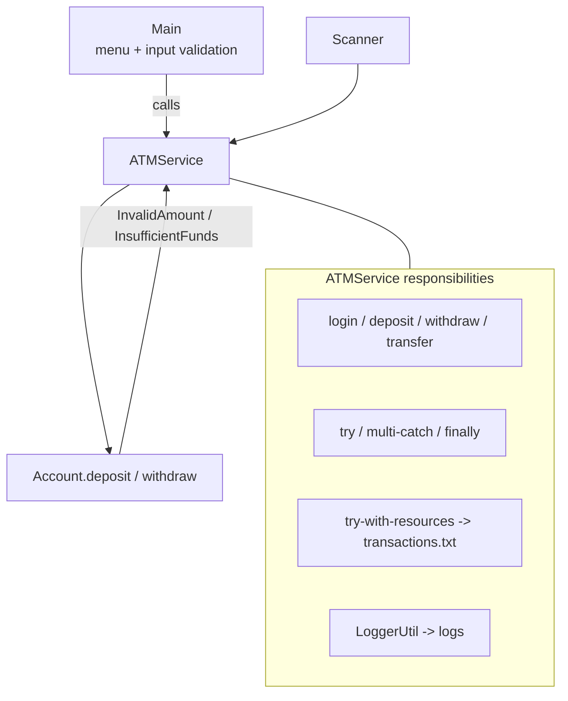

# Lab 7: Exception Handling and Error Management — ATM Banking System

> **Participants:** Module sequence is in [`../README.md`](../README.md). **Do not start this guide until** you have finished Module 7 [pre-lab exercises 1–8](../exercises/EXERCISES-INDEX.md) (Pass — check yourself, do not write it down). Then open **one** OS how-to ([Windows](LAB-7-WINDOWS.md) · [macOS](LAB-7-MACOS.md)). In class, prefer the **45-minute timed path** with [`starter/`](starter/README.md); the **full path** is every Step below (homework / extended). This repo has no answer keys — complete the TODOs yourself. See [Which file do I open?](../../../_PARTICIPANT-FILE-GUIDE.md).

## Activity card

| | |
| --- | --- |
| **Objective** | Build an ATM console with domain exceptions, safe login/deposit/withdraw, and logging |
| **Skills practiced** | Custom exceptions, throw/throws, boundary catch, try-with-resources / file IO, user-safe messages |
| **Expected outcome** | Login `1001`/`1234` → withdraw fail path → deposit → balance `12000` → mini statement → Thank You |
| **Estimated time** | Timed path ~45 min · Full path 65–240 min |
| **Prerequisites** | Lab 0–6 habits · Exercises 1–8 Pass · JDK 21 |
| **Expected files** | `examples/Lab7-ATMSystem/src/com/academy/atm/*.java` (+ `transactions.txt`, `logs/`) |
| **Validation checkpoints** | Starter smoke test · GUIDE Implementation Checkpoints |

**Module:** 7 — Exception Handling and Error Management  
**Duration:** ~45 minutes (timed path with starter) · Full path: 65–240 minutes (Day 5 core checkpoint ~65 min; finish remaining ATM paths as extended work)

**Primary IDE:** IntelliJ IDEA Community Edition · **Optional IDE:** VS Code

| OS | How-to for this lab |
| -- | ------------------- |
| Windows | [LAB-7-WINDOWS.md](LAB-7-WINDOWS.md) |
| macOS | [LAB-7-MACOS.md](LAB-7-MACOS.md) |

> **Incremental build:** Exercises 1–8 (specific catches → custom insufficient-funds → logging) → Lab 7 packaged `com.academy.atm`. Same `java-bootcamp`, new folder `Lab7-ATMSystem/`.

> **Classroom pacing:** [`../PACING.md`](../PACING.md) (Checkpoints A–F).

> **Security:** Never log or screenshot real PINs/passwords. Demo PIN `1234` is training-only.

## 45-minute timed path (use starter)

In class, use the starter templates so the **core** objectives fit **~45 minutes**. The full Steps below remain for homework / extended depth.

> **Timed path:** Exception classes, `Account`, `Transaction`, `LoggerUtil`, and `Main` are already in the starter — do **not** recreate them. Implement only `ATMService.login`, `deposit`, and `withdraw` (via `executeTransaction`). Transfer / daily error report / transaction summary are Bonus stubs. Smoke includes mini statement (menu 6 — already wired).

1. Open [`starter/README.md`](starter/README.md).
2. Copy `starter/Lab7-ATMSystem/` into your `java-bootcamp/examples/Lab7-ATMSystem/` target folder (commands in the starter README).
3. Fill `login` / `deposit` / `withdraw` TODOs — complete every TODO yourself.
4. Run the starter smoke test (login → failed withdraw → deposit → balance → **mini statement** → exit); commit your work to your GitHub repo (no screenshots).
5. Check the **timed-path Pass criteria** in the starter README yourself (do not write the marks down). Continue remaining GUIDE steps only if time allows (or as homework).

| Path | Time | Scope |
| ---- | ---- | ----- |
| **Timed (default)** | ~45 min | login + deposit + withdraw + smoke (incl. mini statement) |
| **Full (extended)** | see Duration | Every Step in this GUIDE (transfer / reports bonuses) |

**Verified participant layout (Windows IntelliJ + PowerShell; Temurin JDK 21.0.11):**

| Role | Path |
| ---- | ---- |
| IntelliJ opens | `%USERPROFILE%\java-bootcamp` (SDK / language level **21**) |
| Pre-lab exercises | `examples\module-07-exercises\` (flat files — must exist before lab work) |
| This lab project | `examples\Lab7-ATMSystem\` with `src\com\academy\atm\`, `transactions.txt`, `logs\` |
| Compile / run | Named `javac -d out` on the nine sources → `java -cp out com.academy.atm.Main` **from project root** |
| Smoke-test output | Login `1001`/`1234` → withdraw `20000` Insufficient Balance → deposit `1000` → balance `12000` → mini statement → `Thank You` |

**If it fails (Windows PowerShell):** Prefer naming each `.java` file in the `javac` line (as in [LAB-7-WINDOWS.md](LAB-7-WINDOWS.md)). Missing `logs\application.log` or `transactions.txt` → you ran `java` from the wrong folder; `cd` to `Lab7-ATMSystem` first. Mark `src` as Sources Root; set Run working directory to the project root.

---

## What you'll complete (practice only)

Labs and exercises are **practice only**. Nothing is submitted or graded. Do not take screenshots. Check Pass/Fail yourself — do not write those marks anywhere. Commit your work to your private `java-bootcamp` GitHub repo.

Keep this checklist visible while you work.

| # | Deliverable | Where / what |
| - | ----------- | ------------ |
| 1 | Full source | `examples/…/src/com/academy/atm/` — `Account`, `Transaction`, `ATMService`, `LoggerUtil`, `Main`, four custom exceptions |
| 2 | Input file | `transactions.txt` (or equivalent) |
| 3 | Log evidence | Snippet/screenshot of `logs/application.log` ERROR lines |
| 4 | GitHub commit | Commit this lab to your private `java-bootcamp` repo — no screenshots |
| 5 | LMS / README notes | Overview, exception hierarchy, logging, compile/run, sample output, lessons |
| 6 | Reflection answers | `notes/lab7-answers.md` |

Optional: labeled bonuses. Do not commit secrets or a copied answer keys.


## Module 7 exercises you must already have completed

Lab 7 assumes you already practiced exception skills in `examples/module-07-exercises/`. Do **not** treat Steps 2–12 as your first time with custom exceptions, `throw`/`throws`, or try-with-resources.

| Exercise | You already did | Lab 7 builds on it |
| -------- | --------------- | ------------------ |
| 1 — Common exceptions | Specific unchecked catches | Step 12 unchecked demos |
| 2 — `try-catch-finally` | Success/failure cleanup | Step 8 `executeTransaction` multi-catch + finally |
| 3 — Try-with-resources | Auto-close reader | Step 11 mini statement / `transactions.txt` |
| 4 — `throw` / `throws` | Signal vs declare | Steps 3, 7, 9 Account/service contracts |
| 5 — Custom exception | Checked domain failure | Step 2 four ATM exception types |
| 6 — Propagation | Trace stack to boundary | Steps 3, 8–9 `Account` → `ATMService` → `Main` |
| 7 — Error strategies | Retry and fallback | Step 7 login PIN attempts / recovery |
| 8 — Logging warm-up | Context + exception + safe message | Step 5 `LoggerUtil` → `logs/application.log` |

**Intentional deltas (extend — do not paste exercise code blindly):**

* Exercises were **flat** default-package demos; Lab uses `package com.academy.atm` + `src` / `out` (Lab 5–6 pattern)
* Exercise 5 used one custom type; Lab adds four domain exceptions with extra fields
* Exercise 8 was a small log sketch; Lab wires logging into every ATM failure path

**Lab-only additions:** seed accounts + PIN login, deposit/withdraw/transfer, mini statement, menu recovery, run-from-project-root for relative files, GitHub commit of your sources.

If any of Exercises 1–8 is still **Fail**, finish that exercise first — then return here.

---

## Lab Overview

This Module 7 lab is the consolidation after Module 7 slides and [Exercises 1–8](../exercises/EXERCISES-INDEX.md). You already practiced catching common exceptions, `try-catch-finally`, try-with-resources, `throw`/`throws`, custom exceptions, propagation, retry/fallback, and logging in `module-07-exercises/`. Here you assemble those skills into a fault-tolerant **ATM Banking System**.

## Learning Objectives

After completing this lab, you will be able to:

* Distinguish **checked** vs **unchecked** exceptions and choose appropriately (builds on Exercises 1 & 5)
* Wrap operations in **`try` / `catch` / `finally`** (and multiple catch blocks) (builds on Exercise 2)
* Create **custom exception** classes with meaningful messages (and optional fields) (builds on Exercise 5)
* Use **`throw`** to signal rule violations and **`throws`** to declare checked propagation (builds on Exercise 4)
* Trace **exception propagation** across `Main → ATMService → Account` (builds on Exercise 6)

## Business Scenario

A bank wants to harden its classroom ATM simulator. You already practiced exception building blocks in Module 7 Exercises 1–8. Today’s practice pass consolidates those skills into one recoverable ATM menu (pedagogical demo accounts — not live banking PII).

The bank requires the ATM software to:

* **Never terminate unexpectedly** on user/business errors
* **Display meaningful error messages** (not raw stack traces to end users)
* **Log every error** for mentors/ops review
* **Validate all user input** before mutating balances
* **Continue running** after recoverable failures (return to the main menu)

You build and run the app on your **laptop** with plain JDK—no Spring, no database, no GUI framework.

**Optional forward look:** The same “domain exception → catch at service boundary → log → continue/API error” thinking later helps CRM endpoints reject invalid customer updates without killing the server. You are not building CRM today.

**Security note for evidence.** Do not paste GitHub credentialss, AWS secrets, or real bank credentials. Demo PINs (`1234`) and account numbers are fine; do not treat them as production secrets, and do not commit real PII.

---

## Architecture Context
### Call chain and exception flow (NOW)



### Exception hierarchy (lab)

## Prerequisites

Complete the [Labs Setup Instructions](../../../SETUP-INSTRUCTIONS.md) and [Lab 0](../../module-00/lab0/LAB-0-GUIDE.md) before this lab. Confirm:

* **JDK 21** with `javac` and `java` on `PATH` (Lab 0)
* **Laptop IDE:** **IntelliJ IDEA Community** (primary) or **VS Code** (optional) — see [`_IDE-CONVENTIONS.md`](../../_IDE-CONVENTIONS.md)
* Workspace open at `~/java-bootcamp` (Windows: `%USERPROFILE%\java-bootcamp`)
* Working integrated terminal in your IDE
* **Module 7 Exercises 1–8 Pass** — hard gate before Step 1 (see mapping table above)
* **Prior Week 1 recommended:** packages, service layer, menu + `Scanner` (`nextLine`), basic collections (`HashMap` for accounts)
* **Maven is optional**—plain `javac`/`java` is the primary path
* No secrets (keys, tokens, passwords) committed to Git

**Exercise workspace (already done):** `examples/module-07-exercises/` (flat files)  
**Lab workspace (this guide):** `examples/Lab7-ATMSystem/` (`src/com/academy/atm/` + `out/` + `logs/` + `transactions.txt`)

### Pre-flight

Run in your IDE terminal on the laptop:

```bash
java -version
javac -version
git --version
pwd   # Windows PowerShell: pwd  or  echo $PWD
```

Expected theme (versions may vary):

```text
openjdk version "21....
javac 21....
git version 2....
```

Confirm `java-bootcamp` exists. Fix environment failures before writing application code.

---

## Worked example (read before you code)

Study this pattern once before Step 1. Your job is to apply the same idea in the Steps — do not skip ahead to a full solution.

```java
import java.util.InputMismatchException;

@FunctionalInterface
private interface TransactionAction {
    void run() throws Exception;
}

private void requireLogin() throws InvalidPinException {
    if (loggedInAccount == null) {
        throw new InvalidPinException(
                "Please login before performing this operation.", pinAttemptsRemaining);
    }
}

private double readAmount(String prompt) throws InputMismatchException {
    System.out.print(prompt);
    String input = scanner.nextLine().trim();
    try {
        return Double.parseDouble(input);
    } catch (NumberFormatException ex) {
        throw new InputMismatchException("Invalid numeric input.");
    }
}

private void executeTransaction(String operationName, TransactionAction action) {
    long startTime = System.nanoTime();
    try {
        action.run();
        LoggerUtil.logTransaction(operationName + " completed successfully",
                (System.nanoTime() - startTime) / 1_000_000);
    } catch (InputMismatchException ex) {
        System.out.println("ERROR");
        System.out.println("Invalid numeric input.");
        System.out.println("Please enter a valid amount.");
        LoggerUtil.logError("Invalid numeric input during " + operationName, ex);
        recordFailedTransaction(operationName, ex.getMessage());
    } catch (InvalidAmountException ex) {
        System.out.println("ERROR");
        System.out.println(ex.getMessage());
        LoggerUtil.logError(ex.getMessage(), ex);
// ... truncated — see full sample in the Steps
```

**What to notice:** Match names, IDs, and failure behavior from the scenario — instructors check these.

---

## Implementation Steps

Complete each step in order. Commands assume `java-bootcamp/examples/Lab7-ATMSystem` on your laptop. Use the integrated terminal in **VS Code** or **IntelliJ** ([`_IDE-CONVENTIONS.md`](../../_IDE-CONVENTIONS.md)).

Parts 1–20 from the Module 7 exercise map into the steps below (model → exceptions → ATMService → logging → menu → failure walkthrough).

---

### Step 1 — Create the project, package, logs, and transaction file

**Why:** Folder path must match `package com.academy.atm;`. Relative files (`transactions.txt`, `logs/`) only work when the JVM starts in the **project root**.

**Builds on Lab 5–6:** Same `src/com/academy/...` + `out/` compile pattern — exercises stayed flat; the lab is packaged and must run from project root.

**Do this:**

```bash
# macOS / Linux (Git Bash on Windows also works)
mkdir -p ~/java-bootcamp/examples/Lab7-ATMSystem/src/com/academy/atm
mkdir -p ~/java-bootcamp/examples/Lab7-ATMSystem/logs
cd ~/java-bootcamp/examples/Lab7-ATMSystem
pwd
```

```powershell
# Windows PowerShell alternative
$root = "$env:USERPROFILE\java-bootcamp\examples\Lab7-ATMSystem"
New-Item -ItemType Directory -Force -Path "$root\src\com\academy\atm","$root\logs","$root\notes" | Out-Null
cd $root
pwd
```

Create `transactions.txt` in the project root (not under `src/`):

```text
2026-01-10,DEPOSIT,1001,500.00,Initial funding
2026-01-12,WITHDRAW,1001,150.00,ATM withdrawal
2026-01-15,DEPOSIT,1002,1200.00,Salary deposit
2026-01-18,TRANSFER,1001,200.00,Transfer to 1002
```

Open the project folder in VS Code or IntelliJ. Stub the Java files listed under starter / Activity card expected files.

**Expected result:** Project root contains `src/`, `logs/`, `transactions.txt`, and `notes/`.

**If it fails:** Confirm `pwd` ends with `Lab7-ATMSystem`. Recreate dirs with `mkdir -p` / `New-Item`.

---

### Step 2 — Create custom exception classes (Parts 9–12)

**Why:** Domain rules deserve named types. Catching `InvalidAmountException` is clearer than parsing a generic `Exception` message—and later CRM APIs map named exceptions to status codes.

**Builds on Exercise 5:** Same checked domain-exception pattern — lab adds four ATM types with optional fields (requested/available, attempts remaining).

**Do this:** Create four checked exceptions under `src/com/academy/atm/`:

```java
package com.academy.atm;

public class InvalidAmountException extends Exception {
    public InvalidAmountException(String message) {
        super(message);
    }
}
```

```java
package com.academy.atm;

public class InsufficientFundsException extends Exception {
    private final double requestedAmount;
    private final double availableBalance;

    public InsufficientFundsException(String message, double requestedAmount, double availableBalance) {
        super(message);
        this.requestedAmount = requestedAmount;
        this.availableBalance = availableBalance;
    }

    public double getRequestedAmount() { return requestedAmount; }
    public double getAvailableBalance() { return availableBalance; }
}
```

```java
package com.academy.atm;

public class InvalidPinException extends Exception {
    private final int attemptsRemaining;

    public InvalidPinException(String message, int attemptsRemaining) {
        super(message);
        this.attemptsRemaining = attemptsRemaining;
    }

    public int getAttemptsRemaining() { return attemptsRemaining; }
}
```

```java
package com.academy.atm;

public class AccountNotFoundException extends Exception {
    public AccountNotFoundException(String message) {
        super(message);
    }
}
```

**Rules to wire later:**

| Exception | Rule |
| --------- | ---- |
| `InvalidAmountException` | amount must be **> 0** |
| `InsufficientFundsException` | withdraw/transfer cannot exceed balance |
| `InvalidPinException` | PIN must match; track remaining attempts (max **3**) |
| `AccountNotFoundException` | account number missing from map |

**Expected result:** Four public exception classes compile conceptually; extra fields support richer log lines.

**If it fails:** Class name must match filename. Extend `Exception` (checked), not `RuntimeException`, for this lab’s teaching contract.

---

### Step 3 — Create the `Account` class (Parts 1, 13–14)

**Why:** Business mutations throw at the source of truth. `throws` on `deposit`/`withdraw` documents the checked contract for `ATMService`.

**Builds on Exercises 4–6:** `throw`/`throws` at the domain layer; propagation starts here and continues through `ATMService` to the menu boundary.

**Do this:** Create `src/com/academy/atm/Account.java`:

```java
package com.academy.atm;

public class Account {

    private final String accountNumber;
    private final String customerName;
    private final String pin;
    private double balance;

    public Account(String accountNumber, String customerName, String pin, double balance) {
        this.accountNumber = accountNumber;
        this.customerName = customerName;
        this.pin = pin;
        this.balance = balance;
    }

    // getters for all fields

    void restoreBalance(double targetBalance) {
        this.balance = targetBalance; // package-private helper for transfer rollback (bonus)
    }

    public void deposit(double amount) throws InvalidAmountException {
        if (amount <= 0) {
            throw new InvalidAmountException("Amount must be greater than zero.");
        }
        balance += amount;
    }

    public void withdraw(double amount) throws InvalidAmountException, InsufficientFundsException {
        if (amount <= 0) {
            throw new InvalidAmountException("Amount must be greater than zero.");
        }
        if (amount > balance) {
            throw new InsufficientFundsException(
                    "Transaction Failed. Insufficient Account Balance.",
                    amount,
                    balance);
        }
        balance -= amount;
    }

    public void displayBalance() {
        System.out.printf("Account : %s | Customer : %s | Balance : $%.2f%n",
                accountNumber, customerName, balance);
    }
}
```

**Attributes checklist:**

| Attribute        | Type     | Notes                |
| ---------------- | -------- | -------------------- |
| Account Number   | `String` | immutable recommended |
| Customer Name    | `String` | immutable recommended |
| PIN              | `String` | demo only—never real  |
| Balance          | `double` | mutable               |

**Expected result:** Negative deposit throws; overdraft withdraw throws with requested/available amounts.

**If it fails:** Remember `throw` creates/throws the object; `throws` only *declares*. Both are required for checked types here.

---

### Step 4 — Create `Transaction` (session mini-statement)

**Why:** Session history supports mini statements and bonus summary reports without a database.

**Do this:** Create `src/com/academy/atm/Transaction.java` with fields: account number, type, amount, timestamp (`LocalDateTime.now()`), successful flag, details. Implement getters and a clear `toString()`.

**Expected result:** Successful and failed ops can append `Transaction` rows for later display.

**If it fails:** Import `java.time.LocalDateTime`. Keep fields `final` where practical.

---

### Step 5 — Create `LoggerUtil` (Part 17)

**Why:** Users see short ERROR text; mentors need timestamps and stack traces in `logs/application.log`.

**Builds on Exercise 8:** Same context + exception + user-safe message habit — lab centralizes file append under `logs/application.log`.

**Do this:** Create `src/com/academy/atm/LoggerUtil.java`:

```java
package com.academy.atm;

import java.io.IOException;
import java.nio.file.Files;
import java.nio.file.Path;
import java.nio.file.StandardOpenOption;
import java.time.LocalDateTime;
import java.time.format.DateTimeFormatter;
import java.util.Arrays;

public final class LoggerUtil {

    private static final Path LOG_PATH = Path.of("logs", "application.log");
    private static final DateTimeFormatter FORMATTER =
            DateTimeFormatter.ofPattern("yyyy-MM-dd HH:mm:ss");

    private LoggerUtil() {
    }

    public static void logInfo(String message) {
        writeLog("INFO", message, null);
    }

    public static void logError(String message, Throwable throwable) {
        writeLog("ERROR", message, throwable);
    }

    public static void logTransaction(String message, long executionTimeMillis) {
        writeLog("INFO", message + " | Execution Time: " + executionTimeMillis + " ms", null);
    }

    private static void writeLog(String level, String message, Throwable throwable) {
        try {
            Files.createDirectories(LOG_PATH.getParent());
            StringBuilder entry = new StringBuilder();
            entry.append(LocalDateTime.now().format(FORMATTER))
                    .append(" ").append(level).append(" ").append(message);
            if (throwable != null) {
                entry.append(System.lineSeparator())
                        .append(throwable.getClass().getSimpleName()).append(" ")
                        .append(throwable.getMessage()).append(System.lineSeparator())
                        .append(Arrays.toString(throwable.getStackTrace()));
            }
            entry.append(System.lineSeparator());
            Files.writeString(LOG_PATH, entry.toString(),
                    StandardOpenOption.CREATE, StandardOpenOption.APPEND);
        } catch (IOException ioException) {
            System.err.println("Unable to write log file: " + ioException.getMessage());
        }
    }
}
```

Example theme after a failed withdraw:

```text
2026-08-01 10:42:00 ERROR Requested 20000.0 Balance 11000.0
InsufficientFundsException Transaction Failed. Insufficient Account Balance.
[...]
```

**Expected result:** First error creates `logs/application.log` automatically.

**If it fails:** Run the app from the project root. Confirm `logs/` is writable on your laptop.

---

### Step 6 — Skeleton `ATMService` with seed accounts (Parts 2, 12)

**Why:** Service owns accounts, login state, and catch boundaries. `Main` should only switch on menu choices.

**Do this:** Start `src/com/academy/atm/ATMService.java`:

```java
package com.academy.atm;

import java.util.ArrayList;
import java.util.HashMap;
import java.util.List;
import java.util.Map;
import java.util.Scanner;

public class ATMService {

    private static final int MAX_PIN_ATTEMPTS = 3;
    private static final String TRANSACTION_FILE = "transactions.txt";

    private final Map<String, Account> accounts = new HashMap<>();
    private final List<Transaction> sessionTransactions = new ArrayList<>();
    private final Scanner scanner;

    private Account loggedInAccount;
    private int pinAttemptsRemaining = MAX_PIN_ATTEMPTS;

    public ATMService(Scanner scanner) {
        this.scanner = scanner;
        initializeAccounts();
    }

    private void initializeAccounts() {
        accounts.put("1001", new Account("1001", "John Smith", "1234", 11000));
        accounts.put("1002", new Account("1002", "Alice Johnson", "5678", 5000));
    }

    private Account findAccount(String accountNumber) throws AccountNotFoundException {
        Account account = accounts.get(accountNumber);
        if (account == null) {
            throw new AccountNotFoundException("Account not found: " + accountNumber);
        }
        return account;
    }

    private void printReturnMessage() {
        System.out.println("Transaction Completed.");
        System.out.println("Returning to Main Menu.");
    }
}
```

**Sample / seed accounts (required for Expected results):**

| Account | Name | PIN | Balance |
| ------- | ---- | --- | ------: |
| **1001** | John Smith | **1234** | **$11000** |
| **1002** | Alice Johnson | **5678** | **$5000** |

**Expected result:** Service constructs with these two accounts; `findAccount("9999")` throws `AccountNotFoundException`.

**If it fails:** Do not put the account map in `Main`. Keep PIN demo values only in seed data. Match the balances above so insufficient-funds demos make sense (e.g. withdraw `$20000` from `$11000`).

---

### Step 7 — Login with PIN attempts (Parts 11, 15, 18)

**Why:** Login shows multi-catch, custom exception fields, logging, and `finally` return messaging—without exiting the app.

**Builds on Exercises 5 & 7:** Custom `InvalidPinException` plus retry/fallback strategy (max attempts) from the error-strategies exercise.

**Do this:**

```java
public void login() {
    if (loggedInAccount != null) {
        System.out.println("Already logged in as " + loggedInAccount.getCustomerName() + ".");
        return;
    }

    System.out.print("Enter Account Number : ");
    String accountNumber = scanner.nextLine().trim();

    try {
        Account account = findAccount(accountNumber);
        System.out.print("Enter PIN : ");
        String pin = scanner.nextLine().trim();

        if (!account.getPin().equals(pin)) {
            pinAttemptsRemaining--;
            throw new InvalidPinException("Invalid PIN entered.", pinAttemptsRemaining);
        }

        loggedInAccount = account;
        pinAttemptsRemaining = MAX_PIN_ATTEMPTS;
        System.out.println("Login Successful");
        LoggerUtil.logInfo("Login successful for account " + accountNumber);
    } catch (AccountNotFoundException | InvalidPinException ex) {
        System.out.println("ERROR");
        System.out.println(ex.getMessage());
        LoggerUtil.logError(ex.getMessage(), ex);

        if (ex instanceof InvalidPinException invalidPin && invalidPin.getAttemptsRemaining() <= 0) {
            System.out.println("Maximum PIN attempts reached. Login locked for this session.");
        }
    } finally {
        printReturnMessage();
    }
}
```

**Expected result:** Wrong account → ERROR + log; wrong PIN decrements attempts; success prints `Login Successful`; menu always returns via `finally`.

**If it fails:** Use `scanner.nextLine()` for account and PIN. Do not crash on bad PIN.

---

### Step 8 — Shared `executeTransaction` with multi-catch + finally (Parts 3, 6–8, 18)

**Why:** One boundary handler keeps deposit/withdraw/transfer DRY and guarantees the “Returning to Main Menu” message.

**Builds on Exercises 2 & 6:** Same success/failure cleanup as Exercise 2; propagation lands here as the service boundary (Exercise 6).

**Do this:** Add helpers:

```java
import java.util.InputMismatchException;

@FunctionalInterface
private interface TransactionAction {
    void run() throws Exception;
}

private void requireLogin() throws InvalidPinException {
    if (loggedInAccount == null) {
        throw new InvalidPinException(
                "Please login before performing this operation.", pinAttemptsRemaining);
    }
}

private double readAmount(String prompt) throws InputMismatchException {
    System.out.print(prompt);
    String input = scanner.nextLine().trim();
    try {
        return Double.parseDouble(input);
    } catch (NumberFormatException ex) {
        throw new InputMismatchException("Invalid numeric input.");
    }
}

private void executeTransaction(String operationName, TransactionAction action) {
    long startTime = System.nanoTime();
    try {
        action.run();
        LoggerUtil.logTransaction(operationName + " completed successfully",
                (System.nanoTime() - startTime) / 1_000_000);
    } catch (InputMismatchException ex) {
        System.out.println("ERROR");
        System.out.println("Invalid numeric input.");
        System.out.println("Please enter a valid amount.");
        LoggerUtil.logError("Invalid numeric input during " + operationName, ex);
        recordFailedTransaction(operationName, ex.getMessage());
    } catch (InvalidAmountException ex) {
        System.out.println("ERROR");
        System.out.println(ex.getMessage());
        LoggerUtil.logError(ex.getMessage(), ex);
        recordFailedTransaction(operationName, ex.getMessage());
    } catch (InsufficientFundsException ex) {
        System.out.println("ERROR");
        System.out.println("Insufficient Balance");
        System.out.println("Transaction Cancelled");
        LoggerUtil.logError("Requested " + ex.getRequestedAmount()
                + " Balance " + ex.getAvailableBalance(), ex);
        recordFailedTransaction(operationName, ex.getMessage());
    } catch (InvalidPinException | AccountNotFoundException ex) {
        System.out.println("ERROR");
        System.out.println(ex.getMessage());
        LoggerUtil.logError(ex.getMessage(), ex);
        recordFailedTransaction(operationName, ex.getMessage());
    } catch (Exception ex) {
        System.out.println("ERROR");
        System.out.println("Unexpected error occurred. Please try again.");
        LoggerUtil.logError("Unexpected error during " + operationName, ex);
        recordFailedTransaction(operationName, ex.getMessage());
    } finally {
        printReturnMessage();
    }
}
```

Also implement `recordTransaction` / `recordFailedTransaction` using `Transaction` (see solution).

**Invalid amount input (Part 3) messages:**

```text
Invalid numeric input.
Please enter a valid amount.
```

**Finally (Part 8) messages:**

```text
Transaction Completed.
Returning to Main Menu.
```

**Expected result:** Specific catches fire before the generic `Exception` catch; `finally` always runs.

**If it fails:** Order catch blocks from more specific to more general. Catching `Exception` first will not compile for later specific catches.

---

### Step 9 — Deposit, withdraw, balance (Parts 10, 13–15, 19)

**Why:** These paths exercise `throw` inside `Account` and catch inside `ATMService`—classic propagation.

**Do this:**

```java
public void deposit() {
    executeTransaction("Deposit", () -> {
        requireLogin();
        double amount = readAmount("Amount : ");
        loggedInAccount.deposit(amount);
        recordTransaction("DEPOSIT", amount, true, "Deposit successful");
        System.out.println("Deposit Successful");
        System.out.printf("Current Balance : %.0f%n", loggedInAccount.getBalance());
    });
}

public void withdraw() {
    executeTransaction("Withdraw", () -> {
        requireLogin();
        double amount = readAmount("Amount : ");
        loggedInAccount.withdraw(amount);
        recordTransaction("WITHDRAW", amount, true, "Withdrawal successful");
        System.out.println("Withdrawal Successful");
        System.out.printf("Current Balance : %.0f%n", loggedInAccount.getBalance());
    });
}

public void displayBalance() {
    executeTransaction("Balance Inquiry", () -> {
        requireLogin();
        loggedInAccount.displayBalance();
    });
}
```

Propagation chain to observe:

```text
Main → ATMService.withdraw() → Account.withdraw() → throw …
```

**Insufficient funds user messages:**

```text
ERROR
Insufficient Balance
Transaction Cancelled
```

**Expected result:** Deposit `-100` → InvalidAmount; withdraw `20000` on 11000 balance → InsufficientFunds; valid deposit updates balance.

**If it fails:** Login first. Confirm `throws` clauses on `Account` match what `TransactionAction.run()` may throw (`Exception`).

---

### Step 10 — Transfer with rollback (Part 19 + Bonus 1)

**Why:** Transfers are two steps. If the second fails after the first succeeded, balances must restore—training for atomic *thinking* (real systems use DB transactions later).

**Do this:**

```java
public void transferFunds() {
    executeTransaction("Transfer", () -> {
        requireLogin();
        System.out.print("Destination Account Number : ");
        String destinationAccountNumber = scanner.nextLine().trim();
        Account destinationAccount = findAccount(destinationAccountNumber);
        double amount = readAmount("Transfer Amount : ");

        String sourceAccountNumber = loggedInAccount.getAccountNumber();
        double sourceBalanceBefore = loggedInAccount.getBalance();
        double destinationBalanceBefore = destinationAccount.getBalance();

        try {
            loggedInAccount.withdraw(amount);
            destinationAccount.deposit(amount);
            recordTransaction("TRANSFER_OUT", amount, true,
                    "Transfer to " + destinationAccountNumber);
            recordTransaction("TRANSFER_IN", amount, true,
                    "Transfer from " + sourceAccountNumber);
            System.out.println("Transfer Successful");
        } catch (Exception ex) {
            accounts.get(sourceAccountNumber).restoreBalance(sourceBalanceBefore);
            accounts.get(destinationAccountNumber).restoreBalance(destinationBalanceBefore);
            System.out.println("Transfer rolled back due to transaction failure.");
            LoggerUtil.logInfo("Transfer rollback completed for accounts "
                    + sourceAccountNumber + " and " + destinationAccountNumber);
            throw ex; // let executeTransaction log + message
        }
    });
}
```

**Expected result:** Transfer to missing account fails cleanly; failed mid-transfer restores both balances.

**If it fails:** Capture balances **before** mutating. Re-throw so outer multi-catch still logs.

---

### Step 11 — Mini statement + try-with-resources (Parts 4, 16)

**Why:** Reading files is a classic **checked** `IOException` path. Try-with-resources auto-closes the reader.

**Builds on Exercise 3:** Same auto-close reader pattern — lab reads `transactions.txt` from the project root.

**Do this:**

```java
import java.io.BufferedReader;
import java.io.FileReader;
import java.io.IOException;

public void displayMiniStatement() {
    executeTransaction("Mini Statement", () -> {
        requireLogin();
        System.out.println("Session Transactions:");
        sessionTransactions.stream()
                .filter(t -> loggedInAccount.getAccountNumber().equals(t.getAccountNumber()))
                .forEach(System.out::println);

        System.out.println();
        System.out.println("Historical Transactions (from file):");
        loadTransactionsFromFile();
    });
}

private void loadTransactionsFromFile() {
    try (BufferedReader reader = new BufferedReader(new FileReader(TRANSACTION_FILE))) {
        String line;
        while ((line = reader.readLine()) != null) {
            System.out.println(line);
        }
    } catch (IOException ex) {
        System.out.println("Unable to read transaction history.");
        LoggerUtil.logError("Unable to read transaction history", ex);
    }
}
```

**Expected result:** With `transactions.txt` present, historical lines print. Temporarily rename the file → message `Unable to read transaction history.` and an ERROR log; app continues.

**If it fails:** Run from project root. Prefer `BufferedReader` wrapping `FileReader` as in the solution.

---

### Step 12 — Unchecked exception demos (Part 5)

**Why:** Students must handle common runtime faults without letting them kill the menu loop.

**Builds on Exercise 1:** Same NPE / arithmetic / bounds demos — lab keeps the menu alive after each catch.

**Do this:**

```java
public void demonstrateUncheckedExceptions() {
    System.out.println("--- Unchecked Exception Demonstrations ---");

    try {
        Account account = null;
        account.getBalance();
    } catch (NullPointerException ex) {
        System.out.println("Handled NullPointerException gracefully.");
        LoggerUtil.logError("NullPointerException demonstration", ex);
    }

    try {
        int result = 10 / 0;
        System.out.println(result);
    } catch (ArithmeticException ex) {
        System.out.println("Handled ArithmeticException gracefully.");
        LoggerUtil.logError("ArithmeticException demonstration", ex);
    }

    try {
        int[] values = {1, 2, 3};
        System.out.println(values[10]);
    } catch (ArrayIndexOutOfBoundsException ex) {
        System.out.println("Handled ArrayIndexOutOfBoundsException gracefully.");
        LoggerUtil.logError("ArrayIndexOutOfBoundsException demonstration", ex);
    }
}
```

**Expected result:** Three handled messages; process still running; ERROR lines appended to the log.

**If it fails:** Do not omit the catches “to see the crash”—instructors want recovery evidence.

---

### Step 13 — Menu-driven `Main` (Parts 2, 18–20)

**Why:** Invalid menu choices must not exit. Only choice `7` terminates cleanly.

**Do this:** Create `src/com/academy/atm/Main.java`:

```java
package com.academy.atm;

import java.util.Scanner;

public class Main {

    public static void main(String[] args) {
        Scanner scanner = new Scanner(System.in);
        ATMService atmService = new ATMService(scanner);

        while (true) {
            displayMenu();
            String choiceInput = scanner.nextLine().trim();

            if (choiceInput.isEmpty()) {
                System.out.println("Invalid menu option. Please try again.");
                continue;
            }

            int choice;
            try {
                choice = Integer.parseInt(choiceInput);
            } catch (NumberFormatException ex) {
                System.out.println("Invalid menu option. Please try again.");
                LoggerUtil.logError("Invalid menu option: " + choiceInput, ex);
                continue;
            }

            System.out.println("--------------------------------");

            switch (choice) {
                case 1 -> atmService.login();
                case 2 -> atmService.deposit();
                case 3 -> atmService.withdraw();
                case 4 -> atmService.displayBalance();
                case 5 -> atmService.transferFunds();
                case 6 -> atmService.displayMiniStatement();
                case 7 -> {
                    System.out.println("Thank You");
                    atmService.logout();
                    scanner.close();
                    return;
                }
                case 8 -> atmService.demonstrateUncheckedExceptions();
                // optional bonuses: 9 daily error report, 10 transaction summary
                default -> {
                    System.out.println("Invalid menu option. Please try again.");
                    LoggerUtil.logInfo("Invalid menu selection: " + choice);
                }
            }
            System.out.println();
        }
    }

    private static void displayMenu() {
        System.out.println("=================================");
        System.out.println("ATM Banking System");
        System.out.println("=================================");
        System.out.println("1 Login");
        System.out.println("2 Deposit");
        System.out.println("3 Withdraw");
        System.out.println("4 Balance Inquiry");
        System.out.println("5 Transfer");
        System.out.println("6 Mini Statement");
        System.out.println("7 Exit");
        System.out.print("Choice : ");
    }
}
```

**Core menu:**

```text
=================================
ATM Banking System
=================================
1 Login
2 Deposit
3 Withdraw
4 Balance Inquiry
5 Transfer
6 Mini Statement
7 Exit
```

You may add options 8–10 after CORE work is done.

**Expected result:** `abc` as menu choice prints invalid message and loops; only `7` prints `Thank You` and exits.

**If it fails:** Keep Scanner in `Main`; pass it into `ATMService`. Close Scanner on exit.

---

### Step 14 — Compile, run, and walk success + failure paths (Parts 19–20)

**Why:** Graders care that recoverable errors leave the ATM alive and that logs exist. **Working directory must be the project root** or `transactions.txt` / `logs/` will not resolve.

**Do this:**

**Windows PowerShell** (name each source file — do not rely on `*.java` globs):

```powershell
cd $env:USERPROFILE\java-bootcamp\examples\Lab7-ATMSystem
Remove-Item -Recurse -Force out -ErrorAction SilentlyContinue
javac -d out `
  src\com\academy\atm\InvalidAmountException.java `
  src\com\academy\atm\InsufficientFundsException.java `
  src\com\academy\atm\InvalidPinException.java `
  src\com\academy\atm\AccountNotFoundException.java `
  src\com\academy\atm\Transaction.java `
  src\com\academy\atm\Account.java `
  src\com\academy\atm\LoggerUtil.java `
  src\com\academy\atm\ATMService.java `
  src\com\academy\atm\Main.java
java -cp out com.academy.atm.Main
Get-Content logs\application.log -Tail 40
```

**macOS / Linux:**

```bash
cd ~/java-bootcamp/examples/Lab7-ATMSystem
rm -rf out
javac -d out src/com/academy/atm/*.java
java -cp out com.academy.atm.Main
tail -n 40 logs/application.log
```

Or in IntelliJ: open the project, set SDK 21, set Run working directory to the project root, run `com.academy.atm.Main` (see [`_IDE-CONVENTIONS.md`](../../_IDE-CONVENTIONS.md)).

Suggested walkthrough:

1. Login `1001` / `1234` → `Login Successful` (seed: **$11000**)
2. **Withdraw `20000`** (more than balance) → **Insufficient Balance** error path
3. Deposit `-100` → Amount must be greater than zero
4. Deposit `1000` → success + new balance **12000**
5. Enter amount `abc` → invalid numeric input messages
6. Mini Statement → session + file lines
7. Wrong PIN once or twice → attempts decrease; still in menu
8. Exit `7` → `Thank You`

**Sample: withdraw too much → insufficient balance** (account `1001` has `$11000`):

```text
=================================
ATM Banking System
=================================
Choice : 1
Enter Account Number : 1001
Enter PIN : 1234
Login Successful
--------------------------------
Choice : 3
Amount : 20000
ERROR
Insufficient Balance
Transaction Cancelled
Transaction Completed.
Returning to Main Menu.
--------------------------------
Choice : 2
Amount : -100
ERROR
Amount must be greater than zero.
--------------------------------
Choice : 2
Amount : 1000
Deposit Successful
Current Balance : 12000
--------------------------------
Choice : 7
Thank You
```

Capture commit to GitHub (no screenshots) (no secrets). Also open:

```bash
ls -la logs          # Windows: dir logs
tail -n 40 logs/application.log   # or Get-Content logs\application.log -Tail 40
```

**Expected result:** Clean compile; withdraw-too-much shows Insufficient Balance and returns to menu; log contains ERROR entries; mini statement can read `transactions.txt`.

**If it fails:** Wrong working directory → missing `transactions.txt` or no `logs/application.log`. Fix: `cd` to `Lab7-ATMSystem` and re-run. In IntelliJ, set the run configuration working directory to the project root.

---

### Step 15 — Optional bonuses + notes table

**Why:** Core focus is exception design/recovery; bonuses show polish.

**Do this (optional):**

1. Daily error report from `logs/application.log` (count ERROR lines)—solution menu `9`
2. Transaction summary (success vs failed session counts)—solution menu `10`
3. Execution time already logged via `LoggerUtil.logTransaction` if you used Step 8’s timer

Then complete `notes/exception-hierarchy.md` and draft Reflection answers.

**Expected result:** Notes list all four custom exceptions + where they are thrown/caught.

**If it fails:** Skip bonuses if core 1–7 paths are incomplete—core grading comes first.

---

## Implementation Checkpoints

### Checkpoint A — Project + exceptions + model

_Check **Pass** or **Fail** yourself. Do not write these marks anywhere — nothing is submitted or graded. Commit your work to your GitHub repo._

| # | Confirm | Self-check |
| - | ------- | ---------- |
| 1 | `java-bootcamp/examples/Lab7-ATMSystem/src/com/academy/atm/` exists | Pass / Fail |
| 2 | Four custom exceptions + `Account` + `transactions.txt` + `logs/` present | Pass / Fail |
| 3 | Seed accounts: `1001`/`1234`/$11000 and `1002`/`5678`/$5000 | Pass / Fail |
| 4 | Edited via IntelliJ (or optional VS Code) on your laptop | Pass / Fail |

### Checkpoint B — Service + Main compile

_Check **Pass** or **Fail** yourself. Do not write these marks anywhere — nothing is submitted or graded. Commit your work to your GitHub repo._

| # | Confirm | Self-check |
| - | ------- | ---------- |
| 1 | `ATMService`, `LoggerUtil`, `Transaction`, `Main` present | Pass / Fail |
| 2 | `javac -d out src/com/academy/atm/*.java` succeeds | Pass / Fail |
| 3 | `java -cp out com.academy.atm.Main` from **project root** shows menu 1–7 | Pass / Fail |
| 4 | Exit prints `Thank You` and terminates | Pass / Fail |

### Checkpoint C — Exception behavior

_Check **Pass** or **Fail** yourself. Do not write these marks anywhere — nothing is submitted or graded. Commit your work to your GitHub repo._

| # | Confirm | Self-check |
| - | ------- | ---------- |
| 1 | Withdraw more than balance (e.g. `20000` on `1001`) → Insufficient Balance; menu continues | Pass / Fail |
| 2 | Invalid amount / bad PIN / missing account produce ERROR messages (not crashes) | Pass / Fail |
| 3 | Invalid numeric input shows the Part 3 messages and continues | Pass / Fail |
| 4 | `finally` prints return-to-menu text after operations | Pass / Fail |
| 5 | try-with-resources handles missing/unreadable `transactions.txt` with the IOException message | Pass / Fail |

### Checkpoint D — Logging + evidence

_Check **Pass** or **Fail** yourself. Do not write these marks anywhere — nothing is submitted or graded. Commit your work to your GitHub repo._

| # | Confirm | Self-check |
| - | ------- | ---------- |
| 1 | `logs/application.log` contains ERROR (and ideally INFO) entries under the project root | Pass / Fail |
| 2 | Exception hierarchy notes filled; reflection drafted | Pass / Fail |

---

## Reference Commands, Configuration, and Code

### Primary compile / run (from project root)

```bash
cd ~/java-bootcamp/examples/Lab7-ATMSystem
javac -d out src/com/academy/atm/*.java
java -cp out com.academy.atm.Main
```

### Clean and rebuild

```bash
cd ~/java-bootcamp/examples/Lab7-ATMSystem
rm -rf out
javac -d out src/com/academy/atm/*.java
find out -type f
```

### Inspect logs

```bash
mkdir -p logs
tail -n 50 logs/application.log
grep ERROR logs/application.log | wc -l
```

## Testing Scenarios

| Test Case | Expected Result |
| --------- | --------------- |
| Deposit valid amount | Deposit successful |
| Deposit negative amount | `InvalidAmountException` handled |
| Withdraw within balance | Withdrawal successful |
| Withdraw more than balance | `InsufficientFundsException` handled |
| Invalid PIN | `InvalidPinException` handled; attempts decrease |
| Non-existent account | `AccountNotFoundException` handled |
| Invalid numeric input | Invalid numeric input messages; continue |
| Missing transaction file | `IOException` handled; `Unable to read transaction history.` |
| Invalid menu option | Display error and continue |
| Transfer failure mid-way (bonus) | Balances rolled back |

---

## Failure Experiments

Perform deliberately, then restore working code / files.

| # | Experiment | Observe | Restore |
| - | ---------- | ------- | ------- |
| 1 | Remove `catch` for `InsufficientFundsException` only | Compile error or falls into generic catch / worse UX | Restore specific catch |
| 2 | Rename `transactions.txt` temporarily | `Unable to read transaction history.`; app continues | Restore filename |
| 3 | Comment out `finally { printReturnMessage(); }` | No “Returning to Main Menu” text | Restore `finally` |
| 4 | Run `java -cp out ...` from `~/` instead of project root | Missing file / wrong log path | `cd` to project root |
| 5 | Exhaust 3 bad PIN attempts | Lock message for session; no JVM crash | Restart app / reset attempts logic |

---

## Troubleshooting

| Symptom | Likely cause | Fix |
| ------- | ------------ | --- |
| `javac: command not found` | JDK not on PATH | [Lab 0](../../module-00/lab0/LAB-0-GUIDE.md) / [SETUP](../../../SETUP-INSTRUCTIONS.md) |
| Files missing / wrong project | Wrong folder open | Open `Lab7-ATMSystem` in VS Code or IntelliJ; see [`_IDE-CONVENTIONS.md`](../../_IDE-CONVENTIONS.md) |
| `package does not exist` | Folder ≠ package | Recreate `src/com/academy/atm` |
| Cannot load main class | Wrong `-cp` / package | `java -cp out com.academy.atm.Main` |
| `Unable to read transaction history` always | Wrong cwd | Run from `Lab7-ATMSystem` root (folder with `transactions.txt`) |
| Log file never created | Logger never called / cwd wrong | Trigger an ERROR path; check `logs/` under project root |
| Unreported exception compile error | Missing `throws` or catch | Declare on `Account` methods; catch in service |
| App exits on bad input | Uncaught exception | Wrap ops in `executeTransaction` / catch in `login` |

## Security and Production Review

Training console only—gaps are intentional:

* **Demo PINs are not security.** Real ATMs never store PINs in plaintext source. Do not reuse these patterns for production auth.
* **In-memory balances are not durable.** Closing the JVM drops account state. Production banking uses transactional databases and ledgers.
* **Logging sensitive data.** Avoid logging full PINs or real customer PII. This lab logs messages and stack traces for teaching—scrub before sharing logs outside class.
* **User-facing stack traces.** Never dump stack traces to end users; log them. Keep console messages short (as this lab does).
* **No secrets** in source, screenshots, or `notes/` (no private keys, API tokens, real bank credentials).
* Future CRM: validation exceptions and audit logs inherit the same “don’t leak secrets / PII” rules.

---

## Cleanup

```bash
cd ~/java-bootcamp/examples/Lab7-ATMSystem
rm -rf out
# optional: truncate or archive logs after copying an evidence snippet
# : > logs/application.log
```

Keep `.java` sources, `transactions.txt`, notes, and evidence screenshots. Do not delete GitHub credentialss or Lab 0 tooling. Do not commit copied answer keys as your own work.


## Reflection Questions

Write answers in `../../notes/lab7-answers.md` (from project; or `~/java-bootcamp/notes/lab7-answers.md`):

Write **1–3 sentence** answers (not essays):

1. (Forward look) How would a future CRM map domain exceptions (not found / validation) to API errors using the same boundary-catch + log pattern—without claiming CRM is implemented today?
2. What is the difference between checked and unchecked exceptions?
3. Why should custom exceptions be used?

---


## Week 1 Integrated Mini Project

At the end of Week 1, students may combine module knowledge into:

### Employee Management System v1

**Features:**

```text
OOP Design
Collections Framework
Streams
Exception Handling
Memory Awareness
Coding Standards
```

**Technologies Used:** Java, JVM, Collections, Streams, OOP, Exception Handling

**Purpose:** Creates a bridge into Week 2 where students start building enterprise-grade backend services using Maven, REST APIs, GitHub Copilot, testing frameworks, and layered architecture. This mini-project becomes a foundation that later evolves toward Spring Boot applications. It is **optional stretch** beyond Lab 7 core grading unless your instructor assigns it.

---

