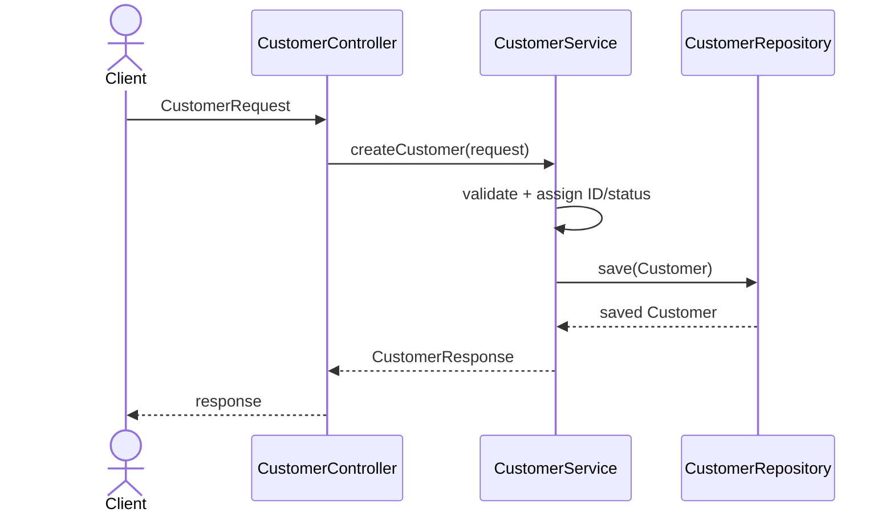
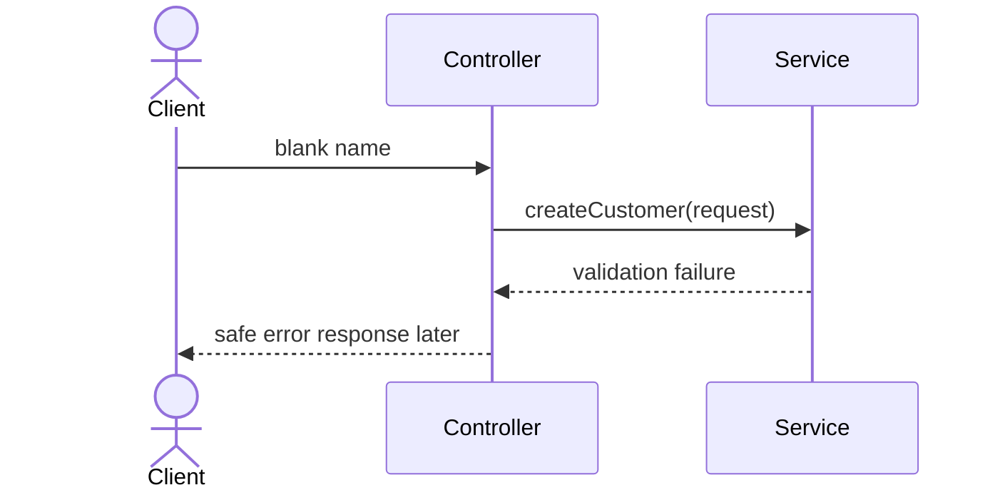

# Exercise 5 — Trace a Customer Request

**Module 8** · Checkpoint E · Exercises 1–6 Pass then Lab 8

## Activity card

| | |
| --- | --- |
| **Objective** | Document an end-to-end create-customer request through the layers |
| **Skills practiced** | Request processing flow narration |
| **Expected outcome** | request-flow.md with ordered hops |
| **Estimated time** | 10–12 minutes |
| **File to create** | `examples/module-08-exercises/` → request-flow.md |
| **Checkpoint** | E (after slides 22–24) |

## What you will learn

- A request crosses controller → service → repository → back out via DTOs
- Flow docs help future Spring mapping without coding HTTP yet
- Exceptions are handled at a useful boundary later — note the seam

**Enterprise context:** Onboarding a new engineer starts with tracing one customer create path.

## Scenario

Future input:

```text
Name: Amina Khan
Email: amina@example.test
Requested status: ACTIVE
Correlation ID: lab-request-001
```

## Worked example (read first)

Here is the shape of a complete answer for this exercise. Adapt the content — do not leave blanks.

```markdown
## Now
- Package names and stub responsibilities
- Plain Java types that compile
- Documented flow

## Later
- Spring controller annotations
- Validation annotations
- Repository implementation/JPA
- HTTP response mapping
- Correlation-ID logging
```

Then follow **Steps** to create your own file.

## Steps

### Step 1 — Create the flow



### Step 2 — Annotate transformations

| Boundary | Input | Output |
| -------- | ----- | ------ |
| Client → controller | Future transport payload | `CustomerRequest` |
| Service validation | Request DTO | valid domain values |
| Service → repository | `Customer` entity | saved entity |
| Service → controller | entity/result | `CustomerResponse` |

### Step 3 — Add failure flow



Do not invent HTTP status codes yet; Module 8 is structure only.

### Step 4 — Add “now vs later”

```markdown
## Now
- Package names and stub responsibilities
- Plain Java types that compile
- Documented flow

## Later
- Spring controller annotations
- Validation annotations
- Repository implementation/JPA
- HTTP response mapping
- Correlation-ID logging
```

### Step 5 — Final readiness check

Record **Pass** or **Fail** in your notes:

| Readiness check | Result |
| --------------- | ------ |
| I can locate each class package | Pass / Fail |
| I can explain controller → service → repository | Pass / Fail |
| I distinguish DTO from entity | Pass / Fail |
| I have not added Spring/JPA/database code | Pass / Fail |
| I am ready to build the full Maven skeleton in Lab 8 | Pass / Fail |

## Expected result

One document contains success/failure flows, object transformations, and a truthful now/later boundary.


## Debug / design challenge

Draw repository calling controller — reverse the arrows.

## Predict the Output / Behavior

After repository save, which type usually returns toward the client?

## Troubleshooting

See steps above if something does not compile or match the worked example.

## Pass criteria

_Check **Pass** or **Fail** yourself. Do not write these marks anywhere — nothing is submitted or graded. Commit your work to your GitHub repo._

Self-check before marking Pass:

- [ ] Success flow includes all three layers
- [ ] Failure stops before repository
- [ ] Request/entity/response transformations are identified
- [ ] No premature Spring/JPA implementation appears

