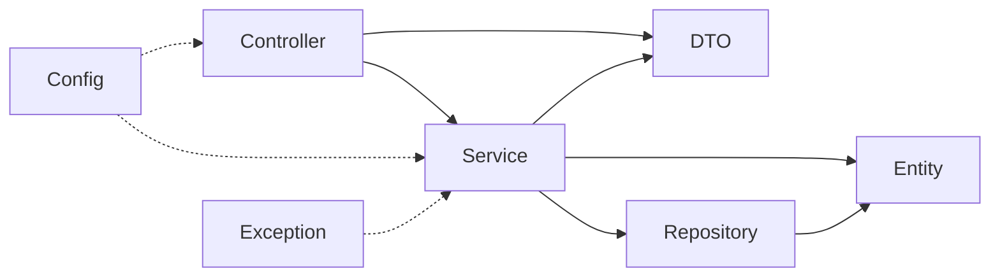

# Exercise 6 — Check Dependency Direction

**Module 8** · Checkpoint E · Exercises 1–6 Pass then Lab 8

## Activity card

| | |
| --- | --- |
| **Objective** | Detect invalid layer dependencies (who may depend on whom) |
| **Skills practiced** | Dependency direction, coupling smell detection |
| **Expected outcome** | dependency-direction.md marks legal vs illegal edges |
| **Estimated time** | 10–12 minutes |
| **File to create** | `examples/module-08-exercises/` → dependency-direction.md |
| **Checkpoint** | E (after slides 22–24) |

## What you will learn

- Dependencies should point inward/down toward domain/persistence details carefully
- Repository must not depend on controller
- Illegal edges create circular pain and testing friction

**Enterprise context:** Preventing repository→controller imports keeps CRM testable when HTTP arrives later.

## Intended flow



## Worked example (read first)

Here is the shape of a complete answer for this exercise. Adapt the content — do not leave blanks.

```markdown
Higher-level request handling may call inward services and repositories.
Domain/entity and repository packages must not import controller classes.
```

Then follow **Steps** to create your own file.

## Steps

### Step 1 — Mark each dependency

Use **Acceptable**, **Problematic**, or **Needs context**:

| Dependency | Decision | Why |
| ---------- | -------- | --- |
| controller → service | | |
| service → repository | | |
| repository → entity | | |
| entity → controller | | |
| repository → controller | | |
| service → DTO | | |
| DTO → repository | | |

### Step 2 — Check the reference

| Dependency | Decision |
| ---------- | -------- |
| controller → service | Acceptable |
| service → repository | Acceptable |
| repository → entity | Acceptable |
| entity → controller | Problematic: domain depends on transport |
| repository → controller | Problematic: persistence depends on presentation |
| service → DTO | Needs context; acceptable in this lab’s simple mapping, but avoid transport leakage |
| DTO → repository | Problematic: boundary model should not perform storage |

### Step 3 — Detect a cycle

Bad:

```text
controller → service → repository → controller
```

Explain why: changes can ripple both directions, isolated tests become harder, and package ownership is unclear.

Repair:

```text
controller → service → repository → entity
```

### Step 4 — Write one architecture rule

Add to `architecture-rules.md`:

```markdown
Higher-level request handling may call inward services and repositories.
Domain/entity and repository packages must not import controller classes.
```

## Expected result

You identify inward flow, two clear violations, one context-sensitive dependency, and one cycle repair.


## Debug / design challenge

Service imports controller classes — rewrite the allowed graph.

## Predict the Output / Behavior

Is controller → service → repository a legal chain?

## Troubleshooting

See steps above if something does not compile or match the worked example.

## Pass criteria

_Check **Pass** or **Fail** yourself. Do not write these marks anywhere — nothing is submitted or graded. Commit your work to your GitHub repo._

| # | Confirm | Notes |
| - | ------- | ----- |
| 1 | Seven dependencies classified | Pass / Fail |
| 2 | Cycle is repaired | Pass / Fail |
| 3 | Architecture rule is written | Pass / Fail |
