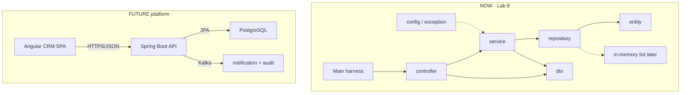
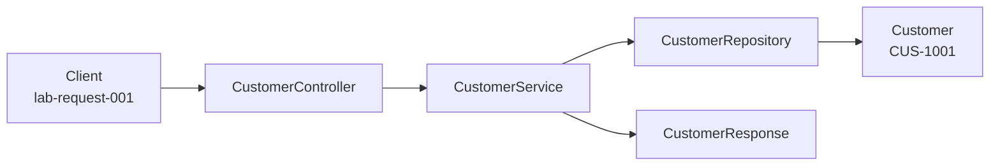

# Lab 8: Project Structure and Organization — Northstar CRM Skeleton

> **Participants:** Module sequence is in [`../README.md`](../README.md). **Do not start this guide until** you have finished Module 8 [pre-lab exercises 1–6](../exercises/EXERCISES-INDEX.md) (Pass — check yourself, do not write it down; classroom order **1 → 2 → 4 → 3 → 5 → 6**). Then open **one** OS how-to ([Windows](LAB-8-WINDOWS.md) · [macOS](LAB-8-MACOS.md)). In class, prefer the **45-minute timed path** with [`starter/`](starter/README.md); the **full path** is every Step below (homework / extended). This repo has no answer keys — complete the TODOs yourself. See [Which file do I open?](../../../_PARTICIPANT-FILE-GUIDE.md).

## Activity card

| | |
| --- | --- |
| **Objective** | Create the Northstar CRM Maven skeleton with seven layer packages (plain Java) |
| **Skills practiced** | Maven layout, package boundaries, entity/DTO stubs, layer flow docs |
| **Expected outcome** | `mvn clean compile` + `Main` prints banner, seven packages, `CUS-1001` / `CUS-1002` |
| **Estimated time** | Timed path ~45 min · Full path 3–4 hours |
| **Prerequisites** | Lab 0 · Exercises 1–6 Pass · JDK 21 · Maven 3.9+ |
| **Expected files** | `examples/lab8-crm/` (`pom.xml`, `src/main/java/com/northstar/crm/…`, docs) |
| **Validation checkpoints** | Starter smoke test · GUIDE Implementation Checkpoints |

**Module:** 8 — Java Project Structure and Modularization  
**Duration:** ~45 minutes (timed path with starter) · Full path: 3–4 Hours

**Primary IDE:** IntelliJ IDEA Community Edition · **Optional IDE:** VS Code

| OS | How-to for this lab |
| -- | ------------------- |
| Windows | [LAB-8-WINDOWS.md](LAB-8-WINDOWS.md) |
| macOS | [LAB-8-MACOS.md](LAB-8-MACOS.md) |

> **Incremental build:** Maven/package/layer notes + mini entity/DTO → Lab 8 full `com.northstar.crm` tree.

> **Classroom pacing:** [`../PACING.md`](../PACING.md) (Checkpoints A–F).

> **Scope:** Do **not** add Spring Boot, JPA, PostgreSQL, Kafka, or Angular in Lab 8.

**Verified participant layout (Windows IntelliJ + PowerShell; Temurin JDK 21.0.11; Maven 3.9.9):**

| Role | Path |
| ---- | ---- |
| IntelliJ opens | `%USERPROFILE%\java-bootcamp` (SDK / language level **21**) |
| This lab project | `examples\lab8-crm\` (`pom.xml` + `src/main/java/com/northstar/crm/…`) |
| Compile / run | `mvn -q clean compile` → `java -cp target\classes com.northstar.crm.Main` |
| Smoke-test output | `Northstar CRM skeleton — Lab 8` + seven packages + `CUS-1001` / `CUS-1002` |

**If it fails (Windows PowerShell):** Confirm `cd` is `examples\lab8-crm` before Maven. Open the `pom.xml` so IntelliJ imports Maven. Do not add Spring/JPA imports in Lab 8 stubs.

---

## 45-minute timed path (use starter)

In class, use the starter templates so the **core** objectives fit **~45 minutes**. The full Steps below remain for homework / extended depth.

1. Open [`starter/README.md`](starter/README.md).
2. Copy `starter/` into your `java-bootcamp/examples/lab8-crm/` target (see starter README).
3. Fill every `// TODO` — do **not** wait on a perfect prior lab; the starter includes a baseline.
4. Run the starter smoke test. Commit your work to your GitHub repo (no screenshots).
5. Check timed-path Pass criteria in the starter README yourself (do not write the marks down). Continue remaining GUIDE steps as homework if needed.

| Path | Time | Scope |
| ---- | ---- | ----- |
| **Timed (default)** | ~45 min | Starter TODOs + smoke test |
| **Full (extended)** | see Duration | Every Step in this GUIDE |


## What you'll complete (practice only)

Labs and exercises are **practice only**. Nothing is submitted or graded. Do not take screenshots. Check Pass/Fail yourself — do not write those marks anywhere. Commit your work to your private `java-bootcamp` GitHub repo.

Keep this checklist visible while you work.

| # | Deliverable |
| - | ----------- |
| 1 | Completed Lab 8 Maven skeleton (`lab8-crm` or `customer-management-platform`) |
| 2 | All layer packages with stub classes plus `Main` |
| 3 | `docs/CODING-STANDARDS.md` and `docs/layer-flow.md` |
| 4 | Project `LAB-8-GUIDE.md` with compile/run and design decisions |
| 5 | Successful `mvn clean compile` evidence (+ `Main` output) |
| 6 | Controlled-failure evidence (broken layer import and/or missing POM experiment) |
| 7 | Architecture / data-flow diagram showing NOW vs LATER |
| 8 | Answers to reflection / concepts in `notes/lab8-answers.md` |

**Commit to your GitHub repo:** the items in the table above (sources + evidence + short notes).

**Do not commit:** `target/`, `node_modules/`, secrets, heap dumps, or a copied answer keys.

## Lab Overview

This Module 8 lab starts the **Customer Management Platform (CRM)** for **Northstar** by creating a clean **Maven Java skeleton**: standard directory layout, layered packages, compile-ready stub classes, and a short coding-standards document the rest of the bootcamp will follow.

## Learning Objectives

After completing this lab, you will be able to:

* Create a **Maven standard project layout** (`src/main/java`, `src/main/resources`, `src/test/java`)
* Organize packages into `controller`, `service`, `repository`, `entity`, `dto`, `config`, and `exception`
* Explain **layered architecture** and which concerns belong in each layer (presentation, business, persistence, cross-cutting)
* Separate **DTO** (API/contracts) from **entity** (domain/persistence model)
* Add stub/empty classes that **compile** and show intended responsibilities

## Business Scenario

Northstar is building a **Customer Management Platform**. Product wants engineers to create customers such as **Amina Khan**, look up prospects such as **Ravi Singh**, and later expose REST APIs.

Before any of that runtime behavior lands, the team needs a **shared project shape** so:

| ID | Name | Status |
| -- | ---- | ------ |
| `CUS-1001` | Amina Khan | `ACTIVE` |
| `CUS-1002` | Ravi Singh | `PROSPECT` |

* Correlation ID: `lab-request-001` (for future logging; record in notes)
* ISO-8601 UTC timestamps (record in notes; no persistence yet)

## Architecture Context
### NOW vs LATER

**NOW (this lab):** Maven Java skeleton + layered packages + stubs + standards docs. In-memory lists and real service methods arrive when later labs fill behavior — not required for Lab 8 compile success.

**LATER (Labs 22+ / 30+):** Spring Boot API, JPA/PostgreSQL, Angular SPA, Kafka consumers.



### Layer map


### Architecture NOW vs LATER (table)

| Aspect | Lab 8 (NOW) | Later CRM labs |
| ------ | ----------- | -------------- |
| Goal | Packages + stubs that compile | Working create/get customer APIs |
| UI | `Main` console banner | Angular SPA / HTTP clients |
| Storage | None (stubs throw) | In-memory → JPA/PostgreSQL |
| Framework | Plain JDK + Maven | Spring Boot + messaging |
| Customer IDs | Documented (`CUS-1001`) | Implemented and persisted |
| Correlation | Noted (`lab-request-001`) | Logged on every request |

**Lab focus:** Maven standard layout, package organization, layered architecture workflow, and a coding-standards document — not business logic or HTTP yet.

---

## Prerequisites

Complete the [Labs Setup Instructions](../../../SETUP-INSTRUCTIONS.md) and [Lab 0](../../../Week%201%20-%20Java%20and%20JVM%20Foundations/module-00/lab0/LAB-0-GUIDE.md) before this lab. Confirm:

* **JDK 21** with `java` / `javac` on `PATH`
* **Maven 3.9+** (`mvn -version`)
* **Git** available; know how to ignore `target/`
* **IntelliJ IDEA Community (primary; optional VS Code)** to your laptop with `~/java-bootcamp` open
* Working terminal **inside** the Remote window
* No secrets (keys, tokens, passwords) committed to Git

### Pre-flight

Run on the **VS Code** terminal (Linux/laptop):

```bash
java -version
mvn -version
git --version
git status
pwd
ls ~/java-bootcamp
```

Expected theme (versions may vary by AMI):

```text
openjdk version "21....
Apache Maven 3....
git version 2....
/home/ubuntu
examples  notes
```

Fix environment failures before creating files. Record tool versions in your evidence if the lab asks for screenshots.

---

## Worked example (read before you code)

Study this pattern once before Step 1. Your job is to apply the same idea in the Steps — do not skip ahead to a full solution.

```java
package com.northstar.crm;

/**
 * Manual entry point for early labs.
 * Example IDs: CUS-1001 Amina Khan ACTIVE; CUS-1002 Ravi Singh PROSPECT.
 * Correlation ID (for logging later): lab-request-001
 */
public class Main {

    public static void main(String[] args) {
        System.out.println("Northstar CRM skeleton — Lab 8");
        System.out.println("Packages: controller, service, repository, entity, dto, config, exception");
        System.out.println("Examples: CUS-1001 Amina Khan ACTIVE | CUS-1002 Ravi Singh PROSPECT");
    }
}
```

**What to notice:** Match names, IDs, and failure behavior from the scenario — instructors check these.

---

## Implementation Steps

Complete each step in order. Commands assume `~/java-bootcamp/examples/lab8-crm` (Windows: `%USERPROFILE%\java-bootcamp\examples\lab8-crm`) on your laptop unless a step says otherwise. Prefer the **IntelliJ IDEA Community (primary; optional VS Code)** terminal.

Module 8 topics (Maven layout, packages, layered architecture, DTO/entity/repository/service/controller/config/exception, request flow) map into the steps below.

---

### Step 1 — Create the Maven project root and minimal `pom.xml`

**Why:** Maven only understands a project that has a `pom.xml` and sources under `src/main/java`. Lab 9 will expand dependencies; Lab 8 only needs coordinates + JDK 21 compile settings.

**Do this:**

```bash
mkdir -p ~/java-bootcamp/examples/lab8-crm
cd ~/java-bootcamp/examples/lab8-crm
pwd
```

Create `pom.xml`:

```xml
<?xml version="1.0" encoding="UTF-8"?>
<project xmlns="http://maven.apache.org/POM/4.0.0"
         xmlns:xsi="http://www.w3.org/2001/XMLSchema-instance"
         xsi:schemaLocation="http://maven.apache.org/POM/4.0.0 https://maven.apache.org/xsd/maven-4.0.0.xsd">
  <modelVersion>4.0.0</modelVersion>

  <groupId>com.northstar</groupId>
  <artifactId>customer-service</artifactId>
  <version>0.1.0-SNAPSHOT</version>
  <name>Northstar Customer Service</name>
  <description>Customer Management Platform skeleton — Lab 8</description>

  <properties>
    <project.build.sourceEncoding>UTF-8</project.build.sourceEncoding>
    <maven.compiler.release>21</maven.compiler.release>
  </properties>

  <build>
    <plugins>
      <plugin>
        <groupId>org.apache.maven.plugins</groupId>
        <artifactId>maven-compiler-plugin</artifactId>
        <version>3.13.0</version>
      </plugin>
    </plugins>
  </build>
</project>
```

Add `.gitignore`:

```gitignore
target/
.idea/
*.iml
.env
*.log
.DS_Store
```

Validate:

```bash
mvn -q validate
ls pom.xml .gitignore
```

**Expected result:** `pom.xml` and `.gitignore` exist; `mvn validate` succeeds (Maven can parse the POM).

**If it fails:** Confirm you are inside `lab8-crm` (`pwd`). XML must be well-formed (no missing `</project>`). Network issues downloading the compiler plugin → check proxy/setup from SETUP guide. Fix environment before writing Java.

---

### Step 2 — Create the standard Maven directory tree

**Why:** Maven’s default layout is a contract with every teammate and CI job. Custom random folders force every plugin configuration to change.

**Do this:**

```bash
cd ~/java-bootcamp/examples/lab8-crm
mkdir -p src/main/java/com/northstar/crm/{controller,service,repository,entity,dto,config,exception}
mkdir -p src/main/resources
mkdir -p src/test/java/com/northstar/crm
mkdir -p docs
touch src/main/resources/application.properties
touch src/test/java/com/northstar/crm/.gitkeep
```

On Windows PowerShell (local mode only):

```powershell
New-Item -ItemType Directory -Force -Path `
  src/main/java/com/northstar/crm/controller,
  src/main/java/com/northstar/crm/service,
  src/main/java/com/northstar/crm/repository,
  src/main/java/com/northstar/crm/entity,
  src/main/java/com/northstar/crm/dto,
  src/main/java/com/northstar/crm/config,
  src/main/java/com/northstar/crm/exception,
  src/main/resources,
  src/test/java/com/northstar/crm,
  docs,
  notes | Out-Null
```

Verify:

```bash
find src -type d | sort
```

**Expected result:**

```text
src
src/main
src/main/java
src/main/java/com/northstar/crm
src/main/java/com/northstar/crm/config
src/main/java/com/northstar/crm/controller
src/main/java/com/northstar/crm/dto
src/main/java/com/northstar/crm/entity
src/main/java/com/northstar/crm/exception
src/main/java/com/northstar/crm/repository
src/main/java/com/northstar/crm/service
src/main/resources
src/test
src/test/java
src/test/java/com/northstar/crm
```

**If it fails:** Recreate with `mkdir -p`. Do not put sources under `src/java` (missing `main`). Package folders must match `com.northstar.crm` exactly (lowercase).

---

### Step 3 — Understand layers before writing stubs (study step)

**Why:** Creating empty folders without knowing *why* leads to dumping business logic in controllers later. Spend five minutes mapping Module 8 vocabulary to package names.

**Do this:** In `notes/lab8-answers.md`, fill a short table:

| Layer concept | Package folder | Owns | Must NOT own |
| ------------- | -------------- | ---- | ------------ |
| Presentation | `controller` | Accept/return DTOs; map calls | SQL, business rules |
| Business | `service` | Rules, orchestration | HTTP headers, JDBC details |
| Persistence | `repository` | Save/find | REST mapping |
| Domain | `entity` | Customer fields | Request JSON shapes |
| Contracts | `dto` | Request/response | Persistence annotations (later JPA stays on entity) |
| Cross-cutting | `config`, `exception` | Wiring, failure types | Happy-path create logic |

Dependency direction (hard rule):

```text
controller -> service -> repository -> entity
controller -> dto
service    -> dto, entity, exception
repository -> entity
entity     -> (nothing in other CRM layers)
config     -> (wiring only; later may reference beans)
```

**Expected result:** Notes table completed; you can say out loud where validation and persistence will live later.

**If it fails:** Re-read Module 8 slides on presentation / business / persistence / cross-cutting before Step 4.

---

### Step 4 — Add stub entity and DTOs

**Why:** Separating `Customer` (domain) from `CustomerRequest`/`CustomerResponse` (contracts) prevents API fields from leaking into storage models—and vice versa. Lab 8 only needs empty shells that compile.

**Do this:** Create:

`src/main/java/com/northstar/crm/entity/Customer.java`

```java
package com.northstar.crm.entity;

/**
 * Domain customer — persistence details arrive in later labs.
 * Future fields: customerId (e.g. CUS-1001), fullName (Amina Khan),
 * email, status (ACTIVE/PROSPECT), createdAt.
 */
public class Customer {
    // Fields filled in Labs 10+: customerId, fullName, email, status, createdAt
}
```

`src/main/java/com/northstar/crm/dto/CustomerRequest.java`

```java
package com.northstar.crm.dto;

/** Inbound create/update payload — not the entity. */
public class CustomerRequest {
    // Stubs only in Lab 8 — later: fullName, email, etc.
}
```

`src/main/java/com/northstar/crm/dto/CustomerResponse.java`

```java
package com.northstar.crm.dto;

/** Outbound API/service response shape — not the entity. */
public class CustomerResponse {
    // Stubs only in Lab 8 — later: customerId, status, ...
}
```

**Expected result:** Three files exist; **no** `jakarta.persistence`, Spring, or Kafka imports appear.

**If it fails:** Public class name must match filename. Package line must match folder path. Do not put Request/Response inside `entity`.

---

### Step 5 — Add repository stub (persistence boundary)

**Why:** Repository hides *how* customers are stored. Today it throws; later it uses `List`, then JPA/PostgreSQL—callers should not care.

**Do this:** Create `src/main/java/com/northstar/crm/repository/CustomerRepository.java`:

```java
package com.northstar.crm.repository;

import com.northstar.crm.entity.Customer;
import java.util.Optional;

/**
 * Persistence boundary. Lab 8: stub only.
 * Later: in-memory List, then JPA/PostgreSQL.
 */
public class CustomerRepository {

    public Optional<Customer> findById(String customerId) {
        throw new UnsupportedOperationException("Lab 8 stub — implement later");
    }

    public Customer save(Customer customer) {
        throw new UnsupportedOperationException("Lab 8 stub — implement later");
    }
}
```

**Expected result:** Repository compiles conceptually; methods document find/save intent for `CUS-1001`.

**If it fails:** Do **not** import `controller` or `dto` into repository. Only `entity` (and JDK types).

---

### Step 6 — Add service stub (business layer)

**Why:** Business rules live here. Controllers must not bypass this layer to call repositories directly (that shortcut becomes untestable chaos).

**Do this:** Create `src/main/java/com/northstar/crm/service/CustomerService.java`:

```java
package com.northstar.crm.service;

import com.northstar.crm.dto.CustomerRequest;
import com.northstar.crm.dto.CustomerResponse;
import com.northstar.crm.repository.CustomerRepository;

/**
 * Business rules live here. Controllers must not bypass this layer.
 */
public class CustomerService {

    private final CustomerRepository repository;

    public CustomerService(CustomerRepository repository) {
        this.repository = repository;
    }

    public CustomerResponse create(CustomerRequest request) {
        throw new UnsupportedOperationException("Lab 8 stub — implement later");
    }

    public CustomerResponse getById(String customerId) {
        throw new UnsupportedOperationException("Lab 8 stub — implement later");
    }
}
```

**Expected result:** Constructor injection of repository is visible; create/get methods exist but throw on purpose.

**If it fails:** Keep the `repository` field—even unused—so the dependency graph is obvious. Do not add Spring `@Service` yet.

---

### Step 7 — Add controller stub (presentation layer)

**Why:** Presentation maps transport onto service methods. Lab 8 has no HTTP framework; method names foreshadow REST adapters in later labs.

**Do this:** Create `src/main/java/com/northstar/crm/controller/CustomerController.java`:

```java
package com.northstar.crm.controller;

import com.northstar.crm.dto.CustomerRequest;
import com.northstar.crm.dto.CustomerResponse;
import com.northstar.crm.service.CustomerService;

/**
 * Presentation/API boundary. Lab 8: stub only (no HTTP framework yet).
 * Later: Spring MVC maps HTTP onto these methods.
 */
public class CustomerController {

    private final CustomerService customerService;

    public CustomerController(CustomerService customerService) {
        this.customerService = customerService;
    }

    public CustomerResponse createCustomer(CustomerRequest request) {
        return customerService.create(request);
    }

    public CustomerResponse getCustomer(String customerId) {
        return customerService.getById(customerId);
    }
}
```

**Expected result:** Controller depends on Service; Service depends on Repository. No upward imports.

**If it fails:** Controller should not construct SQL or touch files. If `create` throws when invoked, that is correct for Lab 8 stubs.

---

### Step 8 — Add config and exception stubs

**Why:** Cross-cutting packages reserve space for wiring and domain failures before Spring arrives. `CustomerNotFoundException` connects Lab 7 thinking to CRM language.

**Do this:**

`src/main/java/com/northstar/crm/config/AppConfig.java`

```java
package com.northstar.crm.config;

/** Application wiring placeholders — Spring @Configuration arrives later. */
public class AppConfig {
    // Lab 8: document future bean wiring; no framework code yet.
}
```

`src/main/java/com/northstar/crm/exception/CustomerNotFoundException.java`

```java
package com.northstar.crm.exception;

public class CustomerNotFoundException extends RuntimeException {

    public CustomerNotFoundException(String customerId) {
        super("Customer not found: " + customerId);
    }
}
```

Leave `src/main/resources/application.properties` as comments only:

```properties
# Placeholder for later Spring/Kafka/PostgreSQL settings. No secrets here.
# app.name=customer-service
# Example customer IDs for notes: CUS-1001, CUS-1002
# Example correlation ID: lab-request-001
```

**Expected result:** Exception constructs message `Customer not found: CUS-1002`; properties file has no passwords.

**If it fails:** Prefer `RuntimeException` here so stubs stay simple without `throws` clauses yet—REST mapping labs can refine later. Never put JDBC URLs with credentials in properties for this lab.

---

### Step 9 — Add `Main` and prove compile + run

**Why:** A runnable entry point proves the classpath and packages are correct before Lab 9 expands the POM.

**Do this:** Create `src/main/java/com/northstar/crm/Main.java`:

```java
package com.northstar.crm;

/**
 * Manual entry point for early labs.
 * Example IDs: CUS-1001 Amina Khan ACTIVE; CUS-1002 Ravi Singh PROSPECT.
 * Correlation ID (for logging later): lab-request-001
 */
public class Main {

    public static void main(String[] args) {
        System.out.println("Northstar CRM skeleton — Lab 8");
        System.out.println("Packages: controller, service, repository, entity, dto, config, exception");
        System.out.println("Examples: CUS-1001 Amina Khan ACTIVE | CUS-1002 Ravi Singh PROSPECT");
    }
}
```

Compile and run:

```bash
cd ~/java-bootcamp/examples/lab8-crm
mvn -q clean compile
java -cp target/classes com.northstar.crm.Main
```

**Windows PowerShell (verified):**

```powershell
cd $env:USERPROFILE\java-bootcamp\examples\lab8-crm
mvn -q clean compile
java -cp target\classes com.northstar.crm.Main
```

**Expected result:**

```text
Northstar CRM skeleton — Lab 8
Packages: controller, service, repository, entity, dto, config, exception
Examples: CUS-1001 Amina Khan ACTIVE | CUS-1002 Ravi Singh PROSPECT
```

`BUILD SUCCESS` from Maven; `target/classes/com/northstar/crm/...` contains `.class` files.

**If it fails:** Wrong main class → check package `com.northstar.crm`. Empty `target/classes` → compile failed; scroll Maven errors (often bad package path). Do not add `exec-maven-plugin` yet unless you want to—plain `java -cp` is enough.

---

### Step 10 — Document the layered workflow for `CUS-1001`

**Why:** Graders need proof you understand *flow*, not only folders. This doc is the bridge to Labs 10–12.

**Do this:** Create `docs/layer-flow.md` describing create Amina Khan:

1. Client sends create request (correlation ID `lab-request-001`)
2. `CustomerController` accepts `CustomerRequest` (validation at this boundary later)
3. `CustomerService` applies business rules (unique ID, status defaults → `ACTIVE`)
4. `CustomerRepository` stores `Customer` entity (in-memory list first; PostgreSQL later)
5. Response DTO returns `CUS-1001` / `ACTIVE` without leaking internal storage type

Include a text or Mermaid diagram. Explicitly mark Angular, Kafka, and PostgreSQL as **FUTURE / out of scope for Lab 8**.

Example Mermaid for the doc:



**Expected result:** `docs/layer-flow.md` names every package layer; `CUS-1001` and `lab-request-001` appear; FUTURE boundaries labeled separately from NOW.

**If it fails:** Keep it to one page. Do not pretend Spring MVC is already wired.

---

### Step 11 — Author the coding standards document

**Why:** Standards stop argument churn (“where does validation go?”) before the team grows. Lab 8 is the moment to write them down.

**Do this:** Create `docs/CODING-STANDARDS.md` with at least:

* Package and layer rules (no upward dependencies)
* Naming (`CustomerService`, `findById`, `CUS-####` IDs)
* DTO vs entity separation
* Exception handling expectations
* What not to commit (secrets, `target/`, production PII)
* Tooling: JDK 21, Maven, format-on-save encouraged

Example excerpt:

```markdown
# Northstar CRM Coding Standards (Lab 8)

## Layers

- controller: transport / API mapping only
- service: business rules
- repository: persistence
- entity: domain model
- dto: request/response contracts
- config: wiring
- exception: domain and API failures

## Hard rules

- Services must not depend on controllers.
- Entities must not carry HTTP or SOAP types.
- Repositories must not import controllers.
- No production passwords or API keys in source.
- Prefer CUS-#### for stable customer identities in examples.
```

Also write a short project `LAB-8-GUIDE.md` at the root with: overview, how to compile/run, link to docs, design decision (why layers / why stubs).

**Expected result:** A new teammate can read `CODING-STANDARDS.md` in under five minutes and see the packages from this lab named explicitly.

**If it fails:** Avoid copying corporate 40-page standards—short and enforceable beats encyclopedic.

---

### Step 12 — Verify structure, compile, and capture evidence

**Why:** Progress checks look for evidence that structure is real—listings, compile logs, screenshots—not only “I created folders.”

**Do this:**

```bash
cd ~/java-bootcamp/examples/lab8-crm
mvn -q clean compile
find src/main/java -name '*.java' | sort
git status
```

Confirm:

* Every layer package (except empty test package) contains at least one `.java` file
* Still **no** Spring/JPA/Kafka imports (`rg -n 'springframework|jakarta.persistence|kafka' src || true`)
* `target/` is ignored by Git

Commit compile/run output notes to your GitHub repo if you want them. Do not take screenshots.

**Expected result:** `BUILD SUCCESS`; seven packages + `Main.java`; docs present; clean `git status` regarding secrets.

**If it fails:** See Troubleshooting. Most issues are wrong directory, broken POM XML, or package/folder mismatch.

---

### Step 13 — Run failure experiments (required)

**Why:** Understanding failure modes of *structure* (wrong dependency direction, missing POM) is part of Lab 8, not an afterthought.

**Do this:** Perform the experiments in Failure Experiments and record outcomes in notes. Restore working state after each.

**Expected result:** At least three experiments documented with observed error text and restore steps.

**If it fails:** Do not leave a broken upward import in committed code.

---

## Implementation Checkpoints

### Checkpoint A — Project root + Maven layout

_Check **Pass** or **Fail** yourself. Do not write these marks anywhere — nothing is submitted or graded. Commit your work to your GitHub repo._

| # | Confirm | Self-check |
| - | ------- | ---------- |
| 1 | `~/java-bootcamp/examples/lab8-crm/pom.xml` with `com.northstar:customer-service:0.1.0-SNAPSHOT` | Pass / Fail |
| 2 | Standard `src/main/java`, `src/main/resources`, `src/test/java` exist | Pass / Fail |
| 3 | Seven packages under `com.northstar.crm` | Pass / Fail |
| 4 | Edited via IntelliJ (or optional VS Code) | Pass / Fail |

### Checkpoint B — Stubs compile and Main runs

_Check **Pass** or **Fail** yourself. Do not write these marks anywhere — nothing is submitted or graded. Commit your work to your GitHub repo._

| # | Confirm | Self-check |
| - | ------- | ---------- |
| 1 | Entity, DTOs, repository, service, controller, config, exception, Main present | Pass / Fail |
| 2 | `mvn clean compile` → `BUILD SUCCESS` | Pass / Fail |
| 3 | `java -cp target/classes com.northstar.crm.Main` prints skeleton banner + example IDs | Pass / Fail |
| 4 | No Spring/JPA/Kafka imports in source | Pass / Fail |

### Checkpoint C — Documentation

_Check **Pass** or **Fail** yourself. Do not write these marks anywhere — nothing is submitted or graded. Commit your work to your GitHub repo._

| # | Confirm | Self-check |
| - | ------- | ---------- |
| 1 | `docs/layer-flow.md` narrates `CUS-1001` / `lab-request-001` through layers | Pass / Fail |
| 2 | `docs/CODING-STANDARDS.md` states hard layer rules | Pass / Fail |
| 3 | Project `LAB-8-GUIDE.md` explains compile/run | Pass / Fail |

### Checkpoint D — Failure evidence + security

_Check **Pass** or **Fail** yourself. Do not write these marks anywhere — nothing is submitted or graded. Commit your work to your GitHub repo._

| # | Confirm | Self-check |
| - | ------- | ---------- |
| 1 | At least three failure experiments recorded | Pass / Fail |
| 2 | Layer-direction violation experiment understood and reverted | Pass / Fail |
| 3 | No secrets / `target/` committed; concepts answers drafted | Pass / Fail |

---

## Layers (reference card)

| Package | Role | Lab 8 content |
| ------- | ---- | ------------- |
| `controller` | Presentation / API mapping | `CustomerController` stubs |
| `service` | Business rules | `CustomerService` stubs |
| `repository` | Persistence boundary | `CustomerRepository` stubs |
| `entity` | Domain model | `Customer` empty shell |
| `dto` | Request/response contracts | `CustomerRequest`, `CustomerResponse` |
| `config` | Wiring / cross-cutting setup | `AppConfig` placeholder |
| `exception` | Domain failures | `CustomerNotFoundException` |

## Hard rules

* Services must **not** depend on controllers.
* Entities must **not** carry HTTP or SOAP types.
* Repositories must **not** import controllers or (ideally) DTOs.
* No production passwords or API keys in source or properties.
* Stubs may throw `UnsupportedOperationException` — that is success for Lab 8, not a bug.

---

## Reference Commands, Configuration, and Code

### Primary compile / run

```bash
cd ~/java-bootcamp/examples/lab8-crm
mvn -q clean compile
java -cp target/classes com.northstar.crm.Main
find src/main/java -name '*.java' | sort
```

### Create layout (bash one-liner)

```bash
mkdir -p src/main/java/com/northstar/crm/{controller,service,repository,entity,dto,config,exception}
```

### Package dependency rule

```text
controller -> service -> repository -> entity
controller -> dto
service    -> dto, entity, exception
config     -> (wiring only)
```

### Coordinates

```xml
<groupId>com.northstar</groupId>
<artifactId>customer-service</artifactId>
<version>0.1.0-SNAPSHOT</version>
```

## Failure Experiments

Perform deliberately, then restore working code.

| # | Experiment | Observe | Restore |
| - | ---------- | ------- | ------- |
| 1 | Rename `pom.xml` temporarily; run `mvn compile` | Maven cannot find POM / build failure | Restore filename |
| 2 | Call `new CustomerRepository().findById("CUS-1001")` from a throwaway main | `UnsupportedOperationException` | Remove throwaway; stubs stay |
| 3 | Run `mvn clean compile` twice | Second run still `BUILD SUCCESS` | Keep both outputs in notes |
| 4 | Temporarily `import com.northstar.crm.controller.CustomerController` inside `CustomerRepository` | Compiles technically but **layer rule violated**—document why reviewers reject it | Remove bad import immediately |
| 5 | Put a `.java` file under `src/java/...` (wrong path) | Maven ignores it; class missing from `target` | Move under `src/main/java` |

---

## Troubleshooting

| Symptom | Likely cause | Fix |
| ------- | ------------ | --- |
| `mvn: command not found` | Maven not installed / not on PATH | [SETUP-INSTRUCTIONS](../../../SETUP-INSTRUCTIONS.md) / Lab 0 |
| `javac`/`java` wrong version | Not JDK 21 | Fix `JAVA_HOME` / PATH |
| Editing locally; laptop empty | Wrong window | Open `~/java-bootcamp` in VS Code / IntelliJ |
| Package does not match directory | Folder typo (`Northstar` vs `northstar`) | Recreate lowercase path |
| Compile cannot find symbol | File not under `src/main/java` | Move sources to Maven layout |
| `Could not find or load main class` | Wrong `-cp` or package | `java -cp target/classes com.northstar.crm.Main` |
| Plugin download failures | Network/proxy | Align with SETUP proxy notes; retry |
| IDE shows red but `mvn compile` works | IDE not imported as Maven project | Re-import Maven / open `pom.xml` |

## Security and Production Review

Optional — jot brief notes in your README if useful for your progress check (not a separate essay):

1. Which browser, network, event, or database inputs are untrusted? *(Design: future API inputs)*
2. Where are authentication, authorization, and validation enforced? *(Which layer will own them?)*
3. Which values are sensitive, and where are they stored? *(None in Lab 8—keep it that way)*

---


## Cleanup

Commit your work to GitHub first (no screenshots). There is no Docker stack for this lab.

```bash
cd ~/java-bootcamp/examples/lab8-crm
mvn clean
git status
```

Remove any temporary secrets from the environment where practical. Keep `docs/`, sources, and notes. Do not delete Lab 0 tooling.

**Keep this project**—Lab 9 typically copies or continues from `lab8-crm` into `lab9-crm`.


## Reflection Questions

Write answers in `notes/lab8-answers.md`:

Write **1–3 sentence** answers (not essays):

1. Which design decision most affected correctness of the skeleton?
2. What evidence proves the layered structure is real, not only aspirational?
3. Which failure was hardest to diagnose (pathing, packages, POM)?

---


