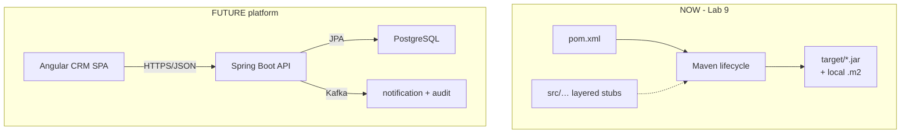

# Lab 9: Maven Build and Dependencies — Northstar CRM Build Lab

> **Participants:** Module sequence is in [`../README.md`](../README.md). **Do not start this guide until** you have finished Module 9 [pre-lab exercises 1–6](../exercises/EXERCISES-INDEX.md) (Pass — check yourself, do not write it down; classroom order **1 → 3 → 4 → 5 → 2 → 6**). Then open **one** OS how-to ([Windows](LAB-9-WINDOWS.md) · [macOS](LAB-9-MACOS.md)). In class, prefer the **45-minute timed path** with [`starter/`](starter/README.md); the **full path** is every Step below (homework / extended). This repo has no answer keys — complete the TODOs yourself. See [Which file do I open?](../../../_PARTICIPANT-FILE-GUIDE.md).

## Activity card

| | |
| --- | --- |
| **Objective** | Expand the CRM Maven project: scopes, plugins, lifecycle evidence, dependency tree |
| **Skills practiced** | `mvn test/package/verify`, Surefire, jar Main-Class, profiles, `dependency:tree` |
| **Expected outcome** | `mvn -B clean verify` + runnable `customer-service.jar` + lifecycle/tree evidence |
| **Estimated time** | Timed path ~45 min · Full path 3–4 hours |
| **Prerequisites** | Lab 0 · Lab 8 habits · Exercises 1–6 Pass · JDK 21 · Maven 3.9+ |
| **Expected files** | `examples/lab9-crm/` (`pom.xml`, tests, `docs/lifecycle-evidence.md`, tree capture) |
| **Validation checkpoints** | Starter smoke test · GUIDE Implementation Checkpoints |

**Module:** 9 — Build and Dependency Management with Maven  
**Duration:** ~45 minutes (timed path with starter) · Full path: 3–4 Hours

**Primary IDE:** IntelliJ IDEA Community Edition · **Optional IDE:** VS Code

| OS | How-to for this lab |
| -- | ------------------- |
| Windows | [LAB-9-WINDOWS.md](LAB-9-WINDOWS.md) |
| macOS | [LAB-9-MACOS.md](LAB-9-MACOS.md) |

> **Incremental build:** Mini POM (Ex 6) + Lab 8 structure → Lab 9 build-managed CRM.

> **Classroom pacing:** [`../PACING.md`](../PACING.md) (Checkpoints A–E).

> **Scope:** Do **not** add Spring Boot, JPA, Kafka, or Angular. Prefer full Maven logs while learning; never `-q` with `dependency:tree`.

**Verified participant layout (Windows IntelliJ + PowerShell; Temurin JDK 21.0.11; Maven 3.9.9):**

| Role | Path |
| ---- | ---- |
| IntelliJ opens | `%USERPROFILE%\java-bootcamp` (SDK / language level **21**) |
| Prerequisite | `examples\lab8-crm\` must already compile |
| This lab project | `examples\lab9-crm\` (copy of Lab 8 + expanded `pom.xml`) |
| Compile / test / package (first time — readable logs) | `mvn test` · `mvn clean package` · `java -jar target\customer-service.jar` |
| Quieter rebuild (optional) | `mvn -q test` · `mvn -q clean package` — **`-q` hides most output**; do not use it when you need to read Surefire or a dependency tree |
| CI preview | `mvn -B verify` (`-B` = batch / non-interactive) |
| Smoke-test output | JAR Main banner + Surefire `Tests run: 1` + default profile `dev` |

**Maven flags cheat sheet**

| Flag | Meaning | Use when |
| ---- | ------- | -------- |
| *(none)* | Full logs | Learning, capturing evidence, reading `dependency:tree` |
| `-q` | Quiet | You already know it works and want less scroll |
| `-B` | Batch | CI-style `mvn -B verify` |

**If it fails (Windows PowerShell):** Copy with `Copy-Item -Recurse lab8-crm lab9-crm` from `examples\`. Open `lab9-crm\pom.xml` in IntelliJ for Maven import. First dependency download can be slow — wait for Central.

---

## 45-minute timed path (use starter)

In class, use the starter templates so the **core** objectives fit **~45 minutes**. The full Steps below remain for homework / extended depth.

1. Open [`starter/README.md`](starter/README.md).
2. Copy `starter/` into your `java-bootcamp/examples/lab9-crm/` target (see starter README).
3. Fill every `// TODO` — do **not** wait on a perfect prior lab; the starter includes a baseline.
4. Run the starter smoke test. Commit your work to your GitHub repo (no screenshots).
5. Check timed-path Pass criteria in the starter README yourself (do not write the marks down). Continue remaining GUIDE steps as homework if needed.

| Path | Time | Scope |
| ---- | ---- | ----- |
| **Timed (default)** | ~45 min | Starter TODOs + smoke test |
| **Full (extended)** | see Duration | Every Step in this GUIDE |


## What you'll complete (practice only)

Labs and exercises are **practice only**. Nothing is submitted or graded. Do not take screenshots. Check Pass/Fail yourself — do not write those marks anywhere. Commit your work to your private `java-bootcamp` GitHub repo.

Keep this checklist visible while you work.

| # | Deliverable |
| - | ----------- |
| 1 | Completed Lab 9 `pom.xml` with dependencies, plugins, profiles |
| 2 | `PlaceholderTest` and layered sources from Lab 8 |
| 3 | `docs/lifecycle-evidence.md` covering each lifecycle command |
| 4 | `docs/dependency-tree.txt` (annotated) |
| 5 | `target/customer-service.jar` evidence (listing + `java -jar` run)—screenshot/log, not necessarily the binary in Git |
| 6 | Controlled-failure evidence (bad version / failing test) |
| 7 | Architecture note: build-time NOW vs Angular/Kafka/PostgreSQL LATER |
| 8 | README with run/cleanup and `mvn -B verify` CI note |

**Commit to your GitHub repo:** the items in the table above (sources + evidence + short notes).

**Do not commit:** `target/`, `node_modules/`, secrets, heap dumps, or a copied answer keys.

## Lab Overview

This Module 9 lab turns the Lab 8 CRM skeleton into a **build-managed** Maven project: full `pom.xml` coordinates, Spring and JUnit **placeholders**, dependency scopes, plugins, profiles (`dev` / `test` / `prod`), and a disciplined walk through every major lifecycle phase from `validate` to `install`.

## Learning Objectives

After completing this lab, you will be able to:

* Author a complete `pom.xml` with `groupId`, `artifactId`, `version`, properties, and `packaging`
* Declare Spring and JUnit dependencies with correct **scopes** (`compile`, `test`; notes for `runtime` / `provided`)
* Walk the Maven lifecycle: `validate` → `compile` → `test` → `package` → `verify` → `install`
* Configure **compiler**, **Surefire**, and **jar** plugins for JDK 21 and `Main`
* Define `dev`, `test`, and `prod` profiles and activate them intentionally (`-P`, activeByDefault)

## Business Scenario

Northstar’s CRM (`CUS-1001` Amina Khan, `CUS-1002` Ravi Singh) will eventually pull Spring Boot, JUnit, Kafka clients, and an PostgreSQL driver. Managing JARs by hand is impossible.

Your lead wants every engineer on the same Maven coordinates:

| Item | Value |
| ---- | ----- |
| Customer examples | `CUS-1001` Amina Khan `ACTIVE`; `CUS-1002` Ravi Singh `PROSPECT` |
| Correlation ID | `lab-request-001` |
| Artifact | `com.northstar:customer-service:0.1.0-SNAPSHOT` |
| Final JAR name | `customer-service.jar` (via `<finalName>`) |

**Security note for evidence.** Do not paste GitHub credentialss, AWS secrets, or repository passwords into `pom.xml` or screenshots. Never put production DB credentials in `dev` profile properties.

## Architecture Context
### NOW vs LATER

**NOW:** Maven build defines how source becomes a JAR. Still layered plain-Java stubs from Lab 8. Spring libraries may appear on the classpath as **learning placeholders**; do not write Spring Boot application code yet.

**LATER:** Spring Boot API, JPA/PostgreSQL, Angular SPA, Kafka.



### Lifecycle (ASCII)


### Architecture NOW vs LATER (table)

| Aspect | Lab 9 (NOW) | Later CRM labs |
| ------ | ----------- | -------------- |
| Focus | Build truth (POM, lifecycle, JAR) | Runtime features (APIs, DB) |
| Spring | Placeholder dependency only | Spring Boot apps (Lab 22+) |
| Tests | `PlaceholderTest` | Real unit/integration tests |
| Config | `dev` profile defaults | Secrets stores / prod config |
| Artifact | Local `target/` + optional `~/.m2` | CI + artifact repository |

**Lab focus:** coordinates, dependency scopes, lifecycle phases, plugins, profiles, dependency tree, JAR packaging, and CI notes (`mvn -B verify`).

---

## Prerequisites

Complete the [Labs Setup Instructions](../../../SETUP-INSTRUCTIONS.md), [Lab 0](../../../Week%201%20-%20Java%20and%20JVM%20Foundations/module-00/lab0/LAB-0-GUIDE.md), [Module 9 pre-lab exercises](../exercises/EXERCISES-INDEX.md), and [Lab 8](../../module-08/lab8/LAB-8-GUIDE.md) before this lab. Confirm:

* Module 9 exercises 1–6 complete (mini POM builds under `examples/module-09-exercises/mini-maven`)
* Lab 8 skeleton (`lab8-crm/`) with packages `controller/service/repository/entity/dto/config/exception`
* **JDK 21**; **Maven 3.9+**; Git; internet access for Maven Central
* IntelliJ IDEA Community (primary; optional VS Code) with `~/java-bootcamp` open
* No secrets (keys, tokens, passwords) committed to Git

### Pre-flight

```bash
java -version
mvn -version
git --version
git status
pwd
ls ~/java-bootcamp/examples
```

Expected theme:

```text
openjdk version "21....
Apache Maven 3....
.../examples contains lab8-crm (required)
```

Fix environment or Lab 8 gaps before changing the POM. Record tool versions in evidence if asked.

---

## Worked example (read before you code)

Study this pattern once before Step 1. Your job is to apply the same idea in the Steps — do not skip ahead to a full solution.

```java
package com.northstar.crm;

import org.junit.jupiter.api.Test;
import static org.junit.jupiter.api.Assertions.assertTrue;

class PlaceholderTest {
    @Test
    void projectCoordinatesAreMeaningful() {
        assertTrue(true);
    }
}
```

**What to notice:** The starter uses a one-arg `assertTrue(true)` (a TODO comment may mention the Labs 11/17 message). Match names, IDs, and failure behavior from the scenario — instructors check these.

---

## Implementation Steps

Complete each step in order. Commands assume `~/java-bootcamp/examples/lab9-crm` (Windows: `%USERPROFILE%\java-bootcamp\examples\lab9-crm`) on your laptop unless a step says otherwise. Prefer the **IntelliJ IDEA Community (primary; optional VS Code)** terminal.

---

### Step 1 — Copy Lab 8 into `lab9-crm` and confirm compile

**Why:** Lab 9 is a build evolution of Lab 8. Copying preserves package structure and keeps Lab 8 pristine as a checkpoint you can return to.

**Do this:**

```bash
cd ~/java-bootcamp/examples
cp -r lab8-crm lab9-crm
cd lab9-crm
mvn -q clean compile
```

On Windows PowerShell (local mode):

```powershell
cd $env:USERPROFILE\java-bootcamp\examples
Copy-Item -Recurse lab8-crm lab9-crm
cd lab9-crm
mvn -q clean compile
```

**Expected result:** `BUILD SUCCESS`; `lab9-crm` contains the Lab 8 package tree and `docs/`.

**If it fails:** `lab8-crm` missing → finish Lab 8 first. Compile errors in stubs → fix packages under `src/main/java/com/northstar/crm`. Do not start expanding the POM on a broken tree.

---

### Step 2 — Expand `pom.xml` coordinates, properties, and packaging

**Why:** Coordinates are the artifact’s public name. Properties centralize versions so you do not scatter magic strings across dependency blocks.

**Do this:** Replace the minimal Lab 8 POM header with a full skeleton. Keep `packaging` as `jar`.

```xml
<?xml version="1.0" encoding="UTF-8"?>
<project xmlns="http://maven.apache.org/POM/4.0.0"
         xmlns:xsi="http://www.w3.org/2001/XMLSchema-instance"
         xsi:schemaLocation="http://maven.apache.org/POM/4.0.0 https://maven.apache.org/xsd/maven-4.0.0.xsd">
  <modelVersion>4.0.0</modelVersion>

  <groupId>com.northstar</groupId>
  <artifactId>customer-service</artifactId>
  <version>0.1.0-SNAPSHOT</version>
  <packaging>jar</packaging>

  <name>Northstar Customer Service</name>
  <description>Customer Management Platform — Maven build lab</description>

  <properties>
    <project.build.sourceEncoding>UTF-8</project.build.sourceEncoding>
    <maven.compiler.release>21</maven.compiler.release>
    <junit.version>5.11.4</junit.version>
    <spring.version>6.2.3</spring.version>
  </properties>

  <!-- dependencies and build added in following steps -->
</project>
```

Validate:

```bash
mvn -q validate
```

**Expected result:** Coordinates parse; model is valid (`BUILD SUCCESS`).

**If it fails:** XML well-formedness (unclosed tags). Wrong file → ensure you edited `lab9-crm/pom.xml`, not Lab 8. Tag `<n>` in some templates is wrong—use `<name>` as in the sample (or Maven’s accepted elements for your version).

---

### Step 3 — Add Spring and JUnit placeholder dependencies with scopes

**Why:** Scopes control classpath membership. Mistaking `test` for `compile` can ship test frameworks into runtime images later—or bloat production classpaths.

**Do this:** Add a `<dependencies>` section to `pom.xml`:

```xml
<dependencies>
  <!-- Learning placeholder: Spring Core API (Week 3 / Lab 22+ use Spring Boot properly) -->
  <dependency>
    <groupId>org.springframework</groupId>
    <artifactId>spring-context</artifactId>
    <version>${spring.version}</version>
  </dependency>

  <!-- Optional teaching note: DB drivers are often runtime scope when used -->
  <!-- Example runtime-scoped driver (version from Spring Boot BOM when using Boot):
  <dependency>
    <groupId>org.postgresql</groupId>
    <artifactId>postgresql</artifactId>
    <scope>runtime</scope>
  </dependency>
  -->

  <dependency>
    <groupId>org.junit.jupiter</groupId>
    <artifactId>junit-jupiter</artifactId>
    <version>${junit.version}</version>
    <scope>test</scope>
  </dependency>
</dependencies>
```

Create `src/test/java/com/northstar/crm/PlaceholderTest.java`:

```java
package com.northstar.crm;

import org.junit.jupiter.api.Test;
import static org.junit.jupiter.api.Assertions.assertTrue;

class PlaceholderTest {
    @Test
    void projectCoordinatesAreMeaningful() {
        // TODO: replace with real CRM tests in Labs 11/17
        assertTrue(true);
    }
}
```

Quick resolve/check:

```bash
mvn -q dependency:resolve
mvn -q -DskipTests compile
```

**Scope cheat sheet:**

| Scope | Compile classpath | Test classpath | Runtime packaging mindset |
| ----- | ----------------- | -------------- | ------------------------- |
| `compile` (default) | yes | yes | ships with app |
| `test` | no | yes | must not ship as app dep |
| `runtime` | no | yes | needed to run, not compile |
| `provided` | yes | yes | container provides at runtime |

**Expected result:** Dependencies resolve from Maven Central; JUnit is `test` scope; still **no** `@SpringBootApplication` in main sources.

**If it fails:** Network/proxy → SETUP mirror notes. Version typo → restore `${spring.version}` / `${junit.version}`. Test class not found later → package path must be under `src/test/java`.

---

### Step 4 — Configure compiler, Surefire, and jar plugins

**Why:** Plugins bind toolchain behavior to lifecycle phases. Without Surefire, “tests” are wishful. Without jar manifest `Main-Class`, `java -jar` fails.

**Do this:** Add `<build>` to `pom.xml`:

```xml
<build>
  <finalName>customer-service</finalName>
  <plugins>
    <plugin>
      <groupId>org.apache.maven.plugins</groupId>
      <artifactId>maven-compiler-plugin</artifactId>
      <version>3.13.0</version>
      <configuration>
        <release>21</release>
      </configuration>
    </plugin>
    <plugin>
      <groupId>org.apache.maven.plugins</groupId>
      <artifactId>maven-surefire-plugin</artifactId>
      <version>3.5.2</version>
    </plugin>
    <plugin>
      <groupId>org.apache.maven.plugins</groupId>
      <artifactId>maven-jar-plugin</artifactId>
      <version>3.4.2</version>
      <configuration>
        <archive>
          <manifest>
            <mainClass>com.northstar.crm.Main</mainClass>
          </manifest>
        </archive>
      </configuration>
    </plugin>
  </plugins>
</build>
```

```bash
mvn -q -DskipTests compile
mvn -q test
```

**Expected result:** Compile uses release 21; `PlaceholderTest` runs (`Tests run: 1, Failures: 0`).

**If it fails:** Surefire naming — class must end with `Test` or match includes. Manifest wrong class → confirm `com.northstar.crm.Main` exists from Lab 8.

---

### Step 5 — Walk the lifecycle phase by phase

**Why:** Jumping straight to `package` hides which phase failed. Mentors grade phase-by-phase evidence.

**Do this:** Create `docs/lifecycle-evidence.md`. Run each phase **separately** and paste a short excerpt after each:

```bash
mvn validate
mvn compile
mvn test
mvn package
mvn verify
mvn install
```

For each command, record:

* Exit code / `BUILD SUCCESS` or failure
* Key INFO lines
* What appeared under `target/` (and under `~/.m2/repository/com/northstar/customer-service/` after `install`)

**Expected result (abbreviated):**

```text
$ mvn validate
... BUILD SUCCESS

$ mvn compile
... Compiling N source files ... BUILD SUCCESS

$ mvn test
... PlaceholderTest ... Tests run: 1, Failures: 0 ... BUILD SUCCESS

$ mvn package
... Building jar: .../target/customer-service.jar

$ mvn verify
... BUILD SUCCESS

$ mvn install
... Installing ... to ~/.m2/repository/com/northstar/customer-service/0.1.0-SNAPSHOT/...
```

**If it fails:** Do not delete `lifecycle-evidence.md` on failure—capture the error, then fix and re-run that phase. First-time dependency downloads can make `compile` slow; note that honestly.

---

### Step 6 — Inspect the dependency tree

**Why:** Transitive dependency surprises cause classpath hell. Reading the tree is a core enterprise skill.

**Do this** (no `-q` — the tree **is** the output you need):

```bash
mvn dependency:tree | tee docs/dependency-tree.txt
# optional filter:
mvn dependency:tree -Dincludes=org.springframework* | tee -a docs/dependency-tree.txt
```

**How to read the symbols** (same legend as Exercise 5):

| Symbol | Meaning |
| ------ | ------- |
| `+-` | Node has another sibling after it at this indent level |
| `\-` | Last child at this indent level |
| `\|` | Guide line under a parent |
| Indent under a `+-` / `\-` line | Usually a **transitive** dependency |

Annotate the top of `docs/dependency-tree.txt` with short comments (bullets, not essays):

1. Which dependencies are **direct** vs **transitive**
2. Why `junit-jupiter` must remain `test` (must not look like a production runtime dependency)
3. One example of a `+-` line and one `\-` line from your capture

**Expected theme:**

```text
com.northstar:customer-service:jar:0.1.0-SNAPSHOT
+- org.springframework:spring-context:jar:6.2.3:compile   ← DIRECT; +- = more siblings follow
|  +- org.springframework:spring-aop:jar:...:compile      ← TRANSITIVE under spring-context
|  \- ... (more transitive; \- = last under this parent)
\- org.junit.jupiter:junit-jupiter:jar:5.11.4:test        ← DIRECT (test scope)
```

**If it fails:** Plugin not found → ensure network; `dependency:tree` is from `maven-dependency-plugin` (usually auto-resolved). Empty tree → dependencies missing from POM (return to Step 3). Used `-q` by mistake → re-run **without** `-q`.
---

### Step 7 — Add `dev`, `test`, and `prod` profiles

**Why:** Profiles isolate environment defaults. A `dev` profile active by default is fine for training—dangerous if it loads real production secrets (which you must never put in the POM).

**Do this:** Add `<profiles>` to `pom.xml`:

```xml
<profiles>
  <profile>
    <id>dev</id>
    <activation>
      <activeByDefault>true</activeByDefault>
    </activation>
    <properties>
      <app.environment>dev</app.environment>
    </properties>
  </profile>
  <profile>
    <id>test</id>
    <properties>
      <app.environment>test</app.environment>
    </properties>
  </profile>
  <profile>
    <id>prod</id>
    <properties>
      <app.environment>prod</app.environment>
    </properties>
  </profile>
</profiles>
```

Create `src/main/resources/application-dev.properties`:

```properties
# Local laptop defaults — never put production passwords here
app.environment=dev
app.sample.customer=CUS-1001
# correlation id example for notes: lab-request-001
```

Demonstrate activation:

```bash
mvn -q help:active-profiles
mvn -q -Ptest help:active-profiles
mvn -q -Pprod help:active-profiles
```

**Expected result:** Default active profile includes `dev`; `-Pprod` activates `prod`. No secrets appear in profile properties.

**If it fails:** Wrong POM → check you are in `lab9-crm`. `help` plugin downloads on first use. Profile IDs are case-sensitive (`prod` ≠ `Prod`).

---

### Step 8 — Package the JAR, run it, and document CI usage

**Why:** Packaging proves the build produces a shareable binary. Documenting `mvn -B verify` prepares later CI labs without deploying snapshots casually.

**Do this:**

```bash
mvn -q clean package
jar tf target/customer-service.jar | head
java -jar target/customer-service.jar
mvn -B verify
```

Update project `LAB-9-GUIDE.md` with a CI section:

```markdown
## CI note (preview — pipelines deepen in later modules)

Preferred verify command on agents:

    mvn -B verify

`-B` is batch mode (non-interactive). Prefer `verify` over `install` on CI
unless your pipeline intentionally publishes to an artifact repository.
Never deploy snapshots from a developer laptop without agreement.

Artifact coordinates: com.northstar:customer-service:0.1.0-SNAPSHOT
Sample customer IDs (docs only): CUS-1001, CUS-1002
Correlation ID (logs later): lab-request-001
```

**Expected result:** `target/customer-service.jar` exists; `java -jar` prints the Lab 8 `Main` banner (skeleton packages / example IDs); README documents `mvn -B verify`; batch verify succeeds.

**If it fails:** `no main manifest attribute` → jar plugin `mainClass` misconfigured (Step 4). JAR missing → package phase failed; check tests. `-B verify` fails on test → fix `PlaceholderTest`.

---

### Step — Commit to GitHub


**Why:** Progress checks look for lifecycle evidence and tree annotations, not only a green last command.

**Do this:**

1. Confirm `docs/lifecycle-evidence.md` has all six phases
2. Confirm `docs/dependency-tree.txt` has direct vs transitive notes
3. Screenshot/paste `java -jar` output and `mvn -B verify` into `notes/lab-9/` or answers
4. Draft reflection answers in `notes/lab9-answers.md`
5. Run the failure experiments (next section) and restore

**Expected result:** Another student can rebuild from your README without asking you which commands you ran.

**If it fails:** Missing Lab 8 docs after copy → re-copy only missing files from `lab8-crm/docs` without wiping Lab 9 POM work.

---

## Implementation Checkpoints

### Checkpoint A — Project copy + coordinates

_Check **Pass** or **Fail** yourself. Do not write these marks anywhere — nothing is submitted or graded. Commit your work to your GitHub repo._

| # | Confirm | Self-check |
| - | ------- | ---------- |
| 1 | `~/java-bootcamp/examples/lab9-crm` exists (copied from Lab 8) | Pass / Fail |
| 2 | `pom.xml` has `com.northstar:customer-service:0.1.0-SNAPSHOT` and `packaging` jar | Pass / Fail |
| 3 | Properties set `maven.compiler.release` / JDK 21 mindset | Pass / Fail |
| 4 | Edited on VS Code laptop | Pass / Fail |

### Checkpoint B — Dependencies, plugins, tests

_Check **Pass** or **Fail** yourself. Do not write these marks anywhere — nothing is submitted or graded. Commit your work to your GitHub repo._

| # | Confirm | Self-check |
| - | ------- | ---------- |
| 1 | Spring placeholder + JUnit `test` scope declared | Pass / Fail |
| 2 | `PlaceholderTest` passes under Surefire | Pass / Fail |
| 3 | Compiler + jar `Main-Class` configured | Pass / Fail |
| 4 | `mvn test` and `mvn package` succeed | Pass / Fail |

### Checkpoint C — Lifecycle + tree + profiles

_Check **Pass** or **Fail** yourself. Do not write these marks anywhere — nothing is submitted or graded. Commit your work to your GitHub repo._

| # | Confirm | Self-check |
| - | ------- | ---------- |
| 1 | `docs/lifecycle-evidence.md` covers validate → install | Pass / Fail |
| 2 | `docs/dependency-tree.txt` annotated (direct/transitive, JUnit scope) | Pass / Fail |
| 3 | Profiles `dev` / `test` / `prod` demonstrated with `help:active-profiles` | Pass / Fail |
| 4 | `application-dev.properties` has no secrets | Pass / Fail |

### Checkpoint D — JAR, CI, failures, security

_Check **Pass** or **Fail** yourself. Do not write these marks anywhere — nothing is submitted or graded. Commit your work to your GitHub repo._

| # | Confirm | Self-check |
| - | ------- | ---------- |
| 1 | `java -jar target/customer-service.jar` works | Pass / Fail |
| 2 | README documents `mvn -B verify` | Pass / Fail |
| 3 | At least three failure experiments recorded and restored | Pass / Fail |
| 4 | No secrets / `target/` / `.m2` dump committed | Pass / Fail |

---

## Reference Commands, Configuration, and Code

### Lifecycle sequence

```bash
cd ~/java-bootcamp/examples/lab9-crm
mvn validate
mvn compile
mvn test
mvn package
mvn verify
mvn install
mvn -B verify
```

### Dependency tree

```bash
mvn dependency:tree
mvn dependency:tree -Dincludes=org.springframework*
```

### Profiles

```bash
mvn help:active-profiles
mvn -Pprod -DskipTests package
```

### Package and run

```bash
mvn -q clean package
jar tf target/customer-service.jar | head
java -jar target/customer-service.jar
```

### Coordinates

```xml
<groupId>com.northstar</groupId>
<artifactId>customer-service</artifactId>
<version>0.1.0-SNAPSHOT</version>
```

## Failure Experiments

Perform deliberately, then restore working state.

| # | Experiment | Observe | Restore |
| - | ---------- | ------- | ------- |
| 1 | Set `spring.version` to nonsense; `mvn compile` | Artifact resolution failure | Restore real version |
| 2 | Change `PlaceholderTest` to `assertTrue(false)`; `mvn test` / `mvn verify` | Tests fail; verify fails | Restore assertion |
| 3 | Run `mvn install` twice | Second install succeeds; snapshot overwritten in `~/.m2` | Note idempotency in answers |
| 4 | Compare cold vs warm `mvn -B verify` wall-clock | First run slower (downloads) | Document in notes |
| 5 | Remove `<scope>test</scope>` from JUnit temporarily; re-tree | JUnit appears as compile—bad practice | Restore `test` scope |

---

## Troubleshooting

| Symptom | Likely cause | Fix |
| ------- | ------------ | --- |
| `mvn: command not found` | Maven missing | SETUP / Lab 0 |
| Cannot resolve dependencies | Network / proxy / bad version | Check mirror; restore versions; retry |
| Edited Lab 8 by mistake | Wrong directory | `cd ~/java-bootcamp/examples/lab9-crm` |
| Tests not discovered | Wrong name/path | `*Test.java` under `src/test/java` |
| `no main manifest attribute` | jar plugin missing Main-Class | Fix Step 4 plugin config |
| Profile not active | Typo / wrong `-P` | `mvn help:active-profiles` |
| `BUILD SUCCESS` once only | No phase evidence | Fill `lifecycle-evidence.md` |
| Spring Boot confusion | Over-eager coding | Remove `@SpringBootApplication`; placeholders only |

## Security and Production Review

Optional — jot brief notes in your README if useful for your progress check (not a separate essay):

1. Which inputs are untrusted? *(Downloaded Maven artifacts; later API inputs)*
2. Where are authn/authz/validation enforced later? *(App layers + CI/repo managers)*
3. Which values are sensitive, and where stored? *(Never in POM; use secrets stores)*

---


## Cleanup

Commit your work to GitHub first (no screenshots).

```bash
cd ~/java-bootcamp/examples/lab9-crm
mvn clean
# optional if disk is tight:
# rm -rf ~/.m2/repository/com/northstar/customer-service
git status
```

Keep sources, `docs/lifecycle-evidence.md`, `docs/dependency-tree.txt`, and notes. Remove temporary credentials from the environment where practical.

**Keep `lab9-crm`**—Lab 10+ typically continues from this Maven-enabled tree.


## Reflection Questions

Write answers in `notes/lab9-answers.md`:

Write **1–3 sentence** answers (not essays):

1. Which design decision most affected build correctness?
2. What evidence proves the lifecycle walk was real (not only `package` once)?
3. Which failure was hardest to diagnose?

---


