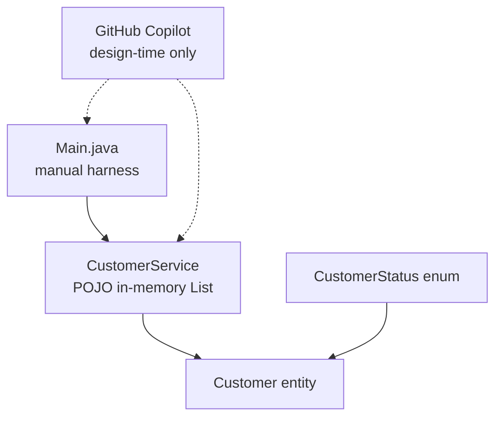

# Lab 10: GitHub Copilot Fundamentals for Java Developers — Northstar CRM

> **Participants:** Module sequence is in [`../README.md`](../README.md). **Do not start this guide until** you have finished Module 10 [pre-lab exercises 1–6](../exercises/EXERCISES-INDEX.md) (Pass — check yourself, do not write it down; order **1 → 2 → 3 → 4 → 5 → 6**). Then open **one** OS how-to ([Windows](LAB-10-WINDOWS.md) · [macOS](LAB-10-MACOS.md)). In class, prefer the **45-minute timed path** with [`starter/`](starter/README.md); the **full path** is every Step below (homework / extended). This repo has no answer keys — complete the TODOs yourself. See [Which file do I open?](../../../_PARTICIPANT-FILE-GUIDE.md).

## Activity card

| | |
| --- | --- |
| **Objective** | Use Copilot with strong prompts to flesh plain-Java CRM domain code and keep a review log |
| **Skills practiced** | Prompt constraints, reject phantoms, Accept/Reject/Edit logging, Maven compile smoke |
| **Expected outcome** | `CUS-1001` ACTIVE + `CUS-1002` PROSPECT→ACTIVE; `copilot-notes/ai-review-notes.md` entries |
| **Estimated time** | Timed path ~45 min · Full path 3–4 hours |
| **Prerequisites** | Lab 0 · Lab 9 habits · Exercises 1–6 Pass · JDK 21 · Maven 3.9+ · Copilot (or instructor alternate) |
| **Expected files** | `examples/lab10-crm/` + review log `copilot-notes/ai-review-notes.md` |
| **Validation checkpoints** | Starter smoke test · GUIDE Implementation Checkpoints |

**Module:** 10 — GitHub Copilot Fundamentals for Java Developers  
**Duration:** ~45 minutes (timed path with starter) · Full path: 3–4 Hours

**Primary IDE:** IntelliJ IDEA Community Edition · **Optional IDE:** VS Code

| OS | How-to for this lab |
| -- | ------------------- |
| Windows | [LAB-10-WINDOWS.md](LAB-10-WINDOWS.md) |
| macOS | [LAB-10-MACOS.md](LAB-10-MACOS.md) |

> **Incremental build:** Prompt/review notes (Ex 1–6) → Lab 10 Copilot-assisted CRM domain + review log.

> **Classroom pacing:** [`../PACING.md`](../PACING.md) (Checkpoints A–E).

> **AI hygiene:** Restate “Java 21, no Spring, no JPA” in prompts. Reject `@Entity` / `@Id` / `@Column`. Never paste secrets or production PII.

**Verified participant layout (Windows IntelliJ + PowerShell; Temurin JDK 21.0.11; Maven 3.9.9):**

| Role | Path |
| ---- | ---- |
| IntelliJ opens | `%USERPROFILE%\java-bootcamp` (SDK / language level **21**) |
| Prerequisite | `examples\lab9-crm\` must already compile / package |
| This lab project | `examples\lab10-crm\` (`Copy-Item -Recurse lab9-crm lab10-crm`) |
| Domain / service | `CustomerStatus`, fleshed-out `Customer`, in-memory `CustomerService` |
| Review log | `copilot-notes\ai-review-notes.md` (`lab10-001`–`lab10-004`) |
| Compile / run | `mvn -q clean compile` · `java -cp target\classes com.northstar.crm.Main` |
| Smoke-test output | `findByCustomerId` for Amina/Ravi; after `updateStatus` `CUS-1002` ACTIVE |

**If it fails (Windows PowerShell):** Prefer the timed-path `starter/` copy into `examples\lab10-crm` (no Spring controller in that tree). Reject `@Entity` / `@Id` / `@Column` on `Customer`. Prefer `java -cp target\classes` over the fat JAR for this lab’s harness. Do **not** add JPA/Spring to “fix” Copilot.

---

## 45-minute timed path (use starter)

In class, use the starter templates so the **core** objectives fit **~45 minutes**. The full Steps below remain for homework / extended depth.

1. Open [`starter/README.md`](starter/README.md).
2. Copy `starter/` into your `java-bootcamp/examples/lab10-crm/` target (see starter README).
3. Fill every `// TODO` — do **not** wait on a perfect prior lab; the starter includes a baseline.
4. Run the starter smoke test. Commit your work to your GitHub repo (no screenshots).
5. Check timed-path Pass criteria in the starter README yourself (do not write the marks down). Continue remaining GUIDE steps as homework if needed.

| Path | Time | Scope |
| ---- | ---- | ----- |
| **Timed (default)** | ~45 min | Starter TODOs + smoke test |
| **Full (extended)** | see Duration | Every Step in this GUIDE |


## What you'll complete (practice only)

Labs and exercises are **practice only**. Nothing is submitted or graded. Do not take screenshots. Check Pass/Fail yourself — do not write those marks anywhere. Commit your work to your private `java-bootcamp` GitHub repo.

Keep this checklist visible while you work.

| # | Deliverable |
| - | ----------- |
| 1 | `Customer` entity (`com.northstar.crm.entity.Customer`) |
| 2 | `CustomerStatus` enum (`com.northstar.crm.entity.CustomerStatus`) |
| 3 | `CustomerService` (`com.northstar.crm.service.CustomerService`) |
| 4 | `Main.java` harness demonstrating `CUS-1001` and `CUS-1002` |
| 5 | `copilot-notes/ai-review-notes.md` with entries `lab10-001`–`lab10-004` |
| 6 | Failure-experiment notes and compile/`Main` evidence |
| 7 | No secrets or generated `target/` committed |

**Commit to your GitHub repo:** the items in the table above (sources + evidence + short notes).

**Do not commit:** `target/`, `node_modules/`, secrets, heap dumps, or a copied answer keys.

## Lab Overview

This Module 10 lab continues the **Northstar Customer Service Platform** into `lab10-crm/`, picking up the Maven project (`com.northstar:customer-service`) from Lab 9. There is still **no Spring Framework** in application code — Week 2 (Labs 8–21) stays plain Java and Maven. What is new is the tool you write that plain Java with: **GitHub Copilot**.

## Learning Objectives

After completing this lab, you will be able to:

* Install, sign in to, and verify GitHub Copilot in **IntelliJ IDEA** (primary) against a Java project
* Distinguish weak prompts from strong prompts and explain why specificity changes output
* Use inline completions and Copilot Chat to scaffold a JavaBean-style entity class
* Use Copilot Chat to draft a first-pass service layer with business validation
* Apply a mandatory human-review checklist before accepting any AI-generated code

## Business Scenario

Northstar’s engineering lead wants the customer-service backend built faster without sacrificing correctness. The team approved GitHub Copilot for all developers, but only under a documented review policy:

**No AI-generated code merges without a human explaining, in writing, what it does and why it is correct.**

You flesh out the `Customer` domain object and the first `CustomerService` operations (`addCustomer`, `findByCustomerId`, `updateStatus`) on top of the Lab 9 Maven skeleton. You use Copilot to go faster, and you prove—with a written review log—that you understood and verified every line. (`findByStatus` / `listAll` are optional full-path stretch — not required on the timed starter.)

Use these examples consistently:

| ID | Name | Status | Email |
| -- | ---- | ------ | ----- |
| `CUS-1001` | Amina Khan | `ACTIVE` | `amina.khan@example.com` |
| `CUS-1002` | Ravi Singh | `PROSPECT` | `ravi.singh@example.com` |

* Review-log entry IDs: `lab10-001`, `lab10-002`, `lab10-003`, `lab10-004`
* Do **not** invent real SSNs, passwords, or production emails in prompts

**Security note for evidence.** Screenshots may show Copilot UI, but never paste GitHub credentialss, org tokens, or real customer PII into Chat.

---

## Architecture Context
### NOW (this lab)



## Prerequisites

Complete [SETUP-INSTRUCTIONS](../../../SETUP-INSTRUCTIONS.md), [Lab 0](../../../Week%201%20-%20Java%20and%20JVM%20Foundations/module-00/lab0/LAB-0-GUIDE.md), and [Lab 9](../../module-09/lab9/LAB-9-GUIDE.md). Confirm:

* Maven project from **Lab 9** (`lab9-crm/`) — `com.northstar:customer-service`, package `com.northstar.crm` with layered packages
* JDK 21 + Maven working
* GitHub account with an active **GitHub Copilot** license
* **VS Code** with **GitHub Copilot** and **GitHub Copilot Chat** installed and signed in (see [Setup § Week 2](../../../SETUP-INSTRUCTIONS.md)) — Connected via VS Code as in Lab 0
* No secrets committed to Git

> If your instructor prefers IntelliJ IDEA with the Copilot plugin, steps map one-to-one. Use whichever IDE is connected to `~/java-bootcamp`; do not switch tools mid-lab.

### Pre-flight

```bash
java -version
mvn -version
git --version
pwd
ls ~/java-bootcamp/examples
```

In VS Code:

1. Command Palette (`Ctrl+Shift+P`) → `GitHub Copilot: Check Status` → **signed in** / **active**
2. Open any `.java` file under Lab 9/10 and confirm the Copilot status-bar icon is not crossed out

Fix environment/Copilot failures before changing application code. Record tool versions and Copilot status in evidence if asked.

---

## Worked example (read before you code)

Study this pattern once before Step 1. Your job is to apply the same idea in the Steps — do not skip ahead to a full solution.

```powershell
cd $env:USERPROFILE\java-bootcamp\examples
Copy-Item -Recurse lab9-crm lab10-crm
cd lab10-crm
```

**What to notice:** Match names, IDs, and failure behavior from the scenario — instructors check these.

---

## Implementation Steps

Complete each step in order. Commands assume `~/java-bootcamp/examples/lab10-crm` (Windows: `%USERPROFILE%\java-bootcamp\examples\lab10-crm`) unless noted. Prefer the **IntelliJ IDEA Community (primary; optional VS Code)** terminal for Maven; use Copilot in the IDE editor/Chat panels.

---

### Step 1 — Install and sign in to GitHub Copilot in IntelliJ; copy Lab 9 → Lab 10

**Why:** Copilot must be authenticated in your **primary IDE (IntelliJ)** and the workspace must be a clean copy of the Lab 9 tree so Maven coordinates and packages stay consistent.

**Do this — IntelliJ Copilot setup (demo checklist):**

1. Open IntelliJ IDEA Community → open `%USERPROFILE%\java-bootcamp` (macOS: `~/java-bootcamp`).
2. Install the plugin: **Settings / Preferences → Plugins → Marketplace** → search **GitHub Copilot** → **Install** → restart if prompted.
3. Sign in: click the **Copilot** icon in the IDE status bar (or **Tools → GitHub Copilot → Login**) → authorize in the browser.
4. Confirm settings (quick pass): **Settings → Tools → GitHub Copilot** (wording may vary slightly by plugin version):
   - Completions / suggestions **enabled** for Java
   - Optional: enable Copilot Chat if shown as a separate toggle
5. Status check: status bar Copilot icon should show **Ready** / signed-in (not an error slash).

**Do this — project copy:**

```bash
cd ~/java-bootcamp/examples
cp -r lab9-crm lab10-crm
cd lab10-crm
```

Windows PowerShell:

```powershell
cd $env:USERPROFILE\java-bootcamp\examples
Copy-Item -Recurse lab9-crm lab10-crm
cd lab10-crm
```

Then in IntelliJ: open / refresh `examples/lab10-crm` so Maven imports the POM.

**Optional IDE:** VS Code — Extensions → install **GitHub Copilot** + **GitHub Copilot Chat** → Sign In → `code .` from `lab10-crm`. Prefer IntelliJ for this bootcamp unless your instructor says otherwise.

**Expected result:**

```text
IntelliJ status bar: GitHub Copilot Ready / signed in
lab10-crm/ exists as a copy of lab9-crm with copilot-notes/
```

**If it fails:** No Copilot license → enable in GitHub settings (free/student/enterprise as applicable). Sign-in loops → Log out then Login again. Missing `lab9-crm` → finish Lab 9 first. Plugin missing → Marketplace install + restart. Wrong path → use `examples/` as in Labs 8–9.
---

### Step 2 — Sanity-check Copilot against this Java project

**Why:** Before scaffolding domain types, prove the extension can see `.java` files in this workspace (language mode + VS Code).

**Do this:** Open `src/main/java/com/northstar/crm/Main.java` and type a comment-only prompt; wait for ghost text (**do not** accept yet if you only want to observe):

```java
// TODO: print "Northstar customer service booting" to standard out
```

**Expected result:** Gray ghost text proposes something equivalent to `System.out.println("Northstar customer service booting");`. `Tab` accepts; `Esc` dismisses.

**If it fails:** Confirm language mode is Java (status bar). `GitHub Copilot: Check Status`. Reload Window. Ensure file ends in `.java` and is under the opened folder.

---

### Step 3 — Practice weak vs strong prompting

**Why:** Prompting quality is the actual skill this lab teaches. Vague prompts invent structure; strong prompts encode enterprise rules.

**Do this:** Try both prompts as comments above an empty class body in a scratch file (or temporary section), and record results.

| # | Weak prompt | Strong prompt | Why it matters |
| - | ------------ | -------------- | --------------- |
| 1 | `// customer class` | `// Java entity class Customer in package com.northstar.crm.entity representing a Northstar CRM customer. Fields: customerId (String, format "CUS-1001"), fullName (String), email (String), phone (String), status (CustomerStatus enum: PROSPECT, ACTIVE, SUSPENDED, CLOSED), createdAt (LocalDateTime). No-args constructor, all-args constructor, getters and setters, equals/hashCode based only on customerId, toString.` | Naming every field/type/format stops invented structure. |
| 2 | `// add a customer` | `// Method addCustomer(Customer customer) on CustomerService: reject if customerId is null/blank, reject if a customer with the same customerId already exists (throw IllegalStateException), otherwise store it in the in-memory list and return it.` | Rules up front → guard clauses, not only happy path. |

Create `copilot-notes/ai-review-notes.md` with entries `lab10-001` and `lab10-002`:

```markdown
## lab10-001 — weak vs strong (entity)

- Date:
- Weak prompt used:
- Output summary:
- Strong prompt used:
- Output summary:
- Decision: accept / reject / partial
- Reason (1 sentence):

## lab10-002 — weak vs strong (addCustomer)

- ...
```

**Expected result:** Notes contain two dated entries comparing vague vs correctly scoped output with explicit accept/reject decisions.

**If it fails:** If Chat is clearer than inline for this comparison, use Chat—but still log prompts and decisions. Do not skip the write-up.

---

### Step 4 — Scaffold `CustomerStatus` and `Customer` with Copilot

**Why:** Domain types are the foundation for service methods and later APIs. You must catch Copilot’s JPA-annotation habit before it breaks the plain-Java classpath.

**Do this:** Use the **strong prompt** from Step 3 (row 1) as a comment at the top of `Customer.java`, and:

```java
// Java enum CustomerStatus in package com.northstar.crm.entity with exactly
// four constants representing a Northstar CRM customer lifecycle:
// PROSPECT, ACTIVE, SUSPENDED, CLOSED.
```

Let Copilot draft both files, then compare against this reference shape **before** accepting:

```java
package com.northstar.crm.entity;

public enum CustomerStatus {
    PROSPECT,
    ACTIVE,
    SUSPENDED,
    CLOSED
}
```

```java
package com.northstar.crm.entity;

import java.time.LocalDateTime;
import java.util.Objects;

public class Customer {

    private String customerId;
    private String fullName;
    private String email;
    private String phone;
    private CustomerStatus status;
    private LocalDateTime createdAt;

    public Customer() {
    }

    public Customer(String customerId, String fullName, String email, String phone,
                     CustomerStatus status, LocalDateTime createdAt) {
        this.customerId = customerId;
        this.fullName = fullName;
        this.email = email;
        this.phone = phone;
        this.status = status;
        this.createdAt = createdAt;
    }

    // getters and setters for all fields

    @Override
    public boolean equals(Object o) {
        if (this == o) return true;
        if (!(o instanceof Customer)) return false;
        Customer other = (Customer) o;
        return Objects.equals(customerId, other.customerId);
    }

    @Override
    public int hashCode() {
        return Objects.hash(customerId);
    }

    @Override
    public String toString() {
        return "Customer{customerId='" + customerId + "', fullName='" + fullName
                + "', status=" + status + "}";
    }
}
```

**Watch for this common Copilot mistake:** “entity” often triggers `@Entity`, `@Id`, `@Column` from `jakarta.persistence` / `javax.persistence`, and a numeric **`Long id`**. **This project has no JPA in `pom.xml` and no Spring until Lab 22.** Reject those annotations and keep identity as **`String customerId`** (`"CUS-1001"` style)—this is the review discipline Step 7 formalizes. A leftover `Long` here breaks Lab 11 tests with `String cannot be converted to Long`.

```bash
mvn -q compile
```

**Expected result:** `BUILD SUCCESS`; `Customer.java` / `CustomerStatus.java` compile with **zero** framework imports.

**If it fails:** Delete JPA/Spring imports and annotations manually. Package must be `com.northstar.crm.entity` under matching folders. Re-prompt with “plain Java POJO, no JPA, no Spring.”

---

### Step 5 — Draft `CustomerService` with Copilot Chat

**Why:** Chat is better for multi-method classes with explicit business rules. Keep the request scoped—do not ask for “the entire CRM.”

**Do this:** Open Copilot Chat (`Ctrl+Alt+I`) and ask:

```text
In com.northstar.crm.service, write a plain Java class CustomerService
(no Spring annotations — this project has no Spring dependency yet).
It should hold customers in an in-memory List<Customer>. Methods:
addCustomer(Customer) — reject blank customerId, reject duplicate customerId
  with IllegalStateException, otherwise store and return the customer;
findByCustomerId(String) — return Optional<Customer>;
updateStatus(String customerId, CustomerStatus status) — throw
  IllegalArgumentException if the customer does not exist, otherwise
  update and return it.
```

> **Timed starter API:** Complete those three methods. Optional full-path stretch (not in starter stubs): `findByStatus(CustomerStatus)` and `listAll()`.

Reference shape to compare against (timed path):

```java
package com.northstar.crm.service;

import com.northstar.crm.entity.Customer;
import com.northstar.crm.entity.CustomerStatus;

import java.util.ArrayList;
import java.util.List;
import java.util.Optional;

public class CustomerService {

    private final List<Customer> customers = new ArrayList<>();

    public Customer addCustomer(Customer customer) {
        if (customer.getCustomerId() == null || customer.getCustomerId().isBlank()) {
            throw new IllegalArgumentException("customerId must not be blank");
        }
        if (findByCustomerId(customer.getCustomerId()).isPresent()) {
            throw new IllegalStateException("Customer already exists: " + customer.getCustomerId());
        }
        customers.add(customer);
        return customer;
    }

    public Optional<Customer> findByCustomerId(String customerId) {
        return customers.stream()
                .filter(c -> c.getCustomerId().equals(customerId))
                .findFirst();
    }

    public Customer updateStatus(String customerId, CustomerStatus status) {
        Customer customer = findByCustomerId(customerId)
                .orElseThrow(() -> new IllegalArgumentException("No such customer: " + customerId));
        customer.setStatus(status);
        return customer;
    }
}
```

```bash
mvn -q compile
```

**Expected result:** `BUILD SUCCESS`; service depends only on entity classes (and JDK), no Spring stereotypes.

**If it fails:** Reject `@Service` / `@Component` / repository injections. Ensure `Optional` and streams match Java 21. Fix missing imports from Chat paste carefully.

---

### Step 6 — Prove it manually with `Main`

**Why:** Compiles ≠ correct behavior. A harness with the canonical sample IDs is evidence instructors can re-run without Copilot.

**Do this:** Update `Main.java`:

```java
package com.northstar.crm;

import com.northstar.crm.entity.Customer;
import com.northstar.crm.entity.CustomerStatus;
import com.northstar.crm.service.CustomerService;

import java.time.LocalDateTime;

public class Main {
    public static void main(String[] args) {
        CustomerService service = new CustomerService();

        service.addCustomer(new Customer("CUS-1001", "Amina Khan", "amina.khan@example.com",
                "555-0101", CustomerStatus.ACTIVE, LocalDateTime.now()));
        service.addCustomer(new Customer("CUS-1002", "Ravi Singh", "ravi.singh@example.com",
                "555-0102", CustomerStatus.PROSPECT, LocalDateTime.now()));

        System.out.println("Amina: " + service.findByCustomerId("CUS-1001"));
        System.out.println("Ravi before: " + service.findByCustomerId("CUS-1002"));

        service.updateStatus("CUS-1002", CustomerStatus.ACTIVE);
        System.out.println("After activation: " + service.findByCustomerId("CUS-1002"));
    }
}
```

Run (pick one):

```bash
mvn -q compile
java -cp target/classes com.northstar.crm.Main

# or, if exec plugin is available from Lab 9 exploration:
mvn -q compile exec:java -Dexec.mainClass=com.northstar.crm.Main
```

**Expected result (theme):**

```text
Amina: Optional[Customer{customerId='CUS-1001', ..., status=ACTIVE}]
Ravi before: Optional[Customer{customerId='CUS-1002', ..., status=PROSPECT}]
After activation: Optional[Customer{customerId='CUS-1002', ..., status=ACTIVE}]
```

**If it fails:** Confirm constructors match field order. If jar-based run was used, prefer `-cp target/classes` for this lab. Duplicate add throws if re-run logic incorrectly—create a fresh `CustomerService` each run (as above).

---

### Step 7 — Mandatory human-review pass

**Why:** Policy: no AI code without written human verification. This entry is graded as heavily as the Java sources.

**Do this:** Walk every accepted suggestion from Steps 4–5 through this checklist; log as `lab10-003`:

_Check **Pass** or **Fail** yourself. Do not write these marks anywhere — nothing is submitted or graded. Commit your work to your GitHub repo._

| # | Confirm | Self-check |
| - | ------- | ---------- |
| 1 | Every import resolves against `pom.xml` deps actually present (no phantom JPA/Spring imports) | Pass / Fail |
| 2 | Business rules from the prompt appear in code (blank ID rejected, duplicate ID rejected, unknown ID rejected)—not only in comments | Pass / Fail |
| 3 | `equals` / `hashCode` based on `customerId` only | Pass / Fail |
| 4 | You could explain every line to a reviewer with Copilot turned off | Pass / Fail |
| 5 | No hardcoded secrets, real customer PII, or inappropriate test data committed | Pass / Fail |

If you deliberately let the JPA-annotation mistake through, document catching and removing it here as a worked example.

**Expected result:** `lab10-003` lists each checklist item pass/fail; fails note the exact fix.

**If it fails:** Incomplete checklist → go back and re-read the generated files line by line. Superficial “looks fine” entries will lose rubric marks.

---

### Step 8 — Document AI risk awareness

**Why:** Copilot’s risk surface is not only correctness—it includes leakage, provenance, and accountability.

**Do this:** Add entry `lab10-004` answering in your own words:

1. What real customer data did you avoid typing into Chat, and what did you use instead (`CUS-1001` / `CUS-1002`)?
2. If Copilot suggests a block that looks copied verbatim from a known library/article, what do you do before accepting?
3. What is your team’s rule for code Copilot generates that you do not fully understand?

**Expected result:** `lab10-004` answers all three in prose, referencing this lab’s prompts and decisions.

**If it fails:** Generic answers without lab references → rewrite with specific examples from your session.

---

### Step 9 — Failure experiments + evidence pack

**Why:** Graders want proof you can recover when Copilot is wrong or unavailable.

**Do this:** Complete the experiments in Failure Experiments. Capture compile/`Main` output and review-log commit to GitHub (no screenshots) (no secrets). Re-run:

```bash
mvn -q clean compile
java -cp target/classes com.northstar.crm.Main
git status
```

**Expected result:** Three+ experiments documented; build green; review log complete; tree clean of `target/` and secrets.

**If it fails:** See Troubleshooting. Restore from Lab 9 copy if the tree is corrupted, then re-apply only reviewed domain files.

---

## Implementation Checkpoints

### Checkpoint A — Environment + Copilot ready

_Check **Pass** or **Fail** yourself. Do not write these marks anywhere — nothing is submitted or graded. Commit your work to your GitHub repo._

| # | Confirm | Self-check |
| - | ------- | ---------- |
| 1 | `lab10-crm` copied from Lab 9 under `~/java-bootcamp/examples/` | Pass / Fail |
| 2 | Copilot + Chat signed in (`Check Status` Ready) | Pass / Fail |
| 3 | Sanity ghost-text suggestion observed in a `.java` file | Pass / Fail |

### Checkpoint B — Domain + service compile

_Check **Pass** or **Fail** yourself. Do not write these marks anywhere — nothing is submitted or graded. Commit your work to your GitHub repo._

| # | Confirm | Self-check |
| - | ------- | ---------- |
| 1 | `CustomerStatus`, `Customer`, `CustomerService` present under correct packages | Pass / Fail |
| 2 | No JPA/Spring annotations/imports in those files | Pass / Fail |
| 3 | `mvn -q compile` succeeds | Pass / Fail |

### Checkpoint C — Behavior + sample IDs

_Check **Pass** or **Fail** yourself. Do not write these marks anywhere — nothing is submitted or graded. Commit your work to your GitHub repo._

| # | Confirm | Self-check |
| - | ------- | ---------- |
| 1 | `Main` creates `CUS-1001` (ACTIVE) and `CUS-1002` (PROSPECT) | Pass / Fail |
| 2 | `findByCustomerId` and `updateStatus` demonstrated (Ravi → ACTIVE) | Pass / Fail |
| 3 | Blank/duplicate/unknown ID rules exist in service code | Pass / Fail |

### Checkpoint D — Review log + risks + experiments

_Check **Pass** or **Fail** yourself. Do not write these marks anywhere — nothing is submitted or graded. Commit your work to your GitHub repo._

| # | Confirm | Self-check |
| - | ------- | ---------- |
| 1 | Entries `lab10-001`–`lab10-004` complete | Pass / Fail |
| 2 | At least one caught/corrected Copilot mistake documented | Pass / Fail |
| 3 | Failure experiments recorded; no secrets in prompts or Git | Pass / Fail |

---

## Reference Commands, Configuration, and Code

### Maven / run

```bash
cd ~/java-bootcamp/examples/lab10-crm
mvn -q clean compile
java -cp target/classes com.northstar.crm.Main
git status
```

### POM note

No **new** dependencies are required for this lab—keep Lab 9 POM. Do not add JPA or Spring Boot starters to “make Copilot happy.”

```xml
<groupId>com.northstar</groupId>
<artifactId>customer-service</artifactId>
```

## Failure Experiments

Perform deliberately; document in `ai-review-notes.md`.

| # | Experiment | Observe | Restore / conclude |
| - | ---------- | ------- | ------------------ |
| 1 | Ask Chat to “add a `save` method to `Customer`” with no context | Invented DB/`@Entity`/wrong signature | Reject; record wrong suggestion |
| 2 | Disable Copilot (or briefly disconnect) and add `deleteCustomer(String)` by hand | You can still finish without AI | Note time vs AI-assisted steps |
| 3 | Draft (do **not** send) a Chat prompt with a fake SSN/password as “example” | Why unsafe even if fake | Rewrite using only `CUS-1001`/`CUS-1002` |
| 4 | Ask Chat to “build the entire CRM service layer” in one shot | Oversized, hard-to-review dump | Prefer scoped prompts from Steps 4–5 |

---

## Troubleshooting

| Symptom | Likely cause | Fix |
| ------- | ------------ | --- |
| Copilot will not sign in | License / auth stuck | Confirm license; Sign Out/In; check Output channel |
| No suggestions | Wrong language mode / disabled | Set Java mode; Check Status; Reload Window |
| Suggestions assume Spring/JPA | Prompt underspecified | Restate “Java 21, no Spring, no JPA” every time |
| VS Code drops mid-edit | Network | Reconnect; Check Status; save often |
| Compile fails on jakarta.persistence | Accepted phantom imports | Remove annotations/imports; do not add JPA to POM |
| `Main` ClassNotFound | Wrong `-cp` / not compiled | `mvn compile` then `java -cp target/classes ...` |
| Review log empty | Skipped writing | Entries are required deliverables |
| Edited Lab 9 by mistake | Wrong folder | Work only in `lab10-crm` |

## Security and Production Review

Optional — jot brief notes in your README if useful for your progress check (not a separate essay):

1. Which parts of a Copilot prompt are untrusted from the model’s perspective, and which are trusted (your business rules)?
2. Where is human review formally enforced before AI code reaches the shared repo?
3. Which values must never appear in Chat, even as examples?

---


## Cleanup

```bash
cd ~/java-bootcamp/examples/lab10-crm
mvn -q clean
git status
```

No containers or cloud services were started. Remove scratch prompt files that contained example-only sensitive data before committing. Keep `copilot-notes/` and domain sources.

**Keep `lab10-crm`**—Lab 11 builds tests on this service.


## Reflection (optional stretch — 3 short bullets max)

If you have time after the timed path, add **at most three bullets** under `## Stretch reflection` in `copilot-notes/ai-review-notes.md` (one line each):

1. Most dangerous suggestion you caught, and how.
2. One prompt change that improved the accepted output.
3. What you would tell a tech lead to prove you did not blind-accept AI.

Do **not** write multi-paragraph essays. The work to complete is the review-log entries + working code.

---

