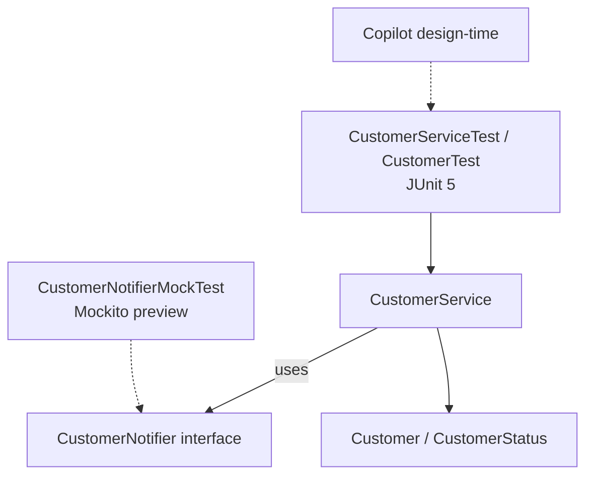

# Lab 11: GitHub Copilot for Testing and Refactoring — Northstar CRM

> **Participants:** Module sequence is in [`../README.md`](../README.md). **Do not start this guide until** you have finished Module 11 [pre-lab exercises 1–6](../exercises/EXERCISES-INDEX.md) (Pass — check yourself, do not write it down; order **1 → 2 → 3 → 4 → 5 → 6**). Then open **one** OS how-to ([Windows](LAB-11-WINDOWS.md) · [macOS](LAB-11-MACOS.md)). In class, prefer the **45-minute timed path** with [`starter/`](starter/README.md); the **full path** is every Step below (homework / extended). This repo has no answer keys — complete the TODOs yourself. See [Which file do I open?](../../../_PARTICIPANT-FILE-GUIDE.md).

## Activity card

| | |
| --- | --- |
| **Objective** | Add real JUnit tests, extract `CustomerNotifier`, keep AI review notes |
| **Skills practiced** | AAA tests, reject trivial asserts, refactor + Mockito verify sample, Copilot notes |
| **Expected outcome** | `mvn clean test` → **Tests run: 8**, Failures: 0; notes `lab11-001`–`004` |
| **Estimated time** | Timed path ~45 min · Full path 3–4 hours |
| **Prerequisites** | Lab 0 · Lab 10 domain · Exercises 1–6 Pass · JDK 21 · Maven 3.9+ · Copilot (or alternate) |
| **Expected files** | `examples/lab11-crm/` + `copilot-notes/ai-test-refactor-notes.md` |
| **Validation checkpoints** | Starter smoke test · GUIDE Implementation Checkpoints |

**Module:** 11 — GitHub Copilot for Testing and Refactoring  
**Duration:** ~45 minutes (timed path with starter) · Full path: 3–4 Hours

**Primary IDE:** IntelliJ IDEA Community Edition · **Optional IDE:** VS Code

| OS | How-to for this lab |
| -- | ------------------- |
| Windows | [LAB-11-WINDOWS.md](LAB-11-WINDOWS.md) |
| macOS | [LAB-11-MACOS.md](LAB-11-MACOS.md) |

> **Incremental build:** AAA/assert/notifier notes → Lab 11 tests + extract + review log (bridge to Labs 17–18).

> **Classroom pacing:** [`../PACING.md`](../PACING.md) (Checkpoints A–E).

> **Hygiene:** Reject `assertTrue(true)`, JUnit 4 syntax, and `@SpringBootTest`. Keep no-arg `CustomerService()` with no-op notifier after extract.

**Verified participant layout (Windows IntelliJ + PowerShell; Temurin JDK 21.0.11; Maven 3.9.9):**

| Role | Path |
| ---- | ---- |
| IntelliJ opens | `%USERPROFILE%\java-bootcamp` (SDK / language level **21**) |
| Prerequisite | `examples\lab10-crm\` with Lab 10 domain/service compiling |
| This lab project | `examples\lab11-crm\` (`Copy-Item -Recurse lab10-crm lab11-crm`) |
| Test deps | JUnit Jupiter **5.11.4** + Mockito **5.11.0** (`test` scope); Surefire **3.5.2** |
| Tests | `CustomerTest` (2) · `CustomerServiceTest` (5) · `CustomerNotifierMockTest` (1) |
| Notes | `copilot-notes\ai-test-refactor-notes.md` (`lab11-001`–`lab11-004`) |
| Full suite | `mvn -q clean test` → **Tests run: 8**, Failures: 0 · **BUILD SUCCESS** |
| Main harness | Still prints `CUS-1001` / `CUS-1002` activation flow after refactor |

**If it fails (Windows PowerShell):** Keep a single `junit-jupiter` entry (Lab 9 already had one — add Mockito beside it; do not duplicate JUnit). First Mockito run may print Byte Buddy / dynamic-agent warnings on JDK 21 — harmless if tests are green. Remove Lab 9 `PlaceholderTest` (`assertTrue(true)`) so Surefire counts real CRM tests. After extracting `CustomerNotifier`, keep the no-arg `CustomerService()` constructor with a no-op notifier so existing tests/`Main` keep compiling.

---

## 45-minute timed path (use starter)

In class, use the starter templates so the **core** objectives fit **~45 minutes**. The full Steps below remain for homework / extended depth.

1. Open [`starter/README.md`](starter/README.md).
2. Copy `starter/` into your `java-bootcamp/examples/lab11-crm/` target (see starter README).
3. Fill every `// TODO` — do **not** wait on a perfect prior lab; the starter includes a baseline.
4. Run the starter smoke test. Commit your work to your GitHub repo (no screenshots).
5. Check timed-path Pass criteria in the starter README yourself (do not write the marks down). Continue remaining GUIDE steps as homework if needed.

| Path | Time | Scope |
| ---- | ---- | ----- |
| **Timed (default)** | ~45 min | Starter TODOs + smoke test |
| **Full (extended)** | see Duration | Every Step in this GUIDE |


## What you'll complete (practice only)

Labs and exercises are **practice only**. Nothing is submitted or graded. Do not take screenshots. Check Pass/Fail yourself — do not write those marks anywhere. Commit your work to your private `java-bootcamp` GitHub repo.

Keep this checklist visible while you work.

| # | Deliverable |
| - | ----------- |
| 1 | `CustomerTest`, `CustomerServiceTest`, `CustomerNotifierMockTest` |
| 2 | `CustomerNotifier` + refactored `CustomerService` (`validateCustomerId`, notifier hook) |
| 3 | `copilot-notes/ai-test-refactor-notes.md` entries `lab11-001`–`lab11-004` |
| 4 | Failure-experiment evidence and green `mvn clean test` output |
| 5 | No secrets or `target/` committed |

**Commit to your GitHub repo:** the items in the table above (sources + evidence + short notes).

**Do not commit:** `target/`, `node_modules/`, secrets, heap dumps, or a copied answer keys.

## Lab Overview

This Module 11 lab continues the **Northstar Customer Service Platform** from `lab10-crm/` into `lab11-crm/`. You still write **plain Java with Maven — no Spring Framework** anywhere in Week 2. What’s new is using GitHub Copilot for two jobs: **generating a first exploratory test class** for Lab 10’s domain/service code, and **generating refactoring suggestions** that clean that code up.

## Learning Objectives

After completing this lab, you will be able to:

* Use Copilot Chat to generate a first JUnit 5 test class for a plain Java entity and service (preview of Labs 17–18)
* Distinguish a meaningful assertion from a “false confidence” assertion Copilot sometimes generates
* Extract a collaborator interface and write one Mockito-based test against it
* Use Copilot to detect and fix a code smell (duplicated validation / long method) in `CustomerService`
* Review AI-generated tests and refactors against a coverage-and-correctness checklist before accepting them

## Business Scenario

The Lab 10 review log caught one dangerous Copilot habit (phantom JPA annotations), but the team still lacks an automated safety net around `CustomerService`, and duplicated validation is creeping in. Before Week 2 piles on DTOs (Lab 14) and more behavior, your lead wants:

1. A first, lightweight test class—not full coverage, just proof the core rules hold—as a preview of formal testing labs.
2. A cleaned-up `CustomerService` with duplicated validation extracted, plus a useful collaborator interface unit-tested with a mock.

Use these examples consistently:

| ID | Name | Status | Email |
| -- | ---- | ------ | ----- |
| `CUS-1001` | Amina Khan | `ACTIVE` | `amina.khan@example.com` |
| `CUS-1002` | Ravi Singh | `PROSPECT` | `ravi.singh@example.com` |

* Review-log entry IDs: `lab11-001`, `lab11-002`, `lab11-003`, `lab11-004`
* Do not invent real SSNs, passwords, or production emails in tests or Chat

**Security note.** Never paste secrets into prompts or commit real PII.

---

## Architecture Context
### NOW (this lab)



## Prerequisites

Prior labs: [Lab 10](../../module-10/lab10/LAB-10-GUIDE.md).

Confirm (Lab 0 tools assumed):

* `Customer`, `CustomerStatus`, and `CustomerService` from **Lab 10** (`lab10-crm/`), including `copilot-notes/ai-review-notes.md`
* JDK 21 + Maven; Copilot signed in (VS Code or IntelliJ), same as Lab 10
* No secrets committed to Git

> This lab adds/confirm `junit-jupiter` and Mockito as **test-scope** Maven dependencies. Treat coverage as a guided preview—Labs 17–18 go deep. Do not chase 100% coverage here.

### Pre-flight

```bash
java -version
mvn -version
```

## Worked example (read before you code)

Study this pattern once before Step 1. Your job is to apply the same idea in the Steps — do not skip ahead to a full solution.

```java
package com.northstar.crm.service;

import com.northstar.crm.entity.Customer;
import com.northstar.crm.entity.CustomerStatus;
import org.junit.jupiter.api.BeforeEach;
import org.junit.jupiter.api.Test;

import java.time.LocalDateTime;

import static org.junit.jupiter.api.Assertions.*;

class CustomerServiceTest {

    private CustomerService service;

    @BeforeEach
    void setUp() {
        service = new CustomerService();
    }

    @Test
    void addCustomerStoresNewCustomer() {
        Customer amina = new Customer("CUS-1001", "Amina Khan", "amina.khan@example.com",
                "555-0101", CustomerStatus.ACTIVE, LocalDateTime.now());
        service.addCustomer(amina);
        assertEquals(1, service.listAll().size());
        assertEquals("CUS-1001", service.listAll().get(0).getCustomerId());
    }

    @Test
    void addCustomerRejectsDuplicateId() {
        Customer amina = new Customer("CUS-1001", "Amina Khan", "amina.khan@example.com",
                "555-0101", CustomerStatus.ACTIVE, LocalDateTime.now());
        service.addCustomer(amina);
        Customer duplicate = new Customer("CUS-1001", "Someone Else", "x@example.com",
                "555-0000", CustomerStatus.PROSPECT, LocalDateTime.now());
        assertThrows(IllegalStateException.class, () -> service.addCustomer(duplicate));
    }

    @Test
// ... truncated — see full sample in the Steps
```

**What to notice:** Match names, IDs, and failure behavior from the scenario — instructors check these.

---

## Implementation Steps

Complete each step in order. Commands assume `~/java-bootcamp/examples/lab11-crm` (Windows: `%USERPROFILE%\java-bootcamp\examples\lab11-crm`) unless noted. Prefer IntelliJ for Maven (optional VS Code); use Copilot in the IDE.

---

### Step 1 — Branch the project and add test-scope dependencies

**Why:** Isolate Lab 11 work from Lab 10. Test-scope dependencies belong on the test classpath only—same Maven lesson as Lab 9 scopes.

**Do this:**

```bash
cd ~/java-bootcamp/examples
cp -r lab10-crm lab11-crm
cd lab11-crm
```

Ensure `pom.xml` includes (merge with existing Lab 9 deps; do not remove Spring placeholders if present—keep them test-agnostic):

```xml
<dependencies>
    <!-- existing compile deps from Lab 9, if any -->

    <dependency>
        <groupId>org.junit.jupiter</groupId>
        <artifactId>junit-jupiter</artifactId>
        <version>5.10.2</version>
        <scope>test</scope>
    </dependency>
    <dependency>
        <groupId>org.mockito</groupId>
        <artifactId>mockito-core</artifactId>
        <version>5.11.0</version>
        <scope>test</scope>
    </dependency>
    <dependency>
        <groupId>org.mockito</groupId>
        <artifactId>mockito-junit-jupiter</artifactId>
        <version>5.11.0</version>
        <scope>test</scope>
    </dependency>
</dependencies>

<build>
  <plugins>
    <plugin>
      <groupId>org.apache.maven.plugins</groupId>
      <artifactId>maven-surefire-plugin</artifactId>
      <version>3.2.5</version>
    </plugin>
    <!-- keep compiler/jar plugins from Lab 9 -->
  </plugins>
</build>
```

```bash
mvn -q dependency:resolve
mvn -q dependency:tree -Dincludes=org.junit.jupiter,org.mockito
```

**Expected result:** `BUILD SUCCESS`; JUnit/Mockito resolve at **test** scope only.

**If it fails:** Network/proxy for Central → SETUP. Duplicate JUnit versions from Lab 9 → keep one consistent `junit-jupiter` entry with `test` scope. Wrong folder → confirm `lab11-crm`.

---

### Step 2 — Generate a first JUnit test for `Customer`

**Why:** Entity identity (`equals` on `customerId`) is a common bug source. Prove it with assertions that can fail.

**Do this:** Prompt Copilot Chat with specific behavior (not “write tests”):

```text
Write a JUnit 5 test class CustomerTest in com.northstar.crm.entity.
Test 1: two Customer instances with the same customerId but different
other fields must be equal() (identity is based on customerId only).
Test 2: toString() output must contain the customerId.
Use assertEquals/assertTrue from org.junit.jupiter.api.Assertions.
```

Create `src/test/java/com/northstar/crm/entity/CustomerTest.java` matching this shape (edit Copilot output as needed):

```java
package com.northstar.crm.entity;

import org.junit.jupiter.api.Test;

import java.time.LocalDateTime;

import static org.junit.jupiter.api.Assertions.assertEquals;
import static org.junit.jupiter.api.Assertions.assertTrue;

class CustomerTest {

    @Test
    void equalsIsBasedOnCustomerIdOnly() {
        Customer a = new Customer("CUS-1001", "Amina Khan", "amina.khan@example.com",
                "555-0101", CustomerStatus.ACTIVE, LocalDateTime.now());
        Customer b = new Customer("CUS-1001", "Different Name", "other@example.com",
                "555-0199", CustomerStatus.CLOSED, LocalDateTime.now());

        assertEquals(a, b, "Customers with the same customerId must be considered equal");
    }

    @Test
    void toStringIncludesCustomerId() {
        Customer ravi = new Customer("CUS-1002", "Ravi Singh", "ravi.singh@example.com",
                "555-0102", CustomerStatus.PROSPECT, LocalDateTime.now());

        assertTrue(ravi.toString().contains("CUS-1002"));
    }
}
```

```bash
mvn -q test -Dtest=CustomerTest
```

**Expected result:** `Tests run: 2, Failures: 0, Errors: 0, Skipped: 0`

**If it fails:** Reject JUnit 4 (`org.junit.Test`, `@RunWith`). Fix constructor argument order to match Lab 10 `Customer`. Ensure path is `src/test/java/...`.

**Common compile error — `String cannot be converted to Long`:** Copilot often invents a JPA-style `Long id` (or types `customerId` as `Long`). Lab 10/11 identity is a **`String customerId`** like `"CUS-1001"` — not a numeric `Long`. Open `Customer.java` and confirm:

- field is `private String customerId;` (no `Long id`)
- constructor first arg is `String customerId`
- getters/setters use `String`
- no `@Entity` / `@Id` / `jakarta.persistence` imports

Then align `CustomerTest` with that constructor (pass `"CUS-1001"`, not `1L`). Re-run `mvn -q clean test -Dtest=CustomerTest`.

---

### Step 3 — Generate tests for `CustomerService`

**Why:** Core business rules (add, duplicate, update, unknown ID) need a safety net before refactoring.

**Do this:** Prompt:

```text
Write a JUnit 5 test class CustomerServiceTest for com.northstar.crm.service.CustomerService.
Use @BeforeEach to create a fresh CustomerService. Cover: addCustomer stores a
new customer; addCustomer with a duplicate customerId throws IllegalStateException;
updateStatus changes an existing customer's status; updateStatus on an unknown
customerId throws IllegalArgumentException. Use CUS-1001/CUS-1002 style test data.
```

Reference shape:

```java
package com.northstar.crm.service;

import com.northstar.crm.entity.Customer;
import com.northstar.crm.entity.CustomerStatus;
import org.junit.jupiter.api.BeforeEach;
import org.junit.jupiter.api.Test;

import java.time.LocalDateTime;

import static org.junit.jupiter.api.Assertions.*;

class CustomerServiceTest {

    private CustomerService service;

    @BeforeEach
    void setUp() {
        service = new CustomerService();
    }

    @Test
    void addCustomerStoresNewCustomer() {
        Customer amina = new Customer("CUS-1001", "Amina Khan", "amina.khan@example.com",
                "555-0101", CustomerStatus.ACTIVE, LocalDateTime.now());
        service.addCustomer(amina);
        assertEquals(1, service.listAll().size());
        assertEquals("CUS-1001", service.listAll().get(0).getCustomerId());
    }

    @Test
    void addCustomerRejectsDuplicateId() {
        Customer amina = new Customer("CUS-1001", "Amina Khan", "amina.khan@example.com",
                "555-0101", CustomerStatus.ACTIVE, LocalDateTime.now());
        service.addCustomer(amina);
        Customer duplicate = new Customer("CUS-1001", "Someone Else", "x@example.com",
                "555-0000", CustomerStatus.PROSPECT, LocalDateTime.now());
        assertThrows(IllegalStateException.class, () -> service.addCustomer(duplicate));
    }

    @Test
    void updateStatusChangesExistingCustomer() {
        Customer ravi = new Customer("CUS-1002", "Ravi Singh", "ravi.singh@example.com",
                "555-0102", CustomerStatus.PROSPECT, LocalDateTime.now());
        service.addCustomer(ravi);
        service.updateStatus("CUS-1002", CustomerStatus.ACTIVE);
        assertEquals(CustomerStatus.ACTIVE,
                service.findByCustomerId("CUS-1002").orElseThrow().getStatus());
    }

    @Test
    void updateStatusThrowsForUnknownCustomer() {
        assertThrows(IllegalArgumentException.class,
                () -> service.updateStatus("CUS-9999", CustomerStatus.ACTIVE));
    }
}
```

```bash
mvn -q test -Dtest=CustomerServiceTest
```

**Expected result:** `Tests run: 4, Failures: 0` for this class so far. Timed path still needs `findByStatusReturnsOnlyMatchingCustomers` (5th service test) before the full suite hits **8**.

**If it fails:** After Step 5’s constructor change, no-arg constructor must still work (no-op notifier). Re-run full suite after refactors.

---

### Step 4 — Reject false-confidence assertions

**Why:** Copilot often pads suites with tests that cannot fail. Catching them is a core Lab 11 skill.

**Do this:** Ask Copilot Chat, without extra guidance, to “add one more test to `CustomerServiceTest`.” It may produce:

```java
import static org.junit.jupiter.api.Assertions.assertNotNull;
import org.junit.jupiter.api.Test;

@Test
void serviceIsNotNull() {
    assertNotNull(service);
}
```

That never fails while `@BeforeEach` runs—proves nothing about business behavior.

Create/update `copilot-notes/ai-test-refactor-notes.md` entry `lab11-001`: paste the weak test, explain why it is false confidence, and delete it **or** replace it with a real assertion (e.g. `findByStatus` filter for `PROSPECT`).

**Expected result:** `lab11-001` shows rejected weak test + replacement/deletion + one-sentence justification.

**If it fails:** If Copilot produces a surprisingly good test, still invent/demonstrate a trivial one yourself and reject it—instructors need evidence you know the pattern.

---

### Step 5 — Extract `CustomerNotifier` and mock it

**Why:** Collaboration via an interface enables verifying side effects without real email/Kafka. Preview of test isolation (Labs 17–18).

**Do this:** Prompt:

```text
Extract a CustomerNotifier interface in com.northstar.crm.service with one
method notifyStatusChange(String customerId, CustomerStatus oldStatus,
CustomerStatus newStatus). Give CustomerService a constructor that accepts a
CustomerNotifier, and call it from updateStatus after the status changes.
Keep the existing no-arg constructor working with a no-op notifier.
Also extract duplicated blank customerId validation into validateCustomerId().
```

```java
package com.northstar.crm.service;

import com.northstar.crm.entity.CustomerStatus;

public interface CustomerNotifier {
    void notifyStatusChange(String customerId, CustomerStatus oldStatus, CustomerStatus newStatus);
}
```

Refactor `CustomerService` toward:

```java
package com.northstar.crm.service;

import com.northstar.crm.entity.Customer;
import com.northstar.crm.entity.CustomerStatus;

import java.util.ArrayList;
import java.util.List;
import java.util.Optional;

public class CustomerService {

    private final List<Customer> customers = new ArrayList<>();
    private final CustomerNotifier notifier;

    public CustomerService() {
        this((customerId, oldStatus, newStatus) -> { /* no-op */ });
    }

    public CustomerService(CustomerNotifier notifier) {
        this.notifier = notifier;
    }

    public Customer addCustomer(Customer customer) {
        validateCustomerId(customer.getCustomerId());
        if (findByCustomerId(customer.getCustomerId()).isPresent()) {
            throw new IllegalStateException("Customer already exists: " + customer.getCustomerId());
        }
        customers.add(customer);
        return customer;
    }

    public Optional<Customer> findByCustomerId(String customerId) {
        return customers.stream()
                .filter(c -> c.getCustomerId().equals(customerId))
                .findFirst();
    }

    public List<Customer> findByStatus(CustomerStatus status) {
        return customers.stream()
                .filter(c -> c.getStatus() == status)
                .toList();
    }

    public Customer updateStatus(String customerId, CustomerStatus newStatus) {
        validateCustomerId(customerId);
        Customer customer = findByCustomerId(customerId)
                .orElseThrow(() -> new IllegalArgumentException("No such customer: " + customerId));
        CustomerStatus oldStatus = customer.getStatus();
        customer.setStatus(newStatus);
        notifier.notifyStatusChange(customerId, oldStatus, newStatus);
        return customer;
    }

    public List<Customer> listAll() {
        return List.copyOf(customers);
    }

    private void validateCustomerId(String customerId) {
        if (customerId == null || customerId.isBlank()) {
            throw new IllegalArgumentException("customerId must not be blank");
        }
    }
}
```

Mockito preview test:

```java
package com.northstar.crm.service;

import com.northstar.crm.entity.Customer;
import com.northstar.crm.entity.CustomerStatus;
import org.junit.jupiter.api.Test;
import org.junit.jupiter.api.extension.ExtendWith;
import org.mockito.Mock;
import org.mockito.junit.jupiter.MockitoExtension;

import java.time.LocalDateTime;

import static org.mockito.Mockito.verify;

@ExtendWith(MockitoExtension.class)
class CustomerNotifierMockTest {

    @Mock
    private CustomerNotifier notifier;

    @Test
    void updateStatusInvokesNotifierWithOldAndNewStatus() {
        CustomerService service = new CustomerService(notifier);
        Customer ravi = new Customer("CUS-1002", "Ravi Singh", "ravi.singh@example.com",
                "555-0102", CustomerStatus.PROSPECT, LocalDateTime.now());
        service.addCustomer(ravi);

        service.updateStatus("CUS-1002", CustomerStatus.ACTIVE);

        verify(notifier).notifyStatusChange("CUS-1002", CustomerStatus.PROSPECT, CustomerStatus.ACTIVE);
    }
}
```

```bash
mvn -q test -Dtest=CustomerNotifierMockTest
```

**Expected result:** 1 test green; Mockito verifies `PROSPECT → ACTIVE` once.

**If it fails:** Reject JPA/`@Autowired` guesses. Missing `mockito-junit-jupiter` → Step 1. If Copilot invents `notifyCreated`, reject—stick to declared interface methods.

---

### Step 6 — Confirm code-smell fix with Copilot review notes

**Why:** Extracting `validateCustomerId` removes duplicated blank-ID checks. Document the smell → refactor → proving tests.

**Do this:** Ask Copilot Chat:

```text
Review CustomerService for code smells: duplicated logic, long methods,
unclear names. Suggest one specific refactor.
```

Confirm blank-ID validation exists in **exactly one** place: `validateCustomerId()`. Record `lab11-002`: smell name, refactor applied, tests proving behavior unchanged (`CustomerServiceTest`, and mock test).

```bash
mvn -q test -Dtest=CustomerServiceTest,CustomerNotifierMockTest
```

**Expected result:** 5 tests green; notes cite duplication removal.

**If it fails:** If tests fail after rename, restore from git and re-apply extract carefully. Run tests **before and after**.

---

### Step 7 — Review coverage gaps

**Why:** Knowing what you do *not* cover prevents fake confidence from “we have tests.”

**Do this:** List every public method on `Customer` and `CustomerService`; mark covered / not. Ask Copilot: “What CustomerService behavior is not covered by CustomerServiceTest and CustomerNotifierMockTest?” Record answer + your assessment as `lab11-003`. At minimum note `findByStatus` / `listAll` may be only indirectly covered—decide in writing if that gap is acceptable **now**.

**Expected result:** `lab11-003` method matrix + gap decisions.

**If it fails:** Empty “100% covered” claims without listing methods → redo honestly.

---

### Step 8 — Acceptance guidelines and full suite

**Why:** Turn review habits into a reusable team checklist before Week 2 continues.

**Do this:** Add `lab11-004`:

```text
Acceptance guidelines for AI-generated tests and refactors:
1. Every assertion must be able to fail — if I can't describe an input that
   breaks it, it isn't a real test.
2. Every refactor must be backed by a passing test suite run before and after.
3. No accepted suggestion may introduce a dependency not already in pom.xml.
4. I can explain, without re-reading Copilot's explanation, why the code
   is correct.
5. Coverage gaps are documented, not silently ignored.
```

```bash
mvn -q clean test
```

**Expected result:** **Tests run: 8** (`CustomerTest` 2 + `CustomerServiceTest` 5 including `findByStatusReturnsOnlyMatchingCustomers` + mock 1); `BUILD SUCCESS`; checklist in notes. Lab 9 `PlaceholderTest` must be removed so it does not inflate the suite.

**Verified (Windows):** Timed starter + filled TODOs → **Tests run: 8** (2 + 5 + 1). Document that count in notes.

**If it fails:** Count mismatches if you replaced the weak test with an extra real one—document actual count. Stale classes → always `clean test`.

---

### Step 9 — Failure experiments + evidence

**Why:** Graders need to see you can read a Mockito verification failure and refuse invented APIs.

**Do this:** Complete Failure Experiments. Commit your work to your GitHub repo. Do not take screenshots. Confirm `Main` still runs if present:

```bash
mvn -q -DskipTests compile
java -cp target/classes com.northstar.crm.Main
git status
```

**Expected result:** Experiments documented; suite green after restores; no secrets staged.

**If it fails:** See Troubleshooting. Revert bad refactors with git; do not “fix” by deleting the mock test.

---

## Implementation Checkpoints

### Checkpoint A — Project + test deps

_Check **Pass** or **Fail** yourself. Do not write these marks anywhere — nothing is submitted or graded. Commit your work to your GitHub repo._

| # | Confirm | Self-check |
| - | ------- | ---------- |
| 1 | `lab11-crm` copied from Lab 10 under `examples/` | Pass / Fail |
| 2 | JUnit 5 + Mockito on **test** scope; Surefire present | Pass / Fail |
| 3 | Copilot still Ready | Pass / Fail |

### Checkpoint B — Core tests green

_Check **Pass** or **Fail** yourself. Do not write these marks anywhere — nothing is submitted or graded. Commit your work to your GitHub repo._

| # | Confirm | Self-check |
| - | ------- | ---------- |
| 1 | `CustomerTest` (2) and `CustomerServiceTest` (4) pass | Pass / Fail |
| 2 | Sample IDs `CUS-1001` / `CUS-1002` used in tests | Pass / Fail |
| 3 | No JUnit 4 imports | Pass / Fail |

### Checkpoint C — Refactor + mock

_Check **Pass** or **Fail** yourself. Do not write these marks anywhere — nothing is submitted or graded. Commit your work to your GitHub repo._

| # | Confirm | Self-check |
| - | ------- | ---------- |
| 1 | `CustomerNotifier` extracted and called from `updateStatus` | Pass / Fail |
| 2 | No-arg `CustomerService()` still works (no-op notifier) | Pass / Fail |
| 3 | `CustomerNotifierMockTest` verifies PROSPECT → ACTIVE | Pass / Fail |
| 4 | `validateCustomerId` is the single blank-ID check | Pass / Fail |

### Checkpoint D — Notes + guidelines + experiments

_Check **Pass** or **Fail** yourself. Do not write these marks anywhere — nothing is submitted or graded. Commit your work to your GitHub repo._

| # | Confirm | Self-check |
| - | ------- | ---------- |
| 1 | Entries `lab11-001`–`lab11-004` complete | Pass / Fail |
| 2 | False-confidence rejection documented | Pass / Fail |
| 3 | Coverage gaps documented; acceptance checklist present | Pass / Fail |
| 4 | Failure experiments recorded; `mvn clean test` green | Pass / Fail |

---

## Reference Commands, Configuration, and Code

### Test runs

```bash
cd ~/java-bootcamp/examples/lab11-crm
mvn -q test
mvn -q test -Dtest=CustomerServiceTest
mvn -q test -Dtest=CustomerNotifierMockTest
mvn -q clean test
git status
```

### Test-scope deps (minimum)

```xml
<dependency>
  <groupId>org.junit.jupiter</groupId>
  <artifactId>junit-jupiter</artifactId>
  <version>5.10.2</version>
  <scope>test</scope>
</dependency>
<dependency>
  <groupId>org.mockito</groupId>
  <artifactId>mockito-junit-jupiter</artifactId>
  <version>5.11.0</version>
  <scope>test</scope>
</dependency>
```

## Failure Experiments

| # | Experiment | Observe | Restore |
| - | ---------- | ------- | ------- |
| 1 | Ask for “one more test” with no constraints | Trivial assertion that cannot fail | Reject; document in `lab11-001` |
| 2 | Refactor `updateStatus` to skip `notifier.notifyStatusChange` | Mock test fails on `verify` | Revert; suite green |
| 3 | Ask Copilot for Mockito test of `notifyCreated(Customer)` (not on interface) | Compile failure / invented API | Reject; stick to real methods |
| 4 | Run `mvn -q test` twice unchanged | Identical deterministic results | Note no flake |

---

## Troubleshooting

| Symptom | Likely cause | Fix |
| ------- | ------------ | --- |
| Tests not discovered | Wrong path / naming | `src/test/java`; class name `*Test` |
| JUnit 4 syntax from Copilot | Underspecified prompt | Reject; insist JUnit 5 / Jupiter |
| Mockito extension errors | Missing dependency | Add `mockito-junit-jupiter` test scope |
| `UnnecessaryStubbingException` | Unused `when(...)` | Remove stubs; prefer `verify` |
| Suite fails only after refactor | Skipped notifier / signature change | `clean test`; restore then re-apply |
| CustomerServiceTest breaks after ctor change | Lost no-arg ctor | Restore no-op notifier ctor |
| Suggestions add Spring Test | Pattern match | Reject; plain Java + JUnit only |
| `assertTrue(true)` still in suite | Accepted trivial assert | Replace with status/id behavior asserts (Ex 3) |

## Security and Production Review

Optional — jot brief notes in your README if useful for your progress check (not a separate essay):

1. Which test data is safe to commit, and why (`CUS-1001` / `CUS-1002`)?
2. Where is human review enforced before AI tests/refactors merge?
3. What risk does an always-green trivial test create?

---


## Cleanup

```bash
cd ~/java-bootcamp/examples/lab11-crm
mvn -q clean
git status
```

No containers started. Keep notes and sources. **Keep `lab11-crm`** for Lab 12+ and the later formal testing labs.


## Reflection Questions

Write **1–3 sentence** answers (not essays):

1. (Forward look) When Spring arrives, what about today’s notifier mock pattern stays valuable?
2. What made a test “meaningful” vs “false confidence” here?
3. How did extracting `CustomerNotifier` change testability?

---


