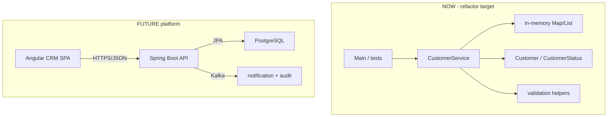

# Lab 12: Coding Standards and Refactoring — Northstar CRM Cleanup

> **Participants:** Module sequence is in [`../README.md`](../README.md). **Do not start this guide until** you have finished Module 12 [pre-lab exercises 1–6](../exercises/EXERCISES-INDEX.md) (Pass — check yourself, do not write it down; order **1 → 2 → 3 → 4 → 5 → 6**). Then open **one** OS how-to ([Windows](LAB-12-WINDOWS.md) · [macOS](LAB-12-MACOS.md)). In class, prefer the **45-minute timed path** with [`starter/`](starter/README.md); the **full path** is every Step below (homework / extended). This repo has no answer keys — complete the TODOs yourself. See [Which file do I open?](../../../_PARTICIPANT-FILE-GUIDE.md).

## Activity card

| | |
| --- | --- |
| **Objective** | Catalog smells and refactor messy `CustomerService` to a clean target API |
| **Skills practiced** | Smell docs, naming, equals/Map lookups, before/after evidence, tests green |
| **Expected outcome** | `mvn -B clean test` → **Tests run: 8**; `docs/smells.md` + before-after notes |
| **Estimated time** | Timed path ~45 min · Full path 3–4 hours |
| **Prerequisites** | Lab 0 · Lab 11 habits · Exercises 1–6 Pass · JDK 21 · Maven 3.9+ |
| **Expected files** | `examples/lab12-crm/` + `docs/smells.md`, `before-after.md`, standards check |
| **Validation checkpoints** | Starter smoke test · GUIDE Implementation Checkpoints |

**Module:** 12 — Java Coding Standards and Best Practices  
**Duration:** ~45 minutes (timed path with starter) · Full path: 3–4 Hours

**Primary IDE:** IntelliJ IDEA Community Edition · **Optional IDE:** VS Code

| OS | How-to for this lab |
| -- | ------------------- |
| Windows | [LAB-12-WINDOWS.md](LAB-12-WINDOWS.md) |
| macOS | [LAB-12-MACOS.md](LAB-12-MACOS.md) |

> **Incremental build:** API sketch + smell bingo + equals notes → Lab 12 freeze/refactor/evidence docs.

> **Classroom pacing:** [`../PACING.md`](../PACING.md) (Checkpoints A–D).

> **Hygiene:** Freeze baseline as `CustomerService.before.java.txt`. Prefer `Map` + `equals` for ids. No Spring Boot / REST hosting.

**Verified participant layout (Windows IntelliJ + PowerShell; Temurin JDK 21.0.11; Maven 3.9.9):**

| Role | Path |
| ---- | ---- |
| IntelliJ opens | `%USERPROFILE%\java-bootcamp` (SDK / language level **21**) |
| Prerequisite | Prefer `examples\lab11-crm\` (entities + JUnit/Mockito already present) |
| This lab project | `examples\lab12-crm\` (`Copy-Item -Recurse lab11-crm lab12-crm`) |
| Frozen mess | `CustomerService.before.java.txt` (~62 lines) |
| Refactored service | `createCustomer` / `getCustomer` / `updateStatus` + validation helpers (~103 lines) |
| Evidence docs | `docs\smells.md`, `before-after.md`, `ai-review-notes.md`, `CODING-STANDARDS-check.md` |
| Tests | `CustomerTest` (2) + `CustomerServiceTest` (6) — Lab 11 notifier mock removed for new API |
| Full suite | `mvn -B clean test` / `mvn -B verify` → **Tests run: 8**, Failures: 0 · **BUILD SUCCESS** |
| Main demo | create/get/update + duplicate/unknown with `correlationId=lab-request-001` |

**If it fails (Windows PowerShell):** Freeze baseline with a `.txt` suffix so Maven does not compile two `CustomerService` classes. After switching to the target API, update or remove Lab 11 tests that call `addCustomer` / `CustomerNotifier`. Prefer `Map` keyed by ID so `getCustomer(new String("CUS-1001"))` works (old `==` did not).

---

## 45-minute timed path (use starter)

In class, use the starter templates so the **core** objectives fit **~45 minutes**. The full Steps below remain for homework / extended depth.

1. Open [`starter/README.md`](starter/README.md).
2. Copy `starter/` into your `java-bootcamp/examples/lab12-crm/` target (see starter README).
3. Fill every `// TODO` — do **not** wait on a perfect prior lab; the starter includes a baseline.
4. Run the starter smoke test. Commit your work to your GitHub repo (no screenshots).
5. Check timed-path Pass criteria in the starter README yourself (do not write the marks down). Continue remaining GUIDE steps as homework if needed.

| Path | Time | Scope |
| ---- | ---- | ----- |
| **Timed (default)** | ~45 min | Starter TODOs + smoke test |
| **Full (extended)** | see Duration | Every Step in this GUIDE |


## What you'll complete (practice only)

Labs and exercises are **practice only**. Nothing is submitted or graded. Do not take screenshots. Check Pass/Fail yourself — do not write those marks anywhere. Commit your work to your private `java-bootcamp` GitHub repo.

Keep this checklist visible while you work.

| # | Deliverable |
| - | ----------- |
| 1 | Refactored `CustomerService` with clear methods and typed storage |
| 2 | Frozen before snapshot and `docs/smells.md` + `docs/before-after.md` |
| 3 | Passing `CustomerServiceTest` (or equivalent) |
| 4 | AI review notes or explicit manual-review substitute |
| 5 | Standards checklist + controlled-failure evidence |
| 6 | Architecture note: in-memory NOW vs Angular/Kafka/PostgreSQL LATER |
| 7 | README run/cleanup + short SOLID applied/deferred decisions |
| 8 | No secrets or generated dependency directories committed |

**Commit to your GitHub repo:** the items in the table above (sources + evidence + short notes).

**Do not commit:** `target/`, `node_modules/`, secrets, heap dumps, or a copied answer keys.

## Lab Overview

This Module 12 lab improves a **deliberately poor** CRM `CustomerService` using Northstar coding standards: smell detection, renaming, method extraction, and SOLID-inspired cleanup. Optional GitHub Copilot suggestions are welcome **only** with written human review—the same discipline Labs 10–11 introduced.

## Learning Objectives

After completing this lab, you will be able to:

* Identify common code smells in a CRM service (long method, unclear names, duplicated validation, stringly types, `==` bugs)
* Refactor toward single-responsibility methods and clearer naming
* Apply coding standards consistent with Lab 8’s `CODING-STANDARDS.md`
* Improve readability without changing documented business behavior (create / get / update status / reject blanks & duplicates)
* Use optional Copilot assists with mandatory human review notes

## Business Scenario

A previous sprint left `CustomerService` in a state no senior engineer would merge: a long method named `doStuff`, stringly-typed statuses, duplicated null checks, `System.out` “logging” mixed with rules, and a magic `"UPDATE"` branch. Support already struggles to explain why Amina Khan (`CUS-1001`) sometimes cannot be looked up after a failed create. Your lead freezes new features until the class is refactored against Northstar standards.

You keep intended behavior: create customer, get by ID, update status (`PROSPECT` → `ACTIVE`, etc.), reject blanks/duplicates. Correlation ID `lab-request-001` should appear in a simple log/note helper after refactor—not as print spaghetti.

Use these examples consistently:

| ID | Name | Status | Email |
| -- | ---- | ------ | ----- |
| `CUS-1001` | Amina Khan | `ACTIVE` | `amina.khan@example.com` |
| `CUS-1002` | Ravi Singh | `PROSPECT` | `ravi.singh@example.com` |

* Correlation ID: `lab-request-001`
* Review entries: `lab12-001`, `lab12-002`, …

**Security note for evidence.** Keep sample emails only. No GitHub credentialss, tokens, or real PII in logs or docs.

---

## Architecture Context
### NOW vs LATER

**NOW:** Plain Java Maven CRM service with in-memory storage. Refactor inside the service (and small helpers). No Spring MVC, no JPA, no Kafka.

**LATER:** Spring Boot API, PostgreSQL, Angular, Kafka.




### Architecture NOW vs LATER (table)

| Aspect | Lab 12 (NOW) | Later CRM labs |
| ------ | ------------ | -------------- |
| Focus | Smell removal + readable API | Contracts, persistence, Spring |
| Storage | In-memory | JPA/PostgreSQL |
| Errors | Exceptions (not null) | Problem details / HTTP mapping |
| Logging | Correlation in messages/notes | Structured observability |

**Lab focus:** smell detection, naming, method refactoring, readability, optional Copilot-with-review, before/after evidence.

---

## Prerequisites

Confirm (Lab 0 tools assumed):

* JDK 21 + Maven + Git
* Familiarity with Lab 8 standards and Labs 10–11 review habits (helpful)
* Prefer starting from Lab 11 tree (JUnit already on test scope)
* GitHub Copilot optional
* No secrets committed to Git

### Pre-flight

```bash
java -version
mvn -version
```

## Worked example (read before you code)

Study this pattern once before Step 1. Your job is to apply the same idea in the Steps — do not skip ahead to a full solution.

```java
package com.northstar.crm.service;

import com.northstar.crm.entity.Customer;
import com.northstar.crm.entity.CustomerStatus;
import java.time.LocalDateTime;
import java.util.ArrayList;
import java.util.List;

/** INTENTIONALLY MESSY — refactor in later steps. Do not commit this style. */
public class CustomerService {
    List data = new ArrayList();

    public Object doStuff(String a, String b, String c, String d, String e) {
        // a=id b=name c=email d=phone e=status-as-string
        if (a == null || a == "" || b == null || b == "") {
            System.out.println("bad");
            return null;
        }
        for (int i = 0; i < data.size(); i++) {
            Customer x = (Customer) data.get(i);
            if (x.getCustomerId().equals(a)) {
                System.out.println("dup");
                return null;
            }
        }
        Customer x = new Customer();
        x.setCustomerId(a);
        x.setFullName(b);
        x.setEmail(c);
        x.setPhone(d);
        if (e != null && e.equals("ACTIVE")) x.setStatus(CustomerStatus.ACTIVE);
        else if (e != null && e.equals("PROSPECT")) x.setStatus(CustomerStatus.PROSPECT);
        else if (e != null && e.equals("SUSPENDED")) x.setStatus(CustomerStatus.SUSPENDED);
        else if (e != null && e.equals("CLOSED")) x.setStatus(CustomerStatus.CLOSED);
        else x.setStatus(CustomerStatus.PROSPECT);
        x.setCreatedAt(LocalDateTime.now());
        data.add(x);
        System.out.println("ok " + a);
        // also update path jammed in:
        if (b != null && b.contains("UPDATE")) {
// ... truncated — see full sample in the Steps
```

**What to notice:** Match names, IDs, and failure behavior from the scenario — instructors check these.

---

## Implementation Steps

Complete each step in order. Commands assume `~/java-bootcamp/examples/lab12-crm` (Windows: `%USERPROFILE%\java-bootcamp\examples\lab12-crm`) unless noted.

---

### Step 1 — Scaffold `lab12-crm` and freeze the messy baseline

**Why:** Without a frozen before snapshot, instructors cannot tell refactor from rewrite. The messy class is the teaching artifact.

**Do this:**

```bash
cd ~/java-bootcamp/examples
# Preferred: copy Lab 11 (entities + JUnit already present)
cp -r lab11-crm lab12-crm
cd lab12-crm
mkdir -p docs
```

If Lab 11 is unavailable, create a fresh Maven JDK 21 project with Lab 10-shaped `Customer` / `CustomerStatus` and JUnit test scope.

Replace `CustomerService` with this **intentionally poor** baseline (adapt if your `Customer` constructors differ—raw setters are fine here):

```java
package com.northstar.crm.service;

import com.northstar.crm.entity.Customer;
import com.northstar.crm.entity.CustomerStatus;
import java.time.LocalDateTime;
import java.util.ArrayList;
import java.util.List;

/** INTENTIONALLY MESSY — refactor in later steps. Do not commit this style. */
public class CustomerService {
    List data = new ArrayList();

    public Object doStuff(String a, String b, String c, String d, String e) {
        // a=id b=name c=email d=phone e=status-as-string
        if (a == null || a == "" || b == null || b == "") {
            System.out.println("bad");
            return null;
        }
        for (int i = 0; i < data.size(); i++) {
            Customer x = (Customer) data.get(i);
            if (x.getCustomerId().equals(a)) {
                System.out.println("dup");
                return null;
            }
        }
        Customer x = new Customer();
        x.setCustomerId(a);
        x.setFullName(b);
        x.setEmail(c);
        x.setPhone(d);
        if (e != null && e.equals("ACTIVE")) x.setStatus(CustomerStatus.ACTIVE);
        else if (e != null && e.equals("PROSPECT")) x.setStatus(CustomerStatus.PROSPECT);
        else if (e != null && e.equals("SUSPENDED")) x.setStatus(CustomerStatus.SUSPENDED);
        else if (e != null && e.equals("CLOSED")) x.setStatus(CustomerStatus.CLOSED);
        else x.setStatus(CustomerStatus.PROSPECT);
        x.setCreatedAt(LocalDateTime.now());
        data.add(x);
        System.out.println("ok " + a);
        // also update path jammed in:
        if (b != null && b.contains("UPDATE")) {
            for (int i = 0; i < data.size(); i++) {
                Customer y = (Customer) data.get(i);
                if (y.getCustomerId().equals(a)) {
                    if (e != null && e.equals("ACTIVE")) y.setStatus(CustomerStatus.ACTIVE);
                    else if (e != null && e.equals("PROSPECT")) y.setStatus(CustomerStatus.PROSPECT);
                    System.out.println("upd");
                }
            }
        }
        return x;
    }

    public Object get(String id) {
        for (int i = 0; i < data.size(); i++) {
            Customer x = (Customer) data.get(i);
            if (x.getCustomerId() == id) { // BUG: == on strings
                return x;
            }
        }
        return null;
    }
}
```

Freeze immediately:

```bash
cp src/main/java/com/northstar/crm/service/CustomerService.java \
   src/main/java/com/northstar/crm/service/CustomerService.before.java.txt
```

**Expected result:** Messy service present; `.before.java.txt` frozen; project still on JDK 21 Maven layout.

**If it fails:** Missing entities → restore from Lab 10/11. Snapshot accidentally named `.java` → Maven may try to compile two classes; keep `.txt` suffix.

---

### Step 2 — Catalog code smells

**Why:** Refactoring without naming smells becomes random rewriting. Each smell must tie to impact on support for `CUS-1001`.

**Do this:** Create `docs/smells.md` with **≥8** smells and file/line (or snippet) rationale. Include at least:

| Smell | Example in baseline |
| ----- | ------------------- |
| Poor naming | `doStuff`, `data`, `a/b/c` |
| Raw types | `List data` |
| Long method / mixed responsibilities | create + update jammed together |
| Stringly-typed status | `e.equals("ACTIVE")` chains |
| Incorrect equality | `==` for String IDs |
| Null as control flow | return `null` on errors |
| Side-effect logging | `System.out.println` |
| Magic behavior | name containing `"UPDATE"` triggers update |

**Expected result:** Every smell explains impact (e.g. `get` fails for interned/`new String` IDs; support cannot find Amina).

**If it fails:** Vague “code smells bad” without CRM impact → rewrite with `CUS-1001` scenarios.

---

### Step 3 — Add characterization / target-API tests

**Why:** Tests lock intended post-refactor behavior and document bugs you will fix (null returns, `==`).

**Do this:** Complete starter `CustomerServiceTest` (**6** method shells) and `CustomerTest` (**2** shells). The GUIDE sample below shows three core service scenarios; the starter also includes `createRaviProspectThenActivate`, `blankCustomerIdThrows`, and `updateUnknownThrowsWithCorrelation`. Full timed suite = **Tests run: 8**.

```java
package com.northstar.crm.service;

import com.northstar.crm.entity.Customer;
import com.northstar.crm.entity.CustomerStatus;
import org.junit.jupiter.api.Test;
import static org.junit.jupiter.api.Assertions.*;

class CustomerServiceTest {

    @Test
    void createAminaKhanThenGetById() {
        CustomerService svc = new CustomerService();
        Customer created = svc.createCustomer(
                "CUS-1001", "Amina Khan", "amina.khan@example.com", null, CustomerStatus.ACTIVE);
        assertEquals("CUS-1001", created.getCustomerId());
        assertEquals(CustomerStatus.ACTIVE, created.getStatus());
        assertEquals("Amina Khan", svc.getCustomer("CUS-1001").getFullName());
    }

    @Test
    void duplicateIdThrows() {
        CustomerService svc = new CustomerService();
        svc.createCustomer("CUS-1002", "Ravi Singh", "ravi.singh@example.com", null, CustomerStatus.PROSPECT);
        assertThrows(IllegalStateException.class, () ->
                svc.createCustomer("CUS-1002", "Other", "x@example.com", null, CustomerStatus.PROSPECT));
    }

    @Test
    void unknownIdThrows() {
        CustomerService svc = new CustomerService();
        assertThrows(IllegalArgumentException.class, () -> svc.getCustomer("CUS-9999"));
    }
}
```

Optionally flesh out correlation on not-found (starter shells already include update-unknown + blank-id). Ensure JUnit is `test` scope in `pom.xml` (from Lab 9/11).

**Expected result:** All **6** `CustomerServiceTest` + **2** `CustomerTest` names lock CRM scenarios; early red runs recorded briefly in before-after notes.

**If it fails:** No JUnit → copy test deps from Lab 11. Temporary adapters from `doStuff` are allowed then deleted—document if used.

---

### Step 4 — Refactor naming and method boundaries

**Why:** Intention-revealing APIs are how Lab 13+ will call this domain. Magic branches and raw lists do not survive enterprise review.

**Do this:** Replace the messy API with:

```java
import java.util.HashMap;
import java.util.Map;

private final Map<String, Customer> customersById = new HashMap<>();

public Customer createCustomer(String customerId, String fullName, String email,
                               String phone, CustomerStatus status) { ... }

public Customer getCustomer(String customerId) { ... }

public Customer updateStatus(String customerId, CustomerStatus newStatus) { ... }
```

Extract helpers such as:

```java
private void requireNonBlank(String value, String fieldName) { ... }
private void requireUniqueId(String customerId) { ... }
private Customer requireExisting(String customerId) { ... }
```

Remove the `"UPDATE"` magic branch—status changes go only through `updateStatus`. Prefer typed `CustomerStatus` at the API (no string status parameter on public methods).

**Expected result:** No `doStuff`; typed `Map` (or clear `List` + helpers); status updates explicit.

**If it fails:** Behavior drift → re-run tests after each small extract. Reject Copilot “upsert on duplicate” unless you document a deliberate contract change (not required).

---

### Step 5 — Fix equality, exceptions, and correlation logging

**Why:** The baseline’s `==` on IDs is a real production-class bug. Null returns force NPEs in callers; exceptions carry correlation for support.

**Do this:**

* Use `equals` / `Objects.equals` for IDs—never `==` for String content.
* Throw `IllegalArgumentException` / `IllegalStateException` (or `CustomerNotFoundException`) instead of returning `null` for errors.
* Include correlation ID `lab-request-001` (parameter, simple field, or tiny `CorrelationContext` helper).

```java
public Customer getCustomer(String customerId) {
    Customer found = customersById.get(customerId);
    if (found == null) {
        throw new IllegalArgumentException(
                "Customer not found: " + customerId + " correlationId=" + correlationId());
    }
    return found;
}
```

Update `Main` to demo create `CUS-1001` / `CUS-1002`, get, updateStatus, and a caught duplicate/unknown failure.

**Expected result:** `getCustomer("CUS-1001")` works after create; unknown ID throws with correlation info when set.

**If it fails:** Forgot to put customers in the `Map` by ID → fix `createCustomer`. Correlation helper optional—message string is enough.

---

### Step 6 — Optional Copilot pass with human review

**Why:** Copilot may speed extracts but can reintroduce Spring/JPA or silent upserts. Review notes keep Lab 10–11 discipline alive.

**Do this:** If Copilot is available, ask for one extract-method or rename. Record `docs/ai-review-notes.md` entry `lab12-001`:

* Prompt used
* Suggestion summary
* Accept / reject / accept-with-edits
* One risk caught (e.g. phantom Spring annotations, silent upsert)

If Copilot is unavailable, write a short note explaining a **manual** refactor choice instead—still required for documentation marks.

**Expected result:** At least one dated review entry with a human verdict sentence.

**If it fails:** Empty “used Copilot” claim without verdict → incomplete. Accept-without-edit of framework imports → reject and document.

---

### Step 7 — Run tests and capture before/after evidence

**Why:** Progress checks look for evidence packaging, not only a green last command.

**Do this:**

```bash
mvn -q clean test
wc -l src/main/java/com/northstar/crm/service/CustomerService.java \
      src/main/java/com/northstar/crm/service/CustomerService.before.java.txt
git diff --stat
```

Write `docs/before-after.md` with:

1. Smell → fix mapping table (link to `smells.md`)
2. Method list before vs after
3. Test output excerpt (`BUILD SUCCESS`, tests run)
4. Manual demo transcript for `CUS-1001` / `CUS-1002`

**Expected result:** Tests green; before-after doc maps smells to concrete fixes.

**If it fails:** Missing snapshot → restore from git history or re-copy messy code into `.before.java.txt` from your notes (ideally avoid).

---

### Step 8 — Standards compliance self-check

**Why:** Closes the loop with Lab 8 standards language before REST (Lab 13).

**Do this:** Create `docs/CODING-STANDARDS-check.md`:

_Check **Pass** or **Fail** yourself. Do not write these marks anywhere — nothing is submitted or graded. Commit your work to your GitHub repo._

| # | Confirm | Self-check |
| - | ------- | ---------- |
| 1 | Meaningful type and method names | Pass / Fail |
| 2 | No raw types in new code | Pass / Fail |
| 3 | Validation in clear helpers | Pass / Fail |
| 4 | Exceptions instead of null for errors | Pass / Fail |
| 5 | No production secrets / no PII beyond lab sample emails | Pass / Fail |
| 6 | Service still compiles without Spring/JPA/Kafka | Pass / Fail |

```bash
mvn -B verify
```

**Expected result:** Checklist completed with pass/fail notes; verify succeeds.

**If it fails:** Fix remaining raw types / `doStuff` leftovers before claiming done.

---

### Step 9 — Failure experiments + evidence pack

**Why:** Prove validation and duplicate/unknown paths intentionally.

**Do this:** Complete Failure Experiments. Commit your work to your GitHub repo. Do not take screenshots.

**Expected result:** ≥3 experiments documented; evidence pack complete; `git status` clean of secrets/`target/`.

**If it fails:** See Troubleshooting.

---

## Implementation Checkpoints

### Checkpoint A — Baseline frozen

_Check **Pass** or **Fail** yourself. Do not write these marks anywhere — nothing is submitted or graded. Commit your work to your GitHub repo._

| # | Confirm | Self-check |
| - | ------- | ---------- |
| 1 | `lab12-crm` under `~/java-bootcamp/examples/` | Pass / Fail |
| 2 | Messy `CustomerService` + `CustomerService.before.java.txt` | Pass / Fail |
| 3 | `docs/smells.md` has ≥8 smells with CRM impact | Pass / Fail |

### Checkpoint B — Refactored API

_Check **Pass** or **Fail** yourself. Do not write these marks anywhere — nothing is submitted or graded. Commit your work to your GitHub repo._

| # | Confirm | Self-check |
| - | ------- | ---------- |
| 1 | `createCustomer` / `getCustomer` / `updateStatus` present | Pass / Fail |
| 2 | No `doStuff`, no `"UPDATE"` magic branch | Pass / Fail |
| 3 | Typed store (`Map<String, Customer>` preferred) | Pass / Fail |
| 4 | `equals` used for IDs; exceptions replace null errors | Pass / Fail |

### Checkpoint C — Tests + demos

_Check **Pass** or **Fail** yourself. Do not write these marks anywhere — nothing is submitted or graded. Commit your work to your GitHub repo._

| # | Confirm | Self-check |
| - | ------- | ---------- |
| 1 | `CustomerServiceTest` green for create/get, duplicate, unknown | Pass / Fail |
| 2 | Manual/`Main` demo for sample customers | Pass / Fail |
| 3 | Correlation ID appears in at least one failure/log path | Pass / Fail |

### Checkpoint D — Evidence + standards

_Check **Pass** or **Fail** yourself. Do not write these marks anywhere — nothing is submitted or graded. Commit your work to your GitHub repo._

| # | Confirm | Self-check |
| - | ------- | ---------- |
| 1 | `docs/before-after.md` complete | Pass / Fail |
| 2 | AI review note or manual substitute | Pass / Fail |
| 3 | Standards checklist done; `mvn -B verify` green | Pass / Fail |
| 4 | Failure experiments recorded | Pass / Fail |

---

## Reference Commands, Configuration, and Code

### Target API shape

```java
Customer createCustomer(String customerId, String fullName, String email,
                        String phone, CustomerStatus status);
Customer getCustomer(String customerId);
Customer updateStatus(String customerId, CustomerStatus newStatus);
```

### Evidence commands

```bash
cd ~/java-bootcamp/examples/lab12-crm
mvn -B clean test
mvn -B verify
wc -l src/main/java/com/northstar/crm/service/CustomerService.java \
      src/main/java/com/northstar/crm/service/CustomerService.before.java.txt
git diff --stat
```

### Manual demo

```text
create CUS-1001 Amina Khan ACTIVE
create CUS-1002 Ravi Singh PROSPECT
get CUS-1001 -> Amina Khan
updateStatus CUS-1002 ACTIVE
duplicate CUS-1001 -> IllegalStateException
unknown CUS-9999 -> IllegalArgumentException (+ correlationId)
```

## Failure Experiments

| # | Experiment | Observe | Restore |
| - | ---------- | ------- | ------- |
| 1 | Break entity import; compile | Compile error | Restore import |
| 2 | Blank `customerId` create | Validation in helper throws | Keep helper |
| 3 | Create `CUS-1001` twice | Second fails clearly | Keep duplicate detection |
| 4 | Lookup ID with `new String("CUS-1001")` after create | Works with `equals`/Map keying; would fail under old `==` | Keep fixed equality |
| 5 | Reintroduce `"UPDATE"` briefly | Undocumented behavior risk | Remove again; note in evidence |

---

## Troubleshooting

| Symptom | Likely cause | Fix |
| ------- | ------------ | --- |
| Two `CustomerService` compile errors | Before file named `.java` | Use `.before.java.txt` |
| Tests call `doStuff` | Forgot API rename | Update tests to target API |
| `get` still flaky | Still using `==` or List scan bugs | Use `Map` + `equals` |
| Duplicate not detected | Not keyed by ID | `put`/`containsKey` on `customerId` |
| Copilot adds Spring | Pattern match | Reject; document in ai-review-notes |
| IDE red after renames | Stale index | Reimport Maven / Reload Window |
| Verify fails | Missing Surefire/JUnit | Copy Lab 11 test plugin/deps |
| Working in `module-12-exercises` for the lab | Wrong project | Lab lives in `examples/lab12-crm` |

## Security and Production Review

Optional — jot brief notes in your README if useful for your progress check (not a separate essay):

1. Which inputs are untrusted (customer fields from callers)?
2. Where are authn/authz/validation enforced after refactor (service helpers—auth still absent)?
3. Which values are sensitive, and where stored (none beyond samples)?

---


## Cleanup

```bash
cd ~/java-bootcamp/examples/lab12-crm
mvn clean
git status
```

Keep `CustomerService.before.java.txt` and docs evidence. Remove temporary credentials from the environment where practical.

**Keep `lab12-crm`**—Lab 13 designs REST/OpenAPI contracts against a readable domain.


## Reflection Questions

Write **1–3 sentence** answers (not essays):

1. Which design decision most affected correctness?
2. What evidence proves the refactor preserves intended behavior?
3. Which smell was hardest to justify removing?

---


