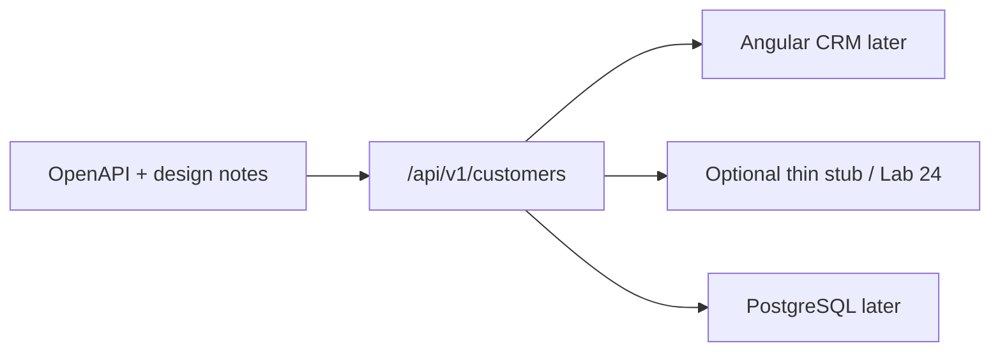

# Lab 13: REST API Design with Java — Northstar CRM Contract First

> **Participants:** Module sequence is in [`../README.md`](../README.md). Open **one** OS how-to ([Windows](LAB-13-WINDOWS.md) · [macOS](LAB-13-MACOS.md)). In class, follow **[STEPS.md](STEPS.md)** then the **45-minute timed path** with [`starter/`](starter/README.md); the **full path** is every Step below (homework / extended). This repo has no answer keys — complete the TODOs yourself. See [Which file do I open?](../../../_PARTICIPANT-FILE-GUIDE.md).

## Activity card

| | |
| --- | --- |
| **Objective** | Design Customer REST resources + OpenAPI sketch + error/pagination contracts |
| **Skills practiced** | URI design, HTTP methods/status, OpenAPI YAML, error shape, list query design |
| **Expected outcome** | OpenAPI for CUS-1001/1002 · design notes · optional thin Boot stub |
| **Estimated time** | Timed path ~45 min · Full path 2–3 hours |
| **Prerequisites** | Lab 0 · JDK 21 · Maven 3.9+ · YAML editor |
| **Expected files** | `examples/lab13-crm/` — OpenAPI, design docs, optional stub |
| **Validation checkpoints** | Starter checklist · GUIDE Implementation Checkpoints |

**Module:** 13 — REST API Design with Java  
**Duration:** ~45 minutes (timed path with starter) · Full path: 2–3 Hours

**Primary IDE:** IntelliJ IDEA Community Edition · **Optional IDE:** VS Code

| OS | How-to for this lab |
| -- | ------------------- |
| Windows | [LAB-13-WINDOWS.md](LAB-13-WINDOWS.md) |
| macOS | [LAB-13-MACOS.md](LAB-13-MACOS.md) |

> **Incremental build:** Resources → URIs → methods/status → error contract → list queries → OpenAPI → optional stub.

> **Critical scope:** **API design first** (OpenAPI + notes). Optional Spring Boot stub is a thin smoke only — full `@RestController` mapping deepens in **Lab 24**. Stack: **REST / OpenAPI · Angular client later · PostgreSQL later · GitHub Actions later**. No SOAP, no Oracle path.

---

## 45-minute timed path (use starter)

1. Open [`starter/README.md`](starter/README.md).
2. Copy `starter/` into `java-bootcamp/examples/lab13-crm/`.
3. Fill every `// TODO` / `TODO:` in OpenAPI + design notes.
4. Validate YAML (editor or `npx @redocly/cli lint` if available). Commit your work to your GitHub repo (no screenshots).
5. Check timed-path Pass criteria in the starter README yourself (do not write the marks down).

| Path | Time | Scope |
| ---- | ---- | ----- |
| **Timed (default)** | ~45 min | OpenAPI Customer paths + design notes TODOs |
| **Full (extended)** | see Duration | Every Step + optional Boot stub |

---

## What you'll complete (practice only)

Labs and exercises are **practice only**. Nothing is submitted or graded. Do not take screenshots. Check Pass/Fail yourself — do not write those marks anywhere. Commit your work to your private `java-bootcamp` GitHub repo.

| # | Deliverable |
| - | ----------- |
| 1 | `openapi/northstar-crm-customers.yaml` (Customer collection + item) |
| 2 | Design notes: URI table, method/status map, error contract |
| 3 | Pagination / filter / sort query design (documented + reflected in OpenAPI) |
| 4 | Evidence that Amina/Ravi schemas match fixtures |
| 5 | Optional: thin Boot stub that serves one GET |
| 6 | README run/cleanup |
| 7 | No secrets or `target/` committed |

**Commit to your GitHub repo:** design artifacts + OpenAPI. **Do not commit:** `target/`, secrets, copied answer keys.

## Lab Overview

This Module 13 lab freezes the **Northstar Customer** HTTP contract before heavy Spring coding: resources, URIs, methods, status codes, a shared error body, list query parameters, and an OpenAPI 3 document the Angular client and GitHub Actions checks can later consume.

## Learning Objectives

After completing this lab, you will be able to:

* Identify Customer collection and item resources with consistent URIs
* Map create/read/update/delete (and activate) to correct HTTP methods and status codes
* Sketch an OpenAPI 3 document with paths, schemas, and examples for `CUS-1001` / `CUS-1002`
* Define a reusable error response that carries correlation id `lab-request-001`
* Design pagination, filtering, and sorting query parameters for list endpoints

## Business Scenario

Northstar’s Angular CRM must call a predictable Customer API. Your lead freezes:

**Design the REST contract first. No SOAP. Document errors and list queries. Fixtures stay Amina ACTIVE and Ravi PROSPECT.**

| ID | Name | Status | Email |
| -- | ---- | ------ | ----- |
| `CUS-1001` | Amina Khan | `ACTIVE` | `amina.khan@example.com` |
| `CUS-1002` | Ravi Singh | `PROSPECT` | `ravi.singh@example.com` |

* Correlation ID: `lab-request-001` (request header `X-Correlation-Id`; echoed in error bodies)
* Base path: `/api/v1/customers`

**Security note.** Fictional emails only. Never put secrets in OpenAPI examples.

---

## Architecture Context
### NOW (this lab)



## Prerequisites

* JDK 21; Maven; Git
* Comfort with JSON and HTTP verbs
* No secrets in Git

### Pre-flight

```bash
java -version
mvn -version
```

## Worked example (read before you code)

Prefer nouns and plural collections:

| Good | Avoid |
| ---- | ----- |
| `GET /api/v1/customers/{id}` | `GET /api/v1/getCustomer?id=` |
| `POST /api/v1/customers` | `POST /api/v1/customer/create` |
| `PATCH /api/v1/customers/{id}/status` | `GET /api/v1/activateCustomer` |

**What to notice:** Method carries intent; URI names the resource; status codes carry outcome.

---

## Implementation Steps

Commands assume `~/java-bootcamp/examples/lab13-crm` (Windows: `%USERPROFILE%\java-bootcamp\examples\lab13-crm`).

### Step 1 — Create project and design folder

**Why:** Graded work lives in your examples tree, not only inside the course clone.

**Do this:**

```bash
mkdir -p ~/java-bootcamp/examples/lab13-crm/{openapi,docs}
# Prefer: copy course starter (see starter/README.md)
```

**Expected result:** `lab13-crm` with `openapi/` and `docs/`.

**If it fails:** Wrong home → use Lab 0 workspace layout.

---

### Step 2 — Resource and URI design notes

**Why:** OpenAPI without a URI table becomes inconsistent naming later.

**Do this:** Create `docs/rest-design-notes.md` with:

1. Resources: Customer collection, Customer item, optional status sub-resource
2. URI table for list / create / get / replace / patch status / delete
3. Version strategy: URI `/api/v1/...` (document why you did not choose header versioning for this lab)

**Expected result:** Written URI table using `/api/v1/customers` and `/api/v1/customers/{customerId}`.

**If it fails:** Verb-in-path habits → rewrite to nouns.

---

### Step 3 — HTTP methods and status map

**Why:** Angular and MockMvc tests assert status codes, not only JSON shapes.

**Do this:** In the same notes file, map:

| Operation | Method | Success | Typical client errors |
| --------- | ------ | ------- | --------------------- |
| List | GET | 200 | 400 bad query |
| Create | POST | 201 + `Location` | 400 validation · 409 duplicate |
| Get by id | GET | 200 | 404 |
| Replace | PUT | 200 | 400 · 404 |
| Patch status | PATCH | 200 | 400 · 404 · 409 illegal transition |
| Delete | DELETE | 204 | 404 |

Call out safe vs idempotent briefly (GET safe; PUT/DELETE idempotent; POST not).

**Expected result:** Complete method/status table tied to Customer.

**If it fails:** Using 200 for every create → fix create to **201**.

---

### Step 4 — Error contract

**Why:** Angular error interceptors need one shape; correlation ties logs across Boot and CI.

**Do this:** Document and later encode in OpenAPI:

```json
{
  "timestamp": "2026-08-23T21:00:00Z",
  "status": 404,
  "error": "Not Found",
  "message": "Customer not found: CUS-9999",
  "path": "/api/v1/customers/CUS-9999",
  "correlationId": "lab-request-001"
}
```

**Expected result:** Single `ErrorResponse` schema; header `X-Correlation-Id` documented.

**If it fails:** Free-form error strings only → add structured schema.

---

### Step 5 — Pagination, filtering, sorting design

**Why:** List endpoints without query rules explode into ad-hoc params.

**Do this:** Document defaults and examples:

* `page` (0-based), `size` (default 20, max 100)
* `status` filter (`ACTIVE` | `PROSPECT` | …)
* `sort` (`fullName,asc` | `createdAt,desc`)

Show example: `GET /api/v1/customers?status=ACTIVE&page=0&size=20&sort=fullName,asc` returning a page wrapper (`content`, `page`, `size`, `totalElements`).

**Expected result:** Query params + page schema described in notes and OpenAPI.

**If it fails:** Offset-only inventiveness → stick to page/size for this course.

---

### Step 6 — Author OpenAPI 3 YAML

**Why:** The YAML is the graded contract artifact.

**Do this:** Complete starter `openapi/northstar-crm-customers.yaml`:

* `info.title`: Northstar CRM Customers API
* Paths: collection GET/POST; item GET/PUT/DELETE; optional PATCH status
* Schemas: `Customer`, `CustomerRequest`, `CustomerPage`, `ErrorResponse`
* Examples: Amina (`CUS-1001` ACTIVE), Ravi (`CUS-1002` PROSPECT)
* Parameter `X-Correlation-Id` (default example `lab-request-001`)

**Expected result:** Valid OpenAPI 3 document; examples match fixtures.

**If it fails:** Indent/YAML errors → validate in IDE; keep `openapi: 3.0.3` (or 3.1) consistent.

---

### Step 7 — Optional thin Spring Boot stub (full path)

**Why:** Proves the URI exists; not a substitute for Lab 24 mapping depth.

**Do this (optional):** Minimal Boot app with one `@GetMapping("/api/v1/customers/{id}")` returning hardcoded Amina JSON when id is `CUS-1001`. Document CORS note for Angular (`localhost:4200`) as a **comment** only if you add a `@CrossOrigin` teaser.

```bash
mvn -q -DskipTests package
mvn -q spring-boot:run
curl -s -H "X-Correlation-Id: lab-request-001" \
  http://localhost:8080/api/v1/customers/CUS-1001
```

**Expected result:** 200 JSON for Amina; README notes “design-first; stub optional.”

**If it fails:** Port in use → change `server.port` or stop other Boot apps.

---

### Step 8 — Evidence pack

**Why:** Reviewers check notes + YAML, not only a green compile.

**Do this:** Commit your work to your GitHub repo. Do not take screenshots.

**Expected result:** Evidence folder populated; git clean of `target/`.

**If it fails:** Working only in `labs/.../module-13` → copy to `examples/lab13-crm`.

---

## Implementation Checkpoints

### Checkpoint A — Design basis

| # | Confirm | Self-check |
| - | ------- | ---------- |
| 1 | `lab13-crm` under `examples/` | Pass / Fail |
| 2 | URI + method/status tables in notes | Pass / Fail |
| 3 | Error contract includes `correlationId` | Pass / Fail |

### Checkpoint B — OpenAPI + list queries

| # | Confirm | Self-check |
| - | ------- | ---------- |
| 1 | OpenAPI paths for collection + item | Pass / Fail |
| 2 | Amina/Ravi examples present | Pass / Fail |
| 3 | page/size/status/sort documented | Pass / Fail |

### Checkpoint C — Hygiene

| # | Confirm | Self-check |
| - | ------- | ---------- |
| 1 | README explains how to open/validate YAML | Pass / Fail |
| 2 | No Oracle/SOAP wording in your notes | Pass / Fail |
| 3 | No secrets / `target/` committed | Pass / Fail |

---

## Reference Commands

```bash
cd ~/java-bootcamp/examples/lab13-crm
# Optional lint if Node available:
# npx --yes @redocly/cli lint openapi/northstar-crm-customers.yaml
# Optional stub:
mvn -q -DskipTests package && mvn -q spring-boot:run
curl -s -H "X-Correlation-Id: lab-request-001" \
  http://localhost:8080/api/v1/customers/CUS-1001
```

## Failure Experiments

| # | Experiment | Observe | Restore |
| - | ---------- | ------- | ------- |
| 1 | Rename path to `/getCustomers` | Breaks REST naming review | Restore noun URI |
| 2 | Omit error `correlationId` | Angular/ops cannot join logs | Restore field |
| 3 | Create returns 200 in notes | Conflicts with POST semantics | Use 201 |
| 4 | Unbounded `size` | Risk of huge payloads | Cap max size |

## Troubleshooting

| Symptom | Likely cause | Fix |
| ------- | ------------ | --- |
| YAML parse error | Indent / tabs | Spaces only; IDE schema |
| Reviewer asks for SOAP | Wrong course path | Stay REST/OpenAPI |
| Stub 404 | Path mismatch vs OpenAPI | Align `/api/v1/customers` |
| Working in course `labs/` only | Not copied | Use `examples/lab13-crm` |

## Cleanup

```bash
cd ~/java-bootcamp/examples/lab13-crm
# Ctrl+C if stub running
mvn -q clean
git status
```

**Keep `lab13-crm`** — Lab 14 builds DTO/validation; Lab 24 implements mappings against this contract.

## Reflection Questions

1. Which URI decision most improved Angular client clarity?
2. Why does the error body need `correlationId`?
3. What list query would you refuse to add without a new OpenAPI revision?

---

## Pass criteria

_Check **Pass** or **Fail** yourself. Do not write these marks anywhere — nothing is submitted or graded. Commit your work to your GitHub repo._

| # | Confirm | Self-check |
| - | ------- | ---------- |
| 1 | OpenAPI Customer API complete with fixtures | Pass / Fail |
| 2 | Design notes cover URI, status, errors, page/filter/sort | Pass / Fail |
| 4 | Stack wording is REST + Angular + PostgreSQL (later) + GitHub Actions — not Oracle/SOAP | Pass / Fail |
