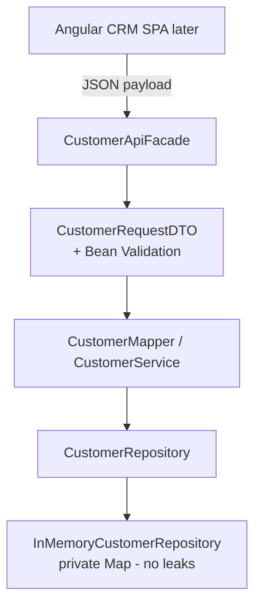

# Lab 14: DTOs and Validation — Northstar CRM API Contract Boundary

> **Participants:** Module sequence is in [`../README.md`](../README.md). **Do not start this guide until** you have finished Module 14 [pre-lab exercises 1–6](../exercises/EXERCISES-INDEX.md) (Pass — check yourself, do not write it down; order **1 → 2 → 3 → 4 → 5 → 6**). Then open **one** OS how-to ([Windows](LAB-14-WINDOWS.md) · [macOS](LAB-14-MACOS.md)). In class, prefer the **45-minute timed path** with [`starter/`](starter/README.md); the **full path** is every Step below (homework / extended). This repo has no answer keys — complete the TODOs yourself. See [Which file do I open?](../../../_PARTICIPANT-FILE-GUIDE.md).

## Activity card

| | |
| --- | --- |
| **Objective** | Ship Customer request/response DTOs + Jakarta validation + no-leak mapper |
| **Skills practiced** | DTO design, Bean Validation, ValidatorFactory, manual mapping, facade gate |
| **Expected outcome** | Green `mvn test` · response DTOs only · invalid paths show `lab-request-001` |
| **Estimated time** | Timed path ~45 min · Full path 3–4 hours |
| **Prerequisites** | Lab 0 · Exercises 1–6 Pass · JDK 21 · Maven 3.9+ |
| **Expected files** | `examples/lab14-crm/` — DTOs, mapper, facade, tests, boundary notes |
| **Validation checkpoints** | Starter smoke `mvn -B clean test` · GUIDE Implementation Checkpoints |

**Module:** 14 — DTOs, Validation and API Contracts  
**Duration:** ~45 minutes (timed path with starter) · Full path: 3–4 Hours

**Primary IDE:** IntelliJ IDEA Community Edition · **Optional IDE:** VS Code

| OS | How-to for this lab |
| -- | ------------------- |
| Windows | [LAB-14-WINDOWS.md](LAB-14-WINDOWS.md) |
| macOS | [LAB-14-MACOS.md](LAB-14-MACOS.md) |

> **Incremental build:** Entity/DTO notes → mapper rules → paper annotations → invalid catalog → Lab 14 `lab14-crm`.

> **Classroom pacing:** [`../PACING.md`](../PACING.md) (Checkpoints A–E).

> **Critical scope:** Jakarta packages + programmatic `Validator`. Do **not** add Spring Boot / `@Valid` controllers. Service transitions deepen in **Lab 15**.

**Verified participant layout (Windows IntelliJ + PowerShell; Temurin JDK 21.0.11; Maven 3.9.9):**

| Role | Path |
| ---- | ---- |
| IntelliJ opens | `%USERPROFILE%\java-bootcamp` (SDK / language level **21**) |
| Prerequisite | Prefer `examples\lab12-crm\` (clean `createCustomer` / `getCustomer` API) |
| This lab project | `examples\lab14-crm\` (`Copy-Item -Recurse lab12-crm lab14-crm`) |
| Validation deps | `jakarta.validation-api` **3.1.0** · Hibernate Validator **8.0.2.Final** · Expressly **5.0.0** |
| API edge | `CustomerApiFacade` + `CustomerRequestDTO` / `CustomerResponseDTO` + `CustomerMapper` |
| Timed starter suite | `mvn -B clean test` → **Tests run: 3**, Failures: 0 · **BUILD SUCCESS** (`CustomerRequestValidationTest`) |
| Full-path suite (optional) | May reach **Tests run: 13** with facade/mapper extras — not required on timed path |
| Main | Response DTOs for `CUS-1001`/`CUS-1002`; invalid email + unknown id include `lab-request-001` |

**If it fails (Windows PowerShell):** Use **Jakarta** validation packages (not `javax`). Missing EL → add `expressly`. Lab 12 service uses `createCustomer` / `getCustomer` — wire the facade to those names (not `addCustomer`). `java -cp target\classes` alone fails with `NoClassDefFoundError: jakarta/validation/Validation` — build a runtime classpath via `dependency:build-classpath` (see README) or run from IntelliJ.

---

## 45-minute timed path (use starter)

In class, use the starter templates so the **core** objectives fit **~45 minutes**. The full Steps below remain for homework / extended depth.

1. Open [`starter/README.md`](starter/README.md).
2. Copy `starter/` into your `java-bootcamp/examples/lab14-crm/` target (see starter README).
3. Fill every `// TODO` — do **not** wait on a perfect prior lab; the starter includes a baseline.
4. Run the starter smoke test. Commit your work to your GitHub repo (no screenshots).
5. Check timed-path Pass criteria in the starter README yourself (do not write the marks down). Continue remaining GUIDE steps as homework if needed.

| Path | Time | Scope |
| ---- | ---- | ----- |
| **Timed (default)** | ~45 min | Starter TODOs + smoke test |
| **Full (extended)** | see Duration | Every Step in this GUIDE |


## What you'll complete (practice only)

Labs and exercises are **practice only**. Nothing is submitted or graded. Do not take screenshots. Check Pass/Fail yourself — do not write those marks anywhere. Commit your work to your private `java-bootcamp` GitHub repo.

Keep this checklist visible while you work.

| # | Deliverable |
| - | ----------- |
| 1 | `CustomerRequestDTO`, `CustomerResponseDTO`, `CustomerMapper`, `CustomerApiFacade` |
| 2 | Automated validation test output |
| 3 | Successful-path evidence (`CUS-1001` / `CUS-1002`) |
| 4 | Controlled-failure evidence (invalid email / blank fields + correlation) |
| 5 | Architecture note: entity vs DTO boundary |
| 6 | README run/cleanup + design decisions |
| 7 | No secrets or `target/` committed |

**Commit to your GitHub repo:** the items in the table above (sources + evidence + short notes).

**Do not commit:** `target/`, `node_modules/`, secrets, heap dumps, or a copied answer keys.

## Lab Overview

This Module 14 lab extends the **Northstar Customer Management Platform** with a clear **API contract boundary**: request and response DTOs, Jakarta Bean Validation on inbound payloads, and mapping that returns DTOs **without** exposing the `Customer` entity over the API.

## Learning Objectives

After completing this lab, you will be able to:

* Explain why entities must not be the public API contract
* Design `CustomerRequestDTO` and `CustomerResponseDTO` for create/update/read flows
* Apply Jakarta Bean Validation annotations (`@NotNull`, `@NotBlank`, `@Email`, `@Size`)
* Trigger validation programmatically with `Validator` / `ValidatorFactory`
* Map between entity and DTO without leaking persistence or internal fields

## Business Scenario

The Angular client (and later HTTP/REST adapters) must send customer payloads that look like JSON contracts—not raw domain objects. Until now, services often accepted `Customer` directly.

Your lead wants a contract layer:

* Incoming create/update bodies use `CustomerRequestDTO` with Bean Validation
* Outgoing reads use `CustomerResponseDTO` only
* Invalid email, blank name, or oversized fields fail **before** business rules run
* Fixtures remain `CUS-1001` Amina Khan (`ACTIVE`) and `CUS-1002` Ravi Singh (`PROSPECT`)

Use these examples consistently:

| ID | Name | Status | Email |
| -- | ---- | ------ | ----- |
| `CUS-1001` | Amina Khan | `ACTIVE` | `amina.khan@example.com` |
| `CUS-1002` | Ravi Singh | `PROSPECT` | `ravi.singh@example.com` |

* Correlation ID: `lab-request-001`
* ISO-8601 / `Instant` timestamps where responses include `createdAt` / `updatedAt`

**Security note for evidence.** Keep sample emails. No secrets, tokens, or real PII in DTOs, logs, or Git.

---

## Architecture Context
### NOW (this lab)



## Prerequisites

Confirm (Lab 0 tools assumed):

* JDK 21; Maven; Git
* Working CRM Maven project from Labs 9–12 (`Customer`, `CustomerStatus`, service)—copy forward as `lab14-crm/`
* No secrets committed to Git

### Pre-flight

```bash
java -version
mvn -version
```

## Worked example (read before you code)

Study this pattern once before Step 1. Your job is to apply the same idea in the Steps — do not skip ahead to a full solution.

```java
package com.northstar.crm.dto;

import jakarta.validation.Validation;
import jakarta.validation.Validator;
import org.junit.jupiter.api.BeforeEach;
import org.junit.jupiter.api.Test;
import static org.junit.jupiter.api.Assertions.*;

class CustomerRequestValidationTest {
    // Timed starter names: validAminaRequestPasses, invalidEmailFails, blankNameFails
    // (full-path solution may use CustomerRequestDTOValidationTest / acceptsAminaKhan — prefer starter names in class)
}
```

**What to notice:** Match starter test class/method names (`CustomerRequestValidationTest`), IDs, and failure behavior — instructors check these.

---

## Implementation Steps

Complete each step in order. Commands assume `~/java-bootcamp/examples/lab14-crm` (Windows: `%USERPROFILE%\java-bootcamp\examples\lab14-crm`) unless noted.

---

### Step 1 — Branch the project and add Validation dependencies

**Why:** Annotations alone do nothing without an implementation provider. Hibernate Validator + EL (`expressly`) enable runtime checks.

**Do this:**

```bash
cd ~/java-bootcamp/examples
cp -r lab12-crm lab14-crm   # or lab11-crm if that is your latest working tree
cd lab14-crm
mkdir -p docs
```

Add to `pom.xml` (merge with existing deps; keep JUnit test-scoped):

```xml
<dependency>
  <groupId>jakarta.validation</groupId>
  <artifactId>jakarta.validation-api</artifactId>
  <version>3.1.0</version>
</dependency>
<dependency>
  <groupId>org.hibernate.validator</groupId>
  <artifactId>hibernate-validator</artifactId>
  <version>8.0.2.Final</version>
</dependency>
<dependency>
  <groupId>org.glassfish.expressly</groupId>
  <artifactId>expressly</artifactId>
  <version>5.0.0</version>
</dependency>
```

```bash
mvn -q dependency:resolve
mvn -q -DincludeArtifactIds=jakarta.validation-api,hibernate-validator dependency:tree
```

**Expected result:** Validation API + Hibernate Validator on classpath; `BUILD SUCCESS`.

**If it fails:** Network/proxy → SETUP. Mix of `javax.validation` and `jakarta.validation` → use **Jakarta** only on Java 21. Missing EL → add `expressly`.

---

### Step 2 — Create `CustomerRequestDTO` with Bean Validation

**Why:** Inbound contract carries constraints the client can learn from documentation—and the runtime enforces before the service runs.

**Do this:** `src/main/java/com/northstar/crm/dto/CustomerRequestDTO.java`:

```java
package com.northstar.crm.dto;

import jakarta.validation.constraints.Email;
import jakarta.validation.constraints.NotBlank;
import jakarta.validation.constraints.NotNull;
import jakarta.validation.constraints.Size;

public class CustomerRequestDTO {

    @NotBlank(message = "customerId is required")
    @Size(max = 32, message = "customerId must be at most 32 characters")
    private String customerId;

    @NotBlank(message = "fullName is required")
    @Size(min = 2, max = 100, message = "fullName must be between 2 and 100 characters")
    private String fullName;

    @NotBlank(message = "email is required")
    @Email(message = "email must be a valid address")
    @Size(max = 254, message = "email must be at most 254 characters")
    private String email;

    @NotBlank(message = "status is required")
    @Size(min = 1, max = 32, message = "status must be between 1 and 32 characters")
    private String status;

    // constructors, getters, setters
}
```

Do **not** put JPA annotations or repository concerns on this class. Prefer status strings that match `CustomerStatus.name()` (`ACTIVE`, `PROSPECT`, …).

**Expected result:** DTO compiles; constraint messages present; no entity/repository imports inside the DTO.

**If it fails:** Wrong import package (`javax.*`) → switch to `jakarta.validation.constraints.*`.

---

### Step 3 — Create `CustomerResponseDTO`

**Why:** Outbound shape is a deliberate subset. Callers should not receive entity methods, mutable collections, or internal flags.

**Do this:**

```java
package com.northstar.crm.dto;

import java.time.Instant;

public class CustomerResponseDTO {
    private String customerId;
    private String fullName;
    private String email;
    private String status;
    private Instant createdAt;
    private Instant updatedAt;

    public static CustomerResponseDTO of(
            String customerId, String fullName, String email,
            String status, Instant createdAt, Instant updatedAt) {
        CustomerResponseDTO dto = new CustomerResponseDTO();
        dto.customerId = customerId;
        dto.fullName = fullName;
        dto.email = email;
        dto.status = status;
        dto.createdAt = createdAt;
        dto.updatedAt = updatedAt;
        return dto;
    }
    // getters only (immutable from caller's perspective)
}
```

If your entity uses `LocalDateTime`, convert in the mapper (`Instant` via `ZoneOffset.UTC` or change DTO fields to match—document the choice).

**Expected result:** Response shape documents id, name, email, status, timestamps.

**If it fails:** Don’t expose setters for production APIs in demos—factory + getters is enough for this lab.

---

### Step 4 — Implement `CustomerMapper`

**Why:** Centralized mapping prevents facades/controllers from copying fields inconsistently and leaking entity types.

**Do this:**

```java
package com.northstar.crm.mapper;

import com.northstar.crm.dto.CustomerRequestDTO;
import com.northstar.crm.dto.CustomerResponseDTO;
import com.northstar.crm.entity.Customer;
import com.northstar.crm.entity.CustomerStatus;
import java.time.LocalDateTime;

public final class CustomerMapper {
    private CustomerMapper() {}

    public static Customer toEntity(CustomerRequestDTO req) {
        // Adapt constructor args to YOUR Customer (phone, timestamps, etc.)
        return new Customer(
            req.getCustomerId(),
            req.getFullName(),
            req.getEmail(),
            /* phone if required */ null,
            CustomerStatus.valueOf(req.getStatus()),
            /* createdAt */ java.time.LocalDateTime.now()
        );
    }

    public static CustomerResponseDTO toResponse(Customer entity) {
        return CustomerResponseDTO.of(
            entity.getCustomerId(),
            entity.getFullName(),
            entity.getEmail(),
            entity.getStatus().name(),
            /* map createdAt/updatedAt to Instant as needed */,
            null
        );
    }
}
```

Ensure timestamps exist on the entity (add `createdAt` / `updatedAt` if Lab 10 entity lacked them). Catch `IllegalArgumentException` from `valueOf` for unknown status strings at the facade if desired.

**Expected result:** Request → entity and entity → response conversions work for `CUS-1001` without DTO referencing JPA types.

**If it fails:** Constructor mismatch → align with your Lab 10–12 `Customer`. Status case errors → require uppercase enum names in DTO.

---

### Step 5 — Validate programmatically in `CustomerApiFacade`

**Why:** Annotations are inert until something calls `validate`. The facade is today’s API edge (Spring will replace the trigger later, not the rules).

**Do this:**

```java
package com.northstar.crm.api;

import com.northstar.crm.dto.CustomerRequestDTO;
import com.northstar.crm.dto.CustomerResponseDTO;
import com.northstar.crm.mapper.CustomerMapper;
import com.northstar.crm.service.CustomerService;
import jakarta.validation.ConstraintViolation;
import jakarta.validation.Validation;
import jakarta.validation.Validator;
import java.util.Set;
import java.util.stream.Collectors;

public class CustomerApiFacade {
    private final CustomerService service;
    private final Validator validator =
        Validation.buildDefaultValidatorFactory().getValidator();

    public CustomerApiFacade(CustomerService service) {
        this.service = service;
    }

    public CustomerResponseDTO create(CustomerRequestDTO request, String correlationId) {
        Set<ConstraintViolation<CustomerRequestDTO>> violations = validator.validate(request);
        if (!violations.isEmpty()) {
            String detail = violations.stream()
                .map(v -> v.getPropertyPath() + ": " + v.getMessage())
                .collect(Collectors.joining("; "));
            throw new IllegalArgumentException(
                "validation failed [" + correlationId + "]: " + detail);
        }
        var saved = service.createCustomer(
                request.getCustomerId(),
                request.getFullName(),
                request.getEmail(),
                request.getPhone(),
                CustomerStatus.valueOf(request.getStatus()));
        // Or: map → createCustomer → toResponse (match your Lab 12 API)
        return CustomerMapper.toResponse(saved);
    }
}
```

Wire `Main` to create Amina via a valid DTO with correlation ID `lab-request-001`. Call `createCustomer` / `getCustomer` (Lab 12 names).

**Expected result:** Console shows create ok for `CUS-1001` / Amina / ACTIVE with correlation echoed in logs/notes.

**If it fails:** `NoProviderFoundException` → Step 1 deps. Calling service before validate → reorder. Service method names differ → adapt, keep “validate first” rule. On Windows, if `java -cp target/classes` fails with `NoClassDefFoundError: jakarta/validation/Validation`, include Maven runtime jars (`dependency:build-classpath`) or run `Main` from IntelliJ.

---

### Step 6 — Prove invalid payloads are rejected

**Why:** Automated tests prove Bean Validation—not only a happy Main demo.

**Do this:** Complete starter `CustomerRequestValidationTest.java` (package `com.northstar.crm`):

```java
import static org.junit.jupiter.api.Assertions.assertFalse;
import static org.junit.jupiter.api.Assertions.assertTrue;
import org.junit.jupiter.api.Test;

@Test
void validAminaRequestPasses() {
    CustomerRequestDTO dto = new CustomerRequestDTO();
    dto.setCustomerId("CUS-1001");
    dto.setFullName("Amina Khan");
    dto.setEmail("amina.khan@example.com");
    dto.setStatus("ACTIVE");
    assertTrue(validator.validate(dto).isEmpty());
}

@Test
void invalidEmailFails() {
    CustomerRequestDTO dto = validTemplate();
    dto.setEmail("not-an-email");
    assertFalse(validator.validate(dto).isEmpty());
}

@Test
void blankNameFails() {
    CustomerRequestDTO dto = validTemplate();
    dto.setFullName(" ");
    assertFalse(validator.validate(dto).isEmpty());
}
```

(Optional full path: also add facade/mapper tests; solution names may differ — timed path sticks to the three starter methods.)

```bash
mvn -q test -Dtest=CustomerRequestValidationTest
```

**Expected result:** **Tests run: 3**; invalid email/blank name produce violations.

**If it fails:** Surefire missing → copy Lab 11 plugin. Tests under wrong package path → use `src/test/java`.

---

### Step 7 — Ensure get-by-id returns DTO only

**Why:** Read paths are the most common place entities leak (“I’ll just return the Customer for now”).

**Do this:** Extend the facade:

```java
public CustomerResponseDTO getById(String customerId, String correlationId) {
    var entity = service.findByCustomerId(customerId)  // or findById — match your API
        .orElseThrow(() -> new IllegalArgumentException(
            "customer not found [" + correlationId + "]: " + customerId));
    return CustomerMapper.toResponse(entity);
}
```

Update `Main` to create `CUS-1002` as `PROSPECT`, then fetch both customers **as response DTOs**—never print entity `toString()` as the “API response.”

**Expected result:** get paths show DTO fields; no `jakarta.persistence` types in output; not-found includes correlation ID.

**If it fails:** Grep for public methods returning `Customer` from `api` package—remove them.

---

### Step 8 — Document the contract in project README

**Why:** Another engineer must run validations without reading your chat history.

**Do this:** Document in `lab14-crm/README.md`:

```markdown
## Validation rules (CustomerRequestDTO)

| Field | Constraints |
| ----- | ----------- |
| customerId | @NotBlank, @Size(max=32) |
| fullName | @NotBlank, @Size(2..100) |
| email | @NotBlank, @Email, @Size(max=254) |
| status | @NotBlank (ACTIVE\|PROSPECT\|SUSPENDED\|CLOSED) |

## Sample invalid (email)

email=not-an-email → IllegalArgumentException with field message
correlationId=lab-request-001
```

Include fixtures, `mvn test` / Main commands, and a short entity-vs-DTO note in `docs/dto-boundary-notes.md`.

**Expected result:** README is supportable; `git status` clean of `target/` and secrets.

**If it fails:** Undocumented constraints → instructors cannot verify intentional rules.

---

### Step 9 — Failure experiments + evidence pack

**Why:** Prove provider dependency, validation-before-service, and duplicate vs validation differences.

**Do this:** Complete Failure Experiments. Commit your work to your GitHub repo. Do not take screenshots.

```bash
mvn -q clean test
java -cp target/classes:$(mvn -q dependency:build-classpath -DincludeScope=compile -Dmdep.outputFile=/dev/stdout) \
  com.northstar.crm.Main
# or use exec-maven-plugin if configured
git status
```

**Expected result:** ≥3 experiments documented; suite green after restores.

**If it fails:** See Troubleshooting.

---

## Implementation Checkpoints

### Checkpoint A — Deps + request DTO

_Check **Pass** or **Fail** yourself. Do not write these marks anywhere — nothing is submitted or graded. Commit your work to your GitHub repo._

| # | Confirm | Self-check |
| - | ------- | ---------- |
| 1 | `lab14-crm` under `examples/` | Pass / Fail |
| 2 | Validation API + Hibernate Validator (+ expressly) resolve | Pass / Fail |
| 3 | `CustomerRequestDTO` annotations compile (Jakarta) | Pass / Fail |

### Checkpoint B — Response + mapper + facade

_Check **Pass** or **Fail** yourself. Do not write these marks anywhere — nothing is submitted or graded. Commit your work to your GitHub repo._

| # | Confirm | Self-check |
| - | ------- | ---------- |
| 1 | `CustomerResponseDTO` + `CustomerMapper` present | Pass / Fail |
| 2 | Facade validates **before** service calls | Pass / Fail |
| 3 | Correlation ID appears on validation failures | Pass / Fail |

### Checkpoint C — Proof

_Check **Pass** or **Fail** yourself. Do not write these marks anywhere — nothing is submitted or graded. Commit your work to your GitHub repo._

| # | Confirm | Self-check |
| - | ------- | ---------- |
| 1 | Validation tests green (email, blank name, accept Amina) | Pass / Fail |
| 2 | Main (or demo) creates/gets `CUS-1001` / `CUS-1002` as response DTOs | Pass / Fail |
| 3 | No facade method returns `Customer` | Pass / Fail |

### Checkpoint D — Docs + experiments

_Check **Pass** or **Fail** yourself. Do not write these marks anywhere — nothing is submitted or graded. Commit your work to your GitHub repo._

| # | Confirm | Self-check |
| - | ------- | ---------- |
| 1 | README constraint table + run instructions | Pass / Fail |
| 2 | Failure experiments recorded | Pass / Fail |
| 3 | No secrets / `target/` staged | Pass / Fail |

---

## Reference Commands, Configuration, and Code

### Dependencies (excerpt)

```xml
<dependency>
  <groupId>jakarta.validation</groupId>
  <artifactId>jakarta.validation-api</artifactId>
  <version>3.1.0</version>
</dependency>
<dependency>
  <groupId>org.hibernate.validator</groupId>
  <artifactId>hibernate-validator</artifactId>
  <version>8.0.2.Final</version>
</dependency>
```

### Commands

```bash
cd ~/java-bootcamp/examples/lab14-crm
mvn -q clean test
mvn -q test -Dtest=CustomerRequestValidationTest
mvn -q exec:java -Dexec.mainClass=com.northstar.crm.Main
git status
```

## Failure Experiments

| # | Experiment | Observe | Restore |
| - | ---------- | ------- | ------- |
| 1 | Remove Hibernate Validator temporarily; run tests | `NoProviderFoundException` / missing provider | Restore dependency |
| 2 | Missing `fullName`, bad email, `status` blank/null | Facade fails before `createCustomer` | Keep validate-first order |
| 3 | Create `CUS-1001` twice | Duplicate = service rule, not Bean Validation | Document difference |
| 4 | Skip `validator.validate` call | Invalid data reaches service | Re-add validate; note risk |
| 5 | Status `Active` (wrong case) | `valueOf` fails at map time | Require enum-aligned strings |

---

## Troubleshooting

| Symptom | Likely cause | Fix |
| ------- | ------------ | --- |
| `NoProviderFoundException` | Missing hibernate-validator / expressly | Restore Step 1 deps; `clean test` |
| Annotations ignored | Never called `validate` | Trigger in facade |
| `javax.validation` not found | Old tutorial imports | Use `jakarta.validation.*` |
| Mapper compile errors | Entity constructor mismatch | Align with your Lab 10–12 Customer |
| Status parse failures | Wrong case / typo | Match `CustomerStatus` names |
| Entity returned from API | Facade shortcut | Return mapper response only |
| Tests flaky | Shared mutable DTO | Reset in `@BeforeEach` / fresh instances |
| `NoClassDefFoundError: jakarta/validation/Validation` on `java -cp` | Runtime missing deps | Use `dependency:build-classpath` or IntelliJ run |

## Security and Production Review

Optional — jot brief notes in your README if useful for your progress check (not a separate essay):

1. Which inputs are untrusted (all DTO fields from clients)?
2. Where are authn/authz/validation enforced (validation now; auth still absent)?
3. Which values are sensitive—never put them on response DTOs?

---


## Cleanup

```bash
cd ~/java-bootcamp/examples/lab14-crm
mvn -q clean
git status
```

No containers required. Keep DTOs/mapper/facade and tests. **Keep `lab14-crm`** for Lab 15+ service-layer work.


## Reflection Questions

Write **1–3 sentence** answers (not essays):

1. Which design decision most affected correctness?
2. What evidence proves the implementation works?
3. Which failure was hardest to diagnose?

---


