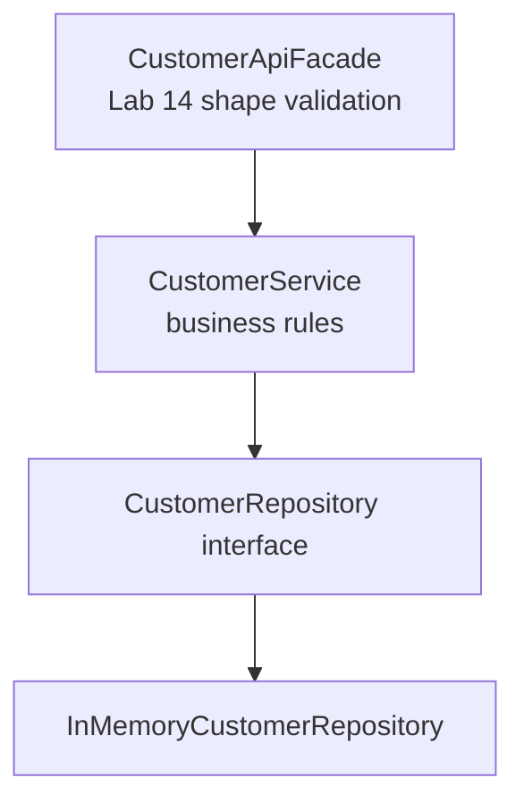

# Lab 15: Service Layer Design — Northstar CRM Business Rules

> **Participants:** Module sequence is in [`../README.md`](../README.md). **Do not start this guide until** you have finished Module 15 [pre-lab exercises 1–6](../exercises/EXERCISES-INDEX.md) (Pass — check yourself, do not write it down; order **1 → 2 → 3 → 4 → 5 → 6**). Then open **one** OS how-to ([Windows](LAB-15-WINDOWS.md) · [macOS](LAB-15-MACOS.md)). In class, prefer the **45-minute timed path** with [`starter/`](starter/README.md); the **full path** is every Step below (homework / extended). This repo has no answer keys — complete the TODOs yourself. See [Which file do I open?](../../../_PARTICIPANT-FILE-GUIDE.md).

## Activity card

| | |
| --- | --- |
| **Objective** | Ship repository + validator + DefaultCustomerService with legal/illegal status transitions |
| **Skills practiced** | Service/repo boundaries, transition matrix, ctor DI, validate-before-mutate |
| **Expected outcome** | `mvn test` → **Tests run: 3** · activate CUS-1002 · reject ACTIVE→PROSPECT with `lab-request-001` |
| **Estimated time** | Timed path ~45 min · Full path 3–4 hours |
| **Prerequisites** | Lab 0 · Lab 14 DTOs preferred · Exercises 1–6 Pass · JDK 21 · Maven 3.9+ |
| **Expected files** | `examples/lab15-crm/` — repo, validator, service, tests, notes |
| **Validation checkpoints** | Starter smoke `mvn -B clean test` · GUIDE Implementation Checkpoints |

**Module:** 15 — Business Logic and Service Layer Design  
**Duration:** ~45 minutes (timed path with starter) · Full path: 3–4 Hours

**Primary IDE:** IntelliJ IDEA Community Edition · **Optional IDE:** VS Code

| OS | How-to for this lab |
| -- | ------------------- |
| Windows | [LAB-15-WINDOWS.md](LAB-15-WINDOWS.md) |
| macOS | [LAB-15-MACOS.md](LAB-15-MACOS.md) |

> **Incremental build:** Layer diagram → repo boundary → transition matrix → interface/ctor → activate Ravi → Lab 15 `lab15-crm`.

> **Classroom pacing:** [`../PACING.md`](../PACING.md) (Checkpoints A–E).

> **Critical scope:** Transitions in **service/validator**. Map private inside repository. No `HashMap`/JDBC in `service`. HTTP exception mapping is **Lab 16**.

**Verified participant layout (Windows IntelliJ + PowerShell; Temurin JDK 21.0.11; Maven 3.9.9):**

| Role | Path |
| ---- | ---- |
| IntelliJ opens | `%USERPROFILE%\java-bootcamp` (SDK / language level **21**) |
| Prerequisite | `examples\lab14-crm\` (DTOs + Bean Validation) |
| This lab project | `examples\lab15-crm\` (`Copy-Item -Recurse lab14-crm lab15-crm`) |
| Layers | `CustomerRepository` / `InMemoryCustomerRepository` · `CustomerValidator` · `CustomerService` + `DefaultCustomerService` |
| Timed starter suite | `mvn -B clean test` → **Tests run: 3**, Failures: 0 · **BUILD SUCCESS** (`CustomerValidatorTest`) |
| Main | `activated CUS-1002 status=ACTIVE`; illegal `ACTIVE -> PROSPECT [lab-request-001]`; Amina stays ACTIVE |
| Anti-leak | No `HashMap` / JDBC / `EntityManager` in `service` package |

**If it fails (Windows PowerShell):** Rename the old concrete `CustomerService` class to make room for the interface + `DefaultCustomerService`. Wire validator and service with the **same** `InMemoryCustomerRepository` instance. Keep Map private inside the repository only.

---

## 45-minute timed path (use starter)

In class, use the starter templates so the **core** objectives fit **~45 minutes**. The full Steps below remain for homework / extended depth.

1. Open [`starter/README.md`](starter/README.md).
2. Copy `starter/` into your `java-bootcamp/examples/lab15-crm/` target (see starter README).
3. Fill every `// TODO` — do **not** wait on a perfect prior lab; the starter includes a baseline.
4. Run the starter smoke test. Commit your work to your GitHub repo (no screenshots).
5. Check timed-path Pass criteria in the starter README yourself (do not write the marks down). Continue remaining GUIDE steps as homework if needed.

| Path | Time | Scope |
| ---- | ---- | ----- |
| **Timed (default)** | ~45 min | Starter TODOs + smoke test |
| **Full (extended)** | see Duration | Every Step in this GUIDE |


## What you'll complete (practice only)

Labs and exercises are **practice only**. Nothing is submitted or graded. Do not take screenshots. Check Pass/Fail yourself — do not write those marks anywhere. Commit your work to your private `java-bootcamp` GitHub repo.

Keep this checklist visible while you work.

| # | Deliverable |
| - | ----------- |
| 1 | `CustomerService` + `DefaultCustomerService` |
| 2 | `CustomerValidator` with status-transition rules |
| 3 | `CustomerRepository` + in-memory impl (Map not leaked) |
| 4 | Evidence: activate `CUS-1002`; failed illegal transition; validator tests |
| 5 | README / notes with transition table and wiring |
| 6 | No secrets or `target/` committed |

**Commit to your GitHub repo:** the items in the table above (sources + evidence + short notes).

**Do not commit:** `target/`, `node_modules/`, secrets, heap dumps, or a copied answer keys.

## Lab Overview

This Module 15 lab extends the **Customer Management Platform** with a deliberate **service layer**: `CustomerService` (interface + implementation), `CustomerValidator` for business rules, and status-transition rules such as `PROSPECT → ACTIVE`—without leaking persistence details through the API.

## Learning Objectives

After completing this lab, you will be able to:

* Separate facade, service, validator, and repository responsibilities
* Define a DI-friendly `CustomerService` interface and concrete implementation
* Implement `CustomerValidator` for identity, email uniqueness, and status transitions
* Enforce `PROSPECT → ACTIVE` and reject illegal transitions in one place
* Keep persistence details (`Map`, SQL, file I/O) behind a repository interface

## Business Scenario

Operations staff activate prospects after KYC. Today that logic is scattered across demos and if-statements. Leadership wants:

* One service method to create customers and one to change status
* Explicit rules: a `PROSPECT` may become `ACTIVE`; an `ACTIVE` customer cannot become `PROSPECT` again without a documented override path (not in this lab)
* Validation of business meaning (not only Bean Validation of shapes) before save
* Constructor injection so unit tests (Labs 17–18) can substitute fakes/mocks

Use these examples consistently:

| ID | Name | Starting status | Email |
| -- | ---- | --------------- | ----- |
| `CUS-1001` | Amina Khan | `ACTIVE` | `amina.khan@example.com` |
| `CUS-1002` | Ravi Singh | `PROSPECT` | `ravi.singh@example.com` |

* Correlation ID: `lab-request-001`
* Timestamps: ISO-8601 / existing entity clock fields

**Security note for evidence.** Sample emails only. No secrets or real PII in logs or Git.

---

## Architecture Context
### NOW (this lab)



## Prerequisites

Prior labs: [Lab 14](../../module-14/lab14/LAB-14-GUIDE.md).

Confirm (Lab 0 tools assumed):

* JDK 21; Maven; Git
* Lab 14 DTOs, mapper, and facade as starting point (`lab14-crm/` → `lab15-crm/`)
* No secrets committed to Git

### Pre-flight

```bash
java -version
mvn -version
```

## Worked example (read before you code)

Study this pattern once before Step 1. Your job is to apply the same idea in the Steps — do not skip ahead to a full solution.

```java
package com.northstar.crm.service;

import com.northstar.crm.entity.Customer;
import com.northstar.crm.entity.CustomerStatus;
import com.northstar.crm.repository.CustomerRepository;
import java.util.List;
import java.util.Optional;

public class DefaultCustomerService implements CustomerService {
    private final CustomerRepository repository;
    private final CustomerValidator validator;

    public DefaultCustomerService(CustomerRepository repository, CustomerValidator validator) {
        this.repository = repository;
        this.validator = validator;
    }

    @Override
    public Customer addCustomer(Customer customer) {
        validator.validateNew(customer);
        return repository.save(customer);
    }

    @Override
    public Optional<Customer> findById(String customerId) {
        return repository.findById(customerId);
    }

    @Override
    public List<Customer> listAll() {
        return List.copyOf(repository.findAll());
    }

    @Override
    public Customer changeStatus(String customerId, CustomerStatus newStatus, String correlationId) {
        Customer existing = repository.findById(customerId)
            .orElseThrow(() -> new IllegalArgumentException(
                "customer not found [" + correlationId + "]: " + customerId));
        validator.validateTransition(existing.getStatus(), newStatus, correlationId);
        existing.setStatus(newStatus);
// ... truncated — see full sample in the Steps
```

**What to notice:** Match names, IDs, and failure behavior from the scenario — instructors check these.

---

## Implementation Steps

Complete each step in order. Commands assume `~/java-bootcamp/examples/lab15-crm` (Windows: `%USERPROFILE%\java-bootcamp\examples\lab15-crm`) unless noted.

---

### Step 1 — Branch Lab 14 and introduce repository interface

**Why:** Callers must depend on a storage *role*, not `HashMap`. That is the anti-leak rule for this lab.

**Do this:**

```bash
cd ~/java-bootcamp/examples
cp -r lab14-crm lab15-crm
cd lab15-crm
mkdir -p docs
```

```java
package com.northstar.crm.repository;

import com.northstar.crm.entity.Customer;
import java.util.List;
import java.util.Optional;

public interface CustomerRepository {
    Customer save(Customer customer);
    Optional<Customer> findById(String customerId);
    boolean existsById(String customerId);
    boolean existsByEmail(String email);
    List<Customer> findAll();
}
```

Implement `InMemoryCustomerRepository` with a **private** `Map<String, Customer>`. Do not expose getters for the map. Refactor any previous service that held a raw list to use this repository instead.

**Expected result:** Interface + impl compile; facade/service import the interface, not `HashMap`.

**If it fails:** Duplicate class names from old service-owned lists → migrate carefully; keep one source of truth.

---

### Step 2 — Define the `CustomerService` interface

**Why:** Interfaces enable substituting fakes in Labs 17–18 and Spring beans later without rewriting callers.

**Do this:**

```java
package com.northstar.crm.service;

import com.northstar.crm.entity.Customer;
import com.northstar.crm.entity.CustomerStatus;
import java.util.List;
import java.util.Optional;

public interface CustomerService {
    Customer addCustomer(Customer customer);
    Optional<Customer> findById(String customerId);
    List<Customer> listAll();
    Customer changeStatus(String customerId, CustomerStatus newStatus, String correlationId);
}
```

No Jakarta persistence or Spring annotations on the interface. If Lab 14 facade called differently named methods, adapt the facade to this interface (or add adapters and document).

**Expected result:** Use-case methods present; `changeStatus` includes `correlationId`.

**If it fails:** Name clash with old concrete `CustomerService` class → rename old class to `DefaultCustomerService` as in Step 4.

---

### Step 3 — Implement `CustomerValidator` business rules

**Why:** Status graphs and uniqueness are domain policy—not repository I/O and not Bean Validation size limits.

**Do this:**

```java
package com.northstar.crm.service;

import com.northstar.crm.entity.Customer;
import com.northstar.crm.entity.CustomerStatus;
import com.northstar.crm.repository.CustomerRepository;
import java.util.EnumMap;
import java.util.EnumSet;
import java.util.Map;
import java.util.Set;

public class CustomerValidator {
    private static final Map<CustomerStatus, Set<CustomerStatus>> ALLOWED =
        new EnumMap<>(CustomerStatus.class);

    static {
        ALLOWED.put(CustomerStatus.PROSPECT, EnumSet.of(CustomerStatus.ACTIVE, CustomerStatus.CLOSED));
        ALLOWED.put(CustomerStatus.ACTIVE, EnumSet.of(CustomerStatus.SUSPENDED, CustomerStatus.CLOSED));
        ALLOWED.put(CustomerStatus.SUSPENDED, EnumSet.of(CustomerStatus.ACTIVE, CustomerStatus.CLOSED));
        ALLOWED.put(CustomerStatus.CLOSED, EnumSet.noneOf(CustomerStatus.class));
    }

    private final CustomerRepository repository;

    public CustomerValidator(CustomerRepository repository) {
        this.repository = repository;
    }

    public void validateNew(Customer customer) {
        if (customer.getCustomerId() == null || customer.getCustomerId().isBlank()) {
            throw new IllegalArgumentException("customerId is required");
        }
        if (repository.existsById(customer.getCustomerId())) {
            throw new IllegalStateException("duplicate customerId: " + customer.getCustomerId());
        }
        if (repository.existsByEmail(customer.getEmail())) {
            throw new IllegalStateException("duplicate email: " + customer.getEmail());
        }
    }

    public void validateTransition(CustomerStatus from, CustomerStatus to, String correlationId) {
        Set<CustomerStatus> allowed = ALLOWED.getOrDefault(from, Set.of());
        if (!allowed.contains(to)) {
            throw new IllegalStateException(
                "illegal status transition " + from + " -> " + to
                    + " [" + correlationId + "]");
        }
    }
}
```

Adjust enum constants to match Labs 10–14; keep at least `PROSPECT` and `ACTIVE`.

**Expected result:** `PROSPECT → ACTIVE` allowed; `ACTIVE → PROSPECT` throws mentioning correlationId.

**If it fails:** Missing enum values → align `CustomerStatus`. Rules living in repository → move them here.

---

### Step 4 — Implement `DefaultCustomerService` with constructor DI

**Why:** The service orchestrates validator + repository. Constructor parameters are the DI surface Spring will honor later.

**Do this:**

```java
package com.northstar.crm.service;

import com.northstar.crm.entity.Customer;
import com.northstar.crm.entity.CustomerStatus;
import com.northstar.crm.repository.CustomerRepository;
import java.util.List;
import java.util.Optional;

public class DefaultCustomerService implements CustomerService {
    private final CustomerRepository repository;
    private final CustomerValidator validator;

    public DefaultCustomerService(CustomerRepository repository, CustomerValidator validator) {
        this.repository = repository;
        this.validator = validator;
    }

    @Override
    public Customer addCustomer(Customer customer) {
        validator.validateNew(customer);
        return repository.save(customer);
    }

    @Override
    public Optional<Customer> findById(String customerId) {
        return repository.findById(customerId);
    }

    @Override
    public List<Customer> listAll() {
        return List.copyOf(repository.findAll());
    }

    @Override
    public Customer changeStatus(String customerId, CustomerStatus newStatus, String correlationId) {
        Customer existing = repository.findById(customerId)
            .orElseThrow(() -> new IllegalArgumentException(
                "customer not found [" + correlationId + "]: " + customerId));
        validator.validateTransition(existing.getStatus(), newStatus, correlationId);
        existing.setStatus(newStatus);
        // touchUpdatedAt() if your entity supports it; else setUpdatedAt(now)
        return repository.save(existing);
    }
}
```

Wire Main / facade with the **same** repository instance for validator and service:

```java
CustomerRepository repo = new InMemoryCustomerRepository();
CustomerValidator validator = new CustomerValidator(repo);
CustomerService service = new DefaultCustomerService(repo, validator);
```

Update Lab 14 facade to depend on `CustomerService` interface.

**Expected result:** No `new HashMap` inside the service; constructors take roles/interfaces.

**If it fails:** Two different repo instances → uniqueness checks miss existing customers. Fix shared wiring.

---

### Step 5 — Activate Ravi: `PROSPECT → ACTIVE`

**Why:** This is the business happy path leadership asked for—proof the transition table is live.

**Do this:** In `Main`, seed Amina ACTIVE and Ravi PROSPECT, then:

```java
service.addCustomer(amina); // ACTIVE
service.addCustomer(ravi);  // PROSPECT
Customer activated = service.changeStatus(
    "CUS-1002", CustomerStatus.ACTIVE, "lab-request-001");
System.out.printf("activated %s status=%s%n",
    activated.getCustomerId(), activated.getStatus());
```

```bash
mvn -q -DskipTests compile
mvn -q exec:java -Dexec.mainClass=com.northstar.crm.Main
# or: java -cp ... com.northstar.crm.Main
```

**Expected result:** `activated CUS-1002 status=ACTIVE`

**If it fails:** Ravi not PROSPECT at seed → fix seed data. Transition not in ALLOWED → check validator static block.

---

### Step 6 — Force an illegal transition and capture the error

**Why:** Graders require proof that bad transitions fail *and* leave state unchanged.

**Do this:**

```java
try {
    service.changeStatus("CUS-1001", CustomerStatus.PROSPECT, "lab-request-001");
} catch (IllegalStateException ex) {
    System.out.println("expected failure: " + ex.getMessage());
}
System.out.println("CUS-1001 still: " + service.findById("CUS-1001").orElseThrow().getStatus());
```

**Expected result:** Failure message includes `ACTIVE -> PROSPECT` and `[lab-request-001]`; Amina remains ACTIVE.

**If it fails:** Status flipped despite exception → validate **before** `setStatus` (order in Step 4). Soft-catch swallowing exception → rethrow after logging for demos only after printing.

---

### Step 7 — Prove no persistence leak + validator tests

**Why:** Leaking `Map` or JDBC types through the service defeats the layer design.

**Do this:**

1. Search service sources for `HashMap`, `Connection`, `EntityManager`—expect none.
2. Complete starter `CustomerValidatorTest` methods:

```java
import static org.junit.jupiter.api.Assertions.assertDoesNotThrow;
import static org.junit.jupiter.api.Assertions.assertThrows;
import org.junit.jupiter.api.Test;

@Test
void prospectToActiveAllowed() {
    assertDoesNotThrow(() ->
        validator.validateTransition(
            CustomerStatus.PROSPECT, CustomerStatus.ACTIVE, "lab-request-001"));
}

@Test
void activeToProspectRejected() {
    assertThrows(IllegalStateException.class, () ->
        validator.validateTransition(
            CustomerStatus.ACTIVE, CustomerStatus.PROSPECT, "lab-request-001"));
}

@Test
void duplicateIdRejected() {
    // seed via repo.save(...); validateNew duplicate → throws
}
```

```bash
mvn -q test -Dtest=CustomerValidatorTest
```

Note why `listAll` returns `List.copyOf` (callers cannot mutate internal storage).

**Expected result:** **Tests run: 3**; no Map/SQL leakage in service sources.

**If it fails:** Accidental public `getMap()` on repository → remove it.

---

### Step 8 — Document service responsibilities

**Why:** Transition tables must not live only in someone’s head.

**Do this:** Update README / `docs/service-layer-notes.md`:

* Bean Validation (Lab 14) vs `CustomerValidator` (this lab)
* Allowed transition table:

```text
PROSPECT  -> ACTIVE, CLOSED
ACTIVE    -> SUSPENDED, CLOSED
SUSPENDED -> ACTIVE, CLOSED
CLOSED    -> (none)
```

* Manual wiring snippet (Spring DI preview)
* Decision on same-status `changeStatus` (noop vs reject)—pick one and document

**Expected result:** Another student can activate `CUS-1002` from README alone.

**If it fails:** Undocumented table that differs from code → sync them.

---

### Step 9 — Failure experiments + evidence pack

**Why:** Shared-repo wiring bugs and illegal transitions are the classic support tickets.

**Do this:** Complete Failure Experiments. Capture Main + Surefire commit to GitHub (no screenshots).

```bash
mvn -q clean test
git status
```

**Expected result:** ≥3 experiments documented; suite green after restores.

**If it fails:** See Troubleshooting.

---

## Implementation Checkpoints

### Checkpoint A — Repository boundary

_Check **Pass** or **Fail** yourself. Do not write these marks anywhere — nothing is submitted or graded. Commit your work to your GitHub repo._

| # | Confirm | Self-check |
| - | ------- | ---------- |
| 1 | `lab15-crm` under `examples/` | Pass / Fail |
| 2 | `CustomerRepository` + private-Map in-memory impl | Pass / Fail |
| 3 | No Map exposed to callers | Pass / Fail |

### Checkpoint B — Service + validator

_Check **Pass** or **Fail** yourself. Do not write these marks anywhere — nothing is submitted or graded. Commit your work to your GitHub repo._

| # | Confirm | Self-check |
| - | ------- | ---------- |
| 1 | `CustomerService` interface + `DefaultCustomerService` | Pass / Fail |
| 2 | `CustomerValidator` with ALLOWED transitions | Pass / Fail |
| 3 | Shared repository instance in wiring | Pass / Fail |

### Checkpoint C — Behavior proof

_Check **Pass** or **Fail** yourself. Do not write these marks anywhere — nothing is submitted or graded. Commit your work to your GitHub repo._

| # | Confirm | Self-check |
| - | ------- | ---------- |
| 1 | `CUS-1002` activates PROSPECT → ACTIVE | Pass / Fail |
| 2 | `CUS-1001` ACTIVE → PROSPECT rejected; status unchanged | Pass / Fail |
| 3 | Correlation ID present on failure | Pass / Fail |

### Checkpoint D — Tests + docs

_Check **Pass** or **Fail** yourself. Do not write these marks anywhere — nothing is submitted or graded. Commit your work to your GitHub repo._

| # | Confirm | Self-check |
| - | ------- | ---------- |
| 1 | `CustomerValidatorTest` green | Pass / Fail |
| 2 | README transition table + wiring | Pass / Fail |
| 3 | Failure experiments recorded; no secrets/`target/` staged | Pass / Fail |

---

## Reference Commands, Configuration, and Code

### Interface excerpt

```java
Customer changeStatus(String customerId, CustomerStatus newStatus, String correlationId);
```

### Allowed transitions

```text
PROSPECT  -> ACTIVE, CLOSED
ACTIVE    -> SUSPENDED, CLOSED
SUSPENDED -> ACTIVE, CLOSED
CLOSED    -> (none)
```

### Commands

```bash
cd ~/java-bootcamp/examples/lab15-crm
mvn -q clean test
mvn -q test -Dtest=CustomerValidatorTest
mvn -q exec:java -Dexec.mainClass=com.northstar.crm.Main
git status
```

## Failure Experiments

| # | Experiment | Observe | Restore / conclude |
| - | ---------- | ------- | ------------------ |
| 1 | Repository `save` always throws | Service surfaces failure; prior customers intact | Fix stub |
| 2 | `CLOSED → ACTIVE` and `ACTIVE → PROSPECT` | Both fail via validator | Keep rules |
| 3 | `changeStatus` to ACTIVE twice | Document noop vs reject; enforce one | Match README |
| 4 | Wire two different repo instances | Duplicate email not detected | Shared instance |
| 5 | Set status before validateTransition | Corrupt state on failure | Validate first |

---

## Troubleshooting

| Symptom | Likely cause | Fix |
| ------- | ------------ | --- |
| Uniqueness misses | Two repo instances | Share one repo in wiring |
| Wrong status enum | DTO string mismatch | Match `CustomerStatus.name()` |
| Transition always fails | ALLOWED map incomplete | Align static block with enum |
| Status corrupted on error | Mutate before validate | Reorder Step 4 method |
| Facade compile errors | Old concrete service type | Depend on interface |
| Flaky tests | Shared static mutable state | Fresh repo per test |
| HashMap visible in `service` package | Persistence leak | Move Map into `InMemoryCustomerRepository` only |
| Activating Amina as happy path | Wrong fixture | Activate Ravi `CUS-1002` (PROSPECT) |

## Security and Production Review

Optional — jot brief notes in your README if useful for your progress check (not a separate essay):

1. Which inputs are untrusted (all client fields reaching the service)?
2. Where are authn/authz/validation enforced (shape at facade; meaning in validator; auth still absent)?
3. Which values are sensitive, and where stored?

---


## Cleanup

```bash
cd ~/java-bootcamp/examples/lab15-crm
mvn -q clean
git status
```

No containers required. **Keep `lab15-crm`**—Lab 16 expands exceptions on these paths.


## Reflection Questions

Write **1–3 sentence** answers (not essays):

1. Which design decision most affected correctness?
2. What evidence proves the implementation works?
3. Which failure was hardest to diagnose?

---


