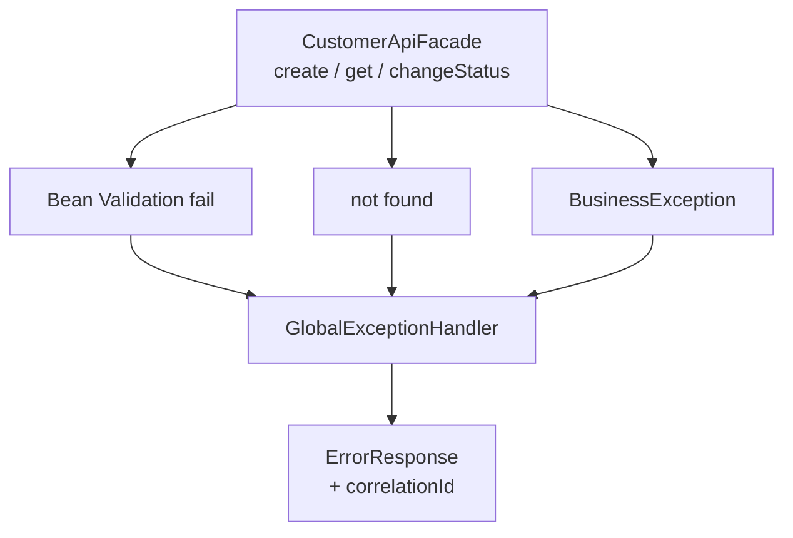

# Lab 16: API Exception Handling — Northstar CRM Error Model

> **Participants:** Module sequence is in [`../README.md`](../README.md). **Do not start this guide until** you have finished Module 16 [pre-lab exercises 1–6](../exercises/EXERCISES-INDEX.md) (Pass — check yourself, do not write it down; order **1 → 2 → 3 → 4 → 5 → 6**). Then open **one** OS how-to ([Windows](LAB-16-WINDOWS.md) · [macOS](LAB-16-MACOS.md)). In class, prefer the **45-minute timed path** with [`starter/`](starter/README.md); the **full path** is every Step below (homework / extended). This repo has no answer keys — complete the TODOs yourself. See [Which file do I open?](../../../_PARTICIPANT-FILE-GUIDE.md).

## Activity card

| | |
| --- | --- |
| **Objective** | Ship ErrorResponse + GlobalExceptionHandler + Fail demos (400/404/409) with correlation |
| **Skills practiced** | Catch order, BusinessException mapping, safe messages, ApiResult Fail JSON |
| **Expected outcome** | `mvn test` → **Tests run: 3** · 400/404/409 demos · `lab-request-001` on every Fail |
| **Estimated time** | Timed path ~45 min · Full path 3–4 hours |
| **Prerequisites** | Lab 0 · Lab 15 preferred · Exercises 1–6 Pass · JDK 21 · Maven 3.9+ |
| **Expected files** | `examples/lab16-crm/` — ErrorResponse, handler, facade, tests, notes |
| **Validation checkpoints** | Starter smoke `mvn -B clean test` · GUIDE Implementation Checkpoints |

**Module:** 16 — Exception Handling in Distributed APIs  
**Duration:** ~45 minutes (timed path with starter) · Full path: 3–4 Hours

**Primary IDE:** IntelliJ IDEA Community Edition · **Optional IDE:** VS Code

| OS | How-to for this lab |
| -- | ------------------- |
| Windows | [LAB-16-WINDOWS.md](LAB-16-WINDOWS.md) |
| macOS | [LAB-16-MACOS.md](LAB-16-MACOS.md) |

> **Incremental build:** Catch order → ErrorResponse JSON → status map → hygiene/correlation → Lab 16 `lab16-crm`.

> **Classroom pacing:** [`../PACING.md`](../PACING.md) (Checkpoints A–E). Status cheat sheet: [`../HTTP-STATUS-CODES.md`](../HTTP-STATUS-CODES.md).

> **Critical scope:** Catch **BusinessException before Exception**. Prefer **409** for illegal transitions (document if you choose 422). No stack traces / SQL / PII in client JSON. Deep logging → Lab 20.

**Verified participant layout (Windows IntelliJ + PowerShell; Temurin JDK 21.0.11; Maven 3.9.9):**

| Role | Path |
| ---- | ---- |
| IntelliJ opens | `%USERPROFILE%\java-bootcamp` (SDK / language level **21**) |
| Prerequisite | `examples\lab15-crm\` (service + validator transitions) |
| This lab project | `examples\lab16-crm\` (`Copy-Item -Recurse lab15-crm lab16-crm`) |
| Error model | `ErrorResponse` · `BusinessException` · `GlobalExceptionHandler` · `ApiResult` |
| Timed starter suite | `mvn -B clean test` → **Tests run: 3**, Failures: 0 · **BUILD SUCCESS** (`GlobalExceptionHandlerTest`) |
| Main demos | **400** invalid email · **404** `CUS-9999` · **409** `ACTIVE → PROSPECT` (Amina stays ACTIVE) |
| Correlation | `lab-request-001` on every failure JSON |

**If it fails (Windows PowerShell):** Catch `BusinessException` **before** bare `Exception` or conflicts become 500. Refactor Lab 15 `IllegalStateException` / `IllegalArgumentException` on transitions/not-found to `BusinessException.conflict` / `notFound`. Main needs Maven runtime classpath (validation jars). Prefer **409** for illegal transitions (document if you choose 422).

---

## 45-minute timed path (use starter)

In class, use the starter templates so the **core** objectives fit **~45 minutes**. The full Steps below remain for homework / extended depth.

1. Open [`starter/README.md`](starter/README.md).
2. Copy `starter/` into your `java-bootcamp/examples/lab16-crm/` target (see starter README).
3. Fill every `// TODO` — do **not** wait on a perfect prior lab; the starter includes a baseline.
4. Run the starter smoke test. Commit your work to your GitHub repo (no screenshots).
5. Check timed-path Pass criteria in the starter README yourself (do not write the marks down). Continue remaining GUIDE steps as homework if needed.

| Path | Time | Scope |
| ---- | ---- | ----- |
| **Timed (default)** | ~45 min | Starter TODOs + smoke test |
| **Full (extended)** | see Duration | Every Step in this GUIDE |


## What you'll complete (practice only)

Labs and exercises are **practice only**. Nothing is submitted or graded. Do not take screenshots. Check Pass/Fail yourself — do not write those marks anywhere. Commit your work to your private `java-bootcamp` GitHub repo.

Keep this checklist visible while you work.

| # | Deliverable |
| - | ----------- |
| 1 | `ErrorResponse`, `BusinessException`, `GlobalExceptionHandler` |
| 2 | Facade integration returning consistent Fail payloads |
| 3 | Evidence JSON for 400, 404, and 409 with `lab-request-001` |
| 4 | `GlobalExceptionHandlerTest` output |
| 5 | README / notes on status-code choices |
| 6 | No secrets, stack traces in client samples, or `target/` committed |

**Commit to your GitHub repo:** the items in the table above (sources + evidence + short notes).

**Do not commit:** `target/`, `node_modules/`, secrets, heap dumps, or a copied answer keys.

## Lab Overview

This Module 16 lab extends the **Customer Management Platform** with a consistent **API error model**: `BusinessException`, `ErrorResponse`, and a `GlobalExceptionHandler` that maps validation failures and not-found cases to one payload shape, always carrying a **correlation ID**.

## Learning Objectives

After completing this lab, you will be able to:

* Classify validation, not-found, and business-rule failures
* Implement `BusinessException` with an error code and HTTP-like status hint
* Design `ErrorResponse` with timestamp, status, message, errors map, and `correlationId`
* Centralize mapping in `GlobalExceptionHandler`
* Map Bean Validation violations and missing customers to consistent payloads

## Business Scenario

Support engineers cannot triage CRM failures when every layer throws a different exception type with unstructured messages. Product wants a stable error document:

```json
{
  "timestamp": "2026-07-14T17:00:00Z",
  "status": 404,
  "error": "Not Found",
  "message": "Customer not found",
  "correlationId": "lab-request-001",
  "errors": {}
}
```

Validation failures use status `400` and populate `errors` with field messages. Business rule failures (illegal status transition) use `409` or `422`—**pick one and document it** (this guide standardizes on **409**).

Use these examples consistently:

| ID / value | Use |
| ---------- | --- |
| `CUS-1001` | Amina Khan — `ACTIVE` (happy path + illegal transition target) |
| `CUS-1002` | Ravi Singh — `PROSPECT` |
| `CUS-9999` | Not-found demo |
| `lab-request-001` | Correlation on every error |
| ISO-8601 UTC | `timestamp` field |

**Security note for evidence.** Never put stack traces, SQL, or real PII into `ErrorResponse.message`. Log details server-side only.

---

## Architecture Context
### NOW (this lab)



## Prerequisites

Prior labs: [14](../../module-14/lab14/LAB-14-GUIDE.md) · [15](../../module-15/lab15/LAB-15-GUIDE.md).

Confirm (Lab 0 tools assumed):

* JDK 21; Maven; Git
* Lab 15 service/validator + Lab 14 validation wired
* No secrets committed to Git

### Pre-flight

```bash
java -version
mvn -version
```

## Worked example (read before you code)

Study this pattern once before Step 1. Your job is to apply the same idea in the Steps — do not skip ahead to a full solution.

```java
package com.northstar.crm.exception;

import jakarta.validation.ConstraintViolation;
import java.util.LinkedHashMap;
import java.util.Map;
import java.util.Set;

public class GlobalExceptionHandler {

    public ErrorResponse fromBusiness(BusinessException ex) {
        return new ErrorResponse(
            ex.getStatusHint(),
            ex.getCode(),
            ex.getMessage(),
            ex.getCorrelationId(),
            Map.of());
    }

    public ErrorResponse fromValidation(
            Set<? extends ConstraintViolation<?>> violations, String correlationId) {
        Map<String, String> fields = new LinkedHashMap<>();
        for (ConstraintViolation<?> v : violations) {
            fields.put(v.getPropertyPath().toString(), v.getMessage());
        }
        return new ErrorResponse(
            400, "VALIDATION_FAILED", "Validation failed", correlationId, fields);
    }

    public ErrorResponse fromUnexpected(Exception ex, String correlationId) {
        // Log full stack internally; do not put stack or ex.getMessage() if it may leak
        return new ErrorResponse(
            500, "INTERNAL_ERROR", "Unexpected server error", correlationId, Map.of());
    }
}
```

**What to notice:** Match names, IDs, and failure behavior from the scenario — instructors check these.

---

## Implementation Steps

Complete each step in order. Commands assume `~/java-bootcamp/examples/lab16-crm` (Windows: `%USERPROFILE%\java-bootcamp\examples\lab16-crm`) unless noted.

---

### Step 1 — Branch Lab 15 and define `ErrorResponse`

**Why:** Clients parse one schema. Missing `correlationId` or inconsistent `errors` breaks support tooling.

**Do this:**

```bash
cd ~/java-bootcamp/examples
cp -r lab15-crm lab16-crm
cd lab16-crm
mkdir -p docs
```

Create `ErrorResponse` as in the overview (immutable maps, `toJson()`, getters). Ensure JSON always includes `errors` (possibly empty `{}`).

**Expected result:** Class compiles; JSON always includes `correlationId` and `errors`.

**If it fails:** Mutable public maps → wrap with `unmodifiableMap`. Manual JSON escaping is fine for demos; avoid inventing a JSON library dependency unless already present.

---

### Step 2 — Implement `BusinessException`

**Why:** Typed codes (`CUSTOMER_NOT_FOUND`) beat parsing English messages in handlers and clients.

**Do this:**

```java
package com.northstar.crm.exception;

public class BusinessException extends RuntimeException {
    private final String code;
    private final int statusHint;
    private final String correlationId;

    public BusinessException(String code, String message, int statusHint, String correlationId) {
        super(message);
        this.code = code;
        this.statusHint = statusHint;
        this.correlationId = correlationId;
    }

    public String getCode() { return code; }
    public int getStatusHint() { return statusHint; }
    public String getCorrelationId() { return correlationId; }

    public static BusinessException notFound(String customerId, String correlationId) {
        return new BusinessException(
            "CUSTOMER_NOT_FOUND",
            "Customer not found: " + customerId,
            404,
            correlationId);
    }

    public static BusinessException conflict(String message, String correlationId) {
        return new BusinessException("BUSINESS_CONFLICT", message, 409, correlationId);
    }
}
```

Refactor Lab 15 `CustomerValidator` / `DefaultCustomerService` so illegal transitions and (optionally) duplicates throw `BusinessException.conflict(...)`, and missing customers use `notFound(...)`, carrying the correlation ID from the service method parameter.

**Expected result:** `notFound("CUS-9999","lab-request-001")` → statusHint 404; illegal transitions → conflict 409.

**If it fails:** Still throwing raw `IllegalStateException` → facade cannot map stably; finish the refactor.

---

### Step 3 — Build `GlobalExceptionHandler`

**Why:** One place owns status/code/message mapping—preview of `@ControllerAdvice`.

**Do this:**

```java
package com.northstar.crm.exception;

import jakarta.validation.ConstraintViolation;
import java.util.LinkedHashMap;
import java.util.Map;
import java.util.Set;

public class GlobalExceptionHandler {

    public ErrorResponse fromBusiness(BusinessException ex) {
        return new ErrorResponse(
            ex.getStatusHint(),
            ex.getCode(),
            ex.getMessage(),
            ex.getCorrelationId(),
            Map.of());
    }

    public ErrorResponse fromValidation(
            Set<? extends ConstraintViolation<?>> violations, String correlationId) {
        Map<String, String> fields = new LinkedHashMap<>();
        for (ConstraintViolation<?> v : violations) {
            fields.put(v.getPropertyPath().toString(), v.getMessage());
        }
        return new ErrorResponse(
            400, "VALIDATION_FAILED", "Validation failed", correlationId, fields);
    }

    public ErrorResponse fromUnexpected(Exception ex, String correlationId) {
        // Log full stack internally; do not put stack or ex.getMessage() if it may leak
        return new ErrorResponse(
            500, "INTERNAL_ERROR", "Unexpected server error", correlationId, Map.of());
    }
}
```

**Expected result:** Three families mapped (business, validation, unexpected); 500 stays generic.

**If it fails:** Putting `ex.toString()` in 500 message → remove it; log instead.

---

### Step 4 — Integrate handler into `CustomerApiFacade`

**Why:** The “API channel” must return Ok DTO or Fail `ErrorResponse`—never an uncaught stack dump in Main demos.

**Do this:** Introduce a result type (sealed interface or classic class hierarchy):

```java
public sealed interface ApiResult {
    record Ok(CustomerResponseDTO body) implements ApiResult {}
    record Fail(ErrorResponse error) implements ApiResult {}
}
```

Wrap create/get/changeStatus:

```java
public ApiResult create(CustomerRequestDTO request, String correlationId) {
    var violations = validator.validate(request);
    if (!violations.isEmpty()) {
        return new ApiResult.Fail(handler.fromValidation(violations, correlationId));
    }
    try {
        var saved = service.addCustomer(CustomerMapper.toEntity(request));
        return new ApiResult.Ok(CustomerMapper.toResponse(saved));
    } catch (BusinessException ex) {
        return new ApiResult.Fail(handler.fromBusiness(ex));
    } catch (Exception ex) {
        return new ApiResult.Fail(handler.fromUnexpected(ex, correlationId));
    }
}

public ApiResult getById(String customerId, String correlationId) {
    try {
        return service.findById(customerId)
            .<ApiResult>map(c -> new ApiResult.Ok(CustomerMapper.toResponse(c)))
            .orElseThrow(() -> BusinessException.notFound(customerId, correlationId));
    } catch (BusinessException ex) {
        return new ApiResult.Fail(handler.fromBusiness(ex));
    }
}
```

Pass correlation into `changeStatus` failures similarly. Require non-blank correlation at facade entry (Main may supply `lab-request-001`).

**Expected result:** Facade never lets `BusinessException` escape unmapped on the demo path; validation Fail → status 400 with field errors.

**If it fails:** Catch order wrong (`Exception` before `BusinessException`) → business becomes 500. Fix catch order.

---

### Step 5 — Demo validation error with correlation ID

**Why:** Proves Lab 14 violations become Lab 16 payloads.

**Do this:** In Main, submit `email=not-an-email` with correlation `lab-request-001`. Print `ErrorResponse.toJson()`.

**Expected result (theme):**

```text
{"timestamp":"...","status":400,"error":"VALIDATION_FAILED",
 "message":"Validation failed","correlationId":"lab-request-001",
 "errors":{"email":"email must be a valid address"}}
```

**If it fails:** Empty `errors` → ensure `fromValidation` runs before service call. Correlation blank → set at facade entry.

---

### Step 6 — Demo not-found error for missing customer

**Why:** Unknown IDs must be 404-shaped, not 500.

**Do this:** `getById("CUS-9999", "lab-request-001")` and print fail JSON.

**Expected result:**

```text
{"timestamp":"...","status":404,"error":"CUSTOMER_NOT_FOUND",
 "message":"Customer not found: CUS-9999",
 "correlationId":"lab-request-001","errors":{}}
```

**If it fails:** Optional empty mapped to null NPE → use `orElseThrow(BusinessException.notFound...)`.

---

### Step 7 — Demo business conflict on illegal transition

**Why:** Distinguishes KYC/policy conflicts from bad field shapes.

**Do this:** Seed `CUS-1001` ACTIVE; attempt `PROSPECT` via facade/service path that maps to `BusinessException.conflict`; print 409 JSON. Confirm status remains ACTIVE (Lab 15 invariant).

**Expected result:**

```text
{"timestamp":"...","status":409,"error":"BUSINESS_CONFLICT",
 "message":"illegal status transition ACTIVE -> PROSPECT",
 "correlationId":"lab-request-001","errors":{}}
```

**If it fails:** Still `IllegalStateException` → Step 2 incomplete. Status changed → validate-before-mutate from Lab 15.

---

### Step 8 — Automated tests for the handler

**Why:** Handler mapping must not require a web server—unit tests are enough and foreshadow advice tests.

**Do this:** Complete starter `GlobalExceptionHandlerTest` methods:

```java
import static org.junit.jupiter.api.Assertions.assertEquals;
import org.junit.jupiter.api.Test;

@Test
void mapsNotFoundTo404() {
    var handler = new GlobalExceptionHandler();
    var err = handler.fromBusiness(
        BusinessException.notFound("CUS-9999", "lab-request-001"));
    assertEquals(404, err.getStatus());
    assertEquals("lab-request-001", err.getCorrelationId());
}

@Test
void mapsConflictTo409() {
    var err = handler.fromBusiness(
        BusinessException.conflict("illegal status transition ACTIVE -> PROSPECT", "lab-request-001"));
    assertEquals(409, err.getStatus());
}

@Test
void unexpectedIsGeneric500() {
    // fromUnexpected → 500 INTERNAL_ERROR; message must not contain secret/stack text
}
```

(Validation/400 mapping can remain a Main demo — not required in the timed starter suite.)

```bash
mvn -q test -Dtest=GlobalExceptionHandlerTest
```

**Expected result:** **Tests run: 3**; `BUILD SUCCESS`.

**If it fails:** Asserting exact timestamp → assert status/correlation/fields instead.

---

### Step 9 — Failure experiments + documentation

**Why:** 500 paths and multi-field validation are where leaks and double-wrapping appear.

**Do this:** Complete Failure Experiments. Document in README/`docs/error-model-notes.md`: status table (400/404/409/500), why 409 vs 422 if you considered both, and Spring advice forward map.

```bash
mvn -q clean test
git status
```

**Expected result:** Experiments recorded; suite green; no stack traces in sample client payloads.

**If it fails:** See Troubleshooting.

---

## Implementation Checkpoints

### Checkpoint A — Model types

_Check **Pass** or **Fail** yourself. Do not write these marks anywhere — nothing is submitted or graded. Commit your work to your GitHub repo._

| # | Confirm | Self-check |
| - | ------- | ---------- |
| 1 | `lab16-crm` under `examples/` | Pass / Fail |
| 2 | `ErrorResponse` always includes `correlationId` + `errors` | Pass / Fail |
| 3 | `BusinessException` factories for notFound/conflict | Pass / Fail |

### Checkpoint B — Handler + facade

_Check **Pass** or **Fail** yourself. Do not write these marks anywhere — nothing is submitted or graded. Commit your work to your GitHub repo._

| # | Confirm | Self-check |
| - | ------- | ---------- |
| 1 | `GlobalExceptionHandler` maps business/validation/unexpected | Pass / Fail |
| 2 | Facade returns `ApiResult` Ok/Fail | Pass / Fail |
| 3 | Catch order: business before generic | Pass / Fail |

### Checkpoint C — Demo evidence

_Check **Pass** or **Fail** yourself. Do not write these marks anywhere — nothing is submitted or graded. Commit your work to your GitHub repo._

| # | Confirm | Self-check |
| - | ------- | ---------- |
| 1 | 400 validation JSON with field errors + `lab-request-001` | Pass / Fail |
| 2 | 404 for `CUS-9999` | Pass / Fail |
| 3 | 409 illegal transition; `CUS-1001` still ACTIVE | Pass / Fail |

### Checkpoint D — Tests + hygiene

_Check **Pass** or **Fail** yourself. Do not write these marks anywhere — nothing is submitted or graded. Commit your work to your GitHub repo._

| # | Confirm | Self-check |
| - | ------- | ---------- |
| 1 | `GlobalExceptionHandlerTest` green | Pass / Fail |
| 2 | No stack traces / secrets in client payloads or Git | Pass / Fail |
| 3 | Error-model notes + status choices documented | Pass / Fail |

---

## Reference Commands, Configuration, and Code

### Factories

```java
BusinessException.notFound("CUS-9999", "lab-request-001");
BusinessException.conflict("illegal status transition...", "lab-request-001");
```

### Commands

```bash
cd ~/java-bootcamp/examples/lab16-crm
mvn -q clean test
mvn -q test -Dtest=GlobalExceptionHandlerTest
mvn -q exec:java -Dexec.mainClass=com.northstar.crm.Main
git status
```

## Failure Experiments

| # | Experiment | Observe | Restore / conclude |
| - | ---------- | ------- | ------------------ |
| 1 | Repository throws bare `RuntimeException` | Generic 500; no internal message in JSON | Keep `fromUnexpected` safe |
| 2 | Blank `fullName` + bad email together | `errors` has both fields | Keep LinkedHashMap aggregation |
| 3 | Not-found twice for `CUS-9999` | Stable 404 shape | Document correlation per-request policy |
| 4 | Catch `Exception` before `BusinessException` | 409 becomes 500 | Fix catch order |
| 5 | Put stack in Fail message briefly | Leak risk | Remove; log only |

---

## Troubleshooting

| Symptom | Likely cause | Fix |
| ------- | ------------ | --- |
| Null/blank correlationId | Facade doesn’t require it | Reject blank; Main supplies demo ID |
| Business shows as 500 | Wrong catch order / still IllegalStateException | Refactor to BusinessException; catch it first |
| Empty validation errors | Validated after map/service | Validate first |
| Double-wrapped errors | Fail mapped again as unexpected | Return Fail once |
| Flaky timestamp asserts | Exact Instant equality | Assert status/fields only |
| JSON broken quotes | Manual escape of messages | Keep messages free of raw quotes or escape |
| Stack trace in Fail JSON | Message hygiene skipped | Return safe message; log stack server-side |
| 200 with error payload | Wrong success path | Return Fail / non-2xx status for failures |

## Security and Production Review

Optional — jot brief notes in your README if useful for your progress check (not a separate essay):

1. Which inputs are untrusted (all request fields + headers later)?
2. Where are authn/authz/validation enforced (validation/business now; auth still absent)?
3. Which values are sensitive—never in `ErrorResponse`?

---


## Cleanup

```bash
cd ~/java-bootcamp/examples/lab16-crm
mvn -q clean
git status
```

No containers required. **Keep `lab16-crm`**—Labs 17–18 test behavior; Week 3 adapts the handler to Spring.


## Reflection Questions

Write **1–3 sentence** answers (not essays):

1. Which design decision most affected correctness?
2. What evidence proves the implementation works?
3. Which failure was hardest to diagnose?

---


