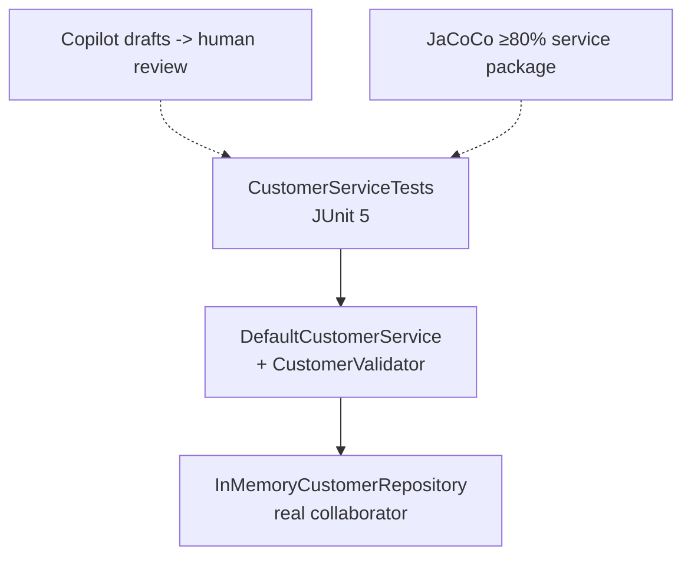

# Lab 17: JUnit Testing with AI Assistance — Northstar CRM Service Tests

> **Participants:** Module sequence is in [`../README.md`](../README.md). **Do not start this guide until** you have finished Module 17 [pre-lab exercises 1–6](../exercises/EXERCISES-INDEX.md) (Pass — check yourself, do not write it down; order **1 → 2 → 3 → 4 → 5 → 6**). Then open **one** OS how-to ([Windows](LAB-17-WINDOWS.md) · [macOS](LAB-17-MACOS.md)). In class, prefer the **45-minute timed path** with [`starter/`](starter/README.md); the **full path** is every Step below (homework / extended). This repo has no answer keys — complete the TODOs yourself. See [Which file do I open?](../../../_PARTICIPANT-FILE-GUIDE.md).

## Activity card

| | |
| --- | --- |
| **Objective** | Ship CustomerServiceTests + parameterized transitions + JaCoCo ≥80% on service package |
| **Skills practiced** | AAA, meaningful asserts, @CsvSource, Surefire, JaCoCo verify gate |
| **Expected outcome** | `mvn clean verify` → **Tests run: 19** (6+2+11) · JaCoCo ≥80% · runbook evidence |
| **Estimated time** | Timed path ~45 min · Full path 3–4 hours |
| **Prerequisites** | Lab 0 · Lab 16 preferred · Exercises 1–6 Pass · JDK 21 · Maven 3.9+ |
| **Expected files** | `examples/lab17-crm/` — service tests, parameterized suite, pom JaCoCo, runbook |
| **Validation checkpoints** | Starter smoke · GUIDE Implementation Checkpoints · JaCoCo package rule |

**Module:** 17 — JUnit Testing Fundamentals  
**Duration:** ~45 minutes (timed path with starter) · Full path: 3–4 Hours

**Primary IDE:** IntelliJ IDEA Community Edition · **Optional IDE:** VS Code

| OS | How-to for this lab |
| -- | ------------------- |
| Windows | [LAB-17-WINDOWS.md](LAB-17-WINDOWS.md) |
| macOS | [LAB-17-MACOS.md](LAB-17-MACOS.md) |

> **Incremental build:** AAA plan → meaningful asserts → CsvSource → names/JaCoCo narrative → Lab 17 `lab17-crm`.

> **Classroom pacing:** [`../PACING.md`](../PACING.md) (Checkpoints A–E).

> **Critical scope:** Meaningful asserts + `mvn clean verify` JaCoCo on `com.northstar.crm.service` ≥ **0.80**. Mockito is **Lab 18**. Review AI drafts — reject Spring phantoms / `assertTrue(true)`.

**Verified participant layout (Windows IntelliJ + PowerShell; Temurin JDK 21.0.11; Maven 3.9.9):**

| Role | Path |
| ---- | ---- |
| IntelliJ opens | `%USERPROFILE%\java-bootcamp` (SDK / language level **21**) |
| Prerequisite | `examples\lab16-crm\` (service + BusinessException) |
| This lab project | `examples\lab17-crm\` (`Copy-Item -Recurse lab16-crm lab17-crm`) |
| Gate | JaCoCo **0.8.12** package rule `com.northstar.crm.service` LINE ≥ **0.80** |
| Formal suites | `CustomerServiceTests` · `CustomerValidatorParameterizedTest` |
| Timed starter suite | `mvn -B clean verify` → **Tests run: 19**, Failures: 0 · **BUILD SUCCESS** (6 service + 2 handler + 11 parameterized) |
| Service coverage | LINE ratio ≈ **0.97** (36 covered / 1 missed) |
| Gate proof | `minimum` 0.99 → rule violated (0.97 &lt; 0.99); restored 0.80 → green |
| Full path (copy `lab16-crm`, 2026-08-11) | `mvn -B clean verify` → **Tests run: 34**, Failures: 0. Service LINE **1.00** (DefaultCustomerService 13/13 + CustomerValidator 22/22). Raising `minimum` to 0.99 alone stays green at 1.00; temporary unused method on `DefaultCustomerService` dropped LINE to **0.92** → `Rule violated … 0.92, but expected minimum is 0.99`; unused method removed and 0.80 restored → green |

**If it fails (Windows PowerShell):** Always `mvn clean verify` so the JaCoCo agent applies. Package include must be exactly `com.northstar.crm.service`. Prefer `assertThrows(BusinessException.class, …)` over bare `Exception`. Do not commit `target\site\jacoco`.

---

## 45-minute timed path (use starter)

In class, use the starter templates so the **core** objectives fit **~45 minutes**. The full Steps below remain for homework / extended depth.

1. Open [`starter/README.md`](starter/README.md).
2. Copy `starter/` into your `java-bootcamp/examples/lab17-crm/` target (see starter README).
3. Fill every `// TODO` — do **not** wait on a perfect prior lab; the starter includes a baseline.
4. Run the starter smoke test. Commit your work to your GitHub repo (no screenshots).
5. Check timed-path Pass criteria in the starter README yourself (do not write the marks down). Continue remaining GUIDE steps as homework if needed.

| Path | Time | Scope |
| ---- | ---- | ----- |
| **Timed (default)** | ~45 min | Starter TODOs + smoke test |
| **Full (extended)** | see Duration | Every Step in this GUIDE |


## What you'll complete (practice only)

Labs and exercises are **practice only**. Nothing is submitted or graded. Do not take screenshots. Check Pass/Fail yourself — do not write those marks anywhere. Commit your work to your private `java-bootcamp` GitHub repo.

Keep this checklist visible while you work.

| # | Deliverable |
| - | ----------- |
| 1 | `CustomerServiceTests` with happy and negative paths |
| 2 | Parameterized transition tests |
| 3 | JaCoCo configuration + evidence of ≥80% on service package |
| 4 | Copilot review notes with human acceptance **or** manual equivalent |
| 5 | Deliberate gate-fail evidence + restore |
| 6 | `mvn clean verify` success log |
| 7 | README runbook + coverage notes |
| 8 | No secrets or generated build directories committed |

**Commit to your GitHub repo:** the items in the table above (sources + evidence + short notes).

**Do not commit:** `target/`, `node_modules/`, secrets, heap dumps, or a copied answer keys.

## Lab Overview

This Module 17 lab formalizes **JUnit 5** testing for the **Customer Management Platform**. You will build `CustomerServiceTests` (and supporting tests), use **parameterized tests** for status transitions, aim for **≥80% line coverage** on the service layer with JaCoCo, and optionally use **GitHub Copilot** to draft tests—with mandatory human review.

## Learning Objectives

After completing this lab, you will be able to:

* Structure JUnit 5 tests with `@BeforeEach`, `@Test`, and clear Arrange–Act–Assert
* Write `CustomerServiceTests` covering create, find, duplicate, and status-change paths
* Use `@ParameterizedTest` / `@CsvSource` (and optionally `@EnumSource`) for transitions
* Configure JaCoCo and interpret a coverage report with a ≥80% service-layer goal
* Generate candidate tests with Copilot (optional) and reject false-confidence assertions

## Business Scenario

Before week’s end, the CRM service will gain Mockito isolation (Lab 18) and later Spring. Leadership freezes:

**No merge of `DefaultCustomerService` changes without JUnit evidence and ≥80% line coverage on `com.northstar.crm.service`.**

You own that gate for Labs 15–16 behavior: Amina (`CUS-1001` ACTIVE), Ravi (`CUS-1002` PROSPECT→ACTIVE), illegal transitions, duplicates, not-found.

Use these examples consistently:

| ID | Name | Notes |
| -- | ---- | ----- |
| `CUS-1001` | Amina Khan | `ACTIVE` — illegal transition target |
| `CUS-1002` | Ravi Singh | `PROSPECT` → `ACTIVE` |
| `CUS-9999` | — | not-found paths |
| `lab-request-001` | — | correlation on changeStatus failures |
| `lab17-001`, … | — | Copilot review entries if used |

**Security note for evidence.** Use fictional emails only. Never commit `target/site/jacoco` HTML if your repo policy forbids generated sites—paste excerpts/screenshots into notes instead.

---

## Architecture Context
### NOW (this lab)



## Prerequisites

Prior labs: [15](../../module-15/lab15/LAB-15-GUIDE.md) · [16](../../module-16/lab16/LAB-16-GUIDE.md).

Confirm (Lab 0 tools assumed):

* JDK 21; Maven; Git
* Lab 15–16 service, validator, exceptions (`lab16-crm/` → `lab17-crm/`)
* JUnit 5 via Maven; GitHub Copilot optional
* No secrets committed to Git

### Pre-flight

```bash
java -version
mvn -version
```

## Worked example (read before you code)

Study this pattern once before Step 1. Your job is to apply the same idea in the Steps — do not skip ahead to a full solution.

```bash
cd ~/java-bootcamp/examples
cp -r lab16-crm lab17-crm
cd lab17-crm
mkdir -p copilot-notes docs
```

**What to notice:** Match names, IDs, and failure behavior from the scenario — instructors check these.

---

## Implementation Steps

Complete each step in order. Commands assume `~/java-bootcamp/examples/lab17-crm` (Windows: `%USERPROFILE%\java-bootcamp\examples\lab17-crm`) unless noted.

---

### Step 1 — Branch Lab 16 and pin Surefire + JaCoCo

**Why:** The quality gate must be executable by CI and peers via `mvn verify`, not a manual checkbox.

**Do this:**

```bash
cd ~/java-bootcamp/examples
cp -r lab16-crm lab17-crm
cd lab17-crm
mkdir -p copilot-notes docs
```

Add Surefire + JaCoCo with **package** rule for `com.northstar.crm.service` and `minimum` `0.80` (as in the module guide). Ensure `junit-jupiter` is test-scoped.

```bash
mvn -q -DincludeArtifactIds=junit-jupiter dependency:tree
```

**Expected result:** JUnit on test classpath; JaCoCo plugin present with service gate.

**If it fails:** Wrong package include string → must match `com.northstar.crm.service` exactly. Old Surefire → use 3.x for JUnit 5.

---

### Step 2 — Write `CustomerServiceTests` happy path

**Why:** Lock create/find/activate before negatives and coverage chasing create noise.

**Do this:** Complete starter `CustomerServiceTests` with `@BeforeEach` wiring fresh `InMemoryCustomerRepository` + `CustomerValidator` + `DefaultCustomerService`. Starter method names:

* `addAndActivateRaviHappyPath` — add Amina ACTIVE + Ravi PROSPECT; activate Ravi with `lab-request-001`
* Expand to **6** service tests total (also `duplicateIdThrowsConflict`, `illegalTransitionThrowsConflict`, `missingCustomerThrowsNotFound`, plus stretch `duplicateEmailThrowsConflict` / `closedToActiveRejected`)

Adapt `Customer` constructors to your entity. Prefer asserting `BusinessException` where Lab 16 types exist.

```bash
mvn -q test -Dtest=CustomerServiceTests
```

**Expected result:** ≥2 tests green; `@BeforeEach` isolation (no static shared service).

**If it fails:** Shared static repo across tests → flake. Constructor mismatch → align with Lab 10–16 entity.

---

### Step 3 — Cover negatives: duplicate, illegal transition, not-found

**Why:** Gates without negatives encourage “coverage of happy lines only.”

**Do this:** Add tests for:

* duplicate customerId (and email if validator enforces it)
* `ACTIVE → PROSPECT` on `CUS-1001` throws; status remains ACTIVE
* `changeStatus("CUS-9999", ...)` not-found / business exception

Prefer `assertThrows(BusinessException.class, ...)` and assert code/message contains correlation when present—stronger than `assertThrows(Exception.class)`.

**Expected result:** Negatives fail for the right reason; Amina still ACTIVE after illegal attempt.

**If it fails:** Wrong exception type after Lab 16 → update expects. Status mutated → production bug from Lab 15; fix production then retest.

---

### Step 4 — Parameterized tests for legal/illegal transitions

**Why:** Transition matrices explode into copy-paste methods; `@CsvSource` keeps the table visible.

**Do this:** Complete starter `CustomerValidatorParameterizedTest` with separate methods `legalTransitions` / `illegalTransitions`. Expand to **11** parameterized invocations (6 legal + 5 illegal). **ACTIVE→PROSPECT is illegal** — never put it in the legal `@CsvSource`. Align rows with Lab 15 ALLOWED map (solution rows: legal PROSPECT→ACTIVE/CLOSED, ACTIVE→SUSPENDED/CLOSED, SUSPENDED→ACTIVE/CLOSED; illegal ACTIVE→PROSPECT, CLOSED→ACTIVE/PROSPECT, PROSPECT→SUSPENDED, ACTIVE→ACTIVE).

```bash
mvn -q test -Dtest=CustomerValidatorParameterizedTest
```

**Expected result:** Multiple parameterized invocations green; illegal rows throw.

**If it fails:** Enum conversion from CSV needs exact names. Align with `CustomerStatus` constants.

---

### Step 5 — Optional Copilot draft + mandatory review

**Why:** AI speed without review recreates Lab 11’s false-confidence problem at formal-gate stakes.

**Do this:** If Copilot is available, prompt for tests covering duplicate email, `listAll`, and correlation on `BusinessException`—fixtures `CUS-1001`/`CUS-1002`, no Spring. Apply checklist:

1. Can every assert fail if production regresses?
2. Shared CRM fixture IDs (not random PII)?
3. No phantom Spring/JPA imports?
4. Independent `@BeforeEach`?
5. `mvn -q test` after edits?

Record `lab17-001` in `copilot-notes/ai-junit-review.md`. If Copilot unavailable, write tests by hand and mark “manual.”

**Expected result:** Dated review entry; at least one weak assertion rejected **or** N/A with rationale.

**If it fails:** Accepted `assertNotNull(service)` only → reject and replace with domain asserts.

---

### Step 6 — Run JaCoCo and read the report

**Why:** The gate is meaningless if you never open the report to see uncovered branches.

**Do this:**

```bash
mvn -q clean verify
```

Open `target/site/jacoco/index.html` (or CSV). Inspect `com.northstar.crm.service`. If below 80%, add focused tests (CLOSED transitions, email duplicate, `listAll`).

**Expected result:** `BUILD SUCCESS`; COVEREDRATIO ≥ 0.80 for service package.

**If it fails:** Forgot `clean` → agent not applied. Package empty of classes → wrong include or tests not exercising service.

---

### Step 7 — Fail the gate deliberately once

**Why:** Trust the gate by watching it fail, then restoring a honest 0.80 config.

**Do this:** Temporarily set `minimum` to `0.99` **or** delete one meaningful test; run `mvn -q verify`; capture violation message; restore passing 0.80 configuration and tests.

**Expected result:** Recorded rule violation, then restored `BUILD SUCCESS`.

**If it fails:** “Cheating” with broad excludes → do not leave excludes in the submitted POM.

---

### Step 8 — Document the runbook

**Why:** The next engineer must reproduce green verify without Slack archaeology.

**Do this:** README / `docs/coverage-notes.md` with:

```bash
mvn -q test
mvn -q clean verify   # includes JaCoCo check
```

List test classes, coverage goal, Copilot review policy, and which branch closed the last coverage gap.

**Expected result:** Peer can reproduce green verify from README alone.

**If it fails:** Missing JaCoCo commands next to “how to run app” → add them.

---

### Step 9 — Failure experiments + evidence pack

**Why:** Flaky patterns and false confidence are the failure modes of this lab’s culture.

**Do this:** Complete Failure Experiments. Commit your work to your GitHub repo. Do not take screenshots. Run `mvn -q test` twice for determinism.

**Expected result:** ≥3 experiments; identical consecutive runs; evidence saved; `git status` clean of `target/`.

**If it fails:** See Troubleshooting.

---

## Implementation Checkpoints

### Checkpoint A — Tooling

_Check **Pass** or **Fail** yourself. Do not write these marks anywhere — nothing is submitted or graded. Commit your work to your GitHub repo._

| # | Confirm | Self-check |
| - | ------- | ---------- |
| 1 | `lab17-crm` under `examples/` | Pass / Fail |
| 2 | Surefire 3.x + JaCoCo with service `0.80` rule | Pass / Fail |
| 3 | JUnit 5 on test classpath | Pass / Fail |

### Checkpoint B — Core suite

_Check **Pass** or **Fail** yourself. Do not write these marks anywhere — nothing is submitted or graded. Commit your work to your GitHub repo._

| # | Confirm | Self-check |
| - | ------- | ---------- |
| 1 | Happy path: add/find Amina; activate Ravi | Pass / Fail |
| 2 | Negatives: duplicate, illegal transition, not-found | Pass / Fail |
| 3 | Parameterized legal/illegal transitions | Pass / Fail |

### Checkpoint C — Gate + AI discipline

_Check **Pass** or **Fail** yourself. Do not write these marks anywhere — nothing is submitted or graded. Commit your work to your GitHub repo._

| # | Confirm | Self-check |
| - | ------- | ---------- |
| 1 | `mvn clean verify` passes ≥80% service coverage | Pass / Fail |
| 2 | Deliberate gate failure recorded then restored | Pass / Fail |
| 3 | Copilot review log or manual equivalent | Pass / Fail |

### Checkpoint D — Hygiene

_Check **Pass** or **Fail** yourself. Do not write these marks anywhere — nothing is submitted or graded. Commit your work to your GitHub repo._

| # | Confirm | Self-check |
| - | ------- | ---------- |
| 1 | Two consecutive `mvn test` identical success | Pass / Fail |
| 2 | README runbook complete | Pass / Fail |
| 3 | No secrets / committed jacoco site / `target/` | Pass / Fail |

---

## Reference Commands, Configuration, and Code

### Parameterized excerpt

```java
import org.junit.jupiter.params.provider.CsvSource;
import org.junit.jupiter.params.ParameterizedTest;

@ParameterizedTest
@CsvSource({
        "PROSPECT,ACTIVE",
        "PROSPECT,CLOSED",
        "ACTIVE,SUSPENDED",
        "ACTIVE,CLOSED",
        "SUSPENDED,ACTIVE",
        "SUSPENDED,CLOSED"
})
void legalTransitions(CustomerStatus from, CustomerStatus to) { ... }

@ParameterizedTest
@CsvSource({
        "ACTIVE,PROSPECT",   // illegal — not a legal row
        "CLOSED,ACTIVE",
        "CLOSED,PROSPECT",
        "PROSPECT,SUSPENDED",
        "ACTIVE,ACTIVE"
})
void illegalTransitions(CustomerStatus from, CustomerStatus to) { ... }
```

### Commands

```bash
cd ~/java-bootcamp/examples/lab17-crm
mvn -q test
mvn -q clean verify
mvn -q test -Dtest=CustomerServiceTests
mvn -q test -Dtest=CustomerValidatorParameterizedTest
git status
```

## Failure Experiments

| # | Experiment | Observe | Restore |
| - | ---------- | ------- | ------- |
| 1 | Break DI wiring in `@BeforeEach` | Tests fail clearly | Fix collaborators |
| 2 | Expect illegal transition to succeed | Red test | Fix expectation |
| 3 | Run `mvn -q test` twice | Identical results | Keep isolation |
| 4 | Add `Thread.sleep` then remove | Documents why sleeps banned | Remove sleep |
| 5 | Raise coverage minimum to 0.99 | JaCoCo rule fails | Restore 0.80 |

---

## Troubleshooting

| Symptom | Likely cause | Fix |
| ------- | ------------ | --- |
| Tests not discovered | Naming/path | `*Test`/`*Tests` under `src/test/java` |
| JaCoCo check skipped | No `clean` / agent | `mvn clean verify` |
| Package ratio 0% | Wrong include / no execution | Fix package name; ensure tests call service |
| Flaky tests | Shared static state | Fresh repo per `@BeforeEach` |
| False confidence | Trivial asserts | Assert IDs, status, exception codes |
| Copilot Spring imports | Underspecified prompt | Reject; restate plain Java |
| Gate fails at 0.99 after proof | Left minimum too high | Restore `0.80` and re-verify |
| `assertThrows(Exception)` too broad | Wrong type | Prefer `BusinessException` |

## Security and Production Review

Optional — jot brief notes in your README if useful for your progress check (not a separate essay):

1. Which inputs are untrusted (production inputs; tests use fixtures only)?
2. Where are authn/authz/validation enforced (still service/facade; tests don’t replace auth)?
3. Which values are sensitive—never in test code beyond samples?

---


## Cleanup

```bash
cd ~/java-bootcamp/examples/lab17-crm
mvn -q clean
git status
```

Do not commit `target/site/jacoco` unless your course policy explicitly allows it. Keep notes screenshots/excerpts.

**Keep `lab17-crm`**—Lab 18 introduces Mockito isolation on this suite’s seams.


## Reflection Questions

Write **1–3 sentence** answers (not essays):

1. Which design decision most affected correctness?
2. What evidence proves the implementation works?
3. Which failure was hardest to diagnose?

---


