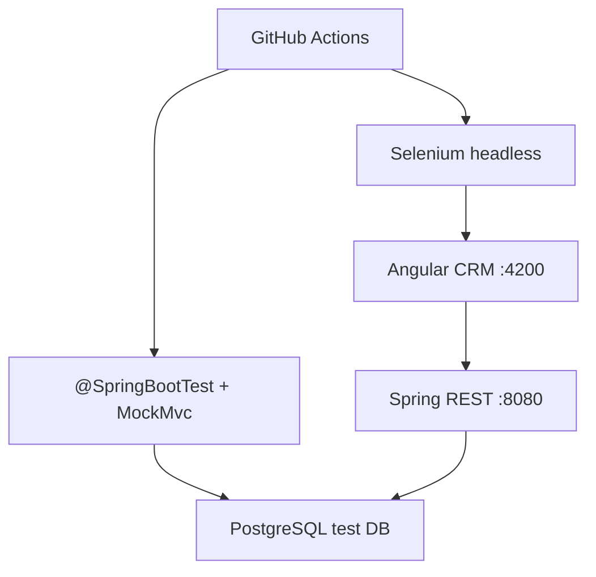

# Lab 19: Integration Testing and UI Test Automation — Northstar CRM Angular + Boot

> **Participants:** Module sequence is in [`../README.md`](../README.md). Open **one** OS how-to ([Windows](LAB-19-WINDOWS.md) · [macOS](LAB-19-MACOS.md)). In class, follow **[STEPS.md](STEPS.md)** then the **45-minute timed path** with [`starter/`](starter/README.md); the **full path** is every Step below (homework / extended). This repo has no answer keys — complete the TODOs yourself. See [Which file do I open?](../../../_PARTICIPANT-FILE-GUIDE.md).

## Activity card

| | |
| --- | --- |
| **Objective** | Ship Boot integration tests + Selenium against Angular CRM screens |
| **Skills practiced** | `@SpringBootTest` / MockMvc, PostgreSQL test DB strategy, WebDriver waits, GHA notes |
| **Expected outcome** | Green API IT · one Angular UI flow · CI headless notes |
| **Estimated time** | Timed path ~45 min · Full path 3–4 hours |
| **Prerequisites** | Lab 0 · JDK 21 · Maven 3.9+ · Node/Angular CLI · Chrome/Chromium |
| **Expected files** | `examples/lab19-crm/` — Boot IT + Selenium + docs |
| **Validation checkpoints** | Starter smoke · GUIDE Implementation Checkpoints |

**Module:** 19 — Integration Testing and UI Test Automation  
**Duration:** ~45 minutes (timed path with starter) · Full path: 3–4 Hours

**Primary IDE:** IntelliJ IDEA Community Edition · **Optional IDE:** VS Code

| OS | How-to for this lab |
| -- | ------------------- |
| Windows | [LAB-19-WINDOWS.md](LAB-19-WINDOWS.md) |
| macOS | [LAB-19-MACOS.md](LAB-19-MACOS.md) |

> **Incremental build:** Test pyramid note → Boot IT → PostgreSQL strategy → Angular selectors → Selenium flow → GitHub Actions headless stage.

> **Critical scope:** Backend IT with **PostgreSQL** test strategy (Testcontainers *or* dedicated test DB — document which). UI automation targets **Angular** (not React). CI notes use **GitHub Actions**. Correlation `lab-request-001` on API calls.

---

## 45-minute timed path (use starter)

1. Open [`starter/README.md`](starter/README.md).
2. Copy `starter/` into `java-bootcamp/examples/lab19-crm/`.
3. Fill `// TODO` in MockMvc IT + one Selenium test (stable `data-testid` selectors).
4. Run smoke tests. Commit your work to your GitHub repo (no screenshots).
5. Mark timed-path Pass criteria; finish GHA notes as homework if needed.

| Path | Time | Scope |
| ---- | ---- | ----- |
| **Timed (default)** | ~45 min | One Boot IT + one Selenium happy path |
| **Full (extended)** | see Duration | PostgreSQL strategy depth + GHA workflow notes |

---

## What you'll complete (practice only)

Labs and exercises are **practice only**. Nothing is submitted or graded. Do not take screenshots. Check Pass/Fail yourself — do not write those marks anywhere. Commit your work to your private `java-bootcamp` GitHub repo.

| # | Deliverable |
| - | ----------- |
| 1 | `@SpringBootTest` + MockMvc (or WebTestClient) IT for Customer GET/POST |
| 2 | PostgreSQL test DB strategy notes (`docs/postgres-test-strategy.md`) |
| 3 | Selenium test against Angular customer list/detail or create form |
| 4 | Explicit waits + stable selectors (`data-testid`) |
| 5 | GitHub Actions headless Selenium stage notes (or workflow snippet) |
| 6 | Evidence for CUS-1001 / CUS-1002 / `lab-request-001` |
| 7 | No secrets, no committed ChromeDriver binaries if avoidable |

## Lab Overview

This Module 19 lab connects the pyramid: Spring Boot integration tests for the REST Customer API, a clear **PostgreSQL** test-data strategy, and Selenium WebDriver flows against the **Angular** CRM UI, with notes for running headless in **GitHub Actions**.

## Learning Objectives

After completing this lab, you will be able to:

* Write a Boot integration test with `@SpringBootTest` and MockMvc for Customer endpoints
* Choose and document a PostgreSQL-backed test DB approach (container or shared test instance)
* Drive an Angular screen with WebDriver using stable selectors and explicit waits
* Automate form input, button click, and simple navigation
* Sketch a GitHub Actions job that runs API tests and headless UI tests

## Business Scenario

Northstar will not ship CRM changes that only unit-test the service. Your lead freezes:

**Every merge needs Boot IT against a PostgreSQL test strategy and at least one Selenium path on the Angular UI for Amina/Ravi.**

| ID | Name | Status |
| -- | ---- | ------ |
| `CUS-1001` | Amina Khan | `ACTIVE` |
| `CUS-1002` | Ravi Singh | `PROSPECT` |
| `lab-request-001` | — | `X-Correlation-Id` |

**Security note.** Fictional emails only. Never commit DB passwords; use env vars / GitHub Secrets in CI notes.

---

## Architecture Context
### NOW (this lab)



## Prerequisites

* JDK 21; Maven; Git; Node 20+ / Angular CLI for UI
* Chrome or Chromium + matching WebDriver (or Selenium Manager)
* Boot Customer API available (starter embeds a minimal slice)

### Pre-flight

```bash
java -version
mvn -version
node -v
ng version || npx -y @angular/cli version
```

## Worked example (read before you code)

```java
@SpringBootTest(webEnvironment = SpringBootTest.WebEnvironment.RANDOM_PORT)
@AutoConfigureMockMvc
class CustomerApiIT {
  @Autowired MockMvc mockMvc;

  @Test
  void getAmina_returns200() throws Exception {
    mockMvc.perform(get("/api/customers/CUS-1001")
        .header("X-Correlation-Id", "lab-request-001"))
      .andExpect(status().isOk())
      .andExpect(jsonPath("$.id").value("CUS-1001"));
  }
}
```

**What to notice:** HTTP semantics + fixture IDs in assertions — not only `is2xxSuccessful()`.

---

## Implementation Steps

Commands assume `~/java-bootcamp/examples/lab19-crm`.

### Step 1 — Copy starter and confirm layout

**Why:** Timed path needs both `backend/` (Boot) and `ui/` (Angular) slices.

**Do this:**

```bash
# See starter/README.md copy commands
cd ~/java-bootcamp/examples/lab19-crm
```

**Expected result:** Backend Maven module + Angular app (or `ui/` folder) present.

**If it fails:** Missing Node → install LTS before UI steps; API IT can still green.

---

### Step 2 — Document PostgreSQL test strategy

**Why:** H2-only habits diverge from production PostgreSQL and hide SQL dialect issues.

**Do this:** Write `docs/postgres-test-strategy.md` covering **one** approach:

| Option | When to use | Notes |
| ------ | ----------- | ----- |
| A — Testcontainers PostgreSQL | Local Docker available | Prefer for CI parity |
| B — Dedicated test database | Shared lab Postgres | Use profile `test`; wipe/seed per class |
| C — Deferred container + profile stub | Timed path only | Must still document how full path switches off H2 |

State seed rules: insert/upsert `CUS-1001` Amina ACTIVE, `CUS-1002` Ravi PROSPECT before IT class.

**Expected result:** One chosen option with connection/env notes (no real passwords).

**If it fails:** Copy-pasting Oracle JDBC URLs → replace with PostgreSQL (`jdbc:postgresql://...`).

---

### Step 3 — Boot integration test (MockMvc)

**Why:** Proves REST mapping + JSON without a real browser.

**Do this:** Complete `CustomerApiIT`:

1. GET `CUS-1001` → 200 + name Amina Khan  
2. GET `CUS-9999` → 404 (or documented error contract)  
3. POST create with header `X-Correlation-Id: lab-request-001` → 201  

```bash
cd ~/java-bootcamp/examples/lab19-crm
mvn -B test -Dtest=CustomerApiIT
```

**Expected result:** IT green; assertions on id/status/correlation behavior.

**If it fails:** Port conflict → use `RANDOM_PORT` + MockMvc (no fixed 8080). Wrong content type → `application/json`.

---

### Step 4 — Angular stable selectors

**Why:** CSS class churn and deep XPath make flaky UI tests.

**Do this:** On customer list/detail (or starter template), ensure:

* `data-testid="customer-list"`
* `data-testid="customer-row-CUS-1001"`
* `data-testid="customer-create-name"` / `customer-create-submit`

Document selector policy in `docs/selenium-selectors.md` (prefer `data-testid` / id over brittle CSS).

**Expected result:** At least three stable hooks in the Angular template.

**If it fails:** Selecting by visible text only → add `data-testid`.

---

### Step 5 — Selenium happy path with explicit waits

**Why:** Angular renders asynchronously; `Thread.sleep` is flaky.

**Do this:** Implement `CustomerUiSeleniumIT` (or `*Test`):

1. Open `http://localhost:4200` (or starter URL)  
2. `WebDriverWait` until `customer-list` visible  
3. Assert Amina row visible; navigate to detail if route exists  
4. Optional: fill create form and submit; assert success toast/row  

```bash
# Terminal 1: API · Terminal 2: ng serve · Terminal 3:
mvn -B test -Dtest=CustomerUiSeleniumIT
```

**Expected result:** One green UI test using explicit waits (timeout ~10s).

**If it fails:** Driver mismatch → let Selenium Manager resolve; UI not up → start `ng serve` first. Element not found → verify `data-testid`.

---

### Step 6 — GitHub Actions headless notes

**Why:** Classroom demos use headed Chrome; CI needs headless + artifacts.

**Do this:** Add `docs/github-actions-ui-tests.md` (or `.github/workflows/lab19-tests.yml` snippet) describing:

* Job matrix: `api-it` (`mvn -B test -Dtest=CustomerApiIT`) then `ui-it`
* Headless Chrome flags (`--headless=new`, `--no-sandbox` as required by runner)
* Upload screenshot artifacts on failure
* Secrets: `DATABASE_URL` / Postgres service container — **not** Bitbucket Pipelines

**Expected result:** Written stage list a reviewer can paste into Actions.

**If it fails:** Referencing Bitbucket → rewrite to GitHub Actions only.

---

### Step 7 — Evidence pack

**Do this:** Capture Surefire output + one Selenium run (or failure screenshot policy). Confirm fixtures and `lab-request-001` appear in API IT.

**Expected result:** Work committed to your GitHub repo; no secrets; no screenshots.

---

## Implementation Checkpoints

### Checkpoint A — Backend IT

| # | Confirm | Self-check |
| - | ------- | ---------- |
| 1 | `CustomerApiIT` green | Pass / Fail |
| 2 | PostgreSQL strategy doc present | Pass / Fail |
| 3 | Correlation header used in at least one call | Pass / Fail |

### Checkpoint B — Angular UI automation

| # | Confirm | Self-check |
| - | ------- | ---------- |
| 1 | Stable `data-testid` selectors | Pass / Fail |
| 2 | Selenium test uses explicit wait | Pass / Fail |
| 3 | Amina and/or Ravi asserted in UI | Pass / Fail |

### Checkpoint C — CI + hygiene

| # | Confirm | Self-check |
| - | ------- | ---------- |
| 1 | GitHub Actions headless notes present | Pass / Fail |
| 2 | No Oracle/React-as-taught-path wording | Pass / Fail |
| 3 | No secrets committed | Pass / Fail |

---

## Reference Commands

```bash
cd ~/java-bootcamp/examples/lab19-crm
mvn -B test -Dtest=CustomerApiIT
# UI stack:
# ng serve --port 4200
# mvn -B test -Dtest=CustomerUiSeleniumIT
```

## Failure Experiments

| # | Experiment | Observe | Restore |
| - | ---------- | ------- | ------- |
| 1 | Remove wait; use immediate find | Flaky NoSuchElement | Restore WebDriverWait |
| 2 | Wrong customer id in assert | IT fails clearly | Keep fixture ids |
| 3 | Point JDBC to wrong DB | Connection errors | Fix test profile |
| 4 | Run Selenium before `ng serve` | Connection refused | Start UI first |

## Troubleshooting

| Symptom | Likely cause | Fix |
| ------- | ------------ | --- |
| Flaky UI | No wait / bad selector | Explicit wait + `data-testid` |
| ChromeDriver errors | Version skew | Selenium Manager / matching browser |
| IT hits empty DB | Seeds missing | Flyway/Liquibase/SQL seed in test |
| CI only | Missing headless flags | See GHA notes |
| React selectors in docs | Wrong stack | Angular templates only |

## Cleanup

```bash
# Stop ng serve / Boot
mvn -q clean
git status
```

**Keep `lab19-crm`** — later modules deepen JPA/Postgres and OpenShift deploy checks.

## Reflection Questions

1. What belongs in MockMvc IT vs Selenium?
2. Why document PostgreSQL strategy even if timed path uses a stub profile?
3. Which selector choice reduced flake risk most?

---

## Pass criteria

_Check **Pass** or **Fail** yourself. Do not write these marks anywhere — nothing is submitted or graded. Commit your work to your GitHub repo._

| # | Confirm | Self-check |
| - | ------- | ---------- |
| 1 | Boot Customer IT green with fixtures | Pass / Fail |
| 2 | PostgreSQL test strategy documented | Pass / Fail |
| 3 | Selenium Angular flow with waits green (or timed-path partial + plan) | Pass / Fail |
| 4 | GitHub Actions headless notes present | Pass / Fail |
