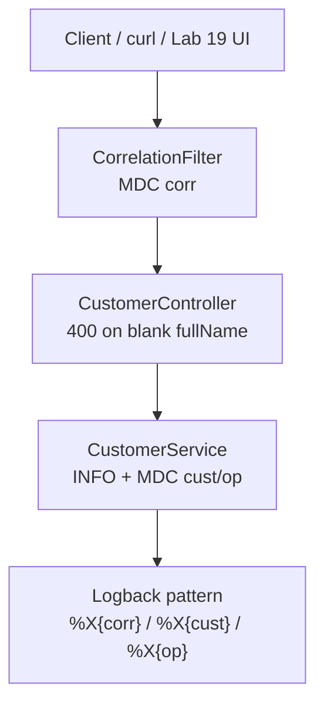

# Lab 20: Structured Logging — Northstar CRM Traceable Operations

> **Participants:** Module sequence is in [`../README.md`](../README.md). **Do not start this guide until** you have finished Module 20 [pre-lab exercises 1–6](../exercises/EXERCISES-INDEX.md) (Pass — check yourself, do not write it down; order **1 → 2 → 3 → 4 → 5 → 6**). Then open **one** OS how-to ([Windows](LAB-20-WINDOWS.md) · [macOS](LAB-20-MACOS.md)). In class, prefer the **45-minute timed path** with [`starter/`](starter/README.md); the **full path** is every Step below (homework / extended). This repo has no answer keys — complete the TODOs yourself. See [Which file do I open?](../../../_PARTICIPANT-FILE-GUIDE.md).

## Activity card

| | |
| --- | --- |
| **Objective** | Ship Logback structured pattern + CorrelationFilter MDC + PII-free service logs |
| **Skills practiced** | SLF4J/Logback, MDC put/clear, safe INFO lines, logging IT asserts |
| **Expected outcome** | Green `CustomerLoggingIT` · corr/cust/op in logs · no Amina/email PII |
| **Estimated time** | Timed path ~45 min · Full path 3–4 hours |
| **Prerequisites** | Lab 0 · Lab 19 preferred · Exercises 1–6 Pass · JDK 21 · Maven 3.9+ |
| **Expected files** | `examples/lab20-crm/` — logback-spring.xml, filter, service logs, IT, docs |
| **Validation checkpoints** | Starter smoke `CustomerLoggingIT` · GUIDE Implementation Checkpoints |

**Module:** 20 — Structured Logging  
**Duration:** ~45 minutes (timed path with starter) · Full path: 3–4 Hours

**Primary IDE:** IntelliJ IDEA Community Edition · **Optional IDE:** VS Code

| OS | How-to for this lab |
| -- | ------------------- |
| Windows | [LAB-20-WINDOWS.md](LAB-20-WINDOWS.md) |
| macOS | [LAB-20-MACOS.md](LAB-20-MACOS.md) |

> **Incremental build:** Levels → safe logs → MDC lifecycle/clear → PII checklist → Lab 20.

> **Classroom pacing:** [`../PACING.md`](../PACING.md) (Checkpoints A–E).

> **Critical scope:** MDC **clear in finally**. Never log **fullName/email**. Pattern includes **%X{corr}/%X{cust}/%X{op}**. Actuator/metrics are **Lab 21**.

## 45-minute timed path (use starter)

In class, use the starter templates so the **core** objectives fit **~45 minutes**. The full Steps below remain for homework / extended depth.

1. Open [`starter/README.md`](starter/README.md).
2. Copy `starter/` into your `java-bootcamp/examples/lab20-crm/` target (see starter README).
3. Fill every `// TODO` — do **not** wait on a perfect prior lab; the starter includes a baseline.
4. Run the starter smoke test. Commit your work to your GitHub repo (no screenshots).
5. Check timed-path Pass criteria in the starter README yourself (do not write the marks down). Continue remaining GUIDE steps as homework if needed.

| Path | Time | Scope |
| ---- | ---- | ----- |
| **Timed (default)** | ~45 min | Starter TODOs + smoke test |
| **Full (extended)** | see Duration | Every Step in this GUIDE |


## What you'll complete (practice only)

Labs and exercises are **practice only**. Nothing is submitted or graded. Do not take screenshots. Check Pass/Fail yourself — do not write those marks anywhere. Commit your work to your private `java-bootcamp` GitHub repo.

Keep this checklist visible while you work.

| # | Deliverable |
| - | ----------- |
| 1 | `logback-spring.xml` (or equivalent) structured pattern |
| 2 | `CorrelationFilter` with MDC lifecycle |
| 3 | CustomerService logging without PII (controller WARN optional) |
| 4 | Automated `CustomerLoggingIT` output |
| 5 | Successful-path evidence (`CUS-1001` / `CUS-1002` / `lab-request-001`) |
| 6 | Controlled-failure evidence (WARN/ERROR samples) |
| 7 | `docs/logging.md` contract |
| 8 | Run and cleanup instructions |

**Commit to your GitHub repo:** the items in the table above (sources + evidence + short notes).

**Do not commit:** `target/`, `node_modules/`, secrets, heap dumps, or a copied answer keys.

## Lab Overview

This Module 20 lab extends the **Customer Management Platform** with **SLF4J** and **Logback** structured logging for customer operations. You introduce correlation IDs, consistent message patterns, and safe field selection so support can trace create/get flows without logging personally identifiable information (PII).

## Learning Objectives

After completing this lab, you will be able to:

* Add SLF4J API usage and Logback as the binding in a Maven CRM module
* Configure console (and optional file) appenders with a structured pattern layout
* Propagate correlation IDs via MDC across controller and service calls
* Log customer operations using stable IDs (`CUS-1001`) without names, emails, or phones
* Distinguish INFO vs WARN vs ERROR for CRM create/get and validation failures

## Business Scenario

The CRM stores customer identity, contact details, lifecycle status, and financial accounts. Support escalations fail when logs say “error creating customer” with no correlation and when “helpful” logs dump Amina’s email into Splunk.

Leadership freezes:

**Structured logs with MDC correlation and customer IDs. No PII in logs. Clear MDC after every request.**

Use these examples consistently:

| ID | Name | Notes |
| -- | ---- | ----- |
| `CUS-1001` | Amina Khan | `ACTIVE` — create/get INFO traces (ID only in logs) |
| `CUS-1002` | Ravi Singh | `PROSPECT` — second customer + validation WARN demos |
| `lab-request-001` | — | `X-Correlation-Id` / MDC `corr` |
| ISO-8601 UTC | — | prefer ISO timestamps in pattern |

**MDC keys (starter contract):** `corr` · `cust` · `op` (values `create` / `get`). Logback labels them as `corr=%X{corr} cust=%X{cust} op=%X{op}`.

**PII rule for this lab.** You may store full names in the domain model for CRM functionality, but **never** write full name, email, phone, address, passwords, tokens, or PAN into log messages or MDC.

**Security note for evidence.** Sanitize pasted log excerpts. Prefer committing patterns and contracts—not production dumps.

---

## Architecture Context
### NOW (this lab)



## Prerequisites

Prior labs: [18](../../module-18/lab18/LAB-18-GUIDE.md) · [19](../../module-19/lab19/LAB-19-GUIDE.md).

Confirm (Lab 0 tools assumed):

* JDK 21; Maven; Git
* Existing CRM customer create/get endpoints from Lab 19
* SLF4J/Logback via Spring Boot starters or explicit dependencies
* No secrets committed to Git

### Pre-flight

```bash
java -version
mvn -version
```

## Worked example (read before you code)

Study this pattern once before Step 1. Your job is to apply the same idea in the Steps — do not skip ahead to a full solution.

```bash
mvn spring-boot:run

curl -s -D - -H "X-Correlation-Id: lab-request-001" \
  -H "Content-Type: application/json" \
  -d '{"customerId":"CUS-1001","fullName":"Amina Khan","status":"ACTIVE"}' \
  http://localhost:8080/api/customers

curl -s -H "X-Correlation-Id: lab-request-001" \
  http://localhost:8080/api/customers/CUS-1001

curl -s -H "X-Correlation-Id: lab-request-001" \
  -H "Content-Type: application/json" \
  -d '{"customerId":"CUS-1002","fullName":"Ravi Singh","status":"PROSPECT"}' \
  http://localhost:8080/api/customers
```

**What to notice:** Match names, IDs, and failure behavior from the scenario — instructors check these.

---

## Implementation Steps

Complete each step in order. Commands assume `~/java-bootcamp/examples/lab20-crm` (Windows: `%USERPROFILE%\java-bootcamp\examples\lab20-crm`) unless noted.

---

### Step 1 — Branch Lab 19 and confirm SLF4J / Logback

**Why:** Competing logging frameworks and leftover `System.out` make “structure” impossible to enforce.

**Do this:**

**Timed path (classroom default):** copy [`starter/`](starter/README.md) into `~/java-bootcamp/examples/lab20-crm` (see starter README). The starter already includes the CRM baseline + logging TODOs.

**Full path (from Lab 19):** 

```bash
cd ~/java-bootcamp/examples
cp -r lab19-crm lab20-crm
cd lab20-crm
mkdir -p docs
  src/main/java/com/northstar/crm/logging \
  src/test/java/com/northstar/crm/logging
```

`spring-boot-starter-web` already brings Logback; keep one binding. In code, import only `org.slf4j.Logger` / `LoggerFactory`—not `java.util.logging` for CRM services.

```bash
mvn -q dependency:tree | grep -iE "logback|slf4j" || mvn -q dependency:tree | findstr /i "logback slf4j"
```

**Expected result:** `logback-classic` and `slf4j-api` present; `BUILD SUCCESS`.

**If it fails:** Hard `log4j` / JUL bridge conflict → exclude competing bindings; follow Boot logging docs. Pure non-Boot module → add `spring-boot-starter` or explicit Logback deps.

---

### Step 2 — Configure a structured Logback pattern

**Why:** Without a shared pattern, MDC keys exist in code but never appear in operator-visible lines.

**Do this:** Confirm (or create) `src/main/resources/logback-spring.xml` — the starter already ships this pattern; fill any remaining TODO and keep the MDC key names **`corr` / `cust` / `op`**:

```xml
<configuration>
  <include resource="org/springframework/boot/logging/logback/defaults.xml"/>
  <appender name="CONSOLE" class="ch.qos.logback.core.ConsoleAppender">
    <encoder>
      <pattern>%d{ISO8601} %-5level [%thread] %logger{36} corr=%X{corr} cust=%X{cust} op=%X{op} - %msg%n</pattern>
    </encoder>
  </appender>
  <logger name="com.northstar.crm" level="INFO"/>
  <root level="INFO">
    <appender-ref ref="CONSOLE"/>
  </root>
</configuration>
```

JSON encoding is optional bonus; key=value / `%X{...}` is enough for this lab. Avoid committing a conflicting plain `logback.xml` that overrides Boot’s Spring-aware config accidentally.

**Expected result:** App starts; CRM logger lines include `corr=` / `cust=` / `op=` placeholders when MDC is empty or filled.

**If it fails:** Pattern ignored → check for competing `logback.xml`. No MDC keys ever → filter not registered yet (Step 3). Too noisy third-party DEBUG → keep root INFO; raise only `com.northstar.crm` as needed.

---

### Step 3 — Add `CorrelationFilter` / interceptor

**Why:** Correlation must enter MDC once per request and always leave—leaks across Tomcat threads corrupt the next tenant’s traces.

**Do this:** Complete the starter `CorrelationFilter.java` TODOs (MDC key is **`corr`**, matching `%X{corr}`):

```java
import jakarta.servlet.FilterChain;
import jakarta.servlet.ServletException;
import jakarta.servlet.http.HttpServletRequest;
import jakarta.servlet.http.HttpServletResponse;
import java.io.IOException;
import org.slf4j.MDC;
import org.springframework.stereotype.Component;
import org.springframework.web.filter.OncePerRequestFilter;

@Component
public class CorrelationFilter extends OncePerRequestFilter {
  public static final String HEADER = "X-Correlation-Id";

  @Override
  protected void doFilterInternal(HttpServletRequest request, HttpServletResponse response,
                                  FilterChain filterChain) throws ServletException, IOException {
    String cid = request.getHeader(HEADER);
    if (cid == null || cid.isBlank()) {
      cid = "lab-request-001";
    }
    MDC.put("corr", cid);
    response.setHeader(HEADER, cid);
    try {
      filterChain.doFilter(request, response);
    } finally {
      MDC.clear();
    }
  }
}
```

Never put Authorization headers or raw request bodies into MDC.

**Expected result:**

```bash
curl -H "X-Correlation-Id: lab-request-001" http://localhost:8080/api/customers/CUS-1001
```

Response header echoes correlation; log lines show `corr=lab-request-001` for that request.

**If it fails:** Filter not invoked → ensure `@Component` under component scan / Boot app package. MDC empty in service → clear happening too early, or async thread without context copy. Header never returned → set on response before/during filter as shown.

---

### Step 4 — Instrument `CustomerService` create/get

**Why:** Service-layer ops are what support searches; logs must carry IDs and outcomes—not Amina’s phone.

**Do this:** Complete the starter TODOs. Set MDC **`cust`** and **`op`** (`create` / `get`) — do **not** log `fullName` or email. The filter owns `MDC.clear()`; the service only puts op-scoped keys:

```java
import org.slf4j.Logger;
import org.slf4j.LoggerFactory;
import org.slf4j.MDC;
import java.util.Optional;

private static final Logger log = LoggerFactory.getLogger(CustomerService.class);

public Customer create(Customer customer, String correlationId) {
  String customerId = customer.getCustomerId();
  MDC.put("cust", customerId);
  MDC.put("op", "create");
  log.info("create customer id={}", customerId);
  if (customerId == null || customerId.isBlank()) {
    log.warn("reject create reason=missing_customer_id");
    throw new IllegalArgumentException("customerId required [" + correlationId + "]");
  }
  return repository.save(customer);
}

public Optional<Customer> findById(String customerId) {
  MDC.put("cust", customerId);
  MDC.put("op", "get");
  log.info("get customer id={}", customerId);
  return repository.findById(customerId);
}
```

Do **not** call `MDC.clear()` in the service — that would wipe `corr` mid-request. Optional homework: `MDC.remove("cust")` / `MDC.remove("op")` in a `finally` if you want tighter scoping; the starter solution relies on the filter’s full clear.

**Expected result:** Creating or getting `CUS-1001` yields lines with `corr=lab-request-001 cust=CUS-1001 op=create` (or `op=get`) and **no** “Amina” or email.

**If it fails:** PII still appears → search for string concat of `fullName`/`email` and delete. `op` blank → MDC put after early return. Stack traces with payloads → avoid logging request bodies in ERROR helpers.

---

### Step 5 — Controller validation boundary (full path)

**Why:** Rejecting bad input without a log line forces operators into HTTP-only forensics.

**Timed path:** The starter `CustomerController` already returns **400** when `fullName` is blank and echoes `X-Correlation-Id`. No starter TODO required here.

**Full path (optional homework):** Add a SLF4J WARN with a reason code — log `customerId`, never `fullName`:

```java
import org.slf4j.Logger;
import org.slf4j.LoggerFactory;
import org.springframework.http.ResponseEntity;

private static final Logger log = LoggerFactory.getLogger(CustomerController.class);

// inside create(...):
if (body.getFullName() == null || body.getFullName().isBlank()) {
  log.warn("Rejecting create reason=missing_full_name customerId={}", body.getCustomerId());
  return ResponseEntity.badRequest().header("X-Correlation-Id", corr).build();
}
```

**Expected result:** POST with blank name → 400; optional WARN includes `reason=missing_full_name` and correlation; request body not echoed into logs.

**If it fails:** 400 without WARN → add log before return (full path only). WARN includes name → remove it. Controller logs every successful body → too chatty/PII-risky; keep INFO thin.

---

### Step 6 — Exercise `CUS-1001` and `CUS-1002` traces

**Why:** Pattern configuration without exercised paths does not prove searchability for support.

**Do this:** Run the app and issue create/get for both lab customers. Save a sanitized excerpt into `notes/`:

```bash
mvn spring-boot:run

curl -s -D - -H "X-Correlation-Id: lab-request-001" \
  -H "Content-Type: application/json" \
  -d '{"customerId":"CUS-1001","fullName":"Amina Khan","status":"ACTIVE"}' \
  http://localhost:8080/api/customers

curl -s -H "X-Correlation-Id: lab-request-001" \
  http://localhost:8080/api/customers/CUS-1001

curl -s -H "X-Correlation-Id: lab-request-001" \
  -H "Content-Type: application/json" \
  -d '{"customerId":"CUS-1002","fullName":"Ravi Singh","status":"PROSPECT"}' \
  http://localhost:8080/api/customers
```

**Expected result:** Requests succeed (or duplicate create is explained); logs show `corr=lab-request-001` for both; ops `create` / `get` with `cust=CUS-1001` and `cust=CUS-1002`.

**If it fails:** Correlation missing on get-only → filter not applied to that path. Duplicate unexplained → add WARN `reason=duplicate`. Accidental PII in excerpt → scrub before committing notes.

---

### Step 7 — Automated logging assertion test

**Why:** PII rules that exist only in README regress silently; IT makes “no Amina in logs” enforceable.

**Do this:** Complete the starter `CustomerLoggingIT.java` TODOs. Starter seeds `CUS-1001` (Amina) — the smoke path is a **GET** with correlation header (matches solution):

```java
import static org.junit.jupiter.api.Assertions.*;
import org.junit.jupiter.api.Test;
import org.junit.jupiter.api.extension.ExtendWith;
import org.springframework.beans.factory.annotation.Autowired;
import org.springframework.boot.test.context.SpringBootTest;
import org.springframework.boot.test.system.CapturedOutput;
import org.springframework.boot.test.system.OutputCaptureExtension;
import org.springframework.boot.test.web.client.TestRestTemplate;
import org.springframework.boot.test.web.server.LocalServerPort;
import org.springframework.http.HttpEntity;
import org.springframework.http.HttpHeaders;
import org.springframework.http.HttpMethod;
import org.springframework.http.HttpStatus;
import org.springframework.http.ResponseEntity;

@SpringBootTest(webEnvironment = SpringBootTest.WebEnvironment.RANDOM_PORT)
@ExtendWith(OutputCaptureExtension.class)
class CustomerLoggingIT {

  @LocalServerPort
  int port;

  @Autowired
  TestRestTemplate rest;

  @Test
  void getAminaLogsCorrelationWithoutPii(CapturedOutput output) {
    HttpHeaders headers = new HttpHeaders();
    headers.set("X-Correlation-Id", "lab-request-001");
    ResponseEntity<String> res = rest.exchange(
        "http://localhost:" + port + "/api/customers/CUS-1001",
        HttpMethod.GET,
        new HttpEntity<>(headers),
        String.class);
    assertEquals(HttpStatus.OK, res.getStatusCode());

    String logs = output.getOut() + output.getErr();
    assertTrue(logs.contains("lab-request-001"));
    assertTrue(logs.contains("CUS-1001"));
    assertFalse(logs.contains("Amina"));
    assertFalse(logs.toLowerCase().contains("amina.khan@example.com"));
  }
}
```

```bash
mvn -q -Dtest=CustomerLoggingIT test
```

**Expected result:** `getAminaLogsCorrelationWithoutPii` PASS; **Tests run: 1**; BUILD SUCCESS.

**If it fails:** Output capture empty → logging goes to a file appender only; assert against console or attach ListAppender to `com.northstar.crm`. “Amina” found → remove message inclusions; check exception messages / `Customer.toString()`. Flaky → isolate MDC and avoid parallel pollution.

---

### Step 8 — Document logging contract + failure experiments

**Why:** The next engineer and Lab 21 need an explicit contract, not archaeology of patterns.

**Do this:** Complete starter `docs/logging.md`:

```markdown
## Logging contract

- Required MDC: corr, cust (when known), op (`create` / `get`)
- Pattern: corr=%X{corr} cust=%X{cust} op=%X{op}
- Allowed: customerId, status, reason codes, durations, HTTP status
- Forbidden: fullName, email, phone, address, passwords, tokens, PAN
- Correlation header: X-Correlation-Id (example lab-request-001)
- Levels: INFO success path; WARN business reject; ERROR unexpected
- Filter owns MDC.clear() in finally
- Production: ship to central store; never embed secrets in patterns
```

Complete Failure Experiments. Capture sanitized excerpts. Run `mvn -q -Dtest=CustomerLoggingIT test` twice.

**Expected result:** Docs match observed console; forbidden list reviewed against Step 4–6 samples; experiments recorded; suite deterministic.

**If it fails:** Docs claim JSON but only pattern layout exists → fix docs. Forbidden list incomplete vs actual WARN lines → update either code or docs until they match.

---

## Implementation Checkpoints

### Checkpoint A — Tooling and pattern

_Check **Pass** or **Fail** yourself. Do not write these marks anywhere — nothing is submitted or graded. Commit your work to your GitHub repo._

| # | Confirm | Self-check |
| - | ------- | ---------- |
| 1 | `lab20-crm` under `~/java-bootcamp/examples/` | Pass / Fail |
| 2 | SLF4J + Logback on classpath (single binding) | Pass / Fail |
| 3 | `logback-spring.xml` includes corr/cust/op | Pass / Fail |

### Checkpoint B — Correlation and service logs

_Check **Pass** or **Fail** yourself. Do not write these marks anywhere — nothing is submitted or graded. Commit your work to your GitHub repo._

| # | Confirm | Self-check |
| - | ------- | ---------- |
| 1 | `CorrelationFilter` sets MDC and clears in `finally` | Pass / Fail |
| 2 | Service create/get use SLF4J with MDC `cust` / `op` (`create`/`get`) | Pass / Fail |
| 3 | No PII in sampled INFO lines | Pass / Fail |

### Checkpoint C — Validation + automated proof

_Check **Pass** or **Fail** yourself. Do not write these marks anywhere — nothing is submitted or graded. Commit your work to your GitHub repo._

| # | Confirm | Self-check |
| - | ------- | ---------- |
| 1 | Controller returns 400 on blank fullName (WARN optional) | Pass / Fail |
| 2 | Manual traces for `CUS-1001` / `CUS-1002` | Pass / Fail |
| 3 | `CustomerLoggingIT` GET asserts IDs present and “Amina” absent | Pass / Fail |

### Checkpoint D — Hygiene

_Check **Pass** or **Fail** yourself. Do not write these marks anywhere — nothing is submitted or graded. Commit your work to your GitHub repo._

| # | Confirm | Self-check |
| - | ------- | ---------- |
| 1 | `docs/logging.md` contract complete | Pass / Fail |
| 2 | Two consecutive green test runs | Pass / Fail |
| 3 | No secrets / raw PII dumps committed | Pass / Fail |

---

## Reference Commands, Configuration, and Code

### Logback pattern

```xml
<pattern>%d{ISO8601} %-5level [%thread] %logger{36} corr=%X{corr} cust=%X{cust} op=%X{op} - %msg%n</pattern>
```

### Commands

```bash
cd ~/java-bootcamp/examples/lab20-crm
mvn spring-boot:run
curl -H "X-Correlation-Id: lab-request-001" http://localhost:8080/api/customers/CUS-1001
mvn -q -Dtest=CustomerLoggingIT test
mvn -q clean -Dtest=CustomerLoggingIT test
git status
```

### Safe log line sample

```text
2026-07-14T13:00:00.000Z INFO  [...] CustomerService corr=lab-request-001 cust=CUS-1001 op=get - get customer id=CUS-1001
```

### Forbidden-field grep (local hygiene)

After exercising create/get, run a quick local search over your sanitized evidence file (adjust path):

```bash
# Prefer failing the lab evidence if these match:
grep -nE "Amina|Ravi|@example\\.com|password|Bearer " notes/log-excerpt.txt || echo "PII grep clean"
```

Do **not** commit unsanitized consoles. If grep hits, scrub the excerpt and fix the logger call sites.

## Failure Experiments

| # | Experiment | Observe | Restore |
| - | ---------- | ------- | ------- |
| 1 | Break repository so create throws | ERROR log; status; stack has no secrets | Restore repo |
| 2 | POST missing full name | WARN reason code; no PII | Keep as permanent path |
| 3 | Repeat create `CUS-1001` | Duplicate logging; new correlation per request | Document uniqueness |
| 4 | Add duration log at INFO/DEBUG | Duration present; payload absent | Keep duration field |
| 5 | Omit `MDC.clear()` temporarily | Next request shows leaked corr/cust | Restore finally clear |

---

## Troubleshooting

| Symptom | Likely cause | Fix |
| ------- | ------------ | --- |
| Pattern ignored | Competing `logback.xml` | Prefer `logback-spring.xml`; remove conflict |
| MDC empty | Filter not scanned | Check package under `@SpringBootApplication` |
| MDC leak | Missing finally clear | Always clear; no static correlation fields |
| PII in ERROR | Logging exception with entity toString | Log IDs/reason only |
| IT sees no output | File-only appender | Assert console or ListAppender |
| Too verbose | Root DEBUG | Root INFO; package INFO |
| Cannot connect | App down / port | Check `spring-boot:run` and 8080 |
| “Amina” or email in IT output | Unsafe log still present | Rewrite to customerId only; re-run IT |

## Security and Production Review

Optional — jot brief notes in your README if useful for your progress check (not a separate essay):

1. Which browser, network, or API inputs are untrusted?
2. Where are authn/authz/validation enforced (logs do not replace them)?
3. Which values are sensitive—forbidden in logs/MDC?

---


## Cleanup

```bash
cd ~/java-bootcamp/examples/lab20-crm
# Stop Spring Boot
# Delete local ./logs if you added a file appender
mvn -q clean
git status
```

**Keep `lab20-crm`**—Lab 21 adds Actuator/Micrometer beside these structured logs.

Preserve Lab 19 IT/UI suites when practical; logging changes should not require fixture ID rewrites.


## Reflection Questions

Write **1–3 sentence** answers (not essays):

1. Which design decision most affected correctness (filter-owned MDC vs service-owned)?
2. What evidence proves support can search a request?
3. Which failure was hardest to diagnose?

---


