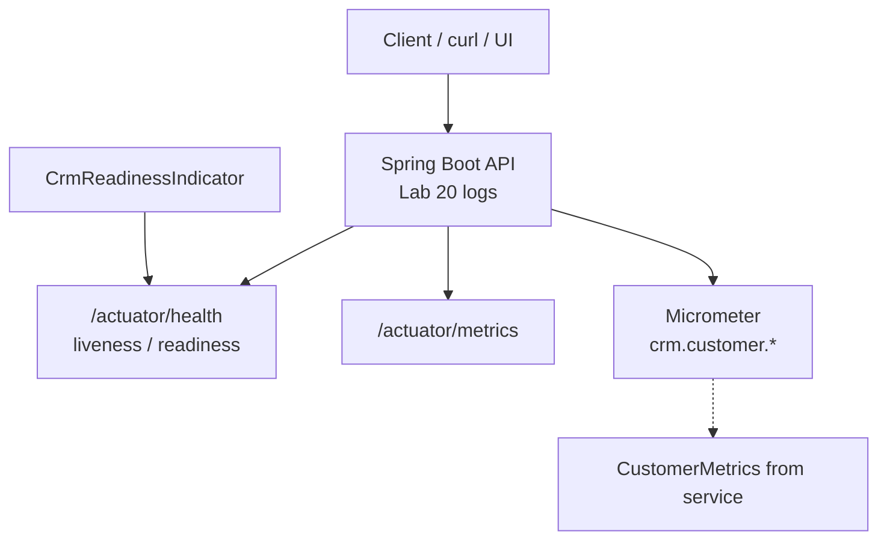

# Lab 21: Observability and Monitoring — Northstar CRM Actuator & Metrics

> **Participants:** Module sequence is in [`../README.md`](../README.md). **Do not start this guide until** you have finished Module 21 [pre-lab exercises 1–6](../exercises/EXERCISES-INDEX.md) (Pass — check yourself, do not write it down; order **1 → 2 → 3 → 4 → 5 → 6**). Then open **one** OS how-to ([Windows](LAB-21-WINDOWS.md) · [macOS](LAB-21-MACOS.md)). In class, prefer the **45-minute timed path** with [`starter/`](starter/README.md); the **full path** is every Step below (homework / extended). This repo has no answer keys — complete the TODOs yourself. See [Which file do I open?](../../../_PARTICIPANT-FILE-GUIDE.md).

## Activity card

| | |
| --- | --- |
| **Objective** | Ship Actuator probes + CrmReadinessIndicator + low-cardinality create/get metrics |
| **Skills practiced** | Actuator exposure, liveness/readiness, Micrometer counters, ActuatorIT |
| **Expected outcome** | Green `ActuatorIT` · readiness toggle · metrics after traffic · monitoring-report.md |
| **Estimated time** | Timed path ~45 min · Full path 3–4 hours |
| **Prerequisites** | Lab 0 · Lab 20 preferred · Exercises 1–6 Pass · JDK 21 · Maven 3.9+ |
| **Expected files** | `examples/lab21-crm/` — probes, metrics, IT, monitoring-report |
| **Validation checkpoints** | Starter smoke `ActuatorIT` · GUIDE Implementation Checkpoints |

**Module:** 21 — Observability and Monitoring  
**Duration:** ~45 minutes (timed path with starter) · Full path: 3–4 Hours

**Primary IDE:** IntelliJ IDEA Community Edition · **Optional IDE:** VS Code

| OS | How-to for this lab |
| -- | ------------------- |
| Windows | [LAB-21-WINDOWS.md](LAB-21-WINDOWS.md) |
| macOS | [LAB-21-MACOS.md](LAB-21-MACOS.md) |

> **Incremental build:** Cardinality → allow-list → probes → metric/alert sketches → Lab 21.

> **Classroom pacing:** [`../PACING.md`](../PACING.md) (Checkpoints A–E).

> **Critical scope:** **Low-cardinality** tags only. **Liveness ≠ readiness**. Document that **lab Actuator exposure is not production**. Full tracing stacks are awareness-only.

## 45-minute timed path (use starter)

In class, use the starter templates so the **core** objectives fit **~45 minutes**. The full Steps below remain for homework / extended depth.

1. Open [`starter/README.md`](starter/README.md).
2. Copy `starter/` into your `java-bootcamp/examples/lab21-crm/` target (see starter README).
3. Fill every `// TODO` — do **not** wait on a perfect prior lab; the starter includes a baseline.
4. Run the starter smoke test. Commit your work to your GitHub repo (no screenshots).
5. Check timed-path Pass criteria in the starter README yourself (do not write the marks down). Continue remaining GUIDE steps as homework if needed.

| Path | Time | Scope |
| ---- | ---- | ----- |
| **Timed (default)** | ~45 min | Starter TODOs + smoke test |
| **Full (extended)** | see Duration | Every Step in this GUIDE |


## What you'll complete (practice only)

Labs and exercises are **practice only**. Nothing is submitted or graded. Do not take screenshots. Check Pass/Fail yourself — do not write those marks anywhere. Commit your work to your private `java-bootcamp` GitHub repo.

Keep this checklist visible while you work.

| # | Deliverable |
| - | ----------- |
| 1 | Actuator health (liveness/readiness) evidence |
| 2 | Micrometer metrics for CRM create/get |
| 3 | Automated `ActuatorIT` output |
| 4 | Successful-path evidence with metric traffic `CUS-2101` (+ seeded `CUS-1001` get) |
| 5 | Controlled-failure evidence (readiness down / create failure counter) |
| 6 | `docs/monitoring-report.md` |
| 7 | Production exposure restrictions documented |
| 8 | No secrets or generated build directories committed |

**Commit to your GitHub repo:** the items in the table above (sources + evidence + short notes).

**Do not commit:** `target/`, `node_modules/`, secrets, heap dumps, or a copied answer keys.

## Lab Overview

This Module 21 lab extends the **Customer Management Platform** with **Spring Boot Actuator** health and **Micrometer** metrics. You expose health endpoints, separate **readiness** from **liveness**, and add counters/timers for CRM create/get so operators can see whether the service is alive, ready for traffic, and processing customer operations.

## Learning Objectives

After completing this lab, you will be able to:

* Add `spring-boot-starter-actuator` to a CRM Spring Boot application
* Expose and verify `/actuator/health` (and related endpoints) locally
* Explain readiness versus liveness and when each should fail
* Configure health groups or indicators relevant to CRM dependencies
* Register Micrometer counters/timers for customer create and get

## Business Scenario

The CRM stores customer identity, contact details, lifecycle status, and financial accounts. Without probes, orchestrators restart healthy-but-warming instances incorrectly—or keep routing traffic to instances that cannot reach persistence.

Leadership freezes:

**Actuator health with distinct readiness and liveness. Micrometer create/get metrics with low-cardinality tags. Unrestricted public Actuator is unacceptable for production narratives.**

Use these examples consistently:

| ID | Name | Notes |
| -- | ---- | ----- |
| `CUS-1001` | Amina Khan | `ACTIVE` — traffic that moves create/get metrics |
| `CUS-2101` | Metric User | POST for `createMetricAppearsAfterTraffic` |
| `CUS-1002` | Ravi Singh | `PROSPECT` — optional second create / failure demos |
| `lab-request-001` | — | correlation in HTTP/logs (not metric tags) |
| ISO-8601 UTC | — | evidence timestamps |

**Security note for evidence.** Local lab may expose `health,info,metrics`. Document production hardening (auth, firewall, allow-list). Never expose secrets via `/actuator/env` in submitted configs.

---

## Architecture Context
### NOW (this lab)



## Prerequisites

Prior labs: [19](../../module-19/lab19/LAB-19-GUIDE.md) · [20](../../module-20/lab20/LAB-20-GUIDE.md).

Confirm (Lab 0 tools assumed):

* JDK 21; Maven; Git
* Spring Boot 3.x CRM module with customer create/get
* Structured logging from Lab 20 strongly recommended
* No secrets committed to Git

### Pre-flight

```bash
java -version
mvn -version
```

## Worked example (read before you code)

Study this pattern once before Step 1. Your job is to apply the same idea in the Steps — do not skip ahead to a full solution.

```java
import static org.springframework.boot.test.context.SpringBootTest.WebEnvironment.RANDOM_PORT;
import org.springframework.boot.test.context.SpringBootTest;

@SpringBootTest(webEnvironment = RANDOM_PORT)
class ActuatorIT {
  // Starter method names:
  // healthAndProbesAreUp
  // readinessCanGoDownWhileLivenessStaysUp
  // createMetricAppearsAfterTraffic  // POST CUS-2101
}
```

**What to notice:** Match starter ActuatorIT names and fixture `CUS-2101`; metrics use `recordCreate` / `recordGet`.

---

## Implementation Steps

Complete each step in order. Commands assume `~/java-bootcamp/examples/lab21-crm` (Windows: `%USERPROFILE%\java-bootcamp\examples\lab21-crm`) unless noted.

---

### Step 1 — Branch Lab 20 and add Actuator

**Why:** Health and metrics must come from the Boot-managed Actuator stack, not ad-hoc `/health` controllers that diverge from ops standards.

**Do this:**

```bash
cd ~/java-bootcamp/examples
cp -r lab20-crm lab21-crm
cd lab21-crm
mkdir -p docs
  src/main/java/com/northstar/crm/metrics \
  src/main/java/com/northstar/crm/health \
  src/test/java/com/northstar/crm/actuator
```

Add (BOM-managed version via Boot parent—do not invent mismatched versions):

```xml
<dependency>
  <groupId>org.springframework.boot</groupId>
  <artifactId>spring-boot-starter-actuator</artifactId>
</dependency>
```

```bash
mvn -q dependency:tree | grep -i actuator || mvn -q dependency:tree | findstr /i actuator
```

**Expected result:** `spring-boot-actuator-autoconfigure` present; BUILD SUCCESS.

**If it fails:** Parent mismatch → align Boot parent version. Optional Prometheus registry missing until you add `micrometer-registry-prometheus` (bonus).

---

### Step 2 — Configure health and metrics exposure (local lab)

**Why:** Default exposure is conservative; students must deliberately configure local visibility **and** document that production must tighten it.

**Do this:** Update `application.yml`:

```yaml
management:
  endpoints:
    web:
      exposure:
        include: health,metrics,info   # starter lab-only set (prometheus optional)
  endpoint:
    health:
      show-details: always
      probes:
        enabled: true
      group:
        readiness:
          include: readinessState,crmReadinessIndicator
  metrics:
    tags:
      application: northstar-crm

server:
  port: 8080
```

Starter ships probes + exposure; add the **readiness group** so `CrmReadinessIndicator` participates. Mark unrestricted exposure as **lab-only**.

**Expected result:** App starts on 8080; health/liveness/readiness reachable; readiness group includes `crmReadinessIndicator`.

**If it fails:** YAML indentation wrong → endpoints stay closed. Spelling `exposure.include` → fix exactly. Restart required after YAML changes.

---

### Step 3 — Verify liveness and readiness semantics

**Why:** Confusing “process up” with “safe for traffic” causes wrong orchestrator actions—restart vs remove-from-LB.

**Do this:**

```bash
mvn spring-boot:run

curl -s http://localhost:8080/actuator/health
curl -s http://localhost:8080/actuator/health/liveness
curl -s http://localhost:8080/actuator/health/readiness
```

Write two or three sentences in `docs/monitoring-report.md` distinguishing: a live-but-not-ready app (schema migration still running) versus a dead process.

**Expected result:** Overall health UP (or UP with components); `/liveness` UP; `/readiness` UP when app accepts CRM traffic; notes explain LB vs restart behavior.

**If it fails:** 404 on probe paths → enable `management.endpoint.health.probes.enabled=true` (Boot 2.3+/3.x). Older Boot → use health groups; document equivalent.

---

### Step 4 — Add `CrmReadinessIndicator` (readiness ≠ liveness)

**Why:** Students must prove readiness can fail independently—otherwise “readiness” is vocabulary only.

**Do this:** Create `CrmReadinessIndicator.java`:

```java
import java.util.concurrent.atomic.AtomicBoolean;
import org.springframework.boot.actuate.health.Health;
import org.springframework.boot.actuate.health.HealthIndicator;
import org.springframework.stereotype.Component;

@Component
public class CrmReadinessIndicator implements HealthIndicator {
  private final AtomicBoolean ready = new AtomicBoolean(true);

  public void setReady(boolean value) { ready.set(value); }

  @Override
  public Health health() {
    if (!ready.get()) {
      return Health.outOfService()
          .withDetail("crm", "not-ready")
          .withDetail("reason", "dependency-unavailable")
          .build();
    }
    return Health.up().withDetail("crm", "ready").build();
  }
}
```

Expose a **lab-only** toggle endpoint or test hook to flip readiness; mark it clearly as non-production. Prefer registering this indicator into the readiness group if your Boot version separates contributors.

**Expected result:** `ready=true` → readiness UP; `ready=false` → readiness DOWN/OUT_OF_SERVICE while liveness remains UP.

**If it fails:** Toggling flips liveness too → indicator attached to wrong group; dig into Boot health groups docs. Always UP → bean not scanned or not part of readiness aggregation.

---

### Step 5 — Register create/get Micrometer metrics

**Why:** Counters/timers without wiring never move; high-cardinality tags destroy metric backends—keep tags low-cardinality.

**Do this:** Complete starter `CustomerMetrics` — wire service calls to `recordCreate(String result)` / `recordGet(String result)` (tag by `result` only). Counters: `crm.customer.create` / `crm.customer.get`.

Wire from `CustomerService` for create/get. Tag by `result` only—**do not** tag with customer names or correlation IDs. Customer IDs belong in logs (Lab 20).

**Expected result:** Metric names appear under `/actuator/metrics`; `crm.customer.create` / `crm.customer.get` listed after traffic.

**If it fails:** Metrics missing → bean not constructed / service not calling wrappers. Name typo in curl path → names are exact. Ultra-high-cardinality tags if student “improves” with customerId—reject in review.

---

### Step 6 — Drive metrics with CRM traffic

**Why:** Before/after payloads are the proof operators trust—not “we registered a counter.”

**Do this:** Record baseline, then traffic with correlation header, then re-read:

```bash
curl -s http://localhost:8080/actuator/metrics/crm.customer.create

curl -s -H "X-Correlation-Id: lab-request-001" -H "Content-Type: application/json" \
  -d '{"customerId":"CUS-2101","fullName":"Metric User","email":"metric@example.com","status":"PROSPECT"}' \
  http://localhost:8080/api/customers

curl -s -H "X-Correlation-Id: lab-request-001" \
  http://localhost:8080/api/customers/CUS-1001

curl -s http://localhost:8080/actuator/metrics/crm.customer.create
curl -s http://localhost:8080/actuator/metrics/crm.customer.get
```

**Expected result:** Create success count increases after POST `CUS-2101`; get metric moves after GET; Lab 20 logs still show correlation + customer ids.

**If it fails:** Counter flat → wire path not hit (duplicate fail before increment placement). Latency missing → timer not recorded on get. Logs missing correlation → Lab 20 filter regression—fix logging first.

---

### Step 7 — Automate Actuator smoke tests

**Why:** Probe and metric regressions should fail CI without manual curl archaeology.

**Do this:** Complete starter `ActuatorIT.java` methods:

```java
import org.junit.jupiter.api.Test;

@Test
void healthAndProbesAreUp() {
  // GET /actuator/health, /actuator/health/liveness, /actuator/health/readiness → 200
}

@Test
void readinessCanGoDownWhileLivenessStaysUp() {
  // readiness.setReady(false); assert readiness down / liveness up; restore true
}

@Test
void createMetricAppearsAfterTraffic() {
  // POST CUS-2101 then GET /actuator/metrics/crm.customer.create
}
```

```bash
mvn -q -Dtest=ActuatorIT test
```

**Expected result:** **Tests run: 3**; all three starter methods PASS; BUILD SUCCESS.

**If it fails:** Random port vs hard-coded 8080 in assertions → use `@LocalServerPort`. Metric JSON structure differs by Boot version → parse `measurements` carefully.

---

### Step 8 — Monitoring report + failure experiments

**Why:** Handoff to support needs a one-page contract for probes, metrics, alerts, and exposure.

**Do this:** Complete `docs/monitoring-report.md`:

```markdown
# CRM Monitoring Report (Lab 21)
- Health: /actuator/health, /liveness, /readiness
- Metrics: crm.customer.create{result}, crm.customer.get.latency
- Example traffic: POST CUS-2101, GET CUS-1001, corr=lab-request-001
- Alert idea: create failure ratio > 5% for 5 minutes
- Production: do not expose unrestricted Actuator on the public internet
- Cards: IDs in logs (Lab 20); aggregates in metrics (this lab)
```

Complete Failure Experiments. Capture before/after JSON. Run tests twice.

**Expected result:** Report committed with readiness discussion + alert idea + production restrictions; experiments recorded; suite deterministic.

**If it fails:** Report recommends public Actuator “for simplicity” → rewrite as anti-pattern. Missing readiness ≠ liveness proof → repeat Step 4 evidence.

---

## Implementation Checkpoints

### Checkpoint A — Actuator tooling

_Check **Pass** or **Fail** yourself. Do not write these marks anywhere — nothing is submitted or graded. Commit your work to your GitHub repo._

| # | Confirm | Self-check |
| - | ------- | ---------- |
| 1 | `lab21-crm` under `~/java-bootcamp/examples/` | Pass / Fail |
| 2 | Actuator dependency present | Pass / Fail |
| 3 | Local exposure configured with production hardening notes | Pass / Fail |

### Checkpoint B — Probes

_Check **Pass** or **Fail** yourself. Do not write these marks anywhere — nothing is submitted or graded. Commit your work to your GitHub repo._

| # | Confirm | Self-check |
| - | ------- | ---------- |
| 1 | Liveness and readiness curls documented | Pass / Fail |
| 2 | `CrmReadinessIndicator` can fail readiness independently | Pass / Fail |
| 3 | Written distinction: LB drain vs process restart | Pass / Fail |

### Checkpoint C — Metrics + IT

_Check **Pass** or **Fail** yourself. Do not write these marks anywhere — nothing is submitted or graded. Commit your work to your GitHub repo._

| # | Confirm | Self-check |
| - | ------- | ---------- |
| 1 | `CustomerMetrics` counters/timers wired | Pass / Fail |
| 2 | Before/after create/get evidence with `CUS-1001` | Pass / Fail |
| 3 | `ActuatorIT` green (health + increment) | Pass / Fail |

### Checkpoint D — Hygiene

_Check **Pass** or **Fail** yourself. Do not write these marks anywhere — nothing is submitted or graded. Commit your work to your GitHub repo._

| # | Confirm | Self-check |
| - | ------- | ---------- |
| 1 | `monitoring-report.md` complete | Pass / Fail |
| 2 | No high-cardinality tags; no secrets in Actuator config | Pass / Fail |
| 3 | Lab-only readiness toggle marked non-production | Pass / Fail |

---

## Reference Commands, Configuration, and Code

### Management excerpt

```yaml
management:
  endpoints:
    web:
      exposure:
        include: health,metrics,info
  endpoint:
    health:
      probes:
        enabled: true
      show-details: always
      group:
        readiness:
          include: readinessState,crmReadinessIndicator
```

### Commands

```bash
cd ~/java-bootcamp/examples/lab21-crm
curl -s http://localhost:8080/actuator/health
curl -s http://localhost:8080/actuator/health/liveness
curl -s http://localhost:8080/actuator/health/readiness
curl -s http://localhost:8080/actuator/metrics/crm.customer.create
mvn -q -Dtest=ActuatorIT test
# Expected: Tests run: 3 (healthAndProbesAreUp, readinessCanGoDownWhileLivenessStaysUp, createMetricAppearsAfterTraffic)
git status
```

### Sample alert sketch (documentation only)

```text
Alert: CRMCreateFailureRatioHigh
Expr:  rate(crm_customer_create_failure[5m])
       / rate(crm_customer_create_total[5m]) > 0.05
For:   5m
Action: page on-call; search logs for op=customer.create level=ERROR|WARN
```

Metric name spelling in Prometheus may differ from Actuator JSON (`crm.customer.create` → `crm_customer_create_*`). Document the scrape mapping if you enable Prometheus.

---

## Failure Experiments

| # | Experiment | Observe | Restore |
| - | ---------- | ------- | ------- |
| 1 | Flip readiness off / stop DB | Readiness not UP; liveness UP; LB should drain | Restore ready flag |
| 2 | Invalid create (blank name) | Failure counter ++; logs PII-safe | Keep as permanent path |
| 3 | Repeat create/get `CUS-1001` | Counter growth vs business idempotency | Document both |
| 4 | Induce latency | Timer total/count moves | Remove artificial delay |
| 5 | Temporarily tag metric with `customerId` | Cardinality risk discussion | Remove tag before submit |

---

## Troubleshooting

| Symptom | Likely cause | Fix |
| ------- | ------------ | --- |
| 404 `/actuator/**` | Not exposed | Fix `exposure.include`; restart |
| Probes 404 | Probes disabled | `endpoint.health.probes.enabled: true` |
| Metrics missing | Bean unused / name typo | Wire service; exact metric name |
| Readiness always UP | Indicator not in group | Register health contributor correctly |
| Config ignored | Wrong profile / YAML indent | Validate YAML; active profile |
| High cardinality | ID/name tags | Use result/operation tags only |
| Cannot connect | Port / process down | Check 8080 and health first |
| Liveness DOWN when only readiness toggled | Wrong probe wiring | Keep liveness independent of CrmReadinessIndicator |

## Security and Production Review

Optional — jot brief notes in your README if useful for your progress check (not a separate essay):

1. Which browser, network, or Actuator inputs are untrusted?
2. Where are authn/authz enforced for management endpoints in production?
3. Which values are sensitive (`/env`, secrets, PII)—never as metric tags or open Actuator fields?

---


## Cleanup

```bash
cd ~/java-bootcamp/examples/lab21-crm
# Stop Spring Boot
# Remove lab-only readiness toggle endpoints before any shared deployment
mvn -q clean
git status
```

**Keep `lab21-crm`**—Lab 22 replaces remaining `new` wiring with Spring IoC across the CRM graph.


## Reflection Questions

Write **1–3 sentence** answers (not essays):

1. Which design decision most affected correctness (readiness group vs single health blob)?
2. What evidence proves create traffic is observable?
3. Which failure was hardest to diagnose?

---


