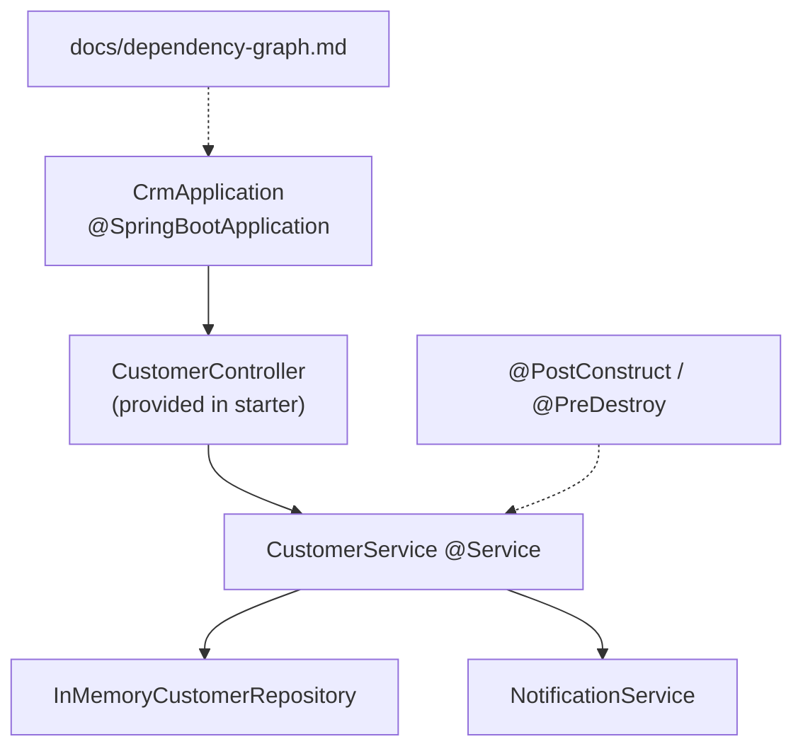

# Lab 22: Spring IoC and Dependency Injection — Northstar CRM Bean Graph

> **Participants:** Module sequence is in [`../README.md`](../README.md). **Do not start this guide until** you have finished Module 22 [pre-lab exercises 1–6](../exercises/EXERCISES-INDEX.md) (Pass — check yourself, do not write it down; order **1 → 2 → 3 → 4 → 5 → 6**). Then open **one** OS how-to ([Windows](LAB-22-WINDOWS.md) · [macOS](LAB-22-MACOS.md)). In class, prefer the **45-minute timed path** with [`starter/`](starter/README.md); the **full path** is every Step below (homework / extended). This repo has no answer keys — complete the TODOs yourself. See [Which file do I open?](../../../_PARTICIPANT-FILE-GUIDE.md).

## Activity card

| | |
| --- | --- |
| **Objective** | Replace manual `new` wiring with Spring stereotypes + constructor DI for the CRM graph |
| **Skills practiced** | IoC, constructor injection, stereotypes, lifecycle callbacks, dependency-graph.md |
| **Expected outcome** | App starts · unit test green · graph matches constructors · CUS-1001 path works (Spring IT = homework) |
| **Estimated time** | Timed path ~45 min · Full path 4–5 hours |
| **Prerequisites** | Lab 0 · Lab 21 preferred · Exercises 1–6 Pass · JDK 21 · Maven 3.9+ |
| **Expected files** | `examples/lab22-crm/` — beans, DI, lifecycle, tests, dependency-graph |
| **Validation checkpoints** | Starter smoke · GUIDE Implementation Checkpoints |

**Module:** 22 — Spring IoC and Dependency Injection  
**Duration:** ~45 minutes (timed path with starter) · Full path: 4–5 Hours

**Primary IDE:** IntelliJ IDEA Community Edition · **Optional IDE:** VS Code

| OS | How-to for this lab |
| -- | ------------------- |
| Windows | [LAB-22-WINDOWS.md](LAB-22-WINDOWS.md) |
| macOS | [LAB-22-MACOS.md](LAB-22-MACOS.md) |

> **Incremental build:** IoC vs new → constructor DI → lifecycle → stereotypes → bean graph → Lab 22.

> **Classroom pacing:** [`../PACING.md`](../PACING.md) (Checkpoints A–F).

> **Critical scope:** **Constructor injection** with `final` fields. **No** `new` of Spring-managed collaborators inside services. **No** field `@Autowired` as primary. Boot Initializr / profiles / REST hosting / Security → later labs.

## 45-minute timed path (use starter)

In class, use the starter templates so the **core** objectives fit **~45 minutes**. The full Steps below remain for homework / extended depth.

1. Open [`starter/README.md`](starter/README.md).
2. Copy `starter/` into your `java-bootcamp/examples/…` target (see starter README).
3. Fill every `// TODO` — do **not** wait on a perfect prior lab; the starter includes a baseline.
4. Run the starter smoke test. Commit your work to your GitHub repo (no screenshots).
5. Check timed-path Pass criteria in the starter README yourself (do not write the marks down). Continue remaining GUIDE steps as homework if needed.

| Path | Time | Scope |
| ---- | ---- | ----- |
| **Timed (default)** | ~45 min | Starter TODOs + smoke test |
| **Full (extended)** | see Duration | Every Step in this GUIDE |

---

## What you'll complete (practice only)

Labs and exercises are **practice only**. Nothing is submitted or graded. Do not take screenshots. Check Pass/Fail yourself — do not write those marks anywhere. Commit your work to your private `java-bootcamp` GitHub repo.

Keep this checklist visible while you work.

| # | Deliverable |
| - | ----------- |
| 1 | `CustomerService`, `CustomerRepository`, `NotificationService` as Spring beans |
| 2 | Constructor injection throughout the CRM graph |
| 3 | Lifecycle evidence for `CustomerService` |
| 4 | Unit test (`CustomerServiceTest`); Spring IT = homework Step 7 |
| 5 | `docs/dependency-graph.md` |
| 6 | Successful-path evidence (`CUS-1001`, `CUS-1002`, `lab-request-001`) |
| 7 | Controlled-failure evidence (missing bean / validation) |
| 8 | Run and cleanup instructions |

**Commit to your GitHub repo:** the items in the table above (sources + evidence + short notes).

**Do not commit:** `target/`, `node_modules/`, secrets, heap dumps, or a copied answer keys.

## Lab Overview

This Module 22 lab extends the **Customer Management Platform** by replacing manual `new` wiring with **Spring Inversion of Control (IoC)** and **dependency injection**. You model CRM collaborators as Spring beans, prefer **constructor injection**, apply stereotype annotations, observe bean lifecycle callbacks on `CustomerService`, and document `docs/dependency-graph.md`.

## Learning Objectives

After completing this lab, you will be able to:

* Explain IoC versus dependency lookup and why CRM services should not call `new` on collaborators
* Create a Spring application context that scans CRM packages
* Declare `@Component`, `@Service`, and `@Repository` beans for the customer domain
* Prefer constructor injection for `CustomerService` dependencies
* Replace field/`new` coupling with injected `CustomerRepository` and `NotificationService`

## Business Scenario

The CRM stores customer identity, contact details, lifecycle status, and financial accounts. Manual `new InMemoryCustomerRepository()` inside services blocks swapping persistence, metrics, and notifiers for tests and production.

Leadership freezes:

**Spring owns the CRM object graph. Constructor injection preferred. Stereotypes on application components. Documented dependency graph. Domain records stay free of Spring unless necessary.**

Use these examples consistently:

| ID | Name | Notes |
| -- | ---- | ----- |
| `CUS-1001` | Amina Khan | `ACTIVE` — create/get + unit/IT fixtures |
| `CUS-1002` | Ravi Singh | `PROSPECT` — lifecycle/traffic demos |
| `lab-request-001` | — | `X-Correlation-Id` default / notification corr |
| ISO-8601 UTC | — | evidence timestamps |

**Security note for evidence.** Notification and lifecycle logs must remain PII-free (Lab 20 rules). Optional Actuator `beans` endpoint is **local-only**—do not leave it open in production narratives without auth.

---

## Architecture Context
### NOW (this lab)



## Prerequisites

Prior labs: [20](../../../Week%202%20-%20Backend,%20AI%20Tools%20and%20Testing/module-20/lab20/LAB-20-GUIDE.md) · [21](../../../Week%202%20-%20Backend,%20AI%20Tools%20and%20Testing/module-21/lab21/LAB-21-GUIDE.md).

Confirm (Lab 0 tools assumed):

* JDK 21; Maven; Git
* Spring Boot Maven scaffold (or instructor-approved pure Spring context)
* Prior CRM create/get behavior (in-memory OK for this lab)
* No secrets committed to Git

### Pre-flight

```bash
java -version
mvn -version
```

## Worked example (read before you code)

Study this pattern once before Step 1. Your job is to apply the same idea in the Steps — do not skip ahead to a full solution.

```java
import static org.junit.jupiter.api.Assertions.assertEquals;
import static org.junit.jupiter.api.Assertions.assertNotNull;
import org.junit.jupiter.api.Test;

class CustomerServiceTest {
  @Test
  void createAndGetWithoutSpringContext() {
    var repo = new InMemoryCustomerRepository();
    var notify = new NotificationService();
    var service = new CustomerService(repo, notify);

    Customer created = service.create(Customer.amina(), "lab-request-001");
    assertEquals("CUS-1001", created.getId());

    Customer found = service.get("CUS-1001");
    assertNotNull(found);
    assertEquals("Amina Khan", found.getName());
    assertEquals("ACTIVE", found.getStatus());
  }
}
```

**What to notice:** Match names, IDs, getters (`getId`/`getName`), and failure behavior from the scenario — instructors check these.

---

## Implementation Steps

Complete each step in order. Commands assume `~/java-bootcamp/examples/lab22-crm` (Windows: `%USERPROFILE%\java-bootcamp\examples\lab22-crm`) unless noted.

---

### Step 1 — Branch Lab 21 and confirm Spring project scaffold

**Why:** IoC requires a single entry point that starts a scanned application context—without it stereotypes never become beans.

**Do this:**

```bash
cd ~/java-bootcamp/examples
cp -r lab21-crm lab22-crm
cd lab22-crm
mkdir -p docs
```

Ensure `CrmApplication` (or equivalent) exists:

```java
import org.springframework.boot.autoconfigure.SpringBootApplication;
import org.springframework.boot.SpringApplication;

@SpringBootApplication
public class CrmApplication {
  public static void main(String[] args) {
    SpringApplication.run(CrmApplication.class, args);
  }
}
```

Parent/deps (align version with course Boot line if different):

```xml
<parent>
  <groupId>org.springframework.boot</groupId>
  <artifactId>spring-boot-starter-parent</artifactId>
  <version>3.3.5</version>
</parent>
<dependencies>
  <dependency>
    <groupId>org.springframework.boot</groupId>
    <artifactId>spring-boot-starter-web</artifactId>
  </dependency>
  <dependency>
    <groupId>org.springframework.boot</groupId>
    <artifactId>spring-boot-starter-test</artifactId>
    <scope>test</scope>
  </dependency>
</dependencies>
```

```bash
mvn -q -DskipTests package
mvn spring-boot:run
```

**Expected result:** BUILD SUCCESS; log shows `Started CrmApplication`.

**If it fails:** Wrong Java version → JDK 21. Component scan misses packages → move app class to `com.northstar.crm` root. Port conflict → stop prior lab process.

---

### Step 2 — Model CRM domain types without Spring

**Why:** Stereotypes belong on application components; DTOs/records bloated with Spring annotations confuse the graph.

**Do this:** Keep `Customer` as a plain type (adapt to your existing entity if already present):

```java
public class Customer {
  private String id;
  private String name;
  private String email;
  private String status;

  public Customer() {}

  public Customer(String id, String name, String email, String status) {
    this.id = id;
    this.name = name;
    this.email = email;
    this.status = status;
  }

  public static Customer amina() {
    return new Customer("CUS-1001", "Amina Khan", "amina.khan@example.com", "ACTIVE");
  }
  public static Customer ravi() {
    return new Customer("CUS-1002", "Ravi Singh", "ravi.singh@example.com", "PROSPECT");
  }

  public String getId() { return id; }
  public void setId(String id) { this.id = id; }
  public String getName() { return name; }
  public void setName(String name) { this.name = name; }
  public String getEmail() { return email; }
  public void setEmail(String email) { this.email = email; }
  public String getStatus() { return status; }
  public void setStatus(String status) { this.status = status; }
}
```

Starter uses this JavaBean shape (`id`/`name`/`email`/`status`) for Jackson — keep getters/setters; do **not** rename fields to `customerId`/`fullName`.

**Expected result:** Domain compiles independently of Spring annotations; `CUS-1001` / `CUS-1002` helpers available for tests and seed data.

**If it fails:** Accidental `@Component` on DTO → remove. Missing getters → Jackson cannot bind JSON `id`/`name`/`email`/`status`.

---

### Step 3 — Declare repository and notification beans

**Why:** Collaborators must exist as beans before constructor injection can satisfy `CustomerService`.

**Do this:** Prefer interfaces + annotated implementations. **Do not** instantiate them with `new` from the service.

```java
import org.springframework.stereotype.Repository;
import org.springframework.stereotype.Service;
import java.util.concurrent.ConcurrentHashMap;
import org.slf4j.Logger;
import org.slf4j.LoggerFactory;
import java.util.Map;
import java.util.Optional;

public interface CustomerRepository {
  Customer save(Customer customer);
  Optional<Customer> findById(String id);
}

@Repository
public class InMemoryCustomerRepository implements CustomerRepository {
  private final Map<String, Customer> store = new ConcurrentHashMap<>();

  public InMemoryCustomerRepository() {
    store.put("CUS-1001", Customer.amina());
    store.put("CUS-1002", Customer.ravi());
  }

  @Override public Customer save(Customer c) { store.put(c.getId(), c); return c; }
  @Override public Optional<Customer> findById(String id) {
    return Optional.ofNullable(store.get(id));
  }
}

@Service
public class NotificationService {
  private static final Logger log = LoggerFactory.getLogger(NotificationService.class);
  public void notifyCreated(String customerId, String correlationId) {
    log.info("customer.created id={} correlationId={}", customerId, correlationId);
  }
}
```

Keep Lab 20 PII rules: notify with IDs/correlation only.

**Expected result:** Context starts; beans of these types exist; create path can notify without `System.out`.

**If it fails:** `NoSuchBeanDefinitionException` → stereotype missing or package outside scan. Duplicate bean types → qualify/`@Primary` deliberately or rename.

---

### Step 4 — Refactor `CustomerService` to constructor injection

**Why:** Constructor DI makes dependencies required, final, and unit-testable without Spring—field injection hides them.

**Do this:**

```java
import org.springframework.stereotype.Service;

@Service
public class CustomerService {
  private final CustomerRepository customerRepository;
  private final NotificationService notificationService;

  public CustomerService(CustomerRepository customerRepository, NotificationService notificationService) {
    this.customerRepository = customerRepository;
    this.notificationService = notificationService;
  }

  public Customer create(Customer customer, String correlationId) {
    Customer saved = customerRepository.save(customer);
    notificationService.notifyCreated(saved.getId(), correlationId);
    return saved;
  }

  public Customer get(String id) {
    return customerRepository
        .findById(id)
        .orElseThrow(() -> new IllegalArgumentException("Customer not found: " + id));
  }
}
```

Remove field injection and `new InMemoryCustomerRepository()` if present. Prefer injecting the **interface** type `CustomerRepository`. Timed path uses `get` (throws) — not `Optional` on the service.

**Expected result:** Application starts without “parameter 0 of constructor required a bean” errors; `CustomerService` is singleton by default; unit tests can `new CustomerService(fakeRepo, fakeNotify)`.

**If it fails:** Missing bean for parameter → Step 3. Circular dependency → redesign (constructor cycles) rather than field-inject hacks. Still using `@Autowired` on fields as primary pattern → convert for the lab.

---

### Step 5 — Verify the provided `CustomerController` wiring

**Why:** The HTTP boundary must join the same graph; a controller that does `new CustomerService()` would bypass IoC and tests.

**Already provided in starter:** `api/CustomerController.java` is a complete `@RestController` with constructor injection of `CustomerService`, `POST /api/customers` (201), `GET /api/customers/{id}`, and `@RequestHeader` `X-Correlation-Id` (default `lab-request-001`). **Do not re-implement it** — verify wiring after you finish Steps 3–4.

**Do this:**

1. Open `src/main/java/com/northstar/crm/api/CustomerController.java` and confirm it injects `CustomerService` (no `new`, no repository import).
2. After stereotypes + constructor DI are done, start the app and call create/get:

```bash
curl -H "X-Correlation-Id: lab-request-001" -H "Content-Type: application/json" \
  -d '{"id":"CUS-1001","name":"Amina Khan","email":"amina.khan@example.com","status":"ACTIVE"}' \
  http://localhost:8080/api/customers
curl -s http://localhost:8080/api/customers/CUS-1001
```

Match starter method names: service `create` / `get`, JSON fields `id`/`name`/`email`/`status`.

**Expected result:** POST `CUS-1001` → 201; GET → 200 Amina ACTIVE; notification log shows `customer.created id=CUS-1001 correlationId=lab-request-001`.

**If it fails:** 404 mapping → request path/context path. Bean not found for controller ctor → service not annotated/scanned. Validation differences → keep Lab 19 behavior.

---

### Step 6 — Demonstrate bean lifecycle on `CustomerService`

**Why:** Singleton lifecycle is easy to misunderstand—students must see one init per context and graceful destroy.

**Do this:**

```java
import jakarta.annotation.PostConstruct;
import jakarta.annotation.PreDestroy;

@PostConstruct
void init() {
  log.info("CustomerService ready");
}

@PreDestroy
void shutdown() {
  log.info("CustomerService shutting down");
}
```

Start the app, create `CUS-1002`, then stop the process (Ctrl+C) and capture destroy log if graceful shutdown runs. Explain: one singleton instance shared across requests—mutable instance fields need care.

**Expected result:** Startup includes init log once; graceful stop includes shutdown; only one init line per context refresh.

**If it fails:** No destroy log → non-graceful kill; document SIGTERM/`spring-boot:run` stop. Multiple inits → multiple contexts or prototype scope by mistake.

---

### Step 7 — Prove testability with and without the container

**Why:** Constructor DI’s payoff is fast unit tests without Boot; a Spring IT still proves the real graph.

**Timed path:** Complete the starter unit test only — `CustomerServiceTest.createAndGetWithoutSpringContext` (no Spring context). Starter ships this class; fill the TODOs.

**Full path / homework (this Step):** Add `@SpringBootTest` class `CustomerServiceSpringTest` with method `springGraphCreatesAndGetsCus1001` that autowires `CustomerService` and asserts seeded `CUS-1001` plus create/get for Ravi (see solution). Until you add that class, plain `mvn test` runs the unit test only (**Tests run: 1**).

```java
import static org.junit.jupiter.api.Assertions.assertEquals;
import org.junit.jupiter.api.Test;

class CustomerServiceTest {
  @Test
  void createAndGetWithoutSpringContext() {
    var repo = new InMemoryCustomerRepository();
    var notify = new NotificationService();
    var service = new CustomerService(repo, notify);

    Customer created = service.create(Customer.amina(), "lab-request-001");
    assertEquals("CUS-1001", created.getId());
    assertEquals("Amina Khan", service.get("CUS-1001").getName());
  }
}
```

```bash
# Timed path (unit test only — starter):
mvn -B -Dtest=CustomerServiceTest test

# Full verify after you add CustomerServiceSpringTest (homework):
mvn -B -Dtest=CustomerServiceTest,CustomerServiceSpringTest test
```

**Expected result (timed):** `createAndGetWithoutSpringContext` PASS; **Tests run: 1**.  
**Expected result (full / homework):** also `CustomerServiceSpringTest.springGraphCreatesAndGetsCus1001` PASS; **Tests run: 2**.

**If it fails:** Unit test needs Spring → constructor still pulls container APIs incorrectly. IT missing bean → same scan issues as Step 1. Mockito unused → ensure test deps (Boot starter-test includes Mockito).

---

### Step 8 — Document `dependency-graph.md` + failure experiments

**Why:** Reviewers must explain the graph without reading every Java file; anti-`new` policy must be explicit.

**Do this:** Write `docs/dependency-graph.md`:

```markdown
# Lab 22 Dependency Graph
CustomerController → CustomerService → CustomerRepository (InMemoryCustomerRepository)
                                   ↘ NotificationService
All default singleton.
Correlation: X-Correlation-Id / lab-request-001
Lab IDs: CUS-1001, CUS-1002
Anti-pattern: new InMemoryCustomerRepository() inside CustomerService
```

(`CustomerMetrics` is **not** in starter/solution — do not treat it as required.)
Optional: enable Actuator `beans` endpoint **locally** for a screenshot—do not leave unrestricted exposure as a production recommendation (Lab 21 lesson).

Complete Failure Experiments. Run `mvn test` twice.

**Expected result:** Graph matches constructor signatures; reviewer can explain wiring; experiments recorded; suite deterministic.

**If it fails:** Graph omits a constructor collaborator → update. Claims field injection preferred → rewrite to match course policy.

---

## Implementation Checkpoints

### Checkpoint A — Scaffold and domain

_Check **Pass** or **Fail** yourself. Do not write these marks anywhere — nothing is submitted or graded. Commit your work to your GitHub repo._

| # | Confirm | Self-check |
| - | ------- | ---------- |
| 1 | `lab22-crm` under `~/java-bootcamp/examples/` | Pass / Fail |
| 2 | `CrmApplication` starts successfully | Pass / Fail |
| 3 | Domain `Customer` free of unnecessary Spring annotations | Pass / Fail |

### Checkpoint B — Bean graph

_Check **Pass** or **Fail** yourself. Do not write these marks anywhere — nothing is submitted or graded. Commit your work to your GitHub repo._

| # | Confirm | Self-check |
| - | ------- | ---------- |
| 1 | `@Repository` / `@Service` (and controller) stereotypes present | Pass / Fail |
| 2 | `CustomerService` constructor injection with `final` fields | Pass / Fail |
| 3 | No `new` of Spring-managed collaborators inside the service | Pass / Fail |

### Checkpoint C — Lifecycle + tests

_Check **Pass** or **Fail** yourself. Do not write these marks anywhere — nothing is submitted or graded. Commit your work to your GitHub repo._

| # | Confirm | Self-check |
| - | ------- | ---------- |
| 1 | `@PostConstruct` / `@PreDestroy` evidence | Pass / Fail |
| 2 | Pure unit test without Spring (`CustomerServiceTest`) | Pass / Fail |
| 3 | `@SpringBootTest` IT (`CustomerServiceSpringTest`) — **full path / homework** | Pass / Fail / N/A timed |

### Checkpoint D — Documentation hygiene

_Check **Pass** or **Fail** yourself. Do not write these marks anywhere — nothing is submitted or graded. Commit your work to your GitHub repo._

| # | Confirm | Self-check |
| - | ------- | ---------- |
| 1 | `docs/dependency-graph.md` matches reality | Pass / Fail |
| 2 | Correlation + fixture IDs documented | Pass / Fail |
| 3 | No secrets; lab-only beans endpoint (if used) not sold as prod | Pass / Fail |

---

## Reference Commands, Configuration, and Code

### Constructor injection pattern

```java
import org.springframework.stereotype.Service;

@Service
public class CustomerService {
  private final CustomerRepository repository;
  private final NotificationService notifications;
  public CustomerService(CustomerRepository repository, NotificationService notifications) {
    this.repository = repository;
    this.notifications = notifications;
  }
}
```

### Commands

```bash
cd ~/java-bootcamp/examples/lab22-crm
mvn spring-boot:run
curl -H "X-Correlation-Id: lab-request-001" -H "Content-Type: application/json" \
  -d '{"id":"CUS-1001","name":"Amina Khan","email":"amina.khan@example.com","status":"ACTIVE"}' \
  http://localhost:8080/api/customers
mvn -q test
mvn -q clean verify
git status
```

## Failure Experiments

| # | Experiment | Observe | Restore |
| - | ---------- | ------- | ------- |
| 1 | Comment out `@Repository` | Startup `NoSuchBeanDefinitionException` | Restore annotation |
| 2 | Invalid create payload | Validation still at boundary | Keep permanent negative |
| 3 | Repeat create `CUS-1001` | Overwrite vs duplicate rule under singleton map | Document behavior |
| 4 | Delay `NotificationService` | Request latency grows | Discuss async for production |
| 5 | Temporarily `new` repo inside service | Breaks IT mocking / dual stores | Remove `new`; restore injection |

---

## Troubleshooting

| Symptom | Likely cause | Fix |
| ------- | ------------ | --- |
| `NoSuchBeanDefinitionException` | Scan/stereotype miss | Move under `com.northstar.crm`; add stereotype |
| Constructor parameter bean missing | Interface vs impl mismatch | Inject interface; ensure one impl |
| Config ignored | App class package wrong | `@SpringBootApplication` at root package |
| Field `@Autowired` still present | Incomplete refactor | Convert to constructor |
| Circular dependency | A↔B constructors | Break cycle; avoid field-inject “fix” |
| Flaky IT | Shared in-memory map | Reset or isolate test data |
| Cannot connect | Port in use | Stop prior Boot process |
| Working in `module-22-exercises` for the lab | Wrong project | Lab lives in `examples/lab22-crm` |

## Security and Production Review

Optional — jot brief notes in your README if useful for your progress check (not a separate essay):

1. Which browser, network, or API inputs are untrusted?
2. Where are authn/authz/validation enforced (DI does not replace them)?
3. Which values are sensitive in notification/lifecycle logs?

---


## Cleanup

```bash
cd ~/java-bootcamp/examples/lab22-crm
# Stop Spring Boot (Ctrl+C) and confirm @PreDestroy logs if expected
mvn -q clean
git status
```

**Keep `lab22-crm`**—this bean graph becomes the base for later Boot/JPA labs and portfolio Spring evidence.


## Reflection Questions

Write **1–3 sentence** answers (not essays):

1. Which design decision most affected correctness (constructor vs field injection)?
2. What evidence proves the graph works (unit + IT + curls)?
3. Which failure was hardest to diagnose (scan issues, missing beans)?

---


