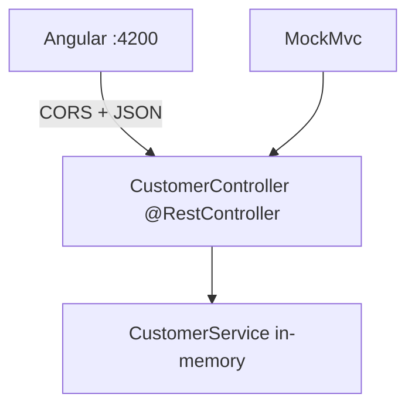

# Lab 24: REST Endpoints and Request Mapping — Northstar CRM Spring MVC

> **Participants:** Module sequence is in [`../README.md`](../README.md). Open **one** OS how-to ([Windows](LAB-24-WINDOWS.md) · [macOS](LAB-24-MACOS.md)). In class, prefer the **45-minute timed path** with [`starter/`](starter/README.md); the **full path** is every Step below (homework / extended). This repo has no answer keys — complete the TODOs yourself. See [Which file do I open?](../../../_PARTICIPANT-FILE-GUIDE.md).

## Activity card

| | |
| --- | --- |
| **Objective** | Ship `@RestController` Customer API with mapping annotations + MockMvc |
| **Skills practiced** | `@GetMapping`/`@PostMapping`, PathVariable/RequestParam/RequestBody, ResponseEntity, CORS note |
| **Expected outcome** | Live GET/POST · MockMvc green · Angular CORS documented |
| **Estimated time** | Timed path ~45 min · Full path 3–4 hours |
| **Prerequisites** | Lab 0 · Lab 23 preferred · JDK 21 · Maven 3.9+ · Spring Boot 3.x |
| **Expected files** | `examples/lab24-crm/` — controller, in-memory service, tests |
| **Validation checkpoints** | Starter smoke · GUIDE Implementation Checkpoints |

**Module:** 24 — REST Endpoints and Request Mapping  
**Duration:** ~45 minutes (timed path with starter) · Full path: 3–4 Hours

**Primary IDE:** IntelliJ IDEA Community Edition · **Optional IDE:** VS Code

| OS | How-to for this lab |
| -- | ------------------- |
| Windows | [LAB-24-WINDOWS.md](LAB-24-WINDOWS.md) |
| macOS | [LAB-24-MACOS.md](LAB-24-MACOS.md) |

> **Incremental build:** `@RestController` → mappings → PathVariable/RequestParam/RequestBody → ResponseEntity → MockMvc → CORS for Angular.

> **Critical scope:** Spring **MVC REST** only (no Spring-WS / SOAP). In-memory service is fine — JPA/PostgreSQL later. CORS note targets **Angular** on `http://localhost:4200`. Align URIs with Lab 13 design where possible (`/api/customers` or `/api/v1/customers` — document choice).

---

## 45-minute timed path (use starter)

1. Open [`starter/README.md`](starter/README.md).
2. Copy into `java-bootcamp/examples/lab24-crm/`.
3. Fill controller `// TODO` mappings + MockMvc assertions.
4. Run `mvn -B test` and a live GET. Commit your work to your GitHub repo (no screenshots).
5. Mark timed-path Pass criteria.

| Path | Time | Scope |
| ---- | ---- | ----- |
| **Timed (default)** | ~45 min | GET by id + POST create + MockMvc |
| **Full (extended)** | see Duration | List + filter query + PUT/PATCH + CORS config |

---

## What you'll complete (practice only)

Labs and exercises are **practice only**. Nothing is submitted or graded. Do not take screenshots. Check Pass/Fail yourself — do not write those marks anywhere. Commit your work to your private `java-bootcamp` GitHub repo.

| # | Deliverable |
| - | ----------- |
| 1 | `CustomerController` with `@RestController` + mapping annotations |
| 2 | PathVariable get, RequestBody create, optional RequestParam list filter |
| 3 | `ResponseEntity` with correct status codes (200/201/404) |
| 4 | `CustomerControllerMockMvcTest` green |
| 5 | Live curl/Invoke-WebRequest evidence for CUS-1001 / CUS-1002 |
| 6 | CORS note for Angular (`docs/cors-angular.md`) |
| 7 | No secrets or `target/` committed |

## Lab Overview

This Module 24 lab implements the Customer HTTP surface with Spring MVC: `@RestController`, method mappings, binding annotations, `ResponseEntity`, MockMvc tests, and a short CORS note so the **Angular** SPA can call the API during local development.

## Learning Objectives

After completing this lab, you will be able to:

* Declare a `@RestController` for Customer collection and item resources
* Map HTTP verbs with `@GetMapping`, `@PostMapping`, and related annotations
* Bind `@PathVariable`, `@RequestParam`, and `@RequestBody`
* Return `ResponseEntity` with appropriate status codes and headers
* Verify endpoints with MockMvc and document CORS for Angular

## Business Scenario

Northstar replaces any SOAP endpoint thinking with a clear Boot REST controller. Your lead freezes:

**Ship Customer GET/POST (and list) with ResponseEntity status discipline. In-memory OK. Angular on :4200 must know the CORS story.**

| ID | Name | Status |
| -- | ---- | ------ |
| `CUS-1001` | Amina Khan | `ACTIVE` — seeded get |
| `CUS-1002` | Ravi Singh | `PROSPECT` — seeded get |
| `CUS-1003` | Maya Chen | optional create sample |
| `CUS-9999` | — | not-found → 404 |
| `lab-request-001` | — | `X-Correlation-Id` |

**Security note.** Fictional emails only. Do not enable wide-open CORS in production notes without caveats.

---

## Architecture Context
### NOW (this lab)



## Prerequisites

Prior labs: [Lab 23](../../module-23/lab23/LAB-23-GUIDE.md) preferred.

* JDK 21; Maven; Spring Boot 3.x web
* Domain `Customer` JavaBean (`id`/`name`/`email`/`status`)
* No secrets in Git

### Pre-flight

```bash
java -version
mvn -version
```

## Worked example (read before you code)

```java
@RestController
@RequestMapping("/api/customers")
public class CustomerController {
  private final CustomerService service;

  public CustomerController(CustomerService service) {
    this.service = service;
  }

  @GetMapping("/{id}")
  public ResponseEntity<Customer> get(@PathVariable String id) {
    return service.find(id)
        .map(ResponseEntity::ok)
        .orElse(ResponseEntity.notFound().build());
  }
}
```

**What to notice:** Controller stays thin; 404 is explicit — not a bare null body with 200.

---

## Implementation Steps

Commands assume `~/java-bootcamp/examples/lab24-crm`.

### Step 1 — Branch Boot CRM project

**Why:** Mapping work sits on a known `CrmApplication` entry point.

**Do this:**

```bash
cd ~/java-bootcamp/examples
cp -r lab23-crm lab24-crm   # or copy course starter
cd lab24-crm
mvn -q -DskipTests package
```

**Expected result:** `BUILD SUCCESS`; app packages.

**If it fails:** Missing web starter → restore Boot web dependency from Lab 23.

---

### Step 2 — In-memory service baseline

**Why:** Controllers need a collaborator; JPA comes later.

**Do this:** Ensure `CustomerService` seeds `CUS-1001` / `CUS-1002` and supports `find`, `create` (reject duplicate), and `list` (optional filter by status). No Web imports in the service.

**Expected result:** Service unit or manual call returns Amina ACTIVE.

**If it fails:** Empty map → add constructor seeds.

---

### Step 3 — `@RestController` + class-level `@RequestMapping`

**Why:** One base path keeps Angular `HttpClient` URLs consistent.

**Do this:** Create/complete `CustomerController` under `com.northstar.crm.api` with `@RequestMapping("/api/customers")` (or `/api/v1/customers` if matching Lab 13 — document in README).

**Expected result:** Controller bean scanned; no SOAP annotations.

**If it fails:** Wrong package → keep under `com.northstar.crm`.

---

### Step 4 — GET by id with `@PathVariable` + `ResponseEntity`

**Why:** Item reads are the Angular detail page’s first call.

**Do this:**

```java
@GetMapping("/{id}")
public ResponseEntity<Customer> getById(
    @PathVariable String id,
    @RequestHeader(value = "X-Correlation-Id", defaultValue = "lab-request-001") String correlationId) {
  return service.find(id)
      .map(ResponseEntity::ok)
      .orElse(ResponseEntity.notFound().build());
}
```

```bash
mvn -q spring-boot:run
curl -s -H "X-Correlation-Id: lab-request-001" \
  http://localhost:8080/api/customers/CUS-1001
curl -s -o /dev/null -w "%{http_code}" \
  http://localhost:8080/api/customers/CUS-9999
```

**Expected result:** 200 JSON for Amina; **404** for missing id.

**If it fails:** Always 200 with empty body → return `notFound()`. 500 on miss → map Optional properly.

---

### Step 5 — POST create with `@RequestBody`

**Why:** Create must return **201** and preferably `Location`.

**Do this:**

```java
@PostMapping
public ResponseEntity<Customer> create(
    @RequestBody Customer body,
    @RequestHeader(value = "X-Correlation-Id", defaultValue = "lab-request-001") String correlationId) {
  Customer saved = service.create(body, correlationId);
  URI location = URI.create("/api/customers/" + saved.getId());
  return ResponseEntity.created(location).body(saved);
}
```

Reject duplicates in the service (409 mapping optional full path; timed path may surface 500 without `@ControllerAdvice`).

**Expected result:** POST Maya `CUS-1003` → 201; body includes id/name.

**If it fails:** 200 on create → use `created(location)`. JSON bind fail → check field names / getters.

---

### Step 6 — List + `@RequestParam` filter (timed or full)

**Why:** Collection GET teaches query binding for Angular list filters.

**Do this:**

```java
@GetMapping
public List<Customer> list(
    @RequestParam(required = false) String status) {
  return service.list(status);
}
```

Example: `GET /api/customers?status=ACTIVE` returns Amina.

**Expected result:** Unfiltered list includes both seeds; filter narrows results.

**If it fails:** Required param without value → mark `required = false`.

---

### Step 7 — MockMvc tests

**Why:** Controllers regress without HTTP-layer tests.

**Do this:** `CustomerControllerMockMvcTest` with `@WebMvcTest(CustomerController.class)` **or** `@SpringBootTest` + `@AutoConfigureMockMvc`:

1. `getAmina_ok`  
2. `getMissing_notFound`  
3. `createMaya_created`  

```bash
mvn -B test -Dtest=CustomerControllerMockMvcTest
```

**Expected result:** Tests run ≥3 · Failures 0 · BUILD SUCCESS.

**If it fails:** Need `@MockBean` service on slice tests — wire stub returns for Amina.

---

### Step 8 — CORS note for Angular

**Why:** Browser blocks `localhost:4200` → `localhost:8080` without CORS.

**Do this:** Write `docs/cors-angular.md`:

* Dev: `@CrossOrigin(origins = "http://localhost:4200")` on controller **or** global `WebMvcConfigurer`
* Production: prefer API gateway / OpenShift route policy — do not `*` credentials casually
* Remind that Angular `HttpClient` sends JSON + optional `X-Correlation-Id`

Optional timed code: add `@CrossOrigin` on the controller class.

**Expected result:** Doc present; optional annotation compiles.

**If it fails:** Claiming SOAP CORS → remove; this course is REST + Angular.

---

### Step 9 — Evidence pack

**Do this:** Capture MockMvc Surefire + curls for CUS-1001/CUS-1002. `git status` clean of `target/`.

**Expected result:** Work committed to your GitHub repo (no screenshots).

---

## Implementation Checkpoints

### Checkpoint A — Controller surface

| # | Confirm | Self-check |
| - | ------- | ---------- |
| 1 | `@RestController` Customer API present | Pass / Fail |
| 2 | GET by id returns 200 for Amina/Ravi | Pass / Fail |
| 3 | Missing id returns 404 | Pass / Fail |

### Checkpoint B — Writes + tests

| # | Confirm | Self-check |
| - | ------- | ---------- |
| 1 | POST create returns 201 | Pass / Fail |
| 2 | MockMvc test class green | Pass / Fail |
| 3 | Optional list `RequestParam` works or documented deferral | Pass / Fail |

### Checkpoint C — Angular + hygiene

| # | Confirm | Self-check |
| - | ------- | ---------- |
| 1 | CORS Angular note present | Pass / Fail |
| 2 | No SOAP / Spring-WS in solution path | Pass / Fail |
| 3 | No secrets / `target/` committed | Pass / Fail |

---

## Reference Commands

```bash
cd ~/java-bootcamp/examples/lab24-crm
mvn -B test -Dtest=CustomerControllerMockMvcTest
mvn -q spring-boot:run
curl -s -H "X-Correlation-Id: lab-request-001" \
  http://localhost:8080/api/customers/CUS-1001
curl -s -H "X-Correlation-Id: lab-request-001" \
  http://localhost:8080/api/customers/CUS-1002
curl -s -X POST http://localhost:8080/api/customers \
  -H "Content-Type: application/json" \
  -H "X-Correlation-Id: lab-request-001" \
  -d '{"id":"CUS-1003","name":"Maya Chen","email":"maya@example.com","status":"PROSPECT"}'
```

## Failure Experiments

| # | Experiment | Observe | Restore |
| - | ---------- | ------- | ------- |
| 1 | Return entity null with 200 | Angular treats as success | Use 404 ResponseEntity |
| 2 | POST without Content-Type | 415 / bind fail | Keep application/json |
| 3 | Duplicate create | Service error | Keep uniqueness rule |
| 4 | Omit CORS in browser call | Browser blocks | Add CrossOrigin / gateway |

## Troubleshooting

| Symptom | Likely cause | Fix |
| ------- | ------------ | --- |
| 404 on seeded GET | Wrong path / not seeded | Align mapping + seeds |
| 500 on miss | Thrown exception | Return `notFound()` |
| MockMvc 404 | `@WebMvcTest` missing controller | Specify controller class |
| Angular blocked | CORS | See Step 8 |
| SOAP tutorial leftovers | Wrong course material | Use `@RestController` only |

## Cleanup

```bash
# Ctrl+C spring-boot:run
mvn -q clean
git status
```

**Keep `lab24-crm`** — Lab 25 formalizes Controller → Service → Repository layering on this API.

## Reflection Questions

1. Why prefer `ResponseEntity` over always returning the body type?
2. What breaks in Angular if create returns 200 without `Location`?
3. Where should CORS be enforced in OpenShift later?

---

## Pass criteria

_Check **Pass** or **Fail** yourself. Do not write these marks anywhere — nothing is submitted or graded. Commit your work to your GitHub repo._

| # | Confirm | Self-check |
| - | ------- | ---------- |
| 1 | GET CUS-1001 / CUS-1002 succeed | Pass / Fail |
| 2 | POST create + MockMvc green | Pass / Fail |
| 3 | 404 for missing customer | Pass / Fail |
| 4 | CORS Angular note present | Pass / Fail |
