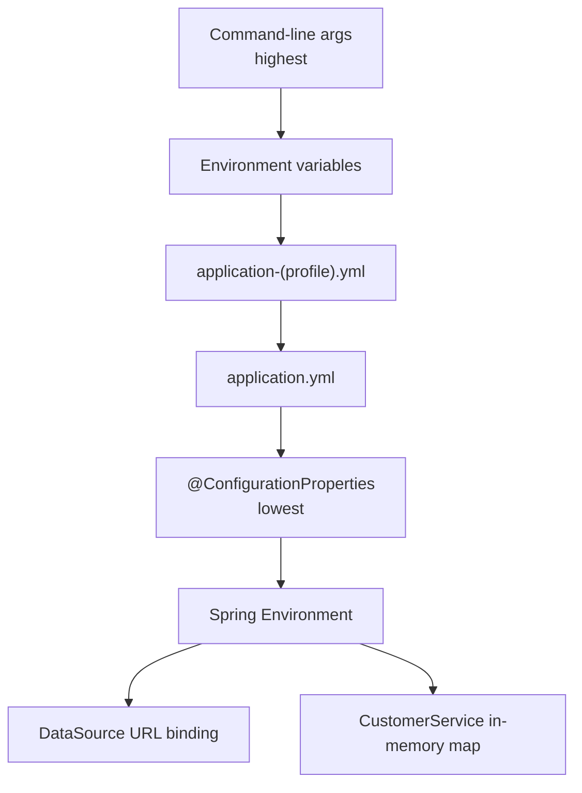

# Lab 26: Spring Profiles and Configuration — Northstar CRM Environments

> **Participants:** Module sequence is in [`../README.md`](../README.md). **Do not start this guide until** you have finished Module 26 [pre-lab exercises 1–6](../exercises/EXERCISES-INDEX.md) (Pass — check yourself, do not write it down; order **1 → 2 → 3 → 4 → 5 → 6**). Then open **one** OS how-to ([Windows](LAB-26-WINDOWS.md) · [macOS](LAB-26-MACOS.md)). In class, prefer the **45-minute timed path** with [`starter/`](starter/README.md); the **full path** is every Step below (homework / extended). This repo has no answer keys — complete the TODOs yourself. See [Which file do I open?](../../../_PARTICIPANT-FILE-GUIDE.md).

## Activity card

| | |
| --- | --- |
| **Objective** | Externalize CRM config with dev/test/prod profiles, typed properties, and secret hygiene |
| **Skills practiced** | Profile YAML, activation (-D + env), override order, @ConfigurationProperties |
| **Expected outcome** | Profile files · ConfigProperties · activation evidence · prod fail-fast · no secrets in Git |
| **Estimated time** | Timed path ~45 min · Full path 3–4 hours |
| **Prerequisites** | Lab 0 · Lab 25 preferred · Exercises 1–6 Pass · JDK 21 · Maven 3.9+ |
| **Expected files** | `examples/lab26-crm/` — YAML profiles, properties class, .env.example, notes |
| **Validation checkpoints** | Starter smoke · GUIDE Implementation Checkpoints |

**Module:** 26 — Spring Configuration, Profiles and Environments  
**Duration:** ~45 minutes (timed path with starter) · Full path: 3–4 Hours

**Primary IDE:** IntelliJ IDEA Community Edition · **Optional IDE:** VS Code

| OS | How-to for this lab |
| -- | ------------------- |
| Windows | [LAB-26-WINDOWS.md](LAB-26-WINDOWS.md) |
| macOS | [LAB-26-MACOS.md](LAB-26-MACOS.md) |

> **Incremental build:** Profile purposes → YAML TODOs → ConfigProperties → override order → activation → Lab 26.

> **Classroom pacing:** [`../PACING.md`](../PACING.md) (Checkpoints A–D).

> **Critical scope:** **Never commit real secrets**. `.env.example` placeholders only. Prove **`-D` and env** activation. **prod fail-fast** without required env vars. Vault/JWT/`@Transactional` → later.

## 45-minute timed path (use starter)

In class, use the starter templates so the **core** objectives fit **~45 minutes**. The full Steps below remain for homework / extended depth.

1. Open [`starter/README.md`](starter/README.md).
2. Copy `starter/` into `%USERPROFILE%\java-bootcamp\examples\lab26-crm` (Windows) or `~/java-bootcamp/examples/lab26-crm` (macOS/Linux) — see starter README.
3. Fill every `// TODO` — do **not** wait on a perfect prior lab; the starter includes a baseline CRM API.
4. Add `ProfileBindingTest` under `src/test` (starter ships **0** tests; solution has **Tests run: 1**), then smoke under `dev`.
5. Check timed-path Pass criteria in the starter README yourself (do not write the marks down). Continue remaining GUIDE steps as homework if needed.

| Path | Time | Scope |
| ---- | ---- | ----- |
| **Timed (default)** | ~45 min | Starter TODOs + `ProfileBindingTest` + smoke |
| **Full (extended)** | see Duration | Every Step in this GUIDE (override ladder, optional H2 console / JPA notes) |

---

## What you'll complete (practice only)

Labs and exercises are **practice only**. Nothing is submitted or graded. Do not take screenshots. Check Pass/Fail yourself — do not write those marks anywhere. Commit your work to your private `java-bootcamp` GitHub repo.

Keep this checklist visible while you work.

| # | Deliverable |
| - | ----------- |
| 1 | `application.yml` + `dev`/`test`/`prod` profile files |
| 2 | `NorthstarIntegrationProperties` + `@EnableConfigurationProperties` |
| 3 | `.env.example` placeholders only (`DB_USERNAME`, `DB_PASSWORD`, `NORTHSTAR_API_KEY`) |
| 4 | Evidence of `-D` and env profile activation |
| 5 | Fail-fast prod startup evidence (unresolved `${DB_PASSWORD}` / `${NORTHSTAR_API_KEY}`) |
| 6 | Override-order notes (full path) or short notes in `docs/profile-notes.md` |
| 7 | `ProfileBindingTest` green under `test` (**Tests run: 1**) |
| 8 | CRM smoke under `dev` for `CUS-1001` |

**Commit to your GitHub repo:** the items in the table above (sources + evidence + short notes).

**Do not commit:** `target/`, `node_modules/`, secrets, heap dumps, or a copied answer keys.

## Lab Overview

This Module 26 lab externalizes **environment-aware configuration** for the Customer Management Platform. You convert shared defaults to `application.yml`, split `application-dev.yml` / `application-test.yml` / `application-prod.yml`, activate profiles two ways, bind settings with `@ConfigurationProperties`, and keep real secrets out of Git.

The timed path uses **JDBC DataSource URLs only** (H2 in-memory for `dev`/`test`). There is **no JPA** and **no `/h2-console`** requirement in the starter/solution contract.

## Learning Objectives

After completing this lab, you will be able to:

* Explain Spring property-source override order (CLI > env > `application-{profile}.yml` > `application.yml` > code defaults)
* Structure `application.yml` plus `application-dev.yml`, `application-test.yml`, and `application-prod.yml`
* Activate a profile with `-Dspring.profiles.active` / `spring-boot.run.profiles` and with `SPRING_PROFILES_ACTIVE`
* Bind externalized configuration with a mutable `@ConfigurationProperties` class
* Keep prod secrets in env vars and prove fail-fast when placeholders are unresolved

## Business Scenario

Northstar’s CRM must run in three places: laptop sandbox (`dev`), CI (`test`), and shared production with PostgreSQL (`prod`). The team keeps shipping incidents caused by developer settings in shared files.

Leadership freezes:

**No profile-specific file may contain a real secret. Production credentials must come from environment variables. Missing required prod placeholders fail startup — never connect with blank passwords.**

Use these examples consistently:

| ID | Name | Notes |
| -- | ---- | ----- |
| `CUS-1001` | Amina Khan | `ACTIVE` — smoke under `dev` |
| `CUS-1002` | Ravi Singh | `PROSPECT` — smoke under `dev` |
| `lab-request-001` | — | correlation / evidence id |
| `DB_USERNAME` / `DB_PASSWORD` / `NORTHSTAR_API_KEY` | — | **env only** for prod — never real values in Git |
| `.env.example` | — | placeholders only |

**Security note for evidence.** Commit `.env.example` with lab placeholders. Never commit `.env`, real PostgreSQL passwords, or live API keys.

---

## Architecture Context
### NOW (this lab)



## Prerequisites

Prior labs: [Lab 25](../../module-25/lab25/LAB-25-GUIDE.md).

Confirm (Lab 0 tools assumed):

* JDK 21; Maven; Spring Boot 3
* Ability to set JVM system properties and OS environment variables (Bash or PowerShell)
* No secrets committed to Git

### Pre-flight

```bash
java -version
mvn -version
```

## Worked example (read before you code)

Study this pattern once before Step 1. Your job is to apply the same idea in the Steps — do not skip ahead to a full solution.

```yaml
# application.yml (base — shared defaults)
spring:
  application:
    name: northstar-crm
server:
  port: 8080
northstar:
  integration:
    api-base-url: http://localhost:9090
    connect-timeout-ms: 2000

# application-dev.yml (solution target)
spring:
  datasource:
    url: jdbc:h2:mem:lab26dev;DB_CLOSE_DELAY=-1;MODE=PostgreSQL
    username: sa
    password:
    driver-class-name: org.h2.Driver
logging:
  level:
    com.northstar.crm: DEBUG

# application-test.yml (solution target)
spring:
  datasource:
    url: jdbc:h2:mem:lab26test;DB_CLOSE_DELAY=-1;MODE=PostgreSQL
    username: sa
    password:
    driver-class-name: org.h2.Driver
northstar:
  integration:
    connect-timeout-ms: 100
```

**What to notice:** App name is `northstar-crm`. Base YAML uses `api-base-url` + `connect-timeout-ms` (default **2000**). H2 mem names are `lab26dev` / `lab26test`. Prod secrets bind only in `application-prod.yml` via env placeholders — not in base YAML.

---

## Implementation Steps

Complete each step in order. Commands assume `~/java-bootcamp/examples/lab26-crm` (Windows: `%USERPROFILE%\java-bootcamp\examples\lab26-crm`) unless noted.

---

### Step 1 — Copy starter and inventory YAML TODOs

**Why:** Timed path starts from starter, not a fragile Lab 25 copy.

**Do this:**

```bash
# Prefer starter copy (timed path) — see starter/README.md
cd ~/java-bootcamp/examples/lab26-crm
mkdir -p docs
```

**Full path (optional):** if branching an older CRM copy instead of starter, inventory every key before rewriting YAML.

List keys you will fill: `spring.application.name`, port, `northstar.integration.*`, datasource URLs per profile.

**Expected result:** Notes started in `docs/profile-notes.md` (not `config-notes.md`); project under `examples/lab26-crm`.

**If it fails:** Working only inside the course `labs/` clone → copy starter into `java-bootcamp/examples/lab26-crm` first.

---

### Step 2 — Complete shared defaults in `application.yml`

**Why:** Shared settings must be profile-agnostic so environment files only carry deltas.

**Do this:** Ensure base YAML matches the contract:

```yaml
spring:
  application:
    name: northstar-crm
  # Optional (solution): profiles.default: dev
server:
  port: 8080
northstar:
  integration:
    api-base-url: http://localhost:9090
    connect-timeout-ms: 2000
```

Do **not** put prod `api-key` or DB passwords in the base file. Add `spring-boot-starter-jdbc` if you bind a DataSource (solution does; starter may need the dependency for datasource YAML).

```bash
mvn -q clean compile
```

**Expected result:** Compile success; app name `northstar-crm`.

**If it fails:** Indentation errors → fix YAML structure.

---

### Step 3 — Author `application-dev.yml` and `application-test.yml`

**Why:** Developers need a loud local profile; CI needs a quiet isolated `test` profile — never the same file.

**Do this:**

```yaml
# application-dev.yml
spring:
  datasource:
    url: jdbc:h2:mem:lab26dev;DB_CLOSE_DELAY=-1;MODE=PostgreSQL
    username: sa
    password:
    driver-class-name: org.h2.Driver
logging:
  level:
    com.northstar.crm: DEBUG

# application-test.yml
spring:
  datasource:
    url: jdbc:h2:mem:lab26test;DB_CLOSE_DELAY=-1;MODE=PostgreSQL
    username: sa
    password:
    driver-class-name: org.h2.Driver
northstar:
  integration:
    connect-timeout-ms: 100
```

```bash
mvn spring-boot:run -Dspring-boot.run.profiles=dev
```

**Expected result:** Banner/active profile shows `dev`; GET `http://localhost:8080/api/customers/CUS-1001` still works (in-memory `CustomerService` seeds).

**Full path (optional):** enable H2 console or JPA `ddl-auto` only if you add those dependencies yourself — **not** part of the timed starter/solution contract.

**If it fails:** Profile not active → check activation and filename. Wrong mem name (`crmdev`) → use `lab26dev` / `lab26test`.

---

### Step 4 — Author `application-prod.yml` with env-only secrets

**Why:** Fail-fast missing credentials beat silent empty-password connects.

**Do this:**

```yaml
# application-prod.yml
spring:
  datasource:
    url: jdbc:postgresql://db.example.internal:5432/crm
    username: ${DB_USERNAME}
    password: ${DB_PASSWORD}
northstar:
  integration:
    api-key: ${NORTHSTAR_API_KEY}
```

```bash
# Bash / macOS / Linux:
mvn spring-boot:run -Dspring-boot.run.profiles=prod

# PowerShell (quotes required — otherwise Maven sees ".run.profiles=prod" as a lifecycle phase):
mvn spring-boot:run "-Dspring-boot.run.profiles=prod"
```

**Expected result:** Log shows `The following 1 profile is active: "prod"`, then **`APPLICATION FAILED TO START`**.

On this lab’s classpath (H2 only, no PostgreSQL driver), the usual root cause is:

`Failed to load driver class org.postgresql.Driver`

That still counts as the fail-fast proof: `prod` switched the JDBC URL to PostgreSQL and refused to stay up without a real prod database stack / env. Spring Boot does **not** always print `Could not resolve placeholder 'DB_PASSWORD'` for YAML-bound properties — missing `${DB_PASSWORD}` / `${NORTHSTAR_API_KEY}` are often left as the literal `${...}` string until something else (driver / connection / later use) breaks startup.

**If it “runs” instead of failing:**

1. Confirm the banner line is **`prod`**, not `dev`. Base `application.yml` sets `spring.profiles.default: dev`, so a plain `mvn spring-boot:run` (no profile flag) starts happily on H2.
2. On PowerShell, always quote `"-Dspring-boot.run.profiles=prod"`. Unquoted, Maven fails immediately with `Unknown lifecycle phase ".run.profiles=prod"` (app never starts).
3. Do not use defaults like `${DB_PASSWORD:}` / `${NORTHSTAR_API_KEY:}` for secrets.
4. Env names are **`DB_PASSWORD`** and **`NORTHSTAR_API_KEY`** (not a bare `API_KEY`).

---

### Step 5 — Activate profiles two ways

**Why:** Ops and CI activate profiles differently; students must know both dials.

**Do this:**

```bash
mvn spring-boot:run -Dspring-boot.run.profiles=dev
# packaged form (after package):
# java -Dspring.profiles.active=dev -jar target/*.jar
```

Then (Bash):

```bash
export SPRING_PROFILES_ACTIVE=test
mvn spring-boot:run
unset SPRING_PROFILES_ACTIVE
```

PowerShell equivalent: `$env:SPRING_PROFILES_ACTIVE="test"` then clear.

**Expected result:** Evidence of both activation styles in `docs/profile-notes.md` (banner lines).

**If it fails:** Env var ignored in same shell where `-D` also set → document which wins next step.

---

### Step 6 — Prove override order with `connect-timeout-ms` (full path)

**Why:** Trust the precedence table by watching the same key change winners.

**Timed path:** optional — notes in `docs/profile-notes.md` are enough if class time is short.

**Do this:** Under `test` profile (YAML value `100`), then set `NORTHSTAR_INTEGRATION_CONNECT_TIMEOUT_MS=9999`, then `-Dnorthstar.integration.connect-timeout-ms=1234`. Record effective value via a small `@ConfigurationProperties` log/test (actuator `/env` is optional and not required in starter YAML).

| Layer | Source | Expected connect-timeout-ms |
| ----- | ------ | ------------------- |
| Profile YAML | `application-test.yml` | 100 |
| Env var | `NORTHSTAR_INTEGRATION_CONNECT_TIMEOUT_MS` | 9999 |
| CLI `-D` | system property | 1234 |

**Expected result:** Recorded measurements matching the table; CLI wins over env.

**If it fails:** Relaxed binding confusion (`connect-timeout-ms` vs `connectTimeoutMs`) → use Boot’s relaxed rules consistently.

---

### Step 7 — Bind `@ConfigurationProperties` and `.env.example`

**Why:** Typed binding fails with named fields instead of late NPEs.

**Do this:** Complete `NorthstarIntegrationProperties` as a **mutable class** (not a record) with prefix `northstar.integration`, fields `apiBaseUrl`, `connectTimeoutMs` (default **2000**), `apiKey`, plus getters/setters. Annotate with `@ConfigurationProperties` and enable via `@EnableConfigurationProperties` on `CrmApplication`.

Bean Validation (`@Validated` / `@NotBlank`) is **not** required for the timed path — the starter/solution class has none.

Add `.env.example`:

```text
# Copy to .env locally — never commit real values
DB_USERNAME=crm
DB_PASSWORD=change-me
NORTHSTAR_API_KEY=lab-only-key
```

Ensure `.gitignore` ignores `.env`.

```bash
mvn spring-boot:run -Dspring-boot.run.profiles=prod
```

**Expected result:** Fail-fast on unresolved prod placeholders; `.env.example` committed; `.env` not.

**If it fails:** Properties not bound → enable config props + correct prefix.

---

### Step 8 — Tests under `test` profile + CRM smoke under `dev`

**Why:** Config work must not break CRM fixtures or CI quietness.

**Do this:** Starter has **no** tests yet. Add `com.northstar.crm.ProfileBindingTest` (see solution pattern):

* `@SpringBootTest` + `@ActiveProfiles("test")`
* Assert `connectTimeoutMs == 100`, `apiBaseUrl == "http://localhost:9090"`, customer `CUS-1001` / `"Amina Khan"`

```bash
mvn -B test -Dspring.profiles.active=test
# Expected: Tests run: 1, BUILD SUCCESS
# Optional: run a second time for determinism evidence ("dual green" = same suite twice, still 1 test)
mvn -B test -Dspring.profiles.active=test
```

Under `dev`, curl `CUS-1001` with `X-Correlation-Id: lab-request-001`.

**Expected result:** **Tests run: 1** · `ProfileBindingTest` green; `dev` smoke succeeds; notes in `docs/profile-notes.md`.

**If it fails:** Tests picking wrong profile → force `@ActiveProfiles("test")`. Missing assertions → replace starter ProfileBindingTest TODO stub.

---

### Step 9 — Failure experiments + secrets hygiene pack

**Why:** The lab’s culture win is catching secrets before commit, not only green `dev`.

**Do this:** Complete Failure Experiments including staged fake secret detection. `git status --short` shows no `.env`, no real passwords. Capture fail-fast prod startup excerpt.

**Expected result:** ≥3 experiments; secrets hygiene clean; evidence saved.

**If it fails:** See Troubleshooting.

---

## Implementation Checkpoints

### Checkpoint A — Tooling / structure

_Check **Pass** or **Fail** yourself. Do not write these marks anywhere — nothing is submitted or graded. Commit your work to your GitHub repo._

| # | Confirm | Self-check |
| - | ------- | ---------- |
| 1 | `lab26-crm` under `examples/` | Pass / Fail |
| 2 | Shared `application.yml` with `name: northstar-crm` | Pass / Fail |
| 3 | `.gitignore` covers `.env` / secrets | Pass / Fail |

### Checkpoint B — Profile files

_Check **Pass** or **Fail** yourself. Do not write these marks anywhere — nothing is submitted or graded. Commit your work to your GitHub repo._

| # | Confirm | Self-check |
| - | ------- | ---------- |
| 1 | `application-dev.yml` / `-test.yml` / `-prod.yml` exist | Pass / Fail |
| 2 | H2 URLs use `lab26dev` / `lab26test`; prod URL hard-coded host | Pass / Fail |
| 3 | `dev` CRM smoke for `CUS-1001` works | Pass / Fail |

### Checkpoint C — Activation + binding

_Check **Pass** or **Fail** yourself. Do not write these marks anywhere — nothing is submitted or graded. Commit your work to your GitHub repo._

| # | Confirm | Self-check |
| - | ------- | ---------- |
| 1 | Activation via `-D` and via env evidenced | Pass / Fail |
| 2 | `docs/profile-notes.md` present | Pass / Fail |
| 3 | `@ConfigurationProperties` class + fail-fast on prod | Pass / Fail |

### Checkpoint D — Hygiene

_Check **Pass** or **Fail** yourself. Do not write these marks anywhere — nothing is submitted or graded. Commit your work to your GitHub repo._

| # | Confirm | Self-check |
| - | ------- | ---------- |
| 1 | `ProfileBindingTest` — Tests run: 1 under `test` | Pass / Fail |
| 2 | `.env.example` only; no secrets staged | Pass / Fail |
| 3 | README / notes runbook complete | Pass / Fail |

---

## Reference Commands, Configuration, and Code

### Override order

```text
1. Command-line arguments        (-Dspring.profiles.active=dev, -Dkey=value)
2. Environment variables         (SPRING_PROFILES_ACTIVE, DB_PASSWORD, ...)
3. application-{profile}.yml     (application-dev.yml, application-prod.yml, ...)
4. application.yml               (shared base defaults)
5. @ConfigurationProperties / @Value defaults baked into code
```

### `application.yml` (base)

```yaml
spring:
  application:
    name: northstar-crm
  profiles:
    default: dev
server:
  port: 8080
northstar:
  integration:
    api-base-url: http://localhost:9090
    connect-timeout-ms: 2000
```

### `.env.example`

```text
# Copy to .env locally — never commit real values
DB_USERNAME=crm
DB_PASSWORD=change-me
NORTHSTAR_API_KEY=lab-only-key
```

### Commands

```bash
cd ~/java-bootcamp/examples/lab26-crm
mvn spring-boot:run -Dspring-boot.run.profiles=dev
curl -s -H "X-Correlation-Id: lab-request-001" http://localhost:8080/api/customers/CUS-1001
mvn -B test -Dspring.profiles.active=test
# expect Tests run: 1
# expect fail without env:
mvn spring-boot:run -Dspring-boot.run.profiles=prod

# PowerShell profile via env:
# $env:SPRING_PROFILES_ACTIVE="test"
# mvn spring-boot:run
# Remove-Item Env:SPRING_PROFILES_ACTIVE

git status --short
```

## Failure Experiments

| # | Experiment | Observe | Restore |
| - | ---------- | ------- | ------- |
| 1 | `prod` without `DB_PASSWORD` | Fail-fast startup | Unset experiment vars |
| 2 | Env `test` + CLI `dev` | Document which wins | Unset |
| 3 | Rename key only in YAML (binding mismatch) | Bind fail or fallback | Fix name |
| 4 | Temporarily put `DB_PASSWORD=hunter2` in prod YAML | Catch via `git status`/`diff` | Revert immediately |
| 5 | Leave `SPRING_PROFILES_ACTIVE` unset where default is `dev` | Confirm default path | Document blast radius for real prod |

---

## Troubleshooting

| Symptom | Likely cause | Fix |
| ------- | ------------ | --- |
| Profile ignored | Wrong filename / not activated | `application-{name}.yml` + active profile |
| Env not picked up | Not exported in same shell / need restart | Restart after env change |
| Tests use `dev` | No test profile force | `@ActiveProfiles("test")` |
| Prod starts empty password | Default `${VAR:}` used | Remove secret defaults |
| Binding null | Prefix/enable missing | `@EnableConfigurationProperties` |
| Datasource bean missing | No JDBC starter | Add `spring-boot-starter-jdbc` |
| Working in `module-26-exercises` for the lab | Wrong project | Lab lives in `examples/lab26-crm` |
| Real password committed | Secret hygiene failure | Remove, rotate, use `.env.example` only |

## Security and Production Review

Optional — jot brief notes in your README if useful for your progress check (not a separate essay):

1. Which config values are sensitive per profile, and where stored?
2. Why must `application-prod.yml` avoid defaults for DB username/password?
3. What if a real PostgreSQL password is committed — detect, rotate, scrub history policy?

---


## Cleanup

```bash
cd ~/java-bootcamp/examples/lab26-crm
# Ctrl+C any spring-boot:run
unset SPRING_PROFILES_ACTIVE NORTHSTAR_INTEGRATION_CONNECT_TIMEOUT_MS DB_USERNAME DB_PASSWORD NORTHSTAR_API_KEY
mvn -q clean
git status --short
```

**Keep `lab26-crm`**—Lab 27 builds transactional services on this config discipline.


## Reflection Questions

Write **1–3 sentence** answers (not essays):

1. Which design decision most affected correctness — YAML split or typed binding?
2. What evidence proves `prod` cannot start with blank credentials?
3. Which failure was hardest (missing prop, wrong profile, override confusion)?

---
