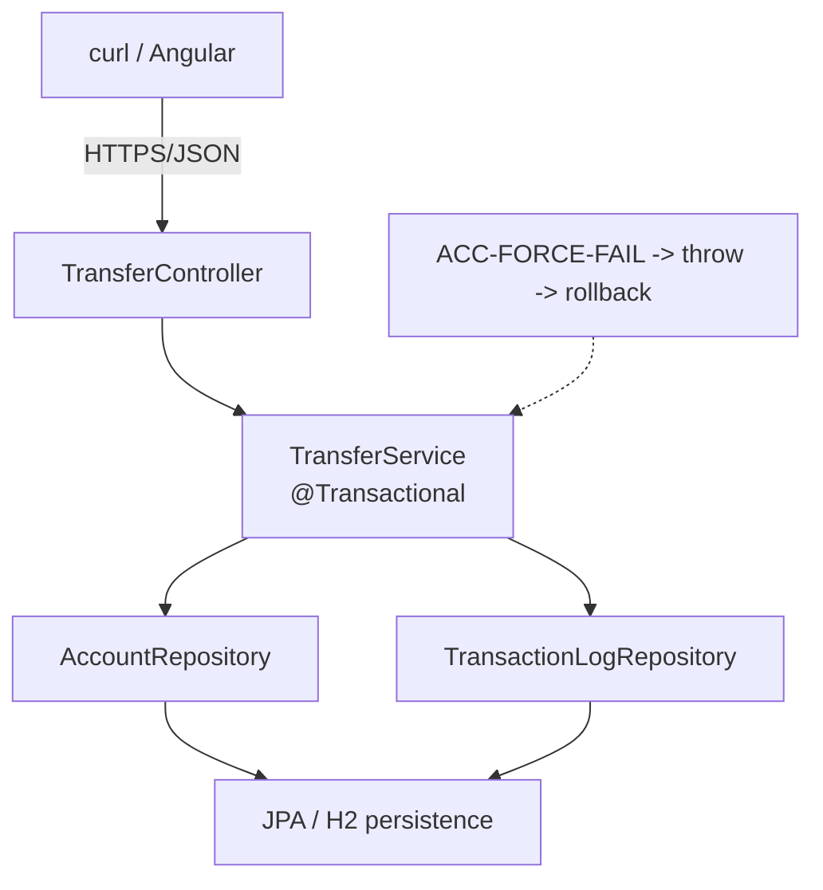

# Lab 27: Transaction Management with AI Assistance — Northstar CRM Transfers

> **Participants:** Module sequence is in [`../README.md`](../README.md). **Do not start this guide until** you have finished Module 27 [pre-lab exercises 1–6](../exercises/EXERCISES-INDEX.md) (Pass — check yourself, do not write it down; order **1 → 2 → 3 → 4 → 5 → 6**). Then open **one** OS how-to ([Windows](LAB-27-WINDOWS.md) · [macOS](LAB-27-MACOS.md)). In class, prefer the **45-minute timed path** with [`starter/`](starter/README.md); the **full path** is every Step below (homework / extended). This repo has no answer keys — complete the TODOs yourself. See [Which file do I open?](../../../_PARTICIPANT-FILE-GUIDE.md).

## Activity card

| | |
| --- | --- |
| **Objective** | Implement atomic TransferService (debit + credit + log) with proven rollback |
| **Skills practiced** | @Transactional, ACID evidence, ACC-FORCE-FAIL, AI TX review |
| **Expected outcome** | Happy MAIN→LOYALTY · forced-fail rollback · ACID notes · tests green |
| **Estimated time** | Timed path ~45 min · Full path 4–5 hours |
| **Prerequisites** | Lab 0 · Labs 25–26 preferred · Exercises 1–6 Pass · JDK 21 · Maven 3.9+ |
| **Expected files** | `examples/lab27-crm/` — TransferService, accounts, log, acid-notes, tests |
| **Validation checkpoints** | Starter smoke · GUIDE Implementation Checkpoints |

**Module:** 27 — Transaction Management with AI Assistance  
**Duration:** ~45 minutes (timed path with starter) · Full path: 4–5 Hours

**Primary IDE:** IntelliJ IDEA Community Edition · **Optional IDE:** VS Code

| OS | How-to for this lab |
| -- | ------------------- |
| Windows | [LAB-27-WINDOWS.md](LAB-27-WINDOWS.md) |
| macOS | [LAB-27-MACOS.md](LAB-27-MACOS.md) |

> **Incremental build:** ACID → TX boundary → rollback plan → pseudocode → propagation warnings → Lab 27.

> **Classroom pacing:** [`../PACING.md`](../PACING.md) (Checkpoints A–D).

> **Critical scope:** `@Transactional` on **service** only. Prove **`ACC-FORCE-FAIL`**. ACID notes cite **evidence**. Reject AI drafts that swallow exceptions or split commits. JWT / XA → later.

## 45-minute timed path (use starter)

In class, use the starter templates so the **core** objectives fit **~45 minutes**. The full Steps below remain for homework / extended depth.

1. Open [`starter/README.md`](starter/README.md).
2. Copy `starter/` into `%USERPROFILE%\java-bootcamp\examples\lab27-crm` or `~/java-bootcamp/examples/lab27-crm`.
3. Fill every `// TODO` in `TransferService` (and related stubs) — starter already seeds accounts and H2.
4. Complete the two automated tests (`forceFailRollsBack` + `happyPathMovesFunds`); starter may ship only the force-fail stub.
5. Mark timed-path Pass criteria. Continue remaining GUIDE steps as homework if needed.

| Path | Time | Scope |
| ---- | ---- | ----- |
| **Timed (default)** | ~45 min | Starter TODOs + **Tests run: 2** + smoke curls |
| **Full (extended)** | see Duration | Optional insufficient-funds / missing-dest cases, AI review depth |

---

## What you'll complete (practice only)

Labs and exercises are **practice only**. Nothing is submitted or graded. Do not take screenshots. Check Pass/Fail yourself — do not write those marks anywhere. Commit your work to your private `java-bootcamp` GitHub repo.

Keep this checklist visible while you work.

| # | Deliverable |
| - | ----------- |
| 1 | `@Transactional TransferService` + thin controller |
| 2 | Seeded accounts + `TransactionLog` entity |
| 3 | Happy-path evidence (MAIN→LOYALTY balances) |
| 4 | `ACC-FORCE-FAIL` rollback evidence (balances + no log) |
| 5 | ACID explanation in `docs/acid-notes.md` |
| 6 | Automated tests: `forceFailRollsBack` + `happyPathMovesFunds` (**Tests run: 2**) |
| 7 | AI review notes or manual equivalent (full path) |
| 8 | README runbook; no secrets/`target/` committed |

**Commit to your GitHub repo:** the items in the table above (sources + evidence + short notes).

**Do not commit:** `target/`, `node_modules/`, secrets, heap dumps, or a copied answer keys.

## Lab Overview

This Module 27 lab adds Spring **`@Transactional`** boundaries for CRM financial-account updates that must succeed or fail together. You implement a **`TransferService`** (debit + credit + log), prove automatic **rollback** with destination `ACC-FORCE-FAIL`, and map observations to **ACID** guarantees.

## Learning Objectives

After completing this lab, you will be able to:

* Place `@Transactional` on service methods that span multiple account updates
* Explain Spring proxy-based transaction demarcation and why self-invocation skips it
* Implement a transfer (debit + credit + transaction log) for CRM accounts
* Force a mid-operation failure with `ACC-FORCE-FAIL` and prove both sides roll back
* Map Atomicity, Consistency, Isolation, and Durability to observable CRM behavior

## Business Scenario

Agents move funds between sub-accounts (for example MAIN → LOYALTY) as one business operation. A debit without a credit is an incident.

Leadership freezes:

**All multi-account money movement goes through `@Transactional TransferService`. Demonstrate rollback with `ACC-FORCE-FAIL`. Document ACID with before/after balances. Controllers must not own transaction boundaries.**

Use these examples consistently:

| ID | Name / role | Notes |
| -- | ----------- | ----- |
| `CUS-1001` | Amina Khan | owns MAIN + LOYALTY |
| `ACC-MAIN-1001` | Amina MAIN | seed balance `1000.00` |
| `ACC-LOYALTY-1001` | Amina LOYALTY | seed balance `50.00` |
| `ACC-FORCE-FAIL` | synthetic sink | **not persisted** — triggers rollback demo |
| `lab-request-001` | correlation | header for evidence |

**Timed path seeds only** `ACC-MAIN-1001` and `ACC-LOYALTY-1001`. Do **not** invent `ACC-1002-MAIN` unless your instructor assigns a stretch.

**Security note for evidence.** Fictional balances only. Never commit real ledger dumps or DB passwords. H2 blank password is lab-only.

---

## Architecture Context
### NOW (this lab)



## Prerequisites

Prior labs: [25](../../module-25/lab25/LAB-25-GUIDE.md) · [26](../../module-26/lab26/LAB-26-GUIDE.md).

Confirm (Lab 0 tools assumed):

* JDK 21; Maven; Spring Boot 3.x
* Layered service/repository skills from Lab 25
* `spring-boot-starter-data-jpa` + H2 (starter includes these)
* Copilot optional; review required
* No secrets committed to Git

### Pre-flight

```bash
java -version
mvn -version
```

## Worked example (read before you code)

Study this pattern once before Step 1. Align with the **solution order**: validate amount → load from → **debit + save** → force-fail check → credit + log. Debit-before-fail makes rollback meaningful.

```java
import org.springframework.transaction.annotation.Transactional;
import java.math.BigDecimal;

@Transactional
public void transfer(String fromAccountId, String toAccountId, BigDecimal amount) {
  if (amount == null || amount.signum() <= 0) {
    throw new IllegalArgumentException("Amount must be positive");
  }
  Account from = accounts.findById(fromAccountId)
      .orElseThrow(() -> new IllegalArgumentException("Unknown from account"));
  from.setBalance(from.getBalance().subtract(amount));
  accounts.save(from);

  if ("ACC-FORCE-FAIL".equals(toAccountId)) {
    throw new IllegalStateException("Forced transfer failure for rollback demo");
  }

  Account to = accounts.findById(toAccountId)
      .orElseThrow(() -> new IllegalArgumentException("Unknown to account"));
  to.setBalance(to.getBalance().add(amount));
  accounts.save(to);

  TransactionLog log = new TransactionLog();
  log.setFromAccountId(fromAccountId);
  log.setToAccountId(toAccountId);
  log.setAmount(amount);
  logs.save(log);
}
```

There is **no** `@ExceptionHandler` in this lab — force-fail bubbles as default HTTP **500**. Controllers return `{"status":"OK"}` with HTTP **200** on success.

**What to notice:** Match account field names (`id`, `customerId`, `type`, `balance`) and seed IDs — instructors check these.

---

## Implementation Steps

Complete each step in order. Commands assume `~/java-bootcamp/examples/lab27-crm` (Windows: `%USERPROFILE%\java-bootcamp\examples\lab27-crm`) unless noted.

---

### Step 1 — Copy starter and confirm JPA/H2

**Why:** Rollback is only convincing when a real unit of work commits or rolls back in a datastore.

**Do this:**

```bash
# Timed path: copy starter/ — see starter/README.md
cd ~/java-bootcamp/examples/lab27-crm
mkdir -p docs
```

Confirm datasource (starter/solution):

```yaml
spring:
  datasource:
    url: jdbc:h2:mem:lab27;DB_CLOSE_DELAY=-1
    username: sa
    password:
  jpa:
    hibernate:
      ddl-auto: update
```

Confirm `@Entity Account` fields: `id` (String `@Id`), `customerId`, `type`, `balance` — **not** `accountId` / `status`.

```bash
mvn -q -DskipTests package
```

**Expected result:** `BUILD SUCCESS`; H2 URL is `lab27`.

**If it fails:** Missing H2 dependency → check starter `pom.xml`. Wrong mem name `crm` → use `lab27`.

---

### Step 2 — Confirm seeded accounts

**Why:** Fixed balances make rollback diffs reproducible.

**Do this:** Starter `AccountSeed` already loads:

| ID | type | balance |
| -- | ---- | ------- |
| `ACC-MAIN-1001` | `MAIN` | `1000.00` |
| `ACC-LOYALTY-1001` | `LOYALTY` | `50.00` |

`ACC-FORCE-FAIL` is **not** stored — it is only a destination string that triggers the throw.

**Expected result:** Seeds present for Amina’s MAIN + LOYALTY only.

**If it fails:** Seeds not loading → check `AccountSeed` / `CommandLineRunner` package scan.

---

### Step 3 — Repositories and `TransactionLog` entity

**Why:** The success log must commit in the **same** transaction as the money movement — or roll back with it.

**Do this:** Confirm (starter already has):

```java
import jakarta.persistence.Entity;
import jakarta.persistence.GeneratedValue;
import jakarta.persistence.Id;
import java.math.BigDecimal;
import jakarta.persistence.GenerationType;
import java.time.Instant;
import org.springframework.data.jpa.repository.JpaRepository;

public interface AccountRepository extends JpaRepository<Account, String> {}

@Entity
public class TransactionLog {
  @Id @GeneratedValue(strategy = GenerationType.IDENTITY)
  private Long id;
  private String fromAccountId;
  private String toAccountId;
  private BigDecimal amount;
  private Instant createdAt = Instant.now();
  // getters/setters
}
```

**Timed path:** empty `JpaRepository` is enough — no `findByCustomerId` required.

**Expected result:** Log repo is a Spring bean; fields match `id` / `fromAccountId` / `toAccountId` / `amount` / `createdAt`.

**If it fails:** Entity scan miss → package under `com.northstar.crm`.

---

### Step 4 — Implement `@Transactional TransferService`

**Why:** Proxy-applied boundaries on **public service methods** are the Boot-standard unit of work.

**Do this:** Fill starter TODOs. Use the debit-then-force-fail order from the Worked example. Message must be `"Forced transfer failure for rollback demo"`.

Optional Copilot prompt: “Spring Boot TransferService with @Transactional debit/credit and TransactionLog.” Reject placing `@Transactional` only on the controller; reject swallowed catches around debit/credit.

**Expected result:** Compiles; method public; no broad catch that prevents rollback.

**If it fails:** Self-invocation → move calls through injected proxy/another bean.

---

### Step 5 — Expose `POST /api/transfers` and prove happy path

**Why:** Leadership acceptance is ledger + log evidence, not only a green compile.

**Do this:** Thin controller returns a Map body (starter pattern):

```java
import org.springframework.web.bind.annotation.PostMapping;
import org.springframework.web.bind.annotation.RequestBody;
import java.math.BigDecimal;
import java.util.Map;

@PostMapping
public Map<String, String> transfer(@RequestBody Map<String, String> body) {
  transferService.transfer(
      body.get("fromAccountId"),
      body.get("toAccountId"),
      new BigDecimal(body.get("amount")));
  return Map.of("status", "OK");
}
```

Success is HTTP **200** with `{"status":"OK"}` — **not** 204 NO_CONTENT.

```bash
curl -s -X POST http://localhost:8080/api/transfers \
  -H "Content-Type: application/json" \
  -H "X-Correlation-Id: lab-request-001" \
  -d '{"fromAccountId":"ACC-MAIN-1001","toAccountId":"ACC-LOYALTY-1001","amount":"50.00"}'
```

**Expected result:** Body `{"status":"OK"}` HTTP 200; after a **50.00** curl demo MAIN `950.00`, LOYALTY `100.00`. (Unit test happy path uses amount **5.00** — see Step 8.)

**If it fails:** 404 accounts → seeds. TX not committing → check exception paths / bean proxy.

---

### Step 6 — Rollback demo with `ACC-FORCE-FAIL`

**Why:** Atomicity is proven only when a failure leaves both balances and log as they were.

**Do this:** Record MAIN balance before call. Transfer to `ACC-FORCE-FAIL`.

```bash
curl -s -i -X POST http://localhost:8080/api/transfers \
  -H "Content-Type: application/json" \
  -H "X-Correlation-Id: lab-request-001" \
  -d '{"fromAccountId":"ACC-MAIN-1001","toAccountId":"ACC-FORCE-FAIL","amount":"10.00"}'
```

**Expected result:** HTTP **500** (default for unhandled `IllegalStateException` — no ExceptionHandler in this lab); MAIN unchanged vs pre-call; no success `TransactionLog` for the failed attempt.

**If it fails:** MAIN decreased → not rolling back. Log row present → log saved in a separate transaction — keep one TX.

---

### Step 7 — Document ACID with lab evidence

**Why:** Naming ACID without pointing to curls/balances fails the lab’s communication goal.

**Do this:** In `docs/acid-notes.md`:

| Property | CRM observation in this lab |
| -------- | --------------------------- |
| Atomicity | Failed `ACC-FORCE-FAIL` leaves MAIN unchanged; no log |
| Consistency | Balances stay non-negative for the happy path you ran |
| Isolation | State expectation for concurrent transfers (discuss; bonus to demo) |
| Durability | After success, restart caveats for H2 mem vs file/PostgreSQL |

State H2 in-memory durability limits honestly. Account entity has **no** `status` field — do not invent “status rules.”

**Expected result:** Evidence-linked ACID section; durability caveat explicit.

**If it fails:** Slogan-only table → add curl/balance citations.

---

### Step 8 — Automated tests (**Tests run: 2**)

**Why:** Rollback asserts on balances beat “exception was thrown” alone.

**Do this:** Complete `TransferServiceTest`:

1. `forceFailRollsBack` — MAIN unchanged after `ACC-FORCE-FAIL`
2. `happyPathMovesFunds` — transfer **5.00** MAIN→LOYALTY

```bash
mvn -B test
# Expected: Tests run: 2, BUILD SUCCESS
```

**Full path (optional):** add insufficient-funds or missing-destination cases — **not** required for timed Pass. Solution does not implement an insufficient-funds check.

**Expected result:** **Tests run: 2**; both methods green.

**If it fails:** Starter only has force-fail → add `happyPathMovesFunds`. Dirty balances → reset/`@BeforeEach`.

---

### Step 9 — Failure experiments + evidence pack

**Why:** Ledger support needs more than one happy curl.

**Do this:** Complete Failure Experiments. Commit your work to your GitHub repo. Do not take screenshots.

**Expected result:** ≥3 experiments; Tests run: 2; ACID + rollback evidence packaged.

**If it fails:** See Troubleshooting.

---

## Implementation Checkpoints

### Checkpoint A — Tooling

_Check **Pass** or **Fail** yourself. Do not write these marks anywhere — nothing is submitted or graded. Commit your work to your GitHub repo._

| # | Confirm | Self-check |
| - | ------- | ---------- |
| 1 | `lab27-crm` under `examples/` | Pass / Fail |
| 2 | JPA + H2 with `jdbc:h2:mem:lab27` | Pass / Fail |
| 3 | Account fields `id` / `customerId` / `type` / `balance` | Pass / Fail |

### Checkpoint B — Transfer core

_Check **Pass** or **Fail** yourself. Do not write these marks anywhere — nothing is submitted or graded. Commit your work to your GitHub repo._

| # | Confirm | Self-check |
| - | ------- | ---------- |
| 1 | Seeds `ACC-MAIN-1001` + `ACC-LOYALTY-1001` only | Pass / Fail |
| 2 | `@Transactional TransferService` + `TransactionLog` | Pass / Fail |
| 3 | Happy MAIN→LOYALTY → HTTP **200** `{"status":"OK"}` | Pass / Fail |

### Checkpoint C — Rollback + ACID

_Check **Pass** or **Fail** yourself. Do not write these marks anywhere — nothing is submitted or graded. Commit your work to your GitHub repo._

| # | Confirm | Self-check |
| - | ------- | ---------- |
| 1 | `ACC-FORCE-FAIL` → HTTP **500**; MAIN unchanged; no success log | Pass / Fail |
| 2 | ACID table cites observations in `docs/acid-notes.md` | Pass / Fail |
| 3 | Tests run: 2 (`forceFailRollsBack` + `happyPathMovesFunds`) | Pass / Fail |

### Checkpoint D — Hygiene

_Check **Pass** or **Fail** yourself. Do not write these marks anywhere — nothing is submitted or graded. Commit your work to your GitHub repo._

| # | Confirm | Self-check |
| - | ------- | ---------- |
| 1 | `mvn test` green (Tests run: 2) | Pass / Fail |
| 2 | README / notes runbook complete | Pass / Fail |
| 3 | No secrets / `target/` committed | Pass / Fail |

---

## Reference Commands, Configuration, and Code

### `application.yml` (H2 lab baseline)

```yaml
spring:
  datasource:
    url: jdbc:h2:mem:lab27;DB_CLOSE_DELAY=-1
    username: sa
    password:
  jpa:
    hibernate:
      ddl-auto: update
    show-sql: true
```

### Commands

```bash
cd ~/java-bootcamp/examples/lab27-crm
mvn spring-boot:run
curl -s -H "X-Correlation-Id: lab-request-001" \
  -H "Content-Type: application/json" \
  -d '{"fromAccountId":"ACC-MAIN-1001","toAccountId":"ACC-LOYALTY-1001","amount":"50.00"}' \
  http://localhost:8080/api/transfers
# expect 200 {"status":"OK"}
curl -s -i -H "X-Correlation-Id: lab-request-001" \
  -H "Content-Type: application/json" \
  -d '{"fromAccountId":"ACC-MAIN-1001","toAccountId":"ACC-FORCE-FAIL","amount":"10.00"}' \
  http://localhost:8080/api/transfers
# expect HTTP 500; MAIN unchanged
mvn -B test
# Tests run: 2
git status
```

## Failure Experiments

| # | Experiment | Observe | Restore |
| - | ---------- | ------- | ------- |
| 1 | Wrong JDBC URL | Start/transfer failure | Fix URL → `lab27` |
| 2 | Force-fail to `ACC-FORCE-FAIL` | HTTP 500; MAIN unchanged | Keep rollback path |
| 3 | Repeat successful transfer without idempotency key | Double movement risk | Document fix |
| 4 | Artificial sleep inside TX | Long lock discussion | Remove sleep |
| 5 | Self-invoke `this.transfer` from non-TX method | Rollback may not apply | Call via Spring bean |

**Full path optional:** transfer more than MAIN holds — only if you add an insufficient-funds check (not in solution).

---

## Troubleshooting

| Symptom | Likely cause | Fix |
| ------- | ------------ | --- |
| No rollback | Self-invocation / caught exception | Proxy call; rethrow unchecked |
| Rollback but log committed | Separate TX / `REQUIRES_NEW` | Same TX as debit/credit |
| Flaky balances in tests | Shared DB state | Reset seeds per test |
| Expecting HTTP 409 on force-fail | No ExceptionHandler | Default is **500** |
| Expecting 204 on success | Controller returns body | Return Map → **200** |
| Working in `module-27-exercises` for the lab | Wrong project | Lab lives in `examples/lab27-crm` |
| AI draft catches Exception and returns null | Swallowed failure | Rethrow unchecked; keep rollback |

## Security and Production Review

Optional — jot brief notes in your README if useful for your progress check (not a separate essay):

1. Which inputs are untrusted (amount, account IDs, headers)?
2. Where are authn/authz/validation enforced (Lab 28 deepens)?
3. Which values are sensitive (balances), and where stored?

---


## Cleanup

```bash
cd ~/java-bootcamp/examples/lab27-crm
# Ctrl+C spring-boot:run
mvn -q clean
git status
```

**Keep `lab27-crm`**—Lab 28 secures customer APIs.


## Reflection Questions

Write **1–3 sentence** answers (not essays):

1. Which design decision most affected correctness (transaction boundary size)?
2. What evidence proves rollback works?
3. Which failure was hardest (proxy / self-invocation / exception type)?

---
