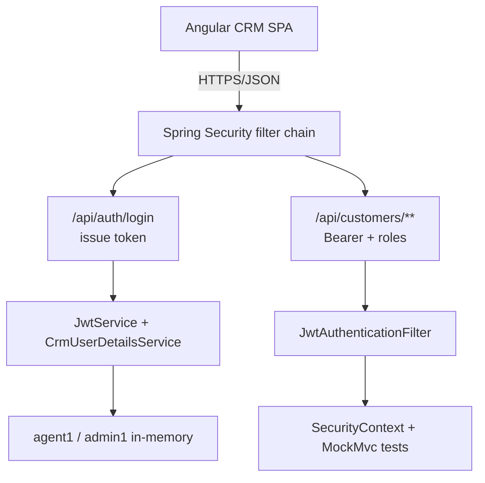

# Lab 28: Spring Security Basics — Northstar CRM JWT and Roles

> **Participants:** Module sequence is in [`../README.md`](../README.md). **Do not start this guide until** you have finished Module 28 [pre-lab exercises 1–6](../exercises/EXERCISES-INDEX.md) (Pass — check yourself, do not write it down; order **1 → 2 → 3 → 4 → 5 → 6**). Then open **one** OS how-to ([Windows](LAB-28-WINDOWS.md) · [macOS](LAB-28-MACOS.md)). In class, prefer the **45-minute timed path** with [`starter/`](starter/README.md); the **full path** is every Step below (homework / extended). This repo has no answer keys — complete the TODOs yourself. See [Which file do I open?](../../../_PARTICIPANT-FILE-GUIDE.md).

## Activity card

| | |
| --- | --- |
| **Objective** | Add JWT login + SecurityFilterChain with AGENT/ADMIN protection and 401/403 proofs |
| **Skills practiced** | SecurityFilterChain, JwtService, roles, MockMvc security matrix |
| **Expected outcome** | Login token · Bearer GET CUS-1001 · 401/403 evidence · security-notes · no secrets in Git |
| **Estimated time** | Timed path ~45 min · Full path 4–5 hours |
| **Prerequisites** | Lab 0 · Labs 25–27 preferred · Exercises 1–6 Pass · JDK 21 · Maven 3.9+ |
| **Expected files** | `examples/lab28-crm/` — security config, JWT, tests, docs/security-notes.md |
| **Validation checkpoints** | Starter smoke · GUIDE Implementation Checkpoints |

**Module:** 28 — Spring Security Basics  
**Duration:** ~45 minutes (timed path with starter) · Full path: 4–5 Hours

**Primary IDE:** IntelliJ IDEA Community Edition · **Optional IDE:** VS Code

| OS | How-to for this lab |
| -- | ------------------- |
| Windows | [LAB-28-WINDOWS.md](LAB-28-WINDOWS.md) |
| macOS | [LAB-28-MACOS.md](LAB-28-MACOS.md) |

> **Incremental build:** Authn/authz → filter chain → JWT login → MockMvc matrix → IdP checklist → Lab 28.

> **Classroom pacing:** [`../PACING.md`](../PACING.md) (Checkpoints A–E).

> **Critical scope:** Distinguish **401 vs 403**. Roles **AGENT** / **ADMIN**. **Never commit JWT secrets**. Full OAuth2 Authorization Server / Angular token UI → later. Lab 29 adds validation polish.

## 45-minute timed path (use starter)

In class, use the starter templates so the **core** objectives fit **~45 minutes**. The full Steps below remain for homework / extended depth.

1. Open [`starter/README.md`](starter/README.md).
2. Copy `starter/` into `%USERPROFILE%\java-bootcamp\examples\lab28-crm` or `~/java-bootcamp/examples/lab28-crm`.
3. Fill every `// TODO` (SecurityConfig, JwtService, AuthController login validation, filter).
4. Add `SecurityPathTest` (**Tests run: 3**) — starter ships **0** tests until you add them in Step 8.
5. Mark timed-path Pass criteria. Continue remaining GUIDE steps as homework if needed.

| Path | Time | Scope |
| ---- | ---- | ----- |
| **Timed (default)** | ~45 min | Lab stub JWT + matcher roles + SecurityPathTest ×3 |
| **Full (extended)** | see Duration | Real HS256 (`eyJ…`) / jjwt / `@PreAuthorize` stretch |

---

## What you'll complete (practice only)

Labs and exercises are **practice only**. Nothing is submitted or graded. Do not take screenshots. Check Pass/Fail yourself — do not write those marks anywhere. Commit your work to your private `java-bootcamp` GitHub repo.

Keep this checklist visible while you work.

| # | Deliverable |
| - | ----------- |
| 1 | `lab28-crm` with SecurityFilterChain, JWT login, AGENT/ADMIN roles |
| 2 | MockMvc evidence for 401/403/200 (`SecurityPathTest` — **Tests run: 3**) |
| 3 | Successful-path evidence (login + `CUS-1001` with AGENT Bearer) |
| 4 | Controlled-failure evidence (401/403) |
| 5 | Auth-flow notes in `docs/security-notes.md` |
| 6 | Production IdP / secret-rotation checklist |
| 7 | Run and cleanup instructions |
| 8 | No secrets or generated build directories committed |

**Commit to your GitHub repo:** the items in the table above (sources + evidence + short notes).

**Do not commit:** `target/`, `node_modules/`, secrets, heap dumps, or a copied answer keys.

## Lab Overview

This Module 28 lab adds **Spring Security** to the CRM: login that issues a **lab stub token**, a `SecurityFilterChain` that protects APIs by default, CRM roles `AGENT` and `ADMIN`, and **MockMvc** proofs for **401** and **403**.

Timed path does **not** require a real three-part `eyJ…` HS256 JWT — the solution uses a lab stub format (see Step 4). Real JWT libraries are a full-path / production note.

## Learning Objectives

After completing this lab, you will be able to:

* Add Spring Security to a Spring Boot 3 CRM API
* Implement a login endpoint that authenticates credentials and returns an access token
* Validate tokens on subsequent requests with a filter
* Protect `/api/customers/**` routes by default
* Enforce roles `AGENT` and `ADMIN` with **request matchers** (timed path)

## Business Scenario

Without authentication, anyone who can reach the network can read or mutate customer data. Agents need day-to-day access to Amina Khan and Ravi Singh records; admins need elevated control.

Use these examples consistently:

| ID | Name | Notes |
| -- | ---- | ----- |
| `CUS-1001` | Amina Khan | `ACTIVE` — primary secured GET target |
| `CUS-1002` | Ravi Singh | `PROSPECT` — readable by AGENT and ADMIN |
| `lab-request-001` | — | correlation header (not a credential) |
| `agent1` / `agent1` | — | role `AGENT` (lab-only) |
| `admin1` / `admin1` | — | role `ADMIN` (lab-only) |

**Security note for evidence.** Redact tokens in screenshots if policy requires. Never commit `JWT_SECRET` values or `.env` files.

---

## Architecture Context
### NOW (this lab)



## Prerequisites

Prior labs: [25](../../module-25/lab25/LAB-25-GUIDE.md) · [27](../../module-27/lab27/LAB-27-GUIDE.md).

Confirm (Lab 0 tools assumed):

* JDK 21; Maven; Git; Spring Boot 3.x CRM REST API
* `spring-boot-starter-security` (starter includes it)
* HTTP client capable of sending `Authorization: Bearer ...`
* No secrets committed to Git — use `.env.example` only

### Pre-flight

```bash
java -version
mvn -version
```

## Worked example (read before you code)

```bash
TOKEN=$(curl -s -X POST http://localhost:8080/api/auth/login \
  -H "Content-Type: application/json" \
  -d '{"username":"agent1","password":"agent1"}' | jq -r .accessToken)

curl -s http://localhost:8080/api/customers/CUS-1001 \
  -H "Authorization: Bearer $TOKEN" \
  -H "X-Correlation-Id: lab-request-001"
```

Login JSON shape: `{"accessToken":"...","tokenType":"Bearer"}` — **no** `username` field required.

**What to notice:** Match users, roles, and 401/403 behavior — instructors check these.

---

## Implementation Steps

Complete each step in order. Commands assume `~/java-bootcamp/examples/lab28-crm` (Windows: `%USERPROFILE%\java-bootcamp\examples\lab28-crm`) unless noted.

---

### Step 1 — Copy starter and pin secret config

**Why:** Secret handling must be executable via Maven before any filter logic exists.

**Do this:**

```bash
# Timed path: copy starter/ — see starter/README.md
cd ~/java-bootcamp/examples/lab28-crm
mkdir -p docs
```

Confirm YAML (starter/solution):

```yaml
northstar:
  security:
    jwt-secret: ${JWT_SECRET:lab-only-change-me}
```

```text
# .env.example
JWT_SECRET=lab-only-change-me
```

```bash
mvn -q -DskipTests package
git status
```

**Expected result:** `BUILD SUCCESS`; `.env.example` uses **`JWT_SECRET`** (not `CRM_JWT_SECRET`); no real secret staged.

**If it fails:** `.env` staged → add to `.gitignore` before continuing.

---

### Step 2 — Configure the security filter chain

**Why:** APIs must deny by default; login, health, and `/error` must stay anonymous.

**Do this:** In `config/SecurityConfig.java`, disable session state for a token API. Permit login, health, and **`/error`**. Wire CSRF off for stateless APIs. Register the JWT filter before `UsernamePasswordAuthenticationFilter`. Disable httpBasic/formLogin for API-style 401s.

```java
.authorizeHttpRequests(auth -> auth
    .requestMatchers("/api/auth/login", "/actuator/health", "/error").permitAll()
    .requestMatchers(HttpMethod.OPTIONS, "/**").permitAll()
    .requestMatchers("/api/admin/**").hasRole("ADMIN")
    .requestMatchers("/api/customers/**").hasAnyRole("AGENT", "ADMIN")
    .anyRequest().authenticated())
```

**Why `/error` is permitAll:** Boot `sendError(403)` dispatches to `/error`. If that path requires auth, the client status becomes **401** instead of **403**. Always verify role denial with `spring-boot:run`, not only MockMvc.

**Expected result:** Unauthenticated `GET /api/customers/CUS-1001` returns **401**; health remains reachable.

**If it fails:** Browser form login redirects → disable formLogin/httpBasic. Agent on admin returns **401** instead of **403** on live Tomcat → add `/error` to `permitAll()`.

---

### Step 3 — Confirm UserDetails via `CrmUserDetailsService`

**Why:** Roles and encoded passwords are the source of truth for login.

**Do this:** Starter already includes `@Service CrmUserDetailsService` with in-memory users:

| username | password | role |
| -------- | -------- | ---- |
| `agent1` | `agent1` | `AGENT` |
| `admin1` | `admin1` | `ADMIN` |

Prefer `BCryptPasswordEncoder`. Do not invent a separate `InMemoryUserDetailsManager` `@Bean` unless you remove the `@Service` to avoid duplicate beans.

**Expected result:** `UserDetailsService` loads `agent1` and `admin1` with BCrypt-encoded passwords.

**If it fails:** Wrong role string → later 403 flakiness.

---

### Step 4 — Implement JwtService (lab stub token)

**Why:** Signature verification is the trust boundary for bearer tokens after login.

**Do this (timed path):** Issue and parse a **lab stub** token — not a real HS256 JWT:

```text
lab.<subject>.<role>.<hex(secret.hashCode())>
```

Example shape: `lab.agent1.AGENT.<sig>`

Bind secret with `@Value("${northstar.security.jwt-secret}")`. Reject tokens that do not start with `lab` or whose sig part does not match the secret hash.

**Full path (optional):** replace the stub with a real three-part `eyJ…` HS256 JWT via jjwt (comment-only in pom for timed path).

**Expected result:** `issueToken` returns a `lab.…` stub; parse rejects tampered sigs.

**If it fails:** Expecting `eyJ` only → soften requirement; stub is the timed contract.

---

### Step 5 — Build AuthController login

**Why:** Credentials must be verified before any token is issued.

**Do this:**

```java
import org.springframework.web.bind.annotation.PostMapping;
import org.springframework.web.bind.annotation.RequestBody;
import org.springframework.http.HttpStatus;
import java.util.Map;

@PostMapping("/login")
public Map<String, String> login(@RequestBody Map<String, String> body) {
  UserDetails user = userDetailsService.loadUserByUsername(body.get("username"));
  if (!passwordEncoder.matches(body.get("password"), user.getPassword())) {
    throw new ResponseStatusException(HttpStatus.UNAUTHORIZED, "Bad credentials");
  }
  String token = jwtService.issueToken(user);
  return Map.of("accessToken", token, "tokenType", "Bearer");
}
```

```bash
curl -s -X POST http://localhost:8080/api/auth/login \
  -H "Content-Type: application/json" \
  -d '{"username":"agent1","password":"agent1"}'
```

**Expected result:** `{"accessToken":"lab.agent1.AGENT.<sig>","tokenType":"Bearer"}`; bad password returns **401**.

**If it fails:** Login also requires JWT → matcher missed `/api/auth/login`.

---

### Step 6 — JWT filter and authenticated customer access

**Why:** Login alone is not enough; every request must present a valid token.

**Do this:** Read `Authorization: Bearer`, parse token, set `SecurityContext`, continue the chain.

```bash
TOKEN=$(curl -s -X POST http://localhost:8080/api/auth/login \
  -H "Content-Type: application/json" \
  -d '{"username":"agent1","password":"agent1"}' | jq -r .accessToken)

curl -s http://localhost:8080/api/customers/CUS-1001 \
  -H "Authorization: Bearer $TOKEN" \
  -H "X-Correlation-Id: lab-request-001"
```

**Expected result:** JSON for Amina Khan / `ACTIVE`; request without `Authorization` still returns **401**.

**If it fails:** Filter does not set `SecurityContext` → still 401 with valid token.

---

### Step 7 — Role separation AGENT vs ADMIN (matcher-only)

**Why:** Authenticated does not mean authorized — students must prove **403** vs **401**.

**Do this:** Starter `AdminController.ping()` at `GET /api/admin/ping` returns `{"role":"ADMIN","ok":"true"}`. Authorization is **matcher-only** via `hasRole("ADMIN")` in `SecurityConfig`.

**Timed path:** `@PreAuthorize` is **not** required. Full path may add method security as a stretch.

```bash
# agent token -> 403 on /api/admin/ping
# admin token -> 200
```

**Expected result:** `agent1`: customers OK, admin route **403**; `admin1`: customers OK, admin route **200**.

**If it fails:** Live Tomcat shows 401 for agent→admin → ensure `/error` is `permitAll`.

---

### Step 8 — `SecurityPathTest` (**Tests run: 3**)

**Why:** Automated 401/403 checks prevent regressions when routes are added.

**Do this:** Starter has **0** tests. Add `com.northstar.crm.SecurityPathTest`:

1. `missingTokenIs401`
2. `agentCanReadCustomerButNotAdmin`
3. `adminCanPing`

```bash
mvn -B test
# Expected: Tests run: 3, BUILD SUCCESS
```

Record production checklist in `docs/security-notes.md` (IdP, key vault, no plaintext passwords, token TTL).

**Expected result:** Surefire **Tests run: 3**; docs list IdP / secret rotation checklist items.

**If it fails:** Security context leaks across tests → reset between cases.

---

### Step 9 — Document auth runbook and production IdP checklist

**Why:** Peers must reproduce login → Bearer → role checks without Slack archaeology.

**Do this:** In project README and `docs/security-notes.md`, list:

```bash
export JWT_SECRET='lab-only-change-me'   # never commit a real value
mvn -q spring-boot:run
# login → capture token (redact in notes) → GET CUS-1001 / admin matrix
mvn -B test
```

Include: demo users, matcher table (login+health+`/error` permitAll, customers AGENT|ADMIN, admin ADMIN), and production checklist (IdP, JWKS, secret rotation, never log Bearer tokens).

**Expected result:** Peer can reproduce green auth demos and tests from README alone.

---

### Step 10 — Failure experiments + evidence pack

**Do this:** Complete Failure Experiments. Commit your work to your GitHub repo. Do not take screenshots. Confirm `git status` is clean of secrets and `target/`.

**Expected result:** ≥3 experiments documented; Tests run: 3; evidence saved; no JWT/password in Git.

---

## Seed and fixture checklist (before demos)

| Fixture | Seed requirement |
| ------- | ---------------- |
| `CUS-1001` | Amina Khan, `ACTIVE` |
| `CUS-1002` | Ravi Singh, `PROSPECT` |
| Correlation | Clients send `X-Correlation-Id: lab-request-001` |

---

## Implementation Checkpoints

### Checkpoint A — Tooling and secret hygiene

_Check **Pass** or **Fail** yourself. Do not write these marks anywhere — nothing is submitted or graded. Commit your work to your GitHub repo._

| # | Confirm | Self-check |
| - | ------- | ---------- |
| 1 | `lab28-crm` under `~/java-bootcamp/examples/` | Pass / Fail |
| 2 | `northstar.security.jwt-secret` / `JWT_SECRET` configured | Pass / Fail |
| 3 | `.env.example` present; real `.env` / secrets not staged | Pass / Fail |

### Checkpoint B — Filter chain and login

_Check **Pass** or **Fail** yourself. Do not write these marks anywhere — nothing is submitted or graded. Commit your work to your GitHub repo._

| # | Confirm | Self-check |
| - | ------- | ---------- |
| 1 | Stateless chain; permitAll login + health + `/error` | Pass / Fail |
| 2 | `CrmUserDetailsService` loads `agent1` / `admin1` | Pass / Fail |
| 3 | Login returns `{accessToken, tokenType}` (lab stub OK) | Pass / Fail |

### Checkpoint C — Roles and API access

_Check **Pass** or **Fail** yourself. Do not write these marks anywhere — nothing is submitted or graded. Commit your work to your GitHub repo._

| # | Confirm | Self-check |
| - | ------- | ---------- |
| 1 | Bearer access to `CUS-1001` as AGENT | Pass / Fail |
| 2 | Missing/invalid token → 401 | Pass / Fail |
| 3 | AGENT on admin → 403; ADMIN → 200 (matcher-only) | Pass / Fail |

### Checkpoint D — Tests and hygiene

_Check **Pass** or **Fail** yourself. Do not write these marks anywhere — nothing is submitted or graded. Commit your work to your GitHub repo._

| # | Confirm | Self-check |
| - | ------- | ---------- |
| 1 | `SecurityPathTest` — Tests run: 3 | Pass / Fail |
| 2 | Production IdP / rotation notes | Pass / Fail |
| 3 | No tokens in logs or Git | Pass / Fail |

---

## Reference Commands, Configuration, and Code

### SecurityFilterChain (pattern)

```java
.requestMatchers("/api/auth/login", "/actuator/health", "/error").permitAll()
.requestMatchers("/api/admin/**").hasRole("ADMIN")
.requestMatchers("/api/customers/**").hasAnyRole("AGENT", "ADMIN")
.anyRequest().authenticated();
```

### Commands

```bash
cd ~/java-bootcamp/examples/lab28-crm
mvn -q spring-boot:run
curl -s -X POST http://localhost:8080/api/auth/login \
  -H "Content-Type: application/json" \
  -d '{"username":"admin1","password":"admin1"}'
curl -s http://localhost:8080/api/customers/CUS-1002 \
  -H "Authorization: Bearer <token>" \
  -H "X-Correlation-Id: lab-request-001"
mvn -B test
# Tests run: 3
git status
```

## Failure Experiments

| # | Experiment | Observe | Restore |
| - | ---------- | ------- | ------- |
| 1 | Mismatch JWT secret between issuer and filter | 401 on customers | Align `JWT_SECRET` |
| 2 | Login with wrong password; malformed Bearer | 401; no secret leakage | Keep safe error path |
| 3 | Call admin API as `agent1` | 403 (live Tomcat) | Confirm `/error` permitAll |
| 4 | Tamper stub sig | 401 | Keep parse check |
| 5 | Optional: real HS256 swap (full path) | Document migration | Keep stub for timed Pass |

---

## Troubleshooting

| Symptom | Likely cause | Fix |
| ------- | ------------ | --- |
| HTML login redirect | Form login still enabled | Disable formLogin; return 401 for APIs |
| Valid token still 401 | Filter order / SecurityContext not set | Register filter before UsernamePasswordAuthenticationFilter |
| Admin always 403 | Role naming (`ROLE_` prefix) | Use `roles("ADMIN")` consistently |
| Agent admin shows 401 live | `/error` not permitAll | Add `/error` to permitAll |
| Secret change ignored | Env not reloaded | Restart JVM after changing `JWT_SECRET` |
| Working in `module-28-exercises` for the lab | Wrong project | Lab lives in `examples/lab28-crm` |
| Real JWT secret committed | Secret hygiene failure | Remove, rotate, use `.env.example` only |

## Security and Production Review

Optional — jot brief notes in your README if useful for your progress check:

1. Which inputs are untrusted (credentials, Authorization header, customer IDs)?
2. Where are authn/authz enforced (filter chain matchers)?
3. Which values are sensitive (`JWT_SECRET`, passwords, bearer tokens) and where stored?

---


## Cleanup

```bash
cd ~/java-bootcamp/examples/lab28-crm
# Stop spring-boot:run (Ctrl+C)
# Unset JWT_SECRET from the shell if exported
mvn -q clean
git status
```

Do not commit `.env`, tokens, or `target/`. Keep redacted commit to GitHub (no screenshots).

**Keep `lab28-crm`**—Lab 29 layers Bean Validation and `ErrorResponse` on this secured API (Lab 29 starter already includes this security baseline).


## Reflection Questions

Write **1–3 sentence** answers (not essays):

1. Which design decision most affected correctness (stateless token vs session)?
2. What evidence proves role separation works?
3. Which failure was hardest to diagnose (401 vs 403 vs filter order)?

---
