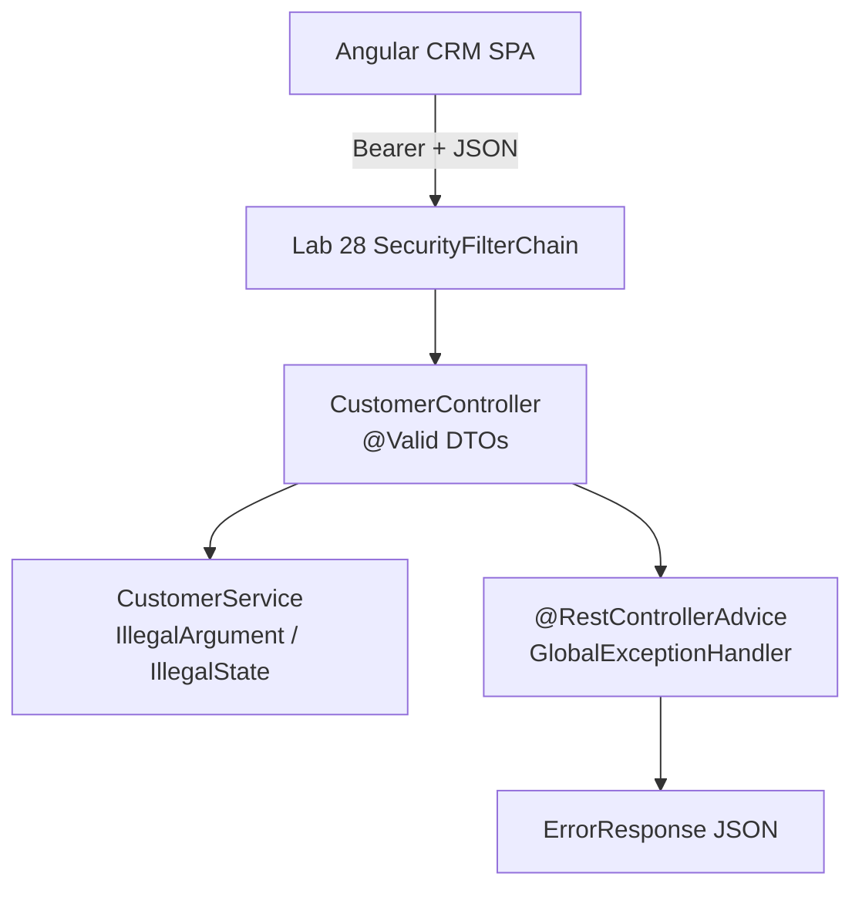

# Lab 29: Validation and Exception Handling — Northstar CRM Error Contracts

> **Participants:** Module sequence is in [`../README.md`](../README.md). **Do not start this guide until** you have finished Module 29 [pre-lab exercises 1–6](../exercises/EXERCISES-INDEX.md) (Pass — check yourself, do not write it down; order **1 → 2 → 3 → 4 → 6 → 5**). Then open **one** OS how-to ([Windows](LAB-29-WINDOWS.md) · [macOS](LAB-29-MACOS.md)). In class, prefer the **45-minute timed path** with [`starter/`](starter/README.md); the **full path** is every Step below (homework / extended). This repo has no answer keys — complete the TODOs yourself. See [Which file do I open?](../../../_PARTICIPANT-FILE-GUIDE.md).

## Activity card

| | |
| --- | --- |
| **Objective** | Ship Bean Validation + GlobalExceptionHandler + stable ErrorResponse for CRM REST |
| **Skills practiced** | @Valid DTOs, @RestControllerAdvice, 400/404/409 envelopes, MockMvc body asserts |
| **Expected outcome** | Invalid → 400 · CUS-9999 → 404 · duplicate → 409 · happy GET · tests green |
| **Estimated time** | Timed path ~45 min · Full path 4–5 hours |
| **Prerequisites** | Lab 0 · Labs 14/16 concepts · Labs 25–28 preferred · Exercises 1–6 Pass · JDK 21 · Maven 3.9+ |
| **Expected files** | `examples/lab29-crm/` — DTOs, advice, ErrorResponse, tests, error-contract notes |
| **Validation checkpoints** | Starter smoke · GUIDE Implementation Checkpoints |

**Module:** 29 — Validation and Exception Handling  
**Duration:** ~45 minutes (timed path with starter) · Full path: 4–5 Hours

**Primary IDE:** IntelliJ IDEA Community Edition · **Optional IDE:** VS Code

| OS | How-to for this lab |
| -- | ------------------- |
| Windows | [LAB-29-WINDOWS.md](LAB-29-WINDOWS.md) |
| macOS | [LAB-29-MACOS.md](LAB-29-MACOS.md) |

> **Incremental build:** DTO constraints → handler TODOs → envelope → status map → MockMvc body plan → readiness → Lab 29.

> **Classroom pacing:** [`../PACING.md`](../PACING.md) (Checkpoints A–D).

> **Critical scope:** **`@Valid` + ErrorResponse**. Map **400/404/409**. Keep **`lab-request-001`**. Assert status **and** body. **No stack-trace HTML**. **Lab 28 security is already in the starter** — do not rebuild it. Focus on validation + `GlobalExceptionHandler`.

## 45-minute timed path (use starter)

In class, use the starter templates so the **core** objectives fit **~45 minutes**. The full Steps below remain for homework / extended depth.

1. Open [`starter/README.md`](starter/README.md).
2. Copy `starter/` into `%USERPROFILE%\java-bootcamp\examples\lab29-crm` or `~/java-bootcamp/examples/lab29-crm`.
3. **Security is provided** (Lab 28 packages: `SecurityConfig`, `JwtService`, filter, `AuthController`, `CrmUserDetailsService`). Fill validation TODOs only: `CustomerRequest` annotations, `@Valid` on create, `GlobalExceptionHandler` bodies.
4. Add `ErrorEnvelopeTest` (**Tests run: 4**) with login + Bearer — starter ships **0** tests.
5. Mark timed-path Pass criteria. Continue remaining GUIDE steps as homework if needed.

| Path | Time | Scope |
| ---- | ---- | ----- |
| **Timed (default)** | ~45 min | Validation + handler + ErrorEnvelopeTest ×4 |
| **Full (extended)** | see Duration | Optional PATCH status DTO, Angular error-screen notes |

---

## What you'll complete (practice only)

Labs and exercises are **practice only**. Nothing is submitted or graded. Do not take screenshots. Check Pass/Fail yourself — do not write those marks anywhere. Commit your work to your private `java-bootcamp` GitHub repo.

Keep this checklist visible while you work.

| # | Deliverable |
| - | ----------- |
| 1 | `lab29-crm` with Bean Validation + `GlobalExceptionHandler` + existing `ErrorResponse` |
| 2 | Automated tests for validation / not-found / duplicate / security (`ErrorEnvelopeTest` — **Tests run: 4**) |
| 3 | Successful-path evidence (`CUS-1001`, `CUS-1002`) **with Bearer** |
| 4 | Controlled-failure evidence (400/404/409 + envelope) **with Bearer** |
| 5 | Notes in `docs/error-contract.md` |
| 6 | Run and cleanup instructions |
| 7 | No secrets or generated build directories committed |

**Commit to your GitHub repo:** the items in the table above (sources + evidence + short notes).

**Do not commit:** `target/`, `node_modules/`, secrets, heap dumps, or a copied answer keys.

## Lab Overview

This Module 29 lab unifies **Bean Validation** on request DTOs with a global `@RestControllerAdvice` that returns a consistent **`ErrorResponse`** for REST failures. The starter already includes the **Lab 28 security baseline** — your job is the validation and error-envelope TODOs, not rebuilding JWT.

## Learning Objectives

After completing this lab, you will be able to:

* Annotate CRM request DTOs with Bean Validation constraints
* Trigger validation with `@Valid` on controller methods
* Map field violations into the existing `ErrorResponse` shape
* Centralize exception handling with `@RestControllerAdvice` / `@ExceptionHandler`
* Align HTTP status codes: validation **400**, not-found **404**, duplicate **409**

## Business Scenario

Agents and integrations will send bad JSON. Leadership freezes:

**No API error path may return framework-default HTML stack traces or ad-hoc `Map` bodies to Angular.**

You own the contract for Amina (`CUS-1001` ACTIVE), Ravi (`CUS-1002` PROSPECT), unknown IDs, and duplicates.

Use these examples consistently:

| ID | Name | Notes |
| -- | ---- | ----- |
| `CUS-1001` | Amina Khan | `ACTIVE` — happy GET; duplicate create → 409 |
| `CUS-1002` | Ravi Singh | `PROSPECT` — happy GET |
| `CUS-9999` | — | not-found → 404 `ErrorResponse` |
| `lab-request-001` | — | `ErrorResponse.correlationId` / `X-Correlation-Id` |
| `agent1` / `agent1` | — | login for Bearer on customer APIs |

**Security note for evidence.** Never echo passwords or JWTs in error bodies. Fictional emails only.

---

## Architecture Context
### NOW (this lab)



## Prerequisites

Prior labs: [14](../../../Week%202%20-%20Backend,%20AI%20Tools%20and%20Testing/module-14/lab14/LAB-14-GUIDE.md) · [16](../../../Week%202%20-%20Backend,%20AI%20Tools%20and%20Testing/module-16/lab16/LAB-16-GUIDE.md) · [25](../../module-25/lab25/LAB-25-GUIDE.md) · [28](../../module-28/lab28/LAB-28-GUIDE.md).

Confirm (Lab 0 tools assumed):

* JDK 21; Maven; Spring Boot 3.x
* `spring-boot-starter-validation` + **security already on classpath in starter**
* Familiarity with Lab 14 DTO ideas and Lab 16 handler ideas
* No secrets committed to Git

### Pre-flight

```bash
java -version
mvn -version
```

## Worked example (read before you code)

Customer endpoints are **secured**. Always login first:

```bash
TOKEN=$(curl -s -X POST http://localhost:8080/api/auth/login \
  -H "Content-Type: application/json" \
  -d '{"username":"agent1","password":"agent1"}' | jq -r .accessToken)

curl -s -i -X POST http://localhost:8080/api/customers \
  -H "Content-Type: application/json" \
  -H "Authorization: Bearer $TOKEN" \
  -H "X-Correlation-Id: lab-request-001" \
  -d '{"id":"CUS-1003","name":"Maya Chen","email":"bad","status":"PROSPECT"}'
# expect 400 + violations[]
```

Service exceptions (already thrown by starter service):

* `IllegalArgumentException` → map to **404**
* `IllegalStateException` → map to **409**

**What to notice:** Match envelope fields and Bearer usage — instructors check these.

---

## Implementation Steps

Complete each step in order. Commands assume `~/java-bootcamp/examples/lab29-crm` (Windows: `%USERPROFILE%\java-bootcamp\examples\lab29-crm`) unless noted.

---

### Step 1 — Copy starter (security already included)

**Why:** Timed path starts from a secured CRM; you do not rebuild Lab 28.

**Do this:**

```bash
# Timed path: copy starter/ — see starter/README.md
cd ~/java-bootcamp/examples/lab29-crm
mkdir -p docs
```

Confirm starter already has:

* `spring-boot-starter-security` + `spring-boot-starter-validation`
* `config/SecurityConfig`, `security/*`, `controller/AuthController`, `AdminController`
* `northstar.security.jwt-secret` in `application.yml`
* Complete `ErrorResponse` class (do **not** redesign it)

`ErrorResponse` fields (already shipped):

```text
timestamp, status, error, message, correlationId, violations[{field, message}]
```

**No** `path` field and **no** `rejectedValue` on violations — match the existing class.

```bash
mvn -q -DskipTests package
```

**Expected result:** `BUILD SUCCESS`; security packages present; `ErrorResponse` compiles.

**If it fails:** Working from an old unsecured copy → use the updated starter.

---

### Step 2 — Annotate `CustomerRequest`

**Why:** Validation belongs on the request DTO.

**Do this:** `CustomerRequest` is a **mutable class** (not a record). Add:

```java
import jakarta.validation.constraints.Email;
import jakarta.validation.constraints.NotBlank;

@NotBlank private String id;
@NotBlank private String name;
@NotBlank @Email private String email;
@NotBlank private String status;
```

**Timed path:** no `@Pattern`, no `@Size`, no `CustomerStatus` enum, no `StatusUpdateRequest`.

**Full path (optional):** add a PATCH status DTO — **not** in starter/solution.

**Expected result:** DTOs compile with `jakarta.validation` annotations.

**If it fails:** `javax.validation` imports on Boot 3 → switch to `jakarta.validation`.

---

### Step 3 — Enable `@Valid` on create

**Why:** Constraints do nothing without `@Valid`.

**Do this:**

```java
import org.springframework.web.bind.annotation.PostMapping;
import org.springframework.web.bind.annotation.RequestBody;
import jakarta.validation.Valid;
import org.springframework.http.ResponseEntity;

@PostMapping
public ResponseEntity<?> create(@Valid @RequestBody CustomerRequest request) {
  // existing service call
}
```

Timed endpoints only: `POST /api/customers`, `GET /api/customers/{id}` — both need Bearer.

**Expected result:** Methods reference `@Valid`; valid create still works with a token.

**If it fails:** Security returns 401 before validation → obtain JWT via `/api/auth/login`.

---

### Step 4 — Prove validation failures with curl (with Bearer)

**Why:** Capture the trust-boundary rejection against the secured API.

**Do this:**

```bash
TOKEN=$(curl -s -X POST http://localhost:8080/api/auth/login \
  -H "Content-Type: application/json" \
  -d '{"username":"agent1","password":"agent1"}' | jq -r .accessToken)

curl -s -i -X POST http://localhost:8080/api/customers \
  -H "Content-Type: application/json" \
  -H "X-Correlation-Id: lab-request-001" \
  -H "Authorization: Bearer $TOKEN" \
  -d '{"id":"","name":"","email":"not-an-email","status":"ACTIVE"}'
```

**Expected result:** HTTP 400; body indicates validation problems; no stack-trace HTML.

**If it fails:** 401 → login failed or missing Bearer. Constraints ignored → missing `@Valid`.

---

### Step 5 — Implement GlobalExceptionHandler for validation

**Why:** Stable client contracts beat framework-default JSON shapes.

**Do this:** Fill starter TODOs. Build `ErrorResponse` with existing setters; map field errors to `FieldViolation(field, message)` only:

```java
import org.springframework.web.bind.annotation.ExceptionHandler;
import jakarta.servlet.http.HttpServletRequest;
import org.springframework.web.bind.MethodArgumentNotValidException;
import org.springframework.http.ResponseEntity;

@ExceptionHandler(MethodArgumentNotValidException.class)
public ResponseEntity<ErrorResponse> handleValidation(
    MethodArgumentNotValidException ex, HttpServletRequest req) {
  // status 400, error "Bad Request", message "Validation failed"
  // violations from BindingResult field errors (field + defaultMessage)
  // correlationId from X-Correlation-Id (default lab-request-001)
}
```

**Expected result:** Re-run invalid POST; JSON matches `ErrorResponse`; `correlationId` reflects `lab-request-001` when header sent.

**If it fails:** Advice not scanned → wrong package. Violations empty → wrong exception type.

---

### Step 6 — Map domain failures: 404 and 409

**Why:** Domain exceptions must not leak as generic 500s.

**Do this:** Map **existing** service exceptions — do **not** invent a custom hierarchy for timed path:

```java
import org.springframework.web.bind.annotation.ExceptionHandler;

@ExceptionHandler(IllegalArgumentException.class)  // → 404 Not Found
@ExceptionHandler(IllegalStateException.class)     // → 409 Conflict
```

Exercise (with Bearer):

```bash
curl -s -i http://localhost:8080/api/customers/CUS-9999 \
  -H "X-Correlation-Id: lab-request-001" \
  -H "Authorization: Bearer $TOKEN"
# After seeding CUS-1001, POST create again for CUS-1001 -> 409
```

**Expected result:** `CUS-9999` → 404 envelope; duplicate `CUS-1001` → 409; happy GET still 200 with Bearer.

**If it fails:** Duplicate returns 500 → exception not mapped.

---

### Step 7 — Fallback handler + `docs/error-contract.md`

**Why:** Client bodies must stay safe while logs remain actionable.

**Do this:**

```java
import org.springframework.web.bind.annotation.ExceptionHandler;
import org.springframework.http.ResponseEntity;

@ExceptionHandler(Exception.class)
public ResponseEntity<ErrorResponse> fallback(...) {
  // log server-side; client message: "Unexpected error"; status 500
}
```

Fill `docs/error-contract.md` (not `error-contract-notes.md`) with the status table and a note that customer APIs require Lab 28 Bearer auth.

**Full path (optional):** Note how a stable `ErrorResponse` keeps Angular error screens consistent.

**Expected result:** Safe 500 body; notes file present.

---

### Step 8 — `ErrorEnvelopeTest` (**Tests run: 4**)

**Why:** Asserting `jsonPath` on `ErrorResponse` prevents silent contract drift.

**Do this:** Starter has **0** tests. Add `com.northstar.crm.ErrorEnvelopeTest` with login helper (`agent1`/`agent1`) and Bearer header:

1. `validationReturns400Envelope`
2. `missingCustomerReturns404Envelope`
3. `duplicateReturns409Envelope`
4. `securityStillRequiresToken` (no token → **401**)

```bash
mvn -B test
# Expected: Tests run: 4, BUILD SUCCESS
```

**Expected result:** Surefire green; assertions cover correlation and violations; security still enforced.

**If it fails:** Tests without Bearer → 401 on validation cases. Add login helper.

---

### Step 9 — Failure experiments + Lab 14/16 unify note

**Do this:** Complete Failure Experiments. Add a short paragraph in `docs/error-contract.md` stating how Lab 14 DTO constraints and Lab 16 handlers are now one Boot contract. Commit your work to your GitHub repo. Do not take screenshots.

**Expected result:** ≥3 experiments; unify note present; evidence saved.

---

## Implementation Checkpoints

### Checkpoint A — Tooling and envelope

_Check **Pass** or **Fail** yourself. Do not write these marks anywhere — nothing is submitted or graded. Commit your work to your GitHub repo._

| # | Confirm | Self-check |
| - | ------- | ---------- |
| 1 | `lab29-crm` under `~/java-bootcamp/examples/` | Pass / Fail |
| 2 | Lab 28 security packages present in starter | Pass / Fail |
| 3 | Existing `ErrorResponse` (+ `FieldViolation`) unchanged | Pass / Fail |

### Checkpoint B — DTO and controller validation

_Check **Pass** or **Fail** yourself. Do not write these marks anywhere — nothing is submitted or graded. Commit your work to your GitHub repo._

| # | Confirm | Self-check |
| - | ------- | ---------- |
| 1 | Annotated `CustomerRequest` class (`@NotBlank` / `@Email`) | Pass / Fail |
| 2 | `@Valid` on create (no PATCH required) | Pass / Fail |
| 3 | Invalid POST rejected at boundary **with Bearer** | Pass / Fail |

### Checkpoint C — Global handler and domain mapping

_Check **Pass** or **Fail** yourself. Do not write these marks anywhere — nothing is submitted or graded. Commit your work to your GitHub repo._

| # | Confirm | Self-check |
| - | ------- | ---------- |
| 1 | Validation → 400 envelope with `lab-request-001` | Pass / Fail |
| 2 | `IllegalArgumentException` → 404; `IllegalStateException` → 409 | Pass / Fail |
| 3 | Safe 500 fallback; `docs/error-contract.md` present | Pass / Fail |

### Checkpoint D — Tests and hygiene

_Check **Pass** or **Fail** yourself. Do not write these marks anywhere — nothing is submitted or graded. Commit your work to your GitHub repo._

| # | Confirm | Self-check |
| - | ------- | ---------- |
| 1 | `ErrorEnvelopeTest` — Tests run: 4 (includes 401) | Pass / Fail |
| 2 | Happy GET with Bearer still 200 | Pass / Fail |
| 3 | No secrets / stack traces / `target/` committed | Pass / Fail |

---

## Reference Commands, Configuration, and Code

### Exception map (timed)

```text
MethodArgumentNotValidException → 400
IllegalArgumentException        → 404
IllegalStateException           → 409
Exception                       → 500 ("Unexpected error")
```

### Commands

```bash
cd ~/java-bootcamp/examples/lab29-crm
mvn -q spring-boot:run

TOKEN=$(curl -s -X POST http://localhost:8080/api/auth/login \
  -H "Content-Type: application/json" \
  -d '{"username":"agent1","password":"agent1"}' | jq -r .accessToken)

curl -s -i -X POST http://localhost:8080/api/customers \
  -H "Content-Type: application/json" \
  -H "X-Correlation-Id: lab-request-001" \
  -H "Authorization: Bearer $TOKEN" \
  -d '{"id":"","name":"","email":"x","status":"ACTIVE"}'

curl -s -i http://localhost:8080/api/customers/CUS-1001 \
  -H "X-Correlation-Id: lab-request-001" \
  -H "Authorization: Bearer $TOKEN"

mvn -B test
# Tests run: 4
git status
```

## Failure Experiments

| # | Experiment | Observe | Restore |
| - | ---------- | ------- | ------- |
| 1 | Omit `@Valid` temporarily | Bad email reaches service | Restore `@Valid` |
| 2 | Blank name / bad email | 400 + violations | Keep constraints |
| 3 | Unknown `CUS-9999`; duplicate `CUS-1001` | 404 / 409 envelopes | Keep mappings |
| 4 | Call customers without Bearer | 401 | Keep security |
| 5 | Force unhandled exception | Safe 500 body; stack in logs only | Keep fallback |

---

## Troubleshooting

| Symptom | Likely cause | Fix |
| ------- | ------------ | --- |
| Constraints ignored | Missing `@Valid` or validation starter | Add both |
| Advice never runs | Not component-scanned | Place under `com.northstar.crm` |
| Always 401 on curls | Forgot login / Bearer | `POST /api/auth/login` then Authorization header |
| Expecting `path` / `rejectedValue` | Wrong ErrorResponse shape | Use existing class fields only |
| 500 for not-found | Wrong handler type | Map `IllegalArgumentException` → 404 |
| Working in `module-29-exercises` for the lab | Wrong project | Lab lives in `examples/lab29-crm` |
| Stack trace in JSON body | Unsafe 500 handler | Return generic message only |

## Security and Production Review

Optional — jot brief notes in your README if useful for your progress check:

1. Which inputs are untrusted (JSON bodies, path IDs, headers)?
2. Where are authn (Lab 28 starter), authz, and validation enforced?
3. Which values are sensitive — never in client 500 bodies?

---


## Cleanup

```bash
cd ~/java-bootcamp/examples/lab29-crm
# Stop spring-boot:run (Ctrl+C)
mvn -q clean
git status
```

Keep screenshots/excerpts. Do not commit `target/`.

**Keep `lab29-crm`**—Labs 30–31 add Kafka on a CRM that already speaks a stable error contract.


## Reflection Questions

Write **1–3 sentence** answers (not essays):

1. Which design decision most affected correctness (where validation runs)?
2. What evidence proves the error contract is stable?
3. Which failure was hardest to diagnose (missing `@Valid`, advice not scanned, missing Bearer)?

---
