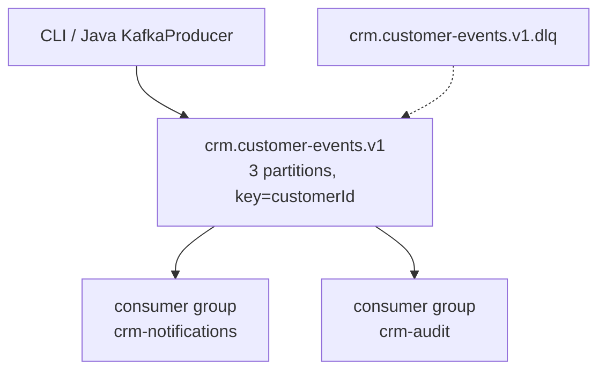

# Lab 30: Event-Driven Architecture with Kafka — Northstar CRM Topics

**Module:** 30 — Event-Driven Architecture with Kafka  
**Duration:** ~45 minutes (timed path with starter) · Full path: 4–5 Hours

**Primary IDE:** IntelliJ IDEA Community Edition · **Optional IDE:** VS Code

| OS | How-to for this lab |
| -- | ------------------- |
| Windows | [LAB-30-WINDOWS.md](LAB-30-WINDOWS.md) |
| macOS | [LAB-30-MACOS.md](LAB-30-MACOS.md) |

---

## Activity card

| | |
| --- | --- |
| **Time** | ~45 min timed · full path 4–5 h |
| **Checkpoint** | **E** (after Ex 1→2→4→3→5→6) |
| **Must prove** | KRaft up · topics+DLQ · keyed produce · acks=all+idempotence · notes |
| **Hard gate** | Pre-lab notes Pass · Docker or shared bootstrap documented |

### What you will learn

Stand up CRM Kafka topics and a safe Java producer before Spring Kafka.

### Enterprise context

Northstar freezes topic/key contracts so Notification and Audit can consume independently.

### Predict

If two consumers share `crm-notifications`, do both get every record?

### Debug

Consume empty with `--from-beginning` missing — what do you check first?

---

## 45-minute timed path (use starter)

> **Pacing reminder:** [PACING.md](../PACING.md) checkpoint **E**. Homework: competing vs independent groups + lag.

In class, use the starter templates so the **core** objectives fit **~45 minutes**. The full Steps below remain for homework / extended depth.

1. Open [`starter/README.md`](starter/README.md).
2. Copy `starter/` into your `java-bootcamp/examples/…` target (see starter README).
3. Fill every `// TODO` / `TODO` — do **not** wait on a perfect prior lab; the starter includes a baseline.
4. Run the starter smoke test. Commit your work to your GitHub repo (no screenshots).
5. Check timed-path Pass criteria in the starter README yourself (do not write the marks down). Continue remaining GUIDE steps as homework if needed.

| Path | Time | Scope |
| ---- | ---- | ----- |
| **Timed (default)** | ~45 min | Starter TODOs + smoke test |
| **Full (extended)** | see Duration | Every Step in this GUIDE |

---

## What you'll complete (practice only)

Labs and exercises are **practice only**. Nothing is submitted or graded. Do not take screenshots. Check Pass/Fail yourself — do not write those marks anywhere. Commit your work to your private `java-bootcamp` GitHub repo.

Keep this checklist visible while you work.

| # | Deliverable |
| - | ----------- |
| 1 | `compose.yaml` KRaft broker definition |
| 2 | Topics created (events + DLQ) with describe evidence |
| 3 | Versioned event JSON samples (Amina/Ravi) |
| 4 | CLI produce/consume evidence with keys/partitions/offsets |
| 5 | Java producer with acks=all + idempotence |
| 6 | Competing vs independent group evidence + lag describe |
| 7 | `docs/kafka-notes.md` runbook + production checklist |
| 8 | No secrets or generated junk committed |

**Commit to your GitHub repo:** the items in the table above (sources + evidence + short notes).

**Do not commit:** `target/`, `node_modules/`, secrets, heap dumps, or a copied answer keys.

## Lab Overview

This Module 30 lab introduces **event-driven architecture** for the **Customer Management Platform** using a local **Kafka KRaft** broker: versioned topics, partitions, keyed CRM events, producers, consumers, offsets, consumer groups, lag, and a DLQ topic for Lab 31 recovery practice.

## Learning Objectives

After completing this lab, you will be able to:

* Create a local single-node Kafka broker with Docker Compose (KRaft)
* Create partitioned CRM event and dead-letter topics explicitly
* Design versioned `CustomerCreated` and `CustomerStatusChanged` event envelopes
* Publish customer-keyed records from Kafka CLI and Java
* Consume records while displaying keys, partitions, offsets, and timestamps

## Business Scenario

The CRM stores customer identity, contact details, lifecycle status, and financial accounts. Its Angular client talks to Spring Boot; Spring persists and (soon) emits Kafka events for notification and audit consumers. This lab builds the **broker and topic foundation** without requiring a database lab or Resilience4j yet.

Leadership freezes:

| ID | Name | Notes |
| -- | ---- | ----- |
| `CUS-1001` | Amina Khan | `ACTIVE` — `CustomerCreated` (+ optional status change) |
| `CUS-1002` | Ravi Singh | `PROSPECT` — second partition key |
| `lab-request-001` | — | correlation in event envelope / headers |
| `crm.customer-events.v1` | — | primary topic (3 partitions) |
| `crm.customer-events.v1.dlq` | — | dead-letter topic (1 partition) |
| `crm-notifications` / `crm-audit` | — | competing vs independent groups |

**Security note for evidence.** Use fictional PII only. Do not put secrets in event payloads. Prefer PLAINTEXT only on the lab Docker network — document that production needs TLS/SASL.

## Architecture Context
### NOW (this lab)



## Prerequisites

Confirm (Lab 0 tools assumed):

* JDK 21; Maven; Git
* **Docker** + Compose for local Kafka
* Free local port 9092
* Disk space for broker image/volumes
* No secrets committed to Git

### Pre-flight

```bash
java -version
mvn -version
```

## Worked example (read before you code)

Study this pattern once before Step 1. Your job is to apply the same idea in the Steps — do not skip ahead to a full solution.

```java
props.put(ProducerConfig.BOOTSTRAP_SERVERS_CONFIG, "localhost:9092");
props.put(ProducerConfig.ACKS_CONFIG, "all");
props.put(ProducerConfig.ENABLE_IDEMPOTENCE_CONFIG, true);
props.put(ProducerConfig.KEY_SERIALIZER_CLASS_CONFIG, StringSerializer.class.getName());
props.put(ProducerConfig.VALUE_SERIALIZER_CLASS_CONFIG, StringSerializer.class.getName());

try (var producer = new KafkaProducer<String, String>(props)) {
  var record = new ProducerRecord<>(TOPIC, customerId, json);
  var m = producer.send(record).get();
  System.out.printf("topic=%s partition=%d offset=%d%n",
      m.topic(), m.partition(), m.offset());
}
```

**What to notice:** Match names, IDs, and failure behavior from the scenario — instructors check these.

---

## Implementation Steps

Complete each step in order. Commands assume `~/java-bootcamp/examples/lab30-crm` (Windows: `%USERPROFILE%\java-bootcamp\examples\lab30-crm`) unless noted.

---

### Step 1 — Scaffold lab30-crm and start Kafka in KRaft mode

**Why:** A reproducible broker is the shared dependency for every later Kafka lab.

**Do this:**

```bash
cd ~/java-bootcamp/examples/lab30-crm
```

If your instructor allows a **local** broker for practice, create `compose.yaml`. Otherwise skip Compose and use the shared bootstrap servers from the connection sheet:

Optional `compose.yaml` (local practice only):

```yaml
services:
  kafka:
    image: apache/kafka:3.9.1
    container_name: crm-kafka
    ports: ["9092:9092"]
    environment:
      KAFKA_NODE_ID: 1
      KAFKA_PROCESS_ROLES: broker,controller
      KAFKA_LISTENERS: PLAINTEXT://:9092,CONTROLLER://:9093
      KAFKA_ADVERTISED_LISTENERS: PLAINTEXT://localhost:9092
      KAFKA_CONTROLLER_LISTENER_NAMES: CONTROLLER
      KAFKA_CONTROLLER_QUORUM_VOTERS: 1@kafka:9093
      KAFKA_OFFSETS_TOPIC_REPLICATION_FACTOR: 1
```

```bash
docker compose up -d
docker compose ps
```

**Expected result:** Container `crm-kafka` Up; `0.0.0.0:9092->9092/tcp`.

**If it fails:** Port in use → stop conflicting broker or change host port (and document). Image pull blocked → check Docker network/proxy on your laptop.

---

### Step 2 — Create CRM topics (events + DLQ)

**Why:** Explicit create prevents a spelling mistake from silently inventing a new production stream.

**Do this:**

```bash
docker exec crm-kafka /opt/kafka/bin/kafka-topics.sh \
  --bootstrap-server localhost:9092 --create \
  --topic crm.customer-events.v1 --partitions 3 --replication-factor 1

docker exec crm-kafka /opt/kafka/bin/kafka-topics.sh \
  --bootstrap-server localhost:9092 --create \
  --topic crm.customer-events.v1.dlq --partitions 1 --replication-factor 1

docker exec crm-kafka /opt/kafka/bin/kafka-topics.sh \
  --bootstrap-server localhost:9092 --describe \
  --topic crm.customer-events.v1
```

**Expected result:** Both topics created; primary topic `PartitionCount: 3`, RF 1.

**If it fails:** Broker not ready → wait and retry. Topic exists → `--if-not-exists` or describe only; do not create divergent names.

---

### Step 3 — Write versioned CRM event envelopes

**Why:** Event names describe facts that already happened; versions protect consumers.

**Do this:** Create JSON files under `events/`:

```json
{
  "eventId": "e4b5f53d-7f18-4cf4-81ce-7cab6ec98491",
  "eventType": "CustomerCreated",
  "eventVersion": 1,
  "occurredAt": "2026-07-13T06:00:00Z",
  "customerId": "CUS-1001",
  "correlationId": "lab-request-001",
  "source": "customer-service",
  "data": { "fullName": "Amina Khan", "status": "ACTIVE" }
}
```

Add a Ravi `CustomerCreated` (`CUS-1002`, `PROSPECT`) and an Amina `CustomerStatusChanged` sample. Prefer ISO-8601 UTC.

**Expected result:** JSON parses; `eventVersion=1`; fixtures and correlation present.

**If it fails:** Invalid JSON → fix quotes/commas. Missing `customerId` → reject the envelope before publishing.

---

### Step 4 — Publish keyed events with the console producer

**Why:** Keys control partition affinity; same customer’s events stay ordered within a partition.

**Do this:** Open a producer that parses text before the first colon as the key. Send ≥2 events for `CUS-1001` and ≥1 for `CUS-1002`.

```bash
docker exec -it crm-kafka /opt/kafka/bin/kafka-console-producer.sh \
  --bootstrap-server localhost:9092 --topic crm.customer-events.v1 \
  --property parse.key=true --property key.separator=:
```

Example lines:

```text
CUS-1001:{"eventType":"CustomerCreated","eventVersion":1,"customerId":"CUS-1001","correlationId":"lab-request-001","data":{"fullName":"Amina Khan","status":"ACTIVE"}}
CUS-1001:{"eventType":"CustomerStatusChanged","eventVersion":1,"customerId":"CUS-1001","correlationId":"lab-request-001","data":{"status":"ACTIVE"}}
CUS-1002:{"eventType":"CustomerCreated","eventVersion":1,"customerId":"CUS-1002","correlationId":"lab-request-001","data":{"fullName":"Ravi Singh","status":"PROSPECT"}}
```

**Expected result:** No serialization/timeout errors; records accepted.

**If it fails:** Forgot `parse.key` → key null; partition distribution random per record. Wrong topic name → fix before Lab 31.

---

### Step 5 — Consume keys, partitions, offsets, timestamps

**Why:** Operators reason about ordering with metadata, not only payload text.

**Do this:**

```bash
docker exec crm-kafka /opt/kafka/bin/kafka-console-consumer.sh \
  --bootstrap-server localhost:9092 --topic crm.customer-events.v1 \
  --from-beginning --property print.key=true \
  --property print.partition=true --property print.offset=true \
  --property print.timestamp=true --max-messages 3
```

Capture output showing `CUS-1001` events sharing a partition with increasing offsets, and `CUS-1002` on its partition.

**Expected result:** Key/partition/offset/timestamp printed; Amina events ordered on the same partition.

**If it fails:** Empty output → wrong topic or nothing published. Different partitions for same key → key parsing failed in Step 4.

---

### Step 6 — Create a Java producer (acks=all, idempotent)

**Why:** CLI proves the broker; Java proves the course toolchain for Lab 31 migration.

**Do this:** Add Kafka clients via Maven. Implement `CustomerEventProducer`:

```java
props.put(ProducerConfig.BOOTSTRAP_SERVERS_CONFIG, "localhost:9092");
props.put(ProducerConfig.ACKS_CONFIG, "all");
props.put(ProducerConfig.ENABLE_IDEMPOTENCE_CONFIG, true);
props.put(ProducerConfig.KEY_SERIALIZER_CLASS_CONFIG, StringSerializer.class.getName());
props.put(ProducerConfig.VALUE_SERIALIZER_CLASS_CONFIG, StringSerializer.class.getName());

try (var producer = new KafkaProducer<String, String>(props)) {
  var record = new ProducerRecord<>(TOPIC, customerId, json);
  var m = producer.send(record).get();
  System.out.printf("topic=%s partition=%d offset=%d%n",
      m.topic(), m.partition(), m.offset());
}
```

Publish at least one Amina event keyed by `CUS-1001`.

```bash
mvn -q -DskipTests package
# run your main / exec plugin as documented in project README
```

**Expected result:** Print `topic=crm.customer-events.v1 partition=… offset=…`; customer ID is the record key, not only a JSON field.

**If it fails:** Connection refused → Compose down or advertised listener wrong (`localhost:9092` for host processes). Blocking `.get()` hangs → broker unhealthy; check `docker compose logs`.

---

### Step 7 — Competing vs independent consumer groups

**Why:** Notifications scale by partitioning; audit needs a full independent stream.

**Do this:** Start two terminals with group `crm-notifications`; start a third with `crm-audit`. Publish six more records.

```bash
# terminals A and B (competing)
docker exec -it crm-kafka /opt/kafka/bin/kafka-console-consumer.sh \
  --bootstrap-server localhost:9092 \
  --topic crm.customer-events.v1 --group crm-notifications

# terminal C (independent)
docker exec -it crm-kafka /opt/kafka/bin/kafka-console-consumer.sh \
  --bootstrap-server localhost:9092 \
  --topic crm.customer-events.v1 --group crm-audit
```

**Expected result:** `crm-notifications` members split the three partitions (no duplicate assignment of the same partition to two members); `crm-audit` independently receives newly published records.

**If it fails:** Both “groups” use same group id by mistake → fix IDs. No messages → consumers started after publish without `--from-beginning` for old data; publish new records while listening.

---

### Step 8 — Inspect lag and replay readiness

**Why:** Lag is the operator’s signal that consumers fell behind; restart must catch up.

**Do this:** Stop one notifications consumer, publish records, describe the group, restart, describe again.

```bash
docker exec crm-kafka /opt/kafka/bin/kafka-consumer-groups.sh \
  --bootstrap-server localhost:9092 \
  --describe --group crm-notifications
```

Document that replay/`--from-beginning` is a learning tool; production replay needs a policy and idempotent consumers (Lab 31).

**Expected result:** Non-zero LAG while stopped; after restart LAG returns toward 0; table shows TOPIC / PARTITION / CURRENT-OFFSET / LOG-END-OFFSET / LAG.

**If it fails:** Empty describe → group never joined. Always-zero lag → consumer still running and catching up instantly; stop it longer.

---

### Step 9 — Document Kafka runbook for Lab 31 hand-off

**Why:** Lab 31 will fail mysteriously if topic names, keys, or Compose ports drift.

**Do this:** In `docs/kafka-notes.md`, freeze:

| Item | Lab value |
| ---- | --------- |
| Bootstrap (host) | `localhost:9092` |
| Primary topic | `crm.customer-events.v1` (3 partitions) |
| DLQ topic | `crm.customer-events.v1.dlq` (1 partition) |
| Record key | `customerId` (`CUS-1001`, `CUS-1002`) |
| Sample correlation | `lab-request-001` |
| Demo groups | `crm-notifications` (competing), `crm-audit` (independent) |

List the exact `docker compose up -d`, topic create, produce, consume, and lag describe commands a peer must run. Note PLAINTEXT and RF=1 are **lab-only**.

**Expected result:** Lab 31 student can reuse broker/topics without renaming.

**If it fails:** Notes use `customer-events` without `.v1` → fix to the frozen name before continuing.

---

### Step 10 — Failure experiments + evidence pack

**Why:** Wrong keys, wrong topics, and silent auto-create habits become production incidents.

**Do this:** Complete Failure Experiments. Save `docker compose ps`, topic describe, consume metadata, and lag describe excerpts under `notes/lab-30/`. Confirm sample JSON stays fictional PII only.

**Expected result:** ≥3 experiments; runbook listed; broker still healthy or cleaned up intentionally. Commit your work to your GitHub repo (no screenshots).

**If it fails:** See Troubleshooting.

---

## Ordering and delivery semantics (read before Lab 31)

Write a short paragraph in `docs/kafka-notes.md` covering:

1. **Per-key ordering:** Same `customerId` key → same partition → relative order preserved for that customer.
2. **No global order:** Events for `CUS-1001` and `CUS-1002` may interleave arbitrarily across partitions.
3. **At-least-once:** Consumers may see duplicates after rebalance/retry — Lab 31 must be idempotent on `eventId`.
4. **DLQ purpose:** Poison or repeatedly failing records move aside so the main group progress is not blocked (wired in Lab 31).

---

## Implementation Checkpoints

### Checkpoint A — Broker and topics

_Check **Pass** or **Fail** yourself. Do not write these marks anywhere — nothing is submitted or graded. Commit your work to your GitHub repo._

| # | Confirm | Self-check |
| - | ------- | ---------- |
| 1 | `lab30-crm` under `~/java-bootcamp/examples/` | Pass / Fail |
| 2 | KRaft Kafka Up on 9092 | Pass / Fail |
| 3 | `crm.customer-events.v1` (3p) and `.dlq` (1p) exist | Pass / Fail |

### Checkpoint B — Envelopes and produce/consume

_Check **Pass** or **Fail** yourself. Do not write these marks anywhere — nothing is submitted or graded. Commit your work to your GitHub repo._

| # | Confirm | Self-check |
| - | ------- | ---------- |
| 1 | Versioned JSON for Amina/Ravi with `lab-request-001` | Pass / Fail |
| 2 | CLI keyed produce + consume with key/partition/offset | Pass / Fail |
| 3 | Same-key ordering visible for `CUS-1001` | Pass / Fail |

### Checkpoint C — Java producer and groups

_Check **Pass** or **Fail** yourself. Do not write these marks anywhere — nothing is submitted or graded. Commit your work to your GitHub repo._

| # | Confirm | Self-check |
| - | ------- | ---------- |
| 1 | Java producer acks=all + idempotence | Pass / Fail |
| 2 | Competing `crm-notifications` vs independent `crm-audit` | Pass / Fail |
| 3 | Lag inspected; catch-up observed | Pass / Fail |

### Checkpoint D — Hygiene and notes

_Check **Pass** or **Fail** yourself. Do not write these marks anywhere — nothing is submitted or graded. Commit your work to your GitHub repo._

| # | Confirm | Self-check |
| - | ------- | ---------- |
| 1 | DLQ topic created for Lab 31 | Pass / Fail |
| 2 | Local vs production notes (TLS/RF/auto-create) | Pass / Fail |
| 3 | No secrets / PII dumps / needless volumes committed | Pass / Fail |

---

## Reference Commands, Configuration, and Code

### compose.yaml (excerpt)

```yaml
services:
  kafka:
    image: apache/kafka:3.9.1
    ports: ["9092:9092"]
    environment:
      KAFKA_NODE_ID: 1
      KAFKA_PROCESS_ROLES: broker,controller
      KAFKA_LISTENERS: PLAINTEXT://:9092,CONTROLLER://:9093
      KAFKA_ADVERTISED_LISTENERS: PLAINTEXT://localhost:9092
      KAFKA_CONTROLLER_LISTENER_NAMES: CONTROLLER
      KAFKA_CONTROLLER_QUORUM_VOTERS: 1@kafka:9093
      KAFKA_OFFSETS_TOPIC_REPLICATION_FACTOR: 1
```

### Commands

```bash
cd ~/java-bootcamp/examples/lab30-crm
docker compose up -d
docker exec crm-kafka /opt/kafka/bin/kafka-topics.sh \
  --bootstrap-server localhost:9092 --create \
  --topic crm.customer-events.v1 --partitions 3 --replication-factor 1
docker exec crm-kafka /opt/kafka/bin/kafka-topics.sh \
  --bootstrap-server localhost:9092 --create \
  --topic crm.customer-events.v1.dlq --partitions 1 --replication-factor 1
docker exec crm-kafka /opt/kafka/bin/kafka-consumer-groups.sh \
  --bootstrap-server localhost:9092 --describe --group crm-notifications
docker compose ps
git status
```

### Sample produce lines (copy/paste)

```text
CUS-1001:{"eventId":"e4b5f53d-7f18-4cf4-81ce-7cab6ec98491","eventType":"CustomerCreated","eventVersion":1,"customerId":"CUS-1001","correlationId":"lab-request-001","data":{"fullName":"Amina Khan","status":"ACTIVE"}}
CUS-1002:{"eventId":"a1c2e3f4-1111-2222-3333-444455556666","eventType":"CustomerCreated","eventVersion":1,"customerId":"CUS-1002","correlationId":"lab-request-001","data":{"fullName":"Ravi Singh","status":"PROSPECT"}}
```

Prefer full envelopes from `events/` when demonstrating version fields to Lab 31 students.

Keep `eventVersion: 1` until a formal v2 consumer migration is designed.
Do not invent parallel topic names for the same stream.

---

## Failure Experiments

| # | Experiment | Observe | Restore |
| - | ---------- | ------- | ------- |
| 1 | Stop Kafka (`docker compose stop`) then produce | Timeout / connection errors | `docker compose start` |
| 2 | Publish with wrong key or null key | Partition random; ordering broken | Use `customerId` as key |
| 3 | Replay with `--from-beginning` | Duplicates delivered | Document idempotency need for Lab 31 |
| 4 | Stop consumer, publish, describe lag | LAG > 0 | Restart consumer; LAG→0 |
| 5 | Typo topic name on produce | Event not on primary topic | Produce to correct frozen name |

---

## Troubleshooting

| Symptom | Likely cause | Fix |
| ------- | ------------ | --- |
| Cannot connect from host | Advertised listener / port | Use `localhost:9092`; check `compose ps` |
| Cannot connect from another container | Wrong hostname | Use Compose service name `kafka:9092` |
| Empty consume | Wrong topic / no data / already read | `--from-beginning` or publish new |
| Rebalance storms | Start/stop consumers rapidly | Stabilize membership; wait |
| Topic missing | Create step skipped | Create explicitly; avoid silent auto-create habit |
| Java producer hangs | Broker down / wrong bootstrap | Logs + `docker compose logs kafka` |
| Partition always 0 | Null/empty key | Set record key to CUS-1001 / CUS-1002 |
| Spring Kafka urge | Wrong module | Use raw producer / CLI only — Lab 31 |

## Security and Production Review

Optional — jot brief notes in your README if useful for your progress check (not a separate essay):

1. Which event inputs are untrusted (payload fields, keys)?
2. Where will authn/authz for publish/consume be enforced in production?
3. Which values are sensitive — never in event `data`?

---


## Cleanup

```bash
cd ~/java-bootcamp/examples/lab30-crm
# Commit your work to GitHub first
docker compose down
# Use `docker compose down -v` only to intentionally delete lab data
git status
```

**Keep `lab30-crm` (and preferably the same topic names)**—Lab 31 Spring Kafka expects `crm.customer-events.v1` and DLQ/DLT conventions.


## Reflection Questions

Write **1–3 sentence** answers (not essays):

1. Which design decision most affected correctness (keying by customerId)?
2. What evidence proves produce/consume works end-to-end?
3. Which failure was hardest to diagnose (lag, rebalance, advertised listeners)?

---


