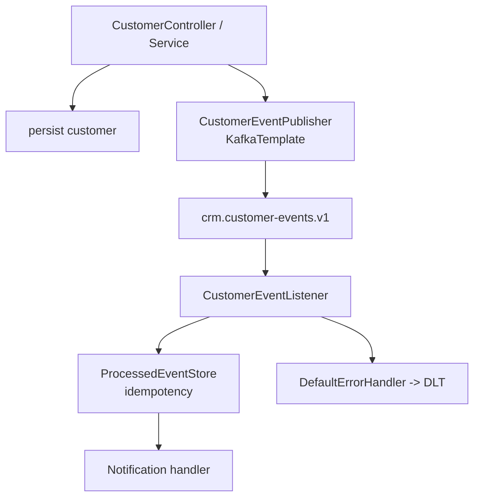

# Lab 31: Spring Boot Integration with Kafka — Northstar CRM Listeners

**Module:** 31 — Spring Boot Integration with Kafka  
**Duration:** ~45 minutes (timed path with starter) · Full path: 4–5 Hours

**Primary IDE:** IntelliJ IDEA Community Edition · **Optional IDE:** VS Code

| OS | How-to for this lab |
| -- | ------------------- |
| Windows | [LAB-31-WINDOWS.md](LAB-31-WINDOWS.md) |
| macOS | [LAB-31-MACOS.md](LAB-31-MACOS.md) |

---

## Activity card

| | |
| --- | --- |
| **Time** | ~45 min timed · full path 4–5 h |
| **Checkpoint** | **E** (after Ex 1→3→2→4→5→6) |
| **Must prove** | Keyed publish · listener once · DLT config · test green twice |
| **Hard gate** | Pre-lab Pass · broker or EmbeddedKafka plan |

### What you will learn

Wire Spring Kafka publish/consume with idempotency and DLT on CRM topics.

### Enterprise context

Notifications must survive poison messages and replays without double-sending.

### Predict

Replay the same CustomerCreated — how many notifications if store works?

### Debug

Listener silent after startup — group/topic/offsets checklist?

---

## 45-minute timed path (use starter)

> **Pacing reminder:** [PACING.md](../PACING.md) checkpoint **E**. Homework: poison-message DLT evidence + runbook.

In class, use the starter templates so the **core** objectives fit **~45 minutes**. The full Steps below remain for homework / extended depth.

1. Open [`starter/README.md`](starter/README.md).
2. Copy `starter/` into your `java-bootcamp/examples/…` target (see starter README).
3. Fill every `// TODO` / `TODO` — do **not** wait on a perfect prior lab; the starter includes a baseline.
4. Run the starter smoke test. Commit your work to your GitHub repo (no screenshots).
5. Check timed-path Pass criteria in the starter README yourself (do not write the marks down). Continue remaining GUIDE steps as homework if needed.

| Path | Time | Scope |
| ---- | ---- | ----- |
| **Timed (default)** | ~45 min | Starter TODOs + smoke test |
| **Full (extended)** | see Duration | Every Step in this GUIDE |

---

## What you'll complete (practice only)

Labs and exercises are **practice only**. Nothing is submitted or graded. Do not take screenshots. Check Pass/Fail yourself — do not write those marks anywhere. Commit your work to your private `java-bootcamp` GitHub repo.

Keep this checklist visible while you work.

| # | Deliverable |
| - | ----------- |
| 1 | Spring Kafka publisher + listener for CRM events |
| 2 | Idempotent processing evidence |
| 3 | Retry + DLT configuration with proof |
| 4 | Integration test output (EmbeddedKafka or Testcontainers) |
| 5 | Successful Amina/Ravi path evidence |
| 6 | Controlled poison-message / duplicate evidence |
| 7 | Runbook + DLT naming notes |
| 8 | No secrets committed |

**Commit to your GitHub repo:** the items in the table above (sources + evidence + short notes).

**Do not commit:** `target/`, `node_modules/`, secrets, heap dumps, or a copied answer keys.

## Lab Overview

This Module 31 lab integrates **Spring Kafka** into the **Customer Management Platform**: `KafkaTemplate` publish after customer operations, typed `@KafkaListener` consumers, JSON configuration, **idempotent** processing, retry classification, and **dead-letter (DLT)** recovery — verified with Embedded Kafka or Testcontainers.

## Learning Objectives

After completing this lab, you will be able to:

* Add Spring Kafka dependencies to the CRM service
* Configure JSON producers and consumers with externalized topic names
* Publish typed customer events with `KafkaTemplate`
* Write `@KafkaListener` handlers for CRM events
* Validate message keys, event versions, and required metadata

## Business Scenario

When an agent creates Amina (`CUS-1001`) or activates Ravi (`CUS-1002`), notification and audit processes must learn asynchronously. Duplicate delivery (rebalance, retry, replay) must not send duplicate SMS/email side effects. Invalid contracts must not infinite-retry.

Leadership freezes:

**Publish keyed `CustomerEvent` v1 after successful customer writes; consume idempotently; recover poison messages to DLT after bounded retry.**

Use these examples consistently:

| ID | Name | Notes |
| -- | ---- | ----- |
| `CUS-1001` | Amina Khan | `ACTIVE` — primary publish/consume fixture |
| `CUS-1002` | Ravi Singh | `PROSPECT` — second key |
| `lab-request-001` | — | `correlationId` on events and logs |
| `crm.customer-events.v1` | — | primary topic (from Lab 30) |
| DLT / `.dlq` | — | dead-letter destination after retries |
| `crm-notifications` | — | default consumer group |

**Security note for evidence.** Restrict JSON trusted packages. Never log full PII payloads. No secrets in event bodies.

---

## Architecture Context
### NOW (this lab)



## Prerequisites

Prior labs: [Lab 30](../../module-30/lab30/LAB-30-GUIDE.md) · [28](../../../Week%203%20-%20Spring%20Framework%20and%20Enterprise%20Patterns/module-28/lab28/LAB-28-GUIDE.md) · [29](../../../Week%203%20-%20Spring%20Framework%20and%20Enterprise%20Patterns/module-29/lab29/LAB-29-GUIDE.md).

Confirm (Lab 0 tools assumed):

* JDK 21; Maven; Spring Boot 3
* Docker + Kafka from Lab 30 (for manual demos)
* No secrets committed to Git

### Pre-flight

```bash
java -version
mvn -version
```

## Worked example (read before you code)

Study this pattern once before Step 1. Your job is to apply the same idea in the Steps — do not skip ahead to a full solution.

```bash
# Broker (Lab 30)
docker compose -f ../lab30-crm/compose.yaml up -d   # or local compose copy

cd ~/java-bootcamp/examples/lab31-crm
mvn -q test
mvn -q spring-boot:run
# Create CUS-1001 / update CUS-1002 via API (JWT if Lab 28)
# Observe: customer_event_published / customer_event_received / duplicate_event_ignored
```

**What to notice:** Match names, IDs, and failure behavior from the scenario — instructors check these.

---

## Implementation Steps

Complete each step in order. Commands assume `~/java-bootcamp/examples/lab31-crm` (Windows: `%USERPROFILE%\java-bootcamp\examples\lab31-crm`) unless noted.

---

### Step 1 — Branch CRM and add Spring Kafka

**Why:** Boot-managed dependency versions keep producer/consumer aligned.

**Do this:**

```bash
cd ~/java-bootcamp/examples
cp -r lab29-crm lab31-crm   # or lab28-crm / latest; bring Lab 30 compose if needed
cd lab31-crm
mkdir -p docs
```

```xml
<dependency>
  <groupId>org.springframework.kafka</groupId>
  <artifactId>spring-kafka</artifactId>
</dependency>
<dependency>
  <groupId>org.springframework.kafka</groupId>
  <artifactId>spring-kafka-test</artifactId>
  <scope>test</scope>
</dependency>
```

```bash
mvn -q dependency:tree -Dincludes=org.springframework.kafka
```

**Expected result:** `spring-kafka` on compile classpath; test jar on test scope; `BUILD SUCCESS`.

**If it fails:** Version conflict → rely on Spring Boot parent BOM; do not hard-pin randomly.

---

### Step 2 — Configure JSON messaging and topic names

**Why:** Hard-coded topic strings and open deserialization are production incidents waiting to happen.

**Do this:** In `application.yml`:

```yaml
spring:
  kafka:
    bootstrap-servers: ${KAFKA_BOOTSTRAP_SERVERS:localhost:9092}
    consumer:
      group-id: crm-notifications
      auto-offset-reset: earliest
      enable-auto-commit: false
      properties:
        spring.json.trusted.packages: com.northstar.crm.event
    producer:
      properties:
        enable.idempotence: true
crm:
  kafka:
    customer-events-topic: crm.customer-events.v1
```

Configure `JsonSerializer` / `JsonDeserializer` (or Boot defaults) as taught in class.

**Expected result:** App starts against Lab 30 broker; partitions assigned to `crm.customer-events.v1-*` without unknown-host or deserialization warnings.

**If it fails:** Trusted packages typo → deserialization fails. Broker down → start Lab 30 Compose first for manual demos.

---

### Step 3 — Define the CustomerEvent contract

**Why:** Transport metadata stays outside business payload; version gates protect consumers.

**Do this:**

```java
import java.time.Instant;
import java.util.Objects;

public record CustomerEvent(
    String eventId, String eventType, int eventVersion,
    Instant occurredAt, String customerId, String correlationId,
    String source, CustomerData data) {
  public CustomerEvent {
    Objects.requireNonNull(eventId);
    Objects.requireNonNull(customerId);
    if (eventVersion != 1) throw new UnsupportedEventVersionException();
  }
}
```

Reject missing `eventId` before publishing. Support types such as `CustomerCreated` and `CustomerStatusChanged`.

**Expected result:** Serializes with `eventVersion=1`; missing `eventId` rejected; version 2 throws.

**If it fails:** Mutable JavaBean without null checks → add validation before send. Record compact constructor not firing → check construction path.

---

### Step 4 — Publish with KafkaTemplate after successful writes

**Why:** Events must reflect facts that already happened in the CRM store (not speculative publishes).

**Do this:**

```java
return kafkaTemplate.send(topic, event.customerId(), event)
  .whenComplete((result, error) -> {
    if (error != null)
      log.error("customer_event_publish_failed id={}", event.eventId(), error);
    else
      log.info("customer_event_published id={} partition={} offset={}",
        event.eventId(),
        result.getRecordMetadata().partition(),
        result.getRecordMetadata().offset());
  });
```

Wire into create/status-change service methods for Amina/Ravi fixtures. Do not log private payload dumps.

```bash
# with broker up
mvn -q spring-boot:run
# create/update CUS-1001 via API (JWT if Lab 28 present)
```

**Expected result:** Log `customer_event_published …`; console consumer shows key `CUS-1001`; HTTP create remains 201.

**If it fails:** Publish before DB success → document ordering risk; prefer after commit (or transactional outbox as bonus). Template bean missing → check auto-config / bootstrap servers.

---

### Step 5 — Write a typed @KafkaListener

**Why:** Key and payload identity mismatches indicate producer bugs or hop-layer corruption.

**Do this:**

```java
import org.springframework.messaging.handler.annotation.Header;
import org.springframework.kafka.annotation.KafkaListener;
import org.springframework.kafka.support.KafkaHeaders;

@KafkaListener(topics = "${crm.kafka.customer-events-topic}")
void receive(CustomerEvent event,
    @Header(KafkaHeaders.RECEIVED_KEY) String key) {
  if (!key.equals(event.customerId()))
    throw new InvalidCustomerEventException("key mismatch");
  handler.handle(event);
}
```

Log `customer_event_received` with `eventId` + `customerId` + `correlationId` (`lab-request-001`).

**Expected result:** Listener processes Amina events; thread remains alive for later records; key mismatch throws (non-retryable later).

**If it fails:** Listener not invoked → group offset already at end; use new group or publish new events. Type mismatch → fix deserializer / trusted packages.

---

### Step 6 — Make processing idempotent

**Why:** At-least-once delivery will replay; business side effects must run once.

**Do this:**

```java
import java.util.concurrent.ConcurrentHashMap;

public boolean markIfNew(String eventId) {
  return processedIds.add(eventId); // lab: ConcurrentHashMap.newKeySet()
}

if (!store.markIfNew(event.eventId())) {
  log.info("duplicate_event_ignored id={}", event.eventId());
  return;
}
notificationService.notify(event);
```

Document that production must use a durable unique key (database) shared across instances.

**Expected result:** First delivery queues notification; replay logs `duplicate_event_ignored`; notification count remains 1.

**If it fails:** Mark after side effect → duplicates on crash; mark before. In-memory store resets on restart → expected for lab; note the limit.

---

### Step 7 — Configure retry and DLT

**Why:** Temporary failures deserve bounded retry; invalid contracts must not spin forever.

**Do this:** In `KafkaErrorConfig`:

```java
import org.springframework.kafka.listener.DeadLetterPublishingRecoverer;
import org.springframework.kafka.listener.DefaultErrorHandler;
import org.springframework.util.backoff.FixedBackOff;

var recoverer = new DeadLetterPublishingRecoverer(template);
var handler = new DefaultErrorHandler(recoverer, new FixedBackOff(1000, 2));
handler.addNotRetryableExceptions(
    InvalidCustomerEventException.class,
    UnsupportedEventVersionException.class);
return handler;
```

Wire as Common Error Handler for the listener container factory. Align destination with Lab 30 `.dlq` **or** Spring’s `.DLT` suffix — **document the choice**.

Publish a poison message (key mismatch or bad version) and a transient-failure simulation if you have one.

**Expected result:** Backoff logs; dead-letter publication; DLT headers identify original topic, partition, offset, and exception.

**If it fails:** Everything goes to DLT immediately → backoff misconfigured or all exceptions marked non-retryable. DLT topic missing → create it (Lab 30) or allow auto-create only in lab with a note.

---

### Step 8 — Integration test the complete flow

**Why:** Sleeps are banned; await a specific handled `eventId`.

**Do this:** Use `@EmbeddedKafka` or Kafka Testcontainers:

```java
import static org.assertj.core.api.Assertions.assertThat;
import static org.awaitility.Awaitility.await;
import java.time.Duration;
import org.junit.jupiter.api.Test;
// or: Awaitility.await()...

@Test
void publishesAndConsumesCustomerCreated() {
  publisher.publish(createdEvent); // CUS-1001 / lab-request-001
  await().atMost(Duration.ofSeconds(10)).untilAsserted(() ->
    assertThat(handler.events()).extracting(CustomerEvent::eventId)
      .contains(createdEvent.eventId()));
}
```

Add a second test for duplicate ignore and optionally one for DLT/non-retryable path.

```bash
mvn -q test
mvn -q test
```

**Expected result:** Integration tests PASSED; Failures 0; consecutive runs deterministic.

**If it fails:** Flaky await → increase bound slightly or fix listener wiring; do not add `Thread.sleep` without condition. Port conflicts with real broker → isolate EmbeddedKafka ports.

---

### Step 9 — Document Spring Kafka runbook + DLT naming

**Why:** Peers and Lab 32 combined demos need one place for broker, topics, and recoverer destination.

**Do this:** In `docs/spring-kafka-notes.md`, document:

```bash
# Broker (Lab 30)
docker compose -f ../lab30-crm/compose.yaml up -d   # or local compose copy

cd ~/java-bootcamp/examples/lab31-crm
mvn -q test
mvn -q spring-boot:run
# Create CUS-1001 / update CUS-1002 via API (JWT if Lab 28)
# Observe: customer_event_published / customer_event_received / duplicate_event_ignored
```

State explicitly whether dead letters use Spring’s `.DLT` suffix or Lab 30’s `crm.customer-events.v1.dlq`, and how headers identify original topic/partition/offset/exception.

**Expected result:** Peer reproduces publish/consume/idempotency/DLT from notes alone.

**If it fails:** DLT destination undocumented → Lab 30 `.dlq` consumers look “empty” while Spring writes elsewhere.

---

### Step 10 — Failure experiments + evidence pack

**Why:** DLT without headers and listeners without idempotency are incomplete.

**Do this:** Complete Failure Experiments. Capture publish logs, duplicate ignore, and DLT commit to GitHub (no screenshots). Run the integration suite twice.

**Expected result:** ≥3 experiments; green tests twice; documented DLT topic naming; no PII dumps in Git.

**If it fails:** See Troubleshooting.

---

## Publish timing note (DB vs Kafka)

Add to `docs/spring-kafka-notes.md`:

* **Publish-after-success (this lab):** Simple; risk is DB committed while Kafka publish fails — consumer never notified.
* **Transactional outbox (bonus/production):** Write event row in the same DB transaction; a relay publishes to Kafka — preferred for critical notifications.
* Do not pretend Lab 31 alone gives dual-write atomicity unless you implemented outbox/transactions end-to-end.

---

## Implementation Checkpoints

### Checkpoint A — Dependencies and config

_Check **Pass** or **Fail** yourself. Do not write these marks anywhere — nothing is submitted or graded. Commit your work to your GitHub repo._

| # | Confirm | Self-check |
| - | ------- | ---------- |
| 1 | `lab31-crm` under `examples/` | Pass / Fail |
| 2 | `spring-kafka` (+ test) present | Pass / Fail |
| 3 | Bootstrap, group, trusted packages, topic property externalized | Pass / Fail |

### Checkpoint B — Publish and listen

_Check **Pass** or **Fail** yourself. Do not write these marks anywhere — nothing is submitted or graded. Commit your work to your GitHub repo._

| # | Confirm | Self-check |
| - | ------- | ---------- |
| 1 | `CustomerEvent` v1 with null/version guards | Pass / Fail |
| 2 | `KafkaTemplate` publish keyed by `CUS-1001` / `CUS-1002` | Pass / Fail |
| 3 | `@KafkaListener` validates key ↔ `customerId` | Pass / Fail |

### Checkpoint C — Idempotency and DLT

_Check **Pass** or **Fail** yourself. Do not write these marks anywhere — nothing is submitted or graded. Commit your work to your GitHub repo._

| # | Confirm | Self-check |
| - | ------- | ---------- |
| 1 | `ProcessedEventStore` ignores duplicate `eventId` | Pass / Fail |
| 2 | Retry backoff + non-retryable exceptions | Pass / Fail |
| 3 | Dead-letter publication observed | Pass / Fail |

### Checkpoint D — Tests and hygiene

_Check **Pass** or **Fail** yourself. Do not write these marks anywhere — nothing is submitted or graded. Commit your work to your GitHub repo._

| # | Confirm | Self-check |
| - | ------- | ---------- |
| 1 | EmbeddedKafka/Testcontainers flow test green twice | Pass / Fail |
| 2 | Correlation IDs in logs/events; no PII dumps | Pass / Fail |
| 3 | Runbook + DLT naming documented | Pass / Fail |

---

## Reference Commands, Configuration, and Code

### application.yml (excerpt)

```yaml
spring:
  kafka:
    bootstrap-servers: ${KAFKA_BOOTSTRAP_SERVERS:localhost:9092}
    consumer:
      group-id: crm-notifications
      auto-offset-reset: earliest
      enable-auto-commit: false
      properties:
        spring.json.trusted.packages: com.northstar.crm.event
    producer:
      properties:
        enable.idempotence: true
crm.kafka.customer-events-topic: crm.customer-events.v1
```

### Commands

```bash
cd ~/java-bootcamp/examples/lab31-crm
# start Lab 30 broker if doing manual demo
mvn -q test
mvn -q spring-boot:run
git status
```

## Failure Experiments

| # | Experiment | Observe | Restore |
| - | ---------- | ------- | ------- |
| 1 | Stop broker; attempt publish | Publish callback error | Restart broker |
| 2 | Publish key ≠ `customerId` | Non-retryable → DLT | Fix producer key |
| 3 | Re-deliver same `eventId` | `duplicate_event_ignored` | Keep store |
| 4 | Throw retryable once then succeed | Backoff then success | Keep handler |
| 5 | Restrict trusted packages too tightly | Deserialization failure | Fix package list |

---

## Troubleshooting

| Symptom | Likely cause | Fix |
| ------- | ------------ | --- |
| Listener silent | Offsets at end / wrong group/topic | New group or publish new events |
| Deserialization errors | Trusted packages / type headers | Align packages and type info |
| Flaky tests | Arbitrary sleeps | Awaitility on specific condition |
| Infinite retries | Missing non-retryable list | Add contract exceptions |
| DLT empty | Recoverer not wired | Register `DefaultErrorHandler` on factory |
| Duplicate notifications | Mark-after-side-effect | Mark before notify |
| Test flaky on CI | Sleep-based waits | Awaitility on handled flag / store size |
| Resilience4j urge | Wrong module | Kafka only here — Lab 32 for HTTP resilience |

## Security and Production Review

Optional — jot brief notes in your README if useful for your progress check (not a separate essay):

1. Which event/network inputs are untrusted?
2. Where are validation and authz enforced (HTTP Lab 28/29 vs Kafka ACLs later)?
3. Which values are sensitive in payloads/logs?

---


## Cleanup

```bash
cd ~/java-bootcamp/examples/lab31-crm
# Stop spring-boot:run
mvn -q clean
# Leave Lab 30 broker up if Lab 32 demos need it; else docker compose down
git status
```

**Keep `lab31-crm`**—Lab 32 adds Resilience4j for outbound account-profile calls alongside this event backbone.


## Reflection Questions

Write **1–3 sentence** answers (not essays):

1. Which design decision most affected correctness (publish-after-success vs outbox)?
2. What evidence proves once-only business side effects?
3. Which failure was hardest (deserialization, DLT wiring, flaky await)?

---


