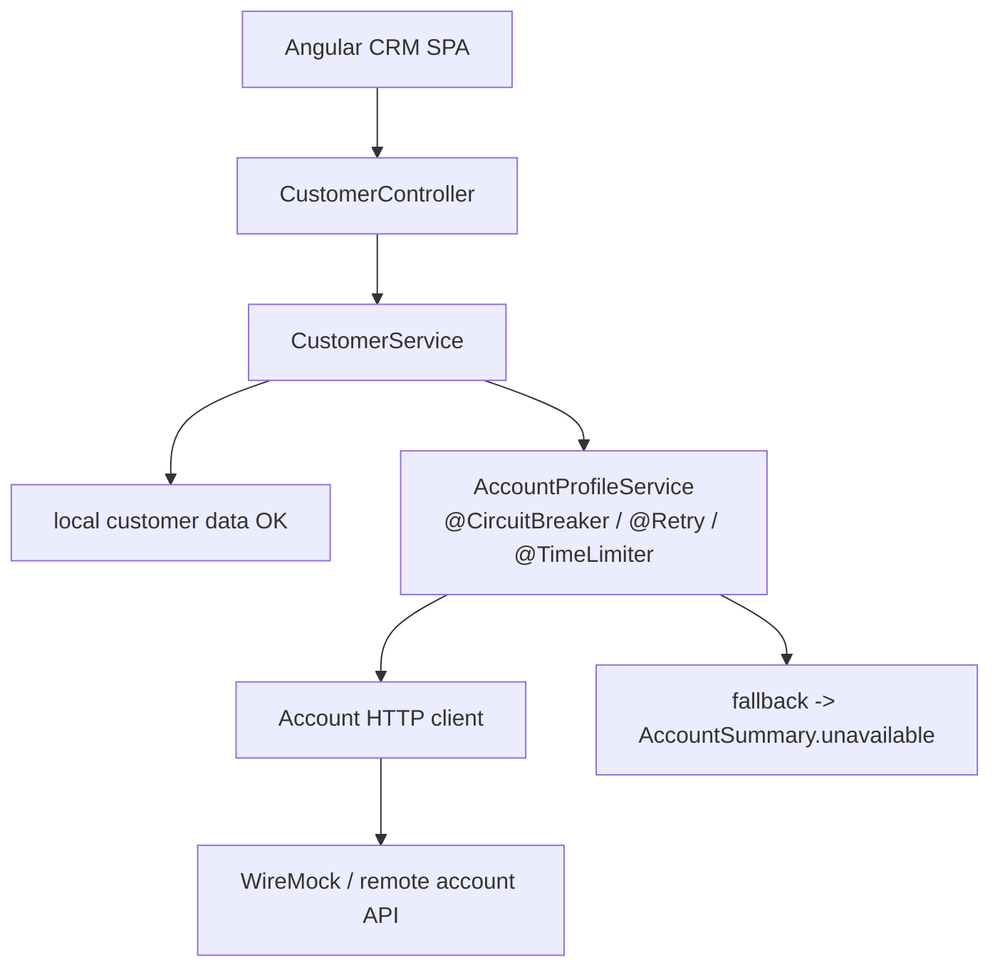

# Lab 32: Resilience4j for CRM Outbound Calls — Northstar Account Profile

**Module:** 32 — Resilience4j for CRM Outbound Calls  
**Duration:** ~45 minutes (timed path with starter) · Full path: 4–5 Hours

**Primary IDE:** IntelliJ IDEA Community Edition · **Optional IDE:** VS Code

| OS | How-to for this lab |
| -- | ------------------- |
| Windows | [LAB-32-WINDOWS.md](LAB-32-WINDOWS.md) |
| macOS | [LAB-32-MACOS.md](LAB-32-MACOS.md) |

---

## Activity card

| | |
| --- | --- |
| **Time** | ~45 min timed · full path 4–5 h |
| **Checkpoint** | **E** (after Ex 1→2→3→4→5→6) |
| **Must prove** | Healthy read · truthful fallback · OPEN fail-fast · timeout · tests ×2 |
| **Hard gate** | Pre-lab Pass · fallback forbids fake write success |

### What you will learn

Protect outbound Account Profile reads with Resilience4j and prove behavior with WireMock.

### Enterprise context

CRM pages must degrade honestly when Account API is down — never lie about writes.

### Predict

In OPEN, how many WireMock requests should a burst of finds produce?

### Debug

Annotations ignored on `find` — AOP / self-invocation checklist?

---

## 45-minute timed path (use starter)

> **Pacing reminder:** [PACING.md](../PACING.md) checkpoint **E**. Homework: Actuator evidence + unsafe-write-retry notes.

In class, use the starter templates so the **core** objectives fit **~45 minutes**. The full Steps below remain for homework / extended depth.

1. Open [`starter/README.md`](starter/README.md).
2. Copy `starter/` into your `java-bootcamp/examples/…` target (see starter README).
3. Fill every `// TODO` / `TODO` — do **not** wait on a perfect prior lab; the starter includes a baseline.
4. Run the starter smoke test. Commit your work to your GitHub repo (no screenshots).
5. Check timed-path Pass criteria in the starter README yourself (do not write the marks down). Continue remaining GUIDE steps as homework if needed.

| Path | Time | Scope |
| ---- | ---- | ----- |
| **Timed (default)** | ~45 min | Starter TODOs + smoke test |
| **Full (extended)** | see Duration | Every Step in this GUIDE |

---

## What you'll complete (practice only)

Labs and exercises are **practice only**. Nothing is submitted or graded. Do not take screenshots. Check Pass/Fail yourself — do not write those marks anywhere. Commit your work to your private `java-bootcamp` GitHub repo.

Keep this checklist visible while you work.

| # | Deliverable |
| - | ----------- |
| 1 | Resilience4j Retry + CircuitBreaker + TimeLimiter on account profile reads |
| 2 | `AccountSummary.unavailable` truthful fallback |
| 3 | WireMock stubs for 503 / slow / OK on `CUS-1001` |
| 4 | Actuator observation evidence |
| 5 | `AccountProfileResilienceTest` output (OPEN, timeout, recovery) |
| 6 | Notes forbidding unsafe write retries / false success |
| 7 | Run and cleanup instructions |
| 8 | No secrets committed |

**Commit to your GitHub repo:** the items in the table above (sources + evidence + short notes).

**Do not commit:** `target/`, `node_modules/`, secrets, heap dumps, or a copied answer keys.

## Lab Overview

This Module 32 lab protects **outbound** CRM calls to an account-profile dependency with **Resilience4j**: **Retry**, **CircuitBreaker**, **TimeLimiter**, truthful degraded read fallbacks (`AccountSummary.unavailable`), Actuator observation, and **deterministic WireMock** tests.

## Learning Objectives

After completing this lab, you will be able to:

* Reproduce fast, slow, and failing account-service responses with WireMock
* Configure Resilience4j Retry for transient, safe GET requests
* Configure a CircuitBreaker and observe CLOSED, OPEN, and HALF_OPEN states
* Apply a TimeLimiter that enforces the CRM latency budget
* Write explicit degraded read fallbacks (`AccountSummary.unavailable`)

## Business Scenario

Agents opening Amina Khan (`CUS-1001`) see account summaries from a separate Account Profile service. When that service flaps, the CRM still must show customer identity/status and a clear “accounts temporarily unavailable” banner — not a spinning tab or a lie that balances updated.

Leadership freezes:

**Outbound account reads are wrapped with Retry + CircuitBreaker + TimeLimiter; degraded reads return `AccountSummary.unavailable`; writes are not silently marked successful.**

Use these examples consistently:

| ID | Name | Notes |
| -- | ---- | ----- |
| `CUS-1001` | Amina Khan | Primary WireMock stub `/accounts/CUS-1001/summary` |
| `CUS-1002` | Ravi Singh | Optional second stub / happy path |
| `lab-request-001` | — | Correlation on CRM request / outbound header |
| `accountProfile` | — | Resilience4j instance name |
| `AccountSummary.unavailable` | — | Truthful degraded read contract |

**Security note for evidence.** Do not retry non-idempotent writes. Do not put tokens into WireMock journals committed to Git.

---

## Architecture Context
### NOW (this lab)



## Prerequisites

Prior labs: [29](../../../Week%203%20-%20Spring%20Framework%20and%20Enterprise%20Patterns/module-29/lab29/LAB-29-GUIDE.md) · [31](../../module-31/lab31/LAB-31-GUIDE.md).

Confirm (Lab 0 tools assumed):

* JDK 21; Maven; Spring Boot 3
* Ability to add Resilience4j and WireMock via Maven
* No secrets committed to Git

### Pre-flight

```bash
java -version
mvn -version
```

## Worked example (read before you code)

Study this pattern once before Step 1. Your job is to apply the same idea in the Steps — do not skip ahead to a full solution.

```bash
curl -s localhost:8080/actuator/health
curl -s localhost:8080/actuator/circuitbreakerevents
curl -s localhost:8080/actuator/metrics/resilience4j.circuitbreaker.calls
mvn -q test -Dtest=AccountProfileResilienceTest
mvn -q test -Dtest=AccountProfileResilienceTest
```

**What to notice:** Match names, IDs, and failure behavior from the scenario — instructors check these.

---

## Implementation Steps

Complete each step in order. Commands assume `~/java-bootcamp/examples/lab32-crm` (Windows: `%USERPROFILE%\java-bootcamp\examples\lab32-crm`) unless noted.

---

### Step 1 — Branch CRM and add resilience dependencies

**Why:** AOP + Actuator are required for annotation-driven Resilience4j and observable state.

**Do this:**

```bash
cd ~/java-bootcamp/examples
cp -r lab31-crm lab32-crm   # or lab29-crm if Kafka skipped
cd lab32-crm
mkdir -p docs
```

```xml
<dependency>
  <groupId>io.github.resilience4j</groupId>
  <artifactId>resilience4j-spring-boot3</artifactId>
</dependency>
<dependency>
  <groupId>org.springframework.boot</groupId>
  <artifactId>spring-boot-starter-aop</artifactId>
</dependency>
<dependency>
  <groupId>org.springframework.boot</groupId>
  <artifactId>spring-boot-starter-actuator</artifactId>
</dependency>
<!-- WireMock test dependency as taught in class -->
```

Expose Actuator endpoints needed for health/metrics/events in lab profile (tighten for production notes).

```bash
mvn -q dependency:tree -Dincludes=io.github.resilience4j
```

**Expected result:** `resilience4j-spring-boot3` on classpath; `BUILD SUCCESS`.

**If it fails:** Wrong artifact for Boot 2 vs 3 → use `resilience4j-spring-boot3`. AOP missing → annotations silently ineffective.

---

### Step 2 — Create deterministic WireMock failures

**Why:** Every resilience state must be reproducible in tests without a flaky network.

**Do this:** Stub success, temporary 503, and slow responses for Amina:

```java
stubFor(get("/accounts/CUS-1001/summary")
  .inScenario("recovery").whenScenarioStateIs(STARTED)
  .willReturn(aResponse().withStatus(503))
  .willSetStateTo("available"));
stubFor(get("/accounts/CUS-1001/summary")
  .inScenario("recovery").whenScenarioStateIs("available")
  .willReturn(okJson("{\"customerId\":\"CUS-1001\",\"available\":true,\"note\":\"ok\"}")));
```

Also prepare a 3000ms delayed stub for TimeLimiter tests and a permanent-503 scenario for OPEN.

**Expected result:** First request 503; second 200; WireMock journal shows expected call counts.

**If it fails:** Scenario state not advancing → fix `willSetStateTo` / `whenScenarioStateIs`. Wrong path → align client base URL + `/accounts/{id}/summary`.

---

### Step 3 — Configure bounded retry

**Why:** Transient GETs deserve bounded exponential backoff — not infinite hammering.

**Do this:** In `application.yml`:

```yaml
resilience4j.retry.instances.accountProfile:
  max-attempts: 3
  waitDuration: 200ms
  enable-exponential-backoff: true
  exponential-backoff-multiplier: 2
  retry-exceptions:
    - java.io.IOException
    - com.northstar.crm.account.TemporaryAccountException
```

Map HTTP 503 to `TemporaryAccountException` in the client. Do **not** list business validation errors as retryable.

**Expected result:** Logs show retry wait (`waitDuration: 200ms`) then success for recovery scenario; `account_profile_loaded customerId=CUS-1001`.

**If it fails:** Retries not happening → exception type not listed / wrong instance name. Retries on 400 → remove from retry list.

---

### Step 4 — Configure the circuit breaker

**Why:** After enough failures, fail fast and protect the account dependency from a retry storm.

**Do this:** Use a small count window so transitions are visible quickly in the lab:

```yaml
resilience4j.circuitbreaker.instances.accountProfile:
  sliding-window-type: COUNT_BASED
  sliding-window-size: 10
  minimum-number-of-calls: 5
  failure-rate-threshold: 50
  wait-duration-in-open-state: 10s
  permitted-number-of-calls-in-half-open-state: 2
```

Drive enough failing calls to cross the threshold.

**Expected result:** `CLOSED_TO_OPEN` transition; next call fails fast (`CallNotPermittedException`) in under ~20ms; WireMock count does **not** increase while OPEN.

**If it fails:** Never opens → window too large / not enough calls / failures not recorded. Opens too early → intended for lab; document production tuning separately.

---

### Step 5 — Enforce a TimeLimiter budget

**Why:** Slow dependencies must not consume servlet threads forever; CRM has a latency budget.

**Do this:**

```yaml
resilience4j.timelimiter.instances.accountProfile:
  timeout-duration: 1500ms
  cancel-running-future: true
```

Run the client asynchronously (`CompletableFuture`) so TimeLimiter can interrupt/cancel.

Stub WireMock with 3000ms delay for `CUS-1001`.

**Expected result:** Observed response time ≈ 1500ms; cause `TimeoutException` (then fallback); not a 3s hang on the CRM thread pool for the caller path.

**If it fails:** TimeLimiter ignored → method returns sync value instead of `CompletableFuture`. Delay too small → raise stub delay clearly above budget.

---

### Step 6 — Compose annotations deliberately

**Why:** Aspect order and return types determine whether timeout/retry/CB actually apply.

**Do this:** In `AccountProfileService`:

```java
import io.github.resilience4j.circuitbreaker.annotation.CircuitBreaker;
import io.github.resilience4j.retry.annotation.Retry;
import io.github.resilience4j.timelimiter.annotation.TimeLimiter;
import java.util.concurrent.CompletableFuture;

@CircuitBreaker(name = "accountProfile", fallbackMethod = "fallback")
@Retry(name = "accountProfile")
@TimeLimiter(name = "accountProfile")
public CompletableFuture<AccountSummary> find(String customerId) {
  return CompletableFuture.supplyAsync(() -> client.fetch(customerId), executor);
}
```

Pass `X-Correlation-Id: lab-request-001` from the web layer into client headers where practical. Keep fallback signature compatible: same args + `Throwable`.

**Expected result:** Healthy dependency: `available=true` with accounts; slow/failing dependency eventually invokes fallback; logs include `customerId`, pattern name, exception type.

**If it fails:** Fallback signature mismatch → `NoSuchMethod` style errors at runtime. Self-invocation bypasses proxies → call through Spring bean, not `this`.

---

### Step 7 — Write a truthful AccountSummary.unavailable fallback

**Why:** Degraded reads must be honest; failed writes must never look successful.

**Do this:**

```java
import java.util.concurrent.CompletableFuture;

private CompletableFuture<AccountSummary> fallback(
    String customerId, Throwable cause) {
  log.warn("account_profile_degraded customerId={} cause={}",
      customerId, cause.getClass().getSimpleName());
  return CompletableFuture.completedFuture(
      AccountSummary.unavailable(customerId));
}
```

```java
public static AccountSummary unavailable(String customerId) {
  return new AccountSummary(customerId, false, "account-profile-unavailable");
}
```

Wire Angular/API banner text: “Account information is temporarily unavailable.” Document that write endpoints do **not** use this success-shaped fallback.

**Expected result:** HTTP 200 with `{"customerId":"CUS-1001","available":false,"note":"account-profile-unavailable"}` (or equivalent) for degraded reads — not a fake account list implying success of a mutation.

**If it fails:** Fallback returns empty success without `available=false` → Angular cannot distinguish; fix contract. Returning 500 for all CB opens → consider degraded read policy for UX (document choice).

---

### Step 8 — Observe recovery and automate tests

**Why:** Operators need Actuator signals; CI needs WireMock-deterministic proofs.

**Do this:**

```bash
curl -s localhost:8080/actuator/health
curl -s localhost:8080/actuator/circuitbreakerevents
curl -s localhost:8080/actuator/metrics/resilience4j.circuitbreaker.calls
mvn -q test -Dtest=AccountProfileResilienceTest
mvn -q test -Dtest=AccountProfileResilienceTest
```

Test ideas (assert specific states, not sleeps alone):

* Retry recovery scenario succeeds and journal count ≥ 2
* OPEN: `CallNotPermitted` / fallback; WireMock count unchanged during OPEN probes
* TimeLimiter: stub 3s → fallback within ~1.5–2s wall time
* HALF_OPEN → successful probes → CLOSED
* `AccountSummary.unavailable` fields asserted with JsonPath/equals

**Expected result:** Health shows CB state transitions; tests ~5+ green; consecutive runs deterministic.

**If it fails:** Flaky wall-clock asserts → widen bound slightly; prefer event assertions. Actuator 404 → enable exposure for lab profile.

---

### Step 9 — Document resilience runbook and UX contract

**Why:** Angular and support teams need a stable meaning for `available=false`.

**Do this:** In `docs/resilience-notes.md`, document:

| CRM response field | Meaning |
| ------------------ | ------- |
| `available: true` | Account dependency succeeded; accounts list trustworthy |
| `available: false` | Degraded; show banner; do **not** invent balances |
| Correlation | Prefer `lab-request-001` (or request header) in CRM + outbound logs |

```bash
cd ~/java-bootcamp/examples/lab32-crm
mvn -q test -Dtest=AccountProfileResilienceTest
mvn -q spring-boot:run
curl -s localhost:8080/actuator/health
curl -s localhost:8080/actuator/circuitbreakerevents
```

Warn boldly: lab CB windows and 10s open-wait are for classroom visibility — production values come from SLOs/load tests.

**Expected result:** Peer can re-run OPEN/timeout/recovery demos from notes; UX contract explicit.

**If it fails:** Notes omit `available` flag → Angular cannot distinguish empty accounts from outage.

---

### Step 10 — Failure experiments + evidence pack

**Why:** Unsafe write retries and silent “success” fallbacks are the ethical failure modes of this lab.

**Do this:** Complete Failure Experiments. Commit your work to your GitHub repo. Do not take screenshots. Run resilience tests twice for determinism.

**Expected result:** ≥3 experiments; truthful fallback documented; consecutive green tests; no secrets in Git.

**If it fails:** See Troubleshooting.

---

## Annotation composition cheat-sheet

Keep this near the service code in notes:

1. **TimeLimiter** expects async (`CompletableFuture`) for cancel/timeout semantics taught in this lab.
2. **Retry** should target transient infrastructure exceptions — not validation/`BusinessException`.
3. **CircuitBreaker** records failures after retries according to your Resilience4j ordering; verify with WireMock counts, not assumptions.
4. **Fallback** must match method arguments + `Throwable` and must stay honest for reads.
5. Call the service through a Spring-injected bean so proxies apply (no `this.find(...)` self-invocation).

---

## Implementation Checkpoints

### Checkpoint A — Tooling

_Check **Pass** or **Fail** yourself. Do not write these marks anywhere — nothing is submitted or graded. Commit your work to your GitHub repo._

| # | Confirm | Self-check |
| - | ------- | ---------- |
| 1 | `lab32-crm` under `examples/` | Pass / Fail |
| 2 | Resilience4j Boot3 + AOP + Actuator resolve | Pass / Fail |
| 3 | WireMock on test classpath | Pass / Fail |

### Checkpoint B — Patterns configured

_Check **Pass** or **Fail** yourself. Do not write these marks anywhere — nothing is submitted or graded. Commit your work to your GitHub repo._

| # | Confirm | Self-check |
| - | ------- | ---------- |
| 1 | Retry instance `accountProfile` with bounded backoff | Pass / Fail |
| 2 | CircuitBreaker count window + OPEN fail-fast proof | Pass / Fail |
| 3 | TimeLimiter 1500ms with async `CompletableFuture` | Pass / Fail |

### Checkpoint C — Fallback and honesty

_Check **Pass** or **Fail** yourself. Do not write these marks anywhere — nothing is submitted or graded. Commit your work to your GitHub repo._

| # | Confirm | Self-check |
| - | ------- | ---------- |
| 1 | `AccountSummary.unavailable` for degraded reads | Pass / Fail |
| 2 | No false-success write fallback | Pass / Fail |
| 3 | Correlation/`CUS-1001` visible in logs | Pass / Fail |

### Checkpoint D — Observation and tests

_Check **Pass** or **Fail** yourself. Do not write these marks anywhere — nothing is submitted or graded. Commit your work to your GitHub repo._

| # | Confirm | Self-check |
| - | ------- | ---------- |
| 1 | Actuator health/events/metrics consulted | Pass / Fail |
| 2 | `AccountProfileResilienceTest` green twice | Pass / Fail |
| 3 | Production threshold caution documented | Pass / Fail |

---

## Reference Commands, Configuration, and Code

### application.yml (excerpt)

```yaml
resilience4j:
  retry:
    instances:
      accountProfile:
        max-attempts: 3
        waitDuration: 200ms
        enable-exponential-backoff: true
        exponential-backoff-multiplier: 2
  circuitbreaker:
    instances:
      accountProfile:
        sliding-window-size: 10
        minimum-number-of-calls: 5
        failure-rate-threshold: 50
        wait-duration-in-open-state: 10s
  timelimiter:
    instances:
      accountProfile:
        timeout-duration: 1500ms
        cancel-running-future: true
```

### Actuator / test commands

```bash
cd ~/java-bootcamp/examples/lab32-crm
mvn -q test -Dtest=AccountProfileResilienceTest
curl -s localhost:8080/actuator/health
curl -s localhost:8080/actuator/metrics/resilience4j.circuitbreaker.calls
curl -s localhost:8080/actuator/circuitbreakerevents
git status
```

## Failure Experiments

| # | Experiment | Observe | Restore |
| - | ---------- | ------- | ------- |
| 1 | Permanent 503 from WireMock | Retries then OPEN / fallback | Reset scenario; CB wait elapses |
| 2 | 3000ms delay stub | Timeout ≈1500ms + unavailable | Disable delay stub |
| 3 | Calls while OPEN | Fail fast; journal unchanged | Wait for HALF_OPEN; succeed |
| 4 | Retry a non-idempotent write (thought experiment or guarded demo) | Document why forbidden | Keep writes out of retry |
| 5 | Fallback returns “success” without `available=false` | UX lie | Restore `unavailable` |

---

## Troubleshooting

| Symptom | Likely cause | Fix |
| ------- | ------------ | --- |
| Annotations ignored | Missing AOP / self-invocation | Add starter-aop; call through Spring proxy |
| TimeLimiter no effect | Sync return type | Return `CompletableFuture` + async supply |
| CB never opens | Failures not recorded / wrong name | Align instance name; throw recorded exceptions |
| Flaky tests | Wall-clock sleeps only | Awaitility + WireMock journal asserts |
| Actuator 404 | Endpoints not exposed | Configure `management.endpoints.web.exposure` for lab |
| Fallback wrong signature | Missing `Throwable` arg | Match method args + cause |
| Fake available=true fallback | Wrong contract | Return `AccountSummary.unavailable` only |
| Retrying POSTs same as GETs | Non-idempotent | Document: aggressive retry on reads only |

## Security and Production Review

Optional — jot brief notes in your README if useful for your progress check (not a separate essay):

1. Which remote/network inputs are untrusted (account JSON)?
2. Where are authn/authz enforced for CRM vs outbound account calls (propagate tokens carefully)?
3. Which values are sensitive on outbound headers?

---


## Cleanup

```bash
cd ~/java-bootcamp/examples/lab32-crm
# Stop spring-boot:run
mvn -q clean
git status
```

No Docker required for WireMock tests; if you started Lab 30 Kafka for combined demos, shut it down separately when done.

**Keep `lab32-crm`** as the resilience reference for capstone outbound dependency hardening.


## Reflection Questions

Write **1–3 sentence** answers (not essays):

1. Which design decision most affected correctness (fallback honesty vs fail-hard)?
2. What evidence proves OPEN fail-fast without calling WireMock?
3. Which failure was hardest (aspect order, TimeLimiter + Future, CB thresholds)?

---


