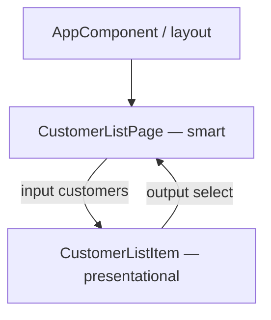

# Lab 33: Angular Component Architecture — Northstar CRM UI Shell

> **Participants:** Module sequence is in [`../README.md`](../README.md). Open **one** OS how-to ([Windows](LAB-33-WINDOWS.md) · [macOS](LAB-33-MACOS.md)). In class, prefer the **45-minute timed path** with [`starter/`](starter/README.md); the **full path** is every Step below. This repo has no answer keys — complete the TODOs yourself. See [Which file do I open?](../../../_PARTICIPANT-FILE-GUIDE.md).

## Activity card

| | |
| --- | --- |
| **Objective** | Scaffold a standalone Angular CRM UI with smart/presentational components and feature folders |
| **Skills practiced** | Angular CLI, standalone components, templates, inputs/outputs, composition |
| **Expected outcome** | `lab33-crm-ui` lists CUS-1001 / CUS-1002 via presentational children |
| **Estimated time** | Timed path ~45 min · Full path 3–4 hours |
| **Prerequisites** | Lab 0 · Node 20 LTS · npm · Angular CLI · Git |
| **Expected files** | `examples/lab33-crm-ui/` — feature folders, list/detail components, notes |
| **Validation checkpoints** | Starter smoke · GUIDE Implementation Checkpoints |

**Module:** 33 — Angular Component Architecture  
**Duration:** ~45 minutes (timed path) · Full path: 3–4 Hours  

**Primary IDE:** VS Code · **Optional IDE:** IntelliJ IDEA Community Edition

| OS | How-to |
| -- | ------ |
| Windows | [LAB-33-WINDOWS.md](LAB-33-WINDOWS.md) |
| macOS | [LAB-33-MACOS.md](LAB-33-MACOS.md) |

> **Incremental build:** CLI app → feature folders → presentational item → smart page → inputs/outputs → shell.  
> **Critical scope:** Angular standalone only. **No** React, SOAP, or Oracle. Hard-coded fixtures OK; REST + **PostgreSQL** arrive in Labs 35+.

## 45-minute timed path (use starter)

1. Open [`starter/README.md`](starter/README.md).
2. Scaffold/copy into `java-bootcamp/examples/lab33-crm-ui`.
3. Fill TODOs for model, list item, smart page, app host.
4. Smoke with `ng serve`. Commit your work to your GitHub repo (no screenshots).
5. Mark timed-path Pass; finish remaining Steps as homework.

| Path | Time | Scope |
| ---- | ---- | ----- |
| **Timed** | ~45 min | Starter TODOs + serve smoke |
| **Full** | see Duration | Every Step below |

---

## What you'll complete (practice only)

Labs and exercises are **practice only**. Nothing is submitted or graded. Do not take screenshots. Check Pass/Fail yourself — do not write those marks anywhere. Commit your work to your private `java-bootcamp` GitHub repo.

| # | Deliverable |
| - | ----------- |
| 1 | `lab33-crm-ui` under `examples/` |
| 2 | `features/customers/` smart + presentational components |
| 3 | List shows `CUS-1001` Amina Khan and `CUS-1002` Ravi Singh |
| 4 | At least one input and one output parent↔child flow |
| 5 | `docs/component-notes.md` (smart vs presentational + folder map) |
| 6 | GitHub commit (UI code) |
| 7 | `ng build` or serve smoke evidence |
| 8 | No secrets / `node_modules/` / `dist/` committed |

## Lab Overview

Build the Northstar CRM **UI shell** in Angular: CLI app, feature folders, **smart** pages that own data, and **presentational** children that take inputs and emit outputs.

## Learning Objectives

* Scaffold a standalone Angular app with the CLI  
* Use templates, interpolation, property/event binding  
* Wire `@Input()` / `@Output()` (or `input()` / `output()`)  
* Separate smart vs presentational responsibilities  
* Lay out feature folders ready for later HttpClient labs  

## Business Scenario

**Customer list UI is Angular standalone under `features/customers/`. Smart pages own fixtures; presentational children only render and emit. Seed Amina (`CUS-1001`) and Ravi (`CUS-1002`). No React. No SOAP.**

| ID | Name | Notes |
| -- | ---- | ----- |
| `CUS-1001` | Amina Khan | ACTIVE — must appear |
| `CUS-1002` | Ravi Singh | PROSPECT — must appear |
| `CUS-1003` | Maya Chen | optional UI-only row |
| `lab-request-001` | — | correlation id for later APIs |

Use fictional emails only (`amina.khan@example.com`).

---

## Architecture Context



## Prerequisites

* Node.js **20 LTS**, npm, Angular CLI (`npx ng`)
* Workspace `~/java-bootcamp`

```bash
node -v && npm -v && npx ng version
```

## Worked example (read before you code)

```typescript
import { Component, input, output } from '@angular/core';

export interface CustomerRow { id: string; name: string; status: string; }

@Component({
  selector: 'app-customer-list-item',
  standalone: true,
  template: `
    <button type="button" (click)="select.emit(customer().id)">
      {{ customer().id }} — {{ customer().name }} ({{ customer().status }})
    </button>
  `,
})
export class CustomerListItemComponent {
  customer = input.required<CustomerRow>();
  select = output<string>();
}
```

---

## Implementation Steps

Paths: `~/java-bootcamp/examples/lab33-crm-ui` (Windows: `%USERPROFILE%\java-bootcamp\examples\lab33-crm-ui`).

### Step 1 — Scaffold `lab33-crm-ui`

**Why:** CLI layout beats hand-rolled `package.json` drift.

**Do this:** Copy course `starter/` into `examples/lab33-crm-ui` (Angular 19 tree is included). Optional fresh scaffold:

```bash
cd ~/java-bootcamp/examples
npx -y @angular/cli@19 new lab33-crm-ui --standalone --routing=false --style=css --ssr=false --skip-git
cd lab33-crm-ui
```

**Expected result:** Standalone `AppComponent` exists; `npx ng version` works in-project.  
**If it fails:** Node too old → install Node 20 LTS. Keep **standalone**, no SSR.

### Step 2 — Feature model + seeds

**Why:** Feature folders keep Lab 35 services beside the pages that use them.

**Do this:** Add `features/customers/customer.model.ts` with `Customer` and `SEED_CUSTOMERS` for CUS-1001 / CUS-1002. Sketch the folder map in `docs/component-notes.md`.

**Expected result:** Seeds match Northstar IDs.  
**If it fails:** Keep files under `src/app/features/customers/`.

### Step 3 — Presentational `CustomerListItemComponent`

**Why:** Props in, events out — easier to test and reuse.

**Do this:** Standalone list-item accepting a `Customer` input; emit `select` with id on click. No hard-coded Amina/Ravi strings in the child.

**Expected result:** Child has zero HttpClient / seed imports.  
**If it fails:** Child calling APIs → reject; keep presentational pure.

### Step 4 — Smart `CustomerListPageComponent`

**Why:** Smart pages own fixtures (later: Signals / HttpClient).

**Do this:** Hold `customers = SEED_CUSTOMERS`, `@for` list items, track `selectedId` on `select`. Show a simple detail line for the selection.

**Expected result:** Browser lists **CUS-1001** and **CUS-1002**; click updates selection.  
**If it fails:** Blank UI → add child to page `imports`. Check `ng serve` console.

### Step 5 — Wire the app shell

**Why:** One host keeps future nav/auth chrome out of feature pages.

**Do this:** Host `<app-customer-list-page />` in `AppComponent` (optional “Northstar CRM” header). Run `npx ng serve --open`. Commit your work to your GitHub repo (no screenshots).

**Expected result:** `http://localhost:4200` shows both customers.  
**If it fails:** Port busy → `--port 4201`. Missing `imports` → red overlay.

### Step 6 — Architecture notes

**Why:** Notes prove you understand the seam, not only that the UI “looks right.”

**Do this:** In `docs/component-notes.md`, name smart vs presentational pieces, every input/output, and why HttpClient does **not** belong in the list item yet.

**Expected result:** Notes mention Amina/Ravi and parent↔child flow.  
**If it fails:** Empty notes → incomplete even if UI works.

### Step 7 — (Full path) Shared header + optional Maya

**Do this:** Extract header to `shared/ui`. Optionally add `CUS-1003` Maya Chen to seeds and confirm the list item needs no class changes.

**Expected result:** Data-driven third row; shared header reused.  
**If it fails:** Duplicated header markup → extract once.

### Step 8 — Build + hygiene

```bash
npx ng build && git status
```

**Expected result:** Build OK; `node_modules/` / `dist/` ignored.  
**If it fails:** Low-memory VM → document serve smoke instead.

---

## Implementation Checkpoints

### Checkpoint A — Tooling

| # | Confirm | Notes |
| - | ------- | ----- |
| 1 | `lab33-crm-ui` under `examples/` | Pass / Fail |
| 2 | Node / `ng` OK | Pass / Fail |
| 3 | `features/customers/` present | Pass / Fail |

### Checkpoint B — Components

| # | Confirm | Notes |
| - | ------- | ----- |
| 1 | Presentational item with input + output | Pass / Fail |
| 2 | Smart page owns seeds | Pass / Fail |
| 3 | Browser shows CUS-1001 and CUS-1002 | Pass / Fail |

### Checkpoint C — Notes + hygiene

| # | Confirm | Notes |
| - | ------- | ----- |
| 1 | `docs/component-notes.md` complete | Pass / Fail |
| 3 | No React/SOAP/Oracle path; no secrets committed | Pass / Fail |

---

## Reference Commands

```bash
cd ~/java-bootcamp/examples/lab33-crm-ui
npx ng serve --open
npx ng build
npx ng generate component features/customers/customer-list-item --standalone
```

## Failure Experiments

| # | Experiment | Observe | Restore |
| - | ---------- | ------- | ------- |
| 1 | Remove child from `imports` | Template error | Re-add |
| 2 | Hard-code Amina in child | Breaks data-driven list | Use input |
| 3 | HttpClient in list item | Wrong layer | Keep pure |

## Troubleshooting

| Symptom | Cause | Fix |
| ------- | ----- | --- |
| Blank page | Missing standalone import | Add to `imports` |
| CLI missing | No global CLI | Use `npx ng` |
| Work only in course `labs/` | Wrong workspace | Copy to `examples/lab33-crm-ui` |

## Security and Production Review

1. Demo PII only — no real emails.  
2. Never put API keys in the Angular bundle.  
3. Keep presentational components free of services.

## Cleanup

```bash
# Ctrl+C ng serve — keep sources; do not commit node_modules/
```

**Keep `lab33-crm-ui`** — Lab 34 adds Signals/forms (or copy to `lab34-crm-ui`).

## Reflection Questions

1. What stays in the smart page vs the list item?  
2. How does a feature folder help Lab 35?  
3. What broke first when `imports` was wrong?
