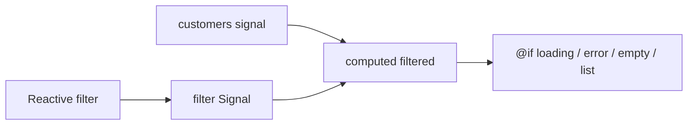

# Lab 34: State and Event Management in Angular — Northstar CRM Reactive UI

> **Participants:** Module sequence is in [`../README.md`](../README.md). Open **one** OS how-to ([Windows](LAB-34-WINDOWS.md) · [macOS](LAB-34-MACOS.md)). Prefer the **45-minute timed path** with [`starter/`](starter/README.md); full Steps for homework. This repo has no answer keys — complete the TODOs yourself. See [Which file do I open?](../../../_PARTICIPANT-FILE-GUIDE.md).

## Activity card

| | |
| --- | --- |
| **Objective** | Drive CRM list/filter UI with Signals, computed values, and reactive form state |
| **Skills practiced** | `signal` / `computed` / `effect`, Observables vs Signals, FormGroup, loading/error/empty UI |
| **Expected outcome** | Filterable list (CUS-1001 / CUS-1002) with loading · empty · error branches |
| **Estimated time** | Timed path ~45 min · Full path 3–4 hours |
| **Prerequisites** | Lab 33 preferred · Node 20 · Angular CLI |
| **Expected files** | `examples/lab34-crm-ui/` — Signals store/page, filter form, state notes |
| **Validation checkpoints** | Starter smoke · GUIDE Implementation Checkpoints |

**Module:** 34 — State and Event Management in Angular  
**Duration:** ~45 minutes (timed path) · Full path: 3–4 Hours  

**Primary IDE:** VS Code · **Optional IDE:** IntelliJ IDEA Community Edition

| OS | How-to |
| -- | ------ |
| Windows | [LAB-34-WINDOWS.md](LAB-34-WINDOWS.md) |
| macOS | [LAB-34-MACOS.md](LAB-34-MACOS.md) |

> **Critical scope:** **Signals + RxJS** — not React hooks. No deep HttpClient yet (Lab 35). Mock async is enough. Persistence story remains **PostgreSQL** later.

## 45-minute timed path (use starter)

1. Open [`starter/README.md`](starter/README.md).
2. Copy/scaffold `lab34-crm-ui`.
3. Implement Signals + filter form + three UI states.
4. Smoke `ng serve`. Commit your work to your GitHub repo (no screenshots).
5. Mark timed-path Pass; finish remaining Steps as homework.

| Path | Time | Scope |
| ---- | ---- | ----- |
| **Timed** | ~45 min | Signals list + filter + three states |
| **Full** | see Duration | Every Step below |

---

## What you'll complete (practice only)

Labs and exercises are **practice only**. Nothing is submitted or graded. Do not take screenshots. Check Pass/Fail yourself — do not write those marks anywhere. Commit your work to your private `java-bootcamp` GitHub repo.

| # | Deliverable |
| - | ----------- |
| 1 | `lab34-crm-ui` under `examples/` |
| 2 | Signal-based customers including CUS-1001 / CUS-1002 |
| 3 | `computed` filtered list driven by reactive form (or filter Signal) |
| 4 | Loading, empty, and error UI demonstrated |
| 5 | `docs/state-notes.md` (Signals vs Observables) |
| 6 | Screenshots of filter + empty or error |
| 7 | Serve/build evidence |
| 8 | No `node_modules/` / secrets committed |

## Lab Overview

Make the CRM list **reactive**: hold customers in Signals, derive filters with `computed`, contrast with RxJS Observables, drive criteria with a reactive form, and show **loading / empty / error** so Lab 35 can plug HttpClient into the same branches.

## Learning Objectives

* Create, read, and update Signals; derive with `computed`; observe with `effect`  
* Explain Signals for UI state vs Observables for async streams  
* Build a basic reactive filter form  
* Render loading, empty, and error states consistently  

## Business Scenario

**List/filter state lives in Signals. Do not leave a forever spinner or blank screen when a filter matches nothing. Seeds stay Amina (`CUS-1001`) and Ravi (`CUS-1002`).**

| ID | Name | Status |
| -- | ---- | ------ |
| `CUS-1001` | Amina Khan | ACTIVE |
| `CUS-1002` | Ravi Singh | PROSPECT |
| `lab-request-001` | — | future correlation id |

---

## Architecture Context



## Prerequisites

* Lab 33 concepts or a fresh CLI app  
* Node 20 LTS  

```bash
node -v && npx ng version
```

## Worked example

```typescript
import { computed, signal } from '@angular/core';

const customers = signal([
  { id: 'CUS-1001', name: 'Amina Khan', status: 'ACTIVE' },
  { id: 'CUS-1002', name: 'Ravi Singh', status: 'PROSPECT' },
]);
const statusFilter = signal<'ALL' | 'ACTIVE' | 'PROSPECT'>('ALL');
const filtered = computed(() => {
  const f = statusFilter();
  return f === 'ALL' ? customers() : customers().filter((c) => c.status === f);
});
```

Read Signals with `()`. Prefer new writes over in-place array mutation.

---

## Implementation Steps

### Step 1 — Create `lab34-crm-ui`

**Do this:** Copy course `starter/` into `examples/lab34-crm-ui`, or copy your Lab 33 project:

```bash
cd ~/java-bootcamp/examples
cp -R lab33-crm-ui lab34-crm-ui   # or copy course starter/
cd lab34-crm-ui
```

**Expected result:** `ng serve` boots.  
**If it fails:** No Lab 33 → scaffold CLI and paste seeds from this GUIDE.

### Step 2 — Signals-backed store

**Do this:** Service or page with `customers`, `loading`, `error` Signals and `loadSeeds()` that writes Amina/Ravi (optional short delay).

**Expected result:** After load, `customers()` has both IDs.  
**If it fails:** Forgot to call `loadSeeds()` from init.

### Step 3 — `computed` filter

**Do this:** `statusFilter` Signal + `filteredCustomers = computed(...)`. Template iterates the computed list.

**Expected result:** ACTIVE→Amina only; PROSPECT→Ravi only; ALL→both.  
**If it fails:** Template still bound to raw `customers()`.

### Step 4 — Reactive forms

**Do this:** Import `ReactiveFormsModule`. `FormGroup`/`FormControl` for status; on `valueChanges`, update `statusFilter` (`subscribe` + `takeUntilDestroyed`, or `toSignal`).

**Expected result:** Changing the control updates the list without a Submit button (timed path).  
**If it fails:** Missing `ReactiveFormsModule` in `imports`.

### Step 5 — Loading / empty / error UI

**Do this:** Template branches for `loading()`, `error()`, empty filtered list, else list. Force empty via filter; force error with a debug setter (`lab-request-001 failed`).

**Expected result:** Screenshots of list + empty or error.  
**If it fails:** Empty never shows → tighten filter or clear seeds for the experiment.

### Step 6 — `effect` + notes

**Do this:** Optional `effect` that logs filtered count. Write `docs/state-notes.md`: Signals for sync UI graph; Observables for HTTP streams; avoid duplicating truth.

**Expected result:** Notes reject “React hooks renamed.”  
**If it fails:** Using `effect` to compute lists → move to `computed`.

### Step 7 — Smoke + hygiene

```bash
npx ng serve --open && npx ng build && git status
```

**Expected result:** Filter + three states proven; notes present.

---

## Implementation Checkpoints

### Checkpoint A — Tooling

| # | Confirm | Notes |
| - | ------- | ----- |
| 1 | `lab34-crm-ui` under `examples/` | Pass / Fail |
| 2 | App serves | Pass / Fail |

### Checkpoint B — Signals core

| # | Confirm | Notes |
| - | ------- | ----- |
| 1 | customers / loading / error Signals | Pass / Fail |
| 2 | computed filter works for Amina/Ravi | Pass / Fail |
| 3 | Reactive form drives filter | Pass / Fail |

### Checkpoint C — States + hygiene

| # | Confirm | Notes |
| - | ------- | ----- |
| 1 | Loading + empty or error shown | Pass / Fail |
| 2 | `docs/state-notes.md` present | Pass / Fail |

---

## Reference Commands

```bash
cd ~/java-bootcamp/examples/lab34-crm-ui
npx ng serve --open
npx ng build
```

## Failure Experiments

| # | Experiment | Observe | Restore |
| - | ---------- | ------- | ------- |
| 1 | Mutate `customers()` in place | Stale UI | `set([...])` |
| 2 | Filter PROSPECT only | Only Ravi | Reset ALL |
| 3 | Set error while loading | Error branch | Clear error |

## Troubleshooting

| Symptom | Cause | Fix |
| ------- | ----- | --- |
| UI stale | In-place mutate | Replace Signal value |
| Forms ignored | Missing module import | Add `ReactiveFormsModule` |
| Effect loop | Writing same Signal in effect | Guard / remove write |

## Security and Production Review

1. Avoid `console.log` of emails in production effects.  
2. Filter text becomes query input in Lab 35 — encode carefully.  
3. Do not hang JWTs on a Signal exposed via `window`.

## Cleanup

```bash
# Ctrl+C ng serve
```

**Keep `lab34-crm-ui`** — Lab 35 replaces seeds with HttpClient → Spring Boot → **PostgreSQL** (or mock).

## Reflection Questions

1. What belongs in `computed` vs `effect`?  
2. When keep an Observable instead of `toSignal`?  
3. Which UI state was easiest to forget?
