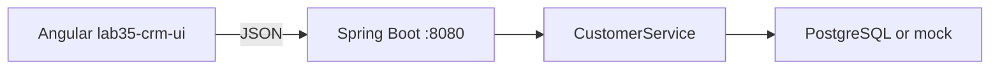

# Lab 35: Frontend–API Integration — Angular → Spring Boot REST → PostgreSQL

> **Participants:** Module sequence is in [`../README.md`](../README.md). Open **one** OS how-to ([Windows](LAB-35-WINDOWS.md) · [macOS](LAB-35-MACOS.md)). Prefer the **45-minute timed path** with [`starter/`](starter/README.md); full Steps for homework. This repo has no answer keys — complete the TODOs yourself. See [Which file do I open?](../../../_PARTICIPANT-FILE-GUIDE.md).

## Activity card

| | |
| --- | --- |
| **Objective** | Call local Spring Boot REST from Angular with typed HttpClient services |
| **Skills practiced** | HttpClient, DTO interfaces, AsyncPipe, env URLs, CORS, CRUD |
| **Expected outcome** | List/get/create for CUS-1001 / CUS-1002 via Angular → Boot JSON (PostgreSQL or mock) |
| **Estimated time** | Timed path ~45 min · Full path 4–5 hours |
| **Prerequisites** | Labs 33–34 preferred · JDK 21 · Node 20 · Boot on `:8080` |
| **Expected files** | `examples/lab35-crm-ui/` (+ optional `lab35-crm-api/`) |
| **Validation checkpoints** | Starter smoke · GUIDE Implementation Checkpoints |

**Module:** 35 — Frontend–API Integration  
**Duration:** ~45 minutes (timed path) · Full path: 4–5 Hours  

**Primary IDE:** VS Code (Angular) + IntelliJ (Boot)

| OS | How-to |
| -- | ------ |
| Windows | [LAB-35-WINDOWS.md](LAB-35-WINDOWS.md) |
| macOS | [LAB-35-MACOS.md](LAB-35-MACOS.md) |

> **Critical scope:** Angular **HttpClient** → Spring Boot **REST/JSON** → **PostgreSQL** (in-memory/mock API OK for timed path). **No** SOAP, React, or Oracle path.

## 45-minute timed path (use starter)

1. Open [`starter/README.md`](starter/README.md).
2. Copy course `starter/` to `lab35-crm-ui` and `crm-api/` to `lab35-crm-api`; set env base URL to `http://localhost:8080`.
3. Implement `CustomerApiService` GET list/detail; wire list UI.
4. Run Boot + `npx ng serve`. Commit your work to your GitHub repo (no screenshots).
5. Mark timed-path Pass; CRUD extras as homework.

| Path | Time | Scope |
| ---- | ---- | ----- |
| **Timed** | ~45 min | GET list + GET CUS-1001 + env + CORS |
| **Full** | see Duration | CRUD + interceptor stub |

---

## What you'll complete (practice only)

Labs and exercises are **practice only**. Nothing is submitted or graded. Do not take screenshots. Check Pass/Fail yourself — do not write those marks anywhere. Commit your work to your private `java-bootcamp` GitHub repo.

| # | Deliverable |
| - | ----------- |
| 1 | `lab35-crm-ui` with HttpClient `CustomerApiService` |
| 2 | TS interfaces aligned to REST customer JSON |
| 3 | List shows Amina (`CUS-1001`) and Ravi (`CUS-1002`) from API |
| 4 | Environment base URL configured |
| 5 | CORS working (or documented Boot fix) |
| 6 | Network screenshot (+ `X-Correlation-Id: lab-request-001` if required) |
| 7 | `docs/integration-notes.md` (Angular → Boot → PostgreSQL) |
| 8 | No secrets / `node_modules/` / `target/` committed |

## Lab Overview

Connect the Angular CRM UI to Spring Boot REST: typed HttpClient, env base URLs, CORS for `:4200`→`:8080`, and CRUD. Behind Boot, persistence is **PostgreSQL** in the target architecture (mock repo OK if DB labs are still ahead).

## Learning Objectives

* Register and use `HttpClient`  
* Implement a typed Customer API service  
* Align TypeScript interfaces with REST DTOs  
* Display async results with `AsyncPipe` or Signals  
* Configure environments and fix CORS  
* Sketch Angular → Boot → PostgreSQL  

## Business Scenario

**Browser speaks JSON REST only. `GET /api/customers` returns Amina and Ravi. Angular never embeds SQL. Correlation header `X-Correlation-Id: lab-request-001` on writes. Database of record is PostgreSQL — not Oracle, not SOAP.**

| ID | Name | Expectation |
| -- | ---- | ----------- |
| `CUS-1001` | Amina Khan | GET by id 200 |
| `CUS-1002` | Ravi Singh | In list |
| `CUS-1003` | Maya Chen | POST sample |
| `CUS-9999` | — | 404 |
| `lab-request-001` | — | correlation header |

---

## Architecture Context



## Prerequisites

* JDK 21 + Maven; Node 20  
* Running Customer REST API (instructor stub, prior Boot lab, or `lab35-crm-api`)

```bash
java -version
curl -s http://localhost:8080/api/customers/CUS-1001
node -v
```

## Worked example

```typescript
import { HttpClient } from '@angular/common/http';
import { Injectable, inject } from '@angular/core';
import { Observable } from 'rxjs';
import { environment } from '../../../environments/environment';
import { Customer } from './customer.model';

@Injectable({ providedIn: 'root' })
export class CustomerApiService {
  private readonly http = inject(HttpClient);
  private readonly base = `${environment.apiBaseUrl}/api/customers`;

  getAll(): Observable<Customer[]> {
    return this.http.get<Customer[]>(this.base);
  }

  getById(id: string): Observable<Customer> {
    return this.http.get<Customer>(`${this.base}/${id}`);
  }
}
```

---

## Implementation Steps

### Step 1 — Scaffold UI + HttpClient

Copy course `starter/` into `examples/lab35-crm-ui` and `crm-api/` into `examples/lab35-crm-api`, or copy your Lab 34 project and add HttpClient.

```bash
cd ~/java-bootcamp/examples
# Prefer the course starter (already has TODOs + env file):
#   copy <course>/module-35/lab35/starter → lab35-crm-ui
#   copy <course>/module-35/lab35/crm-api → lab35-crm-api
cp -R lab34-crm-ui lab35-crm-ui   # only if you are extending Lab 34 yourself
cd lab35-crm-ui
```

Add `provideHttpClient(withInterceptors([correlationInterceptor]))` in `app.config.ts`.

**Expected result:** App boots without NullInjectorError for HttpClient.  
**If it fails:** Missing `provideHttpClient()`.

### Step 2 — Environment + DTO

Create `environment.ts` with `apiBaseUrl: 'http://localhost:8080'`. Align `Customer` fields to Boot JSON (`id`, `name`, `email`, `status`). Note mapping in `docs/integration-notes.md`.

**Expected result:** Interface matches GET CUS-1001 payload.  
**If it fails:** Rename drift → fix interface or map.

### Step 3 — `CustomerApiService`

Add `getAll`, `getById`, timed-path `create`. Full path: update/delete. Optionally set `X-Correlation-Id: lab-request-001` on POST.

**Expected result:** Methods return typed Observables.  
**If it fails:** Wrong path → confirm `/api/customers`.

### Step 4 — List page with AsyncPipe / toSignal

Replace seeds with `api.getAll()`. Keep Lab 34 loading/error/empty (`catchError`, etc.).

**Expected result:** Network panel shows JSON for **CUS-1001** and **CUS-1002**.  
**If it fails:** CORS → Step 5. 404 → Boot down/wrong path.

### Step 5 — CORS on Spring Boot

Allow origin `http://localhost:4200`. Restart Boot; retest.

**Expected result:** 200 JSON; no CORS console errors.  
**If it fails:** Credentials mismatch → align `withCredentials` + Boot CORS. OPTIONS blocked → permit preflight.

### Step 6 — Create Maya (CRUD)

POST `CUS-1003` Maya Chen; refresh list. Full path: PATCH/DELETE.

**Expected result:** Create succeeds; duplicate id rejected by API.  
**If it fails:** 415 → `Content-Type: application/json`.

### Step 7 — Interceptor intro

Functional interceptor sets `X-Correlation-Id: lab-request-001`. Register with `withInterceptors([...])`.

**Expected result:** Header visible in Network.  
**If it fails:** Not registered in `app.config.ts`.

### Step 8 — Evidence pack

```bash
npx ng build
curl -s -H "X-Correlation-Id: lab-request-001" http://localhost:8080/api/customers/CUS-1001
```

Capture curl, Network JSON, CORS note, integration notes naming **PostgreSQL**.

---

## Implementation Checkpoints

### Checkpoint A — Tooling

| # | Confirm | Notes |
| - | ------- | ----- |
| 1 | Boot returns CUS-1001 JSON | Pass / Fail |
| 2 | `provideHttpClient` present | Pass / Fail |

### Checkpoint B — Integration

| # | Confirm | Notes |
| - | ------- | ----- |
| 1 | Typed `CustomerApiService` | Pass / Fail |
| 2 | UI list from HTTP shows Amina + Ravi | Pass / Fail |
| 3 | Environment base URL used | Pass / Fail |

### Checkpoint C — CORS + hygiene

| # | Confirm | Notes |
| - | ------- | ----- |
| 1 | CORS `:4200` → `:8080` | Pass / Fail |
| 2 | Notes mention PostgreSQL path | Pass / Fail |

---

## Reference Commands

```bash
mvn -q -f ~/java-bootcamp/examples/lab35-crm-api spring-boot:run
curl -s http://localhost:8080/api/customers
cd ~/java-bootcamp/examples/lab35-crm-ui && npx ng serve --open
```

## Failure Experiments

| # | Experiment | Observe | Restore |
| - | ---------- | ------- | ------- |
| 1 | Stop Boot | UI error state | Restart API |
| 2 | GET CUS-9999 | 404 handling | Keep mapping |
| 3 | Remove CORS | Browser blocks | Restore config |

## Troubleshooting

| Symptom | Cause | Fix |
| ------- | ----- | --- |
| CORS error | Origin missing | Allow `http://localhost:4200` |
| NullInjectorError | No HttpClient | `provideHttpClient()` |
| Empty list, 200 | DTO mismatch | Fix interface / map |

## Security and Production Review

1. Why different API base URLs per environment?  
2. Validation: Angular vs Boot?  
3. Preview: where does JWT attach in Lab 36?

## Cleanup

```bash
# Ctrl+C ng serve and spring-boot:run
```

**Keep `lab35-crm-ui`** — Lab 36 adds auth interceptor and guards.

## Reflection Questions

1. What broke first: CORS, DTO drift, or async UI?  
2. Why keep HttpClient out of presentational items?  
3. How does PostgreSQL appear even with an in-memory API?
