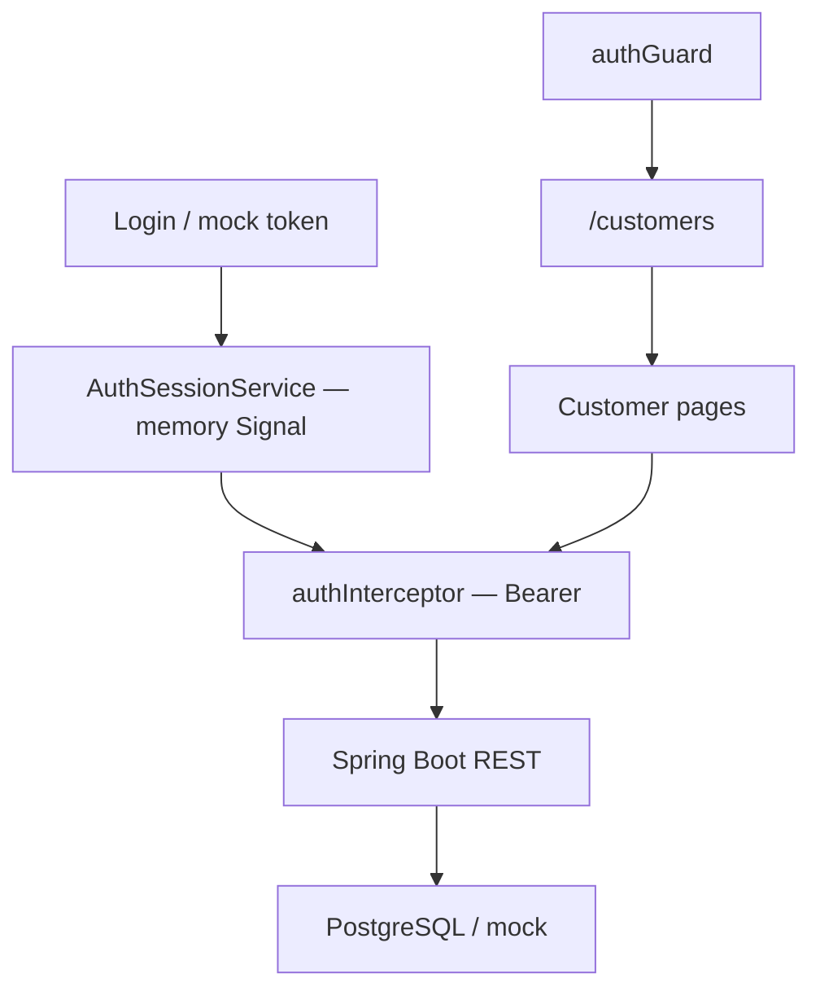

# Lab 36: Secure Frontend Communication — JWT Discipline and Protected Routes

> **Participants:** Module sequence is in [`../README.md`](../README.md). Open **one** OS how-to ([Windows](LAB-36-WINDOWS.md) · [macOS](LAB-36-MACOS.md)). Prefer the **45-minute timed path** with [`starter/`](starter/README.md); full Steps for homework. This repo has no answer keys — complete the TODOs yourself. See [Which file do I open?](../../../_PARTICIPANT-FILE-GUIDE.md).

## Activity card

| | |
| --- | --- |
| **Objective** | Secure Angular→REST calls with auth interceptor, token discipline, and route guards |
| **Skills practiced** | JWT patterns, HttpInterceptor, XSS/CSRF notes, CanActivate, secure headers awareness |
| **Expected outcome** | Protected `/customers` · Bearer via interceptor · notes reject localStorage JWT as best practice |
| **Estimated time** | Timed path ~45 min · Full path 3–4 hours |
| **Prerequisites** | Lab 35 preferred · Node 20 · Boot login/token stub or mock |
| **Expected files** | `examples/lab36-crm-ui/` — auth service, interceptor, guard, security notes |
| **Validation checkpoints** | Starter smoke · GUIDE Implementation Checkpoints |

**Module:** 36 — Secure Frontend Communication  
**Duration:** ~45 minutes (timed path) · Full path: 3–4 Hours  

**Primary IDE:** VS Code · **Optional IDE:** IntelliJ IDEA Community Edition

| OS | How-to |
| -- | ------ |
| Windows | [LAB-36-WINDOWS.md](LAB-36-WINDOWS.md) |
| macOS | [LAB-36-MACOS.md](LAB-36-MACOS.md) |

> **Critical scope:** Prefer **memory** access tokens and/or **httpOnly Secure cookies** — **do not** teach `localStorage` JWT as the enterprise default. Stack: Angular · Spring Boot REST · **PostgreSQL**. No React/SOAP/Oracle path.

## 45-minute timed path (use starter)

1. Open [`starter/README.md`](starter/README.md).
2. Copy course `starter/` to `lab36-crm-ui` and `crm-api/` to `lab36-crm-api`.
3. Implement memory token + interceptor + one guarded route.
4. Smoke: redirect when logged out; after mock login, list shows with `Authorization`.
5. Complete `docs/security-notes.md` Pass criteria.

| Path | Time | Scope |
| ---- | ---- | ----- |
| **Timed** | ~45 min | Memory token · interceptor · guard · notes |
| **Full** | see Duration | Cookie discussion, CSP notes, logout revoke |

---

## What you'll complete (practice only)

Labs and exercises are **practice only**. Nothing is submitted or graded. Do not take screenshots. Check Pass/Fail yourself — do not write those marks anywhere. Commit your work to your private `java-bootcamp` GitHub repo.

| # | Deliverable |
| - | ----------- |
| 1 | Auth interceptor attaching Bearer token |
| 2 | Memory (or httpOnly-oriented) session — **not** localStorage-as-best-practice |
| 3 | Route guard on customer routes |
| 4 | Mock/real login unlocking CUS-1001 / CUS-1002 list |
| 5 | `docs/security-notes.md` (XSS, CSRF, storage, headers) |
| 6 | Network screenshot with `Authorization` (redact token if sharing) |
| 7 | Redirect evidence when unauthenticated |
| 8 | No real secrets committed |

## Lab Overview

Harden Lab 35: session/auth service, credentials via **HTTP interceptor**, **route guard**, and XSS/CSRF notes. Token **storage discipline** is graded as seriously as a working UI.

## Learning Objectives

* Explain XSS risk of JWTs in `localStorage`  
* Hold access tokens in memory; describe httpOnly cookie patterns  
* Implement an auth interceptor  
* Guard Angular routes  
* Summarize CSRF for cookie vs header auth  
* List basic secure headers relevant to the CRM UI  

## Business Scenario

**Customer APIs are authenticated. Prefer memory + short TTL, and httpOnly cookies when Boot issues them. Guards keep anonymous users off `/customers`. Correlation `lab-request-001` still allowed. Seeds Amina/Ravi remain demo data behind PostgreSQL.**

| ID | Name | Notes |
| -- | ---- | ----- |
| `CUS-1001` | Amina Khan | Visible when authenticated |
| `CUS-1002` | Ravi Singh | Visible when authenticated |
| `lab-request-001` | — | correlation header |

---

## Architecture Context



## Prerequisites

* Lab 35 HttpClient integration (or mock API accepting Bearer)  
* Routing enabled (`provideRouter`)  

```bash
node -v
curl -s http://localhost:8080/api/customers/CUS-1001
# 401 after API security is on is expected progress
```

## Worked example

```typescript
import { HttpInterceptorFn } from '@angular/common/http';
import { inject } from '@angular/core';
import { AuthSessionService } from './auth-session.service';

export const authInterceptor: HttpInterceptorFn = (req, next) => {
  const token = inject(AuthSessionService).accessToken();
  if (!token) return next(req);
  return next(req.clone({ setHeaders: { Authorization: `Bearer ${token}` } }));
};
```

Token comes from a memory Signal — not `localStorage.getItem('jwt')`.

---

## Implementation Steps

### Step 1 — Branch Lab 35 + routing

Copy course `starter/` into `examples/lab36-crm-ui` and `crm-api/` into `examples/lab36-crm-api`, or copy your Lab 35 project and add routing.

```bash
cd ~/java-bootcamp/examples
# Prefer the course starter (already has TODOs):
#   copy <course>/module-36/lab36/starter → lab36-crm-ui
#   copy <course>/module-36/lab36/crm-api → lab36-crm-api
cp -R lab35-crm-ui lab36-crm-ui   # only if you are extending Lab 35 yourself
cd lab36-crm-ui
```

Add `provideRouter` with `/login` and `/customers`. Put list under the protected path. Add `<router-outlet />`.

**Expected result:** Routes resolve (guard comes next).  
**If it fails:** Blank outlet → missing `router-outlet`.

### Step 2 — `AuthSessionService` (memory-first)

Signals: `accessToken`. `loginMock()` sets a demo token (or calls Boot `/api/auth/login`). `logout()` clears it. **Do not** persist access token to `localStorage` on the graded path.

Document: if Boot uses httpOnly cookies, Angular may use `withCredentials` + CSRF instead of Bearer — preferred when available.

**Expected result:** Token only in memory; refresh clears it.  
**If it fails:** “Fix” via localStorage → fails Pass; use memory + re-login.

### Step 3 — Auth interceptor

Register `authInterceptor` with `provideHttpClient(withInterceptors([...]))`. Keep `CustomerApiService` unchanged.

**Expected result:** After login, Network shows `Authorization: Bearer …`.  
**If it fails:** Not registered, or token still null.

### Step 4 — `authGuard`

`CanActivateFn`: allow when `accessToken()` set; else redirect `/login`.

**Expected result:** Cold `/customers` → login; after login, Amina/Ravi list.  
**If it fails:** Infinite redirect → guard on login too. Always true → call Signal with `()`.

### Step 5 — Security notes (graded)

Write `docs/security-notes.md`:

1. **XSS** — JS-readable storage loses JWTs; avoid careless `innerHTML`.  
2. **CSRF** — cookie auth needs CSRF defenses; Bearer-from-memory is less CSRF-prone but still needs XSS defenses.  
3. **Recommended** — short-lived memory token **or** httpOnly Secure SameSite cookies + Boot CSRF strategy.  
4. **Headers** — CSP, `X-Content-Type-Options`, HTTPS in deploy (GitHub Actions later).  
5. Never commit real tokens.

**Expected result:** Notes explicitly reject localStorage JWT as recommended default.  
**If it fails:** “Just use JWT” with no storage discussion → incomplete.

### Step 6 — Evidence

Capture redirect-without-token; authorized Network (redact token); logout → guard again. Optional: 401 interceptor clears session → login.

```bash
npx ng serve --open && npx ng build
```

---

## Implementation Checkpoints

### Checkpoint A — Tooling

| # | Confirm | Notes |
| - | ------- | ----- |
| 1 | `lab36-crm-ui` with routing | Pass / Fail |
| 2 | Login + customers routes | Pass / Fail |

### Checkpoint B — Auth wiring

| # | Confirm | Notes |
| - | ------- | ----- |
| 1 | Memory session (no graded localStorage JWT) | Pass / Fail |
| 2 | Interceptor adds Authorization | Pass / Fail |
| 3 | Guard protects `/customers` | Pass / Fail |

### Checkpoint C — Literacy + hygiene

| # | Confirm | Notes |
| - | ------- | ----- |
| 1 | `docs/security-notes.md` XSS/CSRF/storage | Pass / Fail |
| 2 | Prefers memory / httpOnly over localStorage | Pass / Fail |

---

## Reference Commands

```bash
cd ~/java-bootcamp/examples/lab36-crm-api
mvn -B spring-boot:run
cd ~/java-bootcamp/examples/lab36-crm-ui
npx ng serve --open
# /customers → login → list CUS-1001 / CUS-1002
npx ng build
```

## Failure Experiments

| # | Experiment | Observe | Restore |
| - | ---------- | ------- | ------- |
| 1 | Clear token mid-session | Nav blocked / 401 | Re-login |
| 2 | Try localStorage JWT | Document risk; remove | Memory only |
| 3 | Remove interceptor | API 401 | Restore |
| 4 | Guard only, API open | Still insecure | Boot must auth |

## Troubleshooting

| Symptom | Cause | Fix |
| ------- | ----- | --- |
| No Authorization header | Interceptor missing | `withInterceptors` |
| Always redirected | Token not set | Fix login |
| CORS + credentials | Cookie mode mismatch | Align `withCredentials` + Boot CORS |

## Security and Production Review

1. Does the **API** reject unauthenticated calls if the guard is bypassed?  
2. Logout story (clear memory + server revoke)?  
3. How does secret scanning help if a demo JWT is committed?

## Cleanup

```bash
# Ctrl+C ng serve; redact tokens in public screenshots
```

**Keep `lab36-crm-ui`** — later weeks reuse these patterns with PostgreSQL-backed users.

## Reflection Questions

1. Why is localStorage JWT common — and why does Northstar reject it as recommended?  
2. What does a route guard **not** replace on the server?  
3. When choose httpOnly cookies over Authorization headers?
