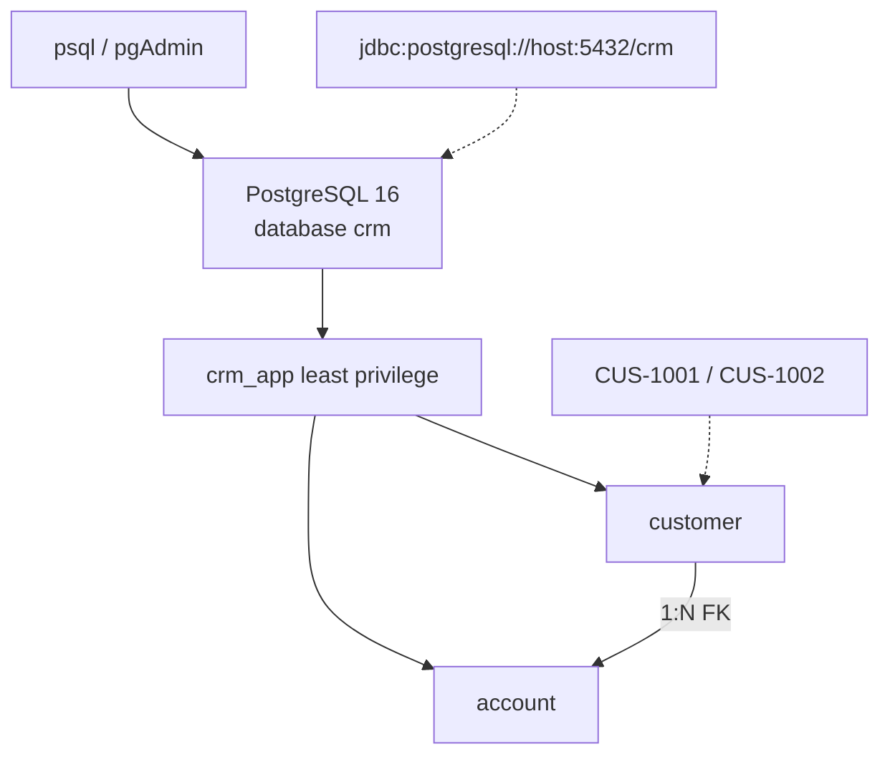

# Lab 37: PostgreSQL Database Fundamentals — Northstar CRM Schema

> **Participants:** Module sequence is in [`../README.md`](../README.md). Open **one** OS how-to ([Windows](LAB-37-WINDOWS.md) · [macOS](LAB-37-MACOS.md)). In class, prefer the **45-minute timed path** with [`starter/`](starter/README.md); the **full path** is every Step below. Skip `solution/` unless your instructor says otherwise. See [Which file do I open?](../../../_PARTICIPANT-FILE-GUIDE.md).

## Activity card

| | |
| --- | --- |
| **Objective** | Create CRM DB/schema/tables with PKs, FKs, constraints, indexes, seeds |
| **Skills practiced** | PostgreSQL DDL, roles, ACID basics, psql/pgAdmin, JDBC URL shape |
| **Expected outcome** | Named constraints · CUS-1001/CUS-1002 seeds · one negative check · notes |
| **Estimated time** | Timed path ~45 min · Full path 4–5 hours |
| **Prerequisites** | Lab 0 · Docker or shared Postgres · no secrets in Git |
| **Expected files** | `examples/lab37-crm/` — SQL scripts, compose, design notes |
| **Validation checkpoints** | Starter smoke · GUIDE Implementation Checkpoints |

**Module:** 37 — PostgreSQL Database Fundamentals  
**Duration:** ~45 minutes (timed path with starter) · Full path: 4–5 Hours

**Primary IDE:** IntelliJ IDEA Community Edition · **Optional IDE:** VS Code

| OS | How-to for this lab |
| -- | ------------------- |
| Windows | [LAB-37-WINDOWS.md](LAB-37-WINDOWS.md) |
| macOS | [LAB-37-MACOS.md](LAB-37-MACOS.md) |

> **Critical scope:** **PostgreSQL only** (not Oracle). Timed path: `customer` + `account`, `email` UNIQUE, `balance_cents BIGINT`, status `PROSPECT`/`ACTIVE`/`CLOSED`. Full path may add ADDRESS + HISTORY. Lab 39 maps these tables via JPA/Flyway.

---

## 45-minute timed path (use starter)

1. Open [`starter/README.md`](starter/README.md).
2. Copy `starter/` into `java-bootcamp/examples/lab37-crm`.
3. Fill every `-- TODO` in `database/*.sql`.
4. Smoke: compose up → apply scripts → seed SELECT → one negative check.
5. Commit your work to your GitHub repo (no screenshots).

| Path | Time | Scope |
| ---- | ---- | ----- |
| **Timed (default)** | ~45 min | Starter TODOs + smoke |
| **Full (extended)** | see Duration | Every Step below |

---

## What you'll complete (practice only)

Labs and exercises are **practice only**. Nothing is submitted or graded. Do not take screenshots. Check Pass/Fail yourself — do not write those marks anywhere. Commit your work to your private `java-bootcamp` GitHub repo.

| # | Deliverable |
| - | ----------- |
| 1 | ER notes with cardinalities (`database/er-diagram.md`) |
| 2 | PostgreSQL Docker (or shared) runtime |
| 3 | Least-privilege `crm_app` role script |
| 4 | DDL: CUSTOMER + ACCOUNT (+ indexes); full path: ADDRESS + HISTORY |
| 5 | Seed Amina `CUS-1001` ACTIVE + account; Ravi `CUS-1002` PROSPECT |
| 6 | Negative verify (duplicate email / bad status / orphan FK) |
| 7 | Drop/recreate proof + `design-decisions.md` |
| 8 | JDBC URL note for Java; no passwords in Git |

**Do not commit:** `target/`, secrets, `.env`, verbatim instructor `solution/`.

## Lab Overview

Design and implement the **PostgreSQL** CRM schema before ORM: databases vs schemas, tables, PKs/FKs, UNIQUE/NOT NULL/CHECK, indexes, roles/least privilege, ACID transactions, `psql`/pgAdmin, and the JDBC URL shape Spring Boot will use in Lab 39.

## Learning Objectives

After completing this lab, you will be able to:

* Create a PostgreSQL database/schema and CRM tables with named constraints
* Model one-to-many Customer→Account with FK indexes
* Seed deterministic fixtures (`CUS-1001`, `CUS-1002`) and prove negatives
* Connect with `psql`/pgAdmin and document a Java JDBC URL
* Apply least-privilege roles and state ACID properties for CRM writes

## Business Scenario

Angular (Labs 33–36) talks to Spring REST; Spring will persist to PostgreSQL. Leadership freezes:

**Tables and integrity rules before ORM. Wrong money types or missing FKs cannot be patched by UI alone.**

| ID | Name | Notes |
| -- | ---- | ----- |
| `CUS-1001` | Amina Khan | `ACTIVE` — seed + account |
| `CUS-1002` | Ravi Singh | `PROSPECT` — seed, no account |
| `CUS-1003` | Maya Chen | optional create sample |
| `lab-request-001` | — | correlation for history notes |
| `lab37-001`, … | — | design decision entries |

**Security:** fictional emails only (`amina.khan@example.com`). Passwords in `.env` only.

---

## Architecture Context
### NOW (this lab)



## Prerequisites

* Docker Desktop **or** instructor shared PostgreSQL. If you need Desktop, install it in [Lab 0 Step 11](../../../Week%201%20-%20Java%20and%20JVM%20Foundations/module-00/lab0/LAB-0-GUIDE.md) ([Windows](../../../Week%201%20-%20Java%20and%20JVM%20Foundations/module-00/lab0/LAB-0-WINDOWS.md#step-11--install-docker-desktop) · [macOS](../../../Week%201%20-%20Java%20and%20JVM%20Foundations/module-00/lab0/LAB-0-MACOS.md#step-11--install-docker-desktop)).
* `psql` client (or `docker exec … psql`) · optional pgAdmin
* Git; no secrets committed

### Pre-flight

```bash
docker --version
docker compose version
```

## Worked example (read before you code)

```sql
-- Named UNIQUE + CHECK (timed-path contract)
ALTER TABLE customer
  ADD CONSTRAINT uk_customer_public_id UNIQUE (public_id),
  ADD CONSTRAINT uk_customer_email UNIQUE (email),
  ADD CONSTRAINT ck_customer_status
    CHECK (status IN ('PROSPECT', 'ACTIVE', 'CLOSED'));

ALTER TABLE account
  ADD CONSTRAINT fk_account_customer
    FOREIGN KEY (customer_id) REFERENCES customer (customer_id),
  ADD CONSTRAINT uk_account_number UNIQUE (account_number);
```

**What to notice:** Surrogate `customer_id` (BIGSERIAL) for FKs; business `public_id` (`CUS-1001`) for APIs. Money as `balance_cents BIGINT` on the timed path.

---

## Implementation Steps

Commands assume `~/java-bootcamp/examples/lab37-crm` (Windows: `%USERPROFILE%\java-bootcamp\examples\lab37-crm`).

### Step 1 — Copy starter and start PostgreSQL

**Why:** Repeatable local DB with a persistent volume.

```bash
cd ~/java-bootcamp/examples
# copy from course lab37/starter → lab37-crm (see starter README)
cd lab37-crm
cp .env.example .env   # edit passwords locally; never commit .env
docker compose up -d
docker exec crm-postgres pg_isready -U crm -d crm
```

**Expected:** `accepting connections`. **If it fails:** port 5432 busy → stop other Postgres or change compose port.

### Step 2 — Least-privilege role

**Why:** App runtime must not be superuser.

Fill `database/01_create_user.sql`: `CREATE ROLE crm_app LOGIN …`; `GRANT CONNECT`; schema/table grants later after DDL. Apply as bootstrap user:

```bash
# macOS/Linux
docker exec -i crm-postgres psql -U crm -d crm -v ON_ERROR_STOP=1 < database/01_create_user.sql
```

**Expected:** `\du` shows `crm_app` without SUPERUSER. **If it fails:** role exists → drop/recreate only in lab DB.

### Step 3 — Schema DDL (PKs, FKs, constraints, indexes)

**Why:** Integrity lives in the database, not only in Java.

Complete `database/02_schema.sql`: UNIQUE on `public_id`/`email`/`account_number`; CHECK on status; FK `account.customer_id → customer`; indexes for email lookup and status filters.

**Expected:** `\d customer` / `\d account` show constraints. **If it fails:** apply order wrong → customer before account.

### Step 4 — Seed Amina and Ravi

Fill `database/03_seed.sql`: Amina ACTIVE + one account; Ravi PROSPECT; optional history row with `lab-request-001`.

```sql
SELECT public_id, full_name, status FROM customer ORDER BY public_id;
```

**Expected:** Two rows; Amina has an account. **If it fails:** FK violation → insert customer first.

### Step 5 — Negative checks + ACID note

Complete `04_verify.sql`: duplicate email, illegal status, orphan account FK. Each must fail with a clear PostgreSQL error (not silent success).

In `docs/postgres-notes.md`, state Atomicity / Consistency / Isolation / Durability for “create customer + account in one transaction.”

**Expected:** Three failing statements documented. **If it fails:** missing CHECK/UNIQUE → finish Step 3.

### Step 6 — JDBC URL + drop/recreate + evidence

Document:

`jdbc:postgresql://localhost:5432/crm`

Driver: `org.postgresql.postgresql`. User: `crm_app`. Complete `05_drop.sql` (dependency order: account → customer), recreate, re-seed. Capture commit to GitHub (no screenshots). Fill `design-decisions.md` / `er-diagram.md`.

**Expected:** Drop + recreate succeeds; seeds return. **If it fails:** drop order wrong → children first.

---

## Implementation Checkpoints

### Checkpoint A — Runtime · B — Schema · C — Proof

| # | Confirm | Notes |
| - | ------- | ----- |
| A1 | `lab37-crm` · Postgres up · `crm_app` not SUPERUSER | Pass / Fail |
| B1 | Named PK/UK/FK/CHECK + indexes; seeds CUS-1001/1002 | Pass / Fail |
| C1 | Negative proof · drop/recreate · JDBC URL · no secrets in Git | Pass / Fail |

---

## Reference Commands

```bash
cd ~/java-bootcamp/examples/lab37-crm
docker compose up -d
docker exec -i crm-postgres psql -U crm -d crm -v ON_ERROR_STOP=1 < database/01_create_user.sql
docker exec -i crm-postgres psql -U crm -d crm -v ON_ERROR_STOP=1 < database/02_schema.sql
# Seeds/verify as crm_app (DML only) after grants in 02_schema.sql
docker exec -i -e PGPASSWORD="$POSTGRES_APP_PASSWORD" crm-postgres \
  psql -U crm_app -d crm -v ON_ERROR_STOP=1 < database/03_seed.sql
# same pattern for 04_verify.sql
```

**Windows PowerShell:** pipe with `Get-Content .\database\01_create_user.sql -Raw | docker exec -i crm-postgres psql …` (no POSIX `<`). Apply **01** and **02** as `crm`; **03** and **04** as `crm_app`. Lab default app password is `change-me` from `.env.example`.

## Failure Experiments

| # | Experiment | Observe | Restore |
| - | ---------- | ------- | ------- |
| 1 | Insert account before customer | FK fails | Insert customer first |
| 2 | Duplicate `CUS-1001` public_id | UNIQUE fails | Keep UK |
| 3 | Status `SUSPENDED` | CHECK fails | Use allowed values |
| 4 | Re-run CREATE without drop | already exists | Run `05_drop.sql` |

## Troubleshooting

| Symptom | Likely cause | Fix |
| ------- | ------------ | --- |
| Connection refused | Compose not up / wrong port | `docker compose ps` |
| Permission denied for table | Grants missing | GRANT after DDL |
| FK on seed | Wrong insert order | Customer → account |
| Secrets in `git status` | `.env` tracked | Use `.gitignore`; rotate password |

## Cleanup

```bash
cd ~/java-bootcamp/examples/lab37-crm
# optional: docker compose down   # keep volume unless resetting
git status
```

**Keep `lab37-crm`** — Lab 38 tunes SQL on this schema; Lab 39 maps it with JPA.

## Reflection Questions

1. Why separate `customer_id` (surrogate) from `public_id` (API id)?
2. Which constraint failure best proves integrity for Account→Customer?
3. What belongs in `.env` vs Git for JDBC connectivity?
