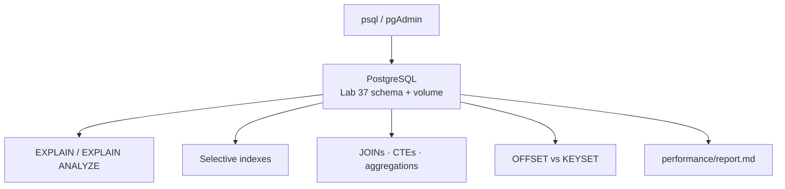

# Lab 38: SQL and Query Performance with PostgreSQL — Northstar CRM Tuning

> **Participants:** Module sequence is in [`../README.md`](../README.md). Open **one** OS how-to ([Windows](LAB-38-WINDOWS.md) · [macOS](LAB-38-MACOS.md)). Prefer the **45-minute timed path** with [`starter/`](starter/README.md). See [Which file do I open?](../../../_PARTICIPANT-FILE-GUIDE.md).

## Activity card

| | |
| --- | --- |
| **Objective** | Tune CRM SQL with joins, CTEs, aggregations, EXPLAIN, indexes, pagination |
| **Skills practiced** | EXPLAIN ANALYZE, selectivity, SELECT *, N+1 awareness, OFFSET vs keyset |
| **Expected outcome** | Baseline + after-index plans · keyset demo · `report.md` |
| **Estimated time** | Timed path ~45 min · Full path 4–5 hours |
| **Prerequisites** | Lab 37 schema · PostgreSQL · preserve CUS-1001/CUS-1002 |
| **Expected files** | `examples/lab38-crm/` — performance SQL + report |
| **Validation checkpoints** | Starter smoke · GUIDE Implementation Checkpoints |

**Module:** 38 — SQL and Query Performance with PostgreSQL  
**Duration:** ~45 minutes (timed path with starter) · Full path: 4–5 Hours

**Primary IDE:** IntelliJ IDEA Community Edition · **Optional IDE:** VS Code

| OS | How-to for this lab |
| -- | ------------------- |
| Windows | [LAB-38-WINDOWS.md](LAB-38-WINDOWS.md) |
| macOS | [LAB-38-MACOS.md](LAB-38-MACOS.md) |

> **Critical scope:** **PostgreSQL** `EXPLAIN` / `EXPLAIN (ANALYZE, BUFFERS)` — not Oracle `DBMS_XPLAN`. Preserve Lab 37 fixtures. Every retained index needs measured evidence.

---

## 45-minute timed path (use starter)

1. Open [`starter/README.md`](starter/README.md); copy to `examples/lab38-crm`.
2. Ensure Lab 37 DDL available under `database/ddl/`.
3. Complete generate → baseline EXPLAIN → indexes → optimized queries.
4. Fill `database/performance/report.md` with experiment ids `lab38-001+`.
5. Commit your work to your GitHub repo (no screenshots).

| Path | Time | Scope |
| ---- | ---- | ----- |
| **Timed (default)** | ~45 min | Baseline + indexes + keyset note + report |
| **Full (extended)** | see Duration | Joins, CTEs, aggregations, challenge cycle |

---

## What you'll complete (practice only)

Labs and exercises are **practice only**. Nothing is submitted or graded. Do not take screenshots. Check Pass/Fail yourself — do not write those marks anywhere. Commit your work to your private `java-bootcamp` GitHub repo.

| # | Deliverable |
| - | ----------- |
| 1 | `database/performance/01`–`05` SQL scripts |
| 2 | Volume load with documented skew; fixtures preserved |
| 3 | Baseline and after-index `EXPLAIN (ANALYZE, BUFFERS)` evidence |
| 4 | Join + CTE + aggregation examples |
| 5 | Sargable predicate rewrite (no function on indexed column) |
| 6 | OFFSET vs keyset pagination demos |
| 7 | N+1 awareness note (app loop vs JOIN/CTE) |
| 8 | `report.md` with plan shape, buffers, timing |

**Do not commit:** secrets, full 50k-row dumps, copied answer keys.

## Lab Overview

Evidence-based **PostgreSQL** tuning for Northstar CRM: generate volume, capture actual plans, create selective indexes, rewrite non-sargable predicates, compare joins/CTEs/aggregations, avoid `SELECT *`, contrast OFFSET vs keyset paging, and document results another engineer can reproduce.

## Learning Objectives

After completing this lab, you will be able to:

* Read PostgreSQL `EXPLAIN` / `EXPLAIN ANALYZE` plans (seq vs index scans, joins)
* Build joins, CTEs, and aggregations for CRM list/report queries
* Choose indexes by selectivity and prove them with before/after plans
* Avoid `SELECT *` and recognize N+1 query patterns
* Implement keyset pagination as an alternative to deep `OFFSET`

## Business Scenario

Before Spring Data JPA (Lab 39), leadership freezes:

**No “performance” DDL without actual plans and a report that names the CRM query measured.**

| ID | Name | Notes |
| -- | ---- | ----- |
| `CUS-1001` | Amina Khan | Selective `public_id` / join smoke |
| `CUS-1002` | Ravi Singh | Status filter contrast |
| `lab-request-001` | — | Support symptom correlation |
| `lab38-001`, … | — | Report experiment IDs |

**Security:** fictional emails; paste plan excerpts only — not production dumps.

---

## Architecture Context
### NOW (this lab)



## Prerequisites

Prior lab: [Lab 37](../../module-37/lab37/LAB-37-GUIDE.md). PostgreSQL up; Lab 37 tables present.

### Pre-flight

```bash
docker exec crm-postgres pg_isready -U crm -d crm
```

## Worked example (read before you code)

```sql
EXPLAIN (ANALYZE, BUFFERS)
SELECT c.public_id, c.full_name, a.account_number
FROM customer c
JOIN account a ON a.customer_id = c.customer_id
WHERE c.email = 'amina.khan@example.com';

-- Keyset page (stable) vs deep OFFSET
SELECT * FROM customer
WHERE (created_at, customer_id) > (:last_created, :last_id)
ORDER BY created_at, customer_id
LIMIT 50;
```

**What to notice:** Capture a **baseline** plan before `CREATE INDEX`. Prefer range predicates over `WHERE date_trunc('day', created_at) = …` on an indexed column.

---

## Implementation Steps

Project: `~/java-bootcamp/examples/lab38-crm`.

### Step 1 — Copy starter; confirm Lab 37 DDL

Copy starter → `lab38-crm`. Ensure `database/ddl/02_schema.sql` matches Lab 37 timed-path tables. Re-seed fixtures if needed.

**Expected:** `\dt` shows `customer` / `account`; `CUS-1001`/`CUS-1002` present.

### Step 2 — Generate volume (`01_generate_data.sql`)

Insert synthetic customers (≥ tens of thousands preferred) with ~70/30 ACTIVE/PROSPECT skew. **Preserve** `CUS-1001` / `CUS-1002`. Run `ANALYZE customer; ANALYZE account;`.

**Expected:** `SELECT count(*) FROM customer` reflects load; fixtures still queryable. **If it fails:** unique collisions → use generated emails/`public_id`s.

### Step 3 — Baseline plans (`02_baseline.sql`)

For email lookup, status list, and customer→account join, run:

```sql
EXPLAIN (ANALYZE, BUFFERS) …;
```

Paste into `report.md` as **lab38-001** baseline (scan type, rows, buffers, time).

**Expected:** Often Seq Scan on unindexed filters at volume. **If it fails:** empty plan → wrong schema/search_path.

### Step 4 — Indexes + re-measure (`03_indexes.sql`)

Add selective indexes (email UNIQUE already helps; status + created_at composite if list queries need it; FK index on `account.customer_id`). Re-run the same EXPLAIN statements.

**Expected:** Index Scan / Index Only Scan or Bitmap where selective. **If it fails:** still Seq Scan → check sargability and `ANALYZE`.

### Step 5 — Joins, CTEs, aggregations (`04_optimized.sql`)

Write: INNER JOIN customer/account; LEFT JOIN for customers without accounts; a CTE for status counts; `GROUP BY status` with `HAVING count(*) > …`. Note when `SELECT *` wastes I/O vs projecting needed columns.

**Expected:** Scripts run; report names join strategy observed (Nested Loop / Hash / Merge).

### Step 6 — Pagination + N+1 awareness + cleanup

Implement deterministic `ORDER BY` + `OFFSET`/`LIMIT` and a **keyset** alternative. In `docs/performance-concepts.md`, explain why looping `SELECT account WHERE customer_id=?` per row is N+1 vs one JOIN. Optional `05_cleanup_indexes.sql` drops experimental indexes you reject; keep justified ones. Finish `report.md`.

**Expected:** Keyset script present; OFFSET deep-page cost called out. **If it fails:** unstable pages → add tie-breaker columns to ORDER BY.

---

## Implementation Checkpoints

### Checkpoint A — Data

| # | Confirm | Notes |
| - | ------- | ----- |
| 1 | `lab38-crm` under `examples/` | Pass / Fail |
| 2 | Volume loaded; fixtures preserved | Pass / Fail |
| 3 | `ANALYZE` run | Pass / Fail |

### Checkpoint B — Evidence

| # | Confirm | Notes |
| - | ------- | ----- |
| 1 | Baseline EXPLAIN before indexes | Pass / Fail |
| 2 | After-index re-measure | Pass / Fail |
| 3 | JOIN + CTE + aggregation samples | Pass / Fail |

### Checkpoint C — Hygiene

| # | Confirm | Notes |
| - | ------- | ----- |
| 1 | Keyset vs OFFSET documented | Pass / Fail |
| 2 | `report.md` has lab38-001+ | Pass / Fail |
| 3 | No secrets / huge dumps committed | Pass / Fail |

---

## Reference Commands

```bash
cd ~/java-bootcamp/examples/lab38-crm
docker exec -i crm-postgres psql -U crm -d crm -v ON_ERROR_STOP=1 \
  < database/performance/01_generate_data.sql
# then 02_baseline.sql → 03_indexes.sql → 04_optimized.sql
```

## Failure Experiments

| # | Experiment | Observe | Restore |
| - | ---------- | ------- | ------- |
| 1 | `WHERE lower(email) = …` on plain index | May Seq Scan | Functional index or store normalized email |
| 2 | Deep `OFFSET 50000` | High cost | Prefer keyset |
| 3 | Index on low-selectivity boolean-like column | Little gain | Drop; keep selective indexes |
| 4 | `SELECT *` wide rows | Extra I/O | Project needed columns |

## Troubleshooting

| Symptom | Likely cause | Fix |
| ------- | ------------ | --- |
| Index ignored | Non-sargable predicate / stale stats | Rewrite; `ANALYZE` |
| Fixtures gone after load | Generator overwrote | Re-seed CUS-1001/1002 |
| Tiny-table plans only | No volume | Run generate script |
| Oracle plan tools | Wrong stack | Use PostgreSQL EXPLAIN |

## Cleanup

```bash
cd ~/java-bootcamp/examples/lab38-crm
# Keep justified indexes for Lab 39; drop experiments via 05 if needed
git status
```

**Keep `lab38-crm` notes** — Lab 39 should not invent indexes without this evidence habit.

## Reflection Questions

1. Which plan change most improved the email lookup?
2. When is keyset pagination preferable to OFFSET?
3. How would an ORM N+1 show up in PostgreSQL logs?
