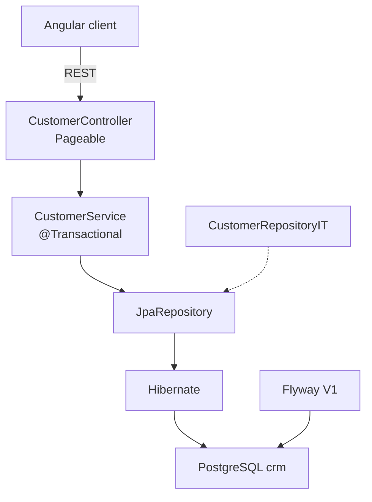

# Lab 39: Spring Data JPA and PostgreSQL Integration — Northstar CRM Persistence

> **Participants:** Module sequence is in [`../README.md`](../README.md). Open **one** OS how-to ([Windows](LAB-39-WINDOWS.md) · [macOS](LAB-39-MACOS.md)). Prefer the **45-minute timed path** with [`starter/`](starter/README.md). See [Which file do I open?](../../../_PARTICIPANT-FILE-GUIDE.md).

## Activity card

| | |
| --- | --- |
| **Objective** | Wire Spring Data JPA to PostgreSQL with entities, repos, paging, migrations |
| **Skills practiced** | Driver + yml, JpaRepository, derived queries, lazy/eager, Pageable, Flyway |
| **Expected outcome** | Flyway V1 · entities · paging API · Postgres IT green |
| **Estimated time** | Timed path ~45 min · Full path 4–5 hours |
| **Prerequisites** | Labs 37–38 concepts · JDK 21 · Maven · PostgreSQL |
| **Expected files** | `examples/lab39-crm/` — Boot app, Flyway, IT |
| **Validation checkpoints** | Starter smoke · GUIDE Implementation Checkpoints |

**Module:** 39 — Spring Data JPA and PostgreSQL Integration  
**Duration:** ~45 minutes (timed path with starter) · Full path: 4–5 Hours

**Primary IDE:** IntelliJ IDEA Community Edition · **Optional IDE:** VS Code

| OS | How-to for this lab |
| -- | ------------------- |
| Windows | [LAB-39-WINDOWS.md](LAB-39-WINDOWS.md) |
| macOS | [LAB-39-MACOS.md](LAB-39-MACOS.md) |

> **Critical scope:** PostgreSQL driver + `ddl-auto=validate` + Flyway (or Liquibase concept). Timed path: tables `customer`/`account`, column `email`, `balance_cents`, `@Version`, status strings. **No** H2 pretending to be Postgres for the graded IT.

---

## 45-minute timed path (use starter)

1. Open [`starter/README.md`](starter/README.md); copy to `examples/lab39-crm`.
2. `.env.example` → `.env`; `docker compose up -d`.
3. Complete Flyway V1 TODOs, entities, repository/service TODOs.
4. `mvn -B test` — IT against real PostgreSQL.
5. Commit your work to your GitHub repo (no screenshots).

| Path | Time | Scope |
| ---- | ---- | ----- |
| **Timed (default)** | ~45 min | Flyway + entities + repo IT |
| **Full (extended)** | see Duration | 409 mapping, sort allow-list, relationship fetch notes |

---

## What you'll complete (practice only)

Labs and exercises are **practice only**. Nothing is submitted or graded. Do not take screenshots. Check Pass/Fail yourself — do not write those marks anywhere. Commit your work to your private `java-bootcamp` GitHub repo.

| # | Deliverable |
| - | ----------- |
| 1 | Boot app with PostgreSQL driver + datasource yml/properties |
| 2 | Flyway `V1__crm_schema.sql` (migration-owned schema) |
| 3 | `CustomerEntity` / `AccountEntity` + relationship mapping |
| 4 | `JpaRepository` + derived queries + `Pageable` API |
| 5 | Lazy vs eager notes; open-in-view off |
| 6 | `CustomerRepositoryIT` green on PostgreSQL |
| 7 | Flyway/Liquibase concept note in `docs/jpa-postgres-notes.md` |
| 8 | No secrets / `ddl-auto=update` in Git |

**Do not commit:** `.env`, `target/`, copied answer keys.

## Lab Overview

Connect the CRM API to **PostgreSQL** with **Spring Data JPA**: driver dependency, datasource config, entities, repositories, derived queries, relationships and fetch strategies, `Pageable`, Flyway migrations (Liquibase as conceptual alternative), and a real Postgres test database.

## Learning Objectives

After completing this lab, you will be able to:

* Add the PostgreSQL driver and configure `application.yml` for JDBC
* Map entities and `@OneToMany` / `@ManyToOne` with intentional fetch types
* Use `JpaRepository` and derived query methods
* Page results with `Pageable` and keep `open-in-view: false`
* Own schema with Flyway (`validate`) and test against PostgreSQL

## Business Scenario

Leadership freezes:

**No `ddl-auto=update/create` in shared environments. No passwords in Git. No raw SQLException text to Angular clients.**

| ID | Name | Notes |
| -- | ---- | ----- |
| `CUS-1001` | Amina Khan | `ACTIVE` — find / accounts |
| `CUS-1002` | Ravi Singh | `PROSPECT` → `ACTIVE` |
| `CUS-9999` | — | not-found |
| `lab-request-001` | — | correlation on errors |
| `lab39-001`, … | — | IT scenario ids |

---

## Architecture Context
### NOW (this lab)



## Prerequisites

Prior labs: [37](../../module-37/lab37/LAB-37-GUIDE.md) · [38](../../module-38/lab38/LAB-38-GUIDE.md). JDK 21; Maven 3.9+; Docker Postgres.

### Pre-flight

```bash
java -version
mvn -version
docker exec crm-postgres pg_isready -U crm -d crm
```

## Worked example (read before you code)

```yaml
spring:
  datasource:
    url: jdbc:postgresql://localhost:5432/crm
    username: ${SPRING_DATASOURCE_USERNAME}
    password: ${SPRING_DATASOURCE_PASSWORD}
  jpa:
    hibernate:
      ddl-auto: validate
    open-in-view: false
  flyway:
    enabled: true
```

```java
public interface CustomerRepository extends JpaRepository<CustomerEntity, Long> {
  Optional<CustomerEntity> findByPublicId(String publicId);
  Page<CustomerEntity> findByStatus(String status, Pageable pageable);
  boolean existsByEmailIgnoreCase(String email);
}
```

**What to notice:** Schema comes from Flyway; JPA only validates. Prefer LAZY collections; fetch inside a transaction.

---

## Implementation Steps

Project: `~/java-bootcamp/examples/lab39-crm`.

### Step 1 — Copy starter, env, compose

```bash
# copy starter → lab39-crm
cp .env.example .env
docker compose up -d
```

Confirm `pom.xml` has `spring-boot-starter-data-jpa`, `postgresql`, `flyway-core`, `flyway-database-postgresql`.

**Expected:** Dependencies resolve. **If it fails:** wrong parent BOM → use Boot 3.3.x / course pom.

### Step 2 — Datasource + Flyway V1

Complete `application.yml` URL shape `jdbc:postgresql://host:5432/crm`. Finish `V1__crm_schema.sql` TODOs (indexes aligned with Lab 38 if justified). Prefer isolated DB `crm` / schema for lab39 — do not fight Lab 37 manual DDL; Flyway owns this app DB.

**Expected:** App start applies V1; `flyway_schema_history` has success. **If it fails:** checksum mismatch → never edit applied V1; add V2.

### Step 3 — Entities and relationships

Complete `CustomerEntity` / `AccountEntity`: `@Entity`, `@Table`, `@Id` IDENTITY, `@Column`, `@Version`. Map Customer 1—N Account (`@OneToMany` LAZY / `@ManyToOne`). Money: `balance_cents` → `Long`.

**Expected:** Context starts with `ddl-auto=validate`. **If it fails:** column name mismatch → align with Flyway.

### Step 4 — Repositories, derived queries, service

Implement `CustomerRepository` / `AccountRepository` extending `JpaRepository`. Derived methods: `findByPublicId`, `findByStatus(…, Pageable)`, `existsByEmail…`. Service is `@Transactional`; controller stays thin (Lab 25 layering).

**Expected:** Create/find by `CUS-1001` path works in smoke. **If it fails:** package scan → stay under `com.northstar.crm`.

### Step 5 — Pageable + lazy/eager discipline

Expose paged list with bounded `size` (reject huge pages). Keep `spring.jpa.open-in-view=false`. In notes: when EAGER hurts; how N+1 appears; join-fetch or entity graph for intentional loads.

```bash
curl -s "http://localhost:8080/api/customers?page=0&size=10&status=ACTIVE"
```

**Expected:** Page JSON; no LazyInitializationException on happy path.

### Step 6 — Test DB IT + Flyway/Liquibase note + evidence

Complete `CustomerRepositoryIT` against PostgreSQL (Testcontainers or compose URL — **not** H2). Document Flyway vs Liquibase as migration options (concept). Optional full path: map unique/optimistic conflicts to HTTP 409. Run `mvn -B test` twice. Fill `docs/jpa-postgres-notes.md`.

**Expected:** IT green; notes mention migration ownership. **If it fails:** IT hits H2 → force Postgres URL.

---

## Implementation Checkpoints

### Checkpoint A — Wiring

| # | Confirm | Notes |
| - | ------- | ----- |
| 1 | `lab39-crm` under `examples/` | Pass / Fail |
| 2 | Driver + yml + Flyway V1 | Pass / Fail |
| 3 | `ddl-auto=validate` | Pass / Fail |

### Checkpoint B — Persistence

| # | Confirm | Notes |
| - | ------- | ----- |
| 1 | Entities + relationship mapping | Pass / Fail |
| 2 | Derived queries + Pageable | Pass / Fail |
| 3 | Lazy/open-in-view notes | Pass / Fail |

### Checkpoint C — Proof

| # | Confirm | Notes |
| - | ------- | ----- |
| 1 | `CustomerRepositoryIT` on PostgreSQL | Pass / Fail |
| 2 | Dual green `mvn test` | Pass / Fail |
| 3 | No secrets committed | Pass / Fail |

---

## Reference Commands / Config

```bash
cd ~/java-bootcamp/examples/lab39-crm
docker compose up -d
mvn -B test
mvn -B spring-boot:run
curl -s -H "X-Correlation-Id: lab-request-001" \
  http://localhost:8080/api/customers/CUS-1001
```

```xml
<dependency>
  <groupId>org.postgresql</groupId>
  <artifactId>postgresql</artifactId>
  <scope>runtime</scope>
</dependency>
```

## Failure Experiments

| # | Experiment | Observe | Restore |
| - | ---------- | ------- | ------- |
| 1 | `ddl-auto=update` | Schema drift risk | Back to `validate` + Flyway |
| 2 | Access LAZY collection outside TX | LazyInitializationException | Fetch in service TX |
| 3 | Duplicate email | Constraint / 409 path | Keep unique + mapping |
| 4 | IT on H2 only | False green | Force PostgreSQL |

## Troubleshooting

| Symptom | Likely cause | Fix |
| ------- | ------------ | --- |
| Relation does not exist | Flyway not run | Check migrations + URL/DB |
| Validation failed | Entity ≠ DDL | Align names/types |
| LazyInitializationException | Open-in-view false + bad fetch | Join fetch / DTO in TX |
| Password in Git | `.env` tracked | gitignore; rotate |

## Cleanup

```bash
cd ~/java-bootcamp/examples/lab39-crm
# Ctrl+C spring-boot:run
mvn -q clean
git status
```

**Keep `lab39-crm`** — Lab 40 AppSec and later modules build on this verify-green baseline.

## Reflection Questions

1. Why is Flyway (or Liquibase) preferred over `ddl-auto=update`?
2. What evidence proves repositories talk to PostgreSQL, not H2?
3. How do lazy collections interact with `open-in-view: false`?
