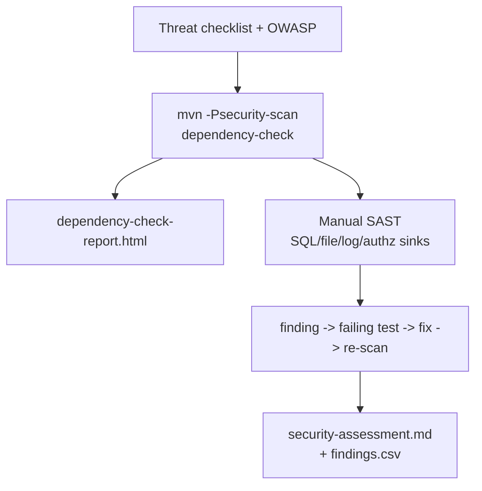

# Lab 40: Application Security Testing for the CRM — Dependency-Check, SAST, Remediation

**Module:** 40 — Application Security Testing for the CRM  
**Duration:** ~45 minutes (timed path with starter) · Full path: 3–4 Hours

**Primary IDE:** IntelliJ IDEA Community Edition · **Optional IDE:** VS Code

| OS | How-to for this lab |
| -- | ------------------- |
| Windows | [LAB-40-WINDOWS.md](LAB-40-WINDOWS.md) |
| macOS | [LAB-40-MACOS.md](LAB-40-MACOS.md) |

---

## Activity card

| | |
| --- | --- |
| **Time** | ~45 min timed · full path 3–4 h |
| **Checkpoint** | **E** (after Ex 1→4→2→3→5→6) |
| **Must prove** | `-Psecurity-scan` · triage CSV row · assessment residual risk |
| **Hard gate** | Pre-lab Pass · Lab 39 verify green · no secrets in Git |

### What you will learn

Run a CRM AppSec gate: Dependency-Check, triage, focused SAST, remediate, re-scan.

### Enterprise context

Scanners alone are not a release decision — every finding needs fix, timed accept, or evidenced FP.

### Predict

Suppressing a Critical CVE with no owner/expiry — does the gate pass?

### Debug

Scan fails only because of high CVSS — delete profile or triage?

---

## 45-minute timed path (use starter)

> **Pacing reminder:** [PACING.md](../PACING.md) checkpoint **E**. Homework: remediation + regression + before/after scan evidence.

In class, use the starter templates so the **core** objectives fit **~45 minutes**. The full Steps below remain for homework / extended depth.

1. Open [`starter/README.md`](starter/README.md).
2. Copy `starter/` into your `java-bootcamp/examples/…` target (see starter README).
3. Fill every `// TODO` / `TODO` — do **not** wait on a perfect prior lab; the starter includes a baseline.
4. Run the starter smoke test. Commit your work to your GitHub repo (no screenshots).
5. Check timed-path Pass criteria in the starter README yourself (do not write the marks down). Continue remaining GUIDE steps as homework if needed.

| Path | Time | Scope |
| ---- | ---- | ----- |
| **Timed (default)** | ~45 min | Starter TODOs + smoke test |
| **Full (extended)** | see Duration | Every Step in this GUIDE |

---

## What you'll complete (practice only)

Labs and exercises are **practice only**. Nothing is submitted or graded. Do not take screenshots. Check Pass/Fail yourself — do not write those marks anywhere. Commit your work to your private `java-bootcamp` GitHub repo.

Keep this checklist visible while you work.

| # | Deliverable |
| - | ----------- |
| 1 | Threat checklist + OWASP mapping notes |
| 2 | Dependency-Check profile, reports (sanitized), triage CSV |
| 3 | Focused SAST notes with code locations |
| 4 | Security regression test + remediation evidence |
| 5 | Before/after scan comparison for the fixed finding |
| 6 | `docs/security-assessment.md` with residual risks owned |
| 7 | Baseline and final `verify` results |
| 8 | No secrets or real customer records |

**Commit to your GitHub repo:** the items in the table above (sources + evidence + short notes).

**Do not commit:** `target/`, `node_modules/`, secrets, heap dumps, or a copied answer keys.

## Lab Overview

This Module 40 lab turns the CRM into a **defensible security gate**: map OWASP-relevant attack surfaces, run **OWASP Dependency-Check**, triage CVEs, perform focused **manual SAST**, reproduce one confirmed issue, remediate with the smallest safe fix, re-scan and regression-test, and publish `docs/security-assessment.md`.

## Learning Objectives

After completing this lab, you will be able to:

* Map CRM attack surfaces to OWASP-aligned risks
* Run OWASP Dependency-Check via Maven with HTML/JSON output
* Interpret CVE, CVSS, CPE, and transitive dependency paths
* Perform focused manual SAST on injection, authz, and secrets
* Triage false positives and accepted risks with owners and expiry

## Business Scenario

A release candidate handles customer identifiers, contact details, agent roles, PostgreSQL queries, and (later) Kafka events. Leadership freezes:

**No “ship it” based on raw scanner volume. No merge that commits secrets, disables the scan gate without approval, or leaves a confirmed High without owner and due date.**

You own that gate for the CRM backend that serves Amina (`CUS-1001`), Ravi (`CUS-1002`), and agent role boundaries.

Use these examples consistently:

| ID | Name | Notes |
| -- | ---- | ----- |
| `CUS-1001` | Amina Khan | `ACTIVE` — object-level authz fixture |
| `CUS-1002` | Ravi Singh | `PROSPECT` — cross-agent access attempts |
| `CUS-9999` | — | not-found vs unauthorized distinctions |
| `lab-request-001` | — | correlation on security-relevant errors |
| `lab40-001`, … | — | finding IDs in CSV / assessment |

**Security note for evidence.** Use fictional emails (`amina.khan@example.test`). Sanitize scanner output before commit. Never commit NVD API keys, `.env`, tokens, or customer exports.

---

## Architecture Context
### NOW (this lab)



## Prerequisites

Prior labs: [Lab 39](../../../Week%204%20-%20Kafka,%20Angular,%20Oracle%20and%20Resilience/module-39/lab39/LAB-39-GUIDE.md).

Confirm (Lab 0 tools assumed):

* CRM backend builds with Java 21 + Maven Wrapper
* OWASP Dependency-Check via Maven plugin (version pinned)
* Authorized synthetic test data only; local or training env only
* No secrets committed to Git

### Pre-flight

```bash
java -version
mvn -version
```

## Worked example (read before you code)

Study this pattern once before Step 1. Your job is to apply the same idea in the Steps — do not skip ahead to a full solution.

```java
import static org.springframework.test.web.servlet.request.MockMvcRequestBuilders.get;
import static org.springframework.test.web.servlet.result.MockMvcResultMatchers.status;
import org.junit.jupiter.api.Test;
import org.springframework.security.test.context.support.WithMockUser;

@Test
@WithMockUser(username = "agent-a", roles = "AGENT")
void agentCannotReadAnotherAgentsCustomer() throws Exception {
  mvc.perform(get("/api/customers/{id}", otherAgentsCustomerId)
          .header("X-Correlation-Id", "lab-request-001"))
     .andExpect(status().isForbidden()); // or policy-accurate status
}
```

**What to notice:** Match names, IDs, and failure behavior from the scenario — instructors check these.

---

## Implementation Steps

Complete each step in order. Commands assume `~/java-bootcamp/examples/lab40-crm` (Windows: `%USERPROFILE%\java-bootcamp\examples\lab40-crm`) unless noted.

---

### Step 1 — Establish scope and threat checklist

**Why:** Scanners without a scope produce noise; security work needs stated targets and severity fields first.

**Do this:**

```bash
cd ~/java-bootcamp/examples/lab40-crm
```

In `docs/threat-checklist.md`, record components (API, PostgreSQL, config), data classes (customer PII fields), users (agent/admin), trust boundaries, and authorized scan targets (this repo/module only). Map at least: broken access control, injection, auth failures, security misconfig, logging failures to concrete endpoints.

Define CSV columns before scanning: `finding_id,source,package_or_location,cve_or_rule,cvss,classification,owner,due_date,notes`.

**Expected result:** Checklist and empty `security-findings.csv` header committed; scope excludes attacking third-party systems.

**If it fails:** Over-broad “scan the internet” scope → rewrite to training CRM only.

---

### Step 2 — Add OWASP Dependency-Check Maven profile

**Why:** The gate must be executable by peers via Maven, not a one-off GUI click.

**Do this:** Add a pinned plugin profile (adapt version to course pin):

```xml
<profile>
  <id>security-scan</id>
  <build>
    <plugins>
      <plugin>
        <groupId>org.owasp</groupId>
        <artifactId>dependency-check-maven</artifactId>
        <version>${dependency-check.version}</version>
        <configuration>
          <formats>
            <format>HTML</format>
            <format>JSON</format>
          </formats>
          <failBuildOnCVSS>7</failBuildOnCVSS>
          <suppressionFile>dependency-check-suppressions.xml</suppressionFile>
        </configuration>
        <executions>
          <execution>
            <goals><goal>check</goal></goals>
          </execution>
        </executions>
      </plugin>
    </plugins>
  </build>
</profile>
```

Create an empty or commented `dependency-check-suppressions.xml` with a policy note: suppressions need CVE, rationale, owner, expiry.

**Expected result:** Profile present; suppression file exists; version pinned in properties.

**If it fails:** Plugin not found → check version/property. Accidental always-on fail in default build → keep under profile unless CI already requires it.

---

### Step 3 — Run dependency scanning and preserve command evidence

**Why:** Reproducibility requires exact command + tool version + date.

**Do this:**

```bash
./mvnw -v
./mvnw -B -Psecurity-scan dependency-check:check
```

Copy sanitized HTML/JSON into `reports/` (or link to `target/` and paste excerpts). Record plugin version and whether NVD update succeeded. First run may be slow—do not kill mid-DB update without noting it.

**Expected result:** HTML + JSON reports produced; command + version recorded in assessment drafts.

**If it fails:** NVD download blocked → use instructor-cached data directory flags if provided. OOM → increase Maven memory for this profile only.

---

### Step 4 — Triage findings (not just count them)

**Why:** “87 vulnerabilities” is not a decision; classification is.

**Do this:** Sort by exploitability, reachability (is the class on the runtime classpath?), and CVSS. For each top item enter CSV:

* `confirmed` / `false_positive` / `mitigated` / `accepted` / `needs_review`

Every `accepted` or suppression gets **owner**, **rationale**, and **expiry date**. Prefer fixing reachable High/Critical over mass suppression.

Include at least one intentional analysis of a transitive dependency path (`dependency:tree` excerpt).

**Expected result:** CSV populated for top findings; no “ignore forever” without expiry.

**If it fails:** Blank classifications → stop and finish triage before remediating randomly.

---

### Step 5 — Perform focused manual SAST

**Why:** Dependency-Check misses authz bugs and your own SQL concatenation.

**Do this:** Trace untrusted request values (`@RequestParam`, body fields, headers) to sinks: JPQL/SQL, file paths, process exec, logs, outbound events. Inspect endpoint and **object-level** authorization (agent A must not read agent B’s customer if that is the policy). Search for secrets, verbose errors, unsafe logging of PII, and weak defaults (`ddl-auto`, open actuator).

Document method FQNs and risk notes under finding IDs `lab40-001`….

Prefer parameterized access:

```java
import org.springframework.data.repository.query.Param;
import org.springframework.data.jpa.repository.Query;
import java.util.Optional;

@Query("select c from CustomerEntity c where lower(c.normalizedEmail) = lower(:email)")
Optional<CustomerEntity> findByEmailIgnoreCase(@Param("email") String email);
```

**Expected result:** Written SAST notes covering injection + access control + secrets/logging; at least one concrete code location cited.

**If it fails:** Only “looks fine” with no file:line → deepen the data-flow pass.

---

### Step 6 — Reproduce one confirmed issue with a failing test

**Why:** Unreproduced findings invite cosmetic patches.

**Do this:** Choose a safe, confirmed, high-value issue (example: object ownership / broken access control). Write a failing automated test first:

```java
import static org.springframework.test.web.servlet.request.MockMvcRequestBuilders.get;
import static org.springframework.test.web.servlet.result.MockMvcResultMatchers.status;
import org.junit.jupiter.api.Test;
import org.springframework.security.test.context.support.WithMockUser;

@Test
@WithMockUser(username = "agent-a", roles = "AGENT")
void agentCannotReadAnotherAgentsCustomer() throws Exception {
  mvc.perform(get("/api/customers/{id}", otherAgentsCustomerId)
          .header("X-Correlation-Id", "lab-request-001"))
     .andExpect(status().isForbidden()); // or policy-accurate status
}
```

Use fixtures/`CUS-1001`/`CUS-1002` synthetically. Capture sanitized before-fix evidence.

**Expected result:** Red test (or deterministic repro script) proving the issue; evidence saved.

**If it fails:** Flaky security test → fix fixtures isolation. 404 vs 403 debate → document policy and assert that policy.

---

### Step 7 — Remediate safely (smallest root-cause fix)

**Why:** Wide refactors and blanket suppressions hide residual risk.

**Do this:** Apply the smallest fix (authz check, parameterization, dependency bump with release notes review). Keep unrelated formatting out of the diff. Do **not** disable the scanner, lower `failBuildOnCVSS` silently, or `@Disabled` the security test.

If upgrading a library, note breaking changes and run the CRM suite.

**Expected result:** Focused remediation commit-ready diff; rationale in assessment linked to `lab40-00x`.

**If it fails:** Fix breaks unrelated features → narrow further or add compensating tests before proceeding.

---

### Step 8 — Re-scan, regress, and write the assessment

**Why:** Green tests without a before/after security story do not satisfy the gate.

**Do this:**

```bash
./mvnw -B test
./mvnw -B -Psecurity-scan dependency-check:check
./mvnw -B clean verify
```

Compare before/after for the remediating finding. Confirm the reproducer now passes. Write `docs/security-assessment.md` covering: scope, method, tooling versions, findings summary, severity rationale, remediation, residual risks (owners + dates), and explicit separation of facts vs assumptions. Sanitize all evidence.

**Expected result:** Assessment + CSV complete; before/after clear; verify green; residual risks owned.

**If it fails:** Scanner still fails on unrelated Critical → triage/suppress with expiry or fix; do not delete the profile.

---

### Step 9 — Failure experiments + evidence hygiene

**Why:** Security work fails socially when evidence contains secrets or cannot be reproduced.

**Do this:** Complete Failure Experiments. Run `git status` and scrub reports of tokens. Ensure `.gitignore` covers local NVD data and `.env`.

**Expected result:** ≥3 experiments; peer-reviewable packet; no secrets staged.

**If it fails:** See Troubleshooting.

---

### Step 10 — Peer walkthrough and residual-risk register

**Why:** A security gate that only the author understands will be skipped under delivery pressure.

**Do this:** Walk a peer through: (1) threat checklist scope, (2) one CSV row classification, (3) the ownership test, (4) the remediation diff, (5) residual risks table. Ask them to re-run:

```bash
./mvnw -B test -Dtest=ObjectOwnershipSecurityTest
./mvnw -B -Psecurity-scan dependency-check:check
```

Update the residual-risk register with any peer questions that revealed undocumented assumptions (for example “does actuator expose env?”). Record peer initials and date in the assessment appendix—not as a grade substitute, as reproducibility proof.

**Expected result:** Peer can reproduce the primary security result from docs alone; residual risks have owners and dates; assumptions list updated.

**If it fails:** Peer blocked on missing command → fix assessment. Peer finds a secret in a report → scrub, rotate if needed, re-attach sanitized evidence.

---

## Implementation Checkpoints

### Checkpoint A — Scope and tooling

_Check **Pass** or **Fail** yourself. Do not write these marks anywhere — nothing is submitted or graded. Commit your work to your GitHub repo._

| # | Confirm | Self-check |
| - | ------- | ---------- |
| 1 | `lab40-crm` baseline `verify` known | Pass / Fail |
| 2 | Threat checklist + CSV headers | Pass / Fail |
| 3 | Dependency-Check profile + pinned version | Pass / Fail |

### Checkpoint B — Scan and triage

_Check **Pass** or **Fail** yourself. Do not write these marks anywhere — nothing is submitted or graded. Commit your work to your GitHub repo._

| # | Confirm | Self-check |
| - | ------- | ---------- |
| 1 | HTML/JSON reports generated | Pass / Fail |
| 2 | Top findings classified with owners/expiry where needed | Pass / Fail |
| 3 | Transitive path examined for ≥1 finding | Pass / Fail |

### Checkpoint C — SAST and remediation

_Check **Pass** or **Fail** yourself. Do not write these marks anywhere — nothing is submitted or graded. Commit your work to your GitHub repo._

| # | Confirm | Self-check |
| - | ------- | ---------- |
| 1 | Manual SAST notes for injection/authz/secrets | Pass / Fail |
| 2 | Failing reproducer then fix | Pass / Fail |
| 3 | Re-scan + regression pass for that finding | Pass / Fail |

### Checkpoint D — Hygiene

_Check **Pass** or **Fail** yourself. Do not write these marks anywhere — nothing is submitted or graded. Commit your work to your GitHub repo._

| # | Confirm | Self-check |
| - | ------- | ---------- |
| 1 | `security-assessment.md` complete | Pass / Fail |
| 2 | Two consecutive test runs green for suite | Pass / Fail |
| 3 | No secrets / raw customer data in Git | Pass / Fail |
| 4 | Peer walkthrough recorded (initials + date) | Pass / Fail |
| 5 | Residual risks have owners and due dates | Pass / Fail |
| 6 | Suppressions (if any) include expiry | Pass / Fail |

---

## Safety Rules (restate before scanning)

* Work only against local services or the authorized training environment.
* Use synthetic records (`amina.khan@example.test`); never real customer information.
* Read every Maven/plugin command before running it; first NVD update can take a long time.
* Store NVD API keys (if used) in environment variables—not in `pom.xml`.
* Do not weaken authorization, TLS, scanning, validation, or tests to obtain a green result.
* Pin Dependency-Check and document the version in the assessment.
* Keep remediations narrowly scoped; do not reformat unrelated files.
* Record assumptions, deviations, residual risks, owners, and due dates.
* Stop before destructive database actions; obtain instructor approval.

---

## Reference Commands, Configuration, and Code

### Suppression snippet (time-bounded)

```xml
<?xml version="1.0" encoding="UTF-8"?>
<suppressions xmlns="https://jeremylong.github.io/DependencyCheck/dependency-suppression.1.3.xsd">
  <!-- Example only — fill CVE, rationale, owner, expiry in assessment -->
  <suppress until="2026-10-01Z">
    <notes>lab40: accepted transitive X until upgrade Y; owner=student; review before expiry</notes>
    <cve>CVE-2099-0000</cve>
  </suppress>
</suppressions>
```

## Scope and assets
## Method and tool versions
## Dependency findings (before / after)
## Manual SAST findings
## Remediation summary (lab40-00x)
## Residual risks (owner, due date)
## Facts vs assumptions
## Reproduce commands

```

### Commands

```bash
cd ~/java-bootcamp/examples/lab40-crm
./mvnw -B clean verify
./mvnw -B -Psecurity-scan dependency-check:check
./mvnw -B test -Dtest=ObjectOwnershipSecurityTest
./mvnw -q dependency:tree -Dincludes=*vulnerable-example*   # adapt package
git status --short
```

### Artifact map

| Artifact | Role |
| -------- | ---- |
| `threat-checklist.md` | Scope / OWASP map |
| Dependency-Check HTML/JSON | SCA evidence |
| `security-findings.csv` | Triage ledger |
| `dependency-check-suppressions.xml` | Time-bounded exceptions |
| `ObjectOwnershipSecurityTest` | Authz regression |
| `security-assessment.md` | Gate narrative |

---

## Failure Experiments

| # | Experiment | Observe | Restore |
| - | ---------- | ------- | ------- |
| 1 | Temporarily set `failBuildOnCVSS` to `1` | Build fails on more findings | Restore agreed threshold |
| 2 | Add a suppression without expiry | Document why policy rejects it | Add expiry or remove |
| 3 | Break authz check; run ownership test | Test red | Restore fix |
| 4 | Log a password in a test assertion message | Evidence hygiene catch | Remove; rotate lab secret if real |
| 5 | Re-run scan twice | Comparable top findings | Note NVD DB update diffs if any |

---

## Troubleshooting

| Symptom | Likely cause | Fix |
| ------- | ------------ | --- |
| NVD download fails | Network / rate limit | Instructor cache; API key in env not Git |
| Scan extremely slow | First DB populate | Wait; reuse data directory |
| Build fails only on scan | High CVSS present | Triage/fix; don’t delete profile |
| False positive CPE | Wrong package match | Suppression with evidence + expiry |
| Security test 401 | Test security config | Align `@WithMockUser` / filter chain |
| Report too large for Git | Bulky HTML | Excerpt + gitignore; keep JSON summary |
| Inherited verify red | Lab 39 drift | Fix baseline first |
| Plugin version drift | Unpinned property | Pin `${dependency-check.version}` |

## Evidence Log Template

```markdown
# Lab 40 Evidence Log
- Branch / commit:
- JDK / Maven / Dependency-Check versions:
- Baseline verify: PASS/FAIL (paste narrow excerpt)
- Scan command:
- Finding remediated (lab40-00x):
- Before CVSS / after:
- Regression test:
- Residual risks:
```

---

## Security and Production Review

Optional — jot brief notes in your README if useful for your progress check (not a separate essay):

1. Which inputs are untrusted (HTTP, headers, file uploads if any)?
2. Where are authn/authz/validation enforced?
3. Which values are sensitive—where stored (never in reports)?

---


## Cleanup

```bash
cd ~/java-bootcamp/examples/lab40-crm
./mvnw -q clean
# Keep sanitized assessment; remove ephemeral NVD temp dirs if created locally
git status --short
```

Do not commit live credentials rotated during the lab without scrubbing history instructions from instructor.

**Keep `lab40-crm`**—Lab 41 containerizes this hardened backend; security tests should still pass.


## Reflection Questions

Write **1–3 sentence** answers (not essays):

1. Which design decision most affected correctness of the security gate?
2. What evidence proves the remediation worked?
3. Which failure was hardest to triage (tool noise vs real bug)?

---


