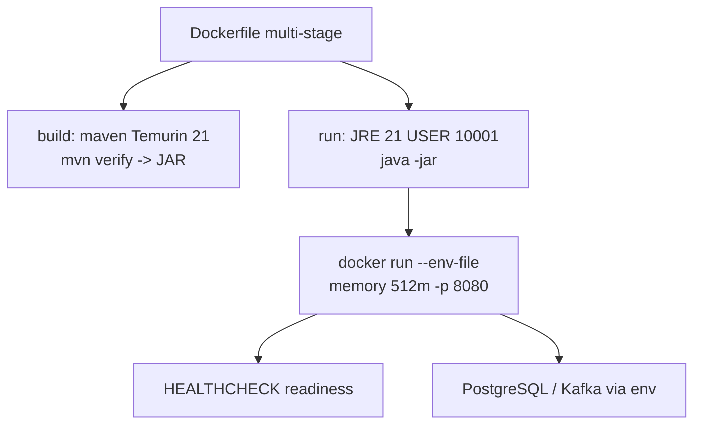

# Lab 41: Containerize the Spring Boot CRM — Multi-Stage Dockerfile, Non-Root, Health

**Module:** 41 — Containerize the Spring Boot CRM  
**Duration:** ~45 minutes (timed path with starter) · Full path: 3–4 Hours

**Primary IDE:** IntelliJ IDEA Community Edition · **Optional IDE:** VS Code

| OS | How-to for this lab |
| -- | ------------------- |
| Windows | [LAB-41-WINDOWS.md](LAB-41-WINDOWS.md) |
| macOS | [LAB-41-MACOS.md](LAB-41-MACOS.md) |

---

## Activity card

| | |
| --- | --- |
| **Time** | ~45 min timed · full path 3–4 h |
| **Checkpoint** | **E** (after Ex 1→4→2→3→5→6) |
| **Must prove** | Multi-stage build · USER 10001 · no secrets in layers · HEALTHCHECK |
| **Hard gate** | Pre-lab Pass · Docker engine · bootable CRM JAR |

### What you will learn

Package the Spring CRM as a small non-root image with runtime env and readiness checks.

### Enterprise context

Ops rejects root/`latest`-only images with passwords baked into layers.

### Predict

If `.env` is not dockerignored, where might the DB password appear?

### Debug

HEALTHCHECK fails with 401 — actuator security allowlist?

---

## 45-minute timed path (use starter)

> **Pacing reminder:** [PACING.md](../PACING.md) checkpoint **E**. Homework: digest evidence + graceful stop + full runbook.

In class, use the starter templates so the **core** objectives fit **~45 minutes**. The full Steps below remain for homework / extended depth.

1. Open [`starter/README.md`](starter/README.md).
2. Copy `starter/` into your `java-bootcamp/examples/…` target (see starter README).
3. Fill every `// TODO` / `TODO` — do **not** wait on a perfect prior lab; the starter includes a baseline.
4. Run the starter smoke test. Commit your work to your GitHub repo (no screenshots).
5. Check timed-path Pass criteria in the starter README yourself (do not write the marks down). Continue remaining GUIDE steps as homework if needed.

| Path | Time | Scope |
| ---- | ---- | ----- |
| **Timed (default)** | ~45 min | Starter TODOs + smoke test |
| **Full (extended)** | see Duration | Every Step in this GUIDE |

---

## What you'll complete (practice only)

Labs and exercises are **practice only**. Nothing is submitted or graded. Do not take screenshots. Check Pass/Fail yourself — do not write those marks anywhere. Commit your work to your private `java-bootcamp` GitHub repo.

Keep this checklist visible while you work.

| # | Deliverable |
| - | ----------- |
| 1 | `Dockerfile` (multi-stage, non-root, health) |
| 2 | `.dockerignore` + `.env.example` |
| 3 | Image build evidence (id/size/user) + digest notes |
| 4 | Readiness + CRM smoke evidence (`CUS-1001`) |
| 5 | Graceful stop + dependency failure evidence |
| 6 | `docs/container-runbook.md` (registry flow included) |
| 7 | No secrets in Git or image layers |

**Commit to your GitHub repo:** the items in the table above (sources + evidence + short notes).

**Do not commit:** `target/`, `node_modules/`, secrets, heap dumps, or a verbatim instructor `solution/`.

## Lab Overview

This Module 41 lab packages the CRM backend as a **small, reproducible, non-root** container image: multi-stage Maven build, hardened JRE runtime, runtime configuration via env, meaningful health checks, resource limits, log hygiene, graceful shutdown, and a `docs/container-runbook.md` another engineer can follow.

## Learning Objectives

After completing this lab, you will be able to:

* Explain image layers and build-context hygiene
* Create a multi-stage Maven → JRE Dockerfile for Java 21
* Run Spring Boot as a fixed non-root UID
* Inject profile, JDBC, and broker settings at runtime
* Add container `HEALTHCHECK` aligned with readiness

## Business Scenario

The CRM must run consistently from developer laptops through the delivery platform. Leadership freezes:

**No production promotion of images that run as root, embed `.env`, or lack readiness signals.**

You own that packaging gate for the API that serves Amina (`CUS-1001`) and Ravi (`CUS-1002`).

Use these examples consistently:

| ID | Name | Notes |
| -- | ---- | ----- |
| `CUS-1001` | Amina Khan | `ACTIVE` — create/get smoke in container |
| `CUS-1002` | Ravi Singh | `PROSPECT` — optional second smoke |
| `CUS-9999` | — | not-found path from inside container network |
| `lab-request-001` | — | correlation header in request/logs |
| `lab41-001`, … | — | runbook experiment IDs |

**Security note for evidence.** Use fictional emails. Never commit `.env.local`, registry passwords, or `docker history` dumps that include secrets. Prefer `.env.example` with empty values.

---

## Architecture Context
### NOW (this lab)



## Prerequisites

Prior labs: [39](../../../Week%204%20-%20Kafka,%20Angular,%20Oracle%20and%20Resilience/module-39/lab39/LAB-39-GUIDE.md) · [40](../../module-40/lab40/LAB-40-GUIDE.md).

Confirm (Lab 0 tools assumed):

* Java 21 + Maven Wrapper; `./mvnw -B clean verify` green
* Docker Engine for multi-stage builds — install in [Lab 0 Step 11](../../../Week%201%20-%20Java%20and%20JVM%20Foundations/module-00/lab0/LAB-0-GUIDE.md) ([Windows](../../../Week%201%20-%20Java%20and%20JVM%20Foundations/module-00/lab0/LAB-0-WINDOWS.md#step-11--install-docker-desktop) · [macOS](../../../Week%201%20-%20Java%20and%20JVM%20Foundations/module-00/lab0/LAB-0-MACOS.md#step-11--install-docker-desktop))
* Actuator health endpoints (add dependency if needed)
* No production secrets in images or Git

### Pre-flight

```bash
java -version
mvn -version
docker version
```

## Worked example (read before you code)

Study this pattern once before Step 1. Your job is to apply the same idea in the Steps — do not skip ahead to a full solution.

```dockerfile
# syntax=docker/dockerfile:1
FROM maven:3.9-eclipse-temurin-21 AS build
WORKDIR /workspace
COPY pom.xml .
COPY .mvn .mvn
COPY mvnw mvnw
RUN chmod +x mvnw && ./mvnw -B -q -DskipTests dependency:go-offline
COPY src ./src
RUN ./mvnw -B clean verify

FROM eclipse-temurin:21-jre
RUN useradd --system --uid 10001 --create-home spring
WORKDIR /app
COPY --from=build --chown=spring:spring /workspace/target/*-SNAPSHOT.jar app.jar
# Prefer a single Boot jar name; adjust pattern to your artifact
USER 10001
EXPOSE 8080
ENV JAVA_TOOL_OPTIONS="-XX:MaxRAMPercentage=75"
HEALTHCHECK --interval=30s --timeout=3s --start-period=40s --retries=3 \
  CMD ["bash", "-c", "exec 3<>/dev/tcp/127.0.0.1/8080 && printf 'GET /actuator/health/readiness HTTP/1.0\r\nHost: localhost\r\n\r\n' >&3 && cat <&3 | grep -q UP"]
ENTRYPOINT ["java","-jar","/app/app.jar"]
```

**What to notice:** Match names, IDs, and failure behavior from the scenario — instructors check these.

---

## Implementation Steps

Complete each step in order. Commands assume `~/java-bootcamp/examples/lab41-crm` (Windows: `%USERPROFILE%\java-bootcamp\examples\lab41-crm`) unless noted.

---

### Step 1 — Prepare application and build context

**Why:** Secrets and `target/` in context bloat layers and risk leaks.

**Do this:** Confirm executable Spring Boot JAR from `./mvnw -B clean verify`. Note port (`8080`), required env (`CRM_DB_*`), and actuator paths. Create `.dockerignore`:

```gitignore
target/
.git/
.idea/
.vscode/
.env
.env.*
!.env.example
*.log
reports/
**/node_modules/
notes/
```

Confirm `mvnw`, `pom.xml`, and `src/` remain in context.

**Expected result:** Context excludes secrets and build output; wrapper still included if you build inside Docker.

**If it fails:** Accidental ignore of `src` → fix `.dockerignore`. Verify still red → fix Lab 39/40 first.

---

### Step 2 — Create the multi-stage Dockerfile

**Why:** Builder tools must not ship in the runtime image.

**Do this:** Add `Dockerfile` (pin base tags per instructor if provided):

```dockerfile
# syntax=docker/dockerfile:1
FROM maven:3.9-eclipse-temurin-21 AS build
WORKDIR /workspace
COPY pom.xml .
COPY .mvn .mvn
COPY mvnw mvnw
RUN chmod +x mvnw && ./mvnw -B -q -DskipTests dependency:go-offline
COPY src ./src
RUN ./mvnw -B clean verify

FROM eclipse-temurin:21-jre
RUN useradd --system --uid 10001 --create-home spring
WORKDIR /app
COPY --from=build --chown=spring:spring /workspace/target/*-SNAPSHOT.jar app.jar
# Prefer a single Boot jar name; adjust pattern to your artifact
USER 10001
EXPOSE 8080
ENV JAVA_TOOL_OPTIONS="-XX:MaxRAMPercentage=75"
HEALTHCHECK --interval=30s --timeout=3s --start-period=40s --retries=3 \
  CMD ["bash", "-c", "exec 3<>/dev/tcp/127.0.0.1/8080 && printf 'GET /actuator/health/readiness HTTP/1.0\r\nHost: localhost\r\n\r\n' >&3 && cat <&3 | grep -q UP"]
ENTRYPOINT ["java","-jar","/app/app.jar"]
```

Adapt jar copy (`*.jar` vs exact name). If `wget` is missing in JRE image, use a documented alternative (`curl`, CMD-SHELL with actuator) or install only with instructor-approved slim tooling—prefer distroless-friendly approaches discussed in class.

**Expected result:** Multi-stage file present; dependency layer cached before source copy.

**If it fails:** `dependency:go-offline` incomplete → still OK if final `verify` works; document. Wrong jar glob → list `/workspace/target` in build.

---

### Step 3 — Harden runtime (non-root, no secrets)

**Why:** Root containers turn RCE into host privilege stories.

**Do this:** Confirm `USER 10001`, no `CRM_DB_PASSWORD` in `ENV`, no copying `.env`, no package-manager leftovers in final stage. Optional: OCI labels for version/git SHA (bonus). Ensure working directory is writable only as needed.

**Expected result:** Runtime stage is JRE-only + jar + non-root user; no credentials in Dockerfile.

**If it fails:** App needs write to `/tmp` only → keep that; avoid writable whole rootfs unless Lab bonus.

---

### Step 4 — Build and inspect the image

**Why:** Digests—not just tags—identify what you will deploy in Lab 42.

**Do this:**

```bash
docker build --pull -t crm-api:lab41 .
docker image inspect crm-api:lab41 --format '{{.Id}} {{.Size}} {{json .Config.User}}'
docker image inspect crm-api:lab41 --format '{{index .RepoDigests 0}}'
# If RepoDigests empty before push, record Image Id and later digest on push
docker history crm-api:lab41 --no-trunc | head
```

Record size, user `10001`, entrypoint, architecture in the runbook.

**Expected result:** Image builds; user is non-root; size materially smaller than a Maven-based single stage (note comparison if you measure).

**If it fails:** Build context huge → fix `.dockerignore`. Permission on `mvnw` → `chmod` in Dockerfile.

---

### Step 5 — Run with configuration and limits

**Why:** Config must be injectable; memory limits surface MaxRAMPercentage behavior.

**Do this:** Create `.env.example`:

```bash
SPRING_PROFILES_ACTIVE=docker
CRM_DB_HOST=crm-postgres
CRM_DB_PORT=5432
CRM_DB_NAME=crm_lab41
CRM_DB_USER=crm
CRM_DB_PASSWORD=
# KAFKA_BOOTSTRAP=...
```

Copy to gitignored `.env.local`, fill training values, run:

```bash
docker run --rm --name crm-lab41 -p 8080:8080 \
  --memory=512m --env-file .env.local crm-api:lab41
```

Use Compose network DNS (`crm-postgres`) instead of `host.docker.internal` when PostgreSQL is a sibling container—document which.

**Expected result:** Container starts with injected env; port published; memory capped.

**If it fails:** Cannot reach PostgreSQL → fix `CRM_DB_HOST` for Docker networking. Immediate exit → `docker logs crm-lab41`.

---

### Step 6 — Verify health and CRM workflow

**Why:** A listening port is not readiness; CRM smoke proves the image is useful.

**Do this:**

```bash
curl -fsS http://localhost:8080/actuator/health/readiness
# Create/get Amina with synthetic payload; include correlation:
curl -fsS -H "X-Correlation-Id: lab-request-001" ...
docker logs crm-lab41 --tail 100
```

Confirm logs show correlation where instrumented, **no** password or full PAN/PII dumps.

**Expected result:** Readiness success; `CUS-1001` create/get works (or documented seed + get); logs sanitized.

**If it fails:** Health 404 → enable actuator exposure for health. 503 readiness → DB down; fix dependency first.

---

### Step 7 — Test graceful shutdown and dependency failure

**Why:** Orchestrators need SIGTERM behavior; bad config must fail clearly.

**Do this:**

```bash
docker stop --time 20 crm-lab41
```

Confirm logs show orderly shutdown (Spring shutdown hooks) within timeout. Then run once with an invalid JDBC URL; observe readiness failure / exit; capture logs; remove the failed container without deleting your runbook notes.

**Expected result:** Graceful stop within ~20s; invalid dependency produces bounded, understandable failure evidence.

**If it fails:** Forced kill only → check `server.shutdown=graceful` / timeout settings. Hang forever → reduce work on shutdown; document.

---

### Step 8 — Document registry flow and finish evidence pack

**Why:** Lab 42 needs an immutable identity story even if you do not push yet.

**Do this:** In `docs/container-runbook.md` describe: registry login outside source control; tag by version + git SHA (not only `latest`); push authorization; digest pinning; cleanup of old tags. Complete Failure Experiments. Commit your work to your GitHub repo. Do not take screenshots.

```bash
git status --short
```

**Expected result:** Runbook alone suffices for a peer to build/run/stop; digest/ID recorded; no `.env.local` staged.

**If it fails:** See Troubleshooting.

---

### Step 9 — Optional Compose wiring for PostgreSQL sibling (document either way)

**Why:** Many CRM stacks fail first on Docker DNS (`localhost` inside the container is the container itself).

**Do this:** If PostgreSQL runs as `crm-postgres` on a user-defined bridge network, document one of:

```bash
docker network ls
docker network connect <crm-net> crm-lab41   # if started separately
# or run:
docker run --rm --name crm-lab41 --network <crm-net> -p 8080:8080 \
  -e CRM_DB_HOST=crm-postgres \
  -e CRM_DB_PORT=5432 \
  -e CRM_DB_NAME=crm_lab41 \
  -e CRM_DB_USER=crm \
  --env-file .env.local crm-api:lab41
```

Record in the runbook which hostname works on the local workstation (`host.docker.internal` vs Compose service name). Do not commit a Compose file that embeds passwords.

**Expected result:** Documented working JDBC host for container→PostgreSQL; smoke still green.

**If it fails:** Connection timed out → wrong network; inspect `docker inspect crm-postgres` networks. TLS/TCPS surprises → stay on training thin URL unless instructor requires wallet.

---

### Step 10 — Peer build from runbook only

**Why:** Operator docs that require tribal knowledge fail Lab 42 under time pressure.

**Do this:** Have a peer (or you on a clean shell) follow **only** `docs/container-runbook.md` to rebuild/run/curl readiness. Note any missing step and patch the runbook. Capture second build image ID (cache may make it fast—still record User and health).

**Expected result:** Peer reaches readiness without Slack help; runbook gaps closed; evidence of second successful run.

**If it fails:** Missing `--pull` / jar name / env keys → fix runbook immediately.

---

## Implementation Checkpoints

### Checkpoint A — Context and Dockerfile

_Check **Pass** or **Fail** yourself. Do not write these marks anywhere — nothing is submitted or graded. Commit your work to your GitHub repo._

| # | Confirm | Self-check |
| - | ------- | ---------- |
| 1 | `lab41-crm` verifies before image work | Pass / Fail |
| 2 | `.dockerignore` excludes secrets/`target` | Pass / Fail |
| 3 | Multi-stage Dockerfile builds JAR then JRE runtime | Pass / Fail |

### Checkpoint B — Hardening and inspect

_Check **Pass** or **Fail** yourself. Do not write these marks anywhere — nothing is submitted or graded. Commit your work to your GitHub repo._

| # | Confirm | Self-check |
| - | ------- | ---------- |
| 1 | Runs as UID `10001` (or fixed non-root) | Pass / Fail |
| 2 | No secrets in image env/layers | Pass / Fail |
| 3 | Image id/size/user recorded | Pass / Fail |

### Checkpoint C — Run and prove

_Check **Pass** or **Fail** yourself. Do not write these marks anywhere — nothing is submitted or graded. Commit your work to your GitHub repo._

| # | Confirm | Self-check |
| - | ------- | ---------- |
| 1 | Runtime env via `.env.example` pattern | Pass / Fail |
| 2 | Readiness healthy; CRM smoke with `CUS-1001` | Pass / Fail |
| 3 | Graceful stop + bad URL experiment documented | Pass / Fail |

### Checkpoint D — Hygiene

_Check **Pass** or **Fail** yourself. Do not write these marks anywhere — nothing is submitted or graded. Commit your work to your GitHub repo._

| # | Confirm | Self-check |
| - | ------- | ---------- |
| 1 | `container-runbook.md` complete | Pass / Fail |
| 2 | Registry/digest notes present | Pass / Fail |
| 3 | No `.env` / tokens in Git | Pass / Fail |
| 4 | Peer build from runbook succeeded (or gaps fixed) | Pass / Fail |
| 5 | JDBC hostname for container→PostgreSQL documented | Pass / Fail |
| 6 | Actuator does not expose `env`/`beans` publicly without auth | Pass / Fail |

---

## Safety Rules (restate before building)

* Work only against local Docker / authorized training hosts.
* Never `COPY` `.env` or kubeconfig into the image.
* Pin or record base image tags (`maven:…`, `eclipse-temurin:…`).
* Prefer digest identity for anything you will promote to Lab 42.
* Do not run training containers as root “just to make volume mounts work”—fix ownership instead.
* Keep CRM smoke traffic synthetic (`CUS-1001` / `CUS-1002` only).
* Delete failed containers after capturing logs; do not leave password-bearing env files on shared disks.

---

## Reference Commands, Configuration, and Code

### Build and run

```bash
cd ~/java-bootcamp/examples/lab41-crm
docker build --pull -t crm-api:lab41 .
docker image inspect crm-api:lab41 --format 'id={{.Id}} size={{.Size}} user={{json .Config.User}}'
docker run --rm --name crm-lab41 -p 8080:8080 \
  --memory=512m --env-file .env.local crm-api:lab41
curl -fsS http://localhost:8080/actuator/health/readiness
curl -fsS -H "X-Correlation-Id: lab-request-001" \
  -u admin:change-me \
  http://localhost:8080/api/customers/CUS-1001
docker logs crm-lab41 --tail 50
docker stop --time 20 crm-lab41
```

### Actuator exposure reminder (`application.yml`)

```yaml
management:
  endpoint:
    health:
      probes:
        enabled: true
  endpoints:
    web:
      exposure:
        include: health,info
```

Do not expose `env`/`beans` in training images that leave the private network without auth.

### Tagging for Lab 42

```bash
GIT_SHA=$(git rev-parse --short HEAD)
docker tag crm-api:lab41 crm-api:1.0.0-${GIT_SHA}
# docker login …  (credentials never in Git)
# docker push registry.example.com/training/crm-api:1.0.0-${GIT_SHA}
```

## Failure Experiments

| # | Experiment | Observe | Restore |
| - | ---------- | ------- | ------- |
| 1 | Run as root by commenting `USER` | Inspect user `0`; note risk | Restore `USER 10001` |
| 2 | Invalid `CRM_DB_HOST` / port | Readiness fail / crash loop | Fix `CRM_DB_*` keys |
| 3 | Omit `.dockerignore` `target/` | Slower/messier context | Restore ignore |
| 4 | `docker stop --time 1` | Possible forced kill | Prefer 20s; tune app |
| 5 | Tag only `latest` in notes | Document why Lab 42 rejects it | Use version+SHA |

---

## Troubleshooting

| Symptom | Likely cause | Fix |
| ------- | ------------ | --- |
| Huge context | Missing `.dockerignore` | Ignore `target`, `.git`, `.env` |
| Jar not found | Wrong COPY glob | Match Boot jar name |
| Permission denied | Root-owned files | `--chown=spring:spring` |
| Cannot connect DB | Docker DNS/host | Use compose service name / host gateway |
| HEALTHCHECK fail | No wget/curl | Prefer `/dev/tcp` HEALTHCHECK; expose actuator |
| OOM kill | Memory limit tight | Tune limit / MaxRAMPercentage |
| Secrets in history | ARG password | Rebuild without; rotate |
| Slow repeated builds | Cache busted by COPY order | Keep pom-first pattern |

## Evidence Log Template

```markdown
# Lab 41 Evidence Log
- Image tag / id:
- Config.User:
- Size (bytes):
- Readiness curl result:
- Smoke CUS-1001 result:
- Stop --time 20 observation:
- Bad JDBC experiment:
- Runbook peer-tested: Y/N
```

---

## Security and Production Review

Optional — jot brief notes in your README if useful for your progress check (not a separate essay):

1. Which inputs are untrusted (env files, image bases, registry)?
2. Where are authn/authz/validation enforced (still in app—not Docker alone)?
3. Which values are sensitive—how injected (env/secret store)?

---


## Cleanup

```bash
docker stop crm-lab41 2>/dev/null || true
docker rm crm-lab41 2>/dev/null || true
# optional: docker rmi crm-api:lab41
cd ~/java-bootcamp/examples/lab41-crm
git status --short
```

Keep Dockerfile and runbook; delete plaintext env files from shared hosts.

**Keep `lab41-crm`**—Lab 42 deploys this image on OpenShift with Deployment/Service/Route and probes.


## Reflection Questions

Write **1–3 sentence** answers (not essays):

1. Which design decision most affected image safety/size?
2. What evidence proves non-root + readiness?
3. Which failure was hardest to diagnose (network vs health vs perms)?

---


