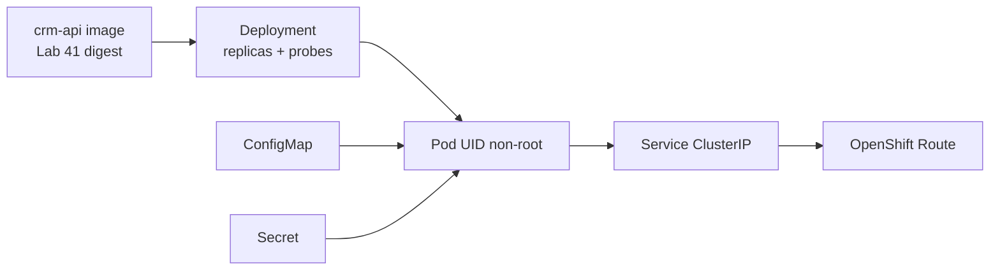

# Lab 42: Kubernetes and OpenShift Architecture — Northstar CRM on OpenShift

**Module:** 42 — Kubernetes and OpenShift Architecture  
**Duration:** ~45 minutes (timed path with starter) · Full path: 3–4 Hours

**Primary IDE:** IntelliJ IDEA Community Edition · **Optional IDE:** VS Code / OpenShift Console

| OS | How-to for this lab |
| -- | ------------------- |
| Windows | [LAB-42-WINDOWS.md](LAB-42-WINDOWS.md) |
| macOS | [LAB-42-MACOS.md](LAB-42-MACOS.md) |

---

## Activity card

| | |
| --- | --- |
| **Time** | ~45 min timed · full path 3–4 h |
| **Checkpoint** | **E** (after Ex 1→2→3→4→5→6) |
| **Must prove** | Pod/Service/Deployment map · Project/Route · probes · ConfigMap/Secret notes · `oc` evidence |
| **Hard gate** | Pre-lab Pass · Lab 41 image story · `oc` login or instructor shared cluster |

### What you will learn

Map Kubernetes primitives to OpenShift Projects/Routes and deploy (or fully document) the CRM container with probes and config.

### Enterprise context

A container that only runs on Docker Desktop is not yet a platform deliverable—Ops needs Project isolation, Routes, and probe-backed Deployments.

### Predict

If readiness fails but liveness passes, what should OpenShift do with traffic?

### Debug

Route returns 503 — Service selector mismatch or probe never Ready?

---

## 45-minute timed path (use starter)

> **Pacing reminder:** [PACING.md](../PACING.md) checkpoint **E**. Homework: live deploy (if cluster available) + failure experiments + full runbook.

1. Open [`starter/README.md`](starter/README.md).
2. Copy `starter/` into `java-bootcamp/examples/lab42-crm` (see starter README).
3. Fill every `TODO` — starter includes Deployment/Service/Route sketches and probe placeholders.
4. Run starter smoke (`oc` dry-run or YAML validate). Commit your work to your GitHub repo (no screenshots).
5. Mark timed-path Pass criteria. Continue remaining GUIDE steps as homework if needed.

| Path | Time | Scope |
| ---- | ---- | ----- |
| **Timed (default)** | ~45 min | Starter TODOs + validate / dry-run |
| **Full (extended)** | see Duration | Every Step in this GUIDE |

---

## What you'll complete (practice only)

Labs and exercises are **practice only**. Nothing is submitted or graded. Do not take screenshots. Check Pass/Fail yourself — do not write those marks anywhere. Commit your work to your private `java-bootcamp` GitHub repo.

| # | Deliverable |
| - | ----------- |
| 1 | `k8s/` or `openshift/` manifests: Deployment, Service, Route (or documented equivalent) |
| 2 | Project / namespace plan for `lab42-crm` |
| 3 | Liveness + readiness probe configuration aligned with Actuator |
| 4 | ConfigMap + Secret overview (examples only—no real credentials) |
| 5 | `oc` evidence: login, project, get pods/svc/route (or instructor-approved conceptual pack) |
| 6 | `docs/openshift-runbook.md` |
| 7 | No kubeconfig, tokens, or passwords in Git |

**Commit to your GitHub repo:** the items in the table above (sources + evidence + short notes).

**Do not commit:** `target/`, `node_modules/`, secrets, heap dumps, or a copied answer keys.

## Lab Overview

This Module 42 lab connects Lab 41’s CRM image to **Kubernetes concepts** and **OpenShift** delivery: Pods, Services, Deployments, Projects, Routes, `oc`, health probes, and ConfigMap/Secret patterns for Northstar CRM.

## Learning Objectives

After completing this lab, you will be able to:

* Explain Pod, Service, and Deployment roles for a Spring Boot CRM API
* Use OpenShift Projects and Routes for isolation and HTTP exposure
* Apply `oc` basics: login, project, apply, get, describe, logs
* Configure liveness/readiness probes against Actuator
* Describe ConfigMaps and Secrets without committing credentials

## Business Scenario

Leadership freezes: **No OpenShift promotion without a Project plan, Route story, probe-backed Deployment, and a peer-usable runbook.** You own that gate for the API that serves Amina (`CUS-1001`).

| ID | Name | Notes |
| -- | ---- | ----- |
| `CUS-1001` | Amina Khan | Smoke after Route is Ready |
| `CUS-1002` | Ravi Singh | Optional second smoke |
| `lab-request-001` | — | Correlation header through Route |
| `lab42-crm` | — | Project / app name |

**Security note.** Never commit kubeconfig, pull secrets, or real JDBC passwords. Use `.env.example` / Secret *templates* only.

---

## Architecture Context
### NOW (this lab)



## Prerequisites

Prior labs: [41](../../module-41/lab41/LAB-41-GUIDE.md) · [40](../../module-40/lab40/LAB-40-GUIDE.md).

* Lab 41 image identity (tag + digest/ID notes)
* `oc` CLI (or Console + instructor shared Project)
* Actuator readiness path from Lab 41
* No production secrets in manifests

### Pre-flight

```bash
oc version
# kubectl is not a substitute for the shared OpenShift Project. Use `oc`.
```

## Worked example (read before you code)

```yaml
apiVersion: apps/v1
kind: Deployment
metadata:
  name: crm-api
spec:
  replicas: 1
  selector:
    matchLabels: { app: crm-api }
  template:
    metadata:
      labels: { app: crm-api }
    spec:
      containers:
        - name: crm-api
          image: registry.example.com/training/crm-api:1.0.0-REPLACE_SHA
          ports: [{ containerPort: 8080 }]
          readinessProbe:
            httpGet: { path: /actuator/health/readiness, port: 8080 }
            initialDelaySeconds: 20
            periodSeconds: 10
          livenessProbe:
            httpGet: { path: /actuator/health/liveness, port: 8080 }
            initialDelaySeconds: 40
            periodSeconds: 20
```

**What to notice:** Image digest/tag from Lab 41; probes match Actuator; no password in YAML.

---

## Implementation Steps

Commands assume `~/java-bootcamp/examples/lab42-crm` (Windows: `%USERPROFILE%\java-bootcamp\examples\lab42-crm`).

---

### Step 1 — Map primitives to CRM

**Why:** Wrong mental model produces “fix it with another Pod” debugging.

**Do this:** In `docs/openshift-runbook.md`, define Pod vs ReplicaSet/Deployment vs Service vs Route for `crm-api`. Sketch how Angular (later labs) reaches the API via Route hostname—not `localhost`.

**Expected result:** One-page glossary tied to Northstar CRM.

**If it fails:** Confusing Service with Route → re-read: Service is cluster DNS; Route is external HTTP.

---

### Step 2 — Plan the OpenShift Project

**Why:** Shared clusters need isolation and naming discipline.

**Do this:** Document Project name (e.g. `lab42-<your-id>` or instructor `lab42-crm`), resource quotas if provided, and who may `oc apply`. Record login method (token / SSO)—never paste tokens into Git.

```bash
oc login --server=<instructor-api>   # interactive / token as taught
oc new-project lab42-crm || oc project lab42-crm
oc project
```

**Expected result:** Active Project noted in runbook; evidence screenshot redacted.

**If it fails:** No cluster access → complete conceptual pack + dry-run; instructor marks substitute.

---

### Step 3 — Deployment + Service manifests

**Why:** Deployments own desired state; Services select Pods by label.

**Do this:** Create `openshift/deployment.yaml` and `openshift/service.yaml`. Pin image to Lab 41 digest/tag. Match labels `app: crm-api`. Expose port `8080`.

```bash
oc apply -f openshift/deployment.yaml --dry-run=client -o yaml
oc apply -f openshift/service.yaml --dry-run=client -o yaml
```

**Expected result:** Valid YAML; selector labels consistent.

**If it fails:** ImagePullBackOff later → wrong registry/auth; document pull secret name only.

---

### Step 4 — Route and health probes

**Why:** Without Route + Ready Pods, demos die on “works on my laptop.”

**Do this:** Add `openshift/route.yaml` (edge or instructor TLS mode). Confirm readiness/liveness paths. After apply (if allowed):

```bash
oc get pods,svc,route
oc describe pod -l app=crm-api
oc logs -l app=crm-api --tail=80
curl -fsS -H "X-Correlation-Id: lab-request-001" "https://<route-host>/actuator/health/readiness"
```

**Expected result:** Route host documented; readiness UP when dependencies available.

**If it fails:** 503 → check Endpoints empty / probe failing; fix labels or JDBC ConfigMap.

---

### Step 5 — ConfigMaps and Secrets overview

**Why:** Baking JDBC passwords into Deployment env is a Lab 41 regression.

**Do this:** Add `openshift/configmap.example.yaml` (profile, non-secret URLs) and `openshift/secret.example.yaml` (keys only, empty values). Document mounting as envFrom. Never commit filled Secrets.

**Expected result:** Example files + runbook section on Secret creation via `oc create secret` / Console.

**If it fails:** Tempted to paste password into YAML → use example placeholders only.

---

### Step 6 — Smoke, failure experiments, evidence

**Why:** Probe and selector bugs only show under failure.

**Do this:** Complete Failure Experiments. Capture `oc get`/`describe` commit to GitHub (no screenshots). Finish `docs/openshift-runbook.md` so a peer can apply and curl readiness.

**Expected result:** Peer-usable runbook; redacted evidence; clean `git status`.

**If it fails:** See Troubleshooting.

---

## Implementation Checkpoints

### Checkpoint A — Concepts and Project

| # | Confirm | Self-check |
| - | ------- | ---------- |
| 1 | Pod/Service/Deployment/Route explained for CRM | Pass / Fail |
| 2 | Project plan + login method documented (no token in Git) | Pass / Fail |

### Checkpoint B — Manifests and probes

| # | Confirm | Self-check |
| - | ------- | ---------- |
| 1 | Deployment + Service + Route (or approved substitute) | Pass / Fail |
| 2 | Liveness + readiness aligned with Actuator | Pass / Fail |
| 3 | ConfigMap/Secret examples without real secrets | Pass / Fail |

### Checkpoint C — Evidence

| # | Confirm | Self-check |
| - | ------- | ---------- |
| 1 | `oc` (or Console) evidence saved | Pass / Fail |
| 2 | `openshift-runbook.md` peer-usable | Pass / Fail |

---

## Safety Rules

* Work only on instructor-authorized OpenShift / local CRC if assigned.
* Never commit kubeconfig, tokens, or filled Secrets.
* Prefer digest-pinned images from Lab 41.
* Synthetic CRM traffic only (`CUS-1001` / `CUS-1002`).

---

## Reference Commands

```bash
cd ~/java-bootcamp/examples/lab42-crm
oc project
oc apply -f openshift/
oc get pods,svc,route
oc rollout status deployment/crm-api
oc logs -l app=crm-api --tail=100
oc delete -f openshift/   # cleanup when allowed
```

## Failure Experiments

| # | Experiment | Observe | Restore |
| - | ---------- | ------- | ------- |
| 1 | Break Service selector label | Endpoints empty; Route 503 | Fix labels |
| 2 | Wrong readiness path | Pod never Ready | Fix probe path |
| 3 | Missing Secret key | CrashLoop / Flyway fail | Restore example + create Secret properly |

## Troubleshooting

| Symptom | Likely cause | Fix |
| ------- | ------------ | --- |
| ImagePullBackOff | Registry/auth | Pull secret; pin correct tag |
| CrashLoopBackOff | Bad env / DB | Logs + ConfigMap/Secret |
| Route 503 | No Ready Pods | Probes / selectors |
| Forbidden | RBAC | Ask instructor for Project role |

## Cleanup

```bash
# Only if instructor allows deleting your Project resources:
oc delete -f openshift/ --ignore-not-found
git status --short
```

**Keep `lab42-crm`**—Labs 43–44 and capstone reuse Project/Route/probe patterns.

## Reflection Questions

1. Why is a Route not a replacement for a Service?
2. What evidence proves readiness before traffic?
3. Where should JDBC passwords live—and never live?
