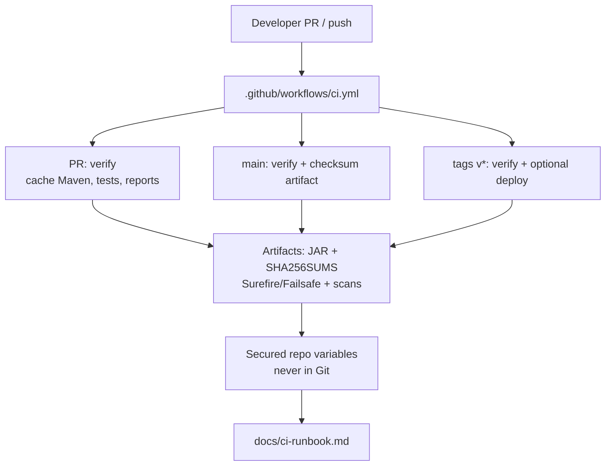

# Lab 43: GitHub CI/CD Pipeline for the CRM — Northstar Delivery Gates

**Module:** 43 — GitHub CI/CD Pipeline for the CRM  
**Duration:** ~45 minutes (timed path with starter) · Full path: 3–4 Hours

**Primary IDE:** IntelliJ IDEA Community Edition · **Optional IDE:** VS Code

| OS | How-to for this lab |
| -- | ------------------- |
| Windows | [LAB-43-WINDOWS.md](LAB-43-WINDOWS.md) |
| macOS | [LAB-43-MACOS.md](LAB-43-MACOS.md) |

---

## Activity card

| | |
| --- | --- |
| **Time** | ~45 min timed · full path 3–4 h |
| **Checkpoint** | **E** (after Ex 1→4→2→3→5→6) |
| **Must prove** | PR/main triggers · verify no skipTests · package-once SHA · secrets not in YAML · runbook |
| **Hard gate** | Pre-lab Pass · CRM Maven green locally · Actions enabled |

### What you will learn

Ship a reviewable GitHub Actions workflow: verify, optional scan, package-once identity, secrets hygiene, peer runbook.

### Enterprise context

Green demo without artifact identity and secret discipline is not a delivery gate.

### Predict

Should the deploy job rebuild the JAR with Maven?

### Debug

Checksum artifact empty after package job — what failed upstream?

---

## 45-minute timed path (use starter)

> **Pacing reminder:** [PACING.md](../PACING.md) checkpoint **E**. Homework: PR evidence, failure path, package-once checksum, full runbook.

In class, use the starter templates so the **core** objectives fit **~45 minutes**. The full Steps below remain for homework / extended depth.

1. Open [`starter/README.md`](starter/README.md).
2. Copy `starter/` into your `java-bootcamp/examples/…` target (see starter README).
3. Fill every `// TODO` / `TODO` — do **not** wait on a perfect prior lab; the starter includes a baseline.
4. Run the starter smoke test. Commit your work to your GitHub repo (no screenshots).
5. Check timed-path Pass criteria in the starter README yourself (do not write the marks down). Continue remaining GUIDE steps as homework if needed.

| Path | Time | Scope |
| ---- | ---- | ----- |
| **Timed (default)** | ~45 min | Starter TODOs + smoke test |
| **Full (extended)** | see Duration | Every Step in this GUIDE |

---

## What you'll complete (practice only)

Labs and exercises are **practice only**. Nothing is submitted or graded. Do not take screenshots. Check Pass/Fail yourself — do not write those marks anywhere. Commit your work to your private `java-bootcamp` GitHub repo.

Keep this checklist visible while you work.

| # | Deliverable |
| - | ----------- |
| 1 | `.github/workflows/ci.yml` with PR / main / tag behavior |
| 2 | Test reports (Surefire/Failsafe) evidence |
| 3 | Security / scan report evidence (or documented residual risk) |
| 4 | JAR and SHA-256 checksum tied to commit |
| 5 | `docs/ci-runbook.md` with policy, rerun, and troubleshooting |
| 6 | Controlled failure-path result then restore |
| 7 | No secrets or real customer records in Git |

**Commit to your GitHub repo:** the items in the table above (sources + evidence + short notes).

**Do not commit:** `target/`, `node_modules/`, secrets, heap dumps, or a copied answer keys.

## Lab Overview

This Module 43 lab gives the **Customer Management Platform** a reviewable **GitHub Actions** workflow: verify, scan, package once, protect secrets, and document how peers re-run CI. You will produce `.github/workflows/ci.yml`, publish Surefire/Failsafe (and scan) reports, pass an immutable JAR + SHA-256 between isolated steps, and write `docs/ci-runbook.md`.

## Reference GitHub Actions workflow

```yaml
# .github/workflows/ci.yml
name: CRM CI
on:
  pull_request:
  push:
    branches: [main]
    tags: ["v*"]
jobs:
  verify:
    runs-on: ubuntu-latest
    steps:
      - uses: actions/checkout@v4
      - uses: actions/setup-java@v4
        with:
          distribution: temurin
          java-version: "21"
          cache: maven
      - name: Verify
        run: ./mvnw -B clean verify
      - name: Upload reports
        if: always()
        uses: actions/upload-artifact@v4
        with:
          name: test-reports
          path: "**/target/surefire-reports/**"
  package:
    needs: verify
    if: github.ref == 'refs/heads/main' || startsWith(github.ref, 'refs/tags/')
    runs-on: ubuntu-latest
    steps:
      - uses: actions/checkout@v4
      - uses: actions/setup-java@v4
        with:
          distribution: temurin
          java-version: "21"
          cache: maven
      - name: Package once
        run: |
          ./mvnw -B -DskipTests package
          sha256sum target/*.jar > target/SHA256SUMS
          echo "commit=${GITHUB_SHA}" >> target/SHA256SUMS
      - uses: actions/upload-artifact@v4
        with:
          name: crm-jar
          path: |
            target/*.jar
            target/SHA256SUMS
```

## Learning Objectives

After completing this lab, you will be able to:

* Model CI stages and gates for PR, `main`, and version tags
* Configure Maven dependency caching in GitHub Actions
* Publish Surefire, Failsafe, and security-scan reports as artifacts
* Use branch and pull-request pipelines with distinct rigor
* Pass immutable artifacts (JAR + checksum + commit) between isolated steps

## Business Scenario

Pull requests need fast feedback while `main` and release tags require stronger gates. Build output must be traceable and passed between isolated steps—otherwise staging and production silently diverge (“it passed CI” vs “we rebuilt on the deploy agent”).

Before week’s end, CD (Lab 44) will promote one digest through staging and production. You own the CI contract for Labs 41–43 behavior: verify the CRM backend that serves Amina (`CUS-1001`) and Ravi (`CUS-1002`), keep credentials out of Git, and leave evidence an on-call engineer can trust.

Use these examples consistently:

| ID | Name | Notes |
| -- | ---- | ----- |
| `CUS-1001` | Amina Khan | `ACTIVE` — synthetic CRM fixture in tests/smoke only |
| `CUS-1002` | Ravi Singh | `PROSPECT` — synthetic CRM fixture in tests/smoke only |
| `lab-request-001` | — | correlation on API or pipeline evidence labels |
| `GITHUB_SHA` | — | commit identity recorded with the JAR checksum |

**Security note for evidence.** Use fictional emails only. Never paste secured variable values, `.env`, kubeconfig, or registry tokens into screenshots or `docs/`. Redact pipeline log excerpts that echo credentials.

---

## Architecture Context
### NOW (this lab)



## Prerequisites

Prior labs: [41](../../module-41/lab41/LAB-41-GUIDE.md) · [42](../../module-42/lab42/LAB-42-GUIDE.md).

Confirm (Lab 0 tools assumed):

* JDK 21; Maven or Maven Wrapper; Git
* GitHub account/repository with Actions enabled
* Docker available for pipeline/agent steps as instructor directs
* CRM module that already passes `mvn clean verify` (or `./mvnw`) locally
* No secrets committed to Git

### Pre-flight

```bash
java -version
mvn -version
```

## Worked example (read before you code)

Study this pattern once before Step 1. Your job is to apply the same idea in the Steps — do not skip ahead to a full solution.

```yaml
  package:
    needs: verify
    if: github.ref == 'refs/heads/main' || startsWith(github.ref, 'refs/tags/')
    runs-on: ubuntu-latest
    steps:
      - uses: actions/checkout@v4
      - uses: actions/setup-java@v4
        with:
          distribution: temurin
          java-version: "21"
          cache: maven
      - name: Package once + checksum
        run: |
          ./mvnw -B -ntp -DskipTests package
          sha256sum target/*.jar > target/SHA256SUMS
          echo "commit=${GITHUB_SHA}" >> target/SHA256SUMS
          echo "run=${GITHUB_RUN_NUMBER}" >> target/SHA256SUMS
      - uses: actions/upload-artifact@v4
        with:
          name: crm-jar
          path: |
            target/*.jar
            target/SHA256SUMS
```

**What to notice:** Match names, IDs, and failure behavior from the scenario — instructors check these.

---

## Implementation Steps

Complete each step in order. Commands assume `~/java-bootcamp/examples/lab43-crm` (Windows: `%USERPROFILE%\java-bootcamp\examples\lab43-crm`) unless noted. Map of legacy Parts → steps: Part 1→Step 1 … Part 8→Step 8; Step 9 closes failure experiments.

---

### Step 1 — Define pipeline policy (Part 1)

**Why:** Without an explicit policy, teams invent different gates per branch and cannot explain who may deploy.

**Do this:** In `docs/ci-runbook.md`, list checks for commits, pull requests, `main`, and tags. Identify which steps may deploy and who may approve. Define failure, retry, and evidence-retention rules (keep Surefire even when verify fails if your steps allow).

Create the working copy:

```bash
cd ~/java-bootcamp/examples
# Prefer branching from your latest green CRM tree (e.g. lab42-crm)
cp -r lab42-crm lab43-crm 2>/dev/null || cp -r lab41-crm lab43-crm
cd lab43-crm
mkdir -p docs
git switch -c lab/43-crm 2>/dev/null || true
```

**Expected result:** Written policy covering PR / main / tags; deploy authority named; retention rules stated.

**If it fails:** Policy that says “always deploy from PR” → reject; keep deploy on manual tag or controlled `main` only as instructor allows.

---

### Step 2 — Prepare reproducible commands (Part 2)

**Why:** Local and pipeline JDK/Maven drift is the classic “works on my laptop” failure mode.

**Do this:** Prefer Maven Wrapper **or** a pinned Maven image (`maven:3.9-eclipse-temurin-21` or instructor pin). Run clean verify without `-DskipTests`. Capture Java and Maven versions in logs (and paste sanitized excerpts into notes).

```bash
cd ~/java-bootcamp/examples/lab43-crm
java -version
./mvnw --version 2>/dev/null || mvn -version
./mvnw -B -ntp clean verify
```

**Expected result:** Local `BUILD SUCCESS`; versions recorded; no skipped tests for the default verify path.

**If it fails:** Baseline red → fix CRM tests first; do not “green” CI by skipping tests.

---

### Step 3 — Create verification step with Maven cache (Part 3)

**Why:** Cold Maven downloads waste minutes and encourage developers to push incomplete local builds.

**Do this:** Author `.github/workflows/ci.yml` with verify job, Maven cache via `actions/setup-java`, and report artifacts. Example:

```yaml
# .github/workflows/ci.yml
name: CRM CI
on:
  pull_request:
  push:
    branches: [main]
    tags: ["v*"]

jobs:
  verify:
    runs-on: ubuntu-latest
    steps:
      - uses: actions/checkout@v4
      - uses: actions/setup-java@v4
        with:
          distribution: temurin
          java-version: "21"
          cache: maven
      - name: Verify CRM backend
        run: ./mvnw -B -ntp clean verify
      - name: Upload test reports
        if: always()
        uses: actions/upload-artifact@v4
        with:
          name: test-reports
          path: |
            **/target/surefire-reports/**
            **/target/failsafe-reports/**
```

**Expected result:** PR pipeline runs verify; cache declared; Surefire/Failsafe paths listed as artifacts.

**If it fails:** Wrong working directory for multi-module → `cd backend` (or your module) before `mvn`. Empty `target/*.jar` → match your packaging layout.

---

### Step 4 — Add quality gates (Part 4)

**Why:** Compile-only green builds miss vulnerable dependencies; reports must survive a failed gate for triage.

**Do this:** Add a dependency-scan and/or available SAST step (Maven profile, OWASP Dependency-Check, or instructor-provided scanner). Fail at the agreed threshold. Preserve reports even when the gate fails (use `if: always()` on upload-artifact steps).

```bash
# Local analogue (adjust profile/plugin to cohort tooling)
./mvnw -B -ntp -Psecurity-scan dependency-check:check || true
```

Document the fail threshold and where HTML/XML reports land in `docs/ci-runbook.md`.

**Expected result:** Scan step present; threshold documented; report path retained for peer review.

**If it fails:** “Scan optional forever” with no owner → assign residual risk owner/date or fix blockers.

---

### Step 5 — Package once with checksum (Part 5)

Add a `package` job that depends on `verify` and uploads a checksummed JAR:

```yaml
  package:
    needs: verify
    if: github.ref == 'refs/heads/main' || startsWith(github.ref, 'refs/tags/')
    runs-on: ubuntu-latest
    steps:
      - uses: actions/checkout@v4
      - uses: actions/setup-java@v4
        with:
          distribution: temurin
          java-version: "21"
          cache: maven
      - name: Package once + checksum
        run: |
          ./mvnw -B -ntp -DskipTests package
          sha256sum target/*.jar > target/SHA256SUMS
          echo "commit=${GITHUB_SHA}" >> target/SHA256SUMS
          echo "run=${GITHUB_RUN_NUMBER}" >> target/SHA256SUMS
      - uses: actions/upload-artifact@v4
        with:
          name: crm-jar
          path: |
            target/*.jar
            target/SHA256SUMS
```

**Why:** Rebuilding on the deploy agent breaks the chain of custody Lab 44 depends on.

**Do this:** After verify on `main` (or release path), calculate SHA-256, record commit identity, and attach JAR + `SHA256SUMS` as artifacts. Do **not** rebuild in deployment steps.

```yaml
  package:
    needs: verify
    if: github.ref == 'refs/heads/main' || startsWith(github.ref, 'refs/tags/')
    runs-on: ubuntu-latest
    steps:
      - uses: actions/checkout@v4
      - uses: actions/setup-java@v4
        with:
          distribution: temurin
          java-version: "21"
          cache: maven
      - name: Package once + checksum
        run: |
          mvn -B -DskipTests package
          sha256sum target/*.jar > target/SHA256SUMS
          echo "commit=${GITHUB_SHA}" >> target/SHA256SUMS
      - uses: actions/upload-artifact@v4
        with:
          name: crm-jar
          path: |
            target/*.jar
            target/SHA256SUMS
```

**Expected result:** Artifact pack includes JAR + checksum lines + commit reference.

**If it fails:** Deploy script runs `mvn package` again → remove rebuild; consume prior artifacts only.

---

### Step 6 — Configure branch behavior (Part 6)

**Why:** PR noise should stay light; release tags need explicit approval for environment deploy.

**Do this:** Keep focused validation on pull requests; complete gates on `main`; use version tags (`v*`) and **manual** environment deployment where required.

```yaml
# Tag / release behavior is the same package job above (gated by startsWith(github.ref, 'refs/tags/')).
# Deploy belongs in Lab 44 `.github/workflows/cd.yml` (workflow_dispatch + Environments) — not in verify CI.
```

Ensure `scripts/deploy.sh` reads credentials from environment variables—never hard-codes them.

**Expected result:** Distinct PR / main / tag behaviors; tag deploy is manual.

**If it fails:** Automatic prod deploy from every PR → tighten triggers immediately.

---

### Step 7 — Protect variables (Part 7)

**Why:** Leaked registry tokens in Git or pipeline echo logs become internship-ending incidents.

**Do this:** In GitHub repository settings → Repository variables / Deployments, store registry and deployment credentials as **secured** variables. Scope by deployment environment (`test` / `staging`). Ensure scripts never `echo` secrets; prefer `set +x` around sensitive lines if shell tracing is on.

Document variable **names** (not values) in `docs/ci-runbook.md`:

```text
GitHub Environment secrets: CRM_REGISTRY_USER, CRM_REGISTRY_TOKEN (secured, deployment=test)
```

**Expected result:** Secured, scoped variables; runbook lists names only; no secrets in YAML or scripts.

**If it fails:** Plaintext password in `.github/workflows/ci.yml` → remove, rotate if pushed, rewrite history per instructor policy.

---

### Step 8 — Test, document, and force one failure (Part 8)

**Why:** Untested YAML and unwritten reruns recreate tribal knowledge.

**Do this:** Push to a lab branch and run the pipeline. Deliberately break one test (or introduce a failing assert on a throwaway branch), inspect Surefire artifacts, restore green, and document troubleshooting + rerun steps in `docs/ci-runbook.md`.

Include at minimum:

```bash
# Local mirrors of CI
./mvnw -B -ntp clean verify
sha256sum target/*.jar
git status --short
```

**Expected result:** Green pipeline after restore; documented failure evidence; peer-usable runbook.

**If it fails:** Missing failure evidence → repeat Step 8; do not submit happy-path-only.

---

### Step 9 — Failure experiments + evidence pack

**Why:** Flaky cache myths and secret leakage are the cultural failure modes of this lab.

**Do this:** Complete Failure Experiments. Capture sanitized pipeline commit to GitHub (no screenshots). Confirm `git status` has no secrets or huge binary dumps. Paste a short “definition of done” into `docs/ci-runbook.md`:

```markdown
## Definition of done

_Check **Pass** or **Fail** yourself. Do not write these marks anywhere — nothing is submitted or graded. Commit your work to your GitHub repo._

| # | Confirm | Self-check |
| - | ------- | ---------- |
| 1 | PR pipeline green on a sample branch | Pass / Fail |
| 2 | main checksum artifact present | Pass / Fail |
| 3 | secured variable names documented | Pass / Fail |
| 4 | forced failure + restore attached | Pass / Fail |
| 5 | peer can rerun verify from this runbook | Pass / Fail |
```

**Expected result:** ≥3 experiments recorded; evidence sanitized; `.github/workflows/ci.yml` + `docs/ci-runbook.md` ready for rubric.

**If it fails:** See Troubleshooting.

---

## Fullstack note — Angular frontend job (in scope)

This lab’s primary workflow remains the **Spring Boot / Maven** CRM verify + package-once path. For the **Java & Angular Fullstack** pipeline, also plan (and, when your repo includes `frontend/`, implement) a parallel job so UI regressions fail CI before OpenShift:

```yaml
frontend:
  runs-on: ubuntu-latest
  steps:
    - uses: actions/checkout@v4
    - name: Detect Angular frontend
      id: fe
      run: |
        if [ -f frontend/package.json ]; then
          echo "present=true" >> "$GITHUB_OUTPUT"
        else
          echo "present=false" >> "$GITHUB_OUTPUT"
        fi
    - if: steps.fe.outputs.present == 'true'
      uses: actions/setup-node@v4
      with:
        node-version: "20"
        cache: npm
        cache-dependency-path: frontend/package-lock.json
    - if: steps.fe.outputs.present == 'true'
      working-directory: frontend
      run: npm ci
    - if: steps.fe.outputs.present == 'true'
      working-directory: frontend
      run: npx ng build --configuration=production
```

Document the job in `docs/ci-runbook.md` even if you only stub it here—Labs 50–51 expect Angular `npm ci` / `ng build` as a first-class gate beside Maven.

---

## Implementation Checkpoints

### Checkpoint A — Tooling

_Check **Pass** or **Fail** yourself. Do not write these marks anywhere — nothing is submitted or graded. Commit your work to your GitHub repo._

| # | Confirm | Self-check |
| - | ------- | ---------- |
| 1 | `lab43-crm` (or agreed path) under `examples/` | Pass / Fail |
| 2 | `.github/workflows/ci.yml` with pinned image / Wrapper policy | Pass / Fail |
| 3 | Maven cache declared; local `clean verify` green | Pass / Fail |

### Checkpoint B — Core pipeline

_Check **Pass** or **Fail** yourself. Do not write these marks anywhere — nothing is submitted or graded. Commit your work to your GitHub repo._

| # | Confirm | Self-check |
| - | ------- | ---------- |
| 1 | PR verify + main verify paths | Pass / Fail |
| 2 | Reports published (Surefire/Failsafe) | Pass / Fail |
| 3 | Package-once checksum with commit identity | Pass / Fail |

### Checkpoint C — Gates + secrets

_Check **Pass** or **Fail** yourself. Do not write these marks anywhere — nothing is submitted or graded. Commit your work to your GitHub repo._

| # | Confirm | Self-check |
| - | ------- | ---------- |
| 1 | Quality gate / scan step with documented threshold | Pass / Fail |
| 2 | Secured, environment-scoped variables (names documented) | Pass / Fail |
| 3 | Tag/manual deploy does not rebuild the JAR | Pass / Fail |

### Checkpoint D — Hygiene

_Check **Pass** or **Fail** yourself. Do not write these marks anywhere — nothing is submitted or graded. Commit your work to your GitHub repo._

| # | Confirm | Self-check |
| - | ------- | ---------- |
| 1 | Controlled failure then restore documented | Pass / Fail |
| 2 | `docs/ci-runbook.md` complete | Pass / Fail |
| 3 | No secrets / `.env` / raw credential screenshots committed | Pass / Fail |

---

## Reference Commands, Configuration, and Code

### Full pipeline skeleton (adapt deliberately)

```yaml
# .github/workflows/ci.yml
name: CRM CI
on:
  pull_request:
  push:
    branches: [main]
    tags: ["v*"]

jobs:
  verify:
    runs-on: ubuntu-latest
    steps:
      - uses: actions/checkout@v4
      - uses: actions/setup-java@v4
        with:
          distribution: temurin
          java-version: "21"
          cache: maven
      - name: Verify CRM backend
        run: ./mvnw -B -ntp clean verify
      - name: Upload test reports
        if: always()
        uses: actions/upload-artifact@v4
        with:
          name: test-reports
// ... see Steps for full sample
```

### Local equivalent checks

```bash
cd ~/java-bootcamp/examples/lab43-crm
./mvnw -B -ntp clean verify
./mvnw -B -ntp -Psecurity-scan dependency-check:check
sha256sum target/*.jar
git status --short
```

## Policy

- PR: verify only
- main: verify + checksum
- tags v*: verify + manual deploy
## Re-run

1. Open Actions → failed job → Re-run jobs
2. Prefer rerun on same commit (no silent code drift)
## Gates

- Surefire/Failsafe must be green
- Scan threshold: <document>
## Secrets

- Names only: CRM_REGISTRY_USER, CRM_REGISTRY_TOKEN (secured)
## Troubleshooting

- See lab README Troubleshooting table
```

### Deploy script stub (no secrets)

```bash
#!/usr/bin/env bash
set -euo pipefail
TAG="${1:?tag required}"
: "${CRM_REGISTRY_USER:?}"
: "${CRM_REGISTRY_TOKEN:?}"
echo "Would deploy artifact for tag=${TAG} commit=${GITHUB_SHA:-local}"
# Consume CI artifacts / digest — do NOT mvn package here
```

### Evidence log template

```markdown
# Lab 43 Evidence Log
- Branch/commit:
- Pipeline build URL (sanitized):
- Java/Maven versions:

## Results

| Check | Result | Evidence |
| ----- | ------ | -------- |
| Baseline verify | PASS/FAIL | |
| PR pipeline | PASS/FAIL | |
| Checksum artifact | PASS/FAIL | |
| Forced test failure | PASS/FAIL | |
| Restore green | PASS/FAIL | |
## Residual risks

- Risk / owner / date:
```

### Class / artifact map

| Artifact | Role |
| -------- | ---- |
| `.github/workflows/ci.yml` | CI contract |
| `target/*.jar` + `SHA256SUMS` | Immutable build evidence |
| Surefire/Failsafe reports | Test gate evidence |
| Scan report | Security gate evidence |
| `docs/ci-runbook.md` | Peer reproduction + rerun policy |
| `scripts/deploy.sh` | Manual deploy stub (env secrets only) |
| `notes/lab-43/` | Sanitized pipeline evidence |

---

## Failure Experiments

| # | Experiment | Observe | Restore |
| - | ---------- | ------- | ------- |
| 1 | Break a unit test briefly | Pipeline/verify red; Surefire shows failure | Fix test; re-run green |
| 2 | Remove Maven cache definition | Longer cold build | Restore cache |
| 3 | Echo a fake “secret” in script | Log pollution / security smell | Remove echo; use secured vars |
| 4 | Add `mvn package` in deploy step | Breaks immutability story | Deploy from artifacts only |
| 5 | Skip tests on `main` | False-green CI | Forbid skip on default verify |

---

## Troubleshooting

| Symptom | Likely cause | Fix |
| ------- | ------------ | --- |
| Pipeline cannot find `pom.xml` | Wrong default path / monorepo | `cd` to module; set working directory |
| Tests pass locally, fail in CI | JDK/Maven/profile drift | Pin image or Wrapper; match flags |
| Empty artifacts | Paths wrong / packaging skipped | Align `artifacts:` globs with `target/` |
| Cache never hits | Cache key path mismatch | Use `~/.m2/repository` consistently |
| Secrets in logs | `set -x` / echo | Redact; rotate; secured variables |
| Deploy rebuilds JAR | Script runs Maven again | Pass artifacts; prohibit rebuild |
| Scan always skipped | No profile / optional forever | Document gate or enforce profile |
| PR slower than laptop | Cold cache / parallel limits | Warm cache on `main`; document expected time |
| Tag deploy missing vars | Variable not scoped to deployment | Attach secured vars to `test` deployment |
| Checksum file empty | No JAR produced / wrong glob | Confirm `package` phase ran in verify |
| Full CD promotions in this lab | Wrong module | Lab 44 |
| kubeconfig committed | Secret leak | Actions secrets only; never Git |
| -DskipTests on main verify | False green | Forbid skip on default verify |

---

## Security and Production Review

Optional — jot brief notes in your README if useful for your progress check (not a separate essay):

1. Which inputs are untrusted (PR branch code vs secured variables)?
2. Where are authn/authz for deploy enforced (GitHub deployments, approvals)?
3. Which values are sensitive—never in YAML or screenshots?

---


## Cleanup

```bash
cd ~/java-bootcamp/examples/lab43-crm
./mvnw -q clean 2>/dev/null || mvn -q clean
git status --short
```

Delete temporary plaintext secret files. Keep sanitized screenshots. Do not commit `target/` or Dependency-Check HTML dumps unless course policy allows.

**Keep `lab43-crm`**—Lab 44 promotes the immutable artifact identity and CI evidence practices established here.


## Reflection Questions

Write **1–3 sentence** answers (not essays):

1. Which design decision most affected correctness (cache, image pin, or package-once)?
2. What evidence proves the JAR matches the commit?
3. Which failure was hardest to diagnose?

---


