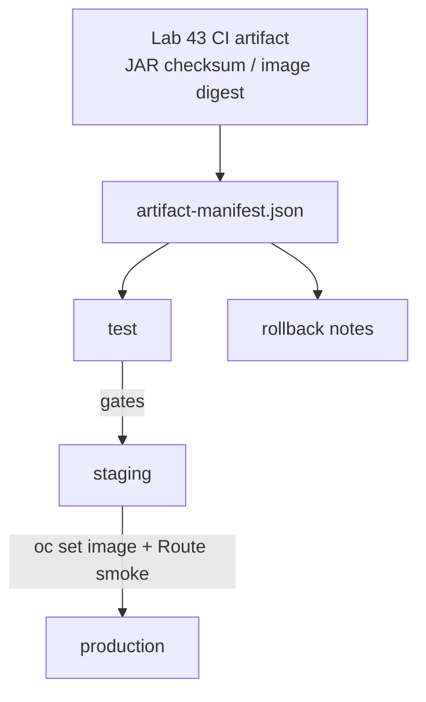

# Lab 44: Continuous Delivery and Environment Promotion — Northstar Release Path

**Module:** 44 — Continuous Delivery and Environment Promotion  
**Duration:** ~45 minutes (timed path with starter) · Full path: 3–4 Hours

**Primary IDE:** IntelliJ IDEA Community Edition · **Optional IDE:** VS Code

| OS | How-to for this lab |
| -- | ------------------- |
| Windows | [LAB-44-WINDOWS.md](LAB-44-WINDOWS.md) |
| macOS | [LAB-44-MACOS.md](LAB-44-MACOS.md) |

---

## Activity card

| | |
| --- | --- |
| **Time** | ~45 min timed · full path 3–4 h |
| **Checkpoint** | **E** (after Ex 1→2→3→5→4→6) |
| **Must prove** | Manifest digests · release plan/checklist · rollback known-good · no secrets in artifact |
| **Hard gate** | Pre-lab Pass · Lab 43 package-once identity |

### What you will learn

Promote one immutable CRM artifact through environments with objective gates, evidence, and rehearsed rollback.

### Enterprise context

`:latest` or a rebuild on the deploy host is not a credit-worthy production candidate.

### Predict

Staging digest ≠ manifest digest — promote to prod or stop?

### Debug

Promote script runs `mvn package` again — what broke?

---

## 45-minute timed path (use starter)

> **Pacing reminder:** [PACING.md](../PACING.md) checkpoint **E**. Homework: staging smoke evidence, NO-GO/rollback rehearsal, complete docs.

In class, use the starter templates so the **core** objectives fit **~45 minutes**. The full Steps below remain for homework / extended depth.

1. Open [`starter/README.md`](starter/README.md).
2. Copy `starter/` into your `java-bootcamp/examples/…` target (see starter README).
3. Fill every `// TODO` / `TODO` — do **not** wait on a perfect prior lab; the starter includes a baseline.
4. Run the starter smoke test. Commit your work to your GitHub repo (no screenshots).
5. Check timed-path Pass criteria in the starter README yourself (do not write the marks down). Continue remaining GUIDE steps as homework if needed.

| Path | Time | Scope |
| ---- | ---- | ----- |
| **Timed (default)** | ~45 min | Starter TODOs + smoke test |
| **Full (extended)** | see Duration | Every Step in this GUIDE |

---

## What you'll complete (practice only)

Labs and exercises are **practice only**. Nothing is submitted or graded. Do not take screenshots. Check Pass/Fail yourself — do not write those marks anywhere. Commit your work to your private `java-bootcamp` GitHub repo.

Keep this checklist visible while you work.

| # | Deliverable |
| - | ----------- |
| 1 | `docs/release-plan.md` |
| 2 | `docs/release-checklist.md` |
| 3 | `docs/rollback-runbook.md` |
| 4 | `artifact-manifest.json` |
| 5 | Staging promotion evidence (digest + smoke) |
| 6 | Controlled failure / NO-GO or rollback rehearsal |
| 7 | No secrets or real customer records committed |

**Commit to your GitHub repo:** the items in the table above (sources + evidence + short notes).

**Do not commit:** `target/`, `node_modules/`, secrets, heap dumps, or a copied answer keys.

## Lab Overview

This Module 44 lab turns CI success into **continuous delivery** for the **Customer Management Platform**: one immutable artifact promoted through test → staging → production with objective gates, approvals, release evidence, and rehearsed rollback. You will produce `docs/release-plan.md`, `docs/release-checklist.md`, `docs/rollback-runbook.md`, and `artifact-manifest.json`, plus staging evidence.

## Learning Objectives

After completing this lab, you will be able to:

* Distinguish continuous delivery (releasable always) from continuous deployment (auto-prod)
* Promote artifacts by digest/checksum rather than rebuilding
* Separate environment configuration from immutable application bits
* Define objective, measurable release gates with evidence links
* Write release and rollback checklists operators can execute under stress

## Business Scenario

The CRM release has passed CI (Lab 43). The organization needs confidence that the artifact tested in staging is exactly the artifact deployed later, with environment configuration separated and recovery prepared.

Week’s leadership question: “If staging said GO on digest X, can we prove production is X—and roll back to Y in under N minutes?” You own that answer for Northstar’s release of customer APIs serving agents who look up Amina and Ravi.

Use these examples consistently:

| ID | Name | Notes |
| -- | ---- | ----- |
| `CUS-1001` | Amina Khan | `ACTIVE` — staging smoke read/update target |
| `CUS-1002` | Ravi Singh | `PROSPECT` → activate path in smoke if allowed |
| `lab-request-001` | — | correlation on smoke API calls |
| `sha256:…` / JAR SHA | — | immutable artifact identity in manifest |
| `1.3.2` | — | prior known-good rollback target (example) |

**Security note for evidence.** Fictional customers only. Never commit kubeconfig, Terraform state, `.env`, or registry credentials. Redact URLs that embed tokens. Prefer screenshots of readiness and smoke JSON with fixtures—not production dumps.

---

## Architecture Context
### NOW (this lab)



## Prerequisites

Prior labs: [Lab 43](../../module-43/lab43/LAB-43-GUIDE.md).

Confirm (Lab 0 tools assumed):

* Lab 43 pipeline building successfully with package-once evidence
* Environments or variables per instructor (test / staging / prod names)
* Artifact promotion path defined (registry, GitHub Environments, OpenShift Project)
* `oc` CLI or Console-only path as the instructor directs (no local OpenShift/k3s)
* No secrets committed to Git

### Pre-flight

```bash
java -version
mvn -version
```

## Worked example (read before you code)

Study this pattern once before Step 1. Your job is to apply the same idea in the Steps — do not skip ahead to a full solution.

```bash
set -eu
: "${RELEASE_DIGEST:?release digest is required}"
# Adapt Project names to the instructor-hosted OpenShift
oc set image deployment/crm-api \
  crm-api="registry.example.com/training/crm-api@${RELEASE_DIGEST}"
oc rollout status deployment/crm-api --timeout=180s
curl -fsS -H "X-Correlation-Id: lab-request-001" \
  "${CRM_BASE_URL}/actuator/health/readiness"
# Smoke fixtures (adapt Route hostname — not localhost)
curl -fsS -H "X-Correlation-Id: lab-request-001" -u admin:change-me \
  "${CRM_BASE_URL}/api/customers/CUS-1001"
```

**What to notice:** Match names, IDs, and failure behavior from the scenario — instructors check these.

---

## Implementation Steps

Complete each step in order. Commands assume `~/java-bootcamp/examples/lab44-crm` (Windows: `%USERPROFILE%\java-bootcamp\examples\lab44-crm`) unless noted. Parts 1–8 map to Steps 1–8; Step 9 closes experiments.

---

### Step 1 — Map release flow (Part 1)

**Why:** Unnamed handoffs produce “someone thought prod was updated” outages.

**Do this:** Copy Lab 43 work forward and draw commit → build → registry → test → staging → production handoffs in `docs/release-plan.md`. Name approvers and evidence at each gate. Identify where a rebuild or mutable tag could break traceability.

```bash
cd ~/java-bootcamp/examples
cp -r lab43-crm lab44-crm
cd lab44-crm
mkdir -p docs
git switch -c lab/44-crm 2>/dev/null || true
```

**Expected result:** Diagram or ordered list with owners, evidence, and anti-rebuild notes.

**If it fails:** Flow that says “rebuild on each environment” → redesign around one artifact.

---

### Step 2 — Define immutable identity (Part 2)

**Why:** Without digest identity, rollback and forensics are guesses.

**Do this:** Choose semantic version and commit labels. Calculate JAR checksum and record image digest if containers are used. Prohibit `latest` and environment-specific rebuilds. Create `artifact-manifest.json`:

```json
{
  "application": "crm-api",
  "version": "1.4.0",
  "gitCommit": "<GITHUB_SHA>",
  "jarSha256": "<hex-from-Lab43-SHA256SUMS>",
  "imageRepository": "registry.example.com/training/crm-api",
  "imageDigest": "sha256:<registry-digest>",
  "builtBy": "lab43-ci"
}
```

Fill real values from Lab 43 artifacts (replace placeholders deliberately). Wire promotion in `.github/workflows/cd.yml` (starter): `workflow_dispatch` with environment + `artifact_digest`, compare against this manifest, then `oc set image … registry.example.com/training/crm-api@sha256:…` — never rebuild with Maven on the deploy agent. Timed path with no cluster: validate JSON + workflow; live `oc` is homework.

```bash
sha256sum target/*.jar
```

**Expected result:** Manifest with concrete checksum/digest and commit; no `latest`.

**If it fails:** Missing digests → pull from registry or CI artifacts before continuing.

---

### Step 3 — Separate configuration (Part 3)

**Why:** Baking staging URLs into the JAR guarantees the wrong backend in prod.

**Do this:** In `docs/release-plan.md`, list values that vary by environment (DB URL, Kafka bootstrap, base URLs, feature flags). Keep secrets outside artifacts and committed manifests. Assign configuration ownership and safe defaults (fail closed on missing secrets).

**Expected result:** Explicit config inventory per env; secrets mechanism named (GitHub secured vars / cluster Secret)—values not committed.

**If it fails:** Password in ConfigMap YAML → move to Secret / secured var and scrub Git.

---

### Step 4 — Create promotion gates (Part 4)

**Why:** Subjective “looks good” approvals do not survive audit or 2 a.m. handoffs.

**Do this:** In `docs/release-checklist.md`, require tests, scan results, migration review, smoke checks, and approval. Define measurable pass/fail criteria. Preserve links and approver timestamps.

Example go/no-go fragment:

```markdown
_Check **Pass** or **Fail** yourself. Do not write these marks anywhere — nothing is submitted or graded. Commit your work to your GitHub repo._

| # | Confirm | Self-check |
| - | ------- | ---------- |
| 1 | Artifact digest verified against artifact-manifest.json | Pass / Fail |
| 2 | Automated gates passed (CI verify + scan) | Pass / Fail |
| 3 | Database migration reviewed | Pass / Fail |
| 4 | Staging smoke: CUS-1001 / CUS-1002 with lab-request-001 | Pass / Fail |
| 5 | Rollback target confirmed (prior digest) | Pass / Fail |
| 6 | On-call owner acknowledged | Pass / Fail |
- Decision: GO / NO-GO
- Approver and timestamp:
- Evidence links:
```

**Expected result:** Checklist with objective criteria and evidence slots.

**If it fails:** Vague “QA approved” with no links → reject and require evidence URLs/paths.

---

### Step 5 — Plan database compatibility (Part 5)

**Why:** App rollback cannot undo destructive migrations; teams learn this the hard way.

**Do this:** Document expand-before-contract migrations in `docs/release-plan.md`. State backward and forward compatibility assumptions between app versions `1.3.2` and `1.4.0` (example). Explain rollback limits after data changes (when digest rollback is insufficient).

**Expected result:** Explicit migration compatibility section and rollback limits.

**If it fails:** “Just roll back the pod” after DROP COLUMN → rewrite limits before GO.

---

### Step 6 — Rehearse staging release (Part 6)

**Why:** First-time promotion should not be production.

**Do this:** Promote the **exact** tested digest to staging (script or `oc set image` by digest). Run smoke and synthetic checks for CRM fixtures. Observe errors, latency, readiness, and Kafka lag if in scope. Smoke the **Route** hostname (Lab 42), not `localhost`.

Promotion guard pattern:

```bash
set -eu
: "${RELEASE_DIGEST:?release digest is required}"
# Adapt Project names to the instructor-hosted OpenShift
oc set image deployment/crm-api \
  crm-api="registry.example.com/training/crm-api@${RELEASE_DIGEST}"
oc rollout status deployment/crm-api --timeout=180s
curl -fsS -H "X-Correlation-Id: lab-request-001" \
  "${CRM_BASE_URL}/actuator/health/readiness"
# Smoke fixtures (adapt Route hostname — not localhost)
curl -fsS -H "X-Correlation-Id: lab-request-001" -u admin:change-me \
  "${CRM_BASE_URL}/api/customers/CUS-1001"
```

Capture staging commit to GitHub (no screenshots).

**Expected result:** Staging running the manifest digest; smoke green for fixtures; evidence saved.

**If it fails:** Deployed `:latest` instead of digest → stop; fix to digest promote; redo smoke.

---

### Step 7 — Practice rollback (Part 7)

**Why:** Untested rollback is fiction.

**Do this:** In `docs/rollback-runbook.md`, define trigger thresholds (error rate, readiness, lag) and decision authority. Redeploy the previous known-good digest (example `1.3.2`). Verify service, data, and event compatibility. Record timing.

```bash
# Example — replace with your known-good digest from the manifest history
export ROLLBACK_DIGEST="sha256:<prior-known-good>"
# reuse promote path pointing at ROLLBACK_DIGEST
```

**Expected result:** Rollback runbook with triggers, commands, verification, and rehearsal note.

**If it fails:** Rollback doc without verification → add curl/readiness/fixture checks.

---

### Step 8 — Complete release record (Part 8)

**Why:** Support and auditors need one coherent story after the window closes.

**Do this:** Write release notes and known issues in `docs/release-plan.md` (or adjacent notes). Include support contacts and change references. Record go or no-go with evidence links and residual risks (owner + date).

**Expected result:** Complete packet: plan, checklist with decision, rollback runbook, manifest, staging evidence.

**If it fails:** Decision logged without evidence links → backfill before submission.

---

### Step 9 — Failure experiments + evidence pack

**Why:** Promotion theater without adverse checks fails production on day one.

**Do this:** Complete Failure Experiments. Ensure `git status` is clean of secrets. Ask a peer to follow the rollback runbook dry-run. Add this close-out block to `docs/release-checklist.md`:

```markdown
## Evidence pack pass criteria

_Check **Pass** or **Fail** yourself. Do not write these marks anywhere — nothing is submitted or graded. Commit your work to your GitHub repo._

| # | Confirm | Self-check |
| - | ------- | ---------- |
| 1 | artifact-manifest.json filled | Pass / Fail |
| 2 | staging digest screenshot / command output | Pass / Fail |
| 3 | smoke with CUS-1001, CUS-1002, lab-request-001 | Pass / Fail |
| 4 | rollback rehearsal note (time + verifier) | Pass / Fail |
| 5 | residual risks with owners | Pass / Fail |
```

**Expected result:** ≥3 experiments; peer confirmation; sanitized evidence.

**If it fails:** See Troubleshooting.

---

## Implementation Checkpoints

### Checkpoint A — Tooling

_Check **Pass** or **Fail** yourself. Do not write these marks anywhere — nothing is submitted or graded. Commit your work to your GitHub repo._

| # | Confirm | Self-check |
| - | ------- | ---------- |
| 1 | `lab44-crm` under `examples/` | Pass / Fail |
| 2 | Lab 43 artifact identity available | Pass / Fail |
| 3 | Environment access / variables confirmed (or documented substitute) | Pass / Fail |

### Checkpoint B — Core CD design

_Check **Pass** or **Fail** yourself. Do not write these marks anywhere — nothing is submitted or graded. Commit your work to your GitHub repo._

| # | Confirm | Self-check |
| - | ------- | ---------- |
| 1 | Release flow mapped with owners | Pass / Fail |
| 2 | `artifact-manifest.json` with digest/checksum | Pass / Fail |
| 3 | Env config separated; secrets not in artifact | Pass / Fail |

### Checkpoint C — Gates + rehearsal

_Check **Pass** or **Fail** yourself. Do not write these marks anywhere — nothing is submitted or graded. Commit your work to your GitHub repo._

| # | Confirm | Self-check |
| - | ------- | ---------- |
| 1 | Objective checklist with measurable criteria | Pass / Fail |
| 2 | Staging promote by digest + smoke (`CUS-1001` / `CUS-1002`) | Pass / Fail |
| 3 | Rollback rehearsal to known-good digest | Pass / Fail |

### Checkpoint D — Hygiene

_Check **Pass** or **Fail** yourself. Do not write these marks anywhere — nothing is submitted or graded. Commit your work to your GitHub repo._

| # | Confirm | Self-check |
| - | ------- | ---------- |
| 1 | GO/NO-GO recorded with evidence | Pass / Fail |
| 2 | `docs/rollback-runbook.md` complete | Pass / Fail |
| 3 | No secrets / kubeconfig / state files committed | Pass / Fail |

---

## Reference Commands, Configuration, and Code

### Promotion guard

```bash
set -eu
: "${RELEASE_DIGEST:?release digest is required}"
: "${CRM_BASE_URL:?}"
oc set image deployment/crm-api \
  crm-api="registry.example.com/training/crm-api@${RELEASE_DIGEST}"
oc rollout status deployment/crm-api --timeout=180s
curl -fsS -H "X-Correlation-Id: lab-request-001" \
  "${CRM_BASE_URL}/actuator/health/readiness"
curl -fsS -H "X-Correlation-Id: lab-request-001" -u admin:change-me \
  "${CRM_BASE_URL}/api/customers/CUS-1001" | head
curl -fsS -H "X-Correlation-Id: lab-request-001" -u admin:change-me \
  "${CRM_BASE_URL}/api/customers/CUS-1002" | head
```

### Rollback triggers (copy into `docs/rollback-runbook.md`)

**Triggers**

- Readiness failing > 3m
- Error rate above threshold
- Kafka lag critical (see Lab 46 notes)

**Authority**

- Release commander decides; on-call executes

**Steps**

1. Confirm current digest != known-good
2. Promote knownGoodPrevious.imageDigest with `oc set image` (or `oc rollout undo`)
3. Verify readiness + CUS-1001/CUS-1002 smoke on the Route
4. Record time-to-recover

**Limits**

- If migration is not backward compatible, stop and escalate

### Release-plan outline

```markdown
# Release plan 1.4.0
## Flow

commit → CI artifact → test → staging → prod
## Approvers

- Staging: <role>
- Prod: <role>
## Config per env

- DB URL, Kafka bootstrap, base URL (secrets via secured vars)
## DB compatibility

- Expand/contract notes:
## Watch window

- 60 minutes: errors, latency, lag, support volume
```

### Smoke script sketch (`scripts/smoke-crm.sh`)

```bash
#!/usr/bin/env bash
set -euo pipefail
: "${CRM_BASE_URL:?}"
CORR="${CORR:-lab-request-001}"
AUTH="${AUTH:-admin:change-me}"
for id in CUS-1001 CUS-1002; do
  echo "GET $id"
  curl -fsS -H "X-Correlation-Id: ${CORR}" -u "${AUTH}" \
    "${CRM_BASE_URL}/api/customers/${id}" >/dev/null
done
curl -fsS -H "X-Correlation-Id: ${CORR}" \
  "${CRM_BASE_URL}/actuator/health/readiness"
echo "smoke ok corr=${CORR}"
```

Record exit codes in staging evidence. If endpoints differ in your CRM, adapt paths—keep fixtures and correlation stable.

### Commands

```bash
cd ~/java-bootcamp/examples/lab44-crm
python3 -c "import json; json.load(open('artifact-manifest.json'))"
# Do not mvn package here — promote the Lab 43 identity
echo "Compare manifest imageDigest to deployed Deployment image"
oc get deploy crm-api -o jsonpath='{.spec.template.spec.containers[0].image}{"\n"}' 2>/dev/null || true
chmod +x scripts/smoke-crm.sh 2>/dev/null || true
# CRM_BASE_URL=https://<route-host> AUTH=admin:change-me ./scripts/smoke-crm.sh
git status --short
```

### Evidence log template

```markdown
# Lab 44 Evidence Log
- Manifest version/digest:
- Staging promote time (UTC):
- Smoke correlation: lab-request-001
## Results

| Check | Result | Evidence |
| ----- | ------ | -------- |
| Digest match | PASS/FAIL | |
| Staging smoke CUS-1001 | PASS/FAIL | |
| Staging smoke CUS-1002 | PASS/FAIL | |
| Rollback rehearsal | PASS/FAIL | |
| GO/NO-GO recorded | PASS/FAIL | |
```

### Document map

| Document | Role |
| -------- | ---- |
| `docs/release-plan.md` | Flow, compatibility, release notes |
| `docs/release-checklist.md` | Gates + GO/NO-GO |
| `docs/rollback-runbook.md` | Triggers + restore known-good |
| `artifact-manifest.json` | Immutable identity |
| `scripts/promote.sh` / `smoke-crm.sh` | Repeatable promote + smoke |
| `notes/lab-44/` | Staging + rollback evidence |

---

## Failure Experiments

| # | Experiment | Observe | Restore |
| - | ---------- | ------- | ------- |
| 1 | Promote with wrong digest intentionally | Rollout or smoke fails / mismatch | Correct digest; re-smoke |
| 2 | Tabletop NO-GO (migration risk) | Checklist blocks prod | Document decision + owner |
| 3 | Roll back to prior digest | Readiness + fixtures recover | Leave known-good noted |
| 4 | Use `:latest` once (lab only) | Traceability broken | Ban latest; update runbook |
| 5 | Skip smoke checklist item | False confidence | Restore mandatory smoke |

---

## Troubleshooting

| Symptom | Likely cause | Fix |
| ------- | ------------ | --- |
| Staging digest ≠ manifest | Tag moved / rebuild | Pin digest; re-pull; never retag silently |
| Smoke 401/403 | Env secrets / auth drift | Fix config; do not weaken auth |
| Rollback incomplete | Migration not backward compatible | Follow expand/contract limits |
| Kafka lag after promote | Consumer incompatibility | Hold GO; check Lab 46 patterns |
| “Unauthorized” `oc` | Wrong Project / expired token | Confirm instructor `oc login`; no privilege broaden |
| Checklist unsigned | Process gap | Require approver field |
| Smoke passes, agents still fail | Synthetic path ≠ real traffic | Expand smoke; watch error budget |
| Manifest missing prior digest | Forgot known-good capture | Record prior digest before every promote |

## Security and Production Review

Optional — jot brief notes in your README if useful for your progress check (not a separate essay):

1. Which inputs are untrusted at promote time (human approval, registry contents)?
2. Where are authn/authz for prod deploy enforced?
3. Which values are sensitive in release evidence?

---


## Cleanup

```bash
cd ~/java-bootcamp/examples/lab44-crm
oc whoami 2>/dev/null || true
git status --short
```

Leave staging on instructor-approved version. Delete temporary secret files. Keep sanitized staging evidence.

**Keep `lab44-crm`**—Lab 45 may automate environment setup; do not discard promotion docs.


## Reflection Questions

Write **1–3 sentence** answers (not essays):

1. Which design decision most affected correctness (digest vs tag)?
2. What evidence proves staging and prod candidate are the same bits?
3. Which failure was hardest to diagnose?

---


