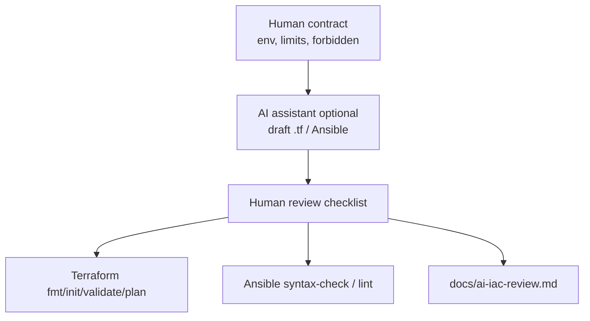

# Lab 45: Infrastructure as Code with AI Assistance — Northstar CRM Stack Sketches

**Module:** 45 — Infrastructure as Code with AI Assistance  
**Duration:** ~45 minutes (timed path with starter) · Full path: 4–5 Hours

**Primary IDE:** IntelliJ IDEA Community Edition · **Optional IDE:** VS Code

| OS | How-to for this lab |
| -- | ------------------- |
| Windows | [LAB-45-WINDOWS.md](LAB-45-WINDOWS.md) |
| macOS | [LAB-45-MACOS.md](LAB-45-MACOS.md) |

---

## Activity card

| | |
| --- | --- |
| **Time** | ~45 min timed · full path 4–5 h |
| **Checkpoint** | **E** (after Ex 1→2→3→4→5→6) |
| **Must prove** | Pinned providers · validate · no secrets/state in Git · Ansible syntax · AI review ≥1 harden/reject |
| **Hard gate** | Pre-lab Pass · contract forbids public DB |

### What you will learn

Draft Terraform + Ansible for CRM non-prod with AI assistance, then human-review for exposure, cost, and idempotence.

### Enterprise context

Valid HCL that opens a public database still fails—humans own the blast radius.

### Predict

Should `*.tfstate` ever be committed?

### Debug

AI invents resources outside the contract — what do you do?

---

## 45-minute timed path (use starter)

> **Pacing reminder:** [PACING.md](../PACING.md) checkpoint **E**. Homework: plan evidence, Ansible lint, complete `docs/ai-iac-review.md`.

In class, use the starter templates so the **core** objectives fit **~45 minutes**. The full Steps below remain for homework / extended depth.

1. Open [`starter/README.md`](starter/README.md).
2. Copy `starter/` into your `java-bootcamp/examples/…` target (see starter README).
3. Fill every `// TODO` / `TODO` — do **not** wait on a perfect prior lab; the starter includes a baseline.
4. Run the starter smoke test. Commit your work to your GitHub repo (no screenshots).
5. Check timed-path Pass criteria in the starter README yourself (do not write the marks down). Continue remaining GUIDE steps as homework if needed.

| Path | Time | Scope |
| ---- | ---- | ----- |
| **Timed (default)** | ~45 min | Starter TODOs + smoke test |
| **Full (extended)** | see Duration | Every Step in this GUIDE |

---

## What you'll complete (practice only)

Labs and exercises are **practice only**. Nothing is submitted or graded. Do not take screenshots. Check Pass/Fail yourself — do not write those marks anywhere. Commit your work to your private `java-bootcamp` GitHub repo.

Keep this checklist visible while you work.

| # | Deliverable |
| - | ----------- |
| 1 | `infra/terraform/*.tf` (structured, pinned providers) |
| 2 | `terraform.tfvars.example` |
| 3 | `infra/ansible/site.yml` |
| 4 | `inventory.example.yml` |
| 5 | `docs/ai-iac-review.md` with human corrections and validation evidence |
| 6 | Plan / lint evidence (or approved substitute) |
| 7 | No secrets, state files, or real customer data committed |

**Commit to your GitHub repo:** the items in the table above (sources + evidence + short notes).

**Do not commit:** `target/`, `node_modules/`, secrets, heap dumps, or a copied answer keys.

## Lab Overview

This Module 45 lab uses an AI coding assistant to draft **Terraform** and **Ansible** infrastructure sketches for the **Customer Management Platform**, then validates, threat-models, corrects, and documents every generated decision. You will produce `infra/terraform/*.tf`, `terraform.tfvars.example`, `infra/ansible/site.yml`, `inventory.example.yml`, and `docs/ai-iac-review.md`.

## Learning Objectives

After completing this lab, you will be able to:

* Write bounded IaC prompts that state assumptions and forbid secrets/public DBs
* Review generated Terraform and Ansible critically (not “it linted”)
* Model variables, validation, providers, and outputs safely
* Describe encrypted remote state and locking without committing backend credentials
* Create idempotent Ansible tasks with modules, handlers, ownership, and modes

## Business Scenario

The team wants faster environment setup for Northstar CRM (dev/test/stage). AI-generated infrastructure can be syntactically plausible while insecure, destructive, expensive, or non-idempotent. Human review remains accountable—especially before anything that could reach a cluster hosting customer APIs.

You are drafting non-production sketches so Lab 44 promotions land on predictable **OpenShift Projects** and hosts. Publicly exposed databases, hard-coded cloud keys, and “AI said apply” are unacceptable.

Use these examples consistently:

| ID | Name | Notes |
| -- | ---- | ----- |
| `CUS-1001` | Amina Khan | App fixture only—never in `.tf` / Ansible vars as PII |
| `CUS-1002` | Ravi Singh | App fixture only |
| `lab-request-001` | — | App correlation only |
| `crm-dev` / `crm-test` | — | example OpenShift Project names |
| `lab45-001` | — | AI review entry ID in `docs/ai-iac-review.md` |

**Security note for evidence.** Never commit `*.tfstate`, real `terraform.tfvars`, cloud keys, Ansible vault passwords, or kubeconfig. Commit `*.tfvars.example` and `inventory.example.yml` only. Redact plan outputs that show account IDs if instructor requires.

---

## Architecture Context
### NOW (this lab)



## Prerequisites

Prior labs: [Lab 44](../../module-44/lab44/LAB-44-GUIDE.md).

Confirm (Lab 0 tools assumed):

* Terraform 1.5+ (Ansible optional for timed-path syntax-check)
* OpenShift / cloud credentials only as the instructor directs — do **not** install CRC/k3s locally
* GitHub Copilot (or equivalent) optional for drafts
* `tflint` / `ansible-lint` if available
* No secrets committed to Git

### Pre-flight

```bash
terraform version
ansible-playbook --version 2>/dev/null || echo "ansible-playbook optional for timed path"
```

## Worked example (read before you code)

Study this pattern once before Step 1. Your job is to apply the same idea in the Steps — do not skip ahead to a full solution.

```yaml
- name: Northstar CRM host baseline
  hosts: crm
  become: true
  gather_facts: true
  vars:
    crm_app_user: crm
  tasks:
    - name: Ensure crm group exists
      ansible.builtin.group:
        name: "{{ crm_app_user }}"
        state: present
    - name: Ensure crm user exists
      ansible.builtin.user:
        name: "{{ crm_app_user }}"
        group: "{{ crm_app_user }}"
        state: present
        create_home: true
    - name: Placeholder — document package installs
      ansible.builtin.debug:
        msg: "Install JRE / agent packages per instructor baseline"
```

**What to notice:** Match names, IDs, and failure behavior from the scenario — instructors check these.

---

## Implementation Steps

Complete each step in order. Commands assume `~/java-bootcamp/examples/lab45-crm` (Windows: `%USERPROFILE%\java-bootcamp\examples\lab45-crm`) unless noted. Parts 1–8 map to Steps 1–8.

---

### Step 1 — Define infrastructure contract (Part 1)

**Why:** Unbounded AI prompts invent production VPCs, public RDS, and $10k NAT gateways.

**Do this:** Create the workspace and write the contract at the top of `docs/ai-iac-review.md`:

```bash
cd ~/java-bootcamp/examples
cp -r lab44-crm lab45-crm 2>/dev/null || mkdir -p lab45-crm
cd lab45-crm
git switch -c lab/45-crm 2>/dev/null || true
```

State environment, region, network expectations, runtime (**OpenShift Project** / VM — not local k3s), database posture (private PostgreSQL), tags, and cost limits. List **forbidden** resources and public exposure. Define outputs and evidence expected from AI (file list, assumptions section, review checklist).

**Expected result:** Written contract with forbidden list and cost/exposure limits.

**If it fails:** Contract says “whatever AI suggests” → rewrite with hard forbids before prompting.

---

### Step 2 — Draft with constrained prompts (Part 2)

**Why:** Lab 11-style false confidence returns when prompts omit safety constraints.

**Do this:** Ask AI for **small modules** and explicit assumptions. Prohibit hard-coded secrets and public databases. Request a review checklist with the draft. Save the prompt under entry `lab45-001` in `docs/ai-iac-review.md`. If AI is unavailable, hand-write sketches and mark “manual.”

Example prompt constraints (adapt):

```text
Generate Terraform for a non-prod OpenShift Project crm-${environment}
with labels application=crm. No public LoadBalancer DB. No plaintext secrets.
Pin provider versions. List assumptions. Include a human review checklist.
Do not install OpenShift, CRC, or k3s on the laptop.
```

**Expected result:** Draft files present; prompt archived; assumptions listed.

**If it fails:** AI emits AWS keys in code → reject immediately; rotate if pasted into chat logs per policy.

---

### Step 3 — Review Terraform structure (Part 3)

**Why:** Monolithic mystery `main.tf` hides destructive defaults.

**Do this:** Separate providers, variables, resources, and outputs. Pin compatible provider ranges. Inspect every resource, data source, and default. **Timed path / starter:** use `hashicorp/null` + `null_resource.crm_stack_sketch` (validate without cloud credentials):

```hcl
terraform {
  required_version = ">= 1.5.0"
  required_providers {
    null = {
      source  = "hashicorp/null"
      version = "~> 3.2"
    }
  }
}

resource "null_resource" "crm_stack_sketch" {
  triggers = {
    environment = var.environment
    region      = var.region
  }
}
```

When a cloud sandbox is authorized, replace `null_resource` with real modules. Full-path OpenShift sketch (a Project is a Kubernetes Namespace on the shared cluster — not local k3s):

```hcl
terraform {
  required_version = ">= 1.6"
  required_providers {
    kubernetes = { source = "hashicorp/kubernetes", version = "~> 2.0" }
  }
}
variable "environment" {
  type = string
  validation {
    condition     = contains(["dev", "test", "stage"], var.environment)
    error_message = "Use an approved non-production environment."
  }
}
resource "kubernetes_namespace_v1" "crm" {
  metadata {
    name = "crm-${var.environment}"
    labels = { application = "crm", environment = var.environment }
    annotations = { "openshift.io/display-name" = "Northstar CRM ${var.environment}" }
  }
}
output "openshift_project" { value = kubernetes_namespace_v1.crm.metadata[0].name }
```

**Expected result:** Structured files; pinned providers; human notes on each resource purpose. Starter validates with `null_resource.crm_stack_sketch` (`terraform validate` needs no `-var`; pass `db_password` only on `plan`/`apply`).

**If it fails:** Unpinned `version = "*"` → pin; mysterious resources outside contract → delete.

---

### Step 4 — Secure state and inputs (Part 4)

**Why:** State files and tfvars are secret stores whether you meant them to be or not.

**Do this:** Mark sensitive variables. Keep secret tfvars untracked. Add `terraform.tfvars.example` with fake placeholders only. Describe encrypted remote state and locking in `docs/ai-iac-review.md` without committing backend credentials. Update `.gitignore`:

```text
*.tfstate
*.tfstate.*
.terraform/
*.tfvars
!terraform.tfvars.example
```

**Expected result:** Example tfvars only; sensitive markings; state ignore rules; remote-state narrative.

**If it fails:** Real `terraform.tfvars` staged → unstage, scrub, rotate secrets.

---

### Step 5 — Validate Terraform plan (Part 5)

**Why:** `validate` is syntax; `plan` is the blast radius.

**Do this:**

```bash
cd ~/java-bootcamp/examples/lab45-crm/infra/terraform
terraform fmt -check -recursive || terraform fmt -recursive
terraform init -backend=false
terraform validate
# Plan optional for null_resource sketch; cloud plan only in authorized sandbox:
# terraform plan -var='environment=dev' -var='db_password=unused-local' -out=tfplan
terraform show -no-color tfplan | tee ../../notes/tfplan-excerpt.txt
```

Read every create, update, replace, and destroy. Estimate cost and identify privilege or exposure changes. Do **not** `apply` unless instructor explicitly approves a disposable target.

**Expected result:** Format clean; validate ok; plan excerpt saved; destroy/replace actions explained.

**If it fails:** Provider auth errors → use `-backend=false` and mocked/provider-less sketches, or instructor sandbox only.

---

### Step 6 — Draft Ansible configuration (Part 6)

**Why:** Shell-only playbooks are rarely idempotent and often leak secrets in logs.

**Do this:** Prefer modules over shell. Add handlers, ownership, modes, and privilege boundaries. Use `no_log` only for tasks that process secrets.

```yaml
- name: Northstar CRM host baseline
  hosts: crm
  become: true
  gather_facts: true
  vars:
    crm_app_user: crm
  tasks:
    - name: Ensure crm group exists
      ansible.builtin.group:
        name: "{{ crm_app_user }}"
        state: present
    - name: Ensure crm user exists
      ansible.builtin.user:
        name: "{{ crm_app_user }}"
        group: "{{ crm_app_user }}"
        state: present
        create_home: true
    - name: Placeholder — document package installs
      ansible.builtin.debug:
        msg: "Install JRE / agent packages per instructor baseline"
```

Create `inventory.example.yml` at the **lab root** (sibling of `infra/`) with fictional hosts only. Jinja templates under `infra/ansible/templates/` are optional full-path work.

**Expected result:** `infra/ansible/site.yml` + root `inventory.example.yml`; no real secrets. Syntax-check from lab root.

**If it fails:** Hard-coded password in playbook → move to vault/env; never commit vault pass.

---

### Step 7 — Test idempotence (Part 7)

**Why:** Config management that mutates every run creates change noise and outages.

**Do this:**

```bash
cd ~/java-bootcamp/examples/lab45-crm
ansible-playbook --syntax-check -i inventory.example.yml infra/ansible/site.yml
ansible-lint infra/ansible/site.yml 2>/dev/null || echo "ansible-lint not installed; note residual risk"
```

If a disposable authorized target exists, run once, run again, expect zero changes. Capture evidence. If no host is authorized, document syntax/lint as the training substitute and state residual risk.

**Expected result:** Syntax clean; lint clean or residual risk owned; idempotence evidence or documented substitute.

**If it fails:** Second run always “changed” → fix modules/statefulness before claiming idempotence.

---

### Step 8 — Write AI review record (Part 8)

**Why:** Undocumented AI acceptance recreates false-confidence culture at infra blast radius.

**Do this:** Complete `docs/ai-iac-review.md` with: prompt, generated excerpt, human corrections, validation evidence (`fmt`/`validate`/`plan`/`ansible-lint`), unresolved risk, and approval status. Record at least one rejected or hardened suggestion (`lab45-001`). If manual-only, mark N/A with rationale.

Checklist reminder:

1. Can every default fail closed if AI guessed wrong?
2. Are secrets absent from tracked files?
3. Is public exposure forbidden by contract enforced?
4. Are provider versions pinned?
5. Did a human read the plan actions?

**Expected result:** Dated review entry; reject/harden evidence; approval line signed (name/date).

**If it fails:** “LGTM” with no specifics → expand until a peer can reproduce your judgment.

---

### Step 9 — Failure experiments + evidence pack

**Why:** Safe hostility to AI output is the learning outcome.

**Do this:** Complete Failure Experiments. Ensure state/tfvars are gitignored. Capture sanitized plan/lint screenshots.

**Expected result:** ≥3 experiments; clean `git status`; review doc complete.

**If it fails:** See Troubleshooting.

---

## Implementation Checkpoints

### Checkpoint A — Tooling

_Check **Pass** or **Fail** yourself. Do not write these marks anywhere — nothing is submitted or graded. Commit your work to your GitHub repo._

| # | Confirm | Self-check |
| - | ------- | ---------- |
| 1 | `lab45-crm` with `infra/terraform` and `infra/ansible` | Pass / Fail |
| 2 | Terraform and Ansible versions recorded | Pass / Fail |
| 3 | `.gitignore` excludes state and secret tfvars | Pass / Fail |

### Checkpoint B — Core IaC

_Check **Pass** or **Fail** yourself. Do not write these marks anywhere — nothing is submitted or graded. Commit your work to your GitHub repo._

| # | Confirm | Self-check |
| - | ------- | ---------- |
| 1 | Contract + forbidden exposures documented | Pass / Fail |
| 2 | Terraform structured with validated variables | Pass / Fail |
| 3 | `terraform.tfvars.example` present (no real secrets) | Pass / Fail |

### Checkpoint C — Validation + AI discipline

_Check **Pass** or **Fail** yourself. Do not write these marks anywhere — nothing is submitted or graded. Commit your work to your GitHub repo._

| # | Confirm | Self-check |
| - | ------- | ---------- |
| 1 | `fmt` / `validate` / `plan` (or approved substitute) evidenced | Pass / Fail |
| 2 | Ansible syntax (+ lint if available) | Pass / Fail |
| 3 | `docs/ai-iac-review.md` with accept/reject notes | Pass / Fail |

### Checkpoint D — Hygiene

_Check **Pass** or **Fail** yourself. Do not write these marks anywhere — nothing is submitted or graded. Commit your work to your GitHub repo._

| # | Confirm | Self-check |
| - | ------- | ---------- |
| 1 | No `*.tfstate` / real tfvars / vault passwords committed | Pass / Fail |
| 2 | Idempotence evidence or residual risk owned | Pass / Fail |
| 3 | CRM PII fixtures not embedded in IaC | Pass / Fail |

---

## Reference Commands, Configuration, and Code

### Idempotent Ansible tasks (starter-aligned)

```yaml
- name: Northstar CRM host baseline
  hosts: crm
  become: true
  tasks:
    - name: Ensure crm group exists
      ansible.builtin.group:
        name: crm
        state: present
    - name: Ensure crm user exists
      ansible.builtin.user:
        name: crm
        group: crm
        state: present
        create_home: true
```

Jinja `template:` tasks are optional full-path; keep secrets out of playbooks.

## AI review outline (copy into `docs/ai-iac-review.md`)

```markdown
## Contract summary

- Forbidden: public DB, hard-coded secrets, unpinned providers, local k3s as the cluster
## Prompt (paste sanitized)
## Generated excerpt (short)
## Human corrections

1.
## Validation evidence

- terraform fmt/validate/plan:
- ansible syntax/lint:
## Rejected AI suggestion

- What / why unsafe:
## Residual risks / owners / dates
## Approval

- Name / date / decision:
```

### Validation commands

```bash
cd ~/java-bootcamp/examples/lab45-crm/infra/terraform
terraform fmt -check -recursive
terraform init -backend=false
terraform validate
# Plan optional for null_resource sketch; cloud plan only in authorized sandbox:
# terraform plan -var='environment=dev' -var='db_password=unused-local' -out=tfplan
terraform show -no-color tfplan
cd ../..
ansible-playbook --syntax-check -i inventory.example.yml infra/ansible/site.yml
ansible-lint infra/ansible/site.yml
```

### Evidence log template

```markdown
# Lab 45 Evidence Log
- Terraform version:
- Ansible version:
- AI used? Y/N (tool):
## Results

| Check | Result | Evidence |
| ----- | ------ | -------- |
| Contract written | PASS/FAIL | |
| fmt/validate | PASS/FAIL | |
| plan read | PASS/FAIL | |
| ansible syntax | PASS/FAIL | |
| AI reject/harden | PASS/FAIL | |
```

### Artifact map

| Artifact | Role |
| -------- | ---- |
| `infra/terraform/*.tf` | Declarative CRM env sketch |
| `terraform.tfvars.example` | Safe input template |
| `infra/ansible/site.yml` | Idempotent config sketch |
| `inventory.example.yml` | Fake inventory |
| `docs/ai-iac-review.md` | AI accountability record |
| `notes/tfplan-excerpt.txt` | Sanitized plan evidence |

---

## Failure Experiments

| # | Experiment | Observe | Restore |
| - | ---------- | ------- | ------- |
| 1 | Temporarily allow `0.0.0.0/0` in a draft | Review must catch and reject | Remove; document rejection |
| 2 | Break a variable validation | `plan`/`validate` fails clearly | Fix validation |
| 3 | Commit a fake secret string then scrub | Shows leak risk | Remove; improve `.gitignore` |
| 4 | Convert a task to raw `shell` | Idempotence/lint suffers | Restore module |
| 5 | Ask AI for “prod open RDS” | Must refuse/reject vs contract | Keep contract primacy |

---

## Troubleshooting

| Symptom | Likely cause | Fix |
| ------- | ------------ | --- |
| Provider auth failures | No cloud creds in training | `-backend=false`; OpenShift Project sketch only with instructor kubeconfig; never local k3s |
| `fmt` fails CI style | Unformatted HCL | `terraform fmt -recursive` |
| Plan wants destroy | Name/state drift | Read carefully; do not apply blindly |
| Ansible host unreachable | Example inventory only | Syntax-check only; document residual risk |
| AI invents resources | Weak prompt | Re-prompt within contract; delete extras |
| State accidentally created | Local backend | Delete local state; ensure ignore rules |
| Lint not installed | Image gap | Note residual risk; still run syntax-check |
| Public DB / 0.0.0.0/0 from AI | Exposure | Reject; harden SG; re-validate |

## Security and Production Review

Optional — jot brief notes in your README if useful for your progress check (not a separate essay):

1. Which inputs are untrusted (AI output, community modules)?
2. Where are authn/authz for apply enforced (human approval, CI roles)?
3. Which values are sensitive in state and logs?

---


## Cleanup

```bash
cd ~/java-bootcamp/examples/lab45-crm
# Do not destroy instructor-shared shared infra without approval
rm -f infra/terraform/tfplan
rm -rf infra/terraform/.terraform
git status --short
```

Delete any local state created accidentally. Keep sanitized plan excerpts.

**Keep `lab45-crm`**—Capstone and later hardening may reuse these modules as starting points.


## Reflection Questions

Write **1–3 sentence** answers (not essays):

1. Which design decision most affected safety (contract vs AI draft)?
2. What evidence proves you read the plan, not only validated syntax?
3. Which failure was hardest to diagnose?

---


