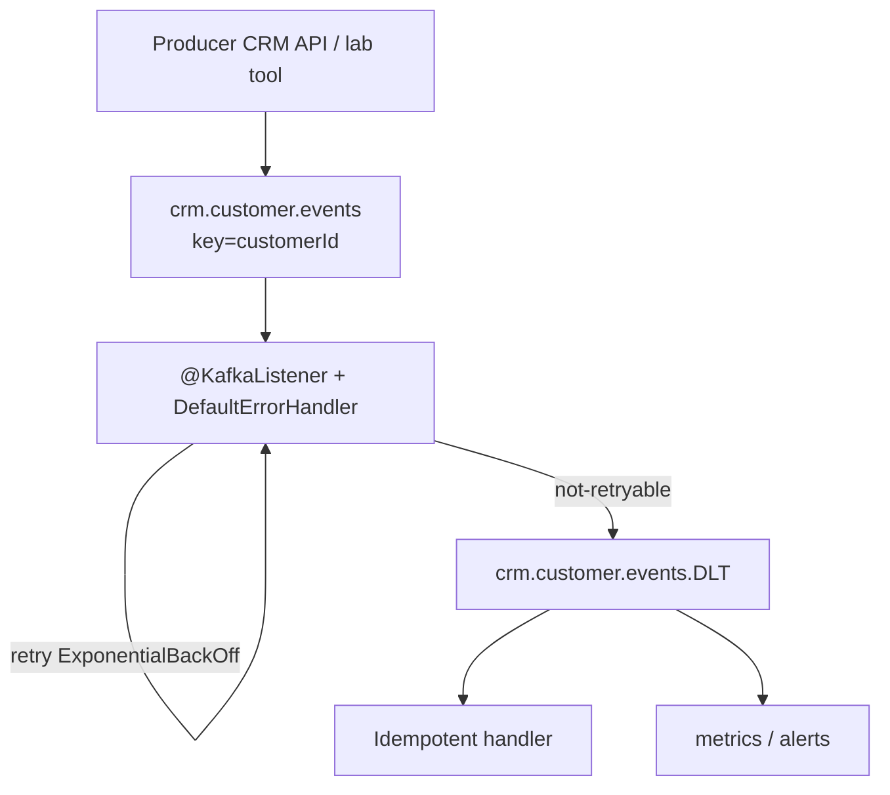

# Lab 46: Kafka Resilience and Observability — Northstar CRM Event Paths

**Module:** 46 — Kafka Resilience and Observability  
**Duration:** ~45 minutes (timed path with starter) · Full path: 4–5 Hours

**Primary IDE:** IntelliJ IDEA Community Edition · **Optional IDE:** VS Code

| OS | How-to for this lab |
| -- | ------------------- |
| Windows | [LAB-46-WINDOWS.md](LAB-46-WINDOWS.md) |
| macOS | [LAB-46-MACOS.md](LAB-46-MACOS.md) |

---

## Activity card

| | |
| --- | --- |
| **Time** | ~45 min timed · full path 4–5 h |
| **Checkpoint** | **E** (after Ex 1→4→2→3→5→6) |
| **Must prove** | Bounded retry + DLT · not-retryable classification · dashboard signals · dry-run replay |
| **Hard gate** | Pre-lab Pass · basic Kafka produce/consume available |

### What you will learn

Make CRM Kafka consumers failure-tolerant with DLT, idempotency, lag/metrics, and a safe replay runbook.

### Enterprise context

Silent infinite retry while lag grows is a failing grade—poison must be diagnosable.

### Predict

Should malformed events stay on the main topic forever?

### Debug

Poison event produced but DLT empty — what is unwired?

---

## 45-minute timed path (use starter)

> **Pacing reminder:** [PACING.md](../PACING.md) checkpoint **E**. Homework: poison→DLT evidence, metrics/lag, replay dry-run, tests.

In class, use the starter templates so the **core** objectives fit **~45 minutes**. The full Steps below remain for homework / extended depth.

1. Open [`starter/README.md`](starter/README.md).
2. Copy `starter/` into your `java-bootcamp/examples/…` target (see starter README).
3. Fill every `// TODO` / `TODO` — do **not** wait on a perfect prior lab; the starter includes a baseline.
4. Run the starter smoke test. Commit your work to your GitHub repo (no screenshots).
5. Check timed-path Pass criteria in the starter README yourself (do not write the marks down). Continue remaining GUIDE steps as homework if needed.

| Path | Time | Scope |
| ---- | ---- | ----- |
| **Timed (default)** | ~45 min | Starter TODOs + smoke test |
| **Full (extended)** | see Duration | Every Step in this GUIDE |

---

## What you'll complete (practice only)

Labs and exercises are **practice only**. Nothing is submitted or graded. Do not take screenshots. Check Pass/Fail yourself — do not write those marks anywhere. Commit your work to your private `java-bootcamp` GitHub repo.

Keep this checklist visible while you work.

| # | Deliverable |
| - | ----------- |
| 1 | Kafka error-handler configuration (retry + DLT) |
| 2 | DLT inspection evidence |
| 3 | `docs/kafka-dashboard.md` |
| 4 | `docs/dlt-replay-runbook.md` |
| 5 | Failure and recovery tests |
| 6 | Metrics/lag evidence |
| 7 | No secrets or real customer PII committed |

**Commit to your GitHub repo:** the items in the table above (sources + evidence + short notes).

**Do not commit:** `target/`, `node_modules/`, secrets, heap dumps, or a copied answer keys.

## Lab Overview

This Module 46 lab makes CRM Kafka consumers **diagnosable and failure-tolerant** using bounded retries, a dead-letter topic (DLT), idempotent handling, consumer-lag monitoring, and actionable Micrometer metrics. You will configure Spring Kafka error handling, capture DLT inspection evidence, document a dashboard, write `docs/dlt-replay-runbook.md`, and add failure/recovery tests.

## Learning Objectives

After completing this lab, you will be able to:

* Classify consumer failures (validation, deserialization, timeout, DB, authz)
* Configure bounded retry and dead-letter behavior in Spring Kafka
* Preserve correlation and original-topic diagnostics without leaking PII
* Measure consumer lag and expose Micrometer/Prometheus metrics
* Design dashboard panels and alert thresholds tied to user impact

## Business Scenario

A malformed customer event repeatedly blocks processing while lag grows unnoticed. Agents opening profiles for Amina (`CUS-1001`) see stale data; Ravi’s (`CUS-1002`) status projection never advances. The team needs failure classification, safe recovery, and evidence that replay will not duplicate business side effects (double emails, double ledger posts—whatever your CRM consumer owns).

Use these examples consistently:

| ID | Name | Notes |
| -- | ---- | ----- |
| `CUS-1001` | Amina Khan | `ACTIVE` — projection / event fixture |
| `CUS-1002` | Ravi Singh | `PROSPECT` — status-change events |
| `lab-request-001` | — | correlation header / MDC |
| `crm.customer.events` | — | primary topic (adapt name) |
| `crm.customer.events.DLT` | — | dead-letter topic |
| `crm-customer-projection-v1` | — | consumer group example |

**Security note for evidence.** Console-consume with headers for lab topics only. Never dump production topics. Redact tokens. Prefer customer **IDs** over names in logs and metrics tags (bounded cardinality—no raw emails as tag values).

---

## Architecture Context
### NOW (this lab)



## Prerequisites

Prior labs: [30](../../../Week%204%20-%20Kafka,%20Angular,%20Oracle%20and%20Resilience/module-30/lab30/LAB-30-GUIDE.md) · [31](../../../Week%204%20-%20Kafka,%20Angular,%20Oracle%20and%20Resilience/module-31/lab31/LAB-31-GUIDE.md).

Confirm (Lab 0 tools assumed):

* Kafka available (Docker Compose or instructor cluster)
* Spring Boot CRM consumers compiling
* Actuator/Prometheus exposure allowed in lab profile
* Docker + monitoring endpoints as per lab
* No secrets committed to Git

### Pre-flight

```bash
java -version
mvn -version
```

## Worked example (read before you code)

Study this pattern once before Step 1. Your job is to apply the same idea in the Steps — do not skip ahead to a full solution.

```bash
curl -fsS http://localhost:8080/actuator/prometheus | head
kafka-consumer-groups.sh --bootstrap-server localhost:9092 \
  --group crm-customer-projection-v1 --describe
```

**What to notice:** Match names, IDs, and failure behavior from the scenario — instructors check these.

---

## Implementation Steps

Complete each step in order. Commands assume `~/java-bootcamp/examples/lab46-crm` (Windows: `%USERPROFILE%\java-bootcamp\examples\lab46-crm`) unless noted. Parts 1–8 map to Steps 1–8.

---

### Step 1 — Map event flows (Part 1)

**Why:** You cannot alert or replay what you have not named.

**Do this:**

```bash
cd ~/java-bootcamp/examples
cp -r lab31-crm lab46-crm 2>/dev/null || cp -r lab30-crm lab46-crm 2>/dev/null || mkdir -p lab46-crm
cd lab46-crm
mkdir -p docs
git switch -c lab/46-crm 2>/dev/null || true
```

In `docs/kafka-dashboard.md`, list producer, topic, partition key, group, side effect, and owner. Document delivery and ordering assumptions. Identify sensitive fields that must not enter logs (email, phone, tokens).

**Expected result:** Event-flow table for CRM customer events with owners and redaction rules.

**If it fails:** Unknown side effects → stop and reverse-engineer the listener before coding DLT.

---

### Step 2 — Define failure policy (Part 2)

**Why:** Retrying deserialization errors forever burns CPU and lag SLO.

**Do this:** Classify validation, deserialization, timeout, database, and authorization failures. Choose retryable exceptions. Set bounded attempts, backoff, and time budget. Record the policy in `docs/dlt-replay-runbook.md`.

Example policy snippet:

```text
IllegalArgumentException / JsonParseException → not retryable → DLT
Transient DataAccessResourceFailureException → retry with backoff
Max elapsed retry budget: 10s (lab) / document prod values separately
```

**Expected result:** Written classification with retryable vs not-retryable lists.

**If it fails:** Everything marked retryable → revise before implementing the handler.

---

### Step 3 — Configure retry and DLT (Part 3)

**Why:** Without a recoverer, exhausted retries may seek/stop/loop depending on defaults.

**Do this:** Configure `DeadLetterPublishingRecoverer` and `DefaultErrorHandler`. Route exhausted records to a named DLT. Prevent infinite retry loops.

```java
import org.apache.kafka.common.TopicPartition;
import org.springframework.context.annotation.Bean;
import org.springframework.kafka.core.KafkaTemplate;
import org.springframework.kafka.listener.DeadLetterPublishingRecoverer;
import org.springframework.kafka.listener.DefaultErrorHandler;
import org.springframework.util.backoff.ExponentialBackOff;

@Bean
DefaultErrorHandler kafkaErrorHandler(KafkaTemplate<Object, Object> template) {
  var recoverer = new DeadLetterPublishingRecoverer(template,
      (record, ex) -> new TopicPartition(record.topic() + ".DLT", record.partition()));
  var backoff = new ExponentialBackOff(500L, 2.0);
  backoff.setMaxElapsedTime(10_000L);
  var handler = new DefaultErrorHandler(recoverer, backoff);
  handler.addNotRetryableExceptions(IllegalArgumentException.class);
  return handler;
}
```

Wire the handler into concurrent Kafka listener container factory (as taught in class). Create the DLT if auto-create is disabled.

**Expected result:** Poison messages reach `*.DLT` after bounded retries; main consumer continues.

**If it fails:** Infinite retry → verify not-retryable list and max elapsed time; check recoverer bean wiring.

---

### Step 4 — Preserve diagnostics (Part 4)

**Why:** A DLT without headers is a black hole.

**Do this:** Carry event and correlation IDs (`lab-request-001`). Record original topic, partition, offset, exception type, and timestamp (Spring Kafka DLT headers help). Redact tokens and customer details from custom log lines—log `CUS-1001`, not email.

Produce a poison payload intentionally and inspect:

```bash
kafka-console-consumer.sh --bootstrap-server localhost:9092 \
  --topic crm.customer.events.DLT --from-beginning \
  --property print.headers=true --max-messages 10
```

Save sanitized commit to GitHub (no screenshots).

**Expected result:** DLT records show diagnostic headers; correlation present; no secrets/PII dumps.

**If it fails:** Empty DLT → handler not registered or wrong topic naming; fix before metrics work.

---

### Step 5 — Make handling idempotent (Part 5)

**Why:** At-least-once + replay without dedupe doubles side effects.

**Do this:** Deduplicate by event ID or business key (`customerId` + event type + version). Store processed-event evidence transactionally where practical. Test duplicates and rebalance behavior with tests that republish the same event for `CUS-1002`.

**Expected result:** Second delivery is a no-op (or safe merge); test proves it.

**If it fails:** Deduped only in memory → document restart risk; prefer durable store for credit.

---

### Step 6 — Expose metrics (Part 6)

**Why:** Lag you cannot scrape is lag you will learn about from angry agents.

**Do this:** Count processed, failed, retried, and DLT records. Time handler latency and expose consumer lag (Micrometer Kafka binders / custom gauges as taught). Use bounded-cardinality metric tags (`topic`, `outcome`)—never per-email tags.

```yaml
spring:
  kafka:
    consumer:
      group-id: crm-customer-projection-v1
      enable-auto-commit: false
      properties:
        isolation.level: read_committed
        max.poll.interval.ms: 300000
    listener:
      ack-mode: record
management:
  endpoints.web.exposure.include: health,info,prometheus
  metrics.tags.application: lab46-crm
```

```bash
curl -fsS http://localhost:8080/actuator/prometheus | head
kafka-consumer-groups.sh --bootstrap-server localhost:9092 \
  --group crm-customer-projection-v1 --describe
```

**Expected result:** Prometheus scrape shows CRM consumer metrics; lag describable via CLI.

**If it fails:** Endpoint 404 → expose Actuator carefully in lab profile only.

---

### Step 7 — Create alerts and dashboard notes (Part 7)

**Why:** Metrics without thresholds become museum pieces.

**Do this:** In `docs/kafka-dashboard.md`, graph (or describe panels for) throughput, error rate, p95 latency, lag, and DLT growth. Define warning and critical thresholds. Tie alerts to user impact (“stale customer profile”) and link the replay runbook.

Example thresholds (adapt):

```text
Lag > 1000 messages for 5m → warning
Lag > 10000 or DLT rate > 0 for 2m → critical + page runbook
```

**Expected result:** Dashboard doc with panels, thresholds, and runbook link.

**If it fails:** Thresholds with no user impact → rewrite the “so what” column.

---

### Step 8 — Practice replay (Part 8)

**Why:** Blind replay is how you page yourself twice.

**Do this:** Fix root cause before replay. Select and rate-limit records explicitly. Verify ordering assumptions and absence of duplicate side effects. Write `docs/dlt-replay-runbook.md` with dry-run, selection criteria, rate limit, verification (fixtures `CUS-1001`/`CUS-1002`), and abort conditions.

**Expected result:** Runbook complete; at least one rehearsal (or tabletop) recorded.

**If it fails:** Runbook says “republish all DLT” with no filter → add selective criteria.

---

### Step 9 — Failure experiments + evidence pack

**Why:** Resilience untested is hope.

**Do this:** Complete Failure Experiments. Run `mvn -q test` twice for determinism where tests exist. Keep Git clean of broker dumps. Append a verification block to `docs/dlt-replay-runbook.md`:

```markdown
## Lab Pass criteria

_Check **Pass** or **Fail** yourself. Do not write these marks anywhere — nothing is submitted or graded. Commit your work to your GitHub repo._

| # | Confirm | Self-check |
| - | ------- | ---------- |
| 1 | Poison message → DLT with headers | Pass / Fail |
| 2 | Duplicate event → no double side effect (CUS-1002) | Pass / Fail |
| 3 | Lag describe output captured | Pass / Fail |
| 4 | Prometheus snippet captured (sanitized) | Pass / Fail |
| 5 | Replay dry-run steps rehearsed / tabletoped | Pass / Fail |
```

**Expected result:** ≥3 experiments; DLT evidence; green tests; runbooks ready.

**If it fails:** See Troubleshooting.

---

## Implementation Checkpoints

### Checkpoint A — Tooling

_Check **Pass** or **Fail** yourself. Do not write these marks anywhere — nothing is submitted or graded. Commit your work to your GitHub repo._

| # | Confirm | Self-check |
| - | ------- | ---------- |
| 1 | `lab46-crm` under `examples/` | Pass / Fail |
| 2 | Kafka reachable; CRM app starts | Pass / Fail |
| 3 | Actuator/Prometheus or CLI lag available | Pass / Fail |

### Checkpoint B — Core resilience

_Check **Pass** or **Fail** yourself. Do not write these marks anywhere — nothing is submitted or graded. Commit your work to your GitHub repo._

| # | Confirm | Self-check |
| - | ------- | ---------- |
| 1 | Event flow map + failure policy documented | Pass / Fail |
| 2 | `DefaultErrorHandler` + DLT recoverer configured | Pass / Fail |
| 3 | Diagnostics headers / correlation preserved | Pass / Fail |

### Checkpoint C — Idempotency + observability

_Check **Pass** or **Fail** yourself. Do not write these marks anywhere — nothing is submitted or graded. Commit your work to your GitHub repo._

| # | Confirm | Self-check |
| - | ------- | ---------- |
| 1 | Idempotent handling with test evidence | Pass / Fail |
| 2 | Metrics + lag inspection evidence | Pass / Fail |
| 3 | Dashboard + alert thresholds documented | Pass / Fail |

### Checkpoint D — Hygiene

_Check **Pass** or **Fail** yourself. Do not write these marks anywhere — nothing is submitted or graded. Commit your work to your GitHub repo._

| # | Confirm | Self-check |
| - | ------- | ---------- |
| 1 | `docs/dlt-replay-runbook.md` complete | Pass / Fail |
| 2 | No PII/secrets in logs or Git | Pass / Fail |
| 3 | Controlled poison → DLT → recover path evidenced | Pass / Fail |

---

## Reference Commands, Configuration, and Code

### Spring Kafka error handler

```java
import org.apache.kafka.common.TopicPartition;
import org.springframework.context.annotation.Bean;
import org.springframework.kafka.core.KafkaTemplate;
import org.springframework.kafka.listener.DeadLetterPublishingRecoverer;
import org.springframework.kafka.listener.DefaultErrorHandler;
import org.springframework.util.backoff.ExponentialBackOff;

@Bean
DefaultErrorHandler kafkaErrorHandler(KafkaTemplate<Object, Object> template) {
  var recoverer = new DeadLetterPublishingRecoverer(template,
      (record, ex) -> new TopicPartition(record.topic() + ".DLT", record.partition()));
  var backoff = new ExponentialBackOff(500L, 2.0);
  backoff.setMaxElapsedTime(10_000L);
  var handler = new DefaultErrorHandler(recoverer, backoff);
  handler.addNotRetryableExceptions(
      IllegalArgumentException.class,
      org.springframework.messaging.converter.MessageConversionException.class
  );
  return handler;
}
```

### Inspect lag and DLT

```bash
kafka-consumer-groups.sh --bootstrap-server localhost:9092 \
  --group crm-customer-projection-v1 --describe
kafka-console-consumer.sh --bootstrap-server localhost:9092 \
  --topic crm.customer.events.DLT --from-beginning \
  --property print.headers=true --max-messages 10
curl -fsS http://localhost:8080/actuator/prometheus | rg -i "kafka|crm|dlt|consumer" || true
```

## Preconditions

_Check **Pass** or **Fail** yourself. Do not write these marks anywhere — nothing is submitted or graded. Commit your work to your GitHub repo._

| # | Confirm | Self-check |
| - | ------- | ---------- |
| 1 | Root cause fixed and deployed | Pass / Fail |
| 2 | Idempotency proven for event type | Pass / Fail |
| 3 | Dry-run selection listed (offsets / eventIds) | Pass / Fail |
## Steps

1. Export selected DLT records (sanitize PII)
2. Rate-limit republish to main topic
3. Watch lag, error rate, DLT growth
4. Verify CUS-1001 / CUS-1002 projections
## Abort if

- Duplicate side effects detected
- Lag critical threshold exceeded
## Correlation

- Prefer lab-request-001 style IDs in lab evidence
```

### Dashboard outline (`docs/kafka-dashboard.md`)

```markdown
# CRM Kafka Dashboard
## Panels

1. Messages/sec processed
2. Error rate
3. p95 handler latency
4. Consumer lag by group
5. DLT publish rate
## Thresholds

- Warning / Critical (document values)
## User impact

- Stale profiles for agents (CUS-* projections)
## Runbook link

- docs/dlt-replay-runbook.md
```

### Commands

```bash
cd ~/java-bootcamp/examples/lab46-crm
mvn -q -B clean test
mvn -q -B spring-boot:run
git status --short
```

### Evidence log template

```markdown
# Lab 46 Evidence Log
- Topic / DLT / group:
- Poison test correlation:
## Results

| Check | Result | Evidence |
| ----- | ------ | -------- |
| DLT receive | PASS/FAIL | |
| Idempotent duplicate | PASS/FAIL | |
| Lag visible | PASS/FAIL | |
| Metrics scrape | PASS/FAIL | |
| Replay dry-run | PASS/FAIL | |
```

### Artifact map

| Artifact | Role |
| -------- | ---- |
| Kafka error-handler config | Retry + DLT wiring |
| DLT inspection evidence | Poison-path proof |
| `docs/kafka-dashboard.md` | Ops panels + thresholds |
| `docs/dlt-replay-runbook.md` | Safe redrive procedure |
| Failure/recovery tests | Regression safety |
| Actuator Prometheus excerpt | Metrics evidence |

---

## Failure Experiments

| # | Experiment | Observe | Restore |
| - | ---------- | ------- | ------- |
| 1 | Publish poison JSON to main topic | Lands on DLT after budget | Keep sample for evidence |
| 2 | Republish same valid event twice | Idempotent second apply | Assert counters/fixtures |
| 3 | Stop consumer briefly | Lag rises; clears after start | Document lag signal |
| 4 | Mark retryable as not-retryable wrongly | Premature DLT | Fix classification |
| 5 | Log email in listener | PII leak smell | Redact; use customerId only |

---

## Troubleshooting

| Symptom | Likely cause | Fix |
| ------- | ------------ | --- |
| No DLT messages | Handler not on factory | Wire `CommonErrorHandler` on container factory |
| Infinite retry | Missing not-retryable / budget | Add exceptions; set max elapsed |
| Lag stuck | Poison still on main / stop | Check DLT routing; pause partitions if needed |
| Duplicate side effects | No durable idempotency | Persist processed keys |
| Metrics empty | Actuator not exposed | Lab profile exposure; security allowlist |
| Rebalance storms | Long processing / max.poll | Tune poll interval; shorten work |
| Header missing | Custom recoverer overrides | Preserve Spring DLT headers |
| DLT topic missing | Auto-create disabled | Create `*.DLT` explicitly |

## Security and Production Review

Optional — jot brief notes in your README if useful for your progress check (not a separate essay):

1. Which inputs are untrusted (Kafka payloads from other services)?
2. Where are authn/authz for redrive enforced?
3. Which values are sensitive in DLT bodies and logs?

---


## Cleanup

```bash
cd ~/java-bootcamp/examples/lab46-crm
mvn -q clean
docker compose down 2>/dev/null || true
git status --short
```

Purge lab DLT messages if shared brokers require it. Keep sanitized screenshots.

**Keep `lab46-crm`**—Lab 47 may reference this failure class in incident communications.


## Reflection Questions

Write **1–3 sentence** answers (not essays):

1. Which design decision most affected correctness (keying, DLT, or idempotency)?
2. What evidence proves the poison path is bounded?
3. Which failure was hardest to diagnose?

---


